# Study of features of meiosis

## Objectives

1. To study about different stages of meiotic cell division

## Theory

- **Meiosis** occurs in humans only in gonads (ovaries or testes) to produce eggs or sperm.
- In each division meiosis reduces the chromosome number from 46 (two sets of chromosomes) to 23 (one set), hence called the reductional division.
- Fertilization fuses gametes together and returns chromosome number to 46.
- Before meiosis, chromosome replication takes place to form sister chromatids, which become visible at meiosis. 
- Contrasting mitosis and meiosis:
  - Centromere appears not to divide at this stage, whereas it does in mitosis. 
  - The homologous pairs of sister chromatids now unite to form a bundle of four homologous chromatids, they do not in mitosis.
- Joining of the homologous pairs is called **synapsis**, and it relies on the properties of a macromolecular assemblage called the synaptonemal complex (SC), which runs down the center of the pair. 
- Replicate sister chromosomes are together called a **dyad** (from the Greek word for two). The unit comprising the pair of synapsed dyads is called a **bivalent**. 
- The four chromatids that make up a bivalent are called a **tetrad** (Greek for four), to indicate that there are four homologous units in the bundle.

```{r bivalent-tetrad, out.width="45%", fig.align='center'}

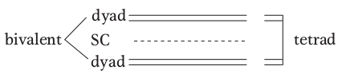
```

- The bivalents of all chromosomes move to the cell’s equator, and, when the cell divides, one dyad moves into each new cell, pulled by spindle fibers attached to the centromeres. 
- In the second cell division of meiosis, the centromeres divide and each member of a dyad (each member of a pair of chromatids) moves into a daughter cell. Hence, although the process starts with the same genomic content as that for mitosis, the two successive segregations result in four haploid cells.
- Each of the four haploid cells that constitute the four products of meiosis contains one member of a tetrad; hence, the group of four cells is sometimes called a tetrad, too.

<!-- ## Stages of meiosis -->

<!-- \begin{columns}[T,onlytextwidth] -->

<!--   \column{0.48\textwidth} -->

<!-- Leptotene -->

<!-- The chromosomes become visible as long, thin single threads. Chromosomes begin to contract and continue contracting throughout the entire prophase. -->

<!-- ```{r meiosis-leptotene, out.width="50%", fig.align='center'} -->
<!-- 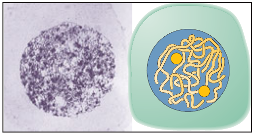 -->
<!-- ``` -->

<!--   \column{0.48\textwidth} -->

<!-- Zygotene -->

<!-- The threads form pairs as each chromosome progressively aligns, or synapses, along the length of its homologous partner. -->

<!-- ```{r meiosis-zygotene, out.width="58%", fig.align='center'} -->
<!-- 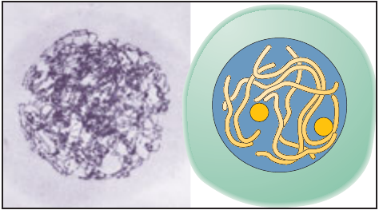 -->
<!-- ``` -->

<!-- \end{columns} -->

<!-- Pachytene -->

<!-- Chromosomes are thick and fully synapsed. Thus, the number of pairs of homologous chromosomes is equal to the number n. -->

<!-- ```{r meiosis-pachytene, out.width="58%", fig.align='center'} -->
<!-- 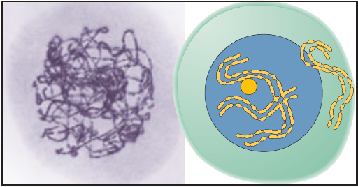 -->
<!-- ``` -->

<!-- Diplotene -->

<!-- Although the DNA has already replicated during the premeiotic S phase, this fact first becomes manifest only in diplotene as each chromosome is seen to have become a pair of sister chromatids. The synapsed structure now consists of a bundle of four homologous chromosomes. The paired homologs separate slightly, and one or more cross-shaped structures called chiasmata (singular, chiasma) appear between nonsister chromatids. -->

<!-- ```{r meiosis-diplotene, out.width="58%", fig.align='center'} -->
<!-- 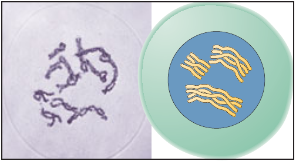 -->
<!-- ``` -->

<!-- Diakinesis -->

<!-- Further chromosome contraction produces compact units that are very maneuverable. -->

<!-- ```{r meiosis-diakinesis, out.width="58%", fig.align='center'} -->
<!-- 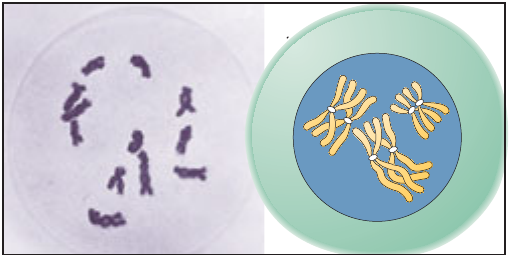 -->
<!-- ``` -->

<!-- Metaphase I -->

<!-- The nuclear membrane has disappeared, and each pair of homologs takes up a position in the equatorial plane. At this stage of meiosis, the centromeres do not divide; this lack of division is a major difference from mitosis. The two centromeres of a homologous chromosome pair attach to spindle fibers from opposite poles.  -->

<!-- ```{r meiosis-metaphasei, out.width="58%", fig.align='center'} -->
<!-- 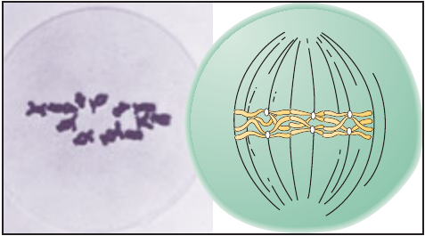 -->
<!-- ``` -->

<!-- Anaphase I -->

<!-- The members of each homologous pair move to opposite poles. -->

<!-- \begin{columns}[T,onlytextwidth] -->

<!--   \column{0.48\textwidth} -->

<!-- Anaphase (Early) I -->

<!-- ```{r meiosis-early-anaphasei, out.width="58%", fig.align='center'} -->
<!-- 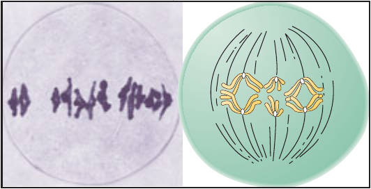 -->
<!-- ``` -->

<!--   \column{0.48\textwidth} -->

<!-- Anaphase (Late) I -->

<!-- ```{r meiosis-late-anaphasei, out.width="58%", fig.align='center'} -->
<!-- 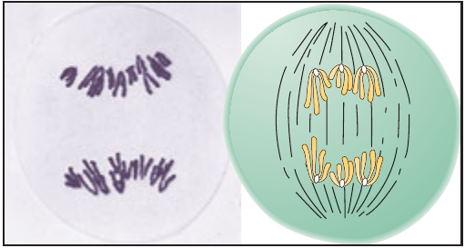 -->
<!-- ``` -->

<!-- \end{columns} -->

<!-- Telophase I and Interphase -->

<!-- The chromosomes elongate and become diffuse, the nuclear membrane re-forms and the cell divides. After telophase I, there is an interphase, called interkinesis. In many organisms, telophase I and interkinesis do not exist or are brief in duration. In any case, there is never DNA synthesis at this time, and the genetic state of the chromosomes does not change. -->

<!-- \begin{columns}[T,onlytextwidth] -->

<!--   \column{0.48\textwidth} -->

<!-- Telophase -->

<!-- ```{r meiosis-telophasei, out.width="58%", fig.align='center'} -->
<!-- 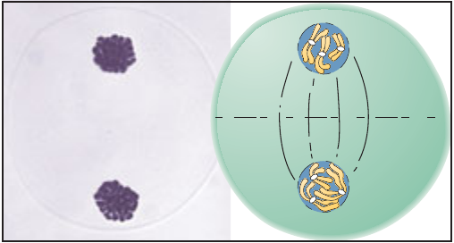 -->
<!-- ``` -->

<!--   \column{0.48\textwidth} -->

<!-- Interphase II -->

<!-- ```{r meiosis-interphaseii, out.width="58%", fig.align='center'} -->
<!-- 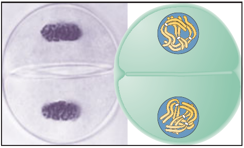 -->
<!-- ``` -->

<!-- \end{columns} -->

<!-- Prophase II -->

<!-- The haploid number of sister chromatid pairs are now present in contracted state. -->

<!-- ```{r meiosis-prophaseii, out.width="58%", fig.align='center'} -->
<!-- 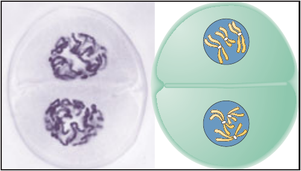 -->
<!-- ``` -->

<!-- Metaphase II -->

<!-- The pair of sister chromatids arrange themselves on the equatorial plane. Here the chromatids often partly dissociate from each other instead of being closely pressed together as they are in mitosis. -->

<!-- ```{r meiosis-metaphaseii, out.width="58%", fig.align='center'} -->
<!-- 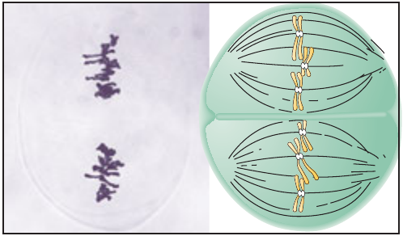 -->
<!-- ``` -->

<!-- Anaphase II -->

<!-- Centromeres split and sister chromatids are pulled to opposite poles by the spindle fibers. -->

<!-- ```{r meiosis-anaphaseii, out.width="58%", fig.align='center'} -->
<!-- 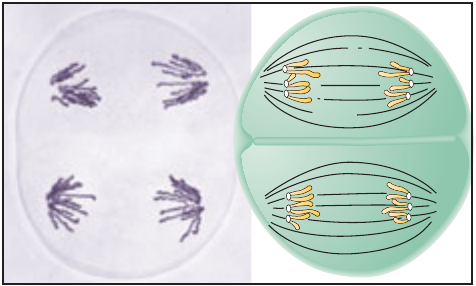 -->
<!-- ``` -->

<!-- Telophase II -->

<!-- The nuclei re-form around the chromosomes at the poles. -->

<!-- ```{r meiosis-telophaseii, out.width="58%", fig.align='center'} -->
<!-- 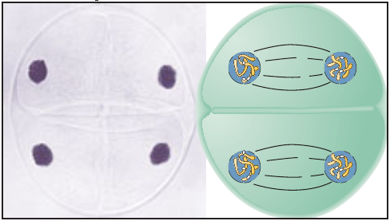 -->
<!-- ``` -->


<!-- The tetrad and young pollen grains -->

<!-- In the anthers of a flower, the four products of meiosis develop into pollen grains. In other organisms, the products of meiosis differentiate into other kinds of structures, such as sperm cells in animals. -->

<!-- \begin{columns}[T,onlytextwidth] -->

<!--   \column{0.48\textwidth} -->

<!-- Tetrad -->

<!-- ```{r meiosis-tetrad, out.width="58%", fig.align='center'} -->
<!-- 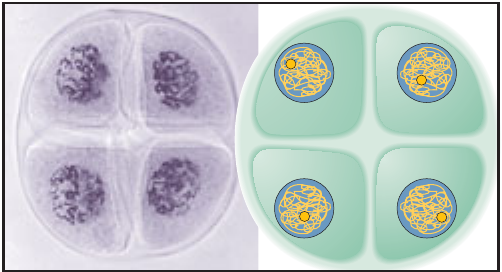 -->
<!-- ``` -->

<!--   \column{0.48\textwidth} -->

<!-- Young pollen grain -->

<!-- ```{r meiosis-young-pollen, out.width="58%", fig.align='center'} -->
<!-- 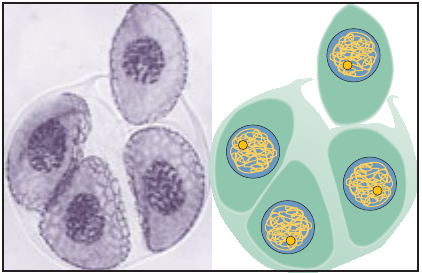 -->
<!-- ``` -->

<!-- \end{columns} -->

## Conclusion

Hence, after study of meiotic diagrams and comparing and contrasting among several stages of a cell cycle, we understand that meiotic division of cell results into haploid/gametic chromosome number containing daughter cells.
