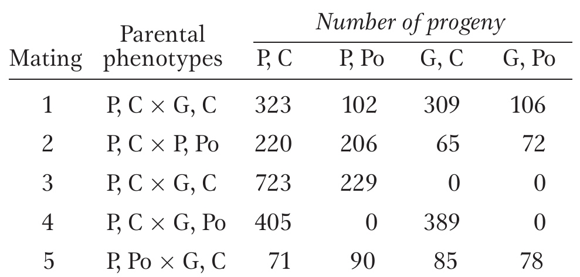

# Numerical problems on law of independent assortment

## Question 1

In tomatoes, one gene determines whether the plant has purple (P) or green (G) stems, and a separate, independent gene determines whether the leaves are "cut" (C) or "potato" (Po). Five matings of tomato-plant phenotypes give the following results. 

1. Which alleles are dominant ?
2. What are the most probable genotypes for the parents in each cross ?
  
```{r independent-assortment-example, out.width="40%", fig.align='center'}
# pdftools::pdf_convert("../../literatures/textbooks/Introduction to Genetic Analysis/Griffiths - An Introduction to Genetic Analysis 11th Edition c2015.pdf",
#                       pages = 148,
#                       dpi = 300, format = "png",
#                       filenames = "../images/independent_assortment_example1.png")


```


## Solution 1

Dominance and parental genotype determination

- Cross 2 indicates that purple (G) is dominant over green (g), and cross 1 indicates that cut (P) is dominant over potato (p).

```{r}
cross_tomato <- tribble(~"cross", ~"observed_approximate_ratio", 
        "Cross 1: G/g; P/p x g/g; P/p", "There are 3 cut:1 potato, and 1 purple: 1 green", 
        "Cross 2: G/g; P/p x G/g; p/p", "There are 3 purple: 1 green, and 1 cut: 1 potato", 
        "Cross 3: G/G; P/p x g/g; P/p", "There is no green, and there are 3 cut: 1 potato", 
        "Cross 4: G/g; P/P x g/g; p/p", "There is no potato, and there is 1 purple: 2", 
        "Cross 5: G/g; p/p x g/g; P/p", "There is 1 cut: 1 potato, and there is 1 purple: 1 green")

cross_tomato %>% 
  rename_all(function(x)str_replace_all(x, "_", " ") %>% 
               str_to_sentence()) %>% 
  knitr::kable(booktabs = TRUE) %>% 
  kableExtra::kable_styling(latex_options = "striped", position = "center", font_size = 10)
```

## Question 3

A presumed dihybrid in Drosophila, B/b ; F/f is test- crossed with b/b ; f/f. (B = black body ; b = brown body; F = forked bristles; f = unforked bristles.) The results are,

- Black, forked (BF) : 230
- Black, unforked (Bf) : 210
- Brown, forked (bF) : 240
- Brown, unforked (bf) : 250

Use the Chi-square test to determine if these results fit the results expected from testcrossing the hypothesized dihybrid.

## Solution 3

If there is _no_ linkage, that is, the genes assort independently, we have seen that the following phenotypic proportions are expected in progeny:

```{r}
require(infer)
bf_df <- tribble(~"Phenotype", ~"Proportion", 
        "BF", 230,
        "Bf", 210,
        "bF", 240,
        "bf", 250)

bf_df_chi <- chisq.test(set_names(bf_df$Proportion, nm = bf_df$Phenotype), 
           correct = FALSE, 
           p = c(0.25, 0.25, 0.25, 0.25))

bf_df_chi %>% 
  broom::tidy() %>% 
  knitr::kable(booktabs = TRUE) %>% 
  kableExtra::kable_styling(position = "center", font_size = 8)
  
observed_statistic <- bf_df %>% 
  transmute(sim_category = map2(Proportion, Phenotype, ~rep(.y, .x))) %>% 
  unnest(sim_category) %>% 
  specify(response = sim_category)  %>% 
  hypothesize(null = "point", 
              p = c("BF" = 1/4,
                    "Bf" = 1/4,
                    "bF" = 1/4,
                    "bf" = 1/4)) %>% 
  calculate(stat = "Chisq")
  
observed_pvalue <- bf_df %>% 
  transmute(sim_category = map2(Proportion, Phenotype, ~rep(.y, .x))) %>% 
  unnest(sim_category) %>% 
  specify(response = sim_category)  %>% 
  hypothesize(null = "point", 
              p = c("BF" = 1/4,
                    "Bf" = 1/4,
                    "bF" = 1/4,
                    "bf" = 1/4)) %>% 
  generate(reps = 100, type = "simulate") %>%
  calculate(stat = "Chisq") %>%
  # visualise() %>% 
  get_p_value(obs_stat = observed_statistic, direction = "greater")
  
```

There is clearly a deviation from the absolute expected proportion, which is the case of having no linkage between genes.

However, we know that chance deviations can provide results that resemble those produced by genetic processes; hence we, need the $\chi^2$ test to help calculate the probability of a chance deviation of this magnitude form a 1:1:1:1 ratio. If that hypothesis is rejected, we can infer linkage.

The test statisic $\chi^2$ is obtained by:

$$
\chi^2 = \frac{\left[\sum|observed-expected|-\frac{1}{2}\right]^2}{expected}
$$


```{r chi-sqrt-linkage, message=FALSE, warning=FALSE, echo=FALSE}
chi_sqrt_linkage <- tribble(~"Phenotype", ~"Proportion", 
        "BF", 0.25,
        "Bf", 0.25,
        "bF", 0.25,
        "bf", 0.25)

chi_sqrt_linkage %>% 
  kable(booktabs = TRUE, escape = FALSE, 
      caption = "Chi-square calculations for the hypothesis that the observations of four phenotypic classes is obtained due to no linkage between loci B and F.") %>% 
  kableExtra::kable_styling(latex_options = "striped", font_size = 8)
```

<!-- ```{r chi-sqrt-values, echo=FALSE, message=FALSE} -->
<!-- # Set p-values -->
<!-- p <- c(0.995, 0.99, 0.975, 0.95, 0.90, 0.10, 0.05, 0.025, 0.01, 0.005) -->
<!-- # Set degrees of freedom -->
<!-- df <- c(seq(1,20),25,30,35,40,50,100) -->
<!-- # Calculate a matrix of chisq statistics -->
<!-- m <- outer(p, df, function(x,y) qchisq(x,y)) -->
<!-- # Transpose for a better view -->
<!-- m <- t(m) -->
<!-- # Set column and row names -->
<!-- colnames(m) <- rev(p) -->
<!-- rownames(m) <- df -->
<!-- kable(m, format = "latex", booktabs = TRUE, escape = TRUE,  -->
<!--       caption = "The probabilities of exceeding different chi-square values for degrees of freedom from 1 to 50 when the expected hypothesis is true") %>%  -->
<!--   kableExtra::kable_styling(latex_options = "striped", font_size = 5) %>%  -->
<!--   kableExtra::column_spec(6, border_left = TRUE) -->
<!-- ``` -->

Since there are four genotypic classes, we must use 4-1 = 3 degrees of freedom. Consulting the $\chi^2$ table, we see our values of `r observed_statistic[[1]]` and 3 df give a p value of `r observed_pvalue[[1]]`. This is more than the standard cut-off value of 5 %, so we cannot reject the hypothesis of no linkage.

Hence, we are left with the conclusion that the genes are not linked.

## Question 4

(Effective crossing) A corn geneticist has three pure lines of genotypes a/a; B/B; C/C, A/A; b/b; C/C, and A/A; B/B; c/c. All the phenotypes determined by a, b and c will increase the market value of the corn; so, naturally, he wants to combine them all in one pure line of genotype a/a; b/b; c/c.

  1. Outline an effective crossing program that can be used to obtain the a/a; b/b; c/c pure line.
  2. At each stage, state exactly which phenotypes will be selected and give their expected frequencies.
  3. Is there more than one way to obtain the desired genotype ? Which is the best way ? (Assume independent assortment of the three gene pairs.)

## Solution 4

1. Begin with any two of the three lines and cross them. If, for example, you began with a/a; B/B; C/C x A/A; b/b; C/C, all the progeny would be A/a; B/b; C/C. Crossing two of them would yield:

$$
\begin{aligned}
& 9  & A/\_; B/\_; C/C \\
& 9  & a/a; B/\_; C/C \\
& 9  & A/\_; b/b; C/C \\
& 9  & a/a; b/b; C/C
\end{aligned}
$$

\renewcommand{\arraystretch}{2}

```{r gamete-three-combination}
# gamete types
gamete_types <- expand.grid(c("A", "a"), 
                            c("B", "b"), 
                            c("C", "c")) %>% 
  unite(col = "gamete_types", sep = "") %>% 
  pull("gamete_types")
# random mating of gametes
combination_genotypes <- crossing(p2_gamete = gamete_types, p1_gamete = gamete_types) %>% 
  # group_by(gamete_types)
  unite(col = "genotype", remove = FALSE, sep = "") %>% 
  spread(key = p1_gamete, value = genotype)
genotype_orderer <- function(x){
  map_chr(x, function(y){
    str_extract_all(y, "") %>% 
      unlist() %>% 
      str_sort(decreasing = FALSE) %>% 
      paste0(collapse = "")
  })
}
combination_genotypes <- combination_genotypes %>% 
  mutate_all(list(~genotype_orderer(.)))
# # number of unique genotypes
# ca <- c("AA", "Aa", "aa")
# cb <- c("BB", "Bb", "bb")
# cc <- c("CC", "Cc", "cc")
# unique_genotypes <- expand.grid(ca, cb, cc) %>% 
#   unite(col = "all_gametes", sep = "") %>% 
#   pull(all_gametes) %>% 
#   unique()
# manually specify colors
seven_colors <- c("#ffe6ff", "#1a1aff", "#cc3399", "#4d004d", "#ffb31a", "#00994d", "#80ffff")
fanta <- function(x)(stringi::stri_extract_all_regex(x, ".") %>%
                       map(unlist) %>%
                       map_int(~str_detect(.x, "[A-Z]") %>%
                                 sum()))
combination_genotypes %>%
  rename("Gamete types" = p2_gamete) %>% 
  mutate_at(2:9, list(~case_when(
    fanta(.) == 0 ~ kableExtra::cell_spec(., "latex", background = seven_colors[1]),
    fanta(.) == 1 ~ kableExtra::cell_spec(., "latex", background = seven_colors[2]),
    fanta(.) == 2 ~ kableExtra::cell_spec(., "latex", background = seven_colors[3]),
    fanta(.) == 3 ~ kableExtra::cell_spec(., "latex", background = seven_colors[4]),
    fanta(.) == 4 ~ kableExtra::cell_spec(., "latex", background = seven_colors[5]),
    fanta(.) == 5 ~ kableExtra::cell_spec(., "latex", background = seven_colors[6]),
    fanta(.) == 6 ~ kableExtra::cell_spec(., "latex", background = seven_colors[7]),
    TRUE ~ .
  ))) %>%
  kable(booktabs = TRUE, format = "latex", escape = FALSE, linesep = "") %>%
  kableExtra::kable_styling(latex_options = "scale_down", font_size = 8)
```

\renewcommand{\arraystretch}{1}

- The a/a; b/b; C/C genotype has two of the gens in a homozygous recessive state and is found in 1/16 of the offspring. 
2. If that phenotype were crossed with A/A; B/B; c/c, all the progeny would be heterozygous for all loci. Crossing two (selfing) of thus obtained individuals would lead to a 27:9:9:9:3:3:3:1 ratio and 1/64 of the progeny would be the desirable a/a; b/b; c/c.
3. There are several different routes to obtaining a/a; b/b; c/c, but the one just outlined only requires four crosses.
