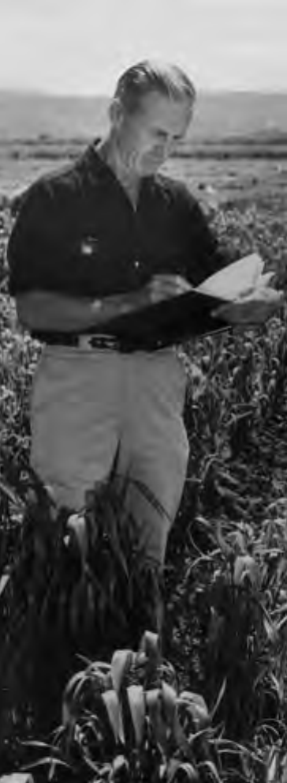
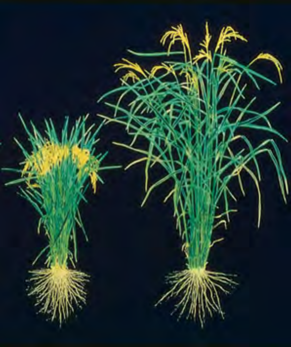
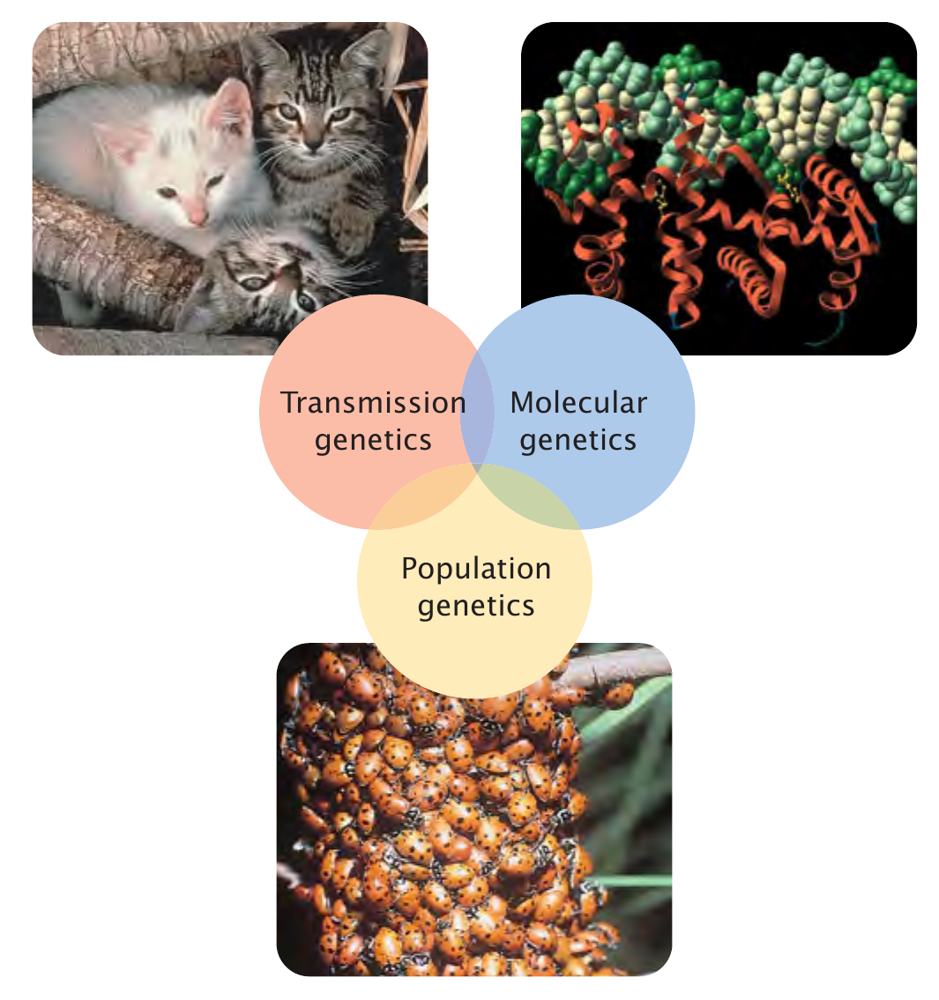
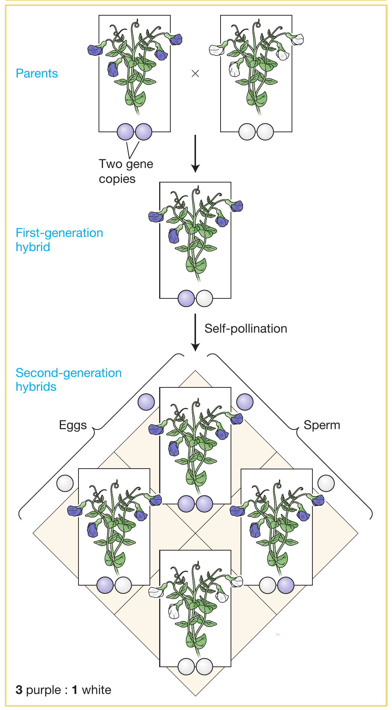
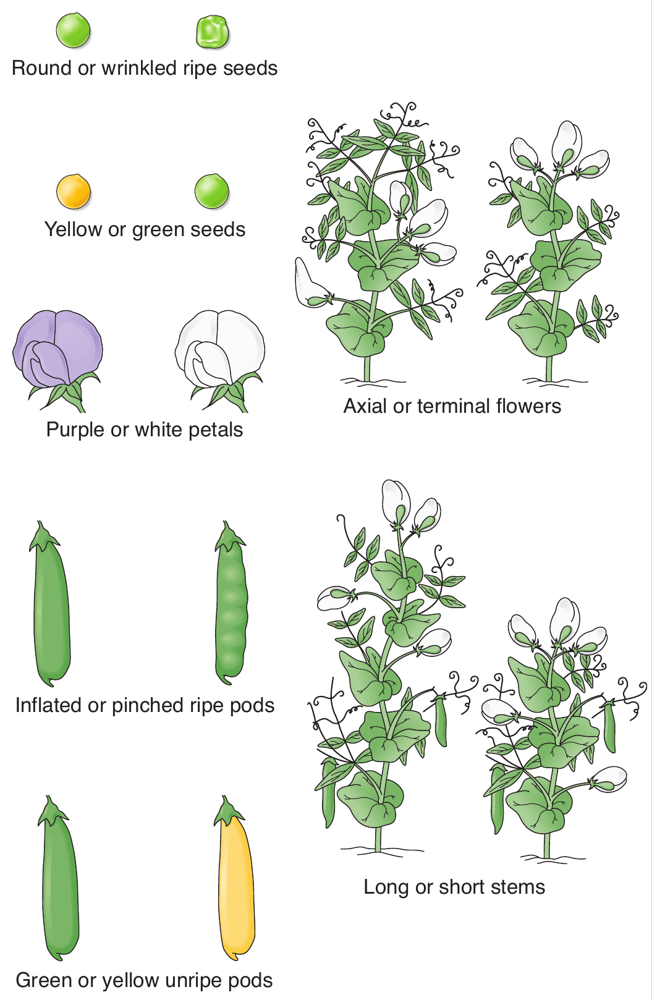
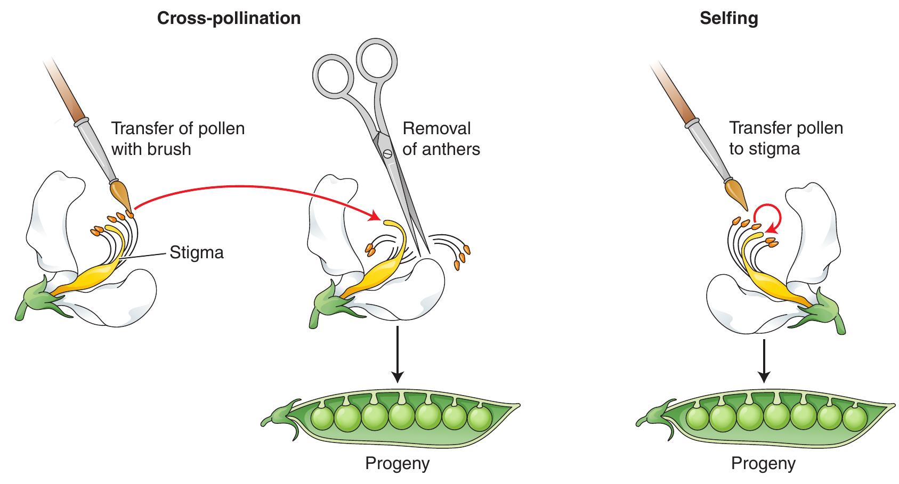
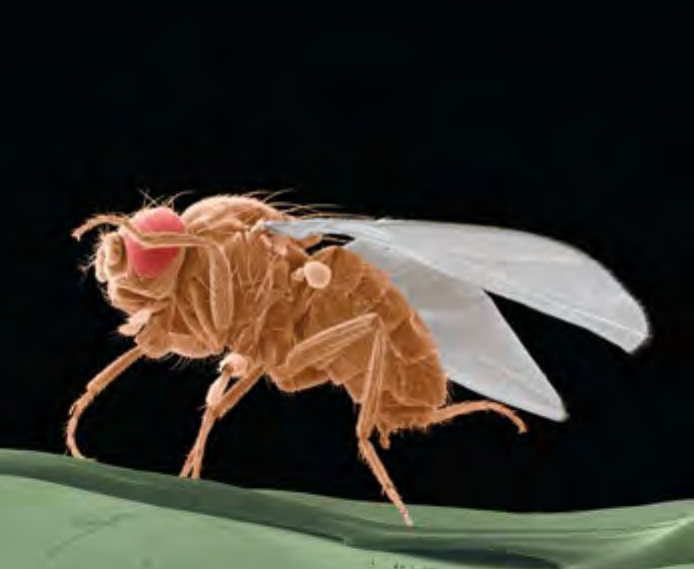
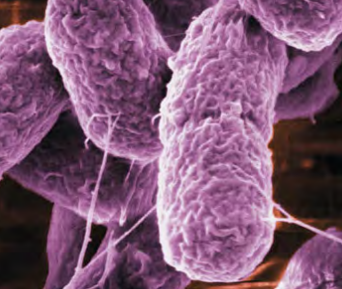
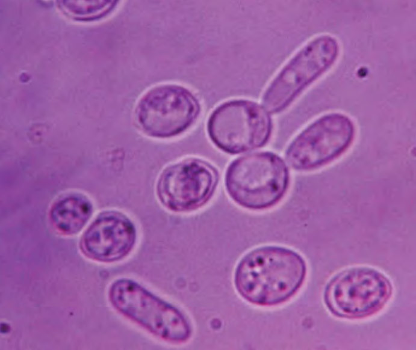
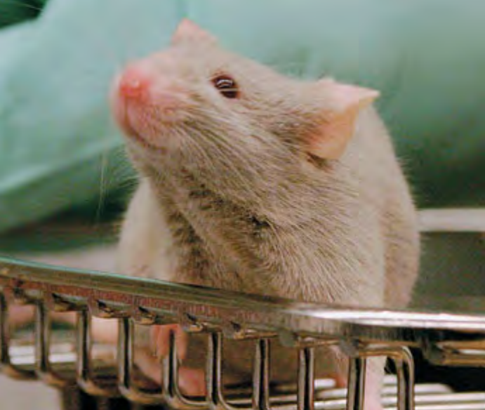

```{r,setup, include=FALSE}
library(knitr)
require(tidyverse)
set.seed(453)
# invalidate cache when the package version changes
knitr::opts_chunk$set(tidy = FALSE, echo = FALSE, 
                  message = FALSE, warning = FALSE,
                  out.width = "45%", cache = TRUE)
options(knitr.table.format = "latex")
options(knitr.kable.NA = "", digits = 2)
options(kableExtra.latex.load_packages = FALSE)
```

# Why ?

## Why study genetics ?

::: incremental

- Pivotal position in biology
- Central to human affairs
- Can we stay ignorant about genetic issues ?
- What does headlines today read ?

:::

# What ?

## Reach

::: incremental

- What does it not affect ?
- Since how long have we been practicing ?
- The major drive of the green revolution
- Don't we consume engineered drugs ?

:::

##

\begin{columns}[T,onlytextwidth]
  
  \column{0.5\textwidth}

```{r green-revolution-borlaug, fig.cap="Norman Borlaug, a leader in the development of new strains of wheat that led to the Green Revolution. Borlaug was awarded the Nobel Peace Prize in 1970.", out.width="38%"}
# pdftools::pdf_convert("~/Desktop/BSc_Ag_lectures/literatures/textbooks/General/Pierce Genetics Essentials Concepts Connections 1st txtbk.PDF", pages = 25, dpi = 300, filenames = "../images/green_revolution_borlaug.png", format = "png")


```

  \column{0.5\textwidth}

```{r green-revolution-crop, fig.cap="Modern, high-yielding rice plant (left) and traditional rice plant (right)", out.width="80%"}
# pdftools::pdf_convert("~/Desktop/BSc_Ag_lectures/literatures/textbooks/General/Pierce Genetics Essentials Concepts Connections 1st txtbk.PDF", pages = 25, dpi = 300, filenames = "../images/green_revolution_crop.png", format = "png")


```

\end{columns}

## Definition

### Study of heredity

- Why cats always have kittens and humans always have babies ?
- Why do children resemble their parents ?
- Why two people are never same ?

::: incremental

### Etymology

- "gene"
- At any level of study genes are central
- Genes have unique nature to perform their biological roles -- replication, information bearing/generation of form and mutation

:::

## Subdivision

```{r genetics-subdivision, fig.cap="Subdivision of genetics into three interrelated fields", out.width="45%"}
# pdftools::pdf_convert("~/Desktop/BSc_Ag_lectures/literatures/textbooks/General/Pierce Genetics Essentials Concepts Connections 1st txtbk.PDF", pages = 27, dpi = 300, filenames = "../images/genetics_subdivision.png", format = "png")


```

# How ?

## Gregor Mendel

- Blending theory of inheritance
- Mendelian theory of inheritance

## Mendel's Experiment

\begin{columns}[T,onlytextwidth]
  
  \column{0.5\textwidth}

```{r mendels-experiment, fig.cap="The mating scheme for Mendel’s experiment involving the crossing of purple- and white- flowered varieties of pea plants. The purple and white circles signify the gene variants for purple vs. white flower color. Gametes carry one gene copy; the plants each carry two gene copies. The $\times$ signifies a cross-pollination between the purple -- and white-flowered plants.", out.width="35%"}
# pdftools::pdf_convert("~/Desktop/BSc_Ag_lectures/literatures/textbooks/Introduction to Genetic Analysis/Griffiths - An Introduction to Genetic Analysis 11th Edition c2015.pdf",
#                       pages = 29, dpi = 300,
#                       filenames = "../images/mendels_experiment.png",
#                       format = "png")

```
  
  \column{0.5\textwidth}

```{r mendels-pea, fig.cap="\\textbf{The seven phenotypic pairs studied by Mendel; For each character Mendel studied two contrasting phenotypes} \\newline ", out.width="50%"}
# pdftools::pdf_convert("~/Desktop/BSc_Ag_lectures/literatures/textbooks/Introduction to Genetic Analysis/Griffiths - An Introduction to Genetic Analysis 11th Edition c2015.pdf",
#                       pages = 61, dpi = 300,
#                       filenames = "../images/mendels_pea.png",
#                       format = "png")


```

\end{columns}

## The crossing

```{r crossing-pea, fig.cap="Cross-pollination and selfing are two types of crosses", out.width="80%"}
# pdftools::pdf_convert("~/Desktop/BSc_Ag_lectures/literatures/textbooks/Introduction to Genetic Analysis/Griffiths - An Introduction to Genetic Analysis 11th Edition c2015.pdf",
#                       pages = 62, dpi = 300,
#                       filenames = "../images/crossing_selfing.png",
#                       format = "png")


```

## Model organisms

\begin{columns}[T,onlytextwidth]
  
  \column{0.33\textwidth}
  
```{r model-organisms-drosophila, fig.cap="\\textit{Drosophila melanogaster}", out.width="80%"}
# pdftools::pdf_convert("~/Desktop/BSc_Ag_lectures/literatures/textbooks/General/Pierce Genetics Essentials Concepts Connections 1st txtbk.PDF", pages = 28, dpi = 300, filenames = "../images/model_organisms.png", format = "png")


```

  \column{0.33\textwidth}

```{r model-organisms-ecoli, fig.cap="\\textit{Escherichia coli}", out.width="80%"}
# pdftools::pdf_convert("~/Desktop/BSc_Ag_lectures/literatures/textbooks/General/Pierce Genetics Essentials Concepts Connections 1st txtbk.PDF", pages = 28, dpi = 300, filenames = "../images/model_organisms.png", format = "png")


```

  \column{0.33\textwidth}

```{r model-organisms-caenorhabditis, fig.cap="\\textit{Caenorhabditis elegans}", out.width="80%"}
# pdftools::pdf_convert("~/Desktop/BSc_Ag_lectures/literatures/textbooks/General/Pierce Genetics Essentials Concepts Connections 1st txtbk.PDF", pages = 28, dpi = 300, filenames = "../images/model_organisms.png", format = "png")

knitr::include_graphics("../images/model_organisms_elegans.png")
```

\end{columns}

##

\begin{columns}[T,onlytextwidth]
  
  \column{0.33\textwidth}

```{r model-organisms-arabidopsis, fig.cap="\\textit{Arabidopsis thaliana}", out.width="80%"}
# pdftools::pdf_convert("~/Desktop/BSc_Ag_lectures/literatures/textbooks/General/Pierce Genetics Essentials Concepts Connections 1st txtbk.PDF", pages = 29, dpi = 300, filenames = "../images/model_organisms.png", format = "png")


```

  \column{0.33\textwidth}

```{r model-organisms-cerevisiae, fig.cap="\\textit{Saccharomyces cerevisiae}", out.width="80%"}
# pdftools::pdf_convert("~/Desktop/BSc_Ag_lectures/literatures/textbooks/General/Pierce Genetics Essentials Concepts Connections 1st txtbk.PDF", pages = 29, dpi = 300, filenames = "../images/model_organisms.png", format = "png")


```

  \column{0.33\textwidth}

```{r model-organisms-mus, fig.cap="\\textit{Mus musculus}", out.width="80%"}
# pdftools::pdf_convert("~/Desktop/BSc_Ag_lectures/literatures/textbooks/General/Pierce Genetics Essentials Concepts Connections 1st txtbk.PDF", pages = 29, dpi = 300, filenames = "../images/model_organisms.png", format = "png")


```

\end{columns}

# Fundamental concepts of genetics

##

::: incremental

- Cells are of two basic types: \alert{Eukaryotic} and \alert{prokaryotic}
- The gene is the fundamental unit of heredity
- Genes come in multiple forms called alleles
- Genes confer phenotypes
- Genetic information is carried in DNA and RNA
- Genes are located on chromosomes
- Chromosomes separate through the process of mitosis and meiosis
- Genetic information is transferred from DNA to RNA to protein
- Mutations are permanent, heritable changes in genetic information
- Some traits are affected by multiple factors
- Evolution is genetic change

:::

# Bibliography
