```{r,setup, include=FALSE}
library(knitr)
require(tidyverse)
set.seed(453)
# invalidate cache when the package version changes
knitr::opts_chunk$set(tidy = FALSE, echo = FALSE, 
                  message = FALSE, warning = FALSE,
                  out.width = "45%", cache = TRUE)
options(knitr.table.format = "latex")
options(knitr.kable.NA = "", digits = 2)
options(kableExtra.latex.load_packages = FALSE)
```

```{r model-organisms-cover, out.width="80%", fig.align='center'}
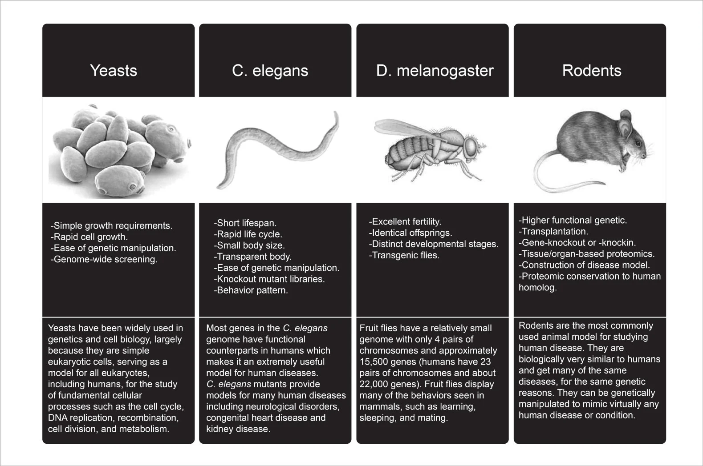
```

# Escherichia coli

##

- _E. coli_ is a gram negative, facultative anaerobic, rod-shaped, coliform bacterium that is commonly found in the lower intestine of warm-blooded organisms.
- _E. coli_ is the most widely studied prokaryotic unicellular model organism. 
- Most _E. coli_ strains are harmless, but some can cause serious food poisoning. Shiga toxin-producing _E. coli_ (STEC) is a bacterium that can cause severe foodborne disease.
- Can grow with or without oxygen. 
- _E. coli_ is about 2.0 micrometer long and 0.25-1.0 micrometer in diameter with a cell volume of 0.6-0.7 micro cubic meter.
- Because _E. coli_ can be obtained from the human gut, it is easy to culture.

## Taxonomy and classification


## Morphology

- Bacteria is arranged singly or in pairs.
- It is motile due to peritrichous flagella.
- Some strains are non-motile. 
- Some strains may be fimbriated. 
- The fimbriae are of type 1 (hemagglutinating and mannose-sensitive) and are present in both motile and non-motile strains.
- ome strains of _E. coli_ isolated from extra-intestinal infections have polysaccharide capsule.
- They are non-sporing.
They have thin cell wall with only 1 or 2 layers of peptidoglycan.
- They are facultative anaerobes.
- Growth occurs over a wide range of temperature from $15-45^{\circ}C$.

##

```{r bacteria-colony, out.width="48%", fig.align='center'}
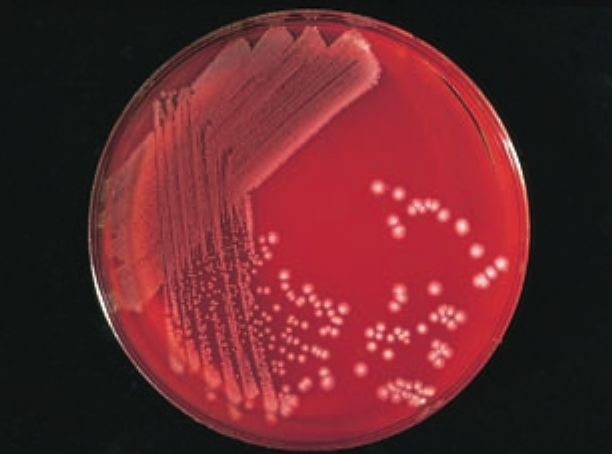
```

## Genetics

- Genome size: 4.6Mb
- Chromosomes: Circular
- No.of genes: 4000
- Percentage with human chromosomes: 8%
- Average gene density: 1 kb, no introns
- Gene sequenced: 1997

## Reproduction

- _E.coli_ reproduces by two meams:
  - cell division
  - the transfer of genetic material through a sex pilus (conjugation).
- It takes about fourty minutes to make one complete copy of the _E.coli_ genome.Therefore each generation of _E.coli_ should last just under on hour.
- Instead _E.coli_ can divide (under ideal condition) in as little as 20 minutes.
- Prokaryotes reproduce asexually through binary fission.
- The cell divides leaving two copies of original bacterium called daughter cells 

##

- In binary fission, the haploid genome replicates and partitions with the dividing cell.
- In conjugation (sexual cycle; discovered by J. Lederberg and E. Tatum), genetically differentiated "sexes" fuse and exchange some or all of their genomes, sometimes leading to recombination.
- "Males" can convert "females" into males by the transmission of a particular plasmid (extragenomic 100-kb DNA) called F (determines a type of maleness).
- F+ cells act as male "donors".
- The F plasmid can integrate into the chromosome to form an Hfr cell type, which transmits the chromosome linearly into F- recipients.
- Other plasmids (e.g. drug-resistance gene carrying) are also found in _E. coli_ in nature.

## Mutation studies

\footnotesize

- Null mutation of any essential gene will result in no growth; these mutations can be selected by adding penicillin.
- Mutations affecting the expression of a specific gene of interest can be screened by fusing it to a reporter gene such as the _lac_ Z gene.
- After a set of mutants affecting the process of interest have been obtained, the mutations are sorted into their genes by recombination and complementation.
- These genes are cloned and sequenced to obtain clues to function.
- In _E. coli_ crosses are used to map mutations and to produce specific cell types. Recombinants are made by mixing Hfr cells (having an integrated F plasmid) and F- cells. Generally an Hfr donor transmits part of bacterial genome, forming a temporary merozygote in which recombination takes place.
- Hfr crosses can be used to perform mapping by time-of-marker entry or by recombinant frequency. By transfer of F' derivatives carrying donor genes to F-, it is possible to make stable partial diploids to study gene interaction or dominance.

## Studies

- A German pediatrician named Odor Escheriehia in 1885 discovered _E.coli_ in the faeces of healthy individual and named it Bacterium coli because of the fact that it is found in the colon.
- Early prokaryotic classification based on their motility and shape
- Afterwards E.haeckel's bacteria classification placed bacteria in the monera kingdom
- In 1985 Migula reclassified bacteria in the genus Escheria which was named  so after its discover. This genus belongs to the bacterial group formally called 'coliforms' which are member of the enterics known as Enterubacterialeae family
- Because of its long history of laboratory culture and ease of manipulation _E.coli_ plays an important role in modern biological egineering and industrial microbiology.

## Suitability as model organism

- Rapid reproduction and small size
- Under optimal condition,they can reproduce every 20 minutes,in a mere 7 hours, a single bacterial cells can give rise to more than 2 million descendants.
- Thus enormous numbers of cells can be grown quickly,so that even very rare mutations will appear in a short period of time.
- Consequently,numerous mutations in _E.coli_ everything from colony appearance to drug resistance, have been isolated and characterized.
- _E.coli_ is easy to culture in the laboratory in liquid medium or on solid medium within petri plates.
- In liquid culture, _E.coli_ cells will grow to a concentration of a billion cells per millilitre and trillion of bacterial cells can be easily grown on a single test tube.

##

- When _E.coli_ cells are dilluted and spread onto the solid medium of a petridish, individual bacteria reproduce asexually, giving rise to a concentrated clump of 10 million - 100 million genetically identical cells called a colony.
- This colony formation makes it easy to isolate genetically pure strains of the bacteria
- One of the first useful  applications of recombinant DNA technology was the manipulation of _E.coli_ to produce human insulin
- Modified _E.coli_ has been used  in  vaccine development, bioremediation, production of biofuels, lightening and production  of immobilised enzymes 
- _E.coli_ is a very versatile host for the production of heterogenous protein and protein expression systems have been developed which allow the production of recombinant proteins in _E.coli_.
- Researches can introduce genes into the microbes using plasmids which permits high level expression of protein and such protein may be mass produced in industrial fermentation processes 

## 

```{r e-coli, out.width="48%", fig.align='center'}
# pdftools::pdf_convert("../../literatures/textbooks/Introduction to Genetic Analysis/Griffiths - An Introduction to Genetic Analysis 11th Edition c2015.pdf",
#                       pages = 820,
#                       dpi = 300, format = "png",
#                       filenames = "../images/escherichia_coli.png")

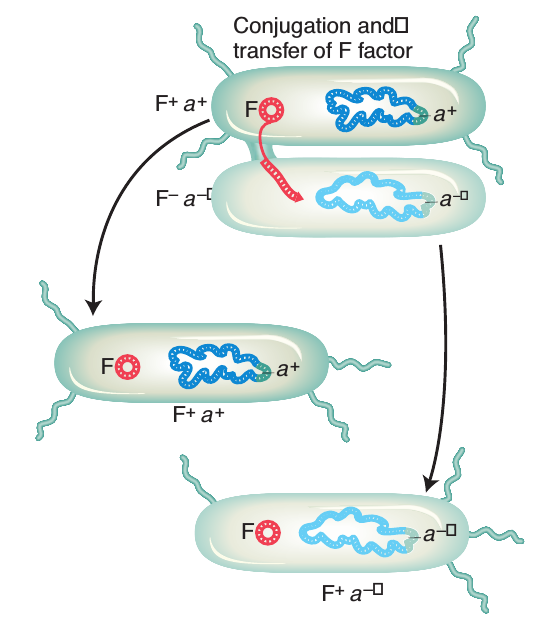
```

##

```{r e-coli2, out.width="48%", fig.align='center'}
# pdftools::pdf_convert("../../literatures/textbooks/Introduction to Genetic Analysis/Griffiths - An Introduction to Genetic Analysis 11th Edition c2015.pdf",
#                       pages = 821,
#                       dpi = 300, format = "png",
#                       filenames = "../images/escherichia_coli2.png")

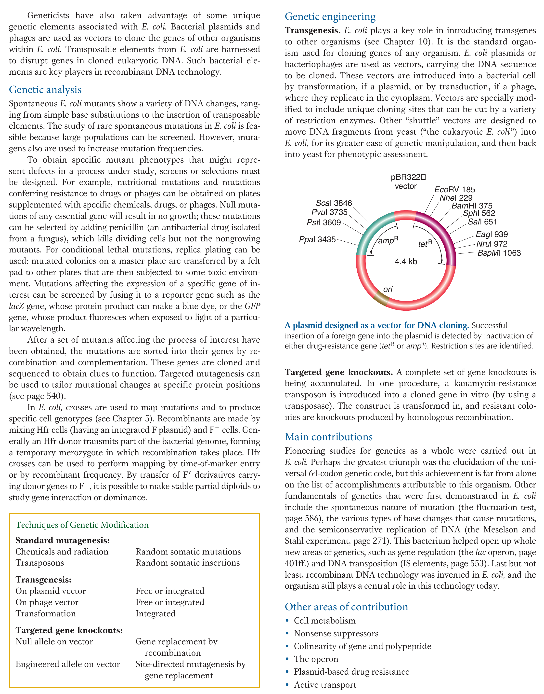
```

# Saccharomyces cerevisae

##

- Genome size: 12 Mb
- Chromosomes (n): 16
- Number of genes: 6000
- Percentage with human homologs: 25\%
- Average gene size: 1.5 kb, 0.03 intron/gene
- Transposons: Small proportion of DNA
- Genome sequenced in: 1996

##

- Belongs to Ascomycete phylum.
- Name: Yeast, Baker's yeast, Budding yeast
- Although laboratory strains are mostly haploid, cells in nature can be diploid or polyploid.
- Life cycle consists of both sexual and asexual phases(budding)
- Forms compact colonies or plates, in much the same way as bacterium.
- But like eukaryote, it has meiosis, cell cycle, and mitochondria, and these features have been at the center of the yeast success story.
- Cells are small (10 $\mu$m) and complete their cell cycle in just 90 minutes, allowing them to be produced in huge numbers in a short time.
- Cells can respire anaerobically by using the fermenatation cycle and hence can do without mitochondria, allowing mitochondrial mutants to be viable.

## Genetics analysis

- In order to make crosses in yeast (in order to build special purpose strains for screens and selections), strains of opposite mating type are simply mixed on an appropriate medium.
- The resulting a/$\alpha$ diploids are induced to undergo meiosis by using a special sporulation medium.
- Finally the ascospores may be isolated using special equipment.
- Engineered plasmid are used to produce homozygous 'a/a' or '$\alpha$/$\alpha$' strains.
- The availability of both haploid and diploid cell types provides flexibility for mutational studies.
- Haploid cells are useful for large scale selection or screens because mutant phenotypes are expressed directly.
- Diploid cells are convenient for obtaining dominant mutations, sheltering lethal mutations, performing complementation tests, and exploring gene interaction.

## Reproduction

- In sexual cycle of the yeast, cell may be haploid or diploid
- Two mating types are determined by alleles MAT$\alpha$ and MATa; when haploid cells of different mating type unite, they form a diploid cell, which can divide mitotically or undergo meiotic division.
- The products of meiosis are a nonlinear tetrad of four ascospores.

```{r s-cerevisiae, out.width="38%", fig.align='center'}
# pdftools::pdf_convert("../../literatures/textbooks/Introduction to Genetic Analysis/Griffiths - An Introduction to Genetic Analysis 11th Edition c2015.pdf",
#                       pages = 822,
#                       dpi = 300, format = "png",
#                       filenames = "../images/saccharomyces_cerevisiae.png")

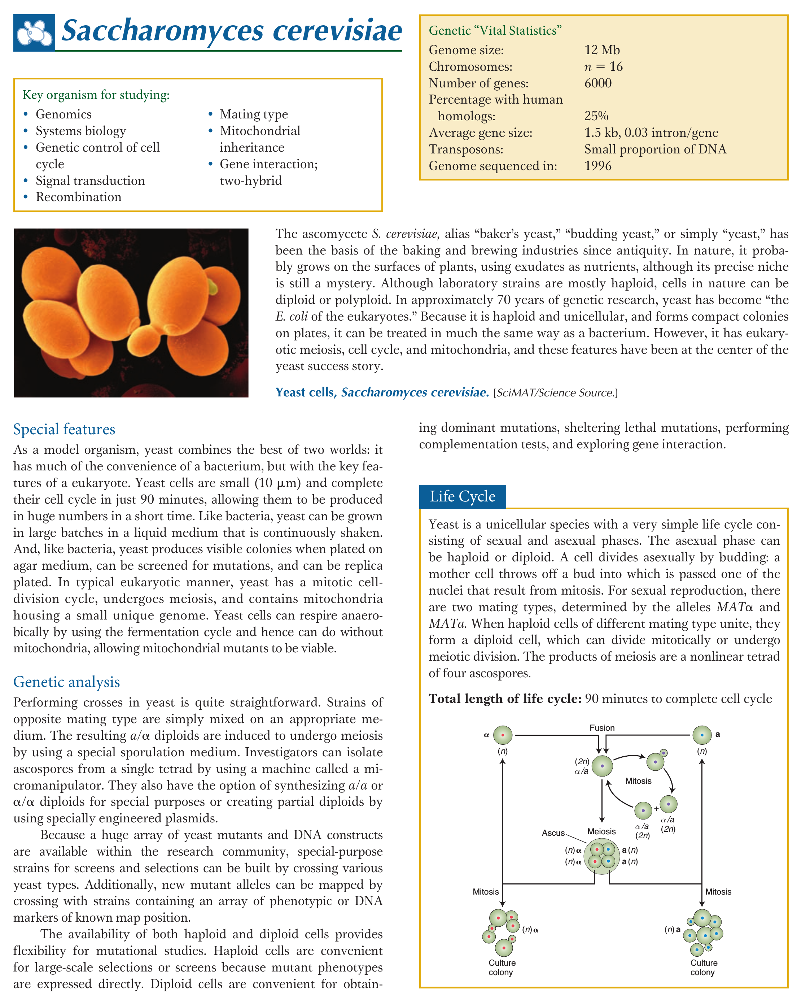
```

## Techniques of genetic manipulation

- Chemical and radiation: Random somatic mutations
- Transposon: Random somatic insertions
- Integrative plasmid: Insert by homologous recombination
- Replicative plasmid: Can replicate autonomously (2 $\mu$ or ARS origin of replication)
- Yeast artificial chromosome: Replicates and segrates as a chromosome
- Shuttle vector: Can replicate in yeast or _E. coli_
- Gene replacement: Homologous recombination replaces wild-type allele with null copy.

## Yeast vector for genetic modification

- Budding yeast are most conveniently manipulate genetically.
- Exogenous DNA is taken up easily by cells whose cell walls have been partly removed by enzyme digestion or abrasion.
- For a plasmid to replicate free of the chromosomes, it must contain a normal yeast replication origin (ARS) or a replication origin from a 2-$\mu$m plasmid found in certain yeast isolates.
- The most elaborate vector, YAC consists of an ARS, a yeast centromere and two telomeres.
- A YAC can carry large transgenic inserts, which are then inherited in the same way as Mendelian chromosome.

##

```{r s-cerevisiae2, out.width="48%", fig.align='center'}
# pdftools::pdf_convert("../../literatures/textbooks/Introduction to Genetic Analysis/Griffiths - An Introduction to Genetic Analysis 11th Edition c2015.pdf",
#                       pages = 823,
#                       dpi = 300, format = "png",
#                       filenames = "../images/saccharomyces_cerevisiae2.png")

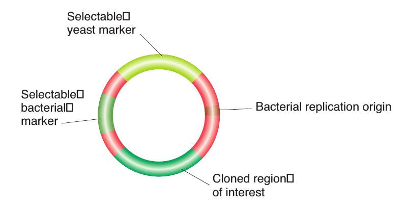
```

# Neurospora crassa

## Life cycle

\footnotesize

- _N. crassa_ has a diploid eukaryotic life cycle.
- A haploid asexual spore (called conidium) germinates to produce a germ tube that extends at its tip.
- Progressive tip growth and branching produce a mass of branched threads (called hyphae), which forms a compact colony on growth medium.
- Because hyphae have no cross walls, a colony is essentially one cell containing many haploid nuclei. The colony  buds off milion of asexual spores, which can disperse in air and repeat the sexual cycle.
- In _N crassa's_ sexual cycle, there are two identical looking mating types MAT-A and MAT-$\alpha$, which can be viewed as simple "sexes". As in yeast, two mating types are determined by two alleles of one gene.
- When colonies of different mating type come in contact, their cell walls and nuclei fuse.
- Many transient diploid nuclei arise, each of which undergoes meiosis, producing an octad of ascospores. The ascospores germinate and produce colonies exactly like those produced by asexual spores.
- It takes a period of 4 weeks for sexual cycle to complete.

##

- Because _Neurospora_ is haploid, newly obtained mutant phenotypes are easily detected with the use of various types of screens and selections.
- A favorite system for study of the mechanism of mutation is the $ad-3$ gene, because $ad-3$ mutants are purple and easily detected.

##

```{r n-crassa1, out.width="48%", fig.align='center'}
# pdftools::pdf_convert("../../literatures/textbooks/Introduction to Genetic Analysis/Griffiths - An Introduction to Genetic Analysis 11th Edition c2015.pdf",
#                       pages = 824,
#                       dpi = 300, format = "png",
#                       filenames = "../images/neurospora_crassa1.png")

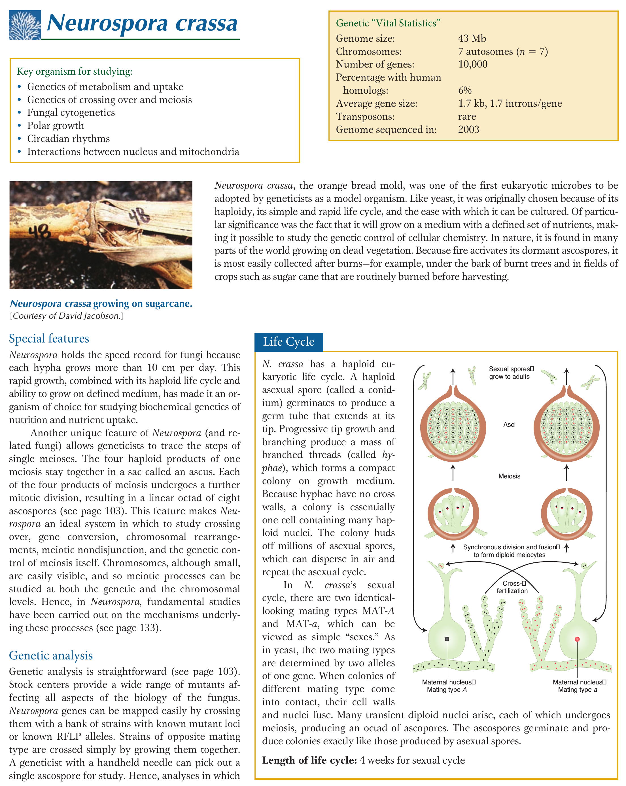
```

##

```{r n-crassa-life-cycle, out.width="38%", fig.align="center"}
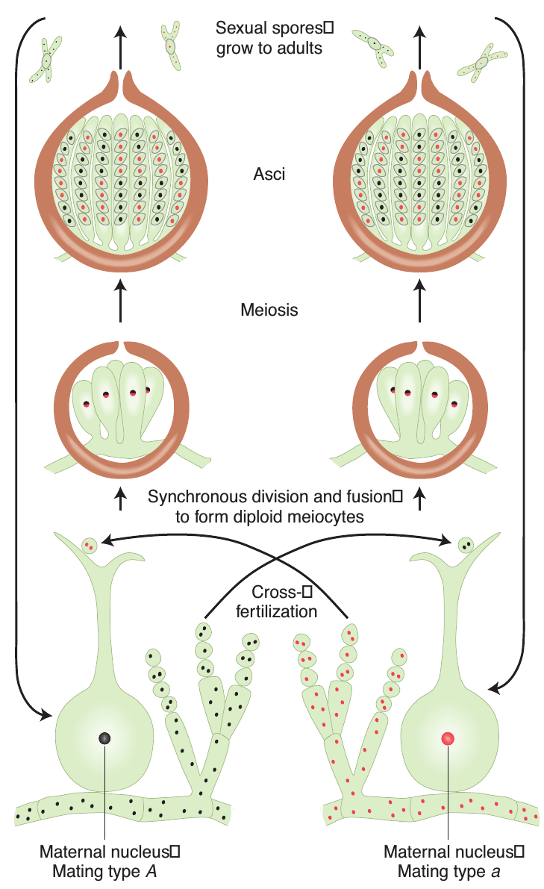
```

##

- G. Beadle and E. Tatum used Neurospora as the model organism in their pioneering studies on gene-enzyme relations, in which they were able to determine the enzymatic steps in the synthesis of arginine.

```{r n-crassa2, out.width="42%", fig.align='center', fig.cap="Pathway synthesizing orange carotenoid pigment in Neurospora."}
# pdftools::pdf_convert("../../literatures/textbooks/Introduction to Genetic Analysis/Griffiths - An Introduction to Genetic Analysis 11th Edition c2015.pdf",
#                       pages = 825,
#                       dpi = 300, format = "png",
#                       filenames = "../images/neurospora_crassa2.png")

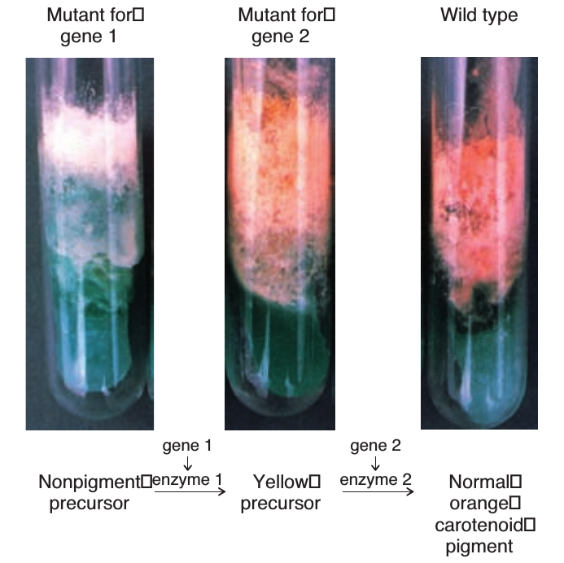
```

# Arabidopsis thaliana

##

- Genome size: 125 Mb
- Chromosomes: diploid, 5 autosomes (2n = 10)
- Number of genes: 25000
- Percentage with human homologs: 18%
- Average gene size: 2 kb, 4 introns/gene
- Transposons: 10% of the genome
- Genome sequenced: 2000 AD

##

- Member of Brassicaceae family.
- Has no economic significance but grows prolifically as a weed in many temperate parts of the world.
- Can be grown artificially in large numbers owing to its small size (< 10 cm height under certain conditions).

## Life cycle

- With the diploid phase dominant in life cycle, plant bears several flowers, each of which produce many seeds, like many annual weeds.
- Life cycle takes only about 6 weeks for a planted seed to produce a new crop of seeds.

```{r a-thaliana1, out.width="35%", fig.align='center'}
# pdftools::pdf_convert("../../literatures/textbooks/Introduction to Genetic Analysis/Griffiths - An Introduction to Genetic Analysis 11th Edition c2015.pdf",
#                       pages = 826,
#                       dpi = 300, format = "png",
#                       filenames = "../images/arabidopsis_thaliana1.png")

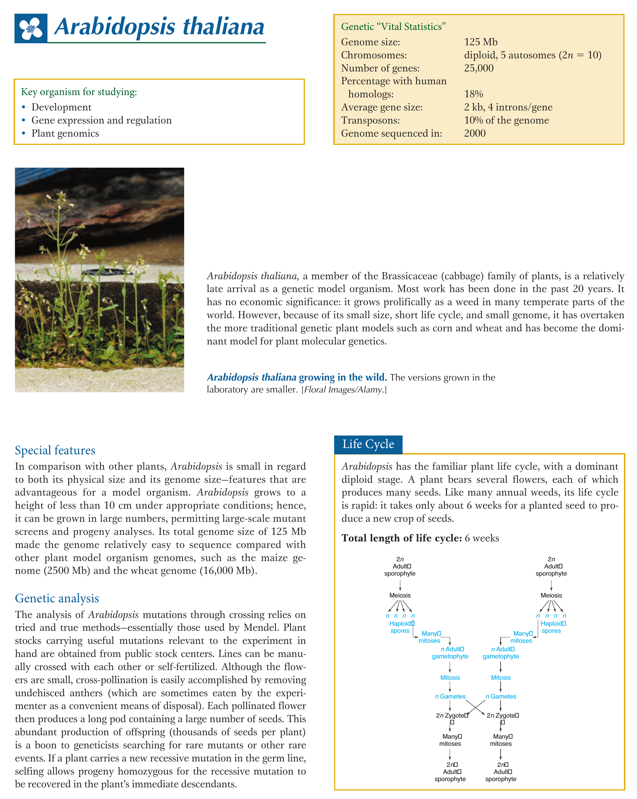
```

##

- Studies in Arabidopsis have made key contributions to our understanding of the genetic ocntrol of plant development. 
- Homeotic mutations, for example, affecting flower development have been isolated.
- In such mutants, one type of floral part is replaced by another.
- Integration of the action of these mutants has led to an elegant model of flower-whorl determination based on overlapping patterns of regulatory-gene expression in the flower meristem.

```{r a-thaliana2, out.width="45%", fig.align='center'}
# pdftools::pdf_convert("../../literatures/textbooks/Introduction to Genetic Analysis/Griffiths - An Introduction to Genetic Analysis 11th Edition c2015.pdf",
#                       pages = 827,
#                       dpi = 300, format = "png",
#                       filenames = "../images/arabidopsis_thaliana2.png")

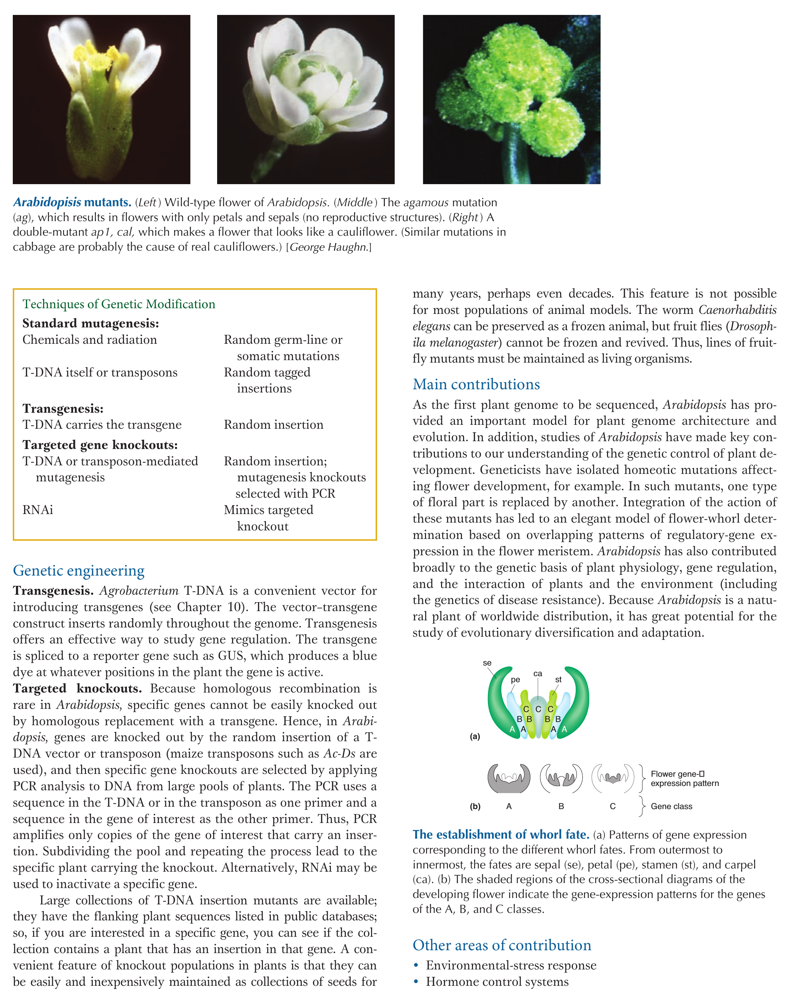
```

# Caenorhabditis elegans

## Introduction

- _Caenorhabditis elegans_ is a free-living, transparent nematode, about 1 mm in length, that lives in temperate soil environments.
- In 1955, Dougherty raised Caenorhabditis to the status of genus.
- _C. elegans_ is an unsegmented pseudocoelomate and lacks respiratory or circulatory systems.
- Most of these nematodes are **hermaphrodites** and a few are males. 
- Males have specialised tails for mating that include spicules. 
- In 1963, Sydney Brenner proposed research into _C. elegans_ primarily in the area of neuronal development. In 1974, he began research into the molecular and developmental biology of _C. elegans_, which has since been extensively used as a model organism.
- It was the first multicellular organism to have its whole genome sequenced, and as of 2012, is the only organism to have its connectome (neuronal "wiring diagram") completed.

## Taxonomy and classification

- Domain: Eukaryota
- Kingdom: Animalia
- Phylum: Nematoda
- Class: Chromadorea
- Order: Rhabditida
- Family: Rhabditidae
- Genus: _Caenorhabditis_
- Species: _C. elegans_

## Morpho-anatomy of adult and lifecycle of worm

- The wild‐type nematode Caenorhabditis elegans has an elongated and spindle‐shaped body, whereas the dumpy mutant has a shorter body with approximately the same diameter.
- A temperature‐sensitive morphological mutant which develops into an adult with dumpy phenotype, at $15^{\circ}C$, but with roller phenotype at $25^{\circ}C$, in addition to dumpy phenotype, was isolated.
- The heterozygous offspring (F1), produced by crossing the mutant hermaphrodite with wild‐type males, were rollers in both hermaphrodites and males.

##

```{r c-elegans1, out.width="80%", fig.align='center'}
# pdftools::pdf_convert("../../literatures/textbooks/Introduction to Genetic Analysis/Griffiths - An Introduction to Genetic Analysis 11th Edition c2015.pdf",
#                       pages = 828,
#                       dpi = 300, format = "png",
#                       filenames = "../images/caenorhabditis_elegans.png")

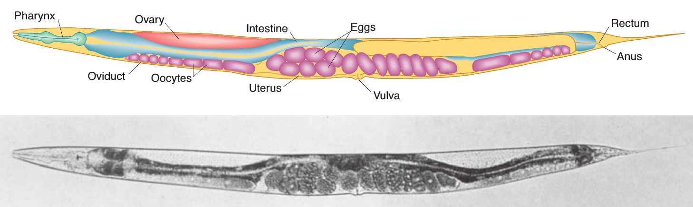
```

##

- It has a cuticle (a tough outer covering, as an exoskeleton), four main epidermal cords, and a fluid-filled pseudocoelom (body cavity). 
- It also has some of the same organ systems as larger animals. About one in a thousand individuals is male and the rest are hermaphrodites.
- The basic anatomy of _C. elegans_ includes a mouth, pharynx, intestine, gonad, and collagenous cuticle.
- The basic anatomy of C. elegans includes a mouth, pharynx, intestine, gonad, and collagenous cuticle.
- The pharynx is a muscular food pump in the head of C. elegans, which is triangular in cross-section. This grinds food and transports it directly to the intestine.
- Males have a single-lobed gonad, a vas deferens, and a tail specialized for mating, which incorporates spicules. 
- Hermaphrodites have two ovaries, oviducts, and spermatheca, and a single uterus.

## Genetics

- The genome sequence was published in 1998, although some small gaps were present; the last gap was finished by October 2002.
- Neurons of humans and _C. elegans_ are almost identical. Both human and C. elegans neurons contain a dendrite which extends from the cell to receive neurotransmitters, and extends to the nerve ring or brain for a synaptic connection between neurons.
- The biggest difference is that _C. elegans_ has motor excitatory and inhibitory neurons.
- The _C. elegans_ genome is about 100 million base pairs long and consists of six chromosomes and a mitochondrial genome.
- Its gene density is about one gene per five kilo-base pairs. Introns make up 26% and intergenic regions 47% of the genome.

##

- _C. elegans_ and other nematodes are among the few eukaryotes currently known to have operons; these include trypanosomes, flatworms (notably the trematode Schistosoma mansoni), and a primitive chordate tunicate .
- The genome contains an estimated 20,470 protein-coding genes. About 35% of _C. elegans_ genes have human homologs. 
- Remarkably, human genes have been shown repeatedly to replace their _C. elegans_ homologs when introduced into _C. elegans_. Conversely, many _C. elegans_ genes can function similarly to mammalian genes.The number of known RNA genes in the genome has increased greatly due to the 2006 discovery of a new class of 21U-RNA genes, and the genome is now believed to contain more than 16,000 RNA genes, up from as few as 1,300 in 2005.
- As of 2014, C. elegans is the most basal species in the 'Elegans' group (10 species) of the 'Elegans' supergroup (17 species) in phylogenetic studies. It forms a branch of its own distinct to any other species of the group.

## Reproduction

- The hermaphroditic worm is considered to be a specialized form of self-fertile female, as its soma is female. 
- The hermaphroditic germline produces male gametes first, and lays eggs through its uterus after internal fertilization.
- Hermaphrodites produce all their sperm in the L4 stage (150 sperm cells per gonadal arm) and then produce only oocytes.
- The hermaphroditic gonad acts as an ovotestis with sperm cells being stored in the same area of the gonad as the oocytes until the first oocyte pushes the sperm into the spermatheca (a chamber wherein the oocytes become fertilized by the sperm).
- Once a male recognizes hermaphrodite worm, it begins tracing the hermaphrodite with his tail until it reaches the vulval region. The male then probes the region with its spicules to locate the vulva, inserts them, and releases sperm.

## Studies

- First studied in the laboratory by Victor Nigon and Ellsworth Dougherty in the 1940s.
- Adopted by Sydney Brenner in 1963 as a model organism for the study of developmental biology using genetics.
- In the 1980s, John Sulston and co-workers identified the lineage of all 959 cells in the adult hermaphrodite, the first genes were cloned, and the physical map began to be constructed.
- Notable research using _C. elegans_ includes the discoveries of caspases, RNA interference, and microRNAs. Six scientists have won the Nobel prize for their work on _C. elegans_.
- _C. elegans_ made news when specimens were discovered to have survived the Space Shuttle Columbia disaster in February 2003.

# Drosophila melanogaster

##

```{r drosophila-couples, out.width="50%", fig.align='center'}
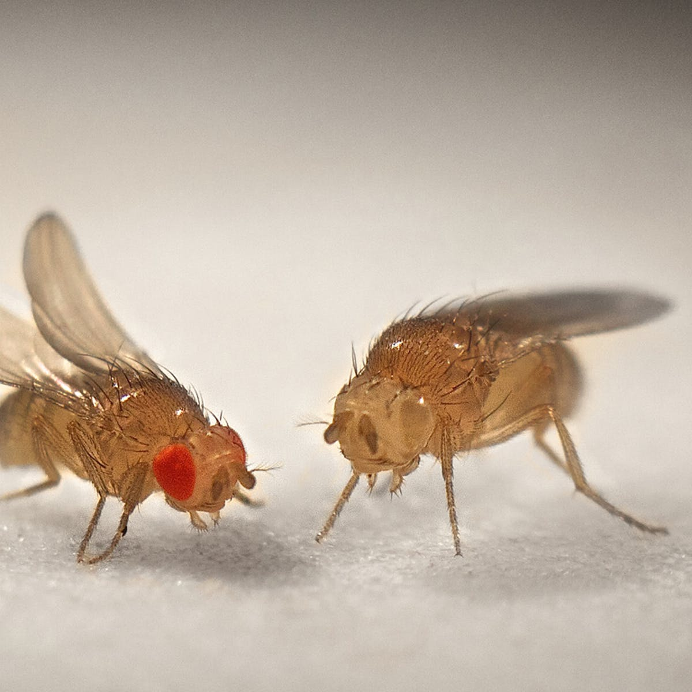
```

##

- Taxonomic order Diptera in the family Drosophilidae. 
- The species is known generally as the common fruit fly or vinegar fly. 
- Charles W. Woodworth's proposed the use of this species as a model organism.
- D. melanogaster continues to be widely used for biological research in genetics, physiology, microbial pathogenesis, and life history evolution. As of 2017, six Nobel prizes had been awarded for research using Drosophila.
- D. melanogaster is typically used in research owing to its rapid life cycle, relatively simple genetics with only four pairs of chromosomes, and large number of offspring per generation.
- D. melanogaster is a common pest in homes, restaurants, and other places where food is served.

## Taxonomy and classification^[https://en.wikipedia.org/wiki/Drosophila]

- Domain: Eukaryota
- Kingdom: Animalia
- Phylum: Arthropoda
- Class: Insecta
- Order: Diptera
- Family: Drosophilidae
- Subfamily: Drosophilinae
- Genus: _Drosophila_ (Fallén, 1823)

## Life cycle

- Under optimal growth conditions at 25 degree C, the _D. melanogaster_ lifespan is about 50 days from egg to death.
- The developmental period for _D. melanogaster_ varies with temperature, as with many ectothermic species. 
- The shortest development time (egg to adult), 7 days, is achieved at 28 degree C.
- Development times increase at higher temperatures (11 days at 30 degree C) due to heat stress. 
- Under ideal conditions, the development time at 25 degree C is 8.5 days, at 18 degree C it takes 19 days and at 12 degree C it takes over 50 days.
- Under crowded conditions, development time increases, while the emerging flies are smaller.
- Females lay some 400 eggs (embryos), about five at a time, into rotting fruit or other suitable material such as decaying mushrooms and sap fluxes. 

##

- *Drosophila melanogaster* is a holometabolous insect, so it undergoes a full metamorphosis. 
- Their life cycle is broken down into 4 stages: embryo, larva, pupa, adult.
- The eggs, which are about 0.5 mm long, hatch after 12–15 hours (at 25 degree C).
- The resulting larvae grow for about 4 days (at 25 degree C) while molting twice (into second- and third-instar larvae), at about 24 and 48 h after hatching.
- During this time, they feed on the microorganisms that decompose the fruit, as well as on the sugar of the fruit itself. The mother puts feces on the egg sacs to establish the same microbial composition in the larvae's guts that has worked positively for herself.
- Then the larvae encapsulate in the puparium and undergo a 4-day-long metamorphosis (at 25 degree C), after which the adults emerge.

##

- Males perform a sequence of five behavioral patterns to court females. 
- First, males orient themselves while playing a courtship song by horizontally extending and vibrating their wings.
- Upon copulation, females store the sperm in a tubular receptacle and in two mushroom-shaped spermathecae; sperm from multiple matings compete for fertilization. 
- A last male precedence is believed to exist; the last male to mate with a female sires about 80% of her offspring. 
- This precedence was found to occur through both displacement and incapacitation.
- Sensory neurons in the uterus of female D. melanogaster respond to a male protein, sex peptide, which is found in semen.

##

- This protein makes the female reluctant to copulate for about 10 days after insemination. 
- Gonadotropic hormones in Drosophila maintain homeostasis and govern reproductive output via a cyclic interrelationship, not unlike the mammalian estrous cycle.
- Females become receptive to courting males about 8–12 hours after emergence.
- *D. melanogaster* males exhibit a strong reproductive learning curve. That is, with sexual experience, these flies tend to modify their future mating behavior in multiple ways. These changes include increased selectivity for courting only intraspecifically, as well as decreased courtship times.

## Laboratory use of D. melanogaster

- Its care and culture require little equipment, space, and expense even when using large cultures.
- It can be safely and readily anesthetized (usually with ether, carbon dioxide gas, by cooling, or with products such as FlyNap).
- Its morphology is easy to identify once anesthetized.
- It has a short generation time (about 10 days at room temperature), so several generations can be studied within a few weeks.
- It has a high fecundity (females lay up to 100 eggs per day, and perhaps 2000 in a lifetime).
- Males and females are readily distinguished, and virgin females are easily isolated, facilitating genetic crossing.
- The mature larva has giant chromosomes in the salivary glands called polytene chromosomes, "puffs", which indicate regions of transcription, hence gene activity. The under-replication of rDNA occurs resulting in only 20% of DNA compared to the brain. Compare to the 47%, less rDNA in Sarcophaga barbata ovaries.

##

- It has only four pairs of chromosomes – three autosomes, and one pair of sex chromosomes.
- Males do not show meiotic recombination, facilitating genetic studies.
- Recessive lethal "balancer chromosomes" carrying visible genetic markers can be used to keep stocks of lethal alleles in a heterozygous state without recombination due to multiple inversions in the balancer.
- The development of this organism—from fertilized egg to mature adult—is well understood.
- Genetic transformation techniques have been available since 1987.
- Its complete genome was sequenced and first published in 2000^[https://pubmed.ncbi.nlm.nih.gov/10731132].
- Sexual mosaics can be readily produced, providing an additional tool for studying the development and behavior of these flies.

## Drosophila genetics

- The genome of D. melanogaster (sequenced in 2000, and curated at the FlyBase database) contains four pairs of chromosomes – an X/Y pair, and three autosomes labeled 2, 3, and 4. 
- The fourth chromosome is so tiny, it is often ignored, aside from its important eyeless gene. The D. melanogaster sequenced genome of 139.5 million base pairs has been annotated and contains around 15,682 genes according to Ensemble release 73.
- More than 60% of the genome appears to be functional non-protein-coding DNA involved in gene expression control. Determination of sex in Drosophila occurs by the X:A ratio of X chromosomes to autosomes, not because of the presence of a Y chromosome as in human sex determination. Although the Y chromosome is entirely heterochromatic, it contains at least 16 genes, many of which are thought to have male-related functions.

##

```{r d-melanogaster1, out.width="48%", fig.align='center'}
# pdftools::pdf_convert("../../literatures/textbooks/Introduction to Genetic Analysis/Griffiths - An Introduction to Genetic Analysis 11th Edition c2015.pdf",
#                       pages = 830,
#                       dpi = 300, format = "png",
#                       filenames = "../images/drosophila_melanogaster1.png")

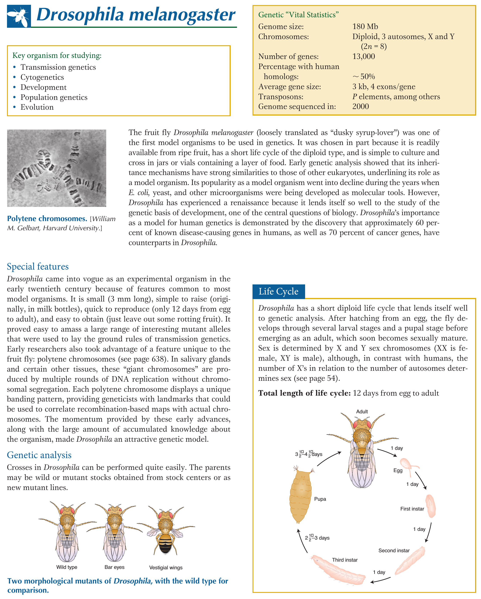
```

##

```{r d-melanogaster2, out.width="48%", fig.align='center'}
# pdftools::pdf_convert("../../literatures/textbooks/Introduction to Genetic Analysis/Griffiths - An Introduction to Genetic Analysis 11th Edition c2015.pdf",
#                       pages = 831,
#                       dpi = 300, format = "png",
#                       filenames = "../images/drosophila_melanogaster2.png")

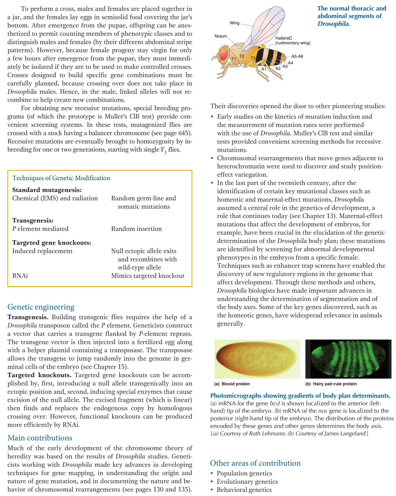
```

# Mus musculus

##

```{r m-musculus1, out.width="48%", fig.align='center'}
# pdftools::pdf_convert("../../literatures/textbooks/Introduction to Genetic Analysis/Griffiths - An Introduction to Genetic Analysis 11th Edition c2015.pdf",
#                       pages = 832,
#                       dpi = 300, format = "png",
#                       filenames = "../images/mus_musculus1.png")

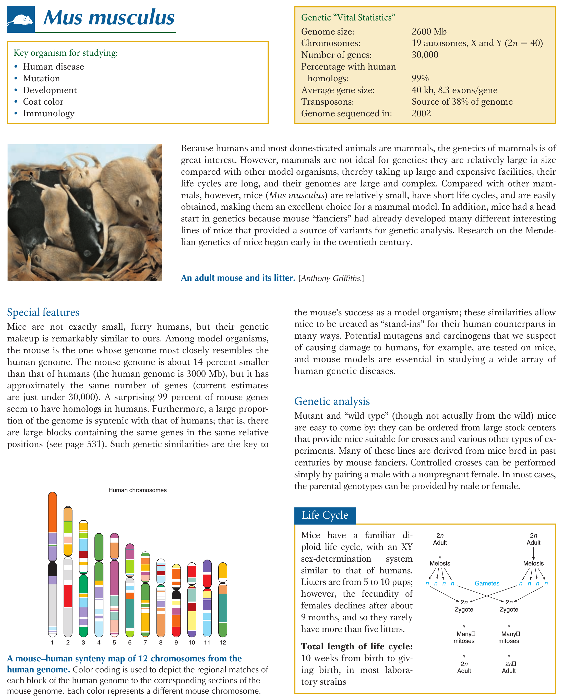
```

##

- _Mus musculus_ is a small mammal of the order Rodentia, characteristically having a pointed snout, large rounded ears, and a long and hairy tail.
- Mouses dates long back on the genetic research as a model organism
- Out of the order rodentia mouse is a orgamism with short breeding period.
- They are widely used to study human genetic disorders (downs syndrome, cystic fibrosis, epilepsy, heart diseases, cancers, tumours and many more).

##

- _Mus musculus_ is a small mammal of the order Rodentia, characteristically having a pointed snout, large rounded ears, and a long and hairy tail.
- Mouses dates long back on the genetic research as a model organism
- Out of the order rodentia mouse is a orgamism with short breeding period.
- They are widely used to study human genetic disorders (downs syndrome, cystic fibrosis, epilepsy, heart diseases, cancers, tumours and many more).

## Classification and taxonomy^[https://en.wikipedia.org/wiki/House_mouse]

\footnotesize

- Domain: Eukaryota
- Kingdom: Animalia
- Phylum: Chordata
- Class: Mammalia
- Order: Rodentia
- Family: Muridae
- Genus: _Mus_
- Subgenus: _Mus_
- Species: _M. musculus_

## Genetics

- The complete mouse genome was discovered in 2002 AD.
- Chromosome number (2n): 40; n=20
- The haploid genome is about 3 picograms, similar to humans.
- Unlike the mostly metacentric chromosomes of humans, all mouse chromosomes are acrocentric.
- Haploid chromosome contains 3.1 billion base pairs long
- Genome length (3000 mb distributed over 19 autosomes plus one and two sex chromosome).
- The primary coding genes are 23,139 out of which 20210 protein coding genes are found.

## Genetics

- The complete mouse genome was discovered in 2002 AD.
- Chromosome number (2n): 40; n=20
- The haploid genome is about 3 picograms, similar to humans.
- Unlike the mostly metacentric chromosomes of humans, all mouse chromosomes are acrocentric.
- Haploid chromosome contains 3.1 billion base pairs long
- Genome length (3000 mb distributed over 19 autosomes plus one and two sex chromosome).
- The primary coding genes are 23,139 out of which 20210 protein coding genes are found.

## Chromosome

```{r mouse-karyotype, fig.cap="Karyotypic features of mice chromosomes", out.width = "70%", fig.align='center'}
knitr::include_graphics("../images/mouse_karyotype.jpg")
```

## Morphology

- A mouse is a small with pointed nose, furry round body, large ears and a long often hairless tail.
- There are hundred types of mice divided into subfamilies of either old World or new world species. 
- Common varieties includes deermouse, housemouse, wood mouse, spingmose and zebramouse.
- Colour of mouse ranges from white,brown to grey
- Length: 1 to 7 inches
- Weight: 0.23kg to 0.28kg
- Smallest mouse: African pygmy measure (1.2-3.1 inches).
- Some mice have tail that are as long as their body.

## Reproduction

- Mus musculus is characterized by tremendus reproductive potential. 
- Breeding occurs through out the year. A single female is capable of producing up to eight litters per year. Female can reproduce up to ten times per year.
- Female go into heat for four to five days. Once pregnant, rodent gives birth after three weeks.
- At about 21 days, the young are weaned from their mothers and may begin to take short trips away from nest to explore their surroundings.
 - Most mice reach sexual maturity at about 35 days age and begin start matting when they are six weeks old.

## Suitability

- A model organism is a species that has been widely studied, usually because it is easy to maintain and breed in a laboratory setting and has particular experimental advantages.
- Mus musculus represents humans and a broad range of mammals as they are closely related in terms of anatomy, physiology and genetics.
- They are widely used as disease models for humans.
- They can breed large number of off-spring in a short period of time.
- The similar sized gene/genome of mouse and humans gave preference to mouse in genetic studies.
- They are easy to look after and care and are cost effective.
- The time between a mouse being born and giving birth is short, usually around 10 weeks. Thus several generations can be observed at once.
- Immunodeficient mice can also be used as hosts to grow both normal and diseased normal human tissue. This has been a useful tools in cancer and AIDS research.

## Studies

\footnotesize

- William Harvey studied blood circulation and reproduction in 16th century.
- Gregor Mendel carried out his early investigations of inheritance on mouse coat color but was asked by his superior to stop breeding in his cell "smelly creatures that, in addition, copulated and had sex"
- Frederick Griffith in 1928 conducted an experiment on mouse and found that bacteria are capable of transferring genetic information through a process known as transformation.
- In 1902 Lucien Cue'not published the results of his experiments using mice which showed that Mendel's laws of inheritance were also valid for animals.
- Mouse has been used as a biological model from early 20th century as the three inbred lines DBA (dilute, brown and non-agouti colored) were discovered.
- In recent studies, researches have generated blastocyst like structure from stem cell; blastocyst like structure resemble very closely to real blastocysts.
- Methods have been developed for successfully generating hair growth in nude mice, this has a potential hair loss treatment in human.
- Study have related good health in mice to plenty of _Clostiridia_ in its gut, at the same time those with an impaired immune system lose their microbes from their gut as they age.

# Corn

##

\begin{columns}[T,onlytextwidth]

  \column{.4\linewidth}

```{r teosinte, fig.cap="Ancestor of modern day maize.", out.width="1.2\\textwidth"}
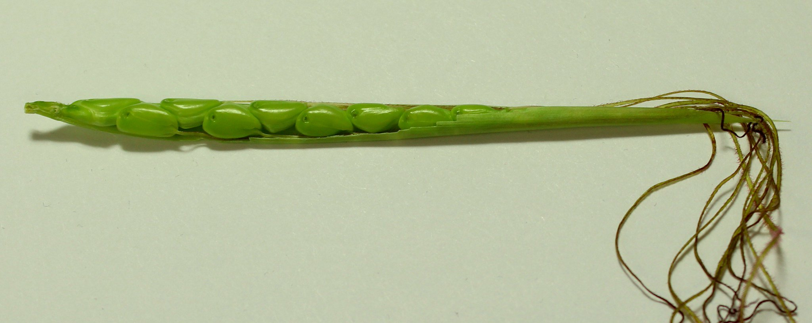
```

  \column{.6\linewidth}

```{r maize-tassel, fig.cap="Male inflorescence of a maize plant"}
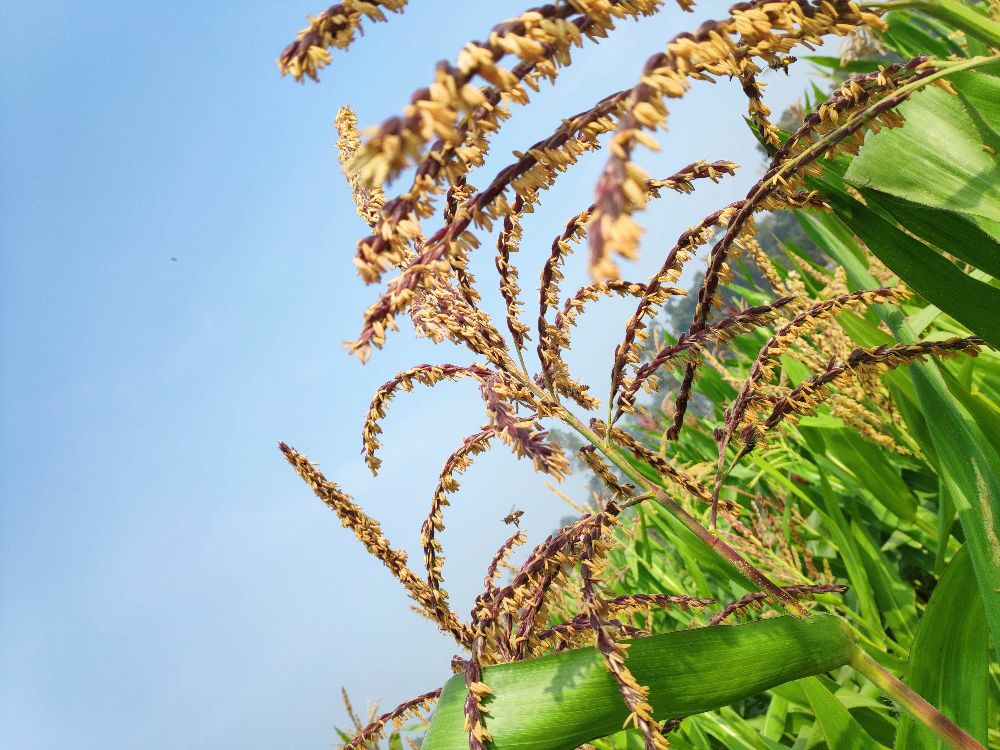
```

```{r maize-plant, fig.cap="Maize crop (ear)"}
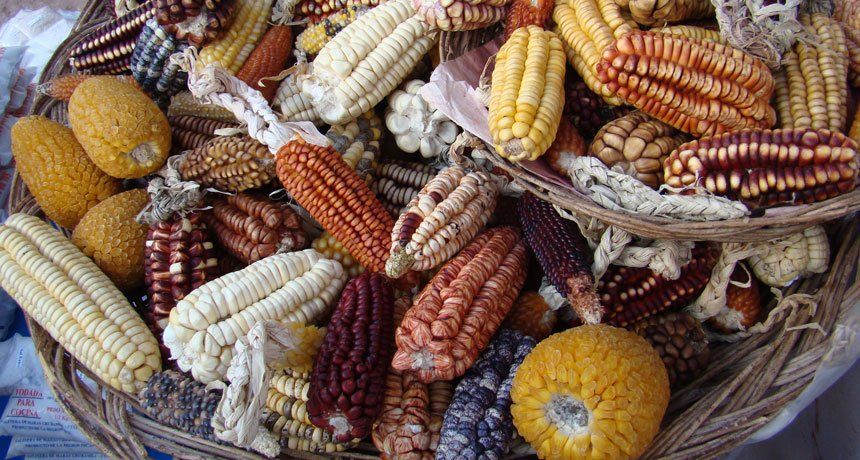
```

\end{columns}

##

- Lower plants have haploid condition for the major part of the life cycle, with different haploid mating types producing the gametes that combine to form a diploid zygote.
- Propagation of diploid chromosome constitution of a zygote to a later stage of life cycle is called the sporophytic generation because some diploid cells (sporocytes) undergo meiosis to form haploid spores (sporogenesis).
- These spores, although not gametes, multiply mitotically to yield the gametophytes (haploid male and female stages) which, in turn, form gametes.
- In maize (or angiosperms), as the plants reach in this progression, the haploid gametophytes are reduced in size as to be microscopic.

##

```{r maize-infloresence-type, fig.cap="Types of compound inflorescences"}
# pdftools::pdf_convert("./../../literatures/Plant Science Straussberger.pdf", 
#                       pages = 193, format = "png", 
#                       filenames = "../images/types_of_inflorescence.png", dpi = 300)
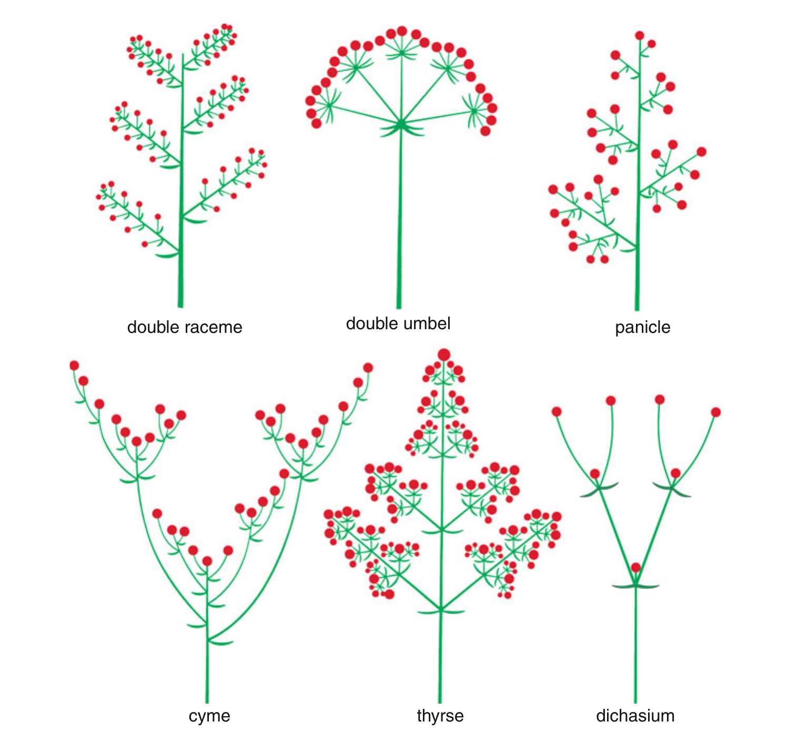
```

##

- In corn two types of gametophytes are represented by small **microspores** in the stamens (found in tassels), and by large **megaspores** in the pistils (found in developing ears).
- In stamen single diploid microspore mother cell cell (**PMC**) divide meiotically to yield four haploid microspores, each becoming encapsulated as a pollen grain (the **male gametophyte**), the haploid pollen then divides mitotically to form a **tube nucleus** and a **generative nucleus**.
- In pistils similar event occur in each megaspore mother cell (**MMC**), except that only one of four haploid macrospore nuclei becomes functional occupant of the **embryo sac** (the **female gametophyte**). The nuclei of this cell divides mitotically into two daughter nuclei, which divide twice more, forming a total of eight haploid nuclei, four at each end of the embryo sac.

## Alternation of generation in flowering plants

```{r alternation-generation, fig.align='center', out.width="60%"}
# pdftools::pdf_convert("./../../references_plb/Principles of Plant Genetics and Breeding.pdf", pages = 110, format = "png", filenames = "./images/alternation_of_generations.png", dpi = 300)
knitr::include_graphics("../images/alternation_of_generations.png")
```

##

- A single nucleus from each end group of the four then unites at the center to form the diploid endosperm nucleus. 
- Of the remaining six nuclei in the embryo sac, the group of three farthest away from the pollen tube point of entry (**micropyle**) are called the **antipodal** cells, while the other group differentiates into a single **female gametic nucleus** and two **synergids**.
- In the process of fertilization, the pollen grain makes contact with the stigma (silk) of the pistil and then germinates into a long **pollen tube** carrying the two male sperm nuclei to the embryo sac.
- One male gamete fertilizes the female gametic nucleus to form the diploid zygote, and the other male gamete combines with the diploid endosperm to form triploid tissue that will nourish the embryo. This constitutes the **double fertilization**.

##

```{r sporogenesis, fig.cap="Embryo sac and pollen formation", out.width="40%", fig.align='center'}
# pdftools::pdf_convert("./../../references_plb/Rolf H. J. Schlegel - Encyclopedic Dictionary of Plant Breeding and Related Subjects-The Food Products Press (2003).pdf", pages = 554, format = "png", filenames = "./images/sporogenesis.png", dpi = 300)
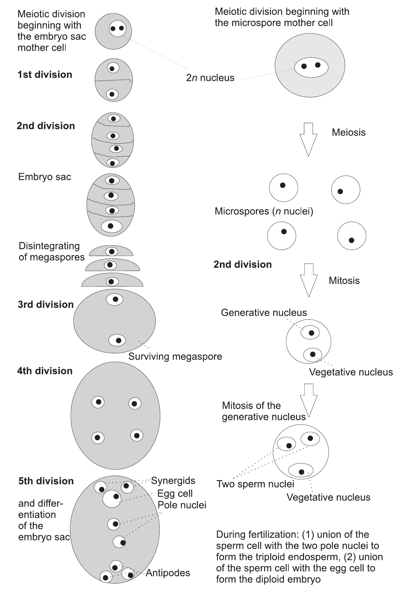
```

##

```{r fertilization, fig.cap="Fertilization in \\textbf{self pollinated} flower", out.width="40%", fig.align='center'}
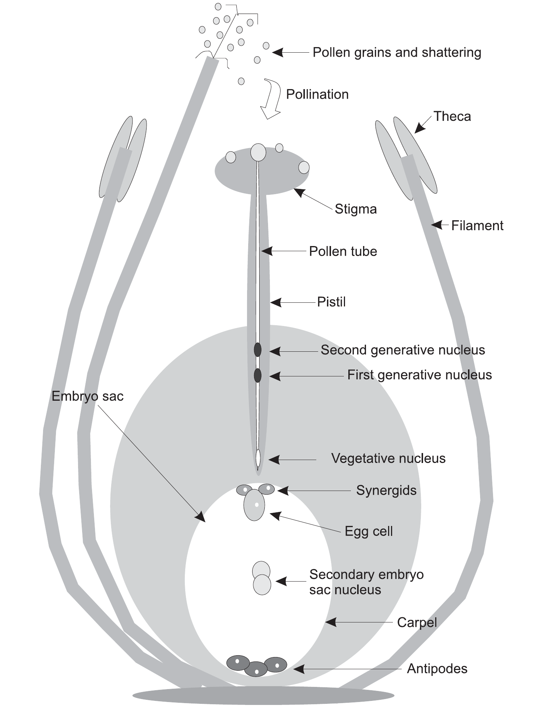
```
