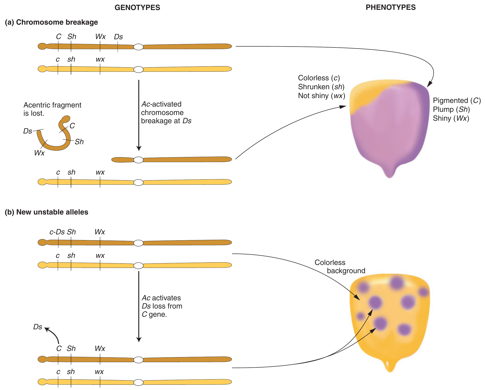
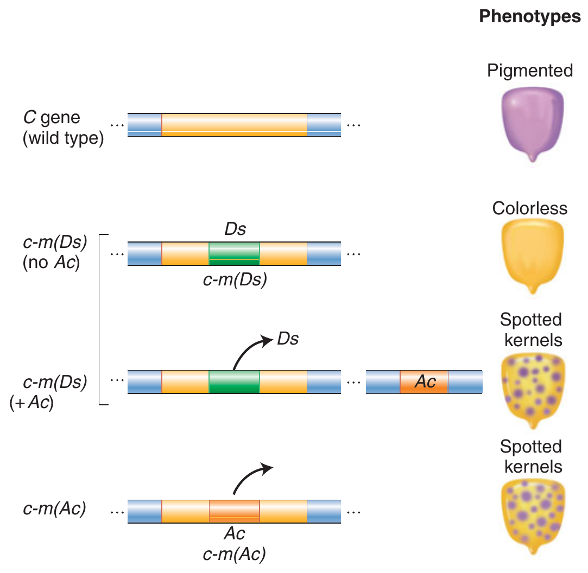

```{r,setup, include=FALSE}
library(knitr)
require(tidyverse)
set.seed(453)
# invalidate cache when the package version changes
knitr::opts_chunk$set(tidy = FALSE, echo = FALSE, 
                  message = FALSE, warning = FALSE,
                  out.width = "45%", cache = TRUE)
options(knitr.table.format = "latex")
options(knitr.kable.NA = "", digits = 2)
options(kableExtra.latex.load_packages = FALSE)
```

# Jumping genes

## Introduction

- The phenomenon of transposable elements (genes with the capacity to relocate within the genome), creates new variability.
- Transposable genetic elements (transposable elements, **transposons**, or "jumping genes") are known to be nearly universal in occurrence. 
- These mobile genetic units relocate within the genome by the process called **transposition**. 
- The presence of transposable elements indicates that genetic information is not fixed within the genome of an organism. 

##

- Barbara McClintock, working with corn in the 1940s, was the first to detect transposable elements, which she initially identified as controlling elements (20 years ahead of the discovery of transposable elements in prokaryotes). 
- Controlling elements may be grouped into families. The members of each family may be divided into two classes: autonomous elements or non-autonomous elements. 
- **Autonomous elements** have the ability to transpose whereas the non-autonomous elements are stable (but can transpose with the aid of an autonomous element through **trans-activation**).
- McClintock studied two mutations: dissociation ( _Ds_) and activator ( _Ac_). The _Ds_ element is located on chromosome 9. 
- _Ac_ is capable of autonomous movement, but _Ds_ moves only in the presence of _Ac_. 

##

- _Ds_ has the effect of causing chromosome breakage at a point on the chromosome adjacent to its location (Figure \ref{fig:jumping-genes}). 
- The _Ac_ element has an open reading frame. 
- The activities of corn transposable elements are developmentally regulated. That is, the transposable elements transpose and promote genetic rearrangements at only certain specific times and frequencies during plant development. 
- Transposition involving the _Ac_-_Ds_ system is observed in corn as spots of colored aleurone. 
- A gene required for the synthesis of anthocyanin pigment is inactivated in some cells whereas other cells have normal genes, resulting in spots of pigment in the kernel (genetic mosaicism).

##

```{r jumping-genes, fig.cap="New phenotpyes in corn are produced through the movement of the \\textit{Ds} transposable element on chromosome 9. (a) A chromosome fragment is lost through breakage at the \\textit{Ds} locus. Recessive alleles on the homologous chromosome are expressed, producing the colorless sector in the kernel. (b) Insertion of Ds in the gene (top) creates colorless corn kernel cells. Excision of \\textit{Ds} from the \\textit{C} gene through the action of \\textit{Ac} in cells and their mitotic decendents allow color to be expressed again, producing the spotted phenotype.", out.width="60%"}
# pdftools::pdf_convert("../../literatures/textbooks/Introduction to Genetic Analysis/Griffiths - An Introduction to Genetic Analysis 10th Edition.pdf",
#                       pages = 552,
#                       dpi = 300, format = "png",
#                       filenames = "../images/maize_transposable_elements.png")


```

## 

```{r te-phenotypes, fig.cap="Phenotypes produced by transposable genetic elements in maize."}
# pdftools::pdf_convert("../../literatures/textbooks/Introduction to Genetic Analysis/Griffiths - An Introduction to Genetic Analysis 10th Edition.pdf",
#                       pages = 553,
#                       dpi = 300, format = "png",
#                       filenames = "../images/maize_te_phenotypes.png")


```
