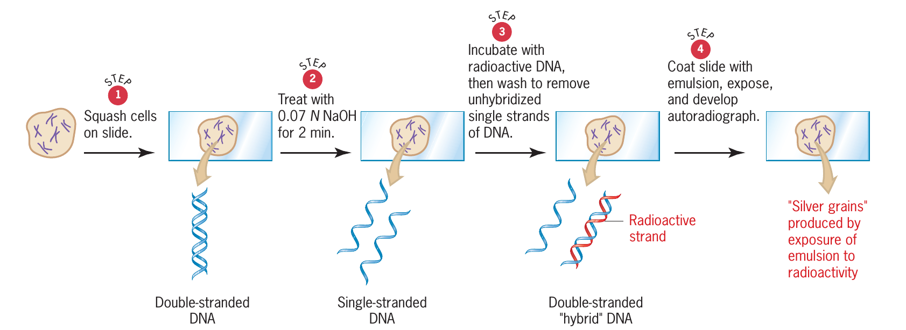
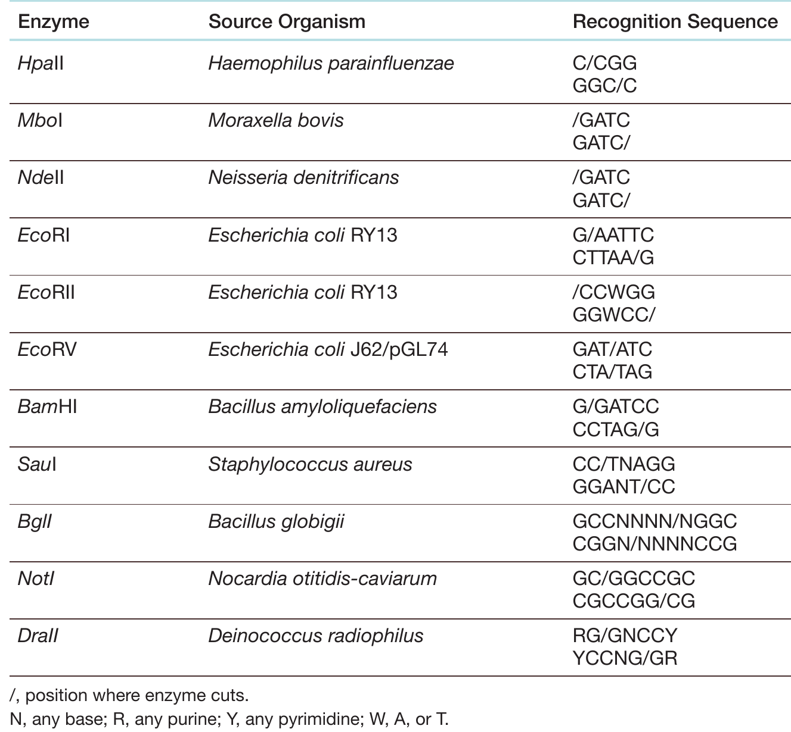
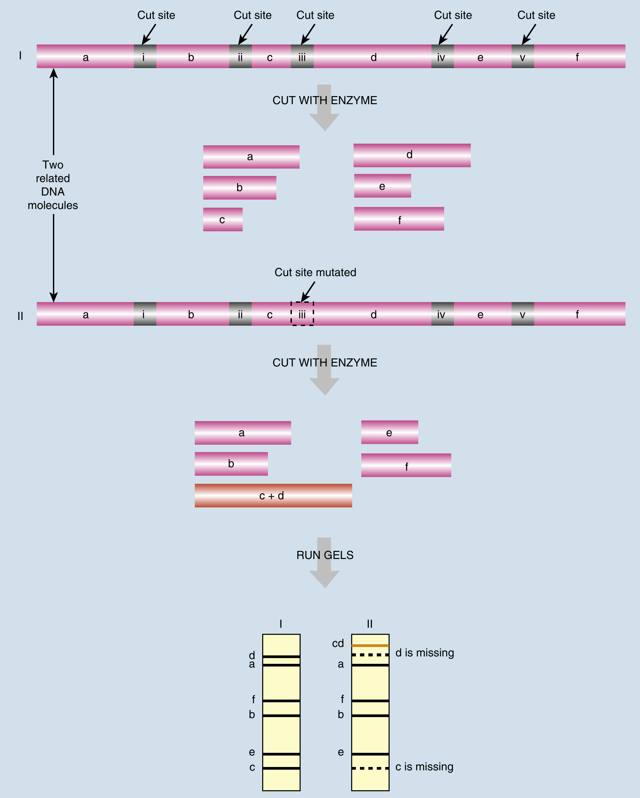
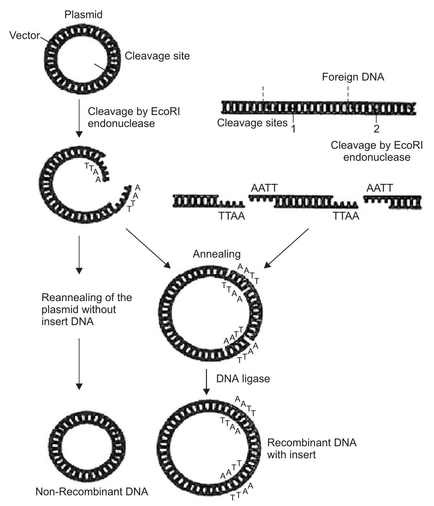
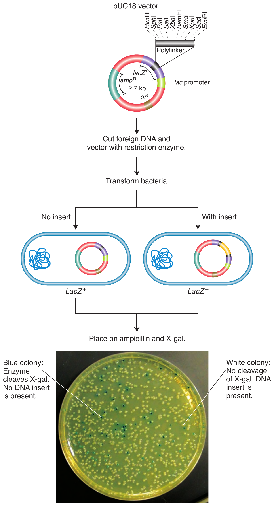
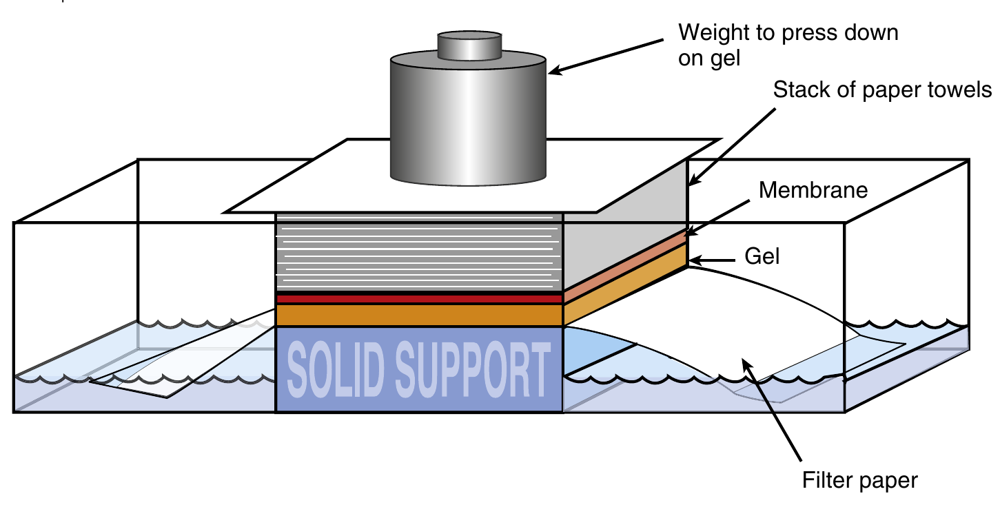

```{r setup, include=FALSE}
library(knitr)
require(tidyverse)
set.seed(453)
# invalidate cache when the package version changes
knitr::opts_chunk$set(tidy = FALSE, echo = FALSE, 
                  message = FALSE, warning = FALSE,
                  out.width = "45%", cache = TRUE, 
                  dev.args=list(bg=grey(0.9), pointsize=11))
options(knitr.table.format = "latex")
options(knitr.kable.NA = "", digits = 2)
options(kableExtra.latex.load_packages = FALSE)
# Beamer cheatsheet can be found at:
# http://www.cpt.univ-mrs.fr/~masson/latex/Beamer-appearance-cheat-sheet.pdf
# All beamer themes and colorthemes can be assessed at:
# https://hartwork.org/beamer-theme-matrix/

# A complete book on biolgy view this link
# https://github.com/philschatz/biology-book/blob/master/SUMMARY.md
```

# Manipulation of DNA

##

- DNA manipulation includes 
  - Extraction of DNA, 
  - Digestion of DNA, 
  - Fractionation of DNA, 
  - Synthesis of clone, 
  - DNA hybridization, 
  - DNA amplification through polymerase chain reaction
  - Recombination of DNA (genetic engineering). 

##

- Complementary base pairing and the universality of it are the very property of DNA which enables DNA hybridization and DNA amplification by polymerase chain reaction. 
- Concentration of nitrogen bases of guanine and cytocine is another trait through which polymerase chain reaction can be accustomed to need. 
- Joining together of DNA segments from two different species is known as recombinant DNA technology. The rDNA technology involves:
  1. Generating a series of DNA fragments 
  2. Joining the fragments to a carrier DNA molecule which must be able to replicate 'vector-bacterial plasmid' 
  3. Transforming cells with the recombinant molecule

# Locating physical position of DNA (In situ hybridization)

##

- If a cloned gene is available, it can be used to make a labeled probe for hybridization to chromosomes in situ. 
- If the individual chromosomes of the genomic set are recognizable through their banding patterns, size, arm ratio, or other cytological feature, then the new gene can be assigned to the chromosome to which it hybridizes. 
- Furthermore, the locus of hybridization reveals a rough chromosomal position. 
- Commonly used probe labels are radioactivity and fluorescence. 
- In fFluorescently labeled probes ddNTPs are used in the reaction mixture. Each type of ddNTPs is labeled with a specific color and can be detected directly from the gel when illuminated with a laser or UV light.

## FISH technique

- A method for detecting the presence of particular genes (e.g., in a biological sample), which utilizes a number of fluorescein-"tagged" DNA probes.
- A DNA probe is a small, fluorescently or radioactively labeled DNA molecule that is used to locate similar or complementary sequences among a long stretch of DNA molecule or bacterial colonies such as genomic or cDNA libraries or in a genome.
- When those DNA probes hybridize to each of their respective particular genes (i.e., that they were selected to be complementary to), each DNA probe's "tag" fluoresces at a different wavelength (different "color"), thereby indicating positively the presence in sample of that particular gene.

##

- For example, if the color of the band is red it represents the base 'T,' because the dideoxy Thyamidine Triphosphate (ddTTP) is labeled with a red dye. Similarly, yellow is for 'G,' green is for 'A,' and blue represents the base 'C.'
- In fluorescence in situ hybridization (FISH), the clone is labeled with a fluorescent dye (digoxigenin and / or biotin), and a partially denatured chromosome preparation is bathed in the probe. 

##

- The probe binds to the chromosome in situ, and the location of the cloned fragment is revealed by a bright fluorescent spot when looked under UV illumination.
- An extension of FISH is chromosome painting or multicolor in situ hybridization.
- Sets of cloned DNA known to be from specific chromosomes or specific chromosome regions are labeled with different fluorescent dyes. 
- These dyes then "paint" specific regions and identify them under the microscope. If a clone of a gene of unknown location is labeled with yet another dye, its position can be established in the painted array.

##

```{r insitu-hybridization, fig.cap="Steps in in-situ hybridization", out.width="65%"}

```

# Isolation of DNA

##

- Cell structure and organelles present a natural barrier
- Bacteria are easiest to manipulate. How?
- Distinction between two DNAs is made based on their sizes.
- The first step in making recombinant DNA is to isolate donor and vector DNA.
- With the use of such methods, the bulk of DNA extracted from the donor will be nuclear genomic DNA in eukaryotes or the main genomic DNA in prokaryotes; these types are generally the one required for analysis.

##

- The procedure used for obtaining vector DNA depends on the nature of the vector. 
- Bacterial plasmids are commonly used vectors, and these plasmids must be purified away from the bacterial genomic DNA. A protocol for extracting plasmid DNA by ultracentrifugation is summarized:
  - Plasmid DNA forms a distinct band after ultracentrifugation in a cesium chloride density gradient containing ethidium bromide.
  - The plasmid band is collected by punching a hole in the plastic centrifuge tube. 
  - Another protocol relies on the observation that, at a specific alkaline pH, bacterial genomic DNA denatures but plasmids do not. 
  - Subsequent neutralization precipitates the genomic DNA, but plasmids stay in solution.
- Phages such as $\lambda$ also can be used as vectors for cloning DNA in bacterial systems. Phage DNA is isolated from a pure suspension of phages recovered from a phage lysate. 

## Isolation of nuclear DNA: Steps

1. Tissue should be thin and soft to be useable. If such it should be powdered in liquid nitrogen with mortar and pestle. The powder is then transferred to centrifuge tube. In bacteria, lysozyme digestion degrades the peptidoglycan layer.
2. Then the extraction buffer is added (CTAB and sodium dodecyl sulfate (SDS, as detergent) buffer is widely used in plants) and mixed well. Then incubate at 60°C for one hour in a water bath. 
3. Now centrifuge the solution and remove the precipitate, and transfer the supernatant to another centrifuge tube. In animals, separation of intracellular components from the insoluble remains (cellular membranes, bones, cartilage, etc.) is done by either centrifugation or chemical extraction.

## Isolation of nuclear DNA: Steps

4. Extract this solution with chloroform-isoamyl alcohol. All the organic and lipids will separate to the chloroform layer and DNA will be in the aqueous layer. Take the aqueous layer and again extract it with chloroform and repeat the step, if necessary.
5. Finally, the aqueous layer containing DNA is precipitated with ice-cold isopropanol or ethyl alcohol. The DNA should appear as white or creamy strands or fibers and can be separated or taken out with a glass rod.

- Thus obtained DNA can be dissolved in Tris EDTA buffer for storage.

# Restriction enzymes (Restrictase, Endonuclease, Restriction endonucleases)

##

- Bacterial DNA cleaving enzymes recognize short sequence and are able to make double stranded cuts. 
- Function:
  - Destroy foreign DNA: Restrictase in the original bacterium cuts foreign DNA at several sites along the enemy foreign DNA molecule. 
- Particular restrictase recognizes only one type of DNA sequence.
- For example: EcoRI is a restrictase isolated from Escherichia coli. - Its palindrome sequence is: 5'GAATTC 3' //3'CTTAAG 5'. 

##

- There are points of symmetry between the bases AT and TA in the palindrome and cutting site of the restrictase is away from the point of symmetry. 
- The EcoRI cuts between GA and AG in the palindromes. 
- The Eco RI is six base-cutter enzyme or nuclease and it produces staggered and sticky ends.
- Some restrictases cut at the point of symmetry and produces blunt ends. 
- DNA joins can be made through blunt end cuts too.
- A particular restrictase always recognizes unique base sequence whatever may be the source of the DNA. 

##

```{r restriction-enzymes, fig.cap="Mode of action of common restriction enzymes."}
knitr::include_graphics("./../images/restriction_enzymes.png")
```

##

- Restriction fragments of DNA molecules, produced by the same enzyme from the same or different sources contain identical staggered cut ends. 
- Since these ends can overlap and complementary base pairing can occur, fragments from different sources may join together to form hybrid molecules. 
- If the joined DNA fragments are treated with DNA ligase, they will be permanently joined together.

## 

```{r restriction-enzymes-ex, fig.cap=c("Common restriction enzymes")}

```

##

- Restriction enzymes have been exploited to cut DNA at specific sites, since each restriction enzyme has a particular recognition sequence. Difference in cleavage site determine the type of restriction enzyme.

  - Type I restriction enzymes cut the DNA strand 1000 or more base pairs from the recognition sequence. 
  - Type II restriction enzymes cut in the middle of the recognition sequence and are the most useful in genetic engineering. The Type II restriction enzymes can form *both* sticky or *blunt* ends.

- The recognition sequences of Type II restriction enzymes are usually inverted repeats so that the enzymes cut between the same bases on the both strands.

# Restriction fragment length polymorphism

##

- First molecular marker technique that was applied on a larger scale.
- When genotypes differ; then, their DNA sequences will be different, for instance, there will be mutations in restriction sites, or there may be insertions or deletion. 
- When the DNA of each genotype is cut with the same restriction enzyme, the resulting digests are separated on an electrophoresis gel, the DNA on the gel is transferred to a Southern blot, and the DNA on the blot is hybridized with a probe, differences in length of the hybridizing restriction fragments are visualized on the autoradiogram.

##

- Usually the probe allows detection of several alleles; there are, however, a few circumstances when just not all alleles present in the DNA can be observed, e.g. when the fragment is very close to other fragments, the probe hybridizes that too. 
- In the latter case the probe is homologous to more than just one region on the genome (it is not a single copy probe). When not all alleles can be observed this leads to **dominant** marker genotypes. 
- For instance, a diploid individual having a single band can be of genotype AA, i.e. it has two copies of the same band, or A\_, i.e., it has just one copy of the band with the other band being unobservable.

##

- An unobservable band is said to correspond to a so-called **null-allele**. 
- Dominant genotypes provide less information for linkage analysis than **codominant** genotypes because of the corresponding uncertainty of the underlying real genotypes. 
- In some applications of RFLP, use was made of probes consisting of repetitive sequences (e.g., a sequence of 15 nucleotides repeated in tandem 10 times) with which homologous sequences are present at many places in a genome; such probes were called **minisatellite** probes and the band patterns on the autoradiogram were called genetic fingerprints. 

##

- Sometimes same restrictase does not produce equal length restriction fragments among the members of the same biological species. It is because the palindromic sequences may have mutated. 
- In this case the same restrictase in the next individual of the same species makes long restriction fragments. But the clone will hybridize the longer restriction fragment. This way there will be variation in the length of the hybridized restriction fragments. The variation is called RFLP or Restriction Fragment Length Polymorphism.
- The presence or absence of the restriction site can be treated as two alleles that can be thought of as + and – alleles.

##

- The presence of the (+) in some individuals in the population and the absence (-) in others generates a restriction fragment length polymorphism or RFLP. 
- Restriction fragment is the fragment of DNA cut by restrictase but restriction fragment length is not the length of the restriction fragment, it is the length of the hybridized fragment of the restriction fragments with probe DNA or RNA. 
- The length varies among the segregating individuals of population or among the individuals of a same species. 

##

```{r rflp-analysis, fig.cap="DNA from related organisms shows small differences in sequence that cause changes in restriction sites. In the example shown, cutting a segment of DNA from the first organism yields six fragments of different sizes (labeled a–f on the gel). If the equivalent region of DNA from a related organism were digested with the same enzyme, a similar pattern would be expected. Here, a single-nucleotide difference is present, which eliminates one of the restriction sites. Consequently, digesting this DNA produces only five fragments. Fragments c and d are no longer seen but form a new band labeled cd.", out.width="35%"}

# pdftools::pdf_convert("/home/deependra/Desktop/BSc_Ag_lectures/literatures/biotechnology/Biotechnology 2nd ed - David P. Clark, Nanette J. Pazdernik (AP, 2016).pdf", pages = 75,
#                       format = "png", dpi = 300,
#                       filenames = "./../images/rflp_analysis.png")

```

# Formation of recombinant DNA

## Constructing rDNA: steps

1. Digest the vector DNA with a suitable restriction endonuclease and make it linear with or without sticky ends, which is determined by the type of RE used.
2. Next, isolate the DNA fragment carrying the gene by digesting the genome or the source DNA strand with the sam eRE used for cutting the vector.
3. Incubate the linearized vector and the target DNA cut with the same restriction enzyme in the presence of DNA ligase. During this process, the sticky ends of the two DNA strands come closer by the base complementation and become hydrogen bonded to each other.
4. The result is the formation of recombinant DNA molecule of vector and the target DNA or insert DNA.
5. Sometimes double digestion of vector and foreign DNA inserts is done by two restriction enzymes to prevent re-annealing to some extent.

##

```{r rdna-construction, fig.cap="A general strategy for construction of rDNA molecule", out.width="35%"}

# pdftools::pdf_convert("../../literatures/biotechnology/Introduction to Biotechnology and Genetic Engineering, 2008, p.812.pdf", pages = 604, 
#                       format = "png", dpi = 300, 
#                       filenames = "./../images/construction_rdna_molecule.png")

```

# Vectors

##

- In in vivo replication of DNA, an investigator begins with a sample of DNA molecules containing the gene of interest (called donor DNA).
- Fragments of the donor DNA are inserted into a specially designed plasmid or bacterial virus that will "carry" and amplify the gene of interest and hence called **vectors**.
- First, the donor DNA molecules are cut up by using "molecular scissors" into manageable sizes of fragments. 
- Next, each fragment is inserted into a cut vector chromosome to form recombinant DNA molecules. The recombinant DNA molecules are transferred into bacterial cells, and, generally, only one recombinant molecule is taken up by each cell. Within each bacterial cell, the recombinant molecule is amplified along with the vector during cell division.
- From a single cell, this process results in a clone of identical cells, each containing the recombinant DNA molecule, and so this technique of amplification is called **DNA cloning**.

##

- Suitability as a cloning vector: 
  - Small molecule for manipulation, 
  - Prolific replication, 
  - Amplification of inserted DNA-plasmid 
  - Must contain few convenient restriction sites (aka polylinker sites). 
  - Way to identify and recover the desired recombinant molecule
- They are mostly plasmids, viral vectors ($\lambda$ phage; single stranded phages), cosmids and expression vectors. 

## Plasmids

- They are smaller circular DNA molecules - distinct from the main bacterial chromosome. They replicate independently. 
- Plasmids are replicons that are stably inherited in extrachromosomal state.
- They do get elliminated but at a very low rate, typically 1 per every $10^{7}$ cells.
- Most but not all plasmids are dispensable. They facilitate survival under certain environmental conditions.
- When a plasid is capable of integrating into bacterial chromosome it is called **episome** (but it is a broader term).
- Plasmids have variable sizes, viz. starting with only 3 genes to several hundreds of those. And a single bacterial cell may contain zero or more plasmids (upto 11).
- Plasmids constantly evolve.
- Recombination and host integration of plasmids is generally mediated by transposable genetic elements.

## Plasmid types

- F plasmids: Responsible for bacterial conjugation; carry genes for the development of F pili and for conjugation. Are conjugative plasmids.
- R plasmids: Carry genes for resistance to antibiotics and antibacterial drugs; aka RTF.
- Col plasmids: Code for colicins (proteins that kill sensitive _E. coli_ cells). Are mostly non conjugative.

## Plasmids used in rDNA

- Plasmids are easily isolated in large numbers from bacterial cells, and usually have a small limited number of restriction sites. 
- When a plasmid is cut with a restriction enzyme and DNA ligase is used to join the fragments with a foreign DNA fragment produced by the same enzyme, a hybrid (recombinant) DNA molecule results.
- Plasmids with drug-resistance genes provide a convenient way to select for potentially transformed bacterial cells (Not all transformed cells might contain gene of interest).
- It is desirable to be able to identify bacterial colonies with plasmids containing DNA inserts. Such a feature is part of the pUC18 plasmid vector.
- DNA inserts disrupt a gene (lacZ) in the plasmid that encodes an enzyme ($\beta$-galactosidase) necessary to cleave a compound added to the petri plate agar (X-gal) so that it produces a blue pigment. Thus, the colonies that contain the plasmids with the DNA insert will be white rather than blue (they cannot cleave X-gal because they do not produce $\beta$-galactosidase)

##

```{r phage-vector, fig.cap="Use of plasmid vector, pUC18", out.width="25%"}

# pdftools::pdf_convert("../../literatures/textbooks/Introduction to Genetic Analysis/Griffiths - An Introduction to Genetic Analysis 11th Edition c2015.pdf", pages = 390, format = "png", dpi = 300, filenames = "./../images/plasmid_vector_pUC18.png")

```

## Viral vectors

- Virus infects host cells with high efficiency. 
- The cloned genes can be introduced into cells at a significantly higher frequency than by simple transformation.
- Some viral vectors are specialized for producing high levels of proteins by the cloned genes. Viral vectors are vehicles of choice for gene-therapy.
- A **bacteriophage** vector harbors DNA as an insert "packaged" inside the phage particle. Different classes of bacteriophage vectors can carry different sizes of donor DNA insert. Bacteriophage $\lambda$ is an effective cloning vector for double-stranded DNA inserts as long as 15 kb. The central part of the phage genome is not required for replication or packaging of $\lambda$ DNA molecules in E. coli and so can be cut out by restriction enzymes and discarded. The deleted central part is then replaced by inserts of donor DNA.

# Methods of cloning

##

- In order to construct a useful hybrid DNA molecule using restriction endonucleases, the fragments of desired gene segment from one source are joined to a molecule that is able to replicate when reintroduced into a bacterial cell. This is usually a bacterial plasmid. 
- Plasmids, with their intimate relationship with the bacterial cells in which they exist, carry genes that confer advantages on their host cell. 
- The host cell in return provides conditions necessary for limited replication of the plasmid, and its transmission to daughter cells whenever the cell divides, thus allowing the plasmid to spread and exist in the entire bacterial population. 

##

- The recombinant plasmid is introduced into a bacterial cell as in transformation. 
- This is easily done by adding the vector to bacterial cells in the presence of $\mathrm{CaCl_2}$. 
- Once foreign DNA introgressed plasmid inters the bacterial cell, the plasmid is replicated and the number increased. 
- The plasmid vector usually carries one or more antibiotic resistance markers so that when cultured on a medium containing the antibiotic, only bacterial cells containing the recombinant plasmid vector will survive and grow. 
- Each hybrid molecule results in a bacterial cell population with the same foreign DNA fragment being present in all the cells. 
- In this context, this piece of foreign DNA is referred to as being cloned. This constitutes the molecular cloning process. 

##

- A major application of gene cloning is to have DNA fragments representing the entire genome of an organism cloned on plasmids. This constitutes a so-called gene library. 
- It represents a collection of plasmid containing fragments that is large enough so that each segment of the entire genomic DNA is represented at least once. 
- A general method for producing a gene library is called "shotgun" cloning.
- Clones of these plasmids are then maintained in the bacterial population. 
- Various techniques are available to probe the library for specific bacterial strains containing a fragment with a particular sequence. 
- One strategy involves the isolation of the mRNA transcript from tissue actively making large quantities of the protein whose gene is being sought. 
- This mRNA is radioactively labeled and reacted through Southern blotting with DNA isolated from the various library clones. 
- This isolated RNA will hybridize only to those clones carrying complementary DNA sequences. 

##

- Another approach can be used to identify clones carrying specific genes. This is called cDNA cloning. 
- The mRNA transcript from the gene of interest can be isolated and a DNA copy of this RNA can be made with reverse transcriptase. This DNA is called copy DNA or cDNA. 
- The cDNA can be inserted into a plasmid and cloned in a bacterium. This cloned cDNA is used as the probe to identify library clones carrying that particular gene. 
- If the protein whose gene is sought is not present in large quantity, a small amount of the protein is purified, and the amino acid sequence of some portion of it is determined. 
- A piece of cDNA corresponding to this sequence can be synthesized. 
- This human made fragment is used as the probe for the clone of interest. Finally, if enough protein is produced to obtain antibodies, the various clones may be screened with antibody to identify clones in which the protein is being made.

# Related concepts

## Southern blotting

- In this technique, a DNA molecule is cut into discrete fragments by a restriction enzyme. 
- It is then electrophoresed through an agarose gel (fractionate). This separated the various fragments according to size. 
- This is called DNA fractionation. 
- The DNA is then denatured into single strands by exposing the gel to NaOH. 
- A few pieces of filter paper soaked in buffer are placed under the gel.
- A large piece of nitrocellulose paper is layed over the agarose gel, followed by several layers of absorbent material such as filter paper.
- This dry absorbent material pulls the buffer through the gel from the lower layer. This washes the DNA off the gel and onto the filter, where it covalently binds to the nitrocellulose filter. 

##

- The positions of the DNA molecules on the filter are identical to their position in the gel. 
- The nitrocellulose filter containing the DNA is first dried and then exposed to a solution of 32P labeled mRNA from the gene to be isolated.
- The radioactive mRNA hybridizes (hydrogen bonds) only with the single-stranded DNA in restriction fragments that contain complementary sequences. 
- The nitrocellulose filter is then removed and placed in contact with photographic film that when developed will reveal the fragments from the original gel containing complementary sequences to the mRNA used in the assay. 
- This procedure allows specific identification of restriction fragments containing DNA sequences to specific RNA molecules.

##

```{r southern-blotting, fig.cap="\\textbf{Capillary Action Transfers DNA from Gel to Membrane} \\newline Single-stranded DNA from a gel will transfer to the membrane. The filter paper wicks buffer from the tank, through the gel and membrane, and into the paper towels. As the buffer liquid moves, the single-stranded DNA also travels from the gel and sticks to the membrane. The weight on top of the setup keeps the membrane and gel in contact and helps wick the liquid from the tank.", out.width="35%"}

# pdftools::pdf_convert("/home/deependra/Desktop/BSc_Ag_lectures/literatures/biotechnology/Biotechnology 2nd ed - David P. Clark, Nanette J. Pazdernik (AP, 2016).pdf", pages = 81,
#                       format = "png", dpi = 300,
#                       filenames = "./../images/southern_blotting.png")

```

##

\begin{figure}
\begin{columns}[T,onlytextwidth]
\column{.65\linewidth}
\begin{center}
\includegraphics[width=0.55\linewidth]{./../images/sequential_process_electrophoresis.png}
\end{center}
\column{.35\linewidth}
\caption{\newline In this example, a radioactive probe is used to identify specific nucleic acids separated by gel electrophoresis. (a) RNA or DNA restriction fragments are applied to an agarose gel and undergo electrophoresis. The various fragments migrate at differing rates according to their respective sizes. The gel is placed in buffer and covered by a membrane and a stack of paper towels. The fragments are denatured to single strands so that they can stick to the membrane. They are carried to the membrane by the buffer, which is wicked up by the towels. The membrane is then removed and incubated with a radioactively labeled single-stranded probe that is complementary to the targeted sequence. Unbound probe is washed away, and X-ray film is exposed to the membrane. Because the radioactive probe has hybridized only with its complementary restriction fragments, the film will be exposed only in bands corresponding to those fragments. Comparison of these bands with labeled markers reveals the number and size of the fragments in which the targeted sequences are found. This procedure is termed Southern blotting when DNA is transferred to the membrane and Northern blotting when RNA is transferred. (b) An actual Northern blot, run with RNA isolated from the seeds of various plants. A single RNA probeis used to identify the presence of a single locus. The results show that maize is more closely related to rice, sorghum, and millet than it is to soybean or cotton.}
\label{fig:sequential-process-electrophoresis-blotting}
\end{columns}
\end{figure}

<!-- # pdftools::pdf_convert("../../literatures/textbooks/Introduction to Genetic Analysis/Griffiths - An Introduction to Genetic Analysis 11th Edition c2015.pdf", -->
<!-- #                       pages = 399, format = "png", dpi = 300, -->
<!-- #                       filenames = "./../images/sequential_process_electrophoresis.png") -->

## Polymerase chain reaction (PCR)

- In the procedure of PCR, a temperature resistant DNA polymerase, Taq DNA polymerase which is extracted from a bacterium *Thermus aquaticus* is used to catalyze growth from DNA primers. 
- Repeated cycles of synthesis and denaturation result in an exponential increase in the number of segments replicated.

## PCR steps (A cycle)

- Start with a solution of the DNA template, the primers, the four deoxyribonucleotide triphosphates and Taq polymerase.
- The target DNA is denatured by heat ($95^\circ C$), resulting in a single stranded DNA molecules.
- The solution is cooled (to between $50^\circ C$ and $65^\circ C$) to allow primers to hybridize (or anneal) to their complementary sequences in the single-stranded DNA molecules.
- Then temperature is raised to $72^\circ C$. During this step heat-tolerant DNA polymerase replicates the single stranded DNA segments extending from a primer.
- Thus complementary new strands are synthesized as in normal DNA replication in cells, forming two double-stranded molecule.
- Thus one PCR cycle consists of three steps: Denaturation, Annealing and Extension.

##

\begin{figure}
\begin{columns}[T,onlytextwidth]
\column{.6\linewidth}
\begin{center}
\includegraphics[width=0.32\linewidth]{./../images/pcr_cycling}
\end{center}
\column{.4\linewidth}
\caption{\newline (a) Double-stranded DNA containing the target sequence. \newline (b) Two chosen or synthesized primers have sequences complementing primer-binding sites at the $3^\prime$ ends of the target gene on the two strands. The strands are separated by heating, then cooled to allow the two primers to anneal to the primer-binding sites. Together, the primers thus flank the targeted sequence. \newline (c) After the temperature is raised, Taq polymerase then synthesizes the first set of complementary strands by the addition of the four nucleotide triphosphates which are also in the reaction mixture. These first two strands are of varying length because they do not have a common stop signal. They extend beyond the ends of the target sequence as delineated by the primer-binding sites. \newline (d) The two duplexes are heated again, exposing four binding sites. After cooling, the two primers again bind to their respective strands at the $3^\prime$ ends of the target region. \newline (e) After the temperature is raised, Taq polymerase synthesizes four complementary strands. Although the template strands at this stage are variable in length, two of the four strands just synthesized from them are precisely the length of the target sequence desired. This precise length is achieved because each of these strands begins at the primer-binding site, at one end of the target sequence, and proceeds until it runs out of template, at the other end of the sequence. \newline (f) The process is repeated for many cycles, each time creating more double-stranded DNA molecules identical with the target sequence.}
\label{fig:pcr}
\end{columns}
\end{figure}

# Bibliography

## References
