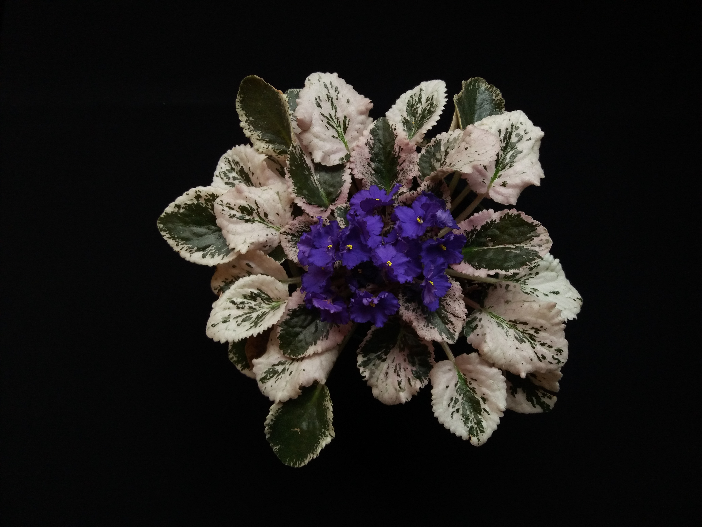
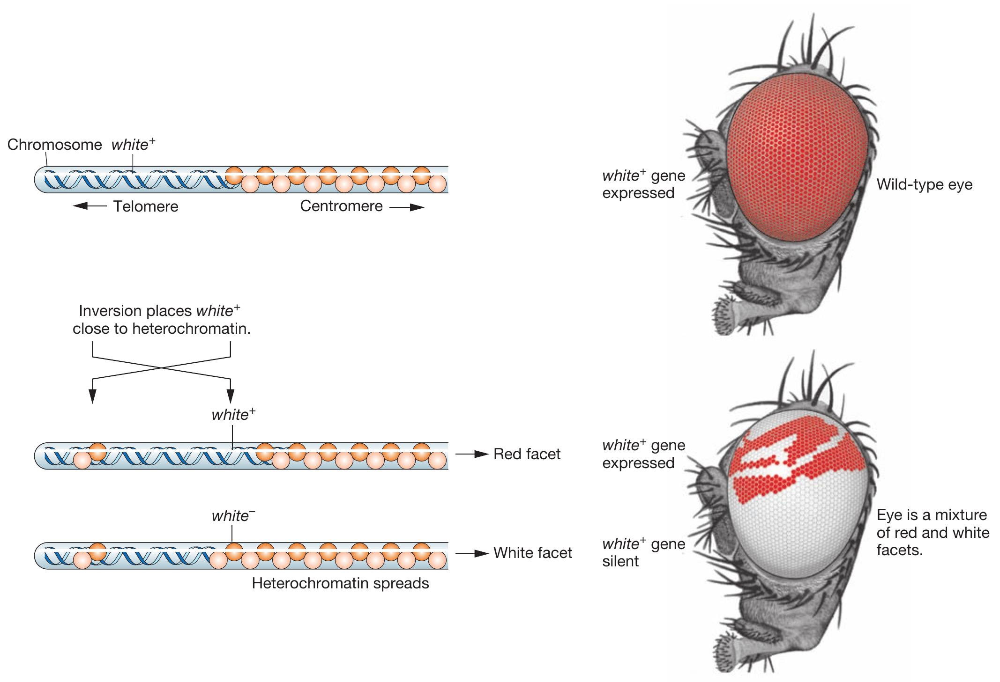
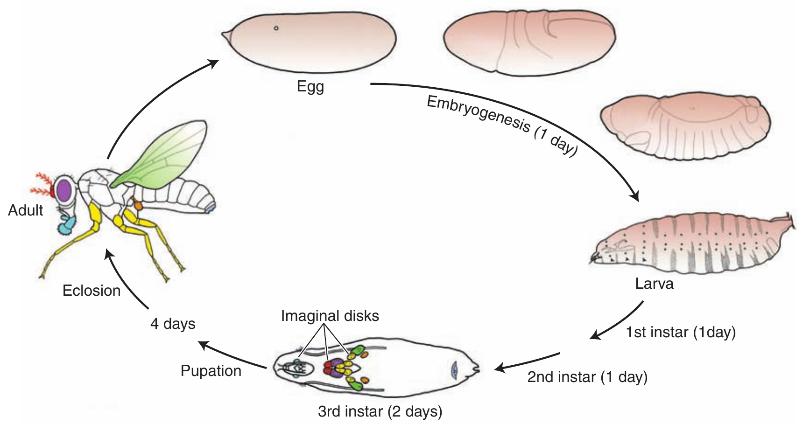
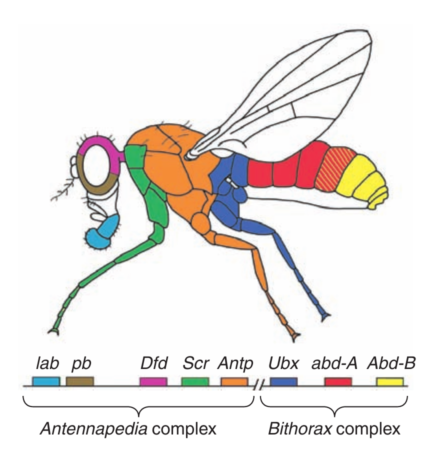
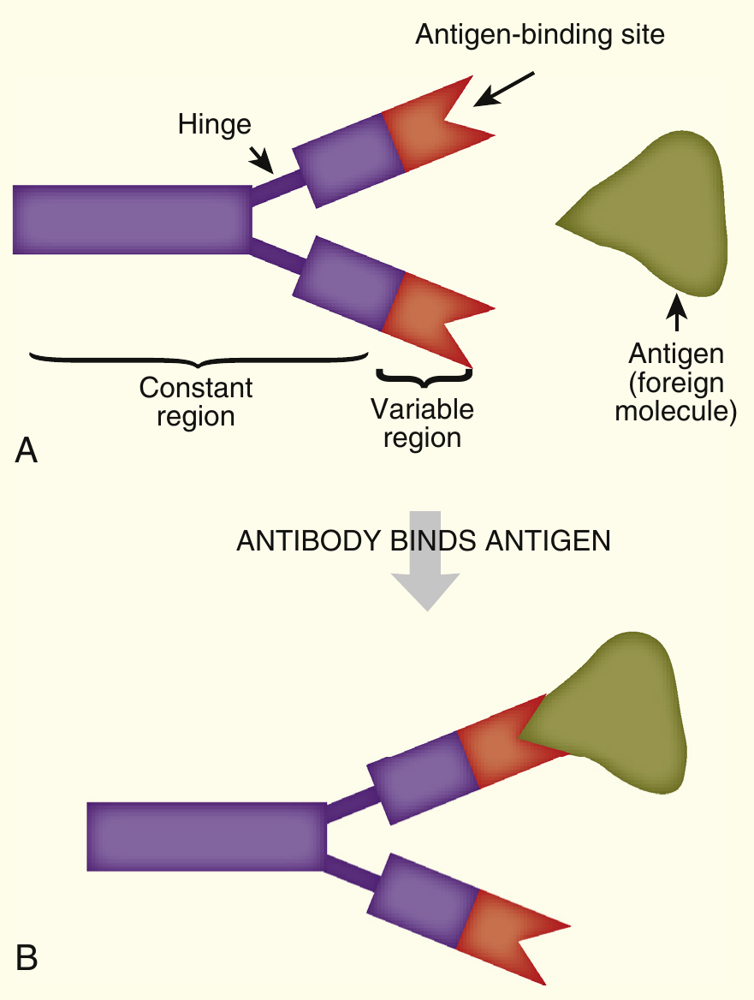

```{r setup, include=FALSE}
library(knitr)
require(tidyverse)
set.seed(453)
# invalidate cache when the package version changes
knitr::opts_chunk$set(tidy = FALSE, echo = FALSE, 
                  message = FALSE, warning = FALSE,
                  out.width = "45%", cache = TRUE, 
                  dev.args=list(bg=grey(0.9), pointsize=11))
options(knitr.table.format = "latex")
options(knitr.kable.NA = "", digits = 2)
options(kableExtra.latex.load_packages = FALSE)
theme_set(theme_bw())
```

# Variegation in biological tissues

## Variegation: meaning

\begin{columns}[T,onlytextwidth]
  \small
  \column{.30\linewidth}
  
  \begin{itemize}
  \item Variegation is the appearance of differently coloured zones in the leaves, and sometimes the stems, of plants. Variegated leaves occur rarely in nature.
  \item Causes are: Chimeral, Pigmentary, Pathological (Mosaic viruses), Genetical due to transposable elements
  \end{itemize}
  
  \column{0.70\linewidth}
  
```{r variegated-saintpaulia, fig.cap="Variegated \\textit{Saintpaulia ionantha} plant", fig.align='center', out.width="68%"}

```

\end{columns}

## Genetics of variegation

- Geneticist Hermann Muller discovered an interesting genetic phenomenon while studying Drosophila: chromosomal neighborhoods exist that can silence genes that are experimentally "relocated" to adjacent regions of the chromosome.
- Flies were irradiated with X rays to induce mutations in their germ cells. 
- The progeny of the irradiated flies were screened for unusual phenotypes. A mutation in the _white_ gene, near the tip of the X chromosome, will result in progeny with white eyes instead of the wild-type red color. 
- Some of the progeny had very unusual eyes with patches of white and red color. 
- Cytological examination revealed a chromosomal rearrangement in the mutant flies: present in the X chromosome was an inversion of a piece of the chromosome carrying the _white_ gene. 
- The white gene, which is normally located in a euchromatic region of the X chromosome, now finds itself near the heterochromatic centromere. In some cells, the heterochromatin can "spread" to the neighboring euchromatin and silence the white gene.

##

```{r chromosomal-rearrangement-pev, fig.cap="Chromosomal rearrangement produces position-effect variegation. Chromosomal inversion places the wild-type white allele close to heterochromatin. The spread of heterochromatin silences the allele. Eye facets are white instead of the wild-type red wherever the allele has been silenced.", out.width="55%"}

# pdftools::pdf_convert("../../literatures/textbooks/Introduction to Genetic Analysis/Griffiths - An Introduction to Genetic Analysis 11th Edition c2015.pdf",
#                       pages = 483, format = "png", dpi = 300,
#                       filenames = "./../images/drosophila_chromosomal_rearrangement_pev.png")

```

##

- Patches of white tissue in the eye are derived from the descendants of a single cell in which the white gene has been silenced and remains silenced through future cell divisions.
- The red patches arise from cells in which heterochromatin has not spread to the _white_ gene, and so this gene remains active in all its descendants.
- Findings from subsequent studies in Drosophila and yeast demonstrated that many active genes are silenced in this mosaic fashion when they are relocated to neighborhoods (near centromeres or telomeres) that are heterochromatic. 
- The ability of heterochromatin to spread into euchromatin and silence genes is a feature common to many organisms. 
- This phenomenon has been called position-effect **variegation** (PEV).

# Development and pattern

## Development

- Development refers to formation of different types of tissues/organs/cells.
- Development involves production of proteins that generate specific structural and functional phenotypes.
- From the genetic perspective, following key questions arise concerning number, identity, and function of genes taking part in development:
  1. Which genes are important in development?
  2. Where in the developing animal and at what times are these genes active?
  3. How is the expression of developmental genes regulated?
  4. Through what molecular mechanisms do gene products affect development?
  
##

- One of the first considerations in study of animal genetics is to go with certain type of organism -- Model organism. (Because it acts as the genetic model in animal development.)
- Many genes are housekeeping genes (cellular metabolism, biosynthesis of macromolecules).
- Some genes carry specialized taks of various organ systems, tissues and cells (such as antibody proteins, oxygen transporter proteins, etc.).
- Other genes perform building of organs and tissues and the specification of cell types

## Differentiation

- Differentiation refers to a permanent or irreversible change in the function of cells (relative to the single-celled zygote), which is often accompanied by change in their structures.
- Weismann and Roux proposed that different cell types differed in their gene content and that each cell type contains only those genes that are needed for its function. But cells do not appear to lose any genetic material during differentiation, except in a few notable cases. RBC extrude their nuclei during the last stages of differentiation, and lymphocytes lose, during differentiation, those segments of antibody genes, which are not needed in a particular cell type.
- In any differentiated cell type, only a small proportion (less than 10%) of the genome is transcribed to yield mRNA, e.g., 2-5 percent in mice liver cells, 8% in brain cells of the toad _Xenopus_, only 1% in _Xenopus_ oocyte, etc.

##

- In different cell types, different sets of genes are transcribed. The RNA sequences present in different cell types may differ from each other by 10-100%. For example, the mRNAs from _Xenopus laevis_ oocytes and blastula (a stage in embryo development) embryos are entirely different; those from mouse liver, spleen and kidney cells differ from each other in sequence composition from about 15-70%, etc.

## Embryo studies in _Drosophila_

- Provided an understanding of formation of basic animal body plan.
- Larval exoskeleton of Drosophila easily shows abnormality in the body plan of a mutant due to its noncellular structure.
- Exoskeleton is made up of polysaccharide polymer from epidermal cells of embryo.
- With intricate pattern of hairs, indentations, and other structures, the exoskeleton provides numerous landmarks to serve as indicators of the fates assigned to the many epidermal cells.
- There are many distinct anatomical structures along the antero-posterior (A–P) and dorsoventral (D–V) axes.

##

- Effects of major mutations in either of the axes **does not** alter embryogenesis in very early young larva.
- Recovery of exoskeleton of such stages mirrors fate of epidermal cells.
- Only small population of cells set aside during embryogeneis proliferate during three larval stages (instars) and differentiate in the pupal stage into adult structures.
- Such cells include _imaginal disks_, and are easy to remove for expression analysis.

##

- Genes contributing to body plan can be cloned and characterized at molecular level easily
- Translation products (protein) can be inferred by identifying close relatives in amino acid sequence.
- Spatial and temporal patterns of expressions can be investigated by expression analysis of:
  - An mRNA, by using histochemically tagged single-stranded DNA sequences complementary to the mRNA to perform RNA in situ hybridization.
  - A protein, by using histochemically tagged antibodies that bind specifically to that protein.

##

```{r drosophila-development, fig.cap="The larva forms in 1 day and then undergoes several stages of growth during which the imaginal disks and other precursors of adult structures proliferate. These structures differentiate during pupation, and the adult fly hatches (eclosion) and begins the cycle again.", out.width="55%"}

# pdftools::pdf_convert("../../literatures/textbooks/Introduction to Genetic Analysis/Griffiths - An Introduction to Genetic Analysis 11th Edition c2015.pdf", 
#                       pages = 499, format = "png", dpi = 300, 
#                       filenames = "./../images/drosophila_development.png")

```

## Extrapolating information 

- There are numerous homeobox genes within _Drosophila_ genome.
- Homeotic gene detection depends on DNA base-pair complementarity.
- Hybridization experiments can be done with _moderate stringency conditions_.
- Homeobox genes have been searched for in other animals, by means of _zoo blots_ by using radioactive Drosophila homeobox DNA as the probe.
- This approach led to the discovery of homologous homeobox sequences in many different animals, including humans and mice.
- Homeotic mutants have following features:
  - Developmental pathways are changed dramatically due to single homeotic gene mutation
  - Structure formed in mutant is alike to well-developed another body part
  - Transform the identity of serially reiterated structures
- Systematic searches for homeotic genes have led to the identification of eight loci, now referred to as Hox genes, that affect the identity of segments and their associated appendages in Drosophila.

##

```{r drosophila-hox-genes, fig.cap="The Hox genes of Drosophila. Eight Hox genes regulate the identity of regions within the adult. The color coding identifies the segments and structures that are affected by mutations in the various Hox genes.", out.width="35%"}

# pdftools::pdf_convert("../../literatures/textbooks/Introduction to Genetic Analysis/Griffiths - An Introduction to Genetic Analysis 11th Edition c2015.pdf",
#                       pages = 502, format = "png", dpi = 300,
#                       filenames = "./../images/drosophila_hox_genes.png")

```

<!-- ## -->

<!-- - Hox genes are the best known among the members of genetic toolkit, however a small family in a much larger group of gene families required for development. -->
<!-- - Later to search for more comprehensive set of genes, an scheme for zygote studies was described. -->
<!-- - Researchers saturated each of the fly's chromosomes with mutations in the process. -->

<!-- ```{r zytotically-required-genes, fig.cap="Genetic screens identify whether a gene product functions in the egg or in the zygote. The phenotypes of offspring depend on either (top) the maternal genotype for maternal-effect genes or (bottom) the offspring (zygotic) genotype for zygotically required genes (m, mutant; +, wild type", out.width="35%"} -->

<!-- # pdftools::pdf_convert("../../literatures/textbooks/Introduction to Genetic Analysis/Griffiths - An Introduction to Genetic Analysis 11th Edition c2015.pdf", -->
<!-- #                       pages = 508, format = "png", dpi = 300, -->
<!-- #                       filenames = "./../images/screening_zygotically_required_genes_maternally.png") -->
<!-- knitr::include_graphics("./../images/screening_zygotically_required_genes_maternally.png") -->
<!-- ``` -->

## Summary

- Despite vast differences in appearance and anatomy, animals have in common a toolkit of genes that govern development.
- Distinguishing feature of toolkit genes is the typical presence of numerous independent cisacting regulatory elements that govern gene expression in different spatial domains and at different stages of development.
- This toolkit is a small fraction of all genes in the genome, and most of these toolkit genes control transcription factors and components of signal-transduction pathways. 
- Individual toolkit genes typically have multiple functions and affect the development of different structures at different stages.
- The development of the growing embryo and its body parts takes place in a spatially and temporally ordered progression.

##

- Spatially restricted patterns of gene expression are products of combinatorial regulation. Each pattern of gene expression has a preceding causal basis. New patterns are generated by the combined inputs of preceding patterns. 
- As an example, the positioning of pair-rule stripes and the restriction of appendage-regulatory-gene expression to individual segments requires the integration of numerous positive and negative regulatory inputs by cis-acting regulatory elements. 
- Post-transcriptional regulation at the RNA level adds another layer of specificity to the control of gene expression. 
- Alternative RNA splicing and translational control by proteins and miRNAs also contribute to the spatial and temporal control of toolkit-gene expression.
- Combinatorial control is key to both the **specificity** and the **diversity** of gene expression and toolkit-gene function.
- The modularity of cis-acting regulatory elements allows for independent spatial and temporal control of toolkit-gene expression and function. They act as switches in the developmental control of gene expression.

# Genetics of cancer

##

- Somatic cells of higher eukaryotes have limited life span, and their growth and
divisions are highly regulated. 
- But occasionally, some cells show uncontrolled division and growth, and an ability to grow in inappropriate locations; these cells are said to be cancerous or tumorigenic and they produce cancer. 
- Uncontrolled growth in non-circulatory tissues produces solid tumors.
- A malignant tumor, or **cancer**, is an aggregate of cells, all descended from an initial aberrant founder cell.
- When tumor becomes **malignant** or **cancerous**, its cells detach and migrate to other parts of body where they produce secondary tumors; this phenomenon is called **metastasis**.
- **Benign** or noncancerous tumors do not exhibit metastasis. 

##

- Cancerous cells are produced due to the following three types of changes:
  - Immortalization, 
  - Transformation
  - Metastasis.
- Cancer arises through: 
  1. An increased mutation rate that creates genetic variation and 
  2. Selection of cells for increased proliferation rates; several cycles of these events occur in the progression of cancer. [@singh2018fundamentals], page 386.

##

- Cancer researchers have identified genes that, when mutated, can contribute to the development of a cancerous state. In it, genes or mutant genes actively promote cell division. 
- The genes are called **oncogenes**, from the Greek word for 'tumor.' 
- Oncogenes: Many cancers involve the overexpression of certain genes or the abnormal activity of their mutant protein products; They result in dominant mutations, usually owing to their inappropriate activation. 
- In contrast, tumor-suppressor genes encode proteins whose loss of activity can contribute to a cancerous state. As such, they are recessive mutations.
- These genes were first discovered in the genomes of RNA viruses that are capable of inducing tumors in vertebrate hosts.
- Later, the cellular counterparts of these viral oncogenes were discovered in many different organisms ranging from _Drosophila_ to humans.

## Tumor producing retroviruses and viral oncogenes

- Understanding of genetic basis of cancer has come from the study of tumor-inducing viruses. 
- Many of these viruses have a genome composed of RNA instead of DNA. 
- After entering a cell, the viral RNA is used as a template to synthesize complementary DNA, which is then inserted at one or more positions in the cell’s chromosomes. 
- The synthesis of DNA from RNA is catalyzed by the viral enzyme reverse transcriptase. This reversal of the normal flow of genetic information from DNA to RNA has prompted biologists to call these pathogens **retroviruses**.

##

- The first tumor-inducing virus was discovered in 1910 by Peyton Rous; it caused a special kind of tumor, or sarcoma, in the connective tissue of chickens and has since been called the Rous sarcoma virus.
- Rous was awarded the Nobel Prize in Physiology or Medicine for the significance of his discovery in 1966. Modern research has shown that the RNA genome of this retrovirus contains four genes: _gag_, _pol_, _env_
- **Other examples**:
  - Breast cancer (*BRCA2*): Autosomal dominant. Tumor suppressor defect giving predisposition to breast and other cancers
  - *TLF*: Colon cancer
  - *Gli1*: Basal-cell carcinoma
  - *DPC4*: Pancreatic and colon
  - *hNotch1*: Leukemia, lymphoma

# Immunogenetics

## Introduction

\begin{columns}[T,onlytextwidth]
  \small
  \column{.35\linewidth}
  
  \begin{itemize}
  \item The immune system keeps a repertoire of B cells that are poised to make antibodies to invading pathogens. 
  \item When one of these B-cell antibodies is needed, the B cell starts dividing so that many antibodies can be produced and they are available to attack the pathogen. 
  \item Some of these clones are refined by mutation to make a more specific antibody.
  \end{itemize}
  
  \column{0.65\linewidth}
  
```{r antibody-antigen-recognition, out.width="50%", fig.align='center'}
# pdftools::pdf_convert("/home/deependra/Desktop/BSc_Ag_lectures/literatures/biotechnology/Biotechnology 2nd ed - David P. Clark, Nanette J. Pazdernik (AP, 2016).pdf", pages = 187,
#                       format = "png", dpi = 300,
#                       filenames = "./../images/antibody_antigen_recognition.png")

```

\end{columns}

##

- Acquired immunity is divided into two branches. Humoral immunity is mediated by antibodies in blood plasma, which are produced by B cells. The second part is cellular immunity, which is mediated by T cells.
- Antibodies recognize epitopes or specific regions of the invading pathogen.
- Antibodies are very diverse in structure so that all the pathogens can be recognized.
- Antibodies are produced by shuffling gene segments rather than having one gene code for each different antibody; the process is called **V(D)J** recombination.
- Amino acids making up protein molecules can be rearranged to give an almost infinite number of different sequences and, therefore, of different shapes.
- Just three segments of a gene rearranging in all possible combinations gives nine different genes.
- Animals can make billions of possible antibodies from only a few thousand gene segments.

##

- ELISA (diagnostics) procedure uses antibodies for clinical use.
- Antibodies of various mixtures with variying affinities to antigen/s is reffered to as polyclonal antibody. However such antibodies are of little use for a specific, accurate assay.
- Pure antibody made by a single line of cells is known as a **monoclonal antibody**.
- An example of antibody generation technology is by exploiting myelomas (naturally occurring cancers) derived from B cells; they therefore express
immunoglobulin genes, as long as they are given proper nutrients.
- To make monoclonal antibodies, scientists fuse the relatively delicate B cell, which is making the required antibody, to a myeloma cell. The resulting hybrid is called a **hybridoma**.

##

\begin{figure}
\begin{columns}[T,onlytextwidth]
\column{.70\linewidth}
\begin{center}
\includegraphics[width=0.28\linewidth]{./../images/hybridoma_principle.png}
\end{center}
\column{.30\linewidth}
\caption{\newline \textbf{Principle of the Hybridoma} \newline Monoclonal antibodies derive from a single antibody-producing B cell. The antigen is first injected into a mouse to provoke an immune response. The spleen is harvested because it harbors many activated B cells. The spleen cells are short-lived in culture, so they are fused to immortal myeloma cells. The hybridoma cells are cultured and isolated so each hybrid is separate from the other. Each hybrid clone can then be screened for the best antibody to the target protein.}
\label{fig:monoclonal-antibody-hybridoma}
\end{columns}
\end{figure}

<!-- pdftools::pdf_convert("/home/deependra/Desktop/BSc_Ag_lectures/literatures/biotechnology/Biotechnology 2nd ed - David P. Clark, Nanette J. Pazdernik (AP, 2016).pdf", pages = 195, -->
<!--                       format = "png", dpi = 300, -->
<!--                       filenames = "./../images/hybridoma_principle.png") -->

## Vaccination

- Vaccination takes advantage of immune memory. 
- Vaccines consist of various derivatives of infectious agents that no longer cause disease but are still antigenic; that is, they induce an immune response. 
- For example, bacteria killed by heat are sometimes used. The antigens on the dead bacteria stimulate B-cell division. 
- Some of the B cells form memory cells so, later, when living germs corresponding to the vaccine attack the vaccinated person, the immune system is prepared.

# Bibliography

## References
