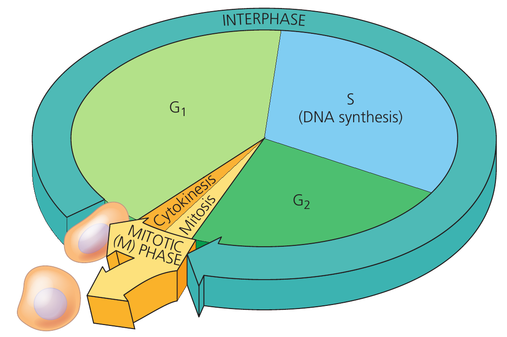
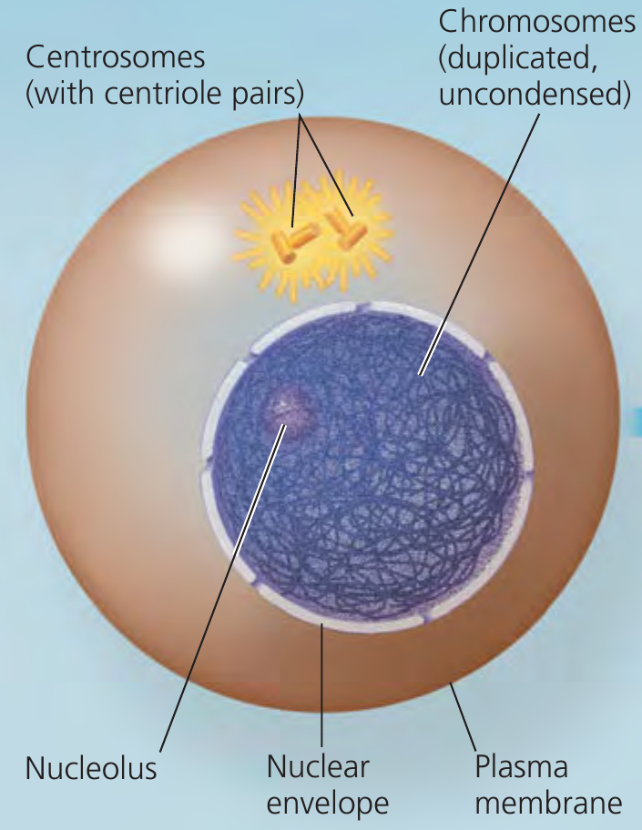
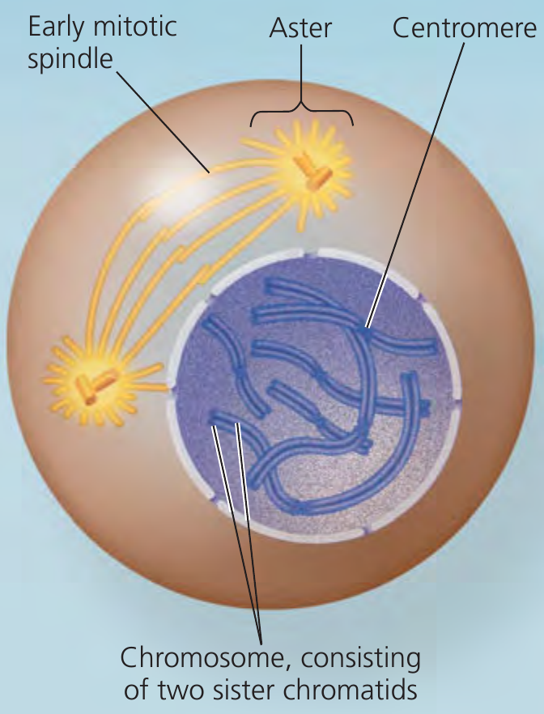
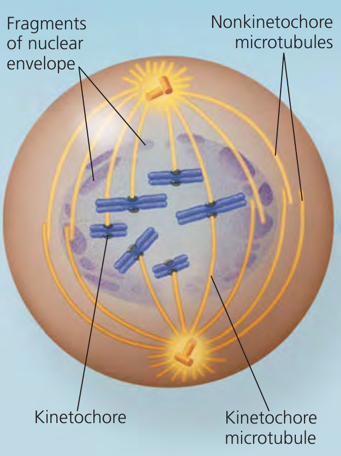
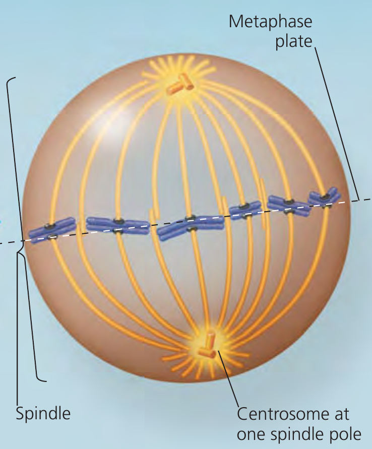
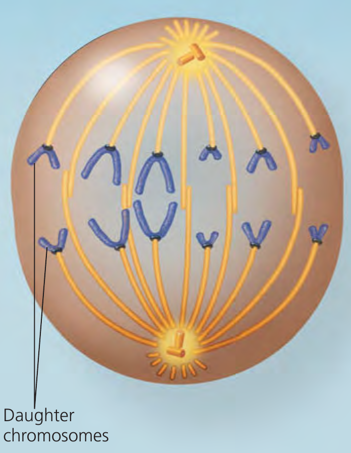
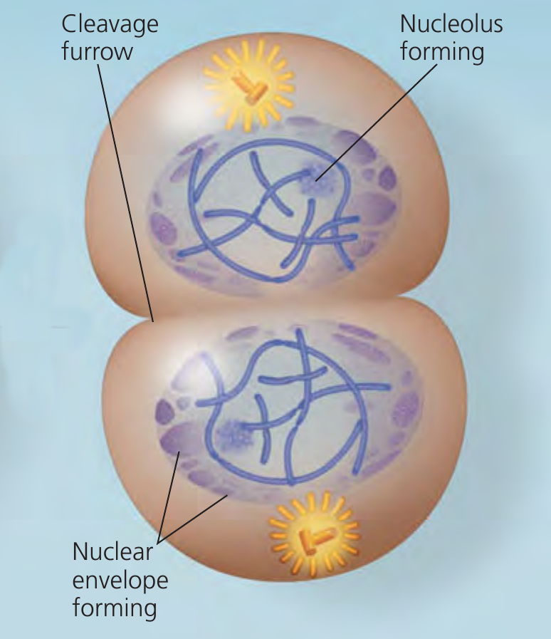

# Study of features of mitosis

## Objectives

1. To study about different stages of mitotic cell division

## Theory

- **Mitosis** is the division of the genetic material in the nucleus, usually followed immediately by **cytokinesis**.
- Walther Flemming coined the terms *mitosis* and *chromatin*.
- Mitosis and cytokinesis produce cells that make up most of our bodies and same process continues to generate new cells to replace dead and damaged ones.
- Mitotic (M) phase, including both mitosis and cytokinesis, is the shortest part of a cell's life cycle.
- M phase alternates with **interphase** (accounts for 90% of the cycle).
- Interphase can be divided into subphases (with time lapse for a normal human cell, about **24 hours**): 
  - the $\mathbf{G_1}$ phase ("first gap") $\longrightarrow$ 5-6 hours, 
  - the S phase ("synthesis") $\longrightarrow$ 10-12 hours, and 
  - the $\mathbf{G_2}$ phase ("second gap") $\longrightarrow$ 4-6 hours. 
- During all three subphases, a cell that will eventually divide grows by producing proteins and cytoplasmic organelles such as mitochondria and endoplasmic reticulum. 
- Chromosomes are duplicated only during the S phase.

Mitosis usually takes up only a small proportion of the cell cycle, approximately 5-10 percent. The remaining time in the interphase, composed of G1, S, and G2 stages. The DNA is replicated during the S phase, although the duplicated DNA does not become visible until later in mitosis. The chromosomes cannot be seen during iterphase. Mainly because they are in an extended state and are intertwined with one another like a tangle of yarn.

A type of nuclear division (occurring at cell division) that produce two daughter nuclei identical with that of the parent nucleus is known as mitosis. The cell undergoing mitotic division goes through two distinct phases namely -- interphase and mitotic phase.

Interphase comprises of following events:

1. Structural and functional protein are synthesized
2. RNA and ribosomes are synthesized
3. DNA of each chromosome replicates and each chromosome becomes two sister chromatids which lay side by side
4. Cell volume increases

The G phases were misnamed as "gaps" when they were first observed because the cells appeared inactive, but we now know that intense metabolic activity and growth occur throughout interphase. During all three phases of interphase, in fact, a cell grows by producing proteins and cytoplasmic organelles such as mitochondria and endoplasmic reticulum. Duplication of the chromosomes, crucial for eventual division of the cell, occurs entirely during the S phase. Thus, a cell grows (G1), continues to grow as it copies its chromosomes (S), grows more as it completes preparations for cell division (G2), and divides (M). The daughter cells may then repeat the cycle.

A particular human cell might undergo one division in 24 hours. Of this time, the M phase would occupy less than 1 hour, while the S phase might occupy 10–12 hours, or about half the cycle. The rest of the time would be apportioned between the G1 and G2 phases. The G2 phase usually takes 4–6 hours; in our example, G1 would occupy about 5–6 hours. G1 is the most variable in length in different types of cells. Some cells in a multicellular organism divide very infrequently or not at all.

```{r interphases, out.width="60%", fig.align='center', fig.cap="In a dividing cell, the mitotic (M) phase alternates with interphase, a growth period. The first part of interphase (G1) is followed by the S phase, when the chromosomes duplicate; G2 is the last part of interphase. In the M phase, mitosis distributes the daughter chromosomes to daughter nuclei, and cytokinesis divides the cytoplasm, producing two daughter cells."}
# pdftools::pdf_convert("/home/deependra/ddhakal/000readables/general/2017_Campbell Biology.pdf",
#                       pages = 285,
#                       dpi = 300, format = "png",
#                       filenames = "./../images/interphase_all.png")


```

\begin{minipage}[t]{\textwidth}
\begin{minipage}[t]{0.50\textwidth}
G2 of Interphase

\begin{itemize}
\item A nuclear envelope encloses the nucleus
\item The nucleus contains one or more nucleoli (singular, nucleolus)
\item Two centrosomes have formed by duplication of a single centrosome. Centrosomes are regions in cell that organize the microtubules of the spindle. Each centrosome contains two centrioles.
\item Chromosomes, duplicated during S phase, cannot be seen individually because they have not yet condensed.
\end{itemize}
\end{minipage}\hspace{0.5cm}
\begin{minipage}[t]{0.3\textwidth}

```{r g2-interphase, fig.align='center', fig.show='hold'}
# pdftools::pdf_convert("/media/deependra/e4da4ac5-3b38-4b89-9402-397eb940e4d3/Addition/Generalized Study/Reece Campbell Biology 9th txtbk.pdf",
#                       pages = 280,
#                       dpi = 300, format = "png",
#                       filenames = "../images/mitosis_animal_cell21.png")


```
\end{minipage}%
\end{minipage}

Following events describe mitotic phase:

\noindent\begin{minipage}[t]{\textwidth}
\begin{minipage}[t]{0.30\textwidth}

1. Prophase
  
\begin{itemize}
\item The chromatin fibers become more tighly coiled, condensing into discrete chromosomes observable with a light microscope.
\item The nucleoli disappear.
\item Each duplicated chromosomes appear as two identical sister chromatids joined at their centromeres and, in some species, all along their arm by cohesins (sister chromatid cohesion)
\item The mitotic spindle (named after its shape) begins to form. It is composed of the centrosomes and the microtubules that extend from them. The radial arrays of shorter microtubules that extend from the centrosomes are called asters ("stars").
\item The centrosomes move away from each other, propelled partly by the lengthing microtubules between them.
\end{itemize}

```{r mitosis-prophase, fig.align='center'}

```

\end{minipage}\hspace{0.5cm}
\begin{minipage}[t]{0.30\textwidth}

2. Early metaphase

\begin{itemize}
\item The nuclear envelope fragments.
\item The microtubules extending from each centrosome can now invade the nuclear area.
\item The chromosomes have become even more condensed.
\item Each of the two chromatids of each chromosome now has a kinetochore, a specialized protein structure at the centromere.
\item Some of the microtubules attach to the kinetochores, becoming "kinetochore microtubules", which jerk the chromosomes back and forth.
\item Nonkinetochore microtubules interact with those from opposite pole of the spindle.
\end{itemize}

```{r mitosis-early-metaphase, fig.align='center'}

```

\end{minipage} \hspace{0.5cm}
\begin{minipage}[t]{0.30\textwidth}

3. Late metaphase

\begin{itemize}
\item The centrosomes are now at opposite poles of the cell.
\item The chromosomes convene at the metaphase plate, a plane that is equidistant between the spindle's two poles. The chromosomes' centromeres lie at the metaphase plate.
\item For each chromosome, the kinetochores of the sister chromatids are attached to kinetochore microtubules coming from opposite poles.
\end{itemize}

```{r mitosis-late-metaphase, fig.align='center'}

```

\end{minipage}%
\end{minipage}

\begin{minipage}[t]{\textwidth}
\begin{minipage}[t]{0.5\textwidth}

4. Anaphase

\begin{itemize}
\item Anaphase is the shortest stage of mitosis, often lasting only a few minutes.
\item Anaphase begins when the cohesin proteins are cleaved. This allows the two sister chromatids of each pair to part suddenly. Each chromatid thus becomes full-fledged chromosome.
\item The two liberated daughter chromosomes begin moving toward opposite ends of the cell as their kinetochore microtubules shorten. Because these microtubules are attached at the centromere region, the chromosomes move centromere first (at about 1 micron/min).
\item The cell elongates as the nonkinetochore microtubules lengthen.
\item By the end of anaphase, the two ends of the cell have equivalent -- and complete -- collections of chromosomes.
\end{itemize}

```{r mitosis-anaphase, fig.align='center', out.width="45%"}

```

\end{minipage}\hfill\hspace{0.5cm}
\begin{minipage}[t]{0.5\textwidth}

5. Telophase

\begin{itemize}
\item Two daughter nuclei form in the cell. Nuclear envelopes arises from the fragments of the parent cell's nuclear envelope and other portions of the endomembrane system.
\item Nucleoli reappear.
\item The chromosomes become less condensed.
\item Any remaining spindle microtubules are depolymerized.
\item Mitosis, the division of one nucleus into two genetically identical nuclei, is now complete.
\end{itemize}

```{r mitosis-telophase, fig.align='center', out.width="45%"}

```

\end{minipage}%
\end{minipage}

Beside these four phases, cytokinesis (a part of cell cycle) occur after completion of telophase. In cytokinesis, following events are noticeable:

- The division of the cytoplasm is usually well under way by late telophase, so the two daughter cells appear shortly after the end of mitosis.
- In animal cells, cytokinesis involves the formation of a cleavage furrow, which pinches the cell in two.

## Conclusion

Hence, after study of mitotic diagrams and comparing and contrasting among several stages of a cell cycle, we understand that mitotic division of cell results into equal and identical allocation of genetic material from a parent cell to daughter cells.
