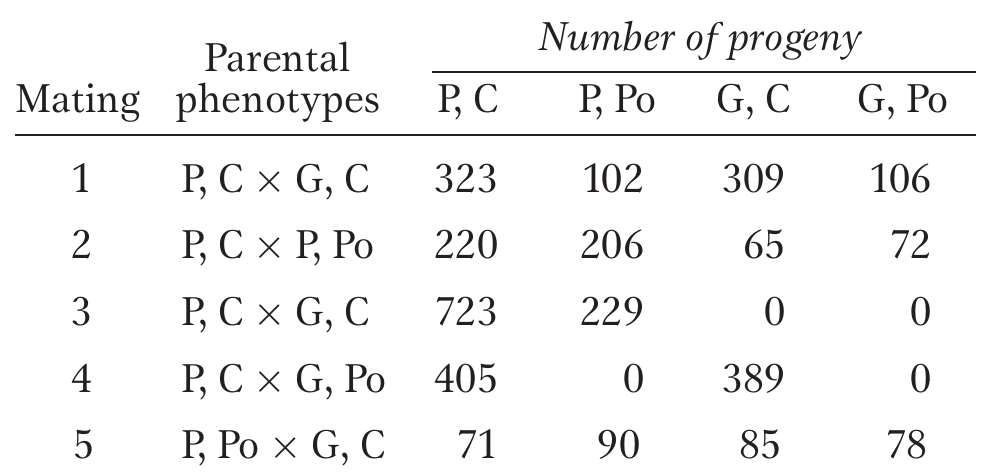

# Solution of numerical problems related to Mendel's law of independent assortment

## Question 1

In tomatoes, one gene determines whether the plant has purple (P) or green (G) stems, and a separate, independent gene determines whether the leaves are "cut" (C) or "potato" (Po). Five matings of tomato-plant phenotypes give the following results. 

1. Which alleles are dominant ?
2. What are the most probable genotypes for the parents in each cross ?
  
```{r independent-assortment-example, out.width="40%", fig.align='center'}
# pdftools::pdf_convert("../../literatures/textbooks/Introduction to Genetic Analysis/Griffiths - An Introduction to Genetic Analysis 11th Edition c2015.pdf",
#                       pages = 148,
#                       dpi = 300, format = "png",
#                       filenames = "../images/independent_assortment_example1.png")


```


## Solution 1

Dominance and parental genotype determination

- Cross 2 indicates that purple (G) is dominant over green (g), and cross 1 indicates that cut (P) is dominant over potato (p).

```{r}
cross_tomato <- tribble(~"cross", ~"observed_approximate_ratio",
        "Cross 1: G/g; P/p x g/g; P/p", "There are 3 cut:1 potato, and 1 purple: 1 green",
        "Cross 2: G/g; P/p x G/g; p/p", "There are 3 purple: 1 green, and 1 cut: 1 potato",
        "Cross 3: G/G; P/p x g/g; P/p", "There is no green, and there are 3 cut: 1 potato",
        "Cross 4: G/g; P/P x g/g; p/p", "There is no potato, and there is 1 purple: 2",
        "Cross 5: G/g; p/p x g/g; P/p", "There is 1 cut: 1 potato, and there is 1 purple: 1 green")

cross_tomato %>%
  rename_all(function(x)str_replace_all(x, "_", " ") %>%
               str_to_sentence()) %>%
  knitr::kable(booktabs = TRUE) %>%
  kableExtra::kable_styling(latex_options = c("striped", "HOLD_position"), position = "center", font_size = 10)
```

## Question 2

(Effective crossing) A corn geneticist has three pure lines of genotypes a/a; B/B; C/C, A/A; b/b; C/C, and A/A; B/B; c/c. All the phenotypes determined by a, b and c will increase the market value of the corn; so, naturally, he wants to combine them all in one pure line of genotype a/a; b/b; c/c.

  1. Outline an effective crossing program that can be used to obtain the a/a; b/b; c/c pure line.
  2. At each stage, state exactly which phenotypes will be selected and give their expected frequencies.
  3. Is there more than one way to obtain the desired genotype ? Which is the best way ? (Assume independent assortment of the three gene pairs.)

## Solution 2

1. Begin with any two of the three lines and cross them. If, for example, you began with a/a; B/B; C/C x A/A; b/b; C/C, all the progeny would be A/a; B/b; C/C. Crossing two of them would yield:

$$
\begin{aligned}
& 9  & A/\_; B/\_; C/C \\
& 9  & a/a; B/\_; C/C \\
& 9  & A/\_; b/b; C/C \\
& 9  & a/a; b/b; C/C
\end{aligned}
$$

\renewcommand{\arraystretch}{2}

```{r gamete-three-combination}
# gamete types
gamete_types <- expand.grid(c("A", "a"),
                            c("B", "b"),
                            c("C", "c")) %>%
  unite(col = "gamete_types", sep = "") %>%
  pull("gamete_types")
# random mating of gametes
combination_genotypes <- crossing(p2_gamete = gamete_types, p1_gamete = gamete_types) %>%
  # group_by(gamete_types)
  unite(col = "genotype", remove = FALSE, sep = "") %>%
  spread(key = p1_gamete, value = genotype)
genotype_orderer <- function(x){
  map_chr(x, function(y){
    str_extract_all(y, "") %>%
      unlist() %>%
      str_sort(decreasing = FALSE) %>%
      paste0(collapse = "")
  })
}
combination_genotypes <- combination_genotypes %>%
  mutate_all(list(~genotype_orderer(.)))
# # number of unique genotypes
# ca <- c("AA", "Aa", "aa")
# cb <- c("BB", "Bb", "bb")
# cc <- c("CC", "Cc", "cc")
# unique_genotypes <- expand.grid(ca, cb, cc) %>%
#   unite(col = "all_gametes", sep = "") %>%
#   pull(all_gametes) %>%
#   unique()
# manually specify colors
seven_colors <- c("#ffe6ff", "#1a1aff", "#cc3399", "#4d004d", "#ffb31a", "#00994d", "#80ffff")
fanta <- function(x)(stringi::stri_extract_all_regex(x, ".") %>%
                       map(unlist) %>%
                       map_int(~str_detect(.x, "[A-Z]") %>%
                                 sum()))
combination_genotypes %>%
  rename("Gamete types" = p2_gamete) %>%
  mutate_at(2:9, list(~case_when(
    fanta(.) == 0 ~ kableExtra::cell_spec(., "latex", background = seven_colors[1]),
    fanta(.) == 1 ~ kableExtra::cell_spec(., "latex", background = seven_colors[2]),
    fanta(.) == 2 ~ kableExtra::cell_spec(., "latex", background = seven_colors[3]),
    fanta(.) == 3 ~ kableExtra::cell_spec(., "latex", background = seven_colors[4]),
    fanta(.) == 4 ~ kableExtra::cell_spec(., "latex", background = seven_colors[5]),
    fanta(.) == 5 ~ kableExtra::cell_spec(., "latex", background = seven_colors[6]),
    fanta(.) == 6 ~ kableExtra::cell_spec(., "latex", background = seven_colors[7]),
    TRUE ~ .
  ))) %>%
  kable(booktabs = TRUE, format = "latex", escape = FALSE, linesep = "") %>%
  kableExtra::kable_styling(latex_options = c("scale_down", "HOLD_position"), font_size = 8)
```

\renewcommand{\arraystretch}{1}

- The a/a; b/b; C/C genotype has two of the gens in a homozygous recessive state and is found in 1/16 of the offspring.
2. If that phenotype were crossed with A/A; B/B; c/c, all the progeny would be heterozygous for all loci. Crossing two (selfing) of thus obtained individuals would lead to a 27:9:9:9:3:3:3:1 ratio and 1/64 of the progeny would be the desirable a/a; b/b; c/c.
3. There are several different routes to obtaining a/a; b/b; c/c, but the one just outlined only requires four crosses.

## Question 3

How many different types of $F_1$ gametes, $F_2$ genotypes and $F_2$ phenotypes would be expected from:

(a) AA x aa, AABB x aabb, AABBCC x aabbcc
(b) What general formula can be applied for $F_1$ gametes, $F_2$ genotypes and $F_2$ phenotypes ?

## Question 4

In tomato red fruit flower is dominant to yellow, two loculed fruit is dominant to many loculed and tall vine is dominant to dwarf. A breeder has two pure lines; red two loculed dwarf and yellow many loculed tall. From these two lines, he wants to produce new pure line of yellow, two loculed and tall. How exactly should he go about doing this ? Show not only which crosses to make, but also how many progeny should be sampled in each case?

## Question 5

In dogs, dark coat color is dominant over albino, and short hair is dominant over the long hair. If these effects are caused by two independently segregating gene pairs, write the most preferable genotypes for the parents of each of the following crosses.

```{r dog-coat-color-phenotypes}
tribble(~"Parental phenotypes", ~"Dark short", ~"Dark long", ~"Albino short", ~"Albino long",
        "Dark short x Dark short", 89, 31, 29, 11,
        "Dark short x Dark long", 19, 19, 0, 0,
        "Dark short x Albino short", 20, 0, 21, 0,
        "Albino short x Albino short", 0, 0, 28, 9,
        "Dark long x Dark long", 0, 32, 0, 10,
        "Dark short x Dark long", 29, 31, 9, 11
        ) %>% 
  knitr::kable(booktabs = TRUE) %>% 
  kableExtra::kable_styling(font_size = 8, position = "center", latex_options = "HOLD_position")
```

