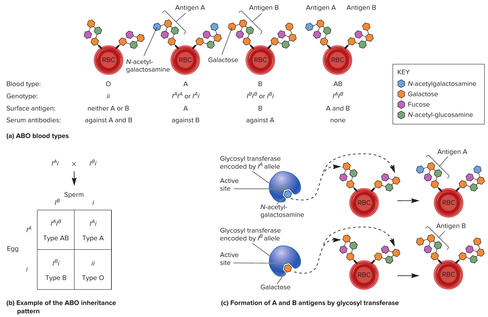

# Solution of numerical problems related to gene actions

## Question 1

Two curly winged fruit flies are mated. The $F_1$ consists of 341 curly and 170 normal. Explain.

## Question 2

In families in which both parents have sickle cell trait. What is the probability of their having

(a) A child with sickle cell trait
(b) A normal child

## Question 3

If a man of blood group *AB* marries a woman of blood group *A* whose father was of blood group *O*, to what different blood groups can this man and woman expect their children to belong ?

Solution:

The ABO group of antigens, which determine blood type in humans, are produced in the human population under the control of multiple allelesl two of these alleles exhibit a relationship called codominance.

The plasma membranes of red blood cells have groups of interconnected sugars -- oligosaccharides -- that act as surface antigens. Antigens are molecular structures that are recognized by antibodies produced by the immune system.

The synthesis of these surface antigens is controlled by three alleles, designated $i$, $I^A$, and $I^B$. A person who is homozygous $ii$ has type O blood and produces a relatively short oligosaccharide, which is called H-antigen. The $i$ allele is recessive to both $I^A$ and $I^B$. A homozygous $I^AI^A$ or heterozygous $I^Ai$ individual has type A blood. The red blood cells of this individual contains the surface antigen known as A. Similarly, a homozygous $I^BI^B$ or heterozygous $I^Bi$ individual produces surface antigen B. Surface antigens A and B have different molecular structure. A person who is $I^AI^B$ has a blood type AB and expresses both surface antigens A and B.

```{r blood-group-antigen-inheritance, fig.align='center', out.width="70%"}
# pdftools::pdf_convert("E:/000readables/plbgen/2021-Brooker R. Genetics. Analysis and Principles 7ed.pdf",
#                       format = "png", pages = 97, filenames = "blood_group_antigen_inheritance.png", dpi = 300)

```


Biochemists have analyzed the oligosaccharides on the surface of cells of differing blood types. In type O, the oligosaccharide is smaller than in type A and B because a sugar has not been attached to a specific site on the oligosaccharide. The gene that determines ABO blood type encodes a type of enzyme called a glycosyl transferase that attaches a sugar to an oligosaccharide.
  - The $i$ allele carries a mutation that renders this enzyme inactive, which prevents the attachment of an additional sugar
  - By comparison, the two types of glycosyl transferase encoded by the $I^A$ and $I^B$ alleles have different structures in their active sites.
  - The glycosyl transferase encoded by the $I^A$ allele recognizes uridine diphosphate N-acetylgalactosamine and attaches N-acetylgalactosamine to the oligosaccharide. This produces the molecular structure of surface antigen A.
  - The glycosyl transferase encoded by the $I^B$ allele recognizes UDP-galactose and attaches galactose to the oligosaccharide. This produces the molecular structure of surface antigen B.
- A person with type AB blood makes both types of enzymes and thereby makes oligosaccharides with both types of sugar attached.

A small difference in the structure of the oligosaccharide, namely, a GalNAc in antigen A versus galactose in antigen B, explains why the two antigens are different from each other at the molecular level. A person who has blood type A makes antibodies to blood type B. The antibodies against blood type B require a galactose on the oligosaccharide for their proper recognition. This person's antibodies will not recognize and destroy the person's own blood cells, but they will recognize and destroy the blood cells from a type B person.


## Question 4

In cattle the gene, *R* for red coat is not dominant over white *r*. The heterozygous *Rr* produces roan coat color. What phenotypes might be expected from the following mating ?

(a) Red x red, roan x roan, red x roan, roan x white, red x white, and white x white. Give the genotypes of the parents and progeny.

## Question 5

From the following table, can the paternity of the children be established ?

```{r paternity-establishment}
tribble(
  ~"Person", ~"Antigen AB", ~"Antigen MN", ~"Antigen RH",
  "Husband", "O", "M", "RH+",
  "Wife's lover", "AB", "MN", "RH-",
  "Wife", "A", "N", "RH+",
  "Child 1", "O", "MN", "RH+",
  "Child 2", "A", "N", "RH+",
  "Child 3", "A", "MN", "RH-"
) %>% 
  knitr::kable(booktabs = TRUE) %>% 
  kableExtra::kable_styling(position = "center", font_size = 8, latex_options = "HOLD_position")
```

