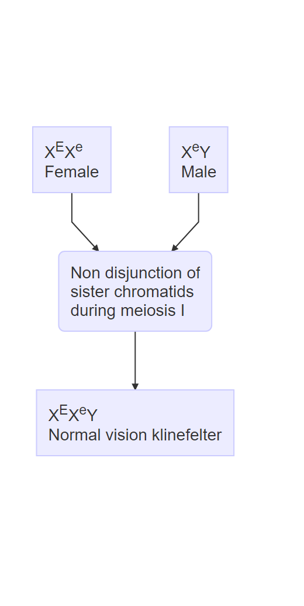
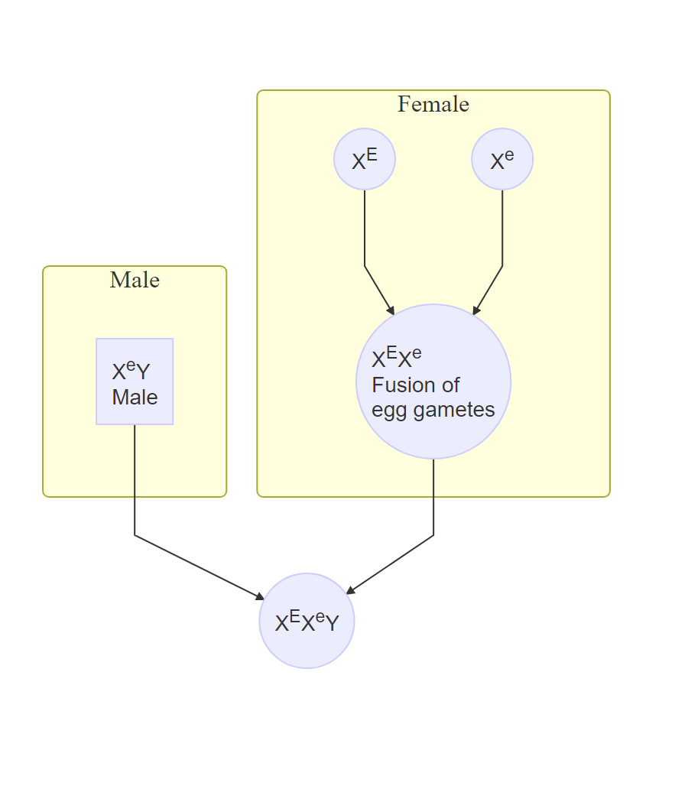
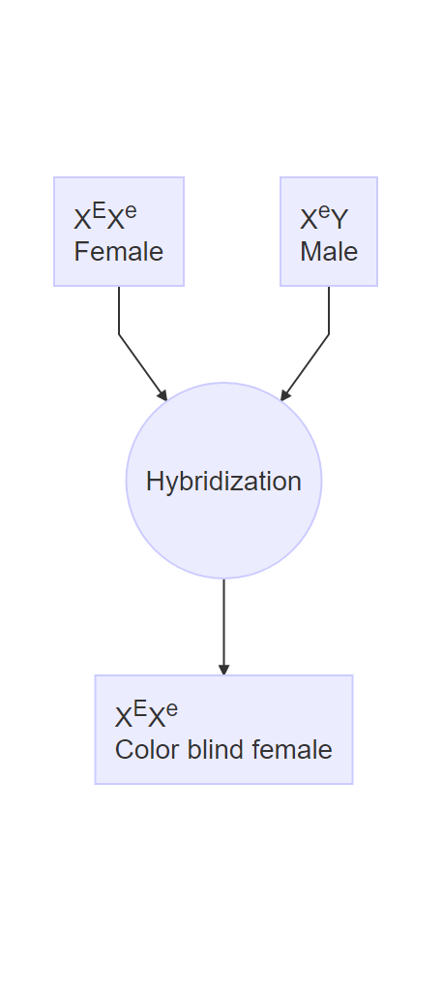

# Solution of numerical problems related to sex determination and linkage

## Question 1

What is the sex designation for each of the following individuals in human ?

i. AAXXX
ii. AAXXXYYY
iii. AAXO
iv. AAXXXXXY
v. AAXYYY
vi. AAXXY

## Question 2

In poultry, sex linked allele, $B$ produces barred feather pattern (dominant to $b$ -- non-barred). Autosomal allele $R$ produces rose comb and its recessive allele form, $r$ produces single comb in homozygous recessive state. What is the $F_1$ phenotype obtained by crossing barred female homozygous for rose comb to non-barred single comb male ? Write the genotypes of the parents and $F_1$.
 
## Question 3

A sex-linked recessive allele c produces a red-green color blindness in humans. A normal woman whose father was color blind marries a color-blind man.

- What genotypes are possible for the mother of the color blind man ? 
- What are the chances that the first child from this marriage will be a color-blind boy ? 
- Of the girls produced by these parents, what proportion can be expected to be color blind ? 
- Of all the children (sex unspecified) of these parents, what proportion can be expected to have normal color vision ?

## Solution 3

a. $X^C/X^c, X^c/X^c$
b. p (color-blind) x p (\male) = (1/2)(1/2) = 1/4
c. The girls will be 1 normal ($X^C/X^c$): 1 color-blind ($X^c/X^c$).
d. The cross is $X^C/X^c \times X^c/Y$, yielding 1 normal:1 color-blind for both sexes.

## Question 4

The recessive gene e, produces color blind in human, which is sex linked gene. A carrier woman of this gene married a color blind man and produced first child, a normal vision klinefelter but in the second time this couple gave birth a color blind daughter. How such klinefelter and daughter may be produced? Show with the help of clean diagram.

## Solution 4

The combination XXY of sex chromosome results in klinefelter syndrome. We treat the question differently for different births. The details are presented diagrammatically below:

\underline{1st birth}

- Parents obtained normal vision klinefelter
- Following possibilities remain during fertilization.

Case of 1st birth showing parental combinations producing klinefelter offspring.

\begin{figure*}[t!]
    \centering
    \begin{subfigure}[t]{0.5\textwidth}
        \centering
```{r first-birthi, out.width="50%"}
# mer_first_birthi <- DiagrammeR::mermaid(
#   "
#   graph TB
#
#   x11[X<sup>E</sup>X<sup>e</sup><br>Female] --> x21(Non disjunction of<br> sister chromatids<br> during meiosis I)
#   x12[X<sup>e</sup>Y<br>Male] --> x21
#   x21 --> x31[X<sup>E</sup>X<sup>e</sup>Y<br>Normal vision klinefelter]
#
#   "
# )
#
# htmltools::html_print(mer_first_birthi) %>%
#   webshot2::webshot("../images/mer_first_birthi.png", vwidth = 260, vheight = 540, zoom = 2)


```
        \caption{Case I (Non-disjunction)}
    \end{subfigure}%
    ~
    \begin{subfigure}[t]{0.5\textwidth}
        \centering
```{r first-birthii, out.width="50%"}
# mer_first_birthii <- DiagrammeR::mermaid(
#   "
#   graph TB
#
#   subgraph Female
#   x11((X<sup>E</sup>)) --> x21((X<sup>E</sup>X<sup>e</sup><br>Fusion of<br> egg gametes))
#   x12((X<sup>e</sup>)) --> x21
#   end
#
#   subgraph Male
#   x13[X<sup>e</sup>Y<br>Male]
#   end
#
#   x13 --> x31((X<sup>E</sup>X<sup>e</sup>Y))
#   x21 --> x31
#   "
# )
#
# htmltools::html_print(mer_first_birthii) %>%
#   webshot2::webshot("../images/mer_first_birthii.png", vwidth = 450, vheight = 540, zoom = 2)


```
        \caption{Case II (Double fusion of egg gametes)}
    \end{subfigure}
    \caption{Cases for klinefelter development for 1st birth.}
\end{figure*}


\underline{2nd birth}

- Parent obtained colorblind daughter
- Following event occured during fertilization

```{r second-birth, fig.align='center', out.width="20%", fig.cap="Case of 2nd birth showing parental combinations producing colorblind offspring", fig.pos="H"}

# second_birth_mer <- DiagrammeR::mermaid(
#   "
#   graph TB
#
#   x11[X<sup>E</sup>X<sup>e</sup><br>Female] --> x21((Hybridization))
#   x12[X<sup>e</sup>Y<br>Male] --> x21
#   x21 --> x31[X<sup>E</sup>X<sup>e</sup><br>Color blind female]
#
#   "
# )
#
# htmltools::html_print(second_birth_mer) %>%
#   webshot2::webshot("../images/second_birth_mer.png", vwidth = 250, vheight = 450, zoom = 2)


```


## Question 5

In maize, recessive gene ba produces barren cob and ts gene converts male flower into female flower. Ba and Ts are the dominant genes give the normal cob and male flowers, respectively. A genetician working at IAAS crossed a plant having genotype Baba Tsts with other plant having genotype BaBa Tsts. Show this cross and determine the sex expression in the progeny.

## Solution 5

Here, the crossing scheme shown is for following two parents:

$$
\begin{aligned}
& \text{BabaTsts} & \times & \text{BaBaTsts} \\
&\text{Gametes: BaTs, Bats, baTs, bats} && \text{Gametes: BaTs, Bats}\\
\end{aligned}
$$

Progenies:

1. BaBaTsTs -- Normal
2. BaBaTsts
3. BaBaTsts
4. BaBatsts -- Female
5. BabaTsTs
6. BabaTsts
7. BabaTsts
8. Babatsts -- Male
