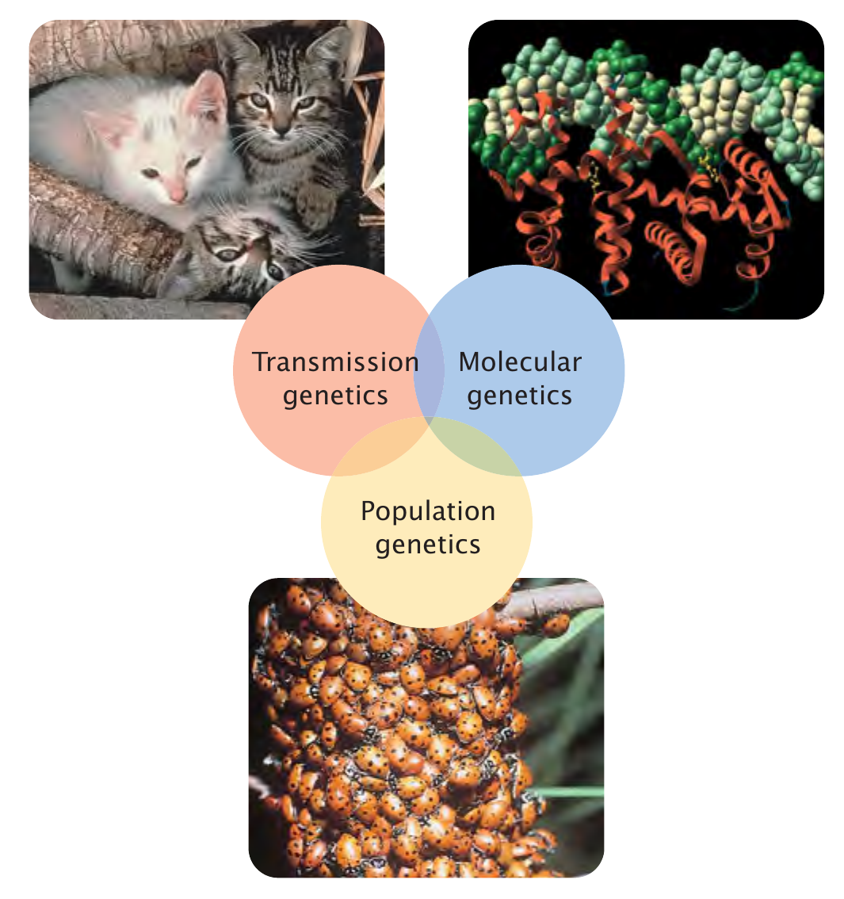

```{r,setup, include=FALSE}
library(knitr)
require(tidyverse)
set.seed(453)
# invalidate cache when the package version changes
knitr::opts_chunk$set(tidy = FALSE, echo = FALSE, 
                  message = FALSE, warning = FALSE,
                  out.width = "45%", cache = TRUE)
options(knitr.table.format = "latex")
options(knitr.kable.NA = "", digits = 2)
options(kableExtra.latex.load_packages = FALSE)
```

# Introduction

##

The Native American Hopi tribe of the Southwestern United States understood that if they planted a red kernel of maize in their fields, it would grow into a plant that also gave red kernels. The same was true for blue, white, or yellow kernels.

So they thought of the kernel as a message to the gods in the Earth about the type of maize the Hopi farmers hoped to harvest. Upon receiving this message, the gods would faithfully return them a plant that produced kernels of the desired color.

## Background

<!-- Nazi eugenics refers to the social policies of eugenics in Nazi Germany, composed of various pseudoscientific ideas about genetics. The racial ideology of Nazism placed the biological improvement of the German people by selective breeding of "Nordic" or "Aryan" traits at its center. These policies were used to justify the involuntary sterilization and mass-murder of those deemed "undesirable". -->

<!-- Those targeted for murder under Nazi eugenics policies were largely people living in private and state-operated institutions, identified as "life unworthy of life" (Lebensunwertes Leben). They included prisoners, degenerates, dissidents, and people with congenital cognitive and physical disabilities (Erbkranken) – people who were considered to be feeble-minded. -->

<!-- The Hadamar Clinic was a mental hospital in the German town of Hadamar used by the Nazi-controlled German government as the site of Action T4. The Kaiser Wilhelm Institute of Anthropology, Human Heredity, and Eugenics was founded in 1927. Hartheim Killing Facility was also part of the euthanasia programme where the Nazis murdered individuals they deemed disabled. At first, patients were transported in gas vans, where passengers were poisoned or asphyxiated using the engine exhaust during transit. Gas chambers were developed later and used pure carbon monoxide gas to murder the patients. -->

\bcolumns
\column{0.55\textwidth}

::: incremental

- A scientific discipline
- The major drive of the green revolution
- Issues of government regimes -- politics of masses during Hitler's Germany.
- Can traditional agriculture satisfy human needs in distant future ?

:::

\column{0.45\textwidth}

<!-- ```{r green-revolution-borlaug, fig.cap="Norman Borlaug, a leader in the development of new strains of wheat that led to the Green Revolution. Borlaug was awarded the Nobel Peace Prize in 1970.", out.width="38%"} -->
<!-- # pdftools::pdf_convert("~/Desktop/BSc_Ag_lectures/literatures/textbooks/General/Pierce Genetics Essentials Concepts Connections 1st txtbk.PDF", pages = 25, dpi = 300, filenames = "../images/green_revolution_borlaug.png", format = "png") -->

<!--  -->
<!-- ``` -->

```{r green-revolution-crop, fig.cap="Modern, high-yielding rice plant (left) and traditional rice plant (right)", out.width="80%"}
# pdftools::pdf_convert("~/Desktop/BSc_Ag_lectures/literatures/textbooks/General/Pierce Genetics Essentials Concepts Connections 1st txtbk.PDF", pages = 25, dpi = 300, filenames = "../images/green_revolution_crop.png", format = "png")


```

\ecolumns

## Other importance

\bcolumns
\column{0.4\textwidth}

::: incremental

- Vaccines
- Genetic engineering
- Detection and diagnosis
- Industrial biotechnology
- Conservation

```{r pigs-can-fly, fig.align='center', out.width="68%"}
# pigs might fly afterall
# but they still can't look up, can they!
knitr::include_graphics("../images/genetic_engineering_meme.jpg")

# Scientists and doctors have dreamed of creating a steady supply of human organs for transplantation by growing them in pig. But concerns about rejection by the human immune system and infection by viruses embedded in the pig genome have stymied research.

# Geneticist George Church of Harvard Medical School in Boston, Massachusetts, announced that he and colleagues had used the CRISPR/Cas9 gene-editing technology to inactivate 62 porcine endogenous retroviruses (PERVs) in pig embryos. These viruses are embeded in all pigs' genomes and cannot be treated or neutralized (in grown animals). It is feared that they could cause disease in human transplant recipients.
# Source: doi:10.1038/nature.2015.18525

```

:::

\column{0.6\textwidth}

```{r covid-vaccine-dna, fig.align='center', out.width="65%"}
# The study tested whether the vaccine’s mRNA could be converted to DNA, and found that this was the case in certain lab-altered liver cell lines under experimental conditions. It did not assess whether the vaccine alters the human genome, or what the effects of that would be, according to experts and the study authors.

```

```{r dolly, fig.align='center', out.width="48%", fig.cap="The cloning of a mammal."}
# The lamb in the front is Dolly, the first mammal to be cloned. She was cloned from the cells of a Finn Dorset (a white-faced sheep). The sheep in the back is Dolly's surrogate mother, a Blackface ewe.

```

\ecolumns

## Genetically engineered food

\bcolumns
\column{0.5\textwidth}

```{r antioxidant-enriched-tomato, out.width="70%", fig.align='center'}

```

\column{0.5\textwidth}

```{r golden-rice, out.width="70%", fig.align='center'}

```

\ecolumns


##

\bcolumns
  
\column{0.5\textwidth}

**Aesthetics, conservation and appreciation**

```{r genetics-applications-2, out.width="65%", fig.align='center'}


```


```{r genetics-applications-1, out.width="56%", fig.align='center'}

```

\column{0.5\textwidth}

```{r reconnect-with-nature, out.width="75%", fig.align='center'}
knitr::include_graphics("../../literatures/reconnect_with_nature.pdf")
```

\ecolumns

## Definition

\bcolumns
\column{0.55\textwidth}

::: incremental

**Study of heredity**

- Why cats always have kittens and humans always have babies ?
- Why do children resemble their parents ?
- Why two people are never same ?

:::

::: incremental

**Etymology**

- "gene"
- Genes have unique nature to perform their biological roles -- replication, information bearing/generation of form and mutation

:::

\column{0.45\textwidth}

```{r like-begets-like, fig.align='center', out.width="75%"}

```

\ecolumns

## Terminologies

\begin{columns}[T,onlytextwidth]
  
  \column{0.3\textwidth}

\begin{itemize}
\item Selection
\item DNA
\item RNA
\item PCR
\item Viruses (Coronaviruses, H1N1)
\item BLAST
\item TATA
\item Hox1, Pht1
\item ELISA
\item FISH
\item CRISPR
\end{itemize}

  \column{0.7\textwidth}

```{r terminologies-1, fig.cap="Terminologies and implications. Selection", out.width="80%"}


```

\end{columns}

##

```{r terminologies-2, fig.align='center', out.width="30%"}


```

##

```{r understanding-all, out.width="55%", fig.align='center'}


# not everything needs to be understood right off the bat. things will come slowly.
```


## Branches

```{r genetics-subdivision, fig.cap="Subdivision of genetics into three interrelated fields", out.width="45%"}
# pdftools::pdf_convert("~/Desktop/BSc_Ag_lectures/literatures/textbooks/General/Pierce Genetics Essentials Concepts Connections 1st txtbk.PDF", pages = 27, dpi = 300, filenames = "../images/genetics_subdivision.png", format = "png")


```

# Past and present

## Gregor Mendel

- Blending theory of inheritance
- Mendelian theory of inheritance

<!-- Red and white paints, when mixed, give pink; and so a child of one tall parent and one short parent could be expected to grow to a middling height. While blending theory seemed to work at times, it was also clear that there were exceptions, such as tall children born to parents of average height. -->

<!-- Blending theory also provided no mechanism by which the "heredity fluids" it imagined, once mixed, could be separated—the red and white paints cannot be reconstituted from the pink. -->

## Mendel's Experiment

\begin{columns}[T,onlytextwidth]
  
  \column{0.5\textwidth}

```{r mendels-experiment, fig.cap="The mating scheme for Mendel’s experiment involving the crossing of purple- and white- flowered varieties of pea plants. The purple and white circles signify the gene variants for purple vs. white flower color. Gametes carry one gene copy; the plants each carry two gene copies. The $\times$ signifies a cross-pollination between the purple -- and white-flowered plants.", out.width="35%"}
# pdftools::pdf_convert("~/Desktop/BSc_Ag_lectures/literatures/textbooks/Introduction to Genetic Analysis/Griffiths - An Introduction to Genetic Analysis 11th Edition c2015.pdf",
#                       pages = 29, dpi = 300,
#                       filenames = "../images/mendels_experiment.png",
#                       format = "png")

```
  
  \column{0.5\textwidth}

```{r mendels-pea, fig.cap="\\textbf{The seven phenotypic pairs studied by Mendel; For each character Mendel studied two contrasting phenotypes} \\newline ", out.width="50%"}
# pdftools::pdf_convert("~/Desktop/BSc_Ag_lectures/literatures/textbooks/Introduction to Genetic Analysis/Griffiths - An Introduction to Genetic Analysis 11th Edition c2015.pdf",
#                       pages = 61, dpi = 300,
#                       filenames = "../images/mendels_pea.png",
#                       format = "png")


```

\end{columns}

## The crossing

```{r crossing-pea, fig.cap="Cross-pollination and selfing are two types of crosses", out.width="80%"}
# pdftools::pdf_convert("~/Desktop/BSc_Ag_lectures/literatures/textbooks/Introduction to Genetic Analysis/Griffiths - An Introduction to Genetic Analysis 11th Edition c2015.pdf",
#                       pages = 62, dpi = 300,
#                       filenames = "../images/crossing_selfing.png",
#                       format = "png")


```

## Model organisms

\begin{columns}[T,onlytextwidth]
  
  \column{0.33\textwidth}
  
```{r model-organisms-drosophila, fig.cap="\\textit{Drosophila melanogaster}", out.width="80%"}
# pdftools::pdf_convert("~/Desktop/BSc_Ag_lectures/literatures/textbooks/General/Pierce Genetics Essentials Concepts Connections 1st txtbk.PDF", pages = 28, dpi = 300, filenames = "../images/model_organisms.png", format = "png")


```

  \column{0.33\textwidth}

```{r model-organisms-ecoli, fig.cap="\\textit{Escherichia coli}", out.width="80%"}
# pdftools::pdf_convert("~/Desktop/BSc_Ag_lectures/literatures/textbooks/General/Pierce Genetics Essentials Concepts Connections 1st txtbk.PDF", pages = 28, dpi = 300, filenames = "../images/model_organisms.png", format = "png")


```

  \column{0.33\textwidth}

```{r model-organisms-caenorhabditis, fig.cap="\\textit{Caenorhabditis elegans}", out.width="80%"}
# pdftools::pdf_convert("~/Desktop/BSc_Ag_lectures/literatures/textbooks/General/Pierce Genetics Essentials Concepts Connections 1st txtbk.PDF", pages = 28, dpi = 300, filenames = "../images/model_organisms.png", format = "png")

knitr::include_graphics("../images/model_organisms_elegans.png")
```

\end{columns}

##

\begin{columns}[T,onlytextwidth]
  
  \column{0.33\textwidth}

```{r model-organisms-arabidopsis, fig.cap="\\textit{Arabidopsis thaliana}", out.width="80%"}
# pdftools::pdf_convert("~/Desktop/BSc_Ag_lectures/literatures/textbooks/General/Pierce Genetics Essentials Concepts Connections 1st txtbk.PDF", pages = 29, dpi = 300, filenames = "../images/model_organisms.png", format = "png")


```

  \column{0.33\textwidth}

```{r model-organisms-cerevisiae, fig.cap="\\textit{Saccharomyces cerevisiae}", out.width="80%"}
# pdftools::pdf_convert("~/Desktop/BSc_Ag_lectures/literatures/textbooks/General/Pierce Genetics Essentials Concepts Connections 1st txtbk.PDF", pages = 29, dpi = 300, filenames = "../images/model_organisms.png", format = "png")


```

  \column{0.33\textwidth}

```{r model-organisms-mus, fig.cap="\\textit{Mus musculus}", out.width="80%"}
# pdftools::pdf_convert("~/Desktop/BSc_Ag_lectures/literatures/textbooks/General/Pierce Genetics Essentials Concepts Connections 1st txtbk.PDF", pages = 29, dpi = 300, filenames = "../images/model_organisms.png", format = "png")

knitr::include_graphics("../images/model_organisms_mus.png")
```

\end{columns}

<!-- Each species was chosen to allow study of some aspect of embryonic development. The nematode _Caenorhabditis elegans_ was chosen as a model system to study the development and function of the nervous system because its nervous system contains only a few hundred cells and the developmental fate of these and all other cells in the body has been mapped out. Arabidopsis thaliana, a small plant with a short life cycle, has become a model organism for the study of many aspects of plant biology. The zebrafish, _Danio rerio_, is used to study vertebrate development: it is small, it reproduces rapidly, and its egg, embryo, and larvae are all transparent. -->

## Fundamental concepts of genetics

<!-- Where in the cell are Mendel’s genes? -->
<!-- The answer came in 1910, when Thomas H. Morgan at Columbia University in New York demonstrated that Mendel's genes are located on chromosomes—he proved the chromosome theory of inheritance. The idea was not new. Walter Sutton, who was raised on a farm in Kansas and later served as a surgeon for the U.S. army during WWI had proposed the chromosome theory of inheritance in 1903. Theodor Boveri, a German biologist, independently proposed it at the same time. It was a compelling hypothesis, but there were no experimental data to support it. This changed in 1910, when Morgan proved the chromosome theory of inheritance using Mendelian genetics and the fruit fly as his experimental organism. -->

::: incremental

- Cells are of two basic types: \alert{Eukaryotic} and \alert{prokaryotic}
- The gene is the fundamental unit of heredity
- Genes come in multiple forms called alleles
- Genes confer phenotypes
- Genetic information is carried in DNA and RNA
- Genes are located on chromosomes
- Chromosomes separate through the process of mitosis and meiosis
- Genetic information is transferred from DNA to RNA to protein
- Mutations are permanent, heritable changes in genetic information
- Some traits are affected by multiple factors
- Evolution is genetic change

:::

# Bibliography
