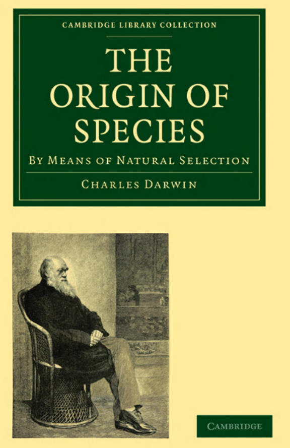
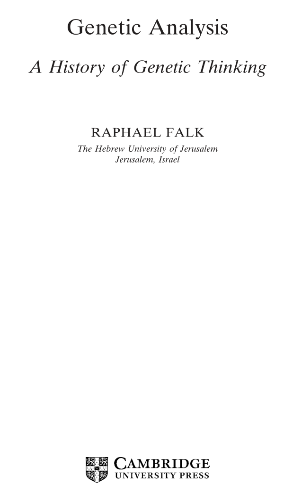

```{r,setup, include=FALSE}
library(knitr)
require(tidyverse)
set.seed(453)
# invalidate cache when the package version changes
knitr::opts_chunk$set(tidy = FALSE, echo = FALSE, 
                  message = FALSE, warning = FALSE,
                  out.width = "45%", cache = TRUE)
options(knitr.table.format = "latex")
options(knitr.kable.NA = "", digits = 2)
options(kableExtra.latex.load_packages = FALSE)
```

# Spontaneous generation and fixity of species

##

- Initial belief was that there is no need of transfer of biological material between generations (for at least mid $18^{th}$ century).
- Leeuwenhoek (1632-1723) observed spontaneous appearance of flies from refuse (small infusoria "arising" from apparently clear infusions of hay)
- Redi's and Spallanzani's (1621-1697 and 1729-1799) experiment questioned this doctrine of "spontaneous generation". They showed fly larvae would not develop if adult flies are excluded from laying eggs on meat. 
- They sealed boiled the flasks and inferred on the non-appearance of tiny "animalcules" observed by Leeuwenhoek. However, they did left the possibility, citing their experiment of "tainted" (heated, in their sense of words) air, that whether unheated air could generate new organisms.

##

- Seventeenth and eighteenth centuries marked the beginnings of systematics. Linnaeus (1707-1778) mostly contributed to the knowledge.
- According to him, there was a "fixity of species".
- Two doctrines -- spontaneous generation and fixity of species -- were difficult to reconcile with each other.
- Both theories were put to rest by Pasteur (1822-1895) and by Tyndall (1820-1893) who showed that putrefaction of organic matter only occured under conditions that permitted solid particles to enter a nutrient culture. (These solid particles were identified to be microbes, later.)
- Consesus was that "every living thing from a living thing" ( _Omne vivum e vivo_).

# Preformationism and epigenesis

##

\bcolumns
\column{0.75\textwidth}

- Originally aristotle had proposed that an organism formed through sexual reproduction receives the "substance" of the female egg and a contribution of "form" by the male seminal fluid.
- The idea (widely advocated by biologists during 17th and 18th century) that one of the sex cells, or gametes, either sperm or egg, contained within itself the entire organism in perfect miniature form ( _preform_ - ationism).
- Wolff advanced the idea that organisms develop from uniform embryonic tissues, idea of _epigenetics_, and later his successor von Baer (1792-1876) proposed the view that gradual transformation of increasingly specialized tissue make up an organism during development, and not the _de novo_ appearance of organs.

\column{0.25\textwidth}

```{r preformationism, fig.cap="Preformed human infant in sperm as imagined by seventeenth-century Dutch histologist Niklass Hartsoeker, one of the first to observe sperm with a microscope of his own construction. An early and persistent idea was that there exists a miniature form of the adult in the egg or sperm.", out.width="90%"}

```

\ecolumns

# Pangenesis and the history of acquired characters

##

- Charles Darwin (1809-1882) believed that very small, exact, but invisible copies of each body organ and component (gemmules) were transported by the bloodstream to the sex organs and there assembled into the gametes.
- This doctrine of "pangenesis" provided attraction for believers of evolution.
- According to this theory, the excess use or disuse of organ would alter its gemmules and consequently lead to a changed inheritance in the decendents -- inhertance of acquired characters take place.
- Most popular proponent was Lamarck (1744-1829).
- Work during later part of 19th century and beginning of 20th set the stage for characterization of source of heredity.

##

<!-- The publication in 1665 of Robert Hooke's Micrographia had a huge impact, largely because of its impressive illustrations. A significant contribution came from Antonie van Leeuwenhoek who achieved up to 300 times magnification using a simple single lens microscope. He sandwiched a very small glass ball lens between the holes in two metal plates riveted together, and with an adjustable-by-screws needle attached to mount the specimen.Then, Van Leeuwenhoek re-discovered red blood cells (after Jan Swammerdam) and spermatozoa, and helped popularise the use of microscopes to view biological ultrastructure. On 9 October 1676, van Leeuwenhoek reported the discovery of micro-organisms. -->

\bcolumns

\column{0.5\textwidth}

```{r the-origin-of-species, fig.align='center', out.width="72%", fig.cap="Darwin's publication on the evolution of living organisms."}

```

\column{0.5\textwidth}

```{r use-of-microscope-hooke, fig.cap="Thanks to the discovery of microscope, first cell was observed and named as such in 1665.", out.width="54%"}

```

```{r cell-theory, fig.cap="Biologists Schleiden and Schwann first proposed classic cell theory in 1839, and Virchow added to it in 1858.", out.width="54%"}

```

\ecolumns

# Towards the end of 19th century and further

##

<!-- - Developments in cytology in the 1800s had a strong influence on genetics. Building on the work of others, Matthias Jacob Schleiden (1804–1881) and Theodor Schwann (1810–1882) proposed the concept of the cell theory in 1839. Biologists began to examine cells to see how traits were transmitted in the course of cell division. -->
<!-- - Charles Darwin (1809–1882), one of the most influential biologists of the nineteenth century, put forth the theory of evolution through natural selection and published his ideas in On the Origin of Species in 1859. -->
<!-- - Walther Flemming (1843–1905) observed the division of chromosomes in 1879 and published a superb description of mitosis. By 1885, it was generally recognized that the nucleus contained the hereditary information. -->
<!-- - Near the close of the nineteenth century, August Weismann (1834–1914) finally laid to rest the notion of the inheritance of acquired characteristics. He cut off the tails of mice for 22 consecutive generations and showed that the tail length in descendants remained stubbornly long. -->
<!-- - Weismann proposed the germplasm theory, which holds that the cells in the reproductive organs carry a complete set of genetic information that is passed to the egg and sperm. -->

```{r genetics-history}
history <- readxl::read_xlsx("../data/history_genetics.xlsx", skip = 1)

history[1:15, ] %>% 
  knitr::kable(caption = "History of modern genetics", booktabs = TRUE) %>% 
  kableExtra::kable_styling(font_size = 7, position = "center", latex_options = "striped") %>% 
  kableExtra::column_spec(1:2, width = c("5em", "50em"))
```

##

```{r genetics-history2}
history[16:32, ] %>% 
  knitr::kable(caption = "History of modern genetics (...continued)", booktabs = TRUE) %>% 
  kableExtra::kable_styling(font_size = 7, position = "center", latex_options = "striped") %>% 
  kableExtra::column_spec(1:2, width = c("5em", "50em"))
```

# Story

##

```{r genetics-history-sturtevant, fig.align='center', out.width="40%"}

# the text is contained under "plbgen" directory
```

##

\bcolumns

\column{0.5\textwidth}

```{r genetics-analysis-history-falk, fig.align='center', out.width="66%"}

# the text is contained under "plbgen" directory
```

\column{0.5\textwidth}

```{r primer-natural-histories, fig.align='center', out.width="68%"}

```

\ecolumns
