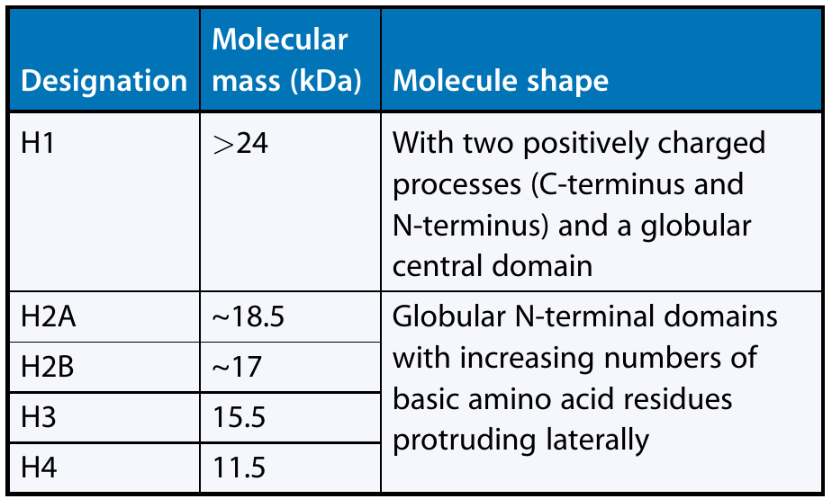

```{r,setup, include=FALSE}
library(knitr)
require(tidyverse)
set.seed(453)
# invalidate cache when the package version changes
knitr::opts_chunk$set(tidy = FALSE, echo = FALSE, 
                  message = FALSE, warning = FALSE,
                  out.width = "45%", cache = TRUE)
options(knitr.table.format = "latex")
options(knitr.kable.NA = "", digits = 2)
options(kableExtra.latex.load_packages = FALSE)
```


# Cell cycle

## Background

\small

- Living beings produce more of their kind (procreate).
- Rudolf Virchow, a German physician, put it this way in 1855, translating which in his latin axiom "Omnis cellula e cellula," meaning "Every cell from a cell."
- Cell division enables unicellular organisms to reproduce and produce entire organism.
- Cell division involves distribution of identical genetic material, not merely the splitting of components.
- Cell division copies DNA with high fidelity.

```{r agent-smith, fig.align='center', out.width="38%"}

```


##

```{r cell-structure-plant, fig.cap="The plant cell under the light microscope (LM). (a) A photosynthetic parenchyma cell of a deciduous leaf. (b) Chloroplasts in the cells of a leaf (Katharina ondulata, x300). (c) Cells in a suspension culture (tobacco; BY2) (x350): the large cells are almost filled with the central vacuole; the cell nuclei and nucleoli are in the parietal cytoplasm tube that thickens at the cell corners; numerous other cytoplasm tubes running through the cell can also be seen. (d) Nuclear region of an Allium cell, phase contrast (x3,100); chromatin and a nucleolus are in the nucleus, leucoplasts (two with pale starch-like inclusions), sausage-shaped mitochondria, and spherical oleosomes are in the cytoplasm"}
# pdftools::pdf_convert("../../literatures/Plant Science Straussberger.pdf", pages = 53, 
#                       dpi = 300, format = "png", 
#                       filenames = "../images/cell_structure_plant.png")


```


## Organization of genetic material

\bcolumns
\column{0.6\textwidth}

- A cell's complete bulk of genetic information, DNA, is called its **genome**.
- Although a prokaryotic genome is often a single DNA molecule, eukaryotic genomes usually consist of a number of DNA molecules packaged into **chromosomes** ( _chroma_ and _soma_).
- Length of DNA = ~ 250, 000 times diameter of the cell that bears it.
- When cell can divide to form genetically identical daughter cells, all of this DNA must be copied, or replicated, and then two copies must be separated so that each daughter cells ends up with a complete genome.
- The entire complex of DNA and proteins that is the building material of chromosomes is referred to as **chromatin**.

\column{0.4\textwidth}

```{r powerhouse-of-cell, out.width="80%", fig.align='center'}

```

\ecolumns

# Structure of Chromosome

##

```{r chromosome-structure, fig.cap="Chromosomes occur as compact entities during nuclear division (e.g., in metaphase and anaphase of mitosis). This entity is what was originally named 'chromosome.' (a) A satellite chromosome with the two telomeres, the centromere with the two kinetochores (insertion points of the microtubules on the spindle apparatus), heterochromatic bands (additional regions on the telomeres and in the region of the centromere), and the characteristic (for satellite chromosomes) nucleolar organizing region (NOR) and a heterochromatic satellite. The chromosome is split longitudinally into two chromatids that later become daughter chromosomes. (b) Anaphase chromosomes of barley (Hordeum vulgare) with a diploid chromosome number 2n = 28, two satellite chromosomes per complement. The four NORs and four satellites of the two complements of daughter chromosomes can be seen clearly (x1,880). (c) Chromosome complement of \\textit{Anemone blanda} (2n = 16); heterochromatic bands (except at the centromere) picked out with color (x600)", out.width="25%"}
# pdftools::pdf_convert("../../literatures/Plant Science Straussberger.pdf", 
#                       pages = 76,
#                       dpi = 300, format = "png",
#                       filenames = "../images/chromosome_structure.png")


```


<!-- When genomic DNA is spun for a long time in cesium chloride density gradient in an ultracentrifuge, the DNA settles into one prominent visible band. However, satellite bands are often visible, distinct from the main DNA band. Such satellite DNA consists of multiple tandem repeats of short nucleotide sequences, stretching to as much as hundreds of kilobases in length. Probes may be prepared from such simple-sequence DNA and allowed to bind to partially denatured chromosomes. The great bulk of the satellite DNA is found to reside in the heterochromatic regions flanking the centromeres. There can be either one or several basic repeating units, but usually they are less than 10 bases long. For example, in _Drosophila melanogaster_, the sequence AATAACATAG is found in tandem arrays around all centromeres. Similarly, in the guinea pig, the shorter sequence CCCTAA is arrayed flanking the centromeres. -->

<!-- Because the centromeric repeats are a nonrepresentative sample of the genomic DNA, the G+C content can be significantly different from the rest of the DNA. For this reason, the DNA forms a separate satellite band in an ultracentrifuge density gradient. -->

<!-- Nucleoli are organelles within the nucleus that contain ribosomal RNA, an important component of ribosomes. Different organisms are differently endowed with nucleoli, which range in number from one to many per chromosome set. The diploid cells of many species have two nucleoli. The nucleoli reside next to slight constrictions of the chromosomes, called nucleolar organizers (NO) which have highly specific positions in the chromosome set. Nucleolar organizers contain the genes that code for ribosomal RNA. The NO does not stain with normal chromatin stains. The NOs on the Drosophila X and Y chromosomes contain 250 and 150 tandem copies of rRNA genes, respectively. One human NO has about 250 copies. Such redundancy is one way of ensuring a large amount of rRNA per cell. -->

##

- The chromosome complement in a cell nucleus in the members of a species is called their karyotype (records all the cytologically identifiable chromosome features (size, form, number)).
- The karyotype is an important genetic, systematic, and phylogenetic characteristic.
- The number of identical chromosome sets in a cell nucleus determines the level of ploidy, _n_. 
- Cell nuclei with only one set of chromosomes are haploid ( _1n_; Greek _haplos_, simple) somatic (tissue) cells are predominantly diploid ( _2n_) in ferns and seed plants. 
- Gametic chromosome number = 1/2 x Somatic chromosome number
- Nuclei of extraordinary size are mostly polyploid; they contain several to many copies of the gene and chromosome complement of the species in question. 
- Two compies of a chromosome are ordinarily identical in morphology, gene content and gene order; they are called **homologous chromosomes**.
- Even artificially generated polyploid cell nuclei result in enlarged cells.

##

- The **C value** refers to the total amount of DNA in the haploid genome, given in picograms. The C value of the bacterium Escherichia coli is 0.004, that of tobacco is 1.6, that of maize is 7.5, and that of some lily species can be over 30.
- The following chromosome features are particularly important: (Figure \ref{fig:chromosome-structure}) length, position of the centromere, presence or absence of a nucleolar organizing region (NOR), and heterochromatic sections.
- Each metaphase chromosome appears to be longitudinally divided into two identical parts each of which is known as **chromatid**, a single is reffered to as sister chromatid.
- The centromere (primary constriction; Greek kentron, middle point and meros, part) is the narrowest point on the chromosome, where the chromosome bends during chromosome movements in cell division and where the microtubules of the nuclear spindle attach.

##

- These microtubules end in a platelike or hemispherical multilayered structure that is located on the side of the centromere and is called kinetochore. 
- The part of a chromatid on either side of the centromere is referred to as an arm of the chromatid. (An uncondensed, unduplicated chromosome has a single centromere and two arms.)
- Two arms of chromosome can range for values of lengths. The **centromere index** quantifies the length ratio of the arms (short arm length divided by the total chromosome length).
- Based on the relative position of centromere on chromosomes, they can be:
  - Metacentric
  - Submetacentric
  - Acrocentric
  - Telocentric

##

- Centromeric region of chromosome contains satellite DNA.
- Telomeric region of chromosome is highly stable and has DNA loops.
- The chromosome region lying between secondary constriction and the nearest telomere is known as satellite. Therefore chromosomes having secondary constrictions are called satellite chromosomes.
- Nucleolus is always associated with the secondary constrictions of sat-chromosomes, thus these constrictions are sometimes also called NOR.
- In some species e.g., maize, amphibia etc, chromosomes during first prophase of meiosis (pachytene), show small bead-like structures called chroommeres.
- Homologous chromosomes always show identical pattern of chromomere distribution.

## Chromosome numbers

```{r genetics-history2, eval = TRUE}
chr_no <- read_csv("./../data/chromosome_numbers.csv")
chr_no <- chr_no %>%
  mutate(Species = paste0("\\textit{", Species, "}")) %>%
  group_split(Organism)
```

\begin{columns}[T,onlytextwidth]
  
  \column{0.5\textwidth}

  \scalebox{0.80}{\begin{minipage}{1.0\textwidth}

```{r chromosome-number11}
chr_no[[1]][1:10,] %>%
  select(-1) %>% 
  knitr::kable(caption = "Chromosome numbers found different species of organisms (animals)",
               booktabs = TRUE, escape = FALSE) %>%
  kableExtra::kable_styling(font_size = 8, position = "center", latex_options = "striped") #%>%
  # kableExtra::column_spec(1:2, width = c("5em", "50em")) %>%
  # kableExtra::collapse_rows(columns = 1, valign = "top")
```

\end{minipage}}

  \column{0.5\textwidth}

\scalebox{0.70}{\begin{minipage}{1.0\textwidth}

```{r chromosome-number12}
chr_no[[1]][11:nrow(chr_no[[1]]),] %>%
  select(-1) %>% 
  knitr::kable(caption = "Chromosome numbers found different species of organisms (animals) ... continued",
               booktabs = TRUE, escape = FALSE) %>%
  kableExtra::kable_styling(font_size = 8, position = "center", latex_options = "striped") #%>%
  # kableExtra::column_spec(1:2, width = c("5em", "50em")) %>%
  # kableExtra::collapse_rows(columns = 1, valign = "top")
```

\end{minipage}}

\end{columns}

##

```{r chromosome-number2}
chr_no[[2]] %>%
  select(-1) %>% 
  knitr::kable(caption = "Chromosome numbers (haploid number) found different species of organisms (micro-organisms) ... continued",
               booktabs = TRUE, escape = FALSE) %>%
  kableExtra::kable_styling(font_size = 6, position = "center", latex_options = "striped") #%>%
  # kableExtra::column_spec(1:2, width = c("5em", "50em")) %>%
  # kableExtra::collapse_rows(columns = 1, valign = "top")
```

##

```{r chromosome-number3}
chr_no[[3]] %>%
  select(-1) %>% 
  knitr::kable(caption = "Chromosome numbers found different species of organisms (plants) ...continued",
               booktabs = TRUE, escape = FALSE) %>%
  kableExtra::kable_styling(font_size = 6, position = "center",
                            latex_options = "striped") #%>%
  # kableExtra::column_spec(1:2, width = c("5em", "50em")) %>%
  # kableExtra::collapse_rows(columns = 1, valign = "top")
```

## Structure of chromatin

```{r structure-of-chromatin, out.width="45%", fig.align='center', fig.cap="(a) The nucleosome in decondensed and condensed chromatin. (b) End view of the coiled chain of nucleosomes. (c) Chromatin structure varies along the length of a chromosome. The least-condensed chromatin (euchromatin) is shown in yellow, regions of intermediate condensation are in orange and blue, and heterochromatin coated with special proteins (purple) is in red."}
# pdftools::pdf_convert("../../literatures/textbooks/Introduction to Genetic Analysis/Anthony_J.F._Griffiths,_Susan_R._Wessler,_Sean_B.pdf",
#                       pages = 453,
#                       dpi = 300, format = "png",
#                       filenames = "../images/structure_of_chromatin.png")

knitr::include_graphics("../images/structure_of_chromatin.png")
```

## Histones and nucleosomes

\begin{columns}[T,onlytextwidth]
  
  \column{0.5\textwidth}
  
```{r histone-types, fig.cap="Overview of five basic types of histone", out.width="65%"}
# pdftools::pdf_convert("../../literatures/Plant Science Straussberger.pdf", 
#                       pages = 73,
#                       dpi = 300, format = "png",
#                       filenames = "../images/histone_types.png")


```

  \column{0.5\textwidth}

```{r nucleosome-structure, fig.cap="\\textbf{Nucleosomes}. (a) Beaded pattern: three histone octamers (dotted) surrounded by left-handed DNA double helices bonded by DNA linkers; horizontal stripes attack sites of Micrococcus nuclease. (b) Supranucleosomal structures, mediated by H1 (black); on the right nucleofilaments, on the left chromatin fibrils (H1 not is illustrated here)", out.width="80%"}
# pdftools::pdf_convert("../../literatures/Plant Science Straussberger.pdf", pages = 73,
#                       dpi = 300, format = "png",
#                       filenames = "../images/nucleosome_structure.png")

knitr::include_graphics("../images/nucleosome_structure.png")
```

\end{columns}

## Distribution of chromosomes during eukaryotic cell division

- When a cell is not dividing, and even as it replicates its DNA in preparation for cell division, each chromosome is in the form of a long, thin chromatin fiber. 
- After DNA replication, however, the chromosomes condense as a part of cell division: Each chromatin fiber becomes densely coiled and folded, making the chromosomes much shorter and so thick that we can see them with a light microscope. 
- Each duplicated chromosome has two sister chromatids, which are joined copies of the original chromosome (Figure \ref{fig:duplicated-chromosome}). 
- The two chromatids, each containing an identical DNA molecule, are initially attached all along their lengths by protein complexes called cohesins.

##

- Each sister chromatid has a centromere, a region containing specific DNA sequences where the chromatid is attached most closely to its sister chromatid. This attachment is mediated by protein bound to the centromeric DNA sequences and gives the condensed, duplicated chromosome a narrow "waist".
- Later in the cell division process, the two sister chromatids of each duplicated chromosomes separate and move into two new nuclei, one forming at each end of the cell. Once they separate they are considered individual chromosomes.

##

\begin{columns}[T,onlytextwidth]
  
  \column{0.5\textwidth}

```{r duplicated-chromosome, fig.align='center', out.width="80%", fig.cap="Duplicated chromosome during cell division showing two sister chromatids"}
# pdftools::pdf_convert("/media/deependra/e4da4ac5-3b38-4b89-9402-397eb940e4d3/Addition/Generalized Study/Reece Campbell Biology 9th txtbk.pdf",
#                       pages = 277,
#                       dpi = 300, format = "png",
#                       filenames = "../images/duplicated_chromosomes_hd.png")

knitr::include_graphics("../images/duplicated_chromosomes_hd.png")
```

  \column{0.5\textwidth}

```{r overview-cell-division, fig.cap="Overview of cell division in eukaryotic cell", out.width="95%"}
# pdftools::pdf_convert("/media/deependra/e4da4ac5-3b38-4b89-9402-397eb940e4d3/Addition/Generalized Study/Reece Campbell Biology 9th txtbk.pdf",
#                       pages = 278,
#                       dpi = 300, format = "png",
#                       filenames = "../images/cell_division_eukaryotes_overview.png")


```

\end{columns}

## Heterochromatin and euchromatin

- Based on stainability of chromatin chromosomes can be Heterochromatin and Euchromatin.
- Euchromatin takes up little stain during interphase, stains only lightly during prophase, but is deeply stained during metaphase.
- Heterochromatin takes up deep stain during interphase and prophase, while during metaphase it is stained lightly.
- In general heterochromatin is found in the centromeric and telomeric regions.
- Almost all of the genes in a chromosomes are found in euchromatin region.

<!-- ## DNA replication is bidirectional -->

<!-- ```{r bidirectional-replication, out.width="60%", fig.cap="DNA replication proceeds in both directions from an origin of replication. Black arrows indicate the direction of growth of daughter DNA molecules. (a) Starting at the origin, DNA polymerases move outward in both directions. Long yellow arrows represent leading strands and short joined yellow arrows represent lagging strands. (b) How replication proceeds at the chromosome level. Three origins of replication are shown in this example."} -->
<!-- # pdftools::pdf_convert("../../literatures/textbooks/Introduction to Genetic Analysis/Anthony_J.F._Griffiths,_Susan_R._Wessler,_Sean_B.pdf", -->
<!-- #                       pages = 299, -->
<!-- #                       dpi = 300, format = "png", -->
<!-- #                       filenames = "../images/bidirectional_dna_replication.png") -->

<!--  -->
<!-- ``` -->

<!-- ## Chromatin -->

<!-- \small -->

<!-- Most of the nuclear DNA is complexed with histones. Histones are commonly found throughout the eukaryotes. An exception is the dinoflagellates whose chromatin is organized differently. These unicellular organisms are typical eukaryotes in every other aspect. The mass ratio of histone to DNA is about 1:1. Histones only occur together with DNA in living cells. They are synthesized synchronously with the DNA in the replication phase of the cell cycle (S phase) in the cytoplasm and are immediately transferred to the cell nucleus. The strongly acidic DNA acts as a polyanion and attracts the histone molecule, which is basic as a result of its many lysine and arginine residues (pI about 12) and acts as a polycation. The H1–H4 (Given in Table \ref{fig:histone-types}) series is ordered according to the decreasing proportion of lysine and the increasing proportion of arginine. The histones, especially H3 and H4, have altered little during phylogenesis.  -->

<!-- ## -->

<!-- \small -->

<!-- There are also tissue-specific variants that in part deviate somewhat from each other in terms of activation of histogenes (isotypes) and in part differ in their posttranslational, reversible modification of the histone molecule (acetylation or phosphorylation of individual amino acids). The four histones H2A–H4, which have similar molecular sizes and shapes, automatically form (even without DNA) flat-ellipsoid quaternary structures. In these particles, with diameters of up to 10 nm and thicknesses of 5 nm, two molecules of every histone type are involved -- histone octamers, made up of core histones. The edge of the histone octamer is flatly encircled by a 145-bp-long sequence of DNA, marking the location of the particularly basic N-termini of the histone molecule (Shown in Figure \ref{fig:nucleosome-structure}). The DNA double helix twists just about twice around the histone octamer before going on to the next one. The approximately 60-bp intermediate linker represents the preferred attack site for endonucleases. Thus, cleavage events attack uniform nucleohistone complexes of the same particle mass, the nucleosomes. Electron microscope observations show greatly loosened H1-free chromatin with a typical beaded pattern. -->

<!-- ## -->

<!-- \small -->

<!-- This changes when H1 is added. This molecularly heavier histone (also less conserved in evolutionary terms) is not involved in the construction of the histone octamers or nucleosomes but preferentially binds, using nonspecific sequences, to linker DNA and densely binds nucleosomes to histone octamers already occupied by DNA. This gives H1 its other name of linker histone. It causes the chromatin to condense; increasing amount of H1 makes the molecule even more compact. Initially, nucleofilaments (elementary or fundamental fibrils) form with diameters of 10 nm; further condensation results in superstructures, e.g., solenoids (helix structures with six nucleosomes per turn; from greek _solen_ tube) regular zigzag structures, or supranucleosomal granula (nucleomeres). Finally, the chromatin fibril is formed, a 35-nm-thick filamentous structure. The DNA double helix packed into the chromatin fibril would be more than 20 times as long were it to be in its uncondensed form. -->

<!-- ## -->

<!-- \small -->

<!-- Even higher grades of chromatin condensation occur, particularly during nuclear division. Various nonhistone proteins then form a filamentous chromosome skeleton from which the chromatin fibrils protrude as lateral loops in all directions. This is how chromonemes (visible even with a light microscope), with diameters of 0.2 mm, are formed. The most extreme chromatin compaction is achieved by even more twisting of the metaphase chromosomes during mitosis and more so during meiosis. -->

# Cell division

## Background

- **Mitosis** is the division of the genetic material in the nucleus, usually followed immediately by **cytokinesis**.
- Walther Flemming coined the terms *mitosis* and *chromatin*.
- Mitosis and cytokinesis produce cells that make up most of our bodies and same process continues to generate new cells to replace dead and damaged ones.
- **Meiosis** occurs in humans only in gonads (ovaries or testes) to produce eggs or sperm.
- In each division meiosis reduces the chromosome number from 46 (two sets of chromosomes) to 23 (one set), hence called the reductional division.
- Fertilization fuses gametes together and returns chromosome number to 46.

## Cell division in plants

```{r cell-division-plants, out.width="28%", fig.align='center'}
# pdftools::pdf_convert("../../literatures/textbooks/Introduction to Genetic Analysis/Anthony_J.F._Griffiths,_Susan_R._Wessler,_Sean_B.pdf",
#                       pages = 61,
#                       dpi = 300, format = "png",
#                       filenames = "../images/cell_division_plants.png")


```

## Key events in mitosis and meiosis

```{r key-events, out.width="50%", fig.align='center'}
# https://basicmedicalkey.com/wp-content/uploads/2016/05/F500505f36-01-9780323096003.jpg

```

## Phases of a cell cycle

- Mitotic (M) phase, including both mitosis and cytokinesis, is the shortest part of a cell's life cycle.
- M phase alternates with **interphase** (accounts for 90% of the cycle).
- Interphase can be divided into subphases (with time lapse for a normal human cell, about **24 hours**): 
  - the $\mathbf{G_1}$ phase ("first gap") $\longrightarrow$ 5-6 hours, 
  - the S phase ("synthesis") $\longrightarrow$ 10-12 hours, and 
  - the $\mathbf{G_2}$ phase ("second gap") $\longrightarrow$ 4-6 hours. 
- During all three subphases, a cell that will eventually divide grows by producing proteins and cytoplasmic organelles such as mitochondria and endoplasmic reticulum. 
- Chromosomes are duplicated only during the S phase.

##

- Mitotic spindle (consists of microtubules fibers and associated proteins) forms in the cytoplasm during prophase.
- Spindle formation starts at centrosomes, division of which has occured during interphase.
- An **aster**, a radial array of short microtubules extends from each centrosome.
- Each of the two sister chromatids of a duplicated chromosome has a kinetochore, a structure of proteins associated with specific sections of chromosomal DNA at each centromere.

<!-- ## DNA replication is bidirectional -->

<!-- ```{r bidirectional-replication, out.width="60%", fig.cap="DNA replication proceeds in both directions from an origin of replication. Black arrows indicate the direction of growth of daughter DNA molecules. (a) Starting at the origin, DNA polymerases move outward in both directions. Long yellow arrows represent leading strands and short joined yellow arrows represent lagging strands. (b) How replication proceeds at the chromosome level. Three origins of replication are shown in this example."} -->
<!-- # pdftools::pdf_convert("../../literatures/textbooks/Introduction to Genetic Analysis/Anthony_J.F._Griffiths,_Susan_R._Wessler,_Sean_B.pdf", -->
<!-- #                       pages = 299, -->
<!-- #                       dpi = 300, format = "png", -->
<!-- #                       filenames = "../images/bidirectional_dna_replication.png") -->

<!--  -->
<!-- ``` -->

<!-- ## Chromatin -->

<!-- \small -->

<!-- Most of the nuclear DNA is complexed with histones. Histones are commonly found throughout the eukaryotes. An exception is the dinoflagellates whose chromatin is organized differently. These unicellular organisms are typical eukaryotes in every other aspect. The mass ratio of histone to DNA is about 1:1. Histones only occur together with DNA in living cells. They are synthesized synchronously with the DNA in the replication phase of the cell cycle (S phase) in the cytoplasm and are immediately transferred to the cell nucleus. The strongly acidic DNA acts as a polyanion and attracts the histone molecule, which is basic as a result of its many lysine and arginine residues (pI about 12) and acts as a polycation. The H1–H4 (Given in Table \ref{fig:histone-types}) series is ordered according to the decreasing proportion of lysine and the increasing proportion of arginine. The histones, especially H3 and H4, have altered little during phylogenesis.  -->

<!-- ## -->

<!-- \small -->

<!-- There are also tissue-specific variants that in part deviate somewhat from each other in terms of activation of histogenes (isotypes) and in part differ in their posttranslational, reversible modification of the histone molecule (acetylation or phosphorylation of individual amino acids). The four histones H2A–H4, which have similar molecular sizes and shapes, automatically form (even without DNA) flat-ellipsoid quaternary structures. In these particles, with diameters of up to 10 nm and thicknesses of 5 nm, two molecules of every histone type are involved -- histone octamers, made up of core histones. The edge of the histone octamer is flatly encircled by a 145-bp-long sequence of DNA, marking the location of the particularly basic N-termini of the histone molecule (Shown in Figure \ref{fig:nucleosome-structure}). The DNA double helix twists just about twice around the histone octamer before going on to the next one. The approximately 60-bp intermediate linker represents the preferred attack site for endonucleases. Thus, cleavage events attack uniform nucleohistone complexes of the same particle mass, the nucleosomes. Electron microscope observations show greatly loosened H1-free chromatin with a typical beaded pattern. -->

<!-- ## -->

<!-- \small -->

<!-- This changes when H1 is added. This molecularly heavier histone (also less conserved in evolutionary terms) is not involved in the construction of the histone octamers or nucleosomes but preferentially binds, using nonspecific sequences, to linker DNA and densely binds nucleosomes to histone octamers already occupied by DNA. This gives H1 its other name of linker histone. It causes the chromatin to condense; increasing amount of H1 makes the molecule even more compact. Initially, nucleofilaments (elementary or fundamental fibrils) form with diameters of 10 nm; further condensation results in superstructures, e.g., solenoids (helix structures with six nucleosomes per turn; from greek _solen_ tube) regular zigzag structures, or supranucleosomal granula (nucleomeres). Finally, the chromatin fibril is formed, a 35-nm-thick filamentous structure. The DNA double helix packed into the chromatin fibril would be more than 20 times as long were it to be in its uncondensed form. -->

<!-- ## -->

<!-- \small -->

<!-- Even higher grades of chromatin condensation occur, particularly during nuclear division. Various nonhistone proteins then form a filamentous chromosome skeleton from which the chromatin fibrils protrude as lateral loops in all directions. This is how chromonemes (visible even with a light microscope), with diameters of 0.2 mm, are formed. The most extreme chromatin compaction is achieved by even more twisting of the metaphase chromosomes during mitosis and more so during meiosis. -->

<!-- ## -->

<!-- ```{r eukaryotic-ori, out.width="22%", fig.cap="Example showing the initiation of DNA synthesis at an \\textbf{origin of replication} in a eukaryote (yeast). As with prokaryotic initiation, proteins of the origin recognition complex (ORC) bind to the origin, where they separate the two strands of the double helix and recruit replisome components at the two replication forks. Replication is linked to the cell cycle through the availability of two proteins: Cdc6 and Cdt1."} -->
<!-- # pdftools::pdf_convert("../../literatures/textbooks/Introduction to Genetic Analysis/Anthony_J.F._Griffiths,_Susan_R._Wessler,_Sean_B.pdf", -->
<!-- #                       pages = 300, -->
<!-- #                       dpi = 300, format = "png", -->
<!-- #                       filenames = "../images/eukaryotic_origin_of_replication.png") -->

<!-- knitr::include_graphics("../images/eukaryotic_origin_of_replication.png") -->
<!-- ``` -->

# Associated events in eukaryotic cell division

##

```{r nuclear-division-dna, out.width="45%", fig.cap="DNA and gene transmission in mitosis and meiosis in eukaryotes. The S phase and the main stages of mitosis and meiosis are shown. Mitotic divisions (left and middle) conserve the genotype of the original cell. At the right, the two successive meiotic divisions that take place during the sexual stage of the life cycle have the net effect of halving the number of chromosomes. The alleles A and a of one gene are used to show how genotypes are transmitted in cell division.", fig.align='center'}
# pdftools::pdf_convert("../../literatures/textbooks/Introduction to Genetic Analysis/Anthony_J.F._Griffiths,_Susan_R._Wessler,_Sean_B.pdf",
#                       pages = 68,
#                       dpi = 300, format = "png",
#                       filenames = "../images/nuclear_division_dna.png")


```

##

```{r chiasmata-structure, fig.cap="\\textbf{Chiasma genesis.} (a, b) Homolog pairing. (c) Genesis of corresponding chromatid bridges and (d) cruciform healing of two homologous chromatid sections. (e) Before reduction for the neighboring ('proximal') chromosome to the centromere sections; the 'distal' sections (beyond the chiasma) after reduction. (f, g) Double crossing-over with triple-strand exchange, where the second exchange takes place between a chromatid already involved in the first exchange and a hitherto uninvolved one. Only two (always one maternal and one paternal) of four chromatids are ever involved in a crossing-over event", out.width="65%"}
# pdftools::pdf_convert("../../literatures/Plant Science Straussberger.pdf",
#                       pages = 90,
#                       dpi = 300, format = "png",
#                       filenames = "../images/chiasma_genesis.png")


```

## Chromosome pairing in an autotetraploid

```{r autotetraploid-chromosome-pairing, out.width="65%", fig.cap="There are three different pairing possibilities at meiosis in tetraploids. The four homologous chromosomes may pair as two bivalents or as a quadrivalent, and each can yield functional gametes. A third possibility, a trivalent plus a univalent, yields nonfunctional gametes."}
# pdftools::pdf_convert("../../literatures/textbooks/Introduction to Genetic Analysis/Anthony_J.F._Griffiths,_Susan_R._Wessler,_Sean_B.pdf",
#                       pages = 620,
#                       dpi = 300, format = "png",
#                       filenames = "../images/autotetraploid_chromosome_pairing.png")


```


# Bibliography

##
