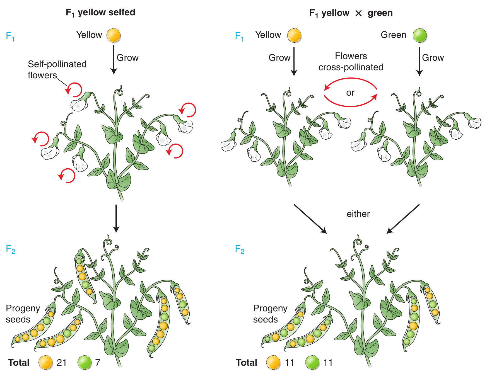
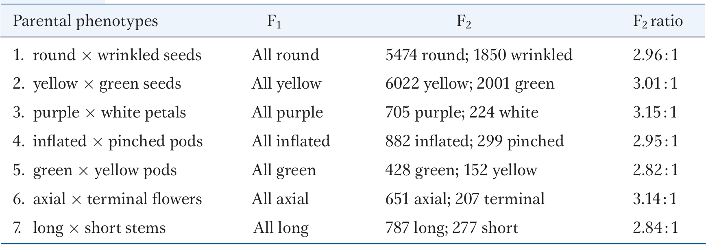
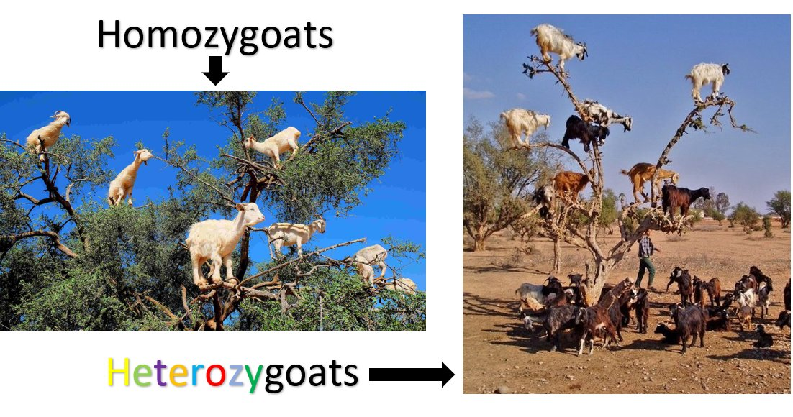
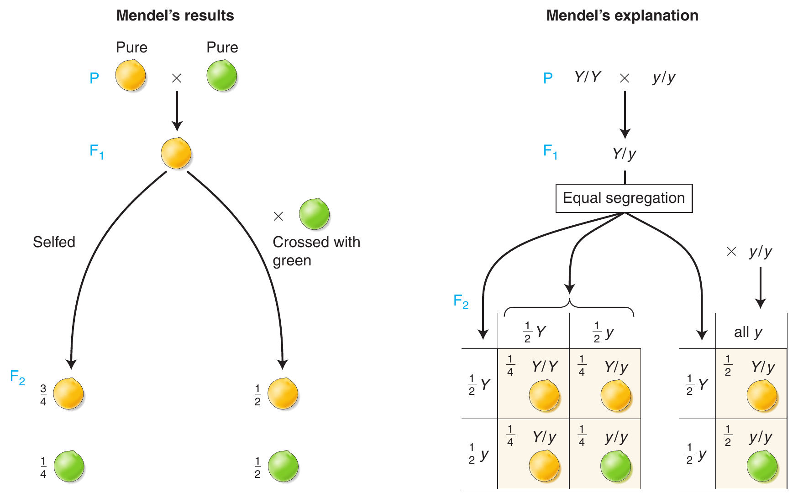
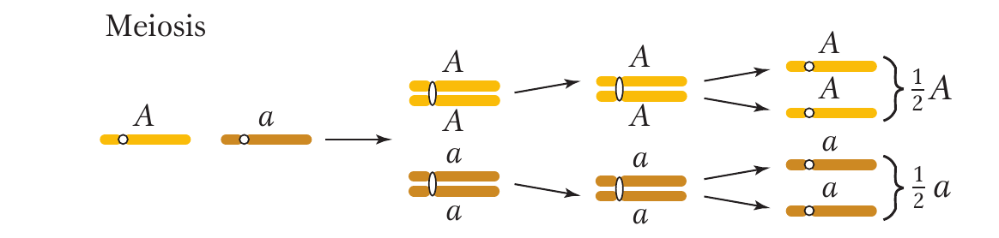
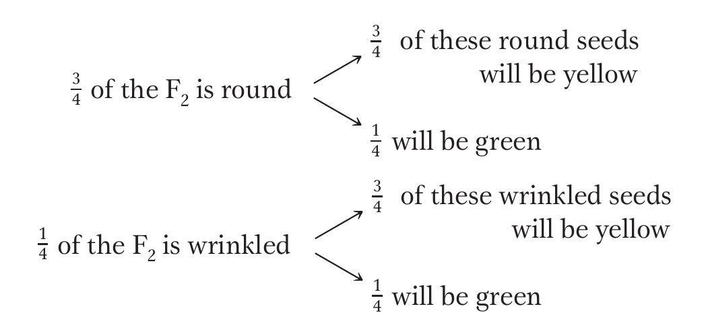
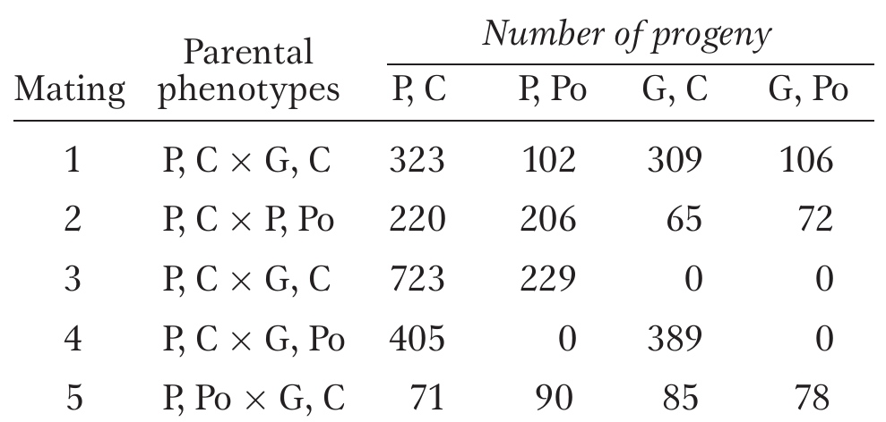

```{r,setup, include=FALSE}
library(knitr)
require(tidyverse)
set.seed(453)
# invalidate cache when the package version changes
knitr::opts_chunk$set(tidy = FALSE, echo = FALSE, 
                  message = FALSE, warning = FALSE,
                  out.width = "45%", cache = TRUE)
options(knitr.table.format = "latex")
options(knitr.kable.NA = "", digits = 2)
options(kableExtra.latex.load_packages = FALSE)
```

# Mendel's experiment

## Reasons for failure of predecessors

<!-- (Refer to Chapter 2 on 'Genes and selection: Retrospect and prospect', Plant Breeding Reviews, Volume 24, Part 1.) -->

- Scientists studied plant as a whole, i.e. in its totality of appearance of a large number of characters. Therefore plants couldn't be classified in few clearcut classes.
- Scientists were concerned with the description of various forms appearing in progeny. Attempt on highlighting class frequencies of progenies was not made.
- Data from several generations were not kept separately and accurately.
- Complete control of pollination in $\mathrm{F_1}$ was lacking
- In many studies, $\mathrm{F_1}$ was interspecific hybrid exhibiting partial to complete sterility.
- Number of plants maintained and studied in $\mathrm{F_2}$ were relatively small.
- Most characters studied were of quantitative nature.

## Suitability of pea

- Pea is self pollinating crop, so pollination control was not a problem.
- Pea is easy to cross as the flowers are relatively large.
- Pea plant was easy to cultivate and only took a season to raise a single generation
- Pea seeds are large and have good germination in general. Plants also take little space to grow.
- Pea varieties had many sharply defined inherited differences

## Resons for success of Mendel

- Analysis of failure of previous experimenters
- Mendel studied the inheritance of only one pair of contrasting characters at a time.
- Mendel selected pea varieties that had clearly different forms of one or more characters.
- For a given contrasting character, Mendel kept an accurate record of number of plants in each category for every generation.
- Carried out experiment with great care and elaborateness.
- Had a sound knowledge of mathematics
- Mendel was able to formulate appropriate hypotheses on the basis of explaination he offered for his experimental findings. Also, carried out the hypothesis testing to see the its correctness by experiment.
- Mendel was lucky

# Law of segregation

## The law

- Particulate inheritance (non contamination of an allele of a gene by other), require genes to be like solid particles.
- As a result, two alleles present in the $\mathrm{F_1}$ are able to separate and pass into different gametes in their original form producing two different types of gametes in equal frequencies; this separation of alleles is known as **segregation**.
- Two alleles of a gene remain separate and do not contaminate each other in the $\mathrm{F_1}$ or the hybrid. At the time of gamete formation in $\mathrm{F_1}$, the two alleles separate and pass into different gametes.
- This law is also known as **law of purity of gametes**.

## Mendel's work

- When two different varieties were crossed for each character, mendel uniformly found that $F_1$ was of only one type.
- However, when these $\mathrm{F_1}$ plants were permitted to self fertilized and reproduce, both original varieties now appeared in the $\mathrm{F_2}$.
- The smooth $\mathrm{F_1}$ seeds, i.e., plants from cross of smooth x wrinkled, produced upon self-fertilization and $\mathrm{F_2}$ of 5474 smooth seeds and 1850 wrinkled.
- The self fertilized yellow $\mathrm{F_1}$ produced from the cross between yellow and green seeds produced 6022 yellow and 2001 green seeds.

## Mendel's results

- For all seven characters tested, the results appeared to fit the following pattern
  1. For any character the $\mathrm{F_1}$ derived from crosses between two different varieties showed only one of the traits and never the other.
  2. The trait that had disappeared or been "hidden" in the $\mathrm{F_1}$ reappeared in the $\mathrm{F_2}$, but only in a frequency of one-quarter that of the total number
  3. It did not matter which parent variety provided the pollen and which the ova; **reciprocal crosses** in which each of the two varieties was used to provide male and female parents (e.g., male A x female B, female A x male B) always gave the same results. Thus, there was no indication that any trait Mendel observed was transmitted only through "paternal" or "maternal" inheritance.

## Behaviour of factor

- Mendel called the determining agent responsible for each trait a "factor".
- The phenomena by which one trait appears and the other does not, even though the factors for both are present is called **dominance**.
- In contrast to theory for blended inheritance, which considered all traits as becoming "blended" and diluted in hybrid offspring, Mendel showed that the factor determining each trait, whether dominant or recessive, did not change throughout the several generations of mating.

## Mendel's pea color observation

```{r phenotypic-ratios, out.width="45%", fig.align='center', fig.cap="Mendel obtained a 3:1 phenotypic ratio in his self-pollination of the $\\mathrm{F_1}$, on left, and a 1:1 phenotypic ratio in his cross of $\\mathrm{F_1}$ yellow with green, on right. Sample sizes are arbitrary."}
# pdftools::pdf_convert("../../literatures/textbooks/Introduction to Genetic Analysis/Griffiths - An Introduction to Genetic Analysis 11th Edition c2015.pdf",
#                       pages = 63,
#                       dpi = 300, format = "png",
#                       filenames = "../images/specific_phenotypic_ratios.png")


```

## Mendel's interpretation and its translation

1. A hereditary factor called a **gene** is necessary for producing pea color.
2. Each plant has a pair of this type of gene.
3. The gene comes in two forms called **alleles**. For a gene $Y$, the two alleles can be represented by $Y$ (standing for the yellow phenotype) and $y$ (standing for the green phenotype).
4. A plant can be either $Y/Y$, $y/y$, or $Y/y$. The slash shows that the alleles are a pair.
5. In the $Y/y$ plant, the Y allele dominates, and so the phenotype will be yellow. Hence, the phenotype of the $Y/y$ plant defines the $Y$ allele as dominant and the $y$ allele as recessive.
6. In meiosis, the members of a gene pair separate equally into the cells that become eggs and sperm, the gametes. This equal separation has become known as Mendel's first law or as the law of equal segregation. Hence, a single gamete contains only one member of the gene pair.
7. At fertilization, gametes fuse randomly, regardless of which of the alleles they bear.

## Mendel's exact observation

```{r mendels-obs, out.width="100%", fig.align='center', fig.cap="Results of All Mendel's Crosses in Which Parents Differed in One Character"}
# pdftools::pdf_convert("../../literatures/textbooks/Introduction to Genetic Analysis/Griffiths - An Introduction to Genetic Analysis 11th Edition c2015.pdf",
#                       pages = 64,
#                       dpi = 300, format = "png",
#                       filenames = "../images/mendels_exact_observation.png")


```

## Terminologies and meanings

```{r hetero-homo-zygous, fig.align='center', out.width="99%"}

```

##

- A fertilized egg, the first cell that develops into a progeny individual, is called a **zygote**.
- A plant with a pair of identical alleles of the par differ is called a **heterozygote**.
- Sometimes a heterozygote for one gene is called a **monohybrid**.
- An individual can be classified as either **homozygous dominant** (such as $Y/Y$), **heterozygous** ($Y/y$), or **homozygous recessive** ($y/y$).
- Allelic combinations underlying phenotypes are called genotypes. Hence, $Y/Y$, $Y/y$, and $y/y$ are all genotypes.

<!-- - When crossed with each other, the $Y/Y$ and the $y/y$ lines produce an $F_1$ generation composed of all heterozygous individuals ($Y/y$). Because $Y$ is dominant, all $F_1$ individuals are yellow in phenotype. Selfing the $F_1$ individuals can be thought of as a cross of the type $Y/y$ x $Y/y$, which is sometimes called a monohybrid cross. -->

## Monohybrid crossing

- Equal segregation of the Y and y alleles in the heterozygous $\mathrm{F_1}$ results in gametes, both male and female, half of which are Y and half of which are y.
- The general depiction of an individual expressing the dominant allele is $Y/\_$.
- Eequal segregation is detectable only in the meiosis of a heterozygote. Hence, Y/y produces one-half $Y$ gametes and one-half y gametes. Although equal segregation is taking place in homozygotes too, neither segregation $\frac{1}{2}Y: \frac{1}{2}Y$ nor segregation $\frac{1}{2}y: \frac{1}{2}y$ is meaningful or detectable at the genetic level.
- equal segregation in the yellow heterozygous $\mathrm{F_1}$ gives gametes with a $\frac{1}{2}Y: \frac{1}{2}y$ ratio.
-  The y/y parent can make only y gametes, however; so the phenotype of the progeny depends only on which allele they inherit from the Y/y parent. 
- Thus, the $\frac{1}{2}Y: \frac{1}{2}y$ **gametic ratio** from the heterozygote is converted into a $\frac{1}{2}Y/y: \frac{1}{2}y/y$ **genotypic ratio**, which corresponds to 1:1 **phenotypic ratio**.

##

```{r mendels-single-gene-law, out.width="100%", fig.align='center', fig.cap="Mendel's results (left) are explained by a single-gene model (right) that postulates the equal segregation of the members of a gene pair into gametes."}
# pdftools::pdf_convert("../../literatures/textbooks/Introduction to Genetic Analysis/Griffiths - An Introduction to Genetic Analysis 11th Edition c2015.pdf",
#                       pages = 65,
#                       dpi = 300, format = "png",
#                       filenames = "../images/mendels_law_and_explaination.png")


```

## Examples of single gene inheritance

- Segregation for waxy gene in Maize. (Waxiness is a recessive trait)
- Segregation for spore color in Neurospora. (Albino color is a recessive trait, while Black is dominant)

## Chromosomal basis of single gene inheritance

\small

- The behavior of chromosomes during meiosis clearly explains Mendel's law of
equal segregation. 
- Consider a heterozygote of general type $A/a$. We can simply follow the preceding summary while considering what happens to the alleles of this gene:
  - Start: one homolog carries $A$ and one carries $a$
  - Replication: one dyad is $AA$ and one is $aa$
  - Pairing: tetrad is $A/A/a/a$
  - First-division products: one cell $AA$, the other cell $aa$ (crossing over can mix these types of products up, but the overall ratio is not changed)
  - Second-division products: four cells, two of type $A$ and two of type $a$.
  - Hence, the products of meiosis from a heterozygous meiocyte $A/a$ are $\frac{1}{2}A$ and $\frac{1}{2}a$, precisely the equal ratio that is needed to explain Mendel's first law.

```{r mendels-single-gene-law-meiosis, out.width="45%", fig.align='center'}
# pdftools::pdf_convert("../../literatures/textbooks/Introduction to Genetic Analysis/Griffiths - An Introduction to Genetic Analysis 11th Edition c2015.pdf",
#                       pages = 70,
#                       dpi = 300, format = "png",
#                       filenames = "../images/mendels_law_and_explaination_meiosis.png")


```

<!-- ## Predicting progeny proportions -->

<!-- - Principle of inheritance can be used to predict phenotypic ratios in the progeny of parents of known genotypes. These parents would be from stocks maintained by the researcher. -->
<!-- - The types and proportions of the progeny of crosses such as A/A x A/a, A/A x a/a, and A/a x a/a can be easily predicted. -->
<!-- - After single-gene inheritance has been established, an invididual showing the dominant phenotype but of unknown genotype can be tested to see if the genotype is homozygous or heterozygous. -->
<!-- - Such a test can be performed by crossing the individual (of phenotype A/?) with recessive tester strain a/a. -->
<!--   - What is the result now, in each case ? -->
<!--   - This type of cross is called ? -->
<!--   - What if a tester individual is homozygous ? -->
# Law of independent assortment

## The law

- The segreation of two or more characters in the same hybrid is independent of each other. Thus any allele of one gene is equally likely to combine with any allele of the other gene and pass into the same gamete.
- Independent segregation of two genes produce four different types of gametes in equal proportion. 
- A random union among the gametes gives rise to 16 possible zygotes. These zygotes yield 9:3:3:1 phenotypic ratio, which is known as the typical dihybrid ratio.

## Mendel's work

\small

- Mendel began to work with a pair of characters -- seed shape and seed color. 
- Monohybrid cross for seed color ($Y/y$ × $Y/y$) gives a progeny ratio of 3 yellow : 1 green. The monohybrid cross for seed shape ($R/r$ × $R/r$) gives a progeny ratio of 3 round : 1 wrinkled.
- To perform a dihybrid cross, Mendel started with two pure parental lines. One line had wrinkled, yellow seeds. Because Mendel had no concept of the chromosomal location of genes, we must use the dot representation to write the combined genotype initially as $r/r.Y/Y$. The other line had round, green seeds, with genotype $R/R.y/y$.
- When these two lines were crossed, they must have produced gametes that were $r.Y$ and $R.y$ , respectively.
- Hence, the $\mathrm{F_1}$ seeds had to be dihybrid, of genotype $R/r.Y/y$. Mendel discovered that the $\mathrm{F_1}$ seeds were round and yellow. This result showed that the dominance of $R$ over $r$ and $Y$ over $y$ was unaffected by the condition of the other gene pair in the $R/r.Y/y$ dihybrid. In other words, $R$ remained dominant over $r$, regardless of seed color, and $Y$ remained dominant over $y$, regardless of seed shape.

## Mendel's dihybrid cross

\begin{columns}[T,onlytextwidth]

  \column{0.3\textwidth}
  \footnotesize
  \begin{itemize}
  \item Mendel then selfed the dihybrid to obtain the $\mathrm{F_2}$ generation.
  \end{itemize}

  \begin{equation}
  \begin{aligned}
  \frac{9}{16} &~ \textrm{round, yellow} \\
  \frac{3}{16} &~ \textrm{round, green} \\
  \frac{3}{16} &~ \textrm{wrinkled, yellow} \\
  \frac{1}{16} &~ \textrm{wrinkled, green} \nonumber
  \end{aligned}
  \end{equation}
  
  \column{.7\linewidth}
  
  \begin{figure}
  \begin{columns}[T,onlytextwidth]
  \column{.7\linewidth}
  \begin{center}
  \includegraphics[width=0.8\linewidth]{../images/mendels_dihybrid_cross.png}
  \end{center}
  \column{.3\linewidth}
  \caption{\newline Mendel's dihybrid cross in pea}
  \label{fig:mendels-dihybrid-cross}
  \end{columns}
  \end{figure}

\end{columns}

## Dihybrid cross is a result of two independent monhybrid cross events combined

\footnotesize

- Mendel verified if the monohybrid 3:1 ratios can still be found in the $\mathrm{F_2}$.
- In regard to seed shape, there are 423 round seeds (315 + 108) and 133 wrinkled seeds (101 + 32).
- In regard to seed color, there are 416 yellow seeds (315 + 101) and 140 green seeds (108 + 32).
- Calculate the monohybrid ratios.
- This led to Mendel's insight on 9:3:3:1 ratio, because he realized that it was simply two different ratios combined at random.

```{r independent-assortment-prob, out.width="45%", fig.align='center'}
# pdftools::pdf_convert("../../literatures/textbooks/Introduction to Genetic Analysis/Griffiths - An Introduction to Genetic Analysis 11th Edition c2015.pdf",
#                       pages = 116,
#                       dpi = 300, format = "png",
#                       filenames = "../images/mendels_independent_assortment_prob.png")


```

- The probabilities of the four possible outcomes are calculated by using the **product rule**.

## Mendel's conclusion

- Different gene pairs assort independently during gamete formation. 
- The consequence is that, for two heterozygous gene pairs $A/a$ and $B/b$, the $b$ allele is just as likely to end up in a gamete with an $a$ allele as with an $A$ allele, and likewise for the B allele.

## Genetic ratios

\begin{columns}[T,onlytextwidth]
  
  \column{0.25\linewidth}
  \footnotesize
  \begin{itemize}
  \item Probability of obtaining gametes with composition of both alleles:
  \end{itemize}

  \begin{equation}
  \begin{aligned}
  \frac{1}{4} R/\_; Y/\_ &\longrightarrow \textrm{round, yellow} \\
  \frac{1}{4} R/\_; y/y &\longrightarrow \textrm{round, green} \\
  \frac{1}{4} r/r; Y/\_ &\longrightarrow \textrm{wrinkled, yellow} \\
  \frac{1}{4} r/r; y/y &\longrightarrow \textrm{wrinkled, green} \nonumber
  \end{aligned}
  \end{equation}

  \column{0.75\linewidth}
  
  \begin{figure}
  \begin{columns}[T,onlytextwidth]
  
  \column{.8\linewidth}
  
  \begin{center}
  \includegraphics[width=0.45\linewidth]{../images/mendels_independent_assortment_punnet.png}
  \end{center}

  \column{.2\linewidth}

  \caption{\newline We can use a Punnett square to predict the result of a dihybrid cross. This Punnett square shows the predicted genotypic and phenotypic constitution of the $\mathrm{F_2}$ generation from a dihybrid cross.}
  \label{fig:independent-assortment-punnet}
  
  \end{columns}
  \end{figure}
  
\end{columns}

## 

\begin{figure}
\begin{columns}[T,onlytextwidth]
  \column{.8\linewidth}
  
  \begin{center}
  \includegraphics[width=0.45\linewidth]{../images/independent_assortment_basis.png}
  \end{center}

  \column{.2\linewidth}

  \caption{\textbf{Chromosomal basis of independent assortment} \newline Meiosis in a diploid cell of genotype A/a;B/b. The diagram shows how the segregation and assortment of different chromosome pairs give rise to the 1:1:1:1 Mendelian gametic ratio.}
  \label{fig:independent-assortment-punnet}

\end{columns}
\end{figure}

# Numerical exercise

## 

\footnotesize

1. (Monohybrid cross and dominance relation) While performing a large scale grow out experiment of pea germplasm, a plant with three cotyledons was discovered (normally, there are 2 cotyledons). This plant was crossed with a normal pure-breeding wild-type plant, and 600 seeds from this cross were planted. There were 298 plants with two cotyledons and 302 with three cotyledons. What can be said about the inheritance of three cotyledons ? 

(Hint: Invert gene symbols as part of your explanation)

2. (Dominance and parental genotype determination) In tomatoes, one gene determines whether the plant has purple (P) or green (G) stems, and a separate, independent gene determines whether the leaves are "cut" (C) or "potato" (Po). Five matings of tomato-plant phenotypes give the following results.
  a. Which alleles are dominant ?
  b. What are the most probable genotypes for the parents in each cross ?

```{r independent-assortment-example, out.width="40%", fig.align='center'}
# pdftools::pdf_convert("../../literatures/textbooks/Introduction to Genetic Analysis/Griffiths - An Introduction to Genetic Analysis 11th Edition c2015.pdf",
#                       pages = 148,
#                       dpi = 300, format = "png",
#                       filenames = "../images/independent_assortment_example1.png")


```

\renewcommand{\arraystretch}{1}

# Bibliography

## References
