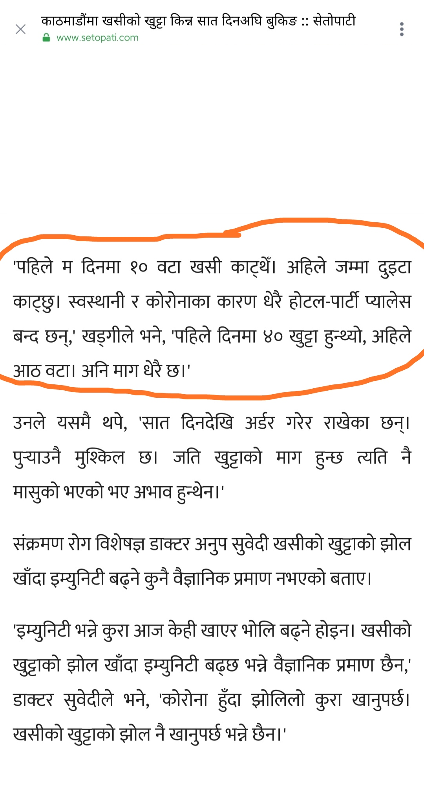
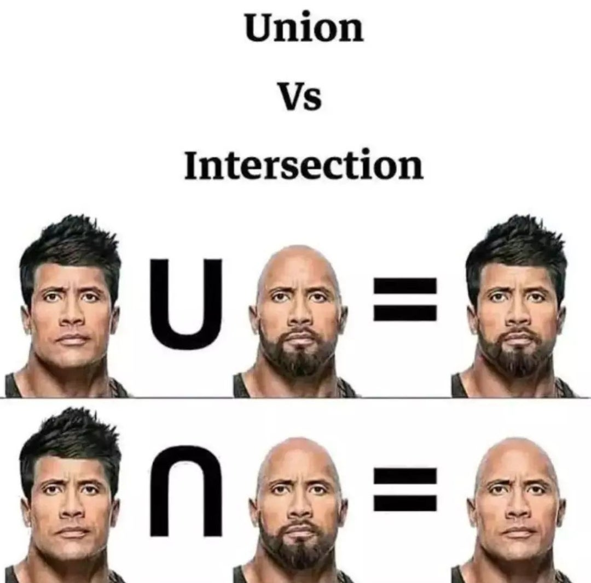
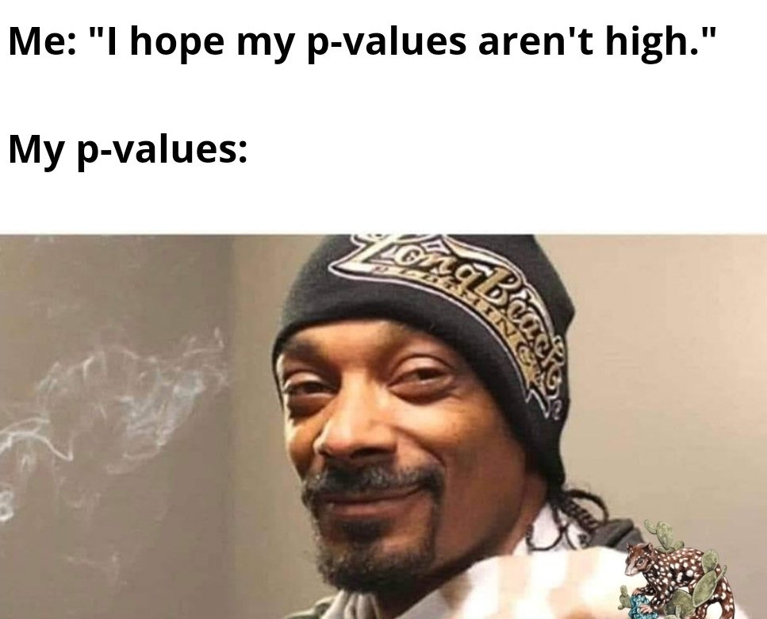
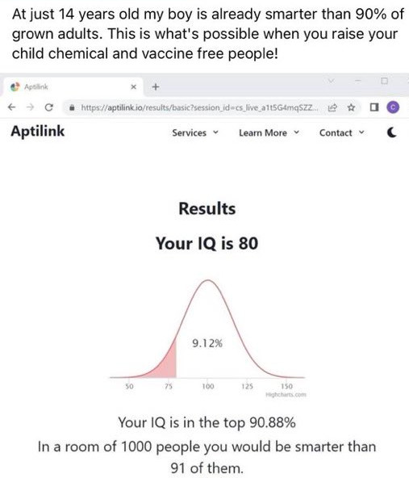

```{r setup, include=FALSE}
library(knitr)
require(tidyverse)
set.seed(453)
# invalidate cache when the package version changes
knitr::opts_chunk$set(tidy = FALSE, echo = FALSE, 
                  message = FALSE, warning = FALSE,
                  out.width = "45%", cache = TRUE)
options(knitr.table.format = "latex")
options(knitr.kable.NA = "", digits = 2)
options(kableExtra.latex.load_packages = FALSE)
theme_set(theme_bw())
```

# The probability rules

## Probability

\begin{columns}[T,onlytextwidth]
\column{0.5\textwidth}

```{r probability-roger, out.width="95%"}

```

\column{0.5\textwidth}

```{r probability-goat, out.width="60%"}

```

\end{columns}

<!-- Statistics is the story of averages and norms. -->

<!-- Stories -->

<!-- Imagine you were invited to arrange the entertainment for a boy's birthday party. Being an intelligent person, you ask "What will be the average age of the people at the party ?" You are told 18. Now you know how to prepare. You find some fantastic video games that will challenge and stimulate 18-year-old boys, some music videos with loud rock music and adventurous visuals, and you think you are all set. You arrive at the party to discover 10 moms who are 30 years old and 10 boys who are 6 years old. The average is 18! Unfortunately, no one at the party is able to enjoy the entertainment you arranged, because you pegged your thinking to the average. (The distribution is, infact, bi-modal (modes being 6 and 30)). -->

<!-- A 6 foot man, about to cross a river, asks a statistician how deep is the river ? The statistician says its 4 feet deep. You -- the 6 feet man -- do you cross the river ? -->

<!-- It is dangerous to think only of averages. -->


## Product rule ($\cap$, $\land$)

- The possible outcomes from rolling two dice follow the product rule because the outcome on one die is independent of the other. 
- As an example, let us calculate the probability, $p$, of rolling a pair of 4's ($\large \{\epsdice{4}, \epsdice{4}\}$). The probability of a $\large \epsdice{4}$ on one die is 1/6 because the die has six sides and only one side carries the number 4. 
- This probability is written as follows

$$
p ({\large \epsdice{4}}) = \frac{1}{6}
$$

- Therefore, with the use of the product rule, the probability of a 4 appearing on both dice ($\large \{\epsdice{4}, \epsdice{4}\}$) is 1/6 × 1/6 = 1/36, which is written

$$
p (\epsdice{4} \text{ and } \epsdice{4}) = \frac{1}{6} \times \frac{1}{6} = \frac{1}{36}
$$

##

```{r probability-rock, out.width="45%", fig.align='center'}

```

## Sum rule ($\cup$, $\lor$)

- We have already calculated that the probability of $\{\epsdice{4}, \epsdice{4}\}$ is 1/36; clearly, with the use of the same type of calculation, the probability of $\{\epsdice{5}, \epsdice{5}\}$ will be the same, or 1/36. Now we can calculate the probability of **either** $\{\epsdice{4}, \epsdice{4}\}$ **or** $\{\epsdice{5}, \epsdice{5}\}$. 
- Because these outcomes are mutually exclusive, the sum rule can be used to tell us that the answer is 1/36 + 1/36, which is 1/18. This probability can be written as follows:

$$
p(\{\epsdice{4}, \epsdice{4}\} \lor \{\epsdice{5}, \epsdice{5}\}) = \frac{1}{36} + \frac{1}{36} = \frac{1}{18}
$$

<!-- ## Problem: Probability rules -->

<!-- - What proportion of the progenies will be suitable to be used as tester parent in the cross between two parental genotypes: -->

<!-- $$ -->
<!-- A/a;b/b;C/c;D/d;E/e \times a/a;b/b;c/c;d/d;E/e -->
<!-- $$ -->

<!-- - Approach using product rule. -->

<!-- ## How many progenies do we need ? -->

<!-- - Assume we need to estimate how many progeny plants need to be grown to stand a reasonable chance of obtaining the desired genotype a/a; b/b; c/c; d/d; e/e. -->
<!-- - First calculate the proportion of progeny that is expected to be of that genotype, as such we need at least 256 progeny to stand an average chance of obtaining one individual plant of the desired genotype. -->
<!-- - The probability of obtaining one "success" (a fully recessive plant) out of 256 has to be considered more carefully. This is the average probability of success. Unfortunately, if we isolated and tested 256 progeny, we would very likely have no success at all, simply from bad luck. -->
<!-- - A more meaningful question to as ask would, hence be, what sample size do we need to be 95% confident that we will obtain at least one success ? -->
<!-- - Probability of obtaining at least one success can be expressed as: -->

<!-- $$ -->
<!-- 1-\left(\frac{255}{256}\right)^n -->
<!-- $$ -->

<!-- ## -->

<!-- - To be 95% confident that our sample will contain at least one genotype we intended, we solve: -->

<!-- $$ -->
<!-- 1-\left(\frac{255}{256}\right)^n = 0.95 -->
<!-- $$ -->

<!-- - Solving for $n$ gives `r round(log(1-0.95)/log(255/256))`, which is the right amount of progeny samples to be raised to assure 95% success of having 1 individual out of 256 totals. -->

<!-- ## -->

<!-- ```{r confidence-sampling, fig.width=6, fig.height=4, out.width="60%", fig.align='center'} -->
<!-- contain_confidence95 <- function(x){1-(255/256)^x} -->
<!-- root_solution <- log(1-0.95)/log(255/256) -->

<!-- contain_conf_samples <- ggplot(data.frame(x=c(0, 1000)), aes(x)) +  -->
<!--   stat_function(fun=contain_confidence95) + -->
<!--   scale_y_continuous(labels = scales::percent_format(), limits = c(0, 1)) + -->
<!--   geom_vline(xintercept = root_solution, color = "blue") + -->
<!--   geom_hline(yintercept = 0.95, color = "red") + -->
<!--   geom_text(aes(0, 0.95, label = scales::percent(.95), vjust = +2, hjust = -1)) + -->
<!--   geom_text(aes(root_solution, 0, label = round(root_solution), vjust = -2, hjust = 1.5)) +  -->
<!--   labs(x = "Number of samples", y = "Confidence of having success") -->

<!-- x <- 0:1000 -->
<!-- ycord <- contain_confidence95(x) -->
<!-- dframe <- data.frame(x = x, ycord = ycord) -->

<!-- contain_conf_samples + -->
<!--   geom_ribbon(aes(ymin = 0, ymax = ycord, -->
<!--                   fill = NULL), alpha = 0.25, data = dframe) + -->
<!--   annotate("point", x = root_solution, y = 0.95, color = "grey4") -->
<!-- ``` -->

# Using $\Large \chi^2$ test on monohybrid and dihybrid ratios

## Checking observation against expectation

\small

- Often the question is whether the obtained results are close to an expected ratio, although it is not identical to.
- A statistical test ($\chi^2$) checks the observation against expectation.
- The general situation is one in which observed results are compared with those predicted by a hypothesis. 
- In a simple genetic example, suppose you have bred a plant that you hypothesize on the basis of a preceding analysis to be a heterozygote, A/a. 
- To test this hypothesis, you cross this heterozygote with a tester of genotype a/a and count the numbers of phenotypes with genotypes A/− and a/a in the progeny. Then, you must assess whether the numbers that you obtain constitute the expected 1 : 1 ratio. 
- If there is a close match, then the hypothesis is deemed consistent with the result, whereas if there is a poor match, the hypothesis is rejected.
- As part of this process, a judgment has to be made about whether the observed
numbers are close enough to those expected.
- The $\chi^2$ test is simply a way of quantifying the various deviations expected by chance if a hypothesis is true. 

## Probabilistic testing of data

- We can model this idea with a barrelful of equal numbers of red and white marbles. If we blindly remove samples of 100 marbles, on the basis of chance we would expect samples to show small deviations such as 52 red : 48 white quite commonly and to show larger deviations such as 60 red : 40 white less commonly. Even 100 red marbles is a possible outcome, at a very low probability of $\left(\frac{1}{2}\right)^{100}$ . 
- However, if any result is possible at some level of probability even if the hypothesis is true, how can we ever reject a hypothesis? A general scientific convention is that a hypothesis will be rejected as false if there is a probability of less than 5 percent of observing a deviation from expectations at least as large as the one actually observed. The implication is that, although results this far from expectations are expected 5 percent of the time even when the hypothesis is true, we will mistakenly reject the hypothesis in only 5 percent of cases and we are willing to take this chance of error.

## Problem 1: Dihybrid testcross ratio 

\small

- Consider a general dihybrid testcross, in which it is not known if the genes are linked or not: A/a.B/b x a/a.b/b
- If there is _no_ linkage, that is, the genes assort independently, we have seen that the following phenotypic proportions are expected in progeny:

```{r}
tribble(~"Phenotype", ~"Proportion", 
        "AB", 0.25,
        "Ab", 0.25,
        "aB", 0.25,
        "ab", 0.25) %>% 
  knitr::kable(booktabs = TRUE) %>% 
  kableExtra::kable_styling(position = "center", font_size = 6)
```

##

- A cross of this type was made and the following phenotypes obtained in a progeny sample of 200.

```{r}
tribble(~"Phenotype", ~"Count", 
        "AB", 60,
        "Ab", 37,
        "aB", 41,
        "ab", 62) %>% 
  knitr::kable(booktabs = TRUE) %>% 
  kableExtra::kable_styling(position = "center", font_size = 6)
```

## Solution 1: Dihybrid testcross ratio

- There is clearly a deviation from the prediction of no linkage which would have given the progeny numbers 50:50:50:50. 
- The results suggest that the dihybrid was a cis configuration of linked genes, A B / a b, because the progeny A B and a b are in the majority. 
- The recombinant frequency would be $\frac{37 + 41}{200} = 39\%$, or 39 m.u.
- However, we know that chance deviations can provide results that resemble those produced by genetic processes; hence we, need the $\chi^2$ test to help calculate the probability of a chance deviation of this magnitude form a 1:1:1:1 ratio. 

##

- The test statisic $\chi^2$ is obtained by:

$$
\chi^2 = \frac{\left[\sum|observed-expected|-\frac{1}{2}\right]^2}{expected}
$$

- First, let us examine the allele ratios for both loci. These are 97:103 for A:a, and - 101:99 for B:b. Such numbers are close to the 1:1 allele ratios expected from mendel's first law, so skewed allele ratios cannot be responsible for the quite large deviations from the expected numbers of progenies.

##

- We must apply the $\chi^2$ analysis to test a hypothesis of no linkage. If that hypothesis is rejected, we can infer linkage. (Why can't we test a hypothesis of linkage directly ?)

```{r chi-sqrt-linkage, message=FALSE, warning=FALSE, echo=FALSE}
chi_sqrt_linkage <- read_csv("./../data/chi_square_test.csv", show_col_types = FALSE) %>% 
  rename(" " = 1)

kable(chi_sqrt_linkage, 
      booktabs = TRUE, escape = FALSE, 
      caption = "Chi-square calculations for the hypothesis that the observations of four phenotypic classes is obtained due to no linkage between loci A and B.") %>% 
  kableExtra::kable_styling(latex_options = "scale_down", font_size = 5)
```

## How I want my P-values vs How they came to be

```{r my-p-values, out.width="60%"}

```

##

```{r chi-sqrt-values, echo=FALSE, message=FALSE}
# Set p-values
p <- c(0.995, 0.99, 0.975, 0.95, 0.90, 0.10, 0.05, 0.025, 0.01, 0.005)
# Set degrees of freedom
df <- c(seq(1,20),25,30,35,40,50,100)

# Calculate a matrix of chisq statistics
m <- outer(p, df, function(x,y) qchisq(x,y))

# Transpose for a better view
m <- t(m)

# Set column and row names
colnames(m) <- rev(p)
rownames(m) <- df

kable(m, format = "latex", booktabs = TRUE, escape = TRUE, 
      caption = "The probabilities of exceeding different chi-square values for degrees of freedom from 1 to 50 when the expected hypothesis is true") %>% 
  kableExtra::kable_styling(latex_options = "striped", font_size = 5) %>% 
  kableExtra::column_spec(6, border_left = TRUE)
```

##

- Since there are four genotypic classes, we must use 4-1 = 3 degrees of freedom.
- Consulting the $\chi^2$ table, we see our values of 9.88 and 3 df give a p value of ~0.025, or 2.5%. 
- This is less than the standard cut-off value of 5 percent, so we can reject the hypothesis of no linkage. 
- Hence, we are left with the conclusion that the genes are very likely linked, approximately 39 m.u. apart.

## Interpreting p-values

```{r interpreting-pvalues, fig.align='center', out.width="40%"}

```


# Binomial expansion

## 

- The set of terms, along with their coefficients, obtained by expanding the general binomial $(a + b)^n$ is known as binomial expansion. 
- Expansion involves:
  - Determination of various terms of the expansion
  - Determination of coefficients of the expansion
- Simplification of $(a + b)^n$ yields following expansion:

$$
(a + b)^n = a^n + a^{n-1}b^1 + a^{n-2}b^2 + .... + a^1b^{n-1} + b^n
$$

- The coefficient for a term can be calculated by the following general formula:

$$
\text{Coefficient} = \frac{n!}{s! t!}
$$

- Where, n = index of binomial, s = index of a in the given term and t = index of b in the term.
- It is applicable to those events in which the number of mutually exclusive events is two.

## Problem

If 12 people are to be divided into 3 committee of respective sizes, 3, 4 and 5 how many divisions are possible ?

Solution:

```{r}
solution_pr1 <- choose(12, 3) * choose(12-3, 4) * choose(12-3-4, 5)
# # alternatively
# factorial(12)/(factorial(3)*factorial(4)*factorial(5))
```

A total of `r solution_pr1` divisions possible.

## Problem

Five male and four female plants are to be arranged in a single row for a breeding experiment. To ensure breeding, no two male plants can be next to one another. How many arrangements are possible ?

Solution:

Since there are 5 males and 4 females and there can be no adjacent males, the plants must alternate between male and female starting with a male. The number of ordered arrangements of the 5 male plants in the odd positions is given by $P_5 = 5!$. Similarly, the number of ordered arrangements of the 4 female plants in the even positions is given by $P_4 = 4!$. Therefore, using the Fundamental Principle of Counting, the total number of possible arrangements is $5! \times 4! = 2880$.


## Problem

If 5 coins are tossed together, determine the probability of getting

1. 3H and 2T
2. At least 3H
3. More than 3H
4. Less than 3H
5. Not more than 3H

## Solution

Let $a$ represent probability of turning head ($P(H) = \frac{1}{2}$) and $b$ represent the probability of turning tail ($P(T) = \frac{1}{2}$), then, Binomial expansion can be used to mimic all 5 tosses.

$$
(a + b)^5 = a^5 + 5a^4b + 10 a^3 b^2 + 10 a^2 b^3 + 5 ab^4 + b^5
$$

Now,

1. Probability(P) of 3H and 2T is given by $\mathrm{3^{rd}}$ term, which is: $10 a^3 b^2$ equals $\frac{5}{16}$.
2. Probabilities of having (3H or 4H or 5H)
3. Probabilities of having (4H or 5H)
4. Probabilities of having (1H or 2H)
5. Probabilities of having (1H or 2H or 3H)

## Problem

Two heterozygous brown-eyed (Bb) individuals have five children. What is the probability that two of the couple's five children will have blue eye ?

## Solution

Applying binomial expansion

1. Calculate individual probabilities (Using punnet square)

$$
\begin{aligned}
P_{(\text{blue eyes})} &= p = \frac{1}{4} \\
P_{(\text{brown eyes})} &= q = \frac{3}{4}
\end{aligned}
$$

2. Determine the number of events

$$
\begin{aligned}
n &= \text{total number of children} = 5 \\
x &= \text{total number of blue-eyed children} = 2
\end{aligned}
$$

3. Substituting the values in the following binomial equation, $2^{nd}$ term ($\frac{n!}{s! t!} p^2 q^3$) and its coefficient gives the probability of having two children with blue eyes. That is,

$$
P = \frac{5!}{2! \times 3!} \left(\frac{1}{4}\right)^2 \left(\frac{3}{4}\right)^3 = 0.26
$$

This yields that 26% of the time, a heterozygote couples' five of the children will contain two with blue eyes and three with brown eyes.

## Problem

In a family with 5 children, what is the probability that it has 3 boys and 2 girls among them.

## Solution

Let us assume the probability of having a boy child as $p$ = 0.5, and the probability of having a girl child as $q$ = 0.5. Now the combined probability of having, among 5 children, 3 boys and 2 girls can determined by following term of the $(p + q)^5$ binomial expansion.

$$
p^3q^{5-3} = p^3q^{2} = \left(\frac{1}{2}\right)^3 \times \left(\frac{1}{2}\right)^2
$$
This has the following coefficient: $5\choose{3}$

The probability is, therefore, computed as: `r choose(5, 3)*(1/2)^3*(1/2)^2`.

# Bibliography

## Reading materials

For numerical analysis using $\chi^2$ test, See pp 96 of @griffiths2015introduction.
