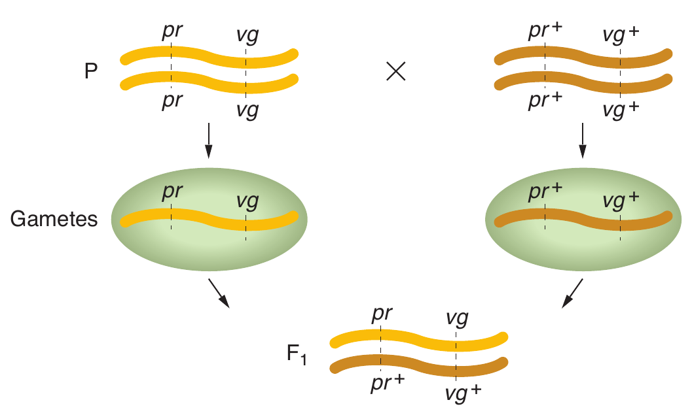

```{r,setup, include=FALSE}
library(knitr)
require(tidyverse)
set.seed(453)
# invalidate cache when the package version changes
knitr::opts_chunk$set(tidy = FALSE, echo = FALSE, 
                  message = FALSE, warning = FALSE,
                  out.width = "45%", cache = TRUE)
options(knitr.table.format = "latex")
options(knitr.kable.NA = "", digits = 2)
options(kableExtra.latex.load_packages = FALSE)
```

# Linkage and crossing over

## Locating genes in chromosomes

- Reasons:
  - Gene position is crucial information needed to _build complex genotypes_ required for experimental purposes or for commercial applications.
  - Knowing the position occupied by a gene provides a way of discovering its _structure and function_.
  - Chromosomal arrangements of related species might differ. By comparing such differences, geneticists can deduce the _evolutionary genetic mechanisms_ through which these genomes diverged.
- The arrangement of genes on chromosomes is represented digaramatically as a unidimensional chromosome map, showing gene positions, known as **loci**.
- Two basic types of chromosome maps are available:
  - Recombination map
  - Physical map

## Recombination

- The independent assortment of genes at meiosis is one of the main ways by which an organism produces new combinations of alleles. The production of new allele combinations is formally called recombination.
- Meiotic recombination is any meiotic process that generates a haploid product with new combinations of the alleles carried by the haploid genotypes that united to form the meiocyte.

```{r meiotic-recombinants, out.width="25%", fig.align='center', fig.cap="Recombinants (blue) are those products of meiosis with allele combinations different from those of the haploid cells that formed the meiotic diploid (yellow). Note that genes A  /a and B /b are shown separated by a dot because they may be on the same chromosome or on different chromosomes."}
# pdftools::pdf_convert("~/Desktop/BSc_Ag_lectures/literatures/textbooks/Introduction to Genetic Analysis/Griffiths - An Introduction to Genetic Analysis 11th Edition c2015.pdf",
#                       pages = 132, dpi = 300,
#                       filenames = "./../images/meiotic_recombinants.png")


```

## Linkage

- Recombination maps of chromosomes are usually assembled two or three genes at a time, with the use of a method called linkage analysis.
- When we say two genes are **linked**, it means that the loci of those genes are on the same chromosome.
- In early 1900s, William Bateson and R. C. Punnett were studying the inheritance of two genes in sweet peas.
- In a standard self of a dihybrid $F_1$, the $F_2$ did not show the 9:3:3:1 ratio predicted by the principle of independent assortment. Bateson and Punnett noted that certain combinations of alleles show up more than expected, as if they were physically attached in some way.
- Thomas H Morgan found similar deviation from mendel's second law while studying autosomal genes in _Drosophila_.
- Morgan proposed linkage as a hypothesis to explain the phenomena of apparent allele association.

## Linkage: Morgan's data

- One of the genes affected eye color ($pr$, purple, and $pr^+$, red), and the other gene affected wing length ($vg$, vestigial, and $vg^+$, normal). (Vestigial wings are very small compared to wild type.) The wild-type alleles of both genes are dominant. 
- Morgan performed a cross to obtain dihybrids and then followed with a testcross:

$$
\begin{aligned}
& \textrm{P } & pr/pr.vg/vg & \times pr^+/pr^+./vg^+/vg^+ & \\
&& &\downarrow & \\
& \textrm{Gametes} & pr.vg &~ pr^+vg^+ & \\
& \mathrm{F_1~dihybrid} & pr^+/pr &. vg^+/vg & \\
\textrm{Testcross:} &&&& \\
&& pr^+/pr.vg^+/vg \female &\times pr/pr.vg/vg \male &\\
&& \mathrm{F_1} \textrm{ dihybrid female} & \textrm{Tester male}
\end{aligned}
$$

##

- Because the tester parent contributes gametes carrying only recessive alleles, the phenotypes of the offspring directly reveal the alleles contributed by the gametes of the dihybrid parent.
- Hence, the analyst can concentrate on meiosis in one parent (the dihybrid) and essentially forget about meiosis in the other (the tester).
- In contrast, from an $F_1$ self, there are two sets of meioses to consider in the analysis of progeny: one in the male parent and the other in the female.
- Morgan's testcross results were as follows (listed as the gametic classes from the dihybrid):

```{r testcross-morgan}
tribble(~ "Genotype", ~ "Progenies",
        "$pr^+.vg^+$", 1339,
        "$pr.vg$", 1195,
        "$pr^+.vg$", 151,
        "$pr.vg^+$", 154) %>% 
  knitr::kable(booktabs = TRUE, escape = FALSE) %>% 
  kableExtra::kable_styling(position = "center")
```

##

- These numbers drastically deviate from the Mendelian prediction of a 1:1:1:1 ratio expected from independent assortment (approximately 710 in each of the four class).
- Another useful way of assessing the testcross results is by considering the percentage of recombinants in the progeny. 
- There are two recombinations in the cross, $pr^+.vg$ and $pr.vg^+$, because they are clearly not the two input genotypes contributed to the $F_1$ dihybrid by the original homozygous parental flies (by their gametes, in fact).
- Two recombinant types are approximately equal in frequency (151 ~ 154). Their total is 305 (frequency = $\frac{305}{2839} \times 100 = 10.7\%$).

##

- This data can be explained by postulating that the genes were linked on the same chromosome, and so the parental allelic combinations are held together in the majority of progeny.
- In the dihybrid, the allelic conformation must have been as follows:

```{r dihybrid-conformation, out.width="25%", fig.align='center'}
# pdftools::pdf_convert("~/Desktop/BSc_Ag_lectures/literatures/textbooks/Introduction to Genetic Analysis/Griffiths - An Introduction to Genetic Analysis 11th Edition c2015.pdf", pages = 157, dpi = 300, 
#                       filenames = "./../images/dihybrid_conformation.png")


```

```{r linked-genes-inheritance, out.width="36%", fig.align='center', fig.cap="Inheritance of linked genes; These genes tend to be inherited as a package."}
# pdftools::pdf_convert("~/Desktop/BSc_Ag_lectures/literatures/textbooks/Introduction to Genetic Analysis/Griffiths - An Introduction to Genetic Analysis 11th Edition c2015.pdf", pages = 157, dpi = 300, 
#                       filenames = "./../images/linked_genes_inheritance.png")


```

##

- Morgan made yet another cross with the use of the same alleles but in a different combination. In this cross, each parent is homozygous for the wild-type allele of one gene and the mutant allele of the other.
- Again $F_1$ females were testcrossed.
- Now,
  - Speak about progeny frequencies
  - Do the progeny frequencies match to Mendelian ratio ?
  - What are the recombinant classes ?
  - What is the likely conformation of the $F_1$ dihybrid ?
- Two forms of dihybrid testcross ratios are possible in genetics:
  1. Two equally frequent nonrecombinant classes totaling in excess of 50 percent
  2. Two equally frequent recombinant classes totaling less than 50 percent.
  
\textbf{
When two genes are close together on the same chromosome pair (that is, they are linked), they do not assort independently but produce a recombinant frequency of less than 50 percent.
}

# Crossing over

## Crossing over produces new allelic combinations

\small

\begin{figure}
\begin{columns}[T,onlytextwidth]
  \column{.35\linewidth}
  
  \begin{center}
  \includegraphics[width=0.85\linewidth]{./../images/crossing_over_allelic_comb.png}
  \end{center}
  \caption{Crossing over phenomena}
  \label{fig:crossing-over-combination}

  \column{.65\linewidth}
  
  \begin{itemize}
  \item Crossover products are a result of break and join of two homologous chromosomes.
  \item At meiosis, when duplicated homologous chromosomes pair with each other -- in genetic terms, when the two dyads unite as bivalent -- a cross shaped structure called chiasma (pl., chiasmata) often forms between two nonsister chromatids.
  \item In 1931, Harriet Creighton and Barbara McClintock were studying two genes of corn that they knew were both located on chromosome 9. One affected seed color (C, colored; c, colorless), and the other affected endosperm composition (Wx, waxy; wx, starchy). The plant was a dihybrid in cis conformation.
  \end{itemize}
  
\end{columns}
\end{figure}

## Linkage symbolism

- Two conformations of linked genes in a dihybrid are possible.
  1. Cis : $AB/ab$ or $++/ab$
  2. Trans: $Ab/aB$ or $+b/a+$
- Alleles on the same homolog have no punctuation between them.
- A slash symbolically separates two homologs
- Alleles are always written in the same order on each homolog
- Genes known to be on different chromosomes are shown separated by a semicolon. For e.g., $A/a$; $C/c$

## Two point crossing over

- As already evident from Morgan's data above, the recombinant frequency was significantly less than $50\%$, specifically $10.7\%$.
- Recombination frequencies greater than $50\%$ is never observed.
- Imagine two specific genes positioned a certain fixed distance apart. Now imagine random crossing over along the paired homologs. In some meioses, nonsister chromatids cross over by chance in the chromosomal region between these genes; from these meioses, recombinants are produced. In other meiotic divisions, there are no crossovers between these genes; no recombinants result from these meioses. 

##

- Sturtevant postulated a rough proportionality: the greater the distance between the linked genes, the greater the chance of crossovers in the region between the genes and, hence, the greater the proportion of recombinants that would be produced. Thus, by determining the frequency of recombinants, we can obtain a measure of the map distance between the genes. 
- Sturtevant defined one genetic map unit (m.u.) as that distance between genes for which 1 product of meiosis in 100 is recombinant. For example, the recombinant frequency (RF) of 10.7 percent obtained by Morgan is defined as 10.7 m.u. A map unit is sometimes referred to as a centimorgan (cM) in honor of Thomas Hunt Morgan.

## Additivity of genetic distance

- Does the method of genetic map unit assignment correspond to chromosome linearity ?
- Sturtevant predicted that, on a linear map, if 5 map units (5 m.u.) separate genes A and B, and 3 m.u. separate genes A and C, then the distance separating B and C should be either 8 or 2 m.u.

## Three point crossing over

- Cross of a trihybrid (triple heterozygote) with a triply recessive tester gives rise to three-point testcross or a three-factor cross.
- The goal is to deduce whether the three genes are linked and, if they are, to deduce their order and the map distances between them.
- (Example from _Drosophila_ mutant study) The mutant alleles are _v_ (vermilion eyes), _cv_ (crossveinless, or absence of a crossvein on the wing), and _ct_ (cut, or snipped, wing edges). The analysis is carried out by performing the following crosses:

$$
\begin{aligned}
&\textrm{P} & v^+/v^+.cv/cv.ct/ct &\times v/v.cv^+/cv^+.ct^+/ct^+ \\
& &&\downarrow \\
& \textrm{Gametes} & v^+.cv.t ~&~ v.cv^+.ct^+ \\
& \mathrm{F_1~trihybrid} & v/v^+. cv&/cv^+.ct/ct^+
\end{aligned}
$$

##

- Trihybrid females are testcrossed with triple recessive males:

$$
\begin{aligned}
& v^+/v^+.cv/cv.ct/ct \female &\times & v/v.cv^+/cv^+.ct^+/ct^+ \male \\
& \mathrm{F_1~trihybrid~female} && \mathrm{Tester~male} 
\end{aligned}
$$

- From any trihybrid, only 2 x 2 x 2 = 8 gamete genotypes are possible. 
- They are the genotypes seen in the testcross progeny.
- Based on observation of progeny, following genotypes have been noted (Table \ref{tab:progeny-trihybrid}) at given frequencies.
- The columns alongside show which genotypes are recomninant (R) for the loci taken two at a time.
- Note: any combination other than orignal parental input genotypes are recombinant types.

##

```{r progeny-trihybrid}
tribble(~"Gametes", ~"Progenies", ~"v and cv", ~"v and ct", ~"cv and ct", 
        "$v.cv^+.ct^+$", 580, NA, NA, NA, 
        "$v^+.cv.ct$", 592, NA, NA, NA, 
        "$v.cv.ct^+$", 45, "R", NA, "R",
        "$v^+.cv^+.ct$", 40, "R", NA, "R",
        "$v.cv.ct$", 89, "R", "R", NA,
        "$v^+.cv^+.ct^+$", 94, "R", "R", NA,
        "$v.cv^+.ct$", 3, NA, "R", "R",
        "$v^+.cv.ct^+$", 5, NA, "R", "R") %>% 
  knitr::kable(booktabs = TRUE, escape = FALSE) %>% 
  kableExtra::kable_styling(position = "center") %>% 
  kableExtra::add_header_above(c(" " = 2, "Recombinant for loci" = 3))
```

##

- Starting with the _v_ and _cv_ loci, we have parentals for this pair of loci are $v^+.cv$ and $v.cv^+$, recombinants are $v.cv$ and $v^+.cv^+$.
- There are 45+40+89+94 = 268 of these recombinants. Of a total of 1448 flies, this gives an RF of `r round(268/1448, 3)*100` %.
- For the _v_ and _ct_ loci, the recombinants are $v.ct$ and $v^+.ct^+$. There are 89+94+3+5 = 191 of these recombinants among 1448 flies, and so the RF = 13.2 %.
- For _ct_ and _cv_ loci, the recombinants are $cv.ct^+$ and $cv^+.ct$. There are 45+40+3+5 = 93 of these recombinants among all flies, and so the RF = 6.4 percent.

##

1. Are loci linked ?
  - Because the RF values are all considerably less than 50 percent the loci are linked.

2. How are the loci ordered ?
  - Because the _v_ and _cv_ loci have the largest RF value, they must be farthest apart; therefore, the _ct_ locus must lie between them. A map can be drawn as follows:

```{r trihybrid-linkage, out.width="30%", fig.align='center'}
# pdftools::pdf_convert("~/Desktop/BSc_Ag_lectures/literatures/textbooks/Introduction to Genetic Analysis/Griffiths - An Introduction to Genetic Analysis 11th Edition c2015.pdf", pages = 166, dpi = 300,
#                       filenames = "./../images/trihybrid_linkage.png")


```

##

- First, we have deduced a gene order that is different from that used in our list of the progeny genotypes.
- The original listing was assumed; the order was simply not known before the data were analyzed
- We have established that _ct_ is between _v_ and _cv_.
- But could the map be inverted ?
- Linkage maps merely map the loci in relation to one another, with the use of standard map units, which we have done based on recombinants' frequency on the measure of map units.

## Double crossover

- Point to note is that the two smaller map distances, 13.2 m.u. and 6.4 m.u., add up to 19.6 m.u., which is greater than 18.5 m.u., the distance calculated for _v_ and _cv_.
- This is because of how we have treated rarest recombinants with respect to the recombination of _v_ and _cv_.
- These individuals (recombinants of outer loci) are in fact double recombinants, arising from two crossovers.

```{r double-recombinants, out.width="30%", fig.align='center'}
# pdftools::pdf_convert("~/Desktop/BSc_Ag_lectures/literatures/textbooks/Introduction to Genetic Analysis/Griffiths - An Introduction to Genetic Analysis 11th Edition c2015.pdf", pages = 166, dpi = 300,
#                       filenames = "./../images/double_recombinants.png")


```

##

- When we calculated the RF value for v and cv, we did not count the $v.ct.cv^+$ and $v^+.ct^+.cv$ genotypes; after all, with regard to _v_ and _cv_ , they are parental combinations. 
- In light of our map, however, we underestimated the distance between the v and cv loci.
- We should have counted the two rarest classes, and included them twice because each represents double recombinants.
- Hence we can correct the value by adding the numbers 45+40+89+94+3+3+5+5 = 284. Of the total of 1448, this number is exactly 19.6 %, which is identical to sum of the two component values (Two mapping distance values)
- In practice, sum of two shorter distances is sufficient to provide reliable measure of longer distance. 

## Interference

- Knowing the existance of double crossover, we can ask, are the crossovers in adjacent chromosome regions independent events or does a crossover region affect the likelihood of there being a crossover in an adjacent region ?
- Crossovers inhibit each other somewhat in an interaction called **interference**.
- If the crossovers in the two regions are independent, we can use the product rule to predict the frequency of double recombinants: that frequency would equal the product of the recombinant frequencies in the adjacent regions. 
- In the $v-ct-cv$ recombination data, the $v-ct$ RF value is 0.132 and the $ct-cv$ value is 0.064; so, if there is no interference, double recombinants might be expected at the frequency 0.132 × 0.064 = 0.0084 (0.84 percent). 
- In the sample of 1448 flies, 0.0084 × 1448 = 12 double recombinants are expected.
- But actually only 8 were observed. This suggests some kind of interference.

##

- Interference is quantified by the term called the **coefficient of coincidence (c.o.c)**,

$$
\textrm{c.o.c} =\frac {\textrm{Observed frequency (or number) of double recombinants}}{\textrm{Expected frequency (or number) of double recombinants}}
$$

- Interference is defined as:

$$
\textrm{I} = 1- \textrm{c.o.c}
$$

- In our example,

$$
\textrm{I} = 1-\frac{8}{12} = \frac{1}{3} = 33\%
$$

- If double recombinants are never observed, c.o.c = 0, and so I = 1 (complete interference).

## Problem

\small

An individual heterozygous for four genes; Aa.Bb.Cc.Dd is test crossed to aabbccdd and 1000 progeny were classified by the gametic contribution of the heterozygous parent as follows:

1. Which genes are linked ?
2. If two pure breeding lines had been crossed to produce the heterozygous individual, what would their genotypes have been ?
3. Draw a linkage map of the linked genes showing the correct genes order and their map distances.
4. Calculate CC and I.

```{r}
progenies <- tribble(~"Progeny type", ~"Numbers", 
       "aBCD", 42,
       "Abcd", 43, 
       "ABCd", 140, 
       "abcD", 145, 
       "aBcD", 6, 
       "AbCd", 9, 
       "ABcd", 305, 
       "abCD", 310)

progenies %>% 
  kable(booktabs = TRUE) %>% 
  kableExtra::kable_styling(font_size = 5)
```

## Solution

```{r}
colnames <- c("A", "B", "C", "D") %>% combn(2) %>% 
  as_tibble() %>% 
  summarise_all(function(x)paste0(x, collapse = "_")) %>% 
  unlist() %>% 
  unname()

progenies <- progenies %>% 
  mutate(combinations = map(`Progeny type`, function(x)unlist(str_extract_all(x, "")))) %>% 
  mutate(combinations = map(combinations, ~combn(.x, 2))) %>% 
  # pull(combinations) %>% 
  mutate(combinations = map(combinations, ~.x %>% 
                              as_tibble() %>% 
                              summarise_all(function(x)paste0(x, collapse = "_")) %>% 
                              unlist())) %>% 
  unnest() %>% 
  group_by(`Progeny type`) %>% 
  mutate(row_num_id = seq_along(`Progeny type`)) %>% 
  spread(key = `row_num_id`, value = combinations) %>% 
  magrittr::set_colnames(c("Progeny type", "Numbers", colnames)) %>% 
  ungroup()

progenies_recomb <- progenies %>% 
  mutate_at(vars(`A_B`:`C_D`), list(~case_when(
    str_detect(., c("A\\_B|a\\_b")) ~ FALSE, # parental type specification
    str_detect(., c("A\\_c|a\\_C")) ~ FALSE,
    str_detect(., c("A\\_d|a\\_D")) ~ FALSE,
    str_detect(., c("B\\_c|b\\_C")) ~ FALSE,
    str_detect(., c("B\\_d|b\\_D")) ~ FALSE,
    str_detect(., c("C\\_d|C\\_D")) ~ FALSE
  ))) %>% 
  gather(key = recomb_loci, value = recomb_status, -Numbers, -`Progeny type`) %>% 
  filter(is.na(recomb_status)) %>% 
  group_by(recomb_loci) %>% 
  summarise(recombinants = sum(Numbers))

progenies_total <- progenies %>% 
  summarise(Numbers = sum(Numbers))

progenies_recomb %>% 
  mutate(recombinants = recombinants/1000) %>% 
  kable(booktabs = TRUE, col.names = c("Recombinant loci", "Recombinants")) %>% 
  kableExtra::kable_styling(font_size = 6)
```

Here, since no recombinant types of A_D are observed, we can conclude that these two genes are completely linked. In a situation like this, we can assume that the combination of two genes inherit as a single entity. Note here the recombination frequencies here is misleading, if taken into consideration for mapping the gene distances. Let us assume "E" represents the entity (combination of A and D) -- E for aD and e for Ad.

##

We can rewrite the progeny phenotypes again as:

```{r}
progenies <- tribble(~"Progeny type", ~"Numbers", 
       "EBC", 42,
       "ebc", 43, 
       "eBC", 140, 
       "Ebc", 145, 
       "EBc", 6, 
       "ebC", 9, 
       "eBc", 305, 
       "EbC", 310)
progenies %>% 
  kable(booktabs = TRUE) %>% 
  kableExtra::kable_styling(font_size = 6)
```

##

Now repeating the process of identifying recombinants again.

```{r}
colnames <- c("E", "B", "C") %>% combn(2) %>% 
  as_tibble() %>% 
  summarise_all(function(x)paste0(x, collapse = "_")) %>% 
  unlist() %>% 
  unname()

progenies <- progenies %>% 
  mutate(combinations = map(`Progeny type`, function(x)unlist(str_extract_all(x, "")))) %>% 
  mutate(combinations = map(combinations, ~combn(.x, 2))) %>% 
  # pull(combinations) %>% 
  mutate(combinations = map(combinations, ~.x %>% 
                              as_tibble() %>% 
                              summarise_all(function(x)paste0(x, collapse = "_")) %>% 
                              unlist())) %>% 
  unnest() %>% 
  group_by(`Progeny type`) %>% 
  mutate(row_num_id = seq_along(`Progeny type`)) %>% 
  spread(key = `row_num_id`, value = combinations) %>% 
  magrittr::set_colnames(c("Progeny type", "Numbers", colnames)) %>% 
  ungroup()

progenies_recomb <- progenies %>% 
  mutate_at(vars(`E_B`:`B_C`), list(~case_when(
    str_detect(., c("e\\_B|E\\_b")) ~ FALSE, # parental type specification
    str_detect(., c("e\\_c|E\\_C")) ~ FALSE,
    str_detect(., c("B\\_c|b\\_C")) ~ FALSE
  ))) %>% 
  gather(key = recomb_loci, value = recomb_status, -Numbers, -`Progeny type`) %>% 
  filter(is.na(recomb_status)) %>% 
  group_by(recomb_loci) %>% 
  summarise(recombinants = sum(Numbers))

progenies_total <- progenies %>% 
  summarise(Numbers = sum(Numbers))

progenies_recomb %>% 
  mutate(recombinants = recombinants/1000) %>% 
  kable(booktabs = TRUE, col.names = c("Recombinant loci", "Recombinants")) %>% 
  kableExtra::kable_styling(font_size = 6)
```

From this we can infer the map distances and map order, easily. B and C lie the furthest with, E lying on the middle.

Notice that linear distance between B and C is lesser than the sum of two linear distances. This is because we have not accounted for the possibility of double crossover between these two genes. Let's check whether we can recover the whole map distance accounting for double crossover, by including rarest progeny phenotypes doubly.

```{r}
progenies %>% 
  filter(!`Progeny type` %in% c("EbC", "eBc")) %>% 
  top_n(2, -Numbers) %>% 
  bind_rows(progenies %>% 
  filter(!`Progeny type` %in% c("EbC", "eBc"))) %>% 
  summarise(recombination_map_dist = sum(Numbers)) %>% 
  kable(booktabs = TRUE, col.names = c("Recombinant map")) %>% 
  kableExtra::kable_styling(font_size = 6)
```

Here it is evident that double crossover has infact taken place.

##

We can calculate the expected frequency of double crossover recombinants, were there no interference from the concerned single crossover events.

```{r}
progenies_dc_exp <- progenies_recomb %>% 
  mutate(recombinants = recombinants/1000) %>% 
  filter(recomb_loci != "B_C") %>% 
  pull(recombinants) %>% 
  prod(1000)
```

Hence at least `r progenies_dc_exp` double recombinants would be expected in 1000 from the given testcross. However, we can note that from the F1 hybrid undergoing following meiosis event, following double recombinants are possible and their observed frequencies in the testcross is:

$$
\begin{aligned}
& & bbEECC & \times BBeecc &\\
& & & \downarrow & \\
& \mathrm{F_1} & & bEC/Bec & \\
& & bEC/Bec &\times bec/bec \text{ (testcross) } & \\
& & & \downarrow & \\
& \text{Double crossover products} & & beC & (\text{Observed: 9}) \\
& & & BEc \hspace{1cm} & (\text{Observed: 6})
\end{aligned}
$$

##

Coefficient of coincidence (CoC) = $\frac{\text{Observed double crossover frequency}}{\text{Expected double crossover frequency}}$

```{r}
coc <- (9+6)/progenies_dc_exp
```

Interference = $1-CoC$ = `r coc`%

```{r}
Interference <- 1-coc
```

Hence the Interference(I) = `r Interference*100`%. Which means that adjacent single crossover event prevents double crossover to occur by 50%.

# Bibliography

## References
