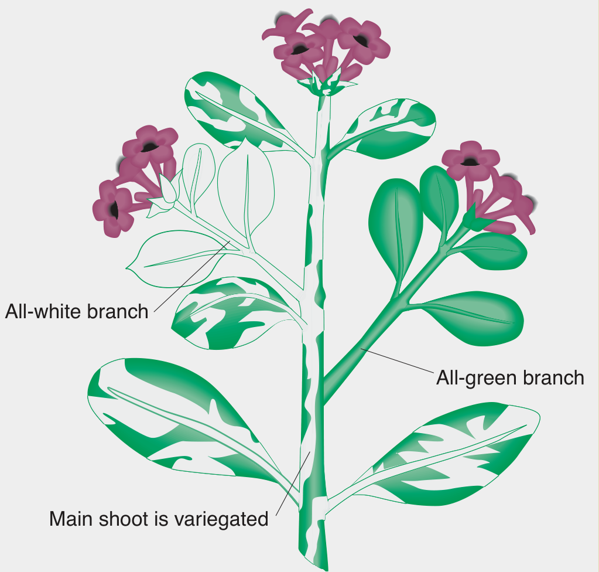

```{r,setup, include=FALSE}
library(knitr)
require(tidyverse)
set.seed(453)
# invalidate cache when the package version changes
knitr::opts_chunk$set(tidy = FALSE, echo = FALSE, 
                  message = FALSE, warning = FALSE,
                  out.width = "45%", cache = TRUE)
options(knitr.table.format = "latex")
options(knitr.kable.NA = "", digits = 2)
options(kableExtra.latex.load_packages = FALSE)
```

# Extra nuclear inheritance

##

- It is universally accepted that genes showing **Mendlian inheritance** are located in chromosomes of eukaryotic nuclei. Hence, this form of inheritance pattern is sufficient evidence for a gene to be located on chromosomes.
- Such genes are called nuclear genes.
- A distinct subset of the genome is found in the mitochondria, and, in plants, also in the chloroplasts. These subsets are inherited independently of the nuclear genome.
- While working with _Mirabilis jalapa_ Carl Correns (1908) observed that leaf color was dependent only on the genotype of the maternal parent. He determined that the trait was transmitted through a character present in the cytoplasm of the ovule. 
- Later research by Ruth Sager and others identified DNA present in chloroplasts as being responsible for the unusual inheritance pattern observed.

## Nature of organellar inheritance

- Peculiar feature of organelle genes is that they are present in large number of copies present in a cell.
- They DNA is folded within the nucleoid but does not have the type of histone-associated coiling shown by nuclear chromosomes.
- Most genes concern the chemical reactions taking place within the organelle itself: photosynthesis in chloroplasts and oxidative phosphorylation in mitochondria.

##

- According to the **endosymbiont theory**, mitochondria and chloroplasts were once free living organisms that were each taken up by a eukaryotic cell. Over time, mitochondria and chloroplasts formed a symbiotic relationship with their eukaryotic hosts. Although the transfer of a number of genes from these organelles to the nucleus prevents them from living independently, each still possesses genetic material in the form of double stranded DNA.
- It is the transmission of this organellar DNA that is responsible for the phenomenon of extranuclear inheritance. 
- Both chloroplasts and mitochondria are present in the cytoplasm of maternal gametes only. 
- Paternal gametes (sperm for example) do not have cytoplasmic mitochondria. Thus, the phenotype of traits linked to genes found in either chloroplasts or mitochondria are determined exclusively by the maternal parent.

## Cytoplasmic/extranuclear/extrachromosomal/maternal inheritance (Non mendelian inheritance)

- The sum total of all genes present in the cytoplasm of a cell or an individual is known as _plasmon_, while all the genes in a plastic constitute a _plastome_, by analogy all genes present in mitochondria constitute a _chondriome_.
- All the available evidence indicates that plasmagenes are located in DNA present in mitochrondria (mtDNA) or chloroplast (cpDNA).
- Characteristic features of this type of inheritance are:
  1. Reciprocal differences
  2. Lack of segregation
  3. Irregular separation in biparental inheritance
  4. Somatic segregation
  5. Association with organelle DNA
  6. Mutagenesis
  7. Lack of association with a parasite, symbiont or virus.

##

\begin{columns}[T,onlytextwidth]
  \column{0.6\textwidth}

```{r mirabilis-variegation, fig.cap="{\\tiny Many cases of white leaves are caused by mutations in chloroplast genes that control the production and deposition of the green pigment chlorophyll. Because chlorophyll is necessary for a plant to live, this type of mutation is lethal, and white-leaved plants cannot be obtained for experimental crosses. However, some plants are variegated, bearing both green and white patches, and these plants are viable. The four-o'clock plant shows a commonly observed variegated leaf and branch phenotype that demonstrates the inheritance of a mutant allelle of a chloroplast gene. The mutant allele causes chloroplast to be white; in turn, the color of the chloroplasts determines the color of cells and hence the color of the branches composed of those cells. Variegated branches are mosaics of all-green and all-white cells. Flowers can develop on green, white, or variegated branches, and the chloroplast genes of a flower's cells are those of the branch on which it grows.}", out.width="54%"}

```

  \column{0.4\textwidth}
  \footnotesize

```{r maize-variegation, fig.cap="Many cases of white leaves are caused by mutations in chloroplast genes that control the production and deposition of the green pigment chlorophyll.", fig.align='center', out.width="96%"}

```

\end{columns}

##

```{r variegation-cytoplasmic-inheritance, fig.cap="The results of the \\textit{Mirabilis jalapa} crosses can be explained by autonomous chloroplast inheritance. The large, dark spheres represent nuclei. The smaller bodies represent chloroplasts, either green or white. Each egg cell is assumed to contain many chloroplasts, and each pollen cell is assumed to contain no chloroplasts. The first two crosses exhibit strict maternal inheritance. If, however, the maternal branch is variegated, three types of zygotes can result, depending on whether the egg cell contains only white, only green, or both green and white chloroplasts. In the last case, the resulting zygote can produce both green and white tissue, and so a variegated plant results.", fig.align='center', out.width="46%"}
# pdftools::pdf_convert("./../../literatures/textbooks/Introduction to Genetic Analysis/Griffiths - An Introduction to Genetic Analysis 11th Edition c2015.pdf", pages = 114, format = "png", filenames = "../images/variegation_cytoplasmic_inheritance.png", dpi = 300)


# Hence, in a cross, the maternal gamete within the flower (the egg cell) determines the color of the leaves and branches of the progeny plant For example, if an egg cell is from a flower on a green branch, all the progeny will be green, regardless of the origin of the pollen. A white branch will have white chloroplasts, and the resulting progeny plants will be white. (Because of lethality, white descendants would not live beyond the seedling stage.)

# The variegated zygotes (bottom of Figure) demonstrate cytoplasmic segregation. These variegated progeny come from eggs that are cytohets. Interestingly, when such a zygote divides, the white and green chloroplasts often segregate; that is, they sort themselves into separate cells, yielding the distinct green and white sectors that cause the variegation in the branches. Here, then, is a direct demonstration of cytoplasmic segregation.
```

## \male sterility

- It is the incapacity of flowering plants to produce or release functional pollens. 
- Non functional pollen is caused by genetic or cytoplasmic factors.
- This phenomena is exploited in producing hybrids.

## Genetic \male sterility

- While CMS is controlled by an extranuclear genome, nuclear genes may have the capability to restore fertility.
- Genetic (nuclear, genic) \male sterility is widespread in plants.
  - barley, cotton, soybean, tomato, potato, and lima bean
- It is believed that nearly all diploid and polyploidy plant species have at least one \male sterility locus.
- May be manifested as pollen abortion (pistillody) or abnormal anther development.
- Genetic \male sterility is often conditioned by a single recessive nuclear gene, _ms_, the dominant allele, _Ms_, conditioning normal anther and pollen development. 
- In alfalfa, however, two independently inherited genes have been reported
- The expression of the gene may vary with the environment. But to be useful, the system must be stable

##

```{r gms-use, fig.cap="Genetic \\male sterility as used in practical breeding", fig.align='center', out.width="35%"}
# pdftools::pdf_convert("./../../references_plb/Principles of Plant Genetics and Breeding.pdf", pages = 118, format = "png", filenames = "./images/gms_use.png", dpi = 300)
knitr::include_graphics("../images/gms_use.png")
```

## Cytoplasmic \male sterility

- Sometimes, \male sterility is controlled by the cytoplasm (mitochondrial gene) but may be influenced by nuclear genes. 
- A cytoplasm without sterility genes is described as normal (N) cytoplasm, while a cytoplasm that causes \male sterility is called a sterile ( _s_) cytoplasm or said to have cytoplasmic \male sterility (CMS).
- Transmitted through the egg only (maternal factor).
- Has been found in species including corn, sorghum, sugar beet, carrot, and flax. 
- The condition has been induced in species such as sorghum by transferring nuclear chromosomes into a foreign cytoplasm. 
- Has real advantages in breeding ornamental species because all the offspring are \male sterile, hence allowing them to remain fruitless.

##

\bcolumns
\column{0.6\textwidth}

- Hybrid seed production using CMS requires three types of genotypes;   
  - \male fertile lines (called *B* line, maintainer line; here indicated by *A'*) are maintained by selfing; have no cytoplasmic \male sterility genes and are homozygous for a dominant restorer gene (i.e. normal ( _n_) cytoplasm, _RfRf_);
  - Cytoplasmic sterile \female lines with \male sterile cytoplasm but with no restorer genes (called *A* line) are maintained by crossing with isogeneic cytoplasmic \male fertile (maintainer) line;
  - R-line.

\column{0.4\textwidth}

```{r cms-use, fig.cap="Cytoplasmic \\male sterility as applied in plant breeding (n, normal cytoplasm; s, sterile cytoplasm).", fig.align='center', out.width="98%"}
# pdftools::pdf_convert("./../../references_plb/Plant Breeding, 2nd Edition (2014).pdf", pages = 76, format = "png", filenames = "./images/cms_use.png", dpi = 300)
knitr::include_graphics("../images/cms_use.png")
```

\ecolumns

##

\bcolumns
\column{0.55\textwidth}

- Cytoplasmic \male sterility may be modified by the presence of fertility-restoring genes in the nucleus. 
- CMS is rendered ineffective when the dominant allele for the fertility-restoring gene ( _Rf_) occurs, making the anthers able to produce normal pollen.
- CMS is transmitted only through the egg, but fertility can be restored by _Rf_ genes in the nucleus. 
- Progenies obtained from a cross with such a system assume restored fertility due to nuclear gene/s.

\column{0.45\textwidth}

```{r cgms-systems, fig.cap="The three systems of cytoplasmic genetic \\male sterility. The three factors involved in CMS are the normal cytoplasm (N), the \\male sterile cytoplasm (S), and the fertility restorer (Rf, rf).", fig.align='center', out.width="54%"}
# pdftools::pdf_convert("./../../references_plb/Principles of Plant Genetics and Breeding.pdf", pages = 119, format = "png", filenames = "./images/cgms_systems.png", dpi = 300)
knitr::include_graphics("../images/cgms_systems.png")
```

\ecolumns

## Features of organellar genomes

- They are circular molecules of DNA. In few exceptional case, generally in lower eukaryotes, mtDNA is linear.
- They are present in multiple copies in each organelle. In higher plants, cpDNA is present in 20-40 copies per chloroplast. Yeast cells have ~4 genomes per mitochondrion.
- They encode all the RNA species and some of the proteins required for organelle function.
- They are transcribed and translated within the organelles.
- In case of biparental inheritance, recombination does takes place between organellar genomes.
- Organelle DNA is replicated by a different DNA polymerase from that of nucleus.
- The DNA repair systems and other events that impinge on the fidelity of DNA sequences are different in organelles from those in nuclei.
- Accumulation of mutation is much faster in mtDNA than in nuclear genome in case of mammals, while in plants the reverse is the case.

## Genes in organelles

\begin{columns}[T,onlytextwidth]
  \column{0.35\textwidth}
  
  \begin{itemize}
  \footnotesize
  \item \textit{Poky} phenotype mutants in \textit{Neurospora} is caused by a mutation of a ribosomal RNA gene in mtDNA.
  \end{itemize}
  
  \column{0.65\textwidth}
  
```{r human-mitochondial-diseases, fig.cap="Map of human mtDNA shows loci of mutations leading to cytopathies", fig.align='center', out.width="62%"}
# pdftools::pdf_convert("./../../literatures/textbooks/Introduction to Genetic Analysis/Griffiths - An Introduction to Genetic Analysis 11th Edition c2015.pdf", pages = 142, format = "png", filenames = "../images/human_mitochondrial_genome_map.png", dpi = 300)

```

\end{columns}

## Maternal effects

- The development of some characters in several organisms is either goverened or markedly influenced by the genotype of the \female parent; this is known as **maternal effect**.
- Such characters are governed by **nuclear genes**. But due to the maternal effect, they show the following features:
  1. Reciprocal differences in $F_1$
  2. Which, in most cases, disappear in $F_2$
  3. Considerably smaller variation in $F_2$ as compared to that in $F_3$.
- Examples of maternal inheritance:
  1. Coiling in Limnaea: The direction of shell coiling in an individual is governed by the genotype of its \female parent and not by its own genotype. As a result, reciprocal crosses show differences in coiling in $F_1$ and there is no phenotypic segrgation in $F_2$. The phenotypic effect of segregation is observable in $F_3$ only.
  2. Some economically important traits as seed size, protein content in seeds, plant height, etc. show marked difference for $F_1$ progeny from reciprocal crosses.

##

\small
\begin{columns}[T,onlytextwidth]
  \column{0.5\textwidth}
  \footnotesize

$$
\begin{aligned}
& & DD (\text{Dextral } \female) & \times dd (\text{Sinistral } \male) &\\
& & & \downarrow & \\
& \mathrm{F_1} & & Dd (\text{Dextral}) & \\
& & & \downarrow & \\
& & Dd &\times Dd & \\
& & & \downarrow & \\
& \mathrm{F_2} & & 1 DD \hspace{1cm} & (\text{Dextral}) \\
& & & 2 Dd \hspace{1cm} & (\text{Dextral}) \\
& & & 1 dd \hspace{1cm} & (\text{Dextral}) \\
& \mathrm{F_3} 
& & DD \hspace{1cm} & (\text{Dextral}) \\
& & & 1 DD \hspace{1cm} & (\text{Dextral}) \\
& & & 2 Dd \hspace{1cm} & (\text{Dextral}) \\
& & & 1 dd \hspace{1cm} & (\text{Dextral}) \\
& & & dd \hspace{1cm} & (\text{Sinistral})
\end{aligned}
$$
  \column{0.5\textwidth}
  \footnotesize

$$
\begin{aligned}
& & dd (\text{Sinistral } \female) & \times DD (\text{Dextral } \male) &\\
& & & \downarrow & \\
& \mathrm{F_1} & & Dd (\text{Sinistral}) & \\
& & & \downarrow & \\
& & Dd &\times Dd &
\end{aligned}
$$

\end{columns}

- What differences are seen in reciprocal cross ?

##

- All embryos develop inside maternal tissue
- Some maternal genes affect embryo development
- Maternal effects can be genetic or environmental
- Can result from expression of genes in maternal tissue
- Can result from inheritance of maternal cytoplasm (and organelles)
- Can result from maternal environment (not genetic)

# Bibliography

## See also

- Refer to Chapter 5 on "The influence of mitochondrial genetics on crop breeding strategies", Plant Breeding Reviews, Volume 25.
- Volume 2, Advances in Genetics by Ernst Caspari.

## References