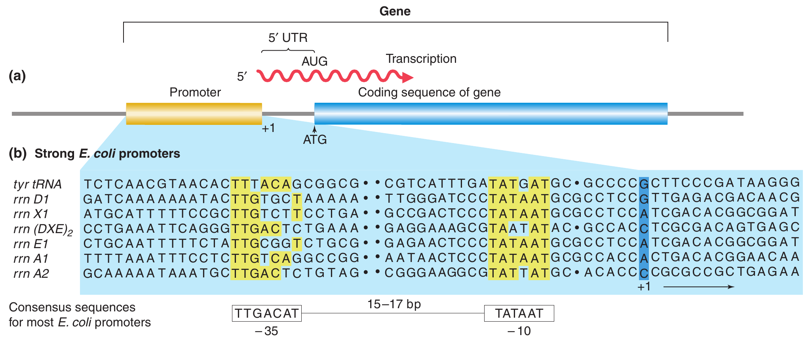
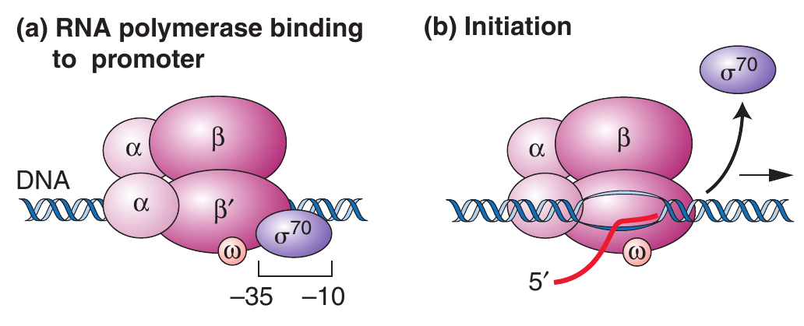

```{r,setup, include=FALSE}
library(knitr)
require(tidyverse)
set.seed(453)
# invalidate cache when the package version changes
knitr::opts_chunk$set(tidy = FALSE, echo = FALSE, 
                  message = FALSE, warning = FALSE,
                  out.width = "45%", cache = TRUE)
options(knitr.table.format = "latex")
options(knitr.kable.NA = "", digits = 2)
options(kableExtra.latex.load_packages = FALSE)
```

# Structure of DNA

##

- DNA is the universal, hereditary material (except in certain viruses – RNA viruses).
- The structure of the DNA molecule is a double helix (Figure \ref{fig:double-helix}). 
- The key features about the DNA molecule are:
  - It consists of two polynucleotide chains coiled around a central axis in a spiral fashion. The most common natural form of DNA is a right-handed double helix of diameter 2.0 nm, called the B-DNA. A left-handed form (Z-DNA) and an A-form of DNA also occur under certain conditions.
  - The polynucleotide chains are antiparallel; one chain runs in the $5^\prime$ to $3^\prime$ orientation and the other $3^\prime$ to $5^\prime$ (carbon atoms of a sugar are conventionally numbered from the end closest to the aldehyde or ketone).
  - The two bases in each base pair lie in the same plane. Each plane is perpendicular to the axis of the helix. There are 10 base pairs per helical turn.
  - The helix has two kinds of alternating external grooves; a deep groove (called the major groove) and a shallow groove (called the minor groove). 
  - The nitrogenous bases on one strand pair with those on the other strand in complementary fashion (A always pairs with T, while G pairs with C).

##

```{r angstorm, fig.align='center', out.width="70%"}

```


##

```{r double-helix, out.width="65%", fig.cap="The Watson-Crick model of the DNA double helix (B-form)"}
# pdftools::pdf_convert("../../literatures/textbooks/Introduction to Genetic Analysis/Griffiths - An Introduction to Genetic Analysis 11th Edition c2015.pdf",
#                       pages = 295,
#                       dpi = 300, format = "png",
#                       filenames = "../images/double_helix_dna.png")

knitr::include_graphics("../images/double_helix_dna.png")
```

##

```{r base-pairing, out.width="65%", fig.cap="Specific base pairing by the formation of hydrogen bonds between two antiparallel DNA strands. The molecular structure of the bases only allows the pairings AT and GC. An AT pair forms two hydrogen bonds; a GC pair forms three hydrogen bonds"}
# pdftools::pdf_convert("../../literatures/Plant Science Straussberger.pdf",
#                       pages = 31,
#                       dpi = 300, format = "png",
#                       filenames = "../images/complementary_base_pairing.png")


```

<!-- Guiding Principle of Practice -->
<!-- Bruce Lipton, a professor of genetics, speaker and author of the book The Biology of Belief, once asked: "What is the difference between your doctor and an airplane pilot ?" Before delivering the punch line, he pointed out that a pilot, by law, has to go through a large checklist of items before he can taxi the plane away from the airport terminal. Your doctor likewise is expected to go over a standard list of questions and procedures when you come to see her, but since she had only about 10 minutes allocated to your visit, there isn't time to actually do the full job. What's the real difference between doctor and the pilot ? "The pilot is on the plane with you!" -->
<!-- You can't fly a plane unless you are ON it! But a doctor can just prescribe and get away. Be a pilot not a doctor. -->

##

```{r genome-organization, out.width="58%", fig.align='center'}


```

##

- In addition to these features, nature of code has following characteristics:
  - Complementary base pairing means that the replicate of each strand is given the base sequence of its complementary strand when DNA replicates. 
  - Because the strands are **antiparallel**, when two nucleotides are paired the sugar portions of these molecules lie in opposite directions (one upward and the other downward along the chain).
  - Because the strands are antiparallel, the convention for writing the sequence of bases in a strand is to start from the $\mathrm{5^{\prime}-P}$ terminus at the left (e.g., GAC refers to a trinucleotide $\mathrm{5^\prime-P^{\prime}-GAC-3^\prime-OH}$).
  - The conventional way of expressing the base composition of an organism is by the percentage of $\text{[G] + [C]}$. This value is approximately 50% for most eukaryotes with only minor variations among species. In simpler organisms, there are significant variations (e.g., 27% for _Clostridium_, 50% for _E. coli_, and 76% for _Sarcina_, all of these organisms being bacteria).
  - The chains of the double helix are held together by hydrogen bonds between base pairs in opposite strands. The bond between A and T is a double bond, while the bond between G and C is a triple hydrogen bond.

## Helix is right handed !
  
```{r right-handed-helix, fig.align='center', out.width="60%"}

```


##

\begin{figure}
  \begin{columns}[T,onlytextwidth]

  \column{.36\linewidth}
  \begin{center}
  \includegraphics[width=0.96\linewidth]{../images/nucleotide_blocks1.png}
  \end{center}
  
  \column{.36\linewidth}
  \begin{center}
  \includegraphics[width=0.95\linewidth]{../images/nucleotide_blocks.png}
  \end{center}
  
  \column{.28\linewidth}
  \caption{\newline Nucleotides are made up of three building blocks: a pyrimidine or purine base, a pentose, and phosphoric acid. The base is bonded to the pentose by an N-$\beta$-glycoside, either via N1 of the pyrimidine or via N9 of the purine. The phosphoric acid forms an ester with the primary alcohol group of the pentose. Up to two further phosphoric acid groups can be attached by anhydride bonds to the a phosphoric acid group. The glycoside made up of a base and a ribose is called a nucleoside, and that made up of a base and 2-deoxyribose is called a deoxynucleoside. Nucleotides can be nucleoside monophosphates, diphosphates, or triphosphates, as shown in the example using adenosine and its nucleotides. Deoxynucleotides are thus deoxynucleoside monophosphates, diphosphates, or triphosphates. The sugar in ribonucleic acid (RNA) is ribose, and in deoxyribonucleic acid (DNA) it is 2-deoxyribose. The carbon atoms of the sugar are indicated in the nucleosides and nucleotides (1, 2, 5,...). C1 forms the glycosidic bond. To simplify the chemical skeletal formula, the hydrogens attached to carbons are often omitted in complex formulas (e.g., rings).}
  \label{fig:nucleotide-blocks}
  
  \end{columns}
\end{figure}

<!-- ```{r} -->
<!-- pdftools::pdf_convert("../../literatures/Plant Science Straussberger.pdf", -->
<!--                       pages = 29, -->
<!--                       dpi = 300, format = "png", -->
<!--                       filenames = "../images/nucleotide_blocks.png") -->
<!-- ``` -->

# Replication of DNA

## 

- The DNA double helix strands are so arranged in positive-negative relationship that identical duplication or replication of heriditary information is possible.
- Two strands separate and a base-complementary partner strand is newly formed with each strand. This mode of duplication is called semi-conservative mode.

```{r dna-replication-mode, out.width="56%", fig.align='center'}
# pdftools::pdf_convert("../../literatures/Plant Science Straussberger.pdf",
#                       pages = 32,
#                       dpi = 300, format = "png",
#                       filenames = "../images/semi_conservative_replication.png")


```

## Steps in replication

- Unwinding of DNA double helix by **hellicase**
- Prevention of knotting by relaxation enzymes (**DNA gyrase**, a member of the family **DNA topoisomerase I**)
- Two strands of a replication fork (one $3^{\prime}$ and the other $5^{\prime}$) need to be extended by different mechanisms because DNA polymerases can only extend the chain at former orientation. Only $3^\prime$ end is continually extended.
- Ligases are able to link $3^\prime$ ends with $5^\prime$ ends. Without these lagging strand sequences cannot be bonded and can be isolated as **Okazaki fragments**.
- DNA polymerase III (primary enzyme that carries out chain elongation) require a **primer** (RNA sequences) in order to start synthesis. These primers supply the $3^\prime$ end on which the DNA polymerase can build further.
- A sequence region replicated by a replicator is called a **replicon**.

<!-- As unwinding proceeds, a coiling tension is created ahead of the replication fork, often producing supercoiling. Such supercoiling can be relaxed by DNA gyrase. -->

<!-- The discovery of polA1 mutation made it clear that DNA polymerase I is not, in fact, the primary enzyme responsible for DNA replication. -->

##

\bcolumns
\column{0.55\textwidth}

```{r dna-replication-process, out.width="76%", fig.align='center', fig.cap="The replication fork"}
# pdftools::pdf_convert("../../literatures/textbooks/Introduction to Genetic Analysis/Griffiths - An Introduction to Genetic Analysis 10th Edition.pdf",
#                       pages = 295,
#                       dpi = 300, format = "png",
#                       filenames = "../images/dna_replication_process.png")


# DNA Pol-I (in E. coli) has been shown to consist of a single polypeptide containing 928 amino acids.

# note that although the DNA Pol-III is shown in the lagging strand
# it is not the primary enzyme carrying out elongation; DNA Pol-I is.
# DNA Pol-III only repairs the excision gaps.

# DNA Pol-III also has exonuclease activity -- they have the potential to polymerize in one direction and then pause, reverse their direction, and excise nucleotides just added.

# Eukaryotic chromosomes contain multiple replication origins. Yeast genomes contain between 250 and 400 origins, and mammalian genomes have as many as 25,000.
# Origins in yeast, called autonomously replicating sequences (ARSs), consist of approximately 120 base pairs containing a consensus sequence (meaning a sequence that is the same, or nearly the same, in all yeast ARSs) of 11 base pairs.

# Replication model of eukaryotic chromosome forming sister chromatids follows Holliday structure
# Refer to Page 257 of Concepts of Genetics, 12th Edition (2019)
```

\column{0.45\textwidth}

```{r dna-pol-holoenzyme, fig.cap="The active form of DNA Pol III, referred to as the holoenzyme, is made up of unique polypeptide subunits. Figure shows ten of those whose features have been identified is given.", out.width="90%"}
knitr::include_graphics("../images/DNA-pol-III-holoenzyme.png")
```

\ecolumns

## Direction matters !

<!-- It matters which strand is being copied! Because replication proceeds only in a single direction. -->

\bcolumns
\column{0.6\textwidth}

\includegraphics<1->[width=0.44\linewidth]{../images/back_direction} 

\column{0.4\textwidth}

\includegraphics<2->[width=0.9\linewidth]{../images/front_direction}

\ecolumns

# Structure of RNA

## Background

- Ribonucleic acid (RNA) is similar in structure to DNA, key differences being:
  - RNA consists of ribose sugar (in place of deoxyribose) and uracil in place of thymine.
  - Most RNA is predominantly single stranded (except in some viruses). Sometimes, the molecule folds back on itself to form double-stranded regions. Certain animal and plant viruses use RNA as their genetic material.
  - A typical cell contains about ten times more RNA than DNA.
  - While DNA **stores** genetic information, RNA is the first molecule having function of the **expression** of the genetic information.
  - There are three major classes of RNA known to be involved in gene expression: ribosomal RNA (rRNA), messenger RNA (mRNA), and transfer RNA (tRNA). The site of protein synthesis, the ribosome, contains rRNA.

## mRNA

- Messenger RNA (mRNA) is the molecular carrier of genetic information from the DNA to ribosomes, where this DNA transcript or template is translated (the genetic information of DNA transcript is expressed) into proteins. 
- Because genes vary in size (number of nucleotides) the mRNA species are variable in length. 
- Eukaryotic RNA is transcribed as a primary transcript, a cap is added at the $5^\prime$ end, a poly(A) tail is added, and the introns are removed. 
- The mRNA is then transported from the nucleus to the endoplasmic reticulum for translation by ribosomes.

##

```{r mrna-processed, out.width="70%", fig.cap="Detailed structure of a processed eukaryotic mRNA. The cap structure is followed by $5^\\prime$ UTR, the protein encoding exongs, $3^\\prime$ UTR, and a poly(A) tail."}
# pdftools::pdf_convert("../../literatures/biotechnology/Biotechnology 2nd ed - David P. Clark, Nanette J. Pazdernik (AP, 2016).pdf",
#                       pages = 58,
#                       dpi = 300, format = "png",
#                       filenames = "../images/mrna_processed.png")

knitr::include_graphics("../images/mrna_processed.png")
```

## tRNA

- The structure of transfer RNA (tRNA) is very unique among the three key RNA molecules in the cell. 
- These molecules are small in size and very stable (range in size from 75–90 nucleotides). 
- A single-stranded tRNA molecule is able to fold back onto itself and undergo complementary base pairing in short stretches to form double strands. 
- This folding also creates four characteristic loops and a cloverleaf 2-D structure (Figure \ref{fig:ribonucleic-acids}).
  - Three loops are involved in translating the message of the mRNA. 
  - The anticodon loop (or simply anticodon) consists of a sequence of three bases that are complementary to the sequence of a codon on the mRNA.

##

- The stop codons do not have tRNA with anticodons for them. 
- Another feature of the tRNA molecule is the occurrence of the sequence pCpCpA- $3^\prime$ at the $3^\prime$ end. 
- The terminal adenine residue is the point of attachment for an amino acid and hence is called the amino acid attachment (or binding) site. 
- During protein synthesis, the amino acid corresponding to a particular mRNA codon that base pairs with the tRNA anticodon is attached to this terminal and transported to the appropriate segment of the mRNA.

##

- Ribosomes are the sites ("factories") of polypeptide synthesis (or protein synthesis).
- A bacterial cell may contain about 1000 ribosomes. 
- A ribosome consists of two subunits, which together form the monosome. The ribosomal particles are classified according to their sedimentation coefficient or rate (S). 
- Monosomes of bacteria are 70S (70S ribosomes) whereas eukaryotic monosomes are about 80S. 
- Because sedimentation coefficients are not additive, a 70S monosome in actuality comprises two subunits that are 50S and 30S, while an 80S monosome consists of 60S and 40S subunits. 
- A ribosome subunit consists of molecules of rRNA and proteins. 
- For example, the 50S subunit contains one 55 rRNA, one 235 rRNA molecule, and 32 different ribosomal proteins.

##

<!-- ```{r} -->
<!-- # pdftools::pdf_convert("../../literatures/Plant Science Straussberger.pdf", -->
<!-- #                       pages = 34, -->
<!-- #                       dpi = 300, format = "png", -->
<!-- #                       filenames = "../images/ribonucleic_acids.png") -->
<!-- ``` -->

\begin{figure}
  \begin{columns}[T,onlytextwidth]

  \column{.65\linewidth}
  
  \begin{columns}[T,onlytextwidth]
  \column{.55\linewidth}  
  \begin{center}
  \includegraphics[width=0.95\linewidth]{../images/ribonucleic_acids_trna.png}
  \end{center}
  
  \column{.45\linewidth}
  \begin{center}
  \includegraphics[width=0.95\linewidth]{../images/ribonucleic_acids_types.png}
  \end{center}
  \end{columns}
  
  \begin{center}
  \includegraphics[width=0.95\linewidth]{../images/ribonucleic_acids_viral_molecule.png}
  \end{center}

  \column{.35\linewidth}
  \caption{\newline Ribonucleic acids. (a) 'Clover-leaf' structure of a transfer RNA (tRNA) molecule with the tyrosine-bearing tRNA ($tRNA^{Tyr}$) of yeast. The structure is stabilized by regions inside the single-stranded molecule that can swap base pairs; there are adjacent unpaired regions. Numerous bases of tRNAs (outlined in red) are modified; some important examples of modified bases are shown in (b). Adjacent there are methylated bases ($Me$). A base triplet, the anticodon, pairs with a complementary base triplet on the mRNA. The codon–anticodon sequence of triplets on the mRNA specifies the order of the amino acids in a protein. The D arm is named after the increased frequency of dihydrouracil ($UH_2$), and the TCC arm is named after the ubiquitous base sequence $5^{\prime} - T - \Psi - C - 3^{\prime}$. The V loop differs in size in different tRNAs. The amino acid acceptor arm and the anticodon arm are important for the recognition of the right tRNAs and their amino acids by the aminoacyl-tRNA-synthetases. The anticodon arm 'presents' the anticodon simultaneously with the mRNA codon so that base pairing can occur on the ribosome. The $\mathrm{T\Psi C}$ arm and the D arm are probably especially significant for the bonding of the tRNA to the ribosome. (c) Example of a ring-shaped closed RNA molecule. The potato spindle tuber viroid consists of a covalently closed ring of 359 nucleotides. The structure is stabilized by intramolecular base pairs, represented here as simple lines (for clarity)}
  \label{fig:ribonucleic-acids}

  \end{columns}
\end{figure}

##

- The genetic information of the DNA is changed into biological material principally through proteins, according to the central dogma of molecular biology.
- The dogma states that genetic information flow is generally unidirectional from DNA to proteins, except in special cases. 
- This flow, mediated by transcription (copying of the DNA template by synthesizing the RNA molecule) and translation (synthesis of a polypeptide using the genetic information encoded in an mRNA molecule) and preceded by replication (the process of DNA synthesis), can now be reversed in vitro (in the test tube) by scientists.
- Thus, once a protein is known, the nucleotide sequence in the prescribing DNA strand can be determined and synthesized (the product is called a complementary DNA or cDNA). Production of cDNA is a technique used in genetic engineering.

##

```{r central-dogma-biology, fig.cap="The central dogma of molecular genetics, showing information flow involving DNA, RNA and proteins within a cell."}
# pdftools::pdf_convert("../../literatures/plant_breeding/Principles of Plant Genetics and Breeding.pdf",
#                       pages = 702,
#                       dpi = 300, format = "png",
#                       filenames = "../images/central_dogma_biology.png")


```

##

```{r diamonds-dont-shine, fig.align='center'}
# DNA or a gene, like diamond, don't create the phenotype
# It merely projects/reflects the information into an RNA and eventually into a protein, the latter gives the shine (phenotype).
knitr::include_graphics("../images/diamonds_dont_shine.jpg")
```

# Expression of genetic information

## Genetic code

- A key question in genetics is how the information of the DNA is interpreted to produce protein.
- The sequence of bases in the polynucleotide chain holds the key to DNA function because it represents the genetic code (the set of rules giving the correspondence between mRNA and amino acids in a protein) for the synthesis of corresponding amino acids that constitute proteins.
- DNA does not code for adult traits directly, there being no genes for adult traits as such. Instead, genes code for various developmental processes. 
- The variety of protein products in a cell undertake catalytic and structural activities that eventually result in an adult phenotype.

##

- There are about twenty commonly occurring amino acids (Figure \ref{fig:amino-acids}). 
- According to the prescribed sequence (based on the genetic code), amino acids are joined together by **peptide bonds** to form polypeptide chains (Figure \ref{fig:polypeptides-amino}). 
- The genetic code is a **triplet code**. Such a trinucleotide sequence is called a codon (Figure \ref{fig:universality}).
- Three adjacent bases form a code for an amino acid. 
- The genetic code is read from a fixed starting point of the DNA strand.
- The genetic code is said to be degenerate because nearly all amino acids are specified by at least two codons. 

##

```{r universality, fig.cap="The genetic code is universal for all life forms", out.width="45%"}


```

##

```{r amino-acids, fig.align='center', out.width="58%", fig.cap="Amino acids are the basic building blocks of proteins. Each amino acid is specified by a single (may not be unique) codon at the time of translation."}

```


##

- Some (serine, arginine, leucine) are encoded by six different codons. 
- Only tryptophan and methionine are encoded by single codons.
- Further, for a set of codons encoding the same amino acid, the first two letters in the figure is the same, with only the third being different (called the **wobble hypothesis**).
- Consequently, at least 30 different tRNA species are required to account for the 61 different triplets in the coding dictionary in just 17 (the three remaining triplets include termination codons or signals – UAG, UAA, UGA).

<!-- Refer to https://www.youtube.com/watch?v=bSjIDStlZg8, "Origins of the RNA-Protein World – Lost in Translation?, John Sutherland, Cambridge" to have a deeper understanding of following sections. Media file is also contained within the repository's media directory. -->

## Transcription: RNA synthesis

- The genetic information of the DNA template is copied by the process of transcription (or RNA synthesis) to produce an RNA sequence (mRNA).
- The transactions of DNA and RNA take place through the matching of complementary bases and the binding of various proteins to specific sites on the DNA or RNA.
- The DNA strand that is transcribed is called the **template strand**. 
- The process starts with a recognition of a special DNA sequence (called a promoter) and binding to it by an enzyme, a process called **template binding**. 
- **RNA polymerase II** carries out the transcription in eukaryotes.
- Transcription factors control its activity.
- The RNA chain then grows (chain elongation) in the $3^\prime$ direction (Starting at $5^\prime$).

##

- Binding and activity of RNA polymerase II are controlled by cis-regulatory regions and by trans-acting regulatory factors (transcription factors).
- **General transcription factors** (GTFs) are necessary for RNAP II to transcribe DNA, and **Specific TFs** affect the efficiency or rate of RNAP II transcription.
- Promotor region is located at a gene's $5^\prime$ end (using the coding strand as a reference) -- upstream from transcription start site or the **ORF**.
- Promoter is composed of core promoter and proximal promotor elements, that define when and where a gene is transcribed.
- Nucleotide sequences are numerically designated based on transcription initiation site as reference point ("+" ve and "-" ve, former referring to downstream sequences, and latter to the upstream sequences)

##

```{r gene-transcription, out.width="72%", fig.cap="(a) The promoter lies 'upstream' (toward the $5^\\prime$ end) of the initiation point and coding sequences. (b) Promoters have regions of similar sequences, as indicated by the yellow shading in seven different promoter sequences in \\textit{E. coli}. Spaces (dots) are inserted in the sequences to optimize the alignment of the common sequences. Numbers refer to the number of bases before (-) or after (+) the RNA synthesis initiation point. The consensus sequence for most E. coli promoters is at the bottom."}
# pdftools::pdf_convert("../../literatures/textbooks/Introduction to Genetic Analysis/Griffiths - An Introduction to Genetic Analysis 11th Edition c2015.pdf",
#                       pages = 325,
#                       dpi = 300, format = "png",
#                       filenames = "../images/gene_transcription.png")


```

##

- An RNA polymerase holoenzyme binds to the DNA at **consensus sequence**, then unwinds the DNA double helix and begins the synthesis of an RNA molecule.
- RNA polymerase holoenzyme is a multisubunit complex is composed of the five subunits of the core enzyme (two subunits of $a$, one of $\beta$, one of $\beta^\prime$, and one of $\omega$) + a subunit called sigma ($\sigma$) factor.
- Although ATG (AUG in the mRNA) sequence is the initiation codon translated as protein, mRNA sequence consists of portion of the genes starting from +1 site, which are well upstream of the AUG sequence.
- The intervening part is referred to as $5^\prime$ untranslated (UTR) region. Similarly occurs a sequence to the $3^\prime$ region of the transcribed RNA, called $3^\prime$ UTR region.
- As the RNA polymerase moves along the DNA, it unwinds the DNA ahead of it and rewinds the DNA that has already been transcribed. In this way, it maintains a region of single-stranded DNA, called a **transcription bubble**.

##

\begin{columns}[T,onlytextwidth]

  \column{.5\linewidth}

```{r gene-transcription-prokaryotes1, out.width="80%", fig.cap="(a-b) In transcription initiation, $\\sigma$ subunit positions prokaryotic RNA polymerase for transcription initiation"}
# pdftools::pdf_convert("../../literatures/textbooks/Introduction to Genetic Analysis/Griffiths - An Introduction to Genetic Analysis 11th Edition c2015.pdf",
#                       pages = 326,
#                       dpi = 300, format = "png",
#                       filenames = "../images/gene_transcription_prokaryotes.png")


```

  \column{.5\linewidth}
  
```{r gene-transcription-prokaryotes2, out.width="75%", fig.cap="(a) Elongation: Synthesis of an RNA strand complementary to the single-strand region of the DNA template strand. DNA that is unwound ahead of RNA polymerase is rewound after it has been transcribed."}
# pdftools::pdf_convert("../../literatures/textbooks/Introduction to Genetic Analysis/Griffiths - An Introduction to Genetic Analysis 11th Edition c2015.pdf",
#                       pages = 326,
#                       dpi = 300, format = "png",
#                       filenames = "../images/gene_transcription_prokaryotes.png")


```


```{r gene-transcription-prokaryotes3, out.width="75%", fig.cap="(b) Termination: The intrinsic mechanism shown here is one of two ways used to end RNA synthesis and release the completed RNA transcript and RNA polymerase from the DNA."}
# pdftools::pdf_convert("../../literatures/textbooks/Introduction to Genetic Analysis/Griffiths - An Introduction to Genetic Analysis 11th Edition c2015.pdf",
#                       pages = 326,
#                       dpi = 300, format = "png",
#                       filenames = "../images/gene_transcription_prokaryotes.png")

```

\end{columns}

##

- The first product of transcription in eukaryotes is called a **pre-mRNA**, part of a group of molecules called heterogeneous nuclear DNA (hmRNA).
- This molecule undergoes severe alterations to remove non-coding parts (**introns**) of the sequence, leaving the coding parts (**exons**) to produce the mRNA, which is typically about 25% of the original length of the pre-mRNA. 
- After removing the introns, the splicing or linking of the pieces results in different types of mRNA (called **alternative splicing**). Consequently, different kinds of proteins may be encoded by the same gene (Figure \ref{fig:mrna-alternative-splicing}). 
- The mRNA is transported to the ribosomes.

##

```{r mrna-alternative-splicing, out.width="65%", fig.cap="The pre-mRNA transcript of the rat $\\alpha$-tropomyosin gene is alternatively spliced in different cell types. The light green boxes represent introns; the other colors represent exons. Polyadenylation signals are indicated by an A. Dashed lines in the mature mRNAs indicate regions that have been removed by splicing."}
# pdftools::pdf_convert("../../literatures/textbooks/Introduction to Genetic Analysis/Griffiths - An Introduction to Genetic Analysis 11th Edition c2015.pdf",
#                       pages = 332,
#                       dpi = 300, format = "png",
#                       filenames = "../images/alternative_splicing.png")


```


<!-- Refer to https://www.youtube.com/watch?v=2Jgb_DpaQhM, "Proteins" to have a better understanding of the section following. Media file is also contained within the repository's media directory. -->

## Translation: protein synthesis

- Protein synthesis consists of three steps-initiation, elongation, and termination. 
- Translation starts with the formation of an initiation complex that includes initiation factors that bind to the small rRNA subunit and then to the mRNA. 
- The next step is to set the reading frame for accurate translation. 
- The AUG triplet is usually the initiation point. 
- The large subunit binds to the complex. The sequence of the next triplet determines what charged tRNA (has an amino acid attached) will be attached. 
- The process is repeated until the whole mRNA is translated, adjacent amino acids being linked by peptide bonds. 

##

- The termination of translation occurs when the elongation process encounters a stop codon or termination codon. 
- The interval between the start and stop codons that encodes an amino acid for insertion into a polypeptide chain is called the open reading frame (ORF).
- Each gene codes for one polypeptide. Some proteins comprise more than one polypeptide (have multiple subunits).
- All genes do not code for proteins and, further, all genes in a cell are not actively transcribing mRNA all of the time. Also, most enzymes are proteins, but all proteins are not enzymes.

##

```{r polypeptides-amino, out.width="45%", fig.cap="(a) The basic structure of an amino acid consists of three units - an amino group, a carboxyl group, and a side chain (R) that distinguishes among the different amino acids. (b) A polypeptide chain is formed by linking many amino acids together; adjacent amino acids are linked by a peptide bond."}
# pdftools::pdf_convert("../../literatures/plant_breeding/Principles of Plant Genetics and Breeding.pdf",
#                       pages = 703,
#                       dpi = 300, format = "png",
#                       filenames = "../images/polypeptides_amino_acid.png")

knitr::include_graphics("../images/polypeptides_amino_acid.png")
```

##

<!-- # pdftools::pdf_convert("../../literatures/biotechnology/Biotechnology 2nd ed - David P. Clark, Nanette J. Pazdernik (AP, 2016).pdf", -->
<!-- #                       pages = 62, -->
<!-- #                       dpi = 300, format = "png", -->
<!-- #                       filenames = "../images/translation_prokaryotes.png") -->

<!-- The Shine–Dalgarno (SD) sequence is a ribosomal binding site in bacterial and archaeal messenger RNA, generally located around 8 bases upstream of the start codon AUG. -->

\begin{figure}
  \begin{columns}[T,onlytextwidth]
  \column{.35\linewidth}
  \begin{center}
  \includegraphics[width=0.80\linewidth]{../images/translation_prokaryotes_init.png}
  \end{center}
  \column{.3\linewidth}
  \begin{center}
  \includegraphics[width=0.96\linewidth]{../images/translation_prokaryotes_elongation.png}
  \end{center}
  \column{.35\linewidth}
  \begin{center}
  \includegraphics[width=0.62\linewidth]{../images/translation_prokaryotes_termination.png}
  \end{center}
  \end{columns}
  \caption{(A) \textbf{Initiation}. Initiation of translation begins with the association of the small ribosome subunit with the Shine–Dalgarno sequence (S-D sequence) on the mRNA. Next, initiation factors IF1, IF2, and IF3 (not shown) charge or connect the initiator tRNA with fMet. The charged initiator tRNA ($tRNA^{ifMet}$) associates with the small ribosome subunit and finds the start codon. Finally, the large ribosomal subunit joins the small subunit and situates the initiator tRNA at the P site. (B) \textbf{Elongation}. During elongation, peptide bonds are formed between the amino acids at the A-site and the P-site. The movement of the ribosome along the mRNA and addition of a new tRNA to the A-site are controlled by elongation factors (also not shown). (C) \textbf{Termination}. Termination requires release factors. The various components dissociate. The completed protein folds into its proper three-dimensional shape.}
  \label{fig:translation-prokaryotes}
\end{figure}

# Bibliography

## Also see

## References
