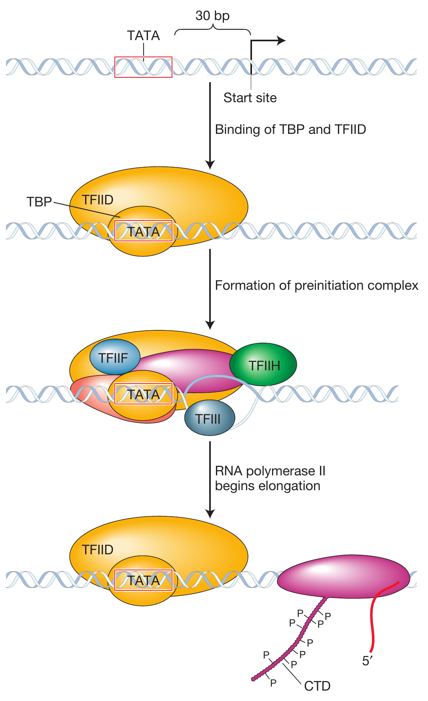

```{r,setup, include=FALSE}
library(knitr)
require(tidyverse)
set.seed(453)
# invalidate cache when the package version changes
knitr::opts_chunk$set(tidy = FALSE, echo = FALSE, 
                  message = FALSE, warning = FALSE,
                  out.width = "45%", cache = TRUE)
options(knitr.table.format = "latex")
options(knitr.kable.NA = "", digits = 2)
options(kableExtra.latex.load_packages = FALSE)
```

# Introduction

##

- Gene action/gene expression, in classical sense refers to the production of the concerned trait or phenotype by a gene.
- The expression of gene may be assayed in terms of RNA production, protein/enzyme activity or the specific phenotype produced.
- Gene regulation is a critical activity for cellular adaptation, variation, differentiation, growth and development. 
- It is not enough for a gene to only be expressed but its expression must be regulated such that it is expressed at the right time only and to the desired extent. 
- Regulation entails the "turning on" and "turning off" of genes. 
- Some genes are turned on all the time (called **constitutive expression**), while others are turned on only some of the time (called **differential expression**).

## Regulation of transcription

- It was discovered around 1890 that yeast cells that were cultured in a medium containing lactose began lactose fermentation immediately.
- Likewise, bacteria have evolved regulatory systems that couple the expression of gene products to sensor systems that detect the relevant compound in a bacterium's local environment.
- The cell has devised mechanisms to shut down (repress) the transcription of all genes encoding enzymes that are not needed at a given time and to turn on (activate) those genes encoding enzymes that are needed.

##

- Regulation of transcription depends mainly on two types of protein–DNA interactions (near the site where transcription begins)
  1. One interaction determines where transcription begins.
    - The DNA that participates in this interaction is a DNA segment called the promoter, and the protein that binds to this site is RNA polymerase. 
    - When RNA polymerase binds to the promoter DNA, transcription can start a few bases away from the promoter site. 
    - Every gene must have a promoter or it cannot be transcribed.
  2. Other interaction determines whether promoter-driven transcription takes place
    - DNA segments near the promoter serve as binding sites for sequence-specific regulatory proteins called **activators** and **repressors**. 
    - In bacteria, most binding sites for repressors are termed **operators**. 
    - For some genes, an activator protein must bind to its target DNA site as a necessary prerequisite for transcription to begin. Such instances are sometimes referred to as **positive regulation** because the presence of the bound protein is required for transcription
    - For other genes, a repressor protein must be prevented from binding to its target site as a necessary prerequisite for transcription to begin (**negative regulation**).

##

- Often, a DNA-bound activator protein physically helps tether RNA polymerase to its nearby promoter so that polymerase may begin transcribing (Figure \ref{fig:gene-regulation-states}). 
- A DNA-bound repressor protein typically acts either by physically interfering with the binding of RNA polymerase to its promoter (blocking transcription initiation) or by impeding the movement of RNA polymerase along the DNA chain (blocking transcription) (Figure \ref{fig:gene-regulation-states})
- Together, these regulatory proteins and their binding sites constitute genetic switches that control the efficient changes in gene expression that occur in response to environmental conditions.

##

```{r gene-regulation-states, out.width="85%", fig.cap="The binding of regulatory proteins can either activate or block transcription"}
# pdftools::pdf_convert("../../literatures/textbooks/Introduction to Genetic Analysis/Griffiths - An Introduction to Genetic Analysis 11th Edition c2015.pdf",
#                       pages = 427,
#                       dpi = 300, format = "png",
#                       filenames = "../images/gene_regulation_states_up_down.png")


```

##

- Both activator and repressor proteins must be able to recognize when environmental conditions are appropriate for their actions and act accordingly.
- For activator or repressor proteins to do their job, each must be able to exist in two states:
  - one that can bind its DNA targets, and 
  - another that cannot
- For many regulatory proteins, DNA binding is effected through the interaction of two different sites in the three-dimensional structure of the protein. 
  - One site is the DNA-binding domain 
  - The other site, the **allosteric site**, acts as a sensor that sets the DNA-binding domain in one of two modes: functional or nonfunctional
- The allosteric site interacts with small molecules called allosteric effectors.

# Gene regulation in Prokaryotes

## Background

- The expression of a gene may be subject to regulation at one or more of the following levels:
  1. gene amplification, destruction or distribution,
  2. transcription, 
  3. post-transcription, 
  4. translation,
  5. post-translation

## _lac_ regulatory circuit

- Francois Jacob and Jacques Monad in 1950s showed how lactose metabolism is genetically regulated.
- **The _lac_ structural genes**
  - Lactose metabolism requires two enzygmes:
    1. a permease to transport lactose into the cell and
    2. $\beta$-galactosidase to modify lactose into allolactose and to cleave the lactose molecule to yield glucose and galactose.
  - The structures of the $\beta$-galactosidase and permease proteins are encoded by two adjacent sequences, Z and Y, respectively.
  - A third contiguous sequence encodes transacetylase enzyme (which is not required for lactose metabolism) and forms part of structural gene system Z, Y and A.
  - All three genes are transcribed into a single mRNA molecule ("all or none").
  - Such genes are said to be coordinately controlled genes.
    
## Regulatory components of the _lac_ system

- Regulatory components include a gene encoding transcription regulatory protein and two binding sites on DNA: one for regulatory protein and the other for RNA polymerase
1. _The gene for the Lac repressor_: A fourth gene (besides structural Z, Y, and A), the I gene, encodes the Lac repressor protein. It resides close to Z, Y, and A genes but this proximity is not important for its function.
2. _The lac promoter site_: P
3. _The lac operator site_: The operator (O) is the site on the DNA to which the Lac repressor binds. It is located between the promoter and the Z gene near the point at which transcription of the multigenic mRNA begins.

## Induction of the _lac_ system

- The P, O, Z, Y, and A segments (Figure \ref{fig:lac-gene-system}) together constitute an operon, defined as a segment of DNA that encodes a multigenic mRNA as well as an adjacent common promoter and regulatory region. 
- The _lacI_ gene, encoding the Lac repressor, is _not_ considered part of the _lac_ operon itself, but the interaction between the Lac repressor and the _lac_ operator site is crucial to proper regulation of the _lac_ operon.
- The Lac repressor has a DNA-binding site that can recognize the operator DNA sequence and an allosteric site that binds allolactose or analogs of lactose that are useful experimentally.
- The repressor will bind tightly only to the O site on the DNA near the genes that it is controlling and not to other sequences distributed throughout the chromosome.
- By binding to the operator, the repressor prevents transcription by RNA polymerase that has bound to the adjacent promoter site; the _lac_ operon is switched "off"

##

- When allolactose or its analogs bind to the repressor protein, the protein undergoes an _allosteric transition_, a change in shape. This slight alteration in shape in turn alters the DNA-binding site so that the repressor no longer has high affinity for the operator.
- Thus, in response to binding allolactose, the repressor falls off the DNA, allowing RNA polymerase to proceed (transcribe the gene): the _lac_ operon is switched "on".
- The repressor's response to allolactose satisfies one requirement for such a control system -- that the presence of lactose stimulates the synthesis of genes needed for its processing. The relief of repression for systems such as lac is termed **induction**
- Allolactose and its analogs that allosterically inactivate the repressor, leading to the expression of the lac genes, are termed **inducers**.

##

```{r lac-gene-system, out.width="48%", fig.cap="Regulation of the lac operon. The I gene continually makes repressor. (a) In the absence of lactose, the repressor binds to the O (operator) region and blocks transcription. (b) The binding of lactose changes the shape of the repressor so that the repressor no longer binds to O and falls off the DNA. The RNA polymerase is then able to transcribe the Z, Y, and A structural genes, and so the three enzymes are produced."}
# pdftools::pdf_convert("../../literatures/textbooks/Introduction to Genetic Analysis/Griffiths - An Introduction to Genetic Analysis 11th Edition c2015.pdf",
#                       pages = 429,
#                       dpi = 300, format = "png",
#                       filenames = "../images/lac_gene_system.png")

knitr::include_graphics("../images/lac_gene_system.png")
```

## Summary

- In the absence of an inducer (allolactose or an analog), the Lac repressor binds to the lac operator site and prevents transcription of the lac operon by blocking the movement of RNA polymerase. 
- In this sense, the Lac repressor acts as a roadblock on the DNA. Consequently, all the structural genes of the lac operon (the Z, Y, and A genes) are repressed, and there are very few molecules of $\beta$-galactosidase, permease, or transacetylase in the cell. 
- In contrast, when an inducer is present, it binds to the allosteric site of each Lac repressor subunit, thereby inactivating the site that binds to the operator. The Lac repressor falls off the DNA, allowing the transcription of the structural genes of the lac operon to begin. 
- The enzymes $\beta$-galactosidase, permease, and transacetylase now appear in the cell in a coordinated fashion. 
- So, when lactose is present in the environment of a bacterial cell, the cell produces the enzymes needed to metabolize it. But when no lactose is present, resources are not wasted.

##

- Operator mutations reveal that such a site is cis-acting, that is, it regulates the expression of an adjacent transcription unit on the same DNA molecule.
- In contrast, mutations in the gene encoding a repressor protein reveal that this protein is trans-acting; that is, it can act on any copy of the target DNA.
- The lac operon has an added level of control so that the operon is inactive in the presence of glucose even if lactose also is present. 
- An allosteric effector, cAMP, binds to the activator CAP to permit the induction of the lac operon. 
- However, high concentrations of glucose catabolites inhibit production of cAMP, thus failing to produce cAMP-CAP and thereby failing to activate the lac operon.
- Generalizing from the lac operon model, we can envision DNA as occupied by regulatory proteins binding to the operator sites that they control. 
- The exact pattern of binding will depend on which genes are turned on or off and whether activators or repressors regulate particular operons.

##

```{r positive-negative-lac-operon-control, out.width="45%", fig.cap="The lac operon is controlled jointly by the Lac repressor (negative control) and the catabolite activator protein (CAP; positive control). Large amounts of mRNA are produced only when lactose is present to inactivate the repressor, and low glucose levels promote the formation of the CAP-cAMP complex, which positively regulates transcription."}
# pdftools::pdf_convert("../../literatures/textbooks/Introduction to Genetic Analysis/Griffiths - An Introduction to Genetic Analysis 11th Edition c2015.pdf",
#                       pages = 438,
#                       dpi = 300, format = "png",
#                       filenames = "../images/positive_negative_lac_operon_control.png")

knitr::include_graphics("../images/positive_negative_lac_operon_control.png")
```

##


\begin{columns}[T,onlytextwidth]
  
  \column{0.5\linewidth}
  \footnotesize

```{r}
tribble(
  ~"Feature", ~"Negative control", ~"Positive control",
  "Default state of operon", "Transcribed", "Not transcribed", 
  "Interaction of regulator protein with operator/promoter", "Prevents transcription", "Initiates transcription", 
  "Inactive regulator protein produces", "Recessive constitutivity", "Recessive uninducibility or superrepression", 
  "Defective operator/DNA binding site produces", "Dominant constitutivity", "Dominant super-repression/uninducibility"
) %>% 
  knitr::kable(booktabs = TRUE, caption = "A comparison between negative and positive controls of transcription") %>% 
  kableExtra::kable_styling(position = "center", font_size = 6, latex_options = "striped") %>% 
  kableExtra::column_spec(1:3, width = c("11em", rep("7em", 2)))
```

  \column{0.5\linewidth}

```{r}
tribble(
  ~"Feature", ~"Inducible system", ~"Repressible system",
  "Regulator protein (negative state)", "Active (binds to operator)", "Inactive (does not bind to operator)", 
  "Regulator protein after association with effector", "Becomes inactive", "Becomes active", 
  "Transcription of the operon in the presence of effector", "Occurs", "Does not occur", 
  "Effector termed as", "Inducer", "Corepresor", 
  "Active operon is termed as", "Induced", "Derepressed", 
  "An operon that can not become active is called", "Uninducible", "Super-repressed"
) %>% 
  knitr::kable(booktabs = TRUE, caption = "Comparison between inducible and repressible operons") %>% 
  kableExtra::kable_styling(position = "center", font_size = 6, latex_options = "striped") %>% 
  kableExtra::column_spec(1:3, width = c("9em", rep("7em", 2)))
```

\end{columns}

# Gene regulation in Eukaryotes

## Background

- Six potential levels for regulation of gene expression exist in eukaryotes, regulation of:
  1. activation of gene structure,
  2. transcription, 
  3. gene replication
  4. RNA processing and transport, 
  4. mRNA stability, 
  5. translation, and
  6. protein activity. 

## Regulation of transcription

- Unlike that of a polycistronic gene (lacks introns; has one transcriptional unit and one translational unit) as occurs in bacteria, eukaryotic genes are polycistronic (split genes with introns). 
  - Bacterial/prokaryotic mRNA is called polycistronic mRNA, coding for multiple proteins involved in the same regulatory pathway (e.g., the lac operon).
- Genes that encode the primary structures of proteins required by all cells for enzymatic or structural functions are called structural genes.
- A typical scheme eukaryotic gene transcription is shown in Figure \ref{fig:eukaryotic-transcription}.

##

```{r eukaryotic-transcription, fig.cap="Formation of the preinitiation complex usually begins with the binding of the TATA-binding protein (TBP), which then recruits the other general transcription factors (GTFs) and RNA polymerase II to the transcription start site. Transcription begins after the phosphorylation of carboxyl terminal domain (CTD) of RNA polymerase II.", out.width="32%"}
# pdftools::pdf_convert("../../literatures/textbooks/Introduction to Genetic Analysis/Griffiths - An Introduction to Genetic Analysis 11th Edition c2015.pdf",
#                       pages = 330,
#                       dpi = 300, format = "png",
#                       filenames = "../images/eukaryotic_transcription_initiation_complex.png")


```

##

\small

- In prokaryotes, DNA is essentially naked and is readily available for transcription but in eukaryotes, DNA is packed in chromatin fibers composed of typical nucleosomes.
- The region of chromatin being transcribed must undergoe changes that make the DNA accessible to RNA polymerase.
- Transcriptional genes contain nucleosomes.
- Active chromatin has the following features:
  1. It has $\sim 200$ bp regions or sites at which DNA is 1000 times more sensitive to DNAase I (and other nucleases, and to chemical agents) than is the bulk of chromatin; these sites are called **DNAase I hypersensitive sites**. The region of hypersensitivity extends several kilobases.
  2. DNAase I hypersensitive sites lack typical nucleosome organization.
  3. Such sites appear in the $5^\prime$ regions of all genes before their transcription begins; most likely they are a prerequisite for initiation of transcription
  4. Presumably these sites result from binding of specific regulatory proteins, e.g. transcription factors, to DNA.
  5. Their formation may involve histone modification
  6. The mechanism that regulates their formation is not known.

##

For a much detailed discussion of the topic Eukaryotic gene regulation, refer to lecture note by the title: Chromosome and genetic control mechanism in eukaryotes (Genetics of population, $5^{th}$ semester, BScAg)

# Bibliography

## See also

## References
