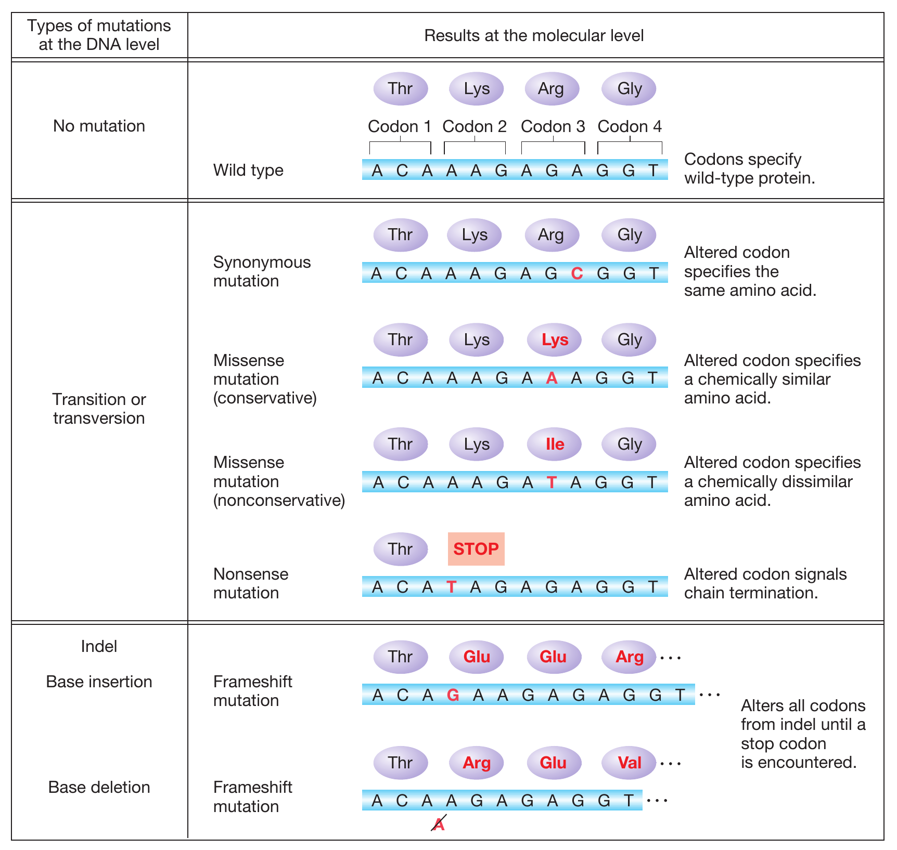
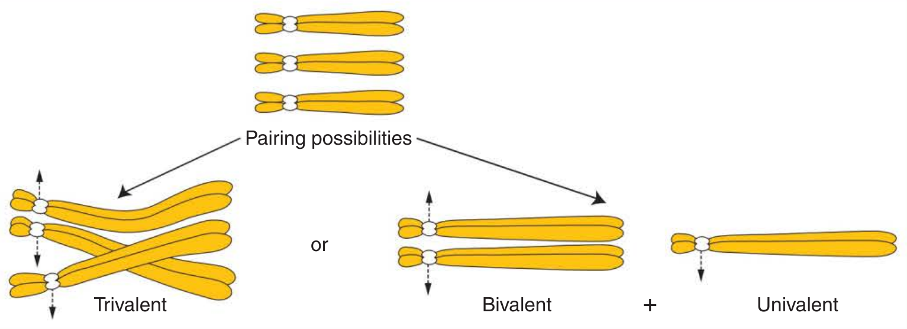

```{r,setup, include=FALSE}
library(knitr)
require(tidyverse)
set.seed(453)
# invalidate cache when the package version changes
knitr::opts_chunk$set(tidy = FALSE, echo = FALSE, 
                  message = FALSE, warning = FALSE,
                  out.width = "45%", cache = TRUE)
options(knitr.table.format = "latex")
options(knitr.kable.NA = "", digits = 2)
options(kableExtra.latex.load_packages = FALSE)
```

## Background

- Discovery of the mutagentic effects of X-rays on the fruit fly (Drosophila) by H. Muller in the 1920s.
- In 1928, H. Stubbe demonstrated the use of mutagenesis in producing mutants in tomatoes, soybeans, and other crops.
- In terms of origin, mutations may be spontaneous (natural) or induced (artificial, with the aid of agents). 
- Spontaneous mutations arise at the very low rate of about 10-5 or 10-6 per generation for most loci in most organisms. This translates to 1 in 100, 000 or 1 in 1, 000, 000 gametes that may carry a newly mutated allele at any locus. They are caused by mistakes in molecular processes associated with the replication of DNA, recombination, and nuclear division.

# Types of Mutation

- On the basis of structural change produced:
  - Ploidy variation:
    - changes in chromosome number (grain or loss in complete sets of chromosomes or parts of a set).
  - Chromosome structure variation
    - changes in chromosome structure (e.g., duplications of segments, translocation of segments).
  - Gene mutation
    - changes in nucleotide constitution of DNA (by deletion or substitution).
- On the basis of origin:
  - Nuclear DNA or chromosomes, or 
  - Extra-nuclear (cytoplasmic) genetic systems.
- On the basis of function:
  - Mutations that convert the wild type (the common phenotype) to the mutant form (the rare phenotype) are called forward mutations, while those that change a mutant phenotype to wild phenotype are called reverse mutations.

## Forward and backward mutation

- Forward mutations are more common than reverse mutations.
- Recessive mutations are the most common types of mutations; However, recessive alleles in a diploid are expressed only when they are in homozygous state.
- Consequently, an organism may accumulate a genetic load (the sum of deleterious genes that are carried, mostly hidden, in the genome and may be transmitted to descendants)
- Induced versus Spontaneous Mutation:
  - Spontaneous mutations produce novel alleles for the evolutionary process. These are carried over in a series of evolutionary process.
  - Mutagenesis can used to create new alleles that can be incorporated to existing cultivars under guidance of artificial selection.
  - The frequency of spontaneous mutation is low.

## Somatic and gametic mutation

- On the basis of cell type:
  - *Gametic mutations* are heritable from one generation to the next and expressed in the entire plant.
  - *Somatic mutations* affect only a portion of plant thus resulting in a condition called chimera (Chimera consists of two genetically distinct tissues).
- It is also well known that cells at the G2 (gap phase) and M (mitosis) stages are more sensitive to radiation than those at the G1 and S (synthesis) stages.
- What happens in tillering species?
- Why is commercial use of chimera not feasible?

## Recessive and dominant mutation

- On the basis of functional expression:
  - Recessive mutation. change of a dominant allele to a recessive allele (A $\rightarrow$ a).
  - Dominant mutation. change of a recessive allele to a dominant allele (a $\rightarrow$ A).
- In open pollinated species, mutant alleles may be accumulated without much adverse effects. However, upon Inbreeding leads to depression.
- Why using recessive genes in breeding takes a longer time?

# Gene mutation

- Gene mutations entails a change in the nucleotide constitution of the DNA sequence, adding or deleting nucleotides.
- DNA consists of four bases: A-T, C-G.
- Types:
  - Transition
  - Transversion
  - Tautomeric shift
  - Effect of base analogue
  - Single base deletion or addition

## Transitions

- Mutation by transition entails the conversion of one purine base to another purine (or a pyrimidine to another pyrimidine).
- Consequently, one normal base pair is converted to another pair, that is genetically incorrect.

## Transversions

- Involves the substitution of a purine by a pyrimidine and vice versa.
- Chemical mutagen such as NO has been known to cause deamination of adenine to hypoxanthin, cytosine or uracil and guanine to xanthine.

## Tautomeric shifts

- It is known that each of the bases of DNA can exist in rare states as a result of the redistribution of electrons and protons in the molecules, events called tautomeric shifts.

##

```{r point-mutation-types, out.width="55%", fig.cap="Point mutations within the coding region of a gene vary in their effects on protein function. Proteins with synonymous and missense mutations are usually still functional."}
# pdftools::pdf_convert("../../literatures/textbooks/Introduction to Genetic Analysis/Griffiths - An Introduction to Genetic Analysis 11th Edition c2015.pdf",
#                       pages = 609,
#                       dpi = 300, format = "png",
#                       filenames = "../images/point_mutation_type.png")


```

## Effect of base analogues

- Certain analogues of the naturally occurring bases in the DNA molecule have been shown to have mutagenic effects. For example, the natural base thymine (T), a 5-methyluracil, has a structural analog, 5-bromouracil (5-BU). The two bases are so similar that 5-BU can substitute for T during replication, leading to base pair transition.

## Effect at the protein level

\small

- Silent mutation: Because the genetic code is degenerate (one amino acid can be coded by more than one triplet), a change from ACG $\rightarrow$ CGG has no effect as both triplets code for arginine.

- Neutral mutation: This kind of mutation involves an altered triplet code that codes for a different but chemically equivalent amino acid. For example, CAC may change to CGC, altering histidine to a chemically equivalent amino acid, arginine. The change causes a change in the primary structure of the protein (amino acid sequence) but the form of the resultant protein may be unchanged.

##

\small

- Missense mutation: Unlike neutral mutations, a missense mutation results when an altered triplet codes for a different amino acid. Not all missense mutations lead to appreciable protein changes. For example, an amino acid may be replaced by another of very similar chemical properties, thereby altering the structure without impacting its normal function (a neutral mutation). Also, the amino acid substitution could occur in a region of the protein which does not significantly affect the protein secondary structure or function. On the other hand, some missense mutations have devastating consequences. For example, in hemoglobin of humans, a change of GAG (Glu) to GTG (Val) results in serious consequences (sickle cell anemia). 

- Nonsense mutation: A nonsense mutation causes an existing amino acid to be changed to a stop codon (e.g., TAA, TAG), resulting in premature termination of protein synthesis.

## Frame shift mutation

- **Insertion–deletion** mutations (indels) may cause significant changes in the amino acid composition of a protein, and hence in its function.
- For example, GAG-CCG-CAA-CTT-C (corresponding to Glu-Pro-Glu-Leu) may be altered by deletion of G that shifts the reading frame to the right by one nucleotide to produce AGC-CGC-AAC-TTC (corresponding to Ser-Arg-Asi-Phe).
- Frameshift mutations typically result in complete loss of normal protein structure and function.

# Genomic mutation

##

- Errors in cell division resulting from disorders in the spindle mechanism may result in improper distribution of chromosomes to daughter cells. 
- Such errors may cause some cell division products to inherit more or less of the normal chromosome number. These errors, called chromosomal mutations, are of two main kinds: 
  - euploidy (cells inherit additional complete set of the basic chromosome set – n) and 
  - aneuploidy (certain chromosomes are missing from the basic set or added to the set in some cell division products).
  
##

```{r}
ploidy <- tribble(
  ~"Ploidy", ~"Name", ~"Designation", ~"Constitution", ~"Number of chromosomes",
  "Euploids", "Monoploids", "n", "ABC", 3, 
  "Euploids", "Diploids", "2n", "AABBCC", 6,
  "Euploids", "Triploids", "3n", "AAABBBCCC", 9, 
  "Euploids", "Tetraploids", "4n", "AAAABBBBCCCC", 12,
  "Aneuploids", "Monosomic", "2n-1", "ABBCC", 5, 
  "Aneuploids", "Monosomic", "2n-1", "AABCC", 5,
  "Aneuploids", "Monosomic", "2n-1", "AABBC", 5,
  "Aneuploids", "Trisomic", "2n+1", "AAABBCC", 7,
  "Aneuploids", "Trisomic", "2n+1", "AABBBCC", 7,
  "Aneuploids", "Trisomic", "2n+1", "AABBCCC", 7
) 

# ploidy %>% write_csv("./../data/ploidy_states.csv", "")

ploidy %>% 
  kable(booktabs = TRUE, caption = "Chromosome Constitutions in a Normally Diploid Organism with Three Chromosomes (Identified as A, B, and C) in the Basic Set") %>% 
  kableExtra::kable_styling(position = "center", font_size = 6, latex_options = "striped") %>% 
  kableExtra::collapse_rows(columns = 1:2, valign = "top", latex_hline = "major")
```

##

```{r genomic-mutation-cause, out.width="60%", fig.cap="Trisomy or triploidy as a major cause of genomic mutation. The three homologous chromosomes of a triploid may pair in two ways at meiosis, as a trivalent or as a bivalent plus a univalent."}
# pdftools::pdf_convert("../../literatures/textbooks/Introduction to Genetic Analysis/Griffiths - An Introduction to Genetic Analysis 11th Edition c2015.pdf",
#                       pages = 647,
#                       dpi = 300, format = "png",
#                       filenames = "../images/triploidy_trisomy_causes_mutation.png")


```

# Structural chromosomal changes (aberrations)

##

- Changes in chromosome structure begin with a physical break that may be caused by ionizing radiation (e.g., X-rays). After a break, several events may occur:
- The ends of the segment may be disunited.
- The break may be repaired to restore the chromosome to its original form (restitution). 
- Or, one or both ends of a break may join to the ends produced by a different break event (non-restitutional union). These events may result in one of four types of rearrangement – deletions, duplications, inversions, or translocations. The resulting consequences are variable.

# Mutagenic agents

## Physical mutagens

\small

- The principal physical mutagens are ionizing radiations. 
- X-rays were first to be used to induce mutations. Since then, various subatomic particles (neutrons, protons, beta particles, alpha particles)
- Gamma radiation from radioactive cobalt (60Co) is widely used. It is very penetrating and dangerous.
- The relative biological effectiveness (RBE) of fast neutrons is higher than for gamma rays and X-rays.
- The dosage of radiation is commonly measured in Roentgen (r or R) units.
- The exposure may be chronic (continuous low dose administered for a long period) or acute (high dose over a short period).
- The radiation energy is transferred directly or indirectly to the DNA in cells through physical and chemical processes (collision, excitation, and ionization), causing damage to the cellular components that can generate erroneous base replacements during reconstitution, changing the genetic code and causing mutations. 
- Ultraviolet rays exhibit less penetration power and are used only for the treatment of single cells or small cell clusters.

## Case study

\small

Ferreira et al. (2009) evaluated the effect of various doses of gamma radiation on explant buds from fig trees of different sizes. The seedlings were established in vitro, were separated according to size (2.5 to 4.5 cm, 5 to 7 cm, and 8 to 10 cm), and were irradiated with 10, 20, 30, 40, and 50 Gy. After the irradiation, the seedlings were transplanted into explants containing a single bud, were separated according to bud position (basal, median, or apical), and were grown in woody plant medium (WPM). The following traits were evaluated after 90 days' incubation in the growth room: explant mortality, root formation, shoot length, bud number, and seedling weight. Doses of up to 50 Gy did not cause seedling death, and doses greater than 30 Gy prevented the formation of roots; therefore, the 30-Gy dose was recommended for the irradiation of fig tree seedlings measuring greater than 2.5 cm.

## Chemical mutagens

- Chemical mutagens are generally milder in their effect on plant material. 
- They can be applied without complicated equipment or facilities. The ratio of mutational to undesirable modifications is generally higher for chemical mutagens than for physical mutagens. 
- Usually, the material is soaked in a solution of the mutagen to induce mutations. 
- Chemical mutagens are generally carcinogenic and must be used with great caution. 
- One of the most effective chemical mutagenic groups is that of alkylating agents (they react with the DNA by alkylating the phosphate groups as well as the purines and pyrimidines).

##

- Another group is the base analogues (they are closely related to the DNA bases and can be wrongly incorporated during replication); examples are 5-bromouracil and maleic hydrazide. 
- sodium azide ($NaN_3$), which inhibits the activity of cellular respiration enzymes;
- antibiotics (streptomycin, mitomycin C, and actinomycin D), which cause chromosomal breaks;
- Other chemical mutagens commonly used are ethyl methane sulfonate (EMS) and diethylsulfonate (DES). 
- The half-life (time taken for degradation of half the initial amount of alkylating agent) for EMS in water is about 93 hours at $20.8^\circ C$ but only 10 hours at $37.8^\circ C$.

# Factors affecting the success of mutagenesis

## Clear objective

- A program established to select one specific trait is more focused and easier to conduct with a higher chance of success than a program designed to select more than one trait.

## Efficient screening method

- Mutation breeding programs examine large segregating populations to increase the chance of finding the typically rare desirable mutational events. An efficient method of screening should be developed for a mutation breeding program. Proper choice of mutation and method of treatment. Mutagens, as previously discussed, vary in various properties including source, ease of use, penetration of tissue, and safety. Some are suitable for soft tissues, whereas others are suited to hard tissue.

## Dose and rate

- The proper dose rate is determined by experimentation for each species and genotype. 
- Plant materials differ in sensitivity to mutagenic treatment. It is difficult to find the precise dose (intensity), but careful experimentation can identify an optimum dose rate. 
- Mutagenic treatments invariably kill some cells. Overdose kills too many cells and often produces crippled plants, whereas underdose tends to produce too few mutants. Not only are dose–response relationships rarely known, but they are influenced by the experimental conditions. 
- It is recommended that three dose levels be used in a project – the optimal rate, plus one dose above and below this rate.
