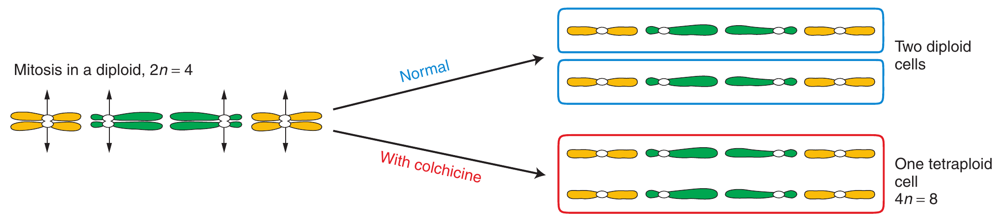
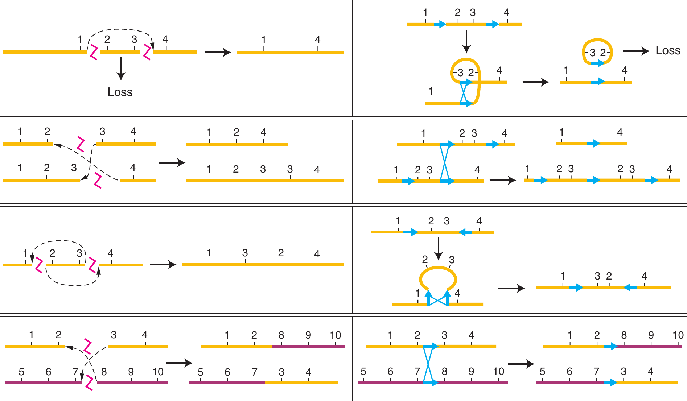

```{r,setup, include=FALSE}
library(knitr)
require(tidyverse)
set.seed(453)
# invalidate cache when the package version changes
knitr::opts_chunk$set(tidy = FALSE, echo = FALSE, 
                  message = FALSE, warning = FALSE,
                  out.width = "45%", cache = TRUE)
options(knitr.table.format = "latex")
options(knitr.kable.NA = "", digits = 2)
options(kableExtra.latex.load_packages = FALSE)
```

# Chromosomal aberration and ploidy

## Chromosomal aberrations

- Gene mutations are never detectable microscopically. In contrast, many chromosome mutations can be detected by microscopy, by genetic or molecular analysis, or by a combination of all techniques.
- Chromosome mutations can be divided into:
  - Changes in chromosome number
  - Changes in chromosome structure
- Changes in chromosome number are not associated with structural alterations of any of the DNA molecules of the cell.

## Significance of chromosomal aberrations

- They can be sources of insight into how genes act in concert on a genomic scale
- They reveal several important features of meiosis and chromosome architecture
- They constitute useful tools for experimental genomic manipulation
- They are sources of insight into evolutionary processes
- Chromosomal mutations are regularly found in humans, and some of these mutations cause genetic disease.
- Plant breeders have routinely manipulated chromosome number to improve commercially important agricultural crops

##

```{r chromosomal-aberration-types, out.width="65%", fig.cap="The illustration is divided into three colored regions to depict the main types of chromosome mutations that can occur: the loss, gain, or relocation of entire chromosomes or chromosome segments. The wild-type chromosome is shown in the center."}
# pdftools::pdf_convert("../../literatures/textbooks/Introduction to Genetic Analysis/Griffiths - An Introduction to Genetic Analysis 11th Edition c2015.pdf",
#                       pages = 645,
#                       dpi = 300, format = "png",
#                       filenames = "../images/types_of_chromosome_mutations.png")

knitr::include_graphics("../images/types_of_chromosome_mutations.png")
```

## Ploidy

- Changes in chromosome number are of two basic types: 
  - changes in whole chromosome sets, resulting in a condition called aberrant **euploidy**, and 
  - changes in parts of chromosome sets, resulting in a condition called **aneuploidy**.

##

```{r ploidy}
tribble(
  ~"Ploidy", ~"Name", ~"Designation", ~"Constitution", ~"Number of chromosomes",
  "Euploids", "Monoploids", "n", "ABC", 3, 
  "Euploids", "Diploids", "2n", "AABBCC", 6,
  "Euploids", "Triploids", "3n", "AAABBBCCC", 9, 
  "Euploids", "Tetraploids", "4n", "AAAABBBBCCCC", 12,
  "Aneuploids", "Monosomic", "2n-1", "ABBCC", 5, 
  "Aneuploids", "Monosomic", "2n-1", "AABCC", 5,
  "Aneuploids", "Monosomic", "2n-1", "AABBC", 5,
  "Aneuploids", "Trisomic", "2n+1", "AAABBCC", 7,
  "Aneuploids", "Trisomic", "2n+1", "AABBBCC", 7,
  "Aneuploids", "Trisomic", "2n+1", "AABBCCC", 7
) %>% 
  kable(booktabs = TRUE, caption = "Chromosome Constitutions in a Normally Diploid Organism with Three Chromosomes (Identified as A, B, and C) in the Basic Set") %>% 
  kableExtra::kable_styling(position = "center", font_size = 6, latex_options = "striped") %>% 
  kableExtra::collapse_rows(columns = 1:2, valign = "top", latex_hline = "major")
```

## Euploidy

- Organisms with multiples of the basic chromosome set (genome) are referred to as euploid.
- Polyploids are individual organisms that have more than two chromosome sets. They can be represented by 3n (triploid), 4n (tetraploid), 5n (pentaploid), 6n (hexaploid), and so forth.
- An individual member of a normally diploid species that has only one chromosome set (n) is called a monoploid to distinguish it from an individual member of a normally haploid species (also n).
- In most species monoploid zygotes fail to develop (Male bees, wasps and ants are the exception), this is because virtually all members of diploid species carry genetic load.
- Polyploids are often larger and have larger component parts than their diploid relatives.

##

- **Autopolyploids** have multiple chromosome sets originating from within one species. 
- **Allopolyploids** have sets from two or more different species
- Allopolyploids have **homeologous** chromosomes while autopolyploids have **homologous** chromosomes.
- Polyploids with odd numbers of chromosome sets, such as triploids, are sterile or highly infertile because their gametes and offspring are aneuploid.
- Autotetraploids arise by the doubling of a 2n complement to 4n. This doubling can occur spontaneously, but it can also be induced artificially by applying chemical agents that disrupt microtubule polymerization

##

```{r colchicine-polyploidy, out.width="75%", fig.cap="Colchicine may be applied to generate a tetraploid from a diploid. Colchicine added to mitotic cells during metaphase and anaphase disrupts spindle-fiber formation, preventing the migration of chromatids after the centromere has split. A single cell is created that contains pairs of identical chromosomes that are homozygous at all loci."}
# pdftools::pdf_convert("../../literatures/textbooks/Introduction to Genetic Analysis/Griffiths - An Introduction to Genetic Analysis 11th Edition c2015.pdf",
#                       pages = 648,
#                       dpi = 300, format = "png",
#                       filenames = "../images/colchicine_treatment_polyploidy.png")


```

##

- The prototypic allopolyploid was an allotetraploid synthesized by Georgi Karpechenko in 1928. 
- He wanted to make a fertile hybrid that would have the leaves of the cabbage (Brassica) and the roots of the radish (Raphanus), because they were the agriculturally important parts of each plant. 
- Each of these two species has 18 chromosomes, and so $2n_1=2n_2 = 18$, and $n_1 = n_2 = 9$. The species are related closely enough to allow intercrossing. Fusion of an n1 and an n2 gamete produced a viable hybrid progeny individual of constitution $n_1 + n_2 = 18$. However, this hybrid was functionally sterile because the 9 chromosomes from the cabbage parent were different enough from the radish chromosomes that pairs did not synapse and segregate normally at meiosis, and thus the hybrid could not produce functional gametes.

##

\begin{columns}[T,onlytextwidth]

  \column{.35\linewidth}

```{r origin-of-raphanobrassica, out.width="98%", fig.cap="In the progeny of a cross of cabbage (Brassica) and radish (Raphanus), the fertile amphidiploid arose from spontaneous doubling in the 2n = 18 sterile hybrid."}
# pdftools::pdf_convert("../../literatures/textbooks/Introduction to Genetic Analysis/Griffiths - An Introduction to Genetic Analysis 11th Edition c2015.pdf",
#                       pages = 649,
#                       dpi = 300, format = "png",
#                       filenames = "../images/raphanobrassica_hybrid.png")


```

  \column{.65\linewidth}

```{r origin-of-brassica, out.width="80%", fig.cap="Allopolyploidy is important in the production of new species. In the example shown, three diploid species of Brassica (light green boxes) were crossed in different combinations to produce their allopolyploids (tan boxes). Some of the agricultural derivatives of some of the species are shown within the boxes."}
# pdftools::pdf_convert("../../literatures/textbooks/Introduction to Genetic Analysis/Griffiths - An Introduction to Genetic Analysis 11th Edition c2015.pdf",
#                       pages = 650,
#                       dpi = 300, format = "png",
#                       filenames = "../images/origin_three_allopolyploid_brassica.png")

knitr::include_graphics("../images/origin_three_allopolyploid_brassica.png")
```

\end{columns}

## Aneuploidy

- Aneuploidy is the second major category of chromosomal aberrations in which the chromosome number is abnormal.
- Generally, the aneuploid chromosome set differs from the wild type by only one chromosome or by a small number of chromosomes.
- Aneuploid nomenclature is based on the number of copies of the specific chromosome in the aneuploid state. 
- For autosomes in diploid organisms, the aneuploid $2n+1$ is trisomic, $2n-1$ is monosomic, and $2n-2$ (the "-2" represents the loss of both homologs of a chromosome) is nullisomic.
- In haploids, n + 1 is disomic.
- Special notation is used to describe sex-chromosome aneuploids because it must deal with the two different chromosomes. The notation merely lists the copies of each sex chromosome, such as XXY, XYY, XXX, or XO (the 'O' stands for absence of a chromosome).
- Aneuploid organisms result mainly from nondisjunction in a parental meiosis.

# Changes in chromosome structure/Chromosome rearrangements

## Chromosomal rearrangements occur due to breakage and rejoin

\small

- Each chromosome is a single double-stranded DNA molecule.
- The first event in the production of a chromosomal rearrangement is the generation of two or more double-stranded breaks in the chromosomes of a cell.
- Double-stranded breaks are potentially lethal, unless they are repaired.
- Repair systems in the cell correct the double-stranded breaks by joining broken ends back together.
- If the two ends of the same break are rejoined, the original DNA order is restored. If the ends of two different breaks are rejoined, one result is one or another type of chromosomal rearrangement.
- The only chromosomal rearrangements that survive meiosis are those that produce DNA molecules that have one centromere and two telomeres. If a rearrangement produces a chromosome that lacks a centromere, such an (**acentric chromosome**) will not be inherited. If a rearrangement produces a chromosome with two centromeres (**dicentric chromosome**), such chromosome will be pulled simultaneous to opposite poles at anaphase, forming anaphase bridge. These will not be incorporated into either progeny cell. If a chromosome lacks telomere, it cannot replicate properly.
- If rearrangement duplicates or deletes a segment of chromosome, gene balance may be affected. Larger abberation will cause pronounced phenotypic abnormalities.

## 

```{r four-chromosomal-rearrangements, out.width="80%", fig.cap="Each of the four types of chromosomal rearrangements can be produced by either of two basic mechanisms: chromosome breakage and rejoining or crossing over between repetitive DNA. Chromosome regions are numbered 1 through 10. Homologous chromosomes are the same color."}
# pdftools::pdf_convert("../../literatures/textbooks/Introduction to Genetic Analysis/Griffiths - An Introduction to Genetic Analysis 11th Edition c2015.pdf",
#                       pages = 661,
#                       dpi = 300, format = "png",
#                       filenames = "../images/chromosomal_rearrangements.png")


```

## Inversion types

```{r inversion-types, out.width="60%", fig.cap="Inversions are of two basic types. If the centromere is outside the inversion, the inversion is said to be paracentric. Inversions spanning the centromere are pericentric."}
# pdftools::pdf_convert("../../literatures/textbooks/Introduction to Genetic Analysis/Griffiths - An Introduction to Genetic Analysis 11th Edition c2015.pdf",
#                       pages = 668,
#                       dpi = 300, format = "png",
#                       filenames = "../images/inversion_types.png")

knitr::include_graphics("../images/inversion_types.png")
```

##

\begin{columns}[T,onlytextwidth]

  \column{.5\linewidth}

```{r paracentric-inversion, out.width="56%", fig.cap="Paracentric inversion can lead to deletion types"}
# pdftools::pdf_convert("../../literatures/textbooks/Introduction to Genetic Analysis/Griffiths - An Introduction to Genetic Analysis 11th Edition c2015.pdf",
#                       pages = 670,
#                       dpi = 300, format = "png",
#                       filenames = "../images/paracentric_inversion.png")


```

  \column{.5\linewidth}

```{r pericentric-inversion, out.width="80%", fig.cap="Pericentric inversion can lead to deletion-duplication products"}
# pdftools::pdf_convert("../../literatures/textbooks/Introduction to Genetic Analysis/Griffiths - An Introduction to Genetic Analysis 11th Edition c2015.pdf",
#                       pages = 671,
#                       dpi = 300, format = "png",
#                       filenames = "../images/pericentric_inversion.png")


```

\end{columns}

# Bibliography

## References
