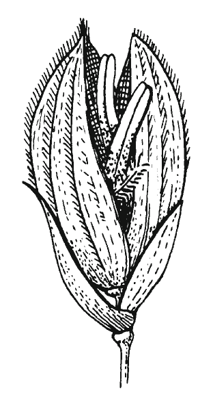
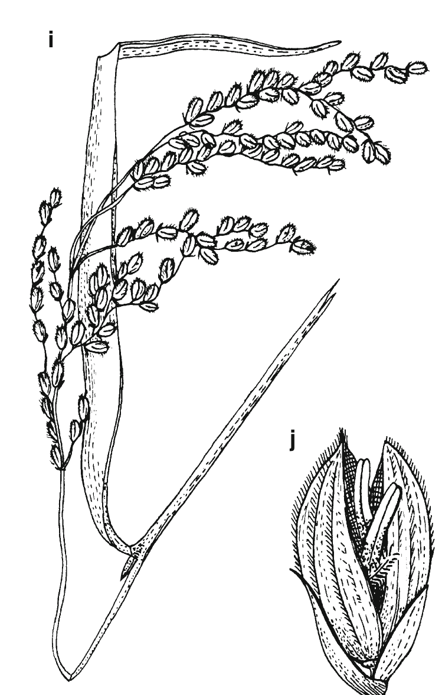
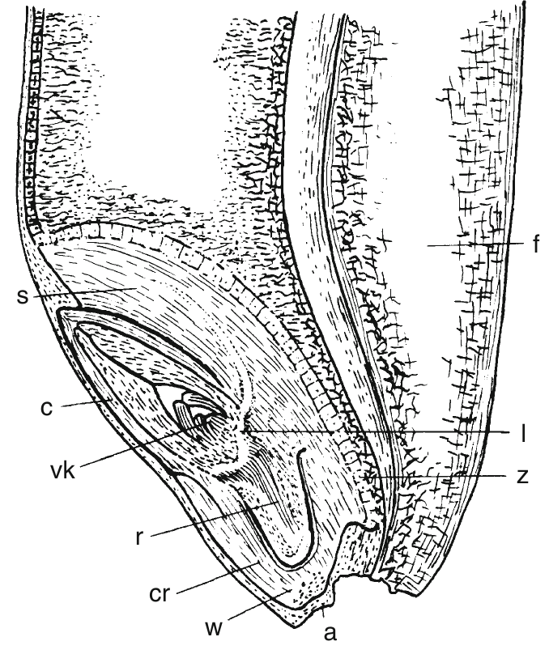

# Study of floral parts of field crops {#practical-1}

## Objectives

- To be familiar with different parts of flower and their functions
- To know the floral morphology and mode of pollination in crops

## Theory

Flowers are the reproductive organs of a plant which lead to the development of fruit and seed. ? How flowers are important part of evolutionary history in crops ?

The floral morphology is the study of forms and features of flowers. ? Add a brief history to this ?

The genetic constitution of a crop depends on the mode of pollination of the crop ?. Floral morphology dictates the mode of pollination in flowers. Therefore, it becomes an essential for a plant breeder to know the structural organization and basic nomenclature associated with commonly cultivated crops' flowers.

```{r floral-morphology-poales, fig.cap="Flower and fruit morphology of poales. Wheat, \\textit{Triticum aestivum} with (c) spelt and (d, e) wheat. (k) Wheat grain (caryopsis). (i, j) Rice, \\textit{Oryza sativa}. a point of emergence, c coleoptile, cr coleorhiza, d lemma, f fruit furrow, h glume, l vascular bundle, r radicle, s scutellum, v palea, vk shoot apex, w root cap, z cylindrical epithelium", fig.align='center', out.width="55%", fig.nrow = 2}
# pdftools::pdf_convert("/home/deependra/Desktop/BSc_Ag_lectures/literatures/Plant Science Straussberger.pdf", pages = 956, format = "png", filenames = "./images/floral_morphology_wheat.png", dpi = 300)



# knitr::include_graphics("./images/wheat_spikelet.png")
# knitr::include_graphics("./images/wheat_spike.png")
```

The type of habitat that a species inhabits in determines the reproductive biology of that adapted crop to a large extent. A range of vegetation types (based on habitat) are identified for order poales, including:
  - Woodland
  - Grassland
  - Heathland
  - Wetland
  - Desert
  - Polymorphous
  
Flower morphology in turn affects the choice of tools and techniques to be used for hybridization. Prominance of reproductive organs -- Stigma and anther -- which is largely conserved in a species (cleistogamous and ?), is among a number of factors determining the mode of reproduction and complexity of undertaking a manual crossing. More on hybridization techniques in Practical \@ref(practical-2).

### Rice: A case in Morphology study

Source: http://dhcrop.bsmrau.net/rice/

#### Taxonomic Position (According to Cronquist (1988))

Kingdom 	:Plantae
Division 	:Magnoliophyta
Class 	:Liliopsida
Subclass 	:Commelinidae
Order 	:Poales
Family 	:Poaceae
Genus 	:Oryza
Species 	: O. sativa

#### Botanical description

Habit: Annual herb

Root: Fibrous root system, rootlet and root hair present. The first form root is called seminal root, which is parsley branched and persist for a short time after germination. New roots are emerged soon after the destroyed of seminal root. The prop roots are arisen from the node of the above ground.

Stem: Hollow, cylindrical composed of node and internode, and called culm. Leaf and buds are arisen from the node. The tillers are arisen from the lower nodes as alternate manner.

image: rice-stem
image: rice-stem-histology
image: rice-root-histology
image: rice-leaf-histology

Inflorescence: terminal, panicle.

image: rice-inflorescence

Spikelet: born on the pedicel which is morphologically a peduncle. The spikelet consists of a minute axis (rachilla) on which a single floret is borne in the axils of 2-ranked bracts. The bracts of the lower pair on the rachilla, being always sterile, are the sterile lemmas (“glumes,” “empty glumes,” “outer glumes”). The upper bracts or the flowering glumes consist of the lemma (fertile lemma) and palea. The lemma, palea, and the included flower form the floret. The filiform extension of the keel of the lemma is known as awn.

Flower: It is known as floret contains bracts lemma and palea. Flower is bisexual and zygomorphic.

Perianth: The calyx and corolla together form perianth and is known as lodicule. The lodicules are two wale-like, transparent, fleshy structures located at the base of the flower adnate to the palea.

Androecium: Stamens are six, located into two whorls, anther versatile.

Gynoecium: Carpel one, placentation basal, stigma feathery.

Fruit: Caryopsis, the rice fruit is a caryopsis in which the single seed is fused with the wall of the ripened ovary (pericarp), forming a seed like grain. The grain is the ripened ovary, with the lemma, palea, rachilla, sterile lemmas, and the awn, if present, firmly adhered to it. The lemma and palea and their associated structures such as the sterile lemmas, rachilla, and the awn whenever present constitute the hull or husk.

Rice seed: rice grain, commonly called a seed, consists of the true fruit or brown rice (caryopsis) and the hull, which encloses the brown rice. Brown rice consists mainly of the embryo and endosperm. The surface contains several thin layers of differentiated Tissues that enclose the embryo and endosperm. The palea, lemmas, and rachilla constitute the hull of indica rices.

Leaf: simple, sessile composed of leaf sheath and leaf blade. Leaf sheath encircled the stem, and the leaf blade is flat. At the junction, a feathery structure is known as ligule and thread like structure is known as auricle. Auricles are ear-like appendages arises in pair from both sides. The terminal leaf is known as flag leaf.

## Materials required

- Flower,
- Scissor,
- Petri dish,
- Magnifying glass,
- Notebook, 
- Pencil

## Procedure

- A fresh sample of flowers are obtained of crops.
- Flowers are dissected in lab, their nature and morphology looked closely with the help of magnifying glass, and the observed impression is drawan in notebook.

### Following structures can be observed

1. Wheat/rice

- Bracteate type flower
- Inflorescence: Spike of spikelets or compound spikelets
- Mode of pollination: Self pollination
- Flowers of wheat and rice are complete and bisexual.
- ? refer to wheat valentine blog post

2. Pea

- Flowers are pedicilate, zygomorphic and hermaphrodite
- Sepals are gamosepalous, pentamerous
- Petals have axillary aestivation
- Androecium: Superior ovary (epigynous)
- Pollination: Self pollinated

3. Potato: 

- Bisexual, complete, regular flower, yellow colored and self pollinated
- ?

4. Maize

- In maize, male and female inflorescence are located on different parts, namely tassel and ear, respectively.
- ? details

- 95% of the times, pollination is cross and 5% of the time only self-pollination takes place.

## Conclusion

Hence, study of floral morphology done for some of the common crop species has inspired students about the importance of floral biology in overall reproductive habit of a crop and established that it's knowledge can aid in crop improvement activities, mainly through hybridization.
