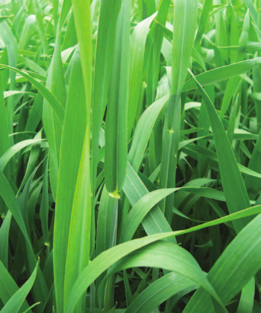

# Disease scoring and determining resistance and susceptibility to pests {#practical-6}

## Objectives

-   To determine the growth stage of crop
-   To understand standard systems of cereal disease scoring
-   To score and record field disease score of wheat crop

## Theory

A major cause of yield loss in developing countries worldwide are the disease. Wheat, and some major grain cereals alike, suffer loss owing to the infection by pathogens. Much of the pathogens are obligate parasites having a narrow host range, although less commonly pathogens of diverse host range also occur. There has been tendency on the part of pathologists towards more basic research, rather than toward the application of latest field techniques to the development of epidemics to screen breeding materials.

\begin{wrapfigure}[15]{r}{5cm}
  \begin{center}
  \caption{Taxonomy of wheat and related groups.}\label{wheat-botanical-classification}
  {\includegraphics[width=4.8cm]{images/wheat_classification.png}}
  \end{center}
\end{wrapfigure}

In order to understand, the dynamics of disease an understanding of the medium of growth of pathogen, i.e., host, is necessary. We take a simple example of wheat to explore the complexities associated with development of disease. Wheat species of importance are primarily *Triticum aestivum ssp. aestivum* (bread wheat) and *T. turgidum ssp. durum* (durum wheat). It's botanical relationship to species and groups of similar plants is shown in Figure \ref{wheat-botanical-classification}.


### Wheat morphology and growth

The cereal seed or kernel (technically a caryopsis), consists of pericarp, the embryo and the endosperm. In the process of germination, the embryo resumes its growth when exposed to suitable environmental conditions. From the emergence of the young seedling at the soil surface to the production of the mature seed, the growth of the wheat plant can be divided into a number of (sometimes simultaneous) stages. These have been codified by [@zadoks1974] as follows.

1.  Seedling growth -- leaves unfold, from the first one breaking through the coleoptile to the appearance of the flag leaf ligule.
2.  Tillering -- additional (secondary) shoots arise from the plant crown.
3.  Stem elongation -- the first pseudostem is erected and the nodes become visible; upper leaf sheath is not swollen by the head.
4.  Booting -- head is evident in the upper or flag leaf.
5.  Ear emergence -- head emerges from the sheath.
6.  Flowering -- florets and flowers open; pollen is shed.
7.  Milk development -- fertilized ovary enlarges to mature seed size; its contents become increasingly white and opaque.
8.  Dough development -- ovary contents solidify.
9.  Ripening -- seed becomes hard; harvest.

```{r wheat-seed-and-germination, fig.cap="Wheat morphology.", fig.subcap=c("Wheat caryopsis", "Morphology of germinating wheat and its seedling development"), fig.ncol = 2, out.width=c("52%", "62%"), fig.align='center', cache=FALSE}

knitr::include_graphics("./images/wheat_germination.jpg")
```


```{r wheat-growth-stages}
wheat_growth_stages <- read_csv("./data/scoring_growth_stage_wheat.csv")

wheat_growth_stages %>% 
  tidyr::fill(Stage, .direction = "down") %>% 
  knitr::kable(booktabs = TRUE, caption = "Wheat growth stages.", longtable = TRUE) %>% 
  kableExtra::kable_styling(font_size = 8, latex_options = "striped") %>% 
  kableExtra::column_spec(column = 1:5, width = c("8em", "14em", "4em", "4em", "14em"))
```


```{r wheat-growth-id, fig.cap="Wheat growth stages.", fig.subcap = c("Wheat at Feekes 9. Note that the flag leaf is fully emerged.", "Wheat at Feekes 10, also called the booting stage. The head is visible in the leaf sheath below the flag leaf."), cache=FALSE, out.width=c("45%", "25%"), fig.align='center'}


```

The character expression of a crop and its growth depends upon its genetic make-up. These characters (such as plant height, growth habit, photoperiod response, yield potential and disease resistance) are controlled by units of inheritance -- genes, which are located on the chromosomes of plant cells. These genes differ widely and are inherited in various different combinations enabled by chromosomal crossover mechanism followed by the recombination of gametes after during fertilization. Some characters are controlled by one or relatively few genes and are termed as qualitative^[The inheritance of individual genes immediately/prominently confers certain characteristics upon the plant.]. Examples include growth habit and disease resistance. Other characters are controlled by a number of genes and are referred to as quantitatively inherited^[The effect of an individual gene is relatively minor, but increasing numbers of them cause an increasing expression of specific characters.].

The crop environment, which includes physical features (e.g., sunlight, temperature, topography, soils, etc.) and biological components (other plants, pests and diseases), imposes numerous constraints upon the way in which cereal crops grow and yield. The biological components of the environment have become particularly important as a result of environmental disruptions caused by the expansion of monoculture and the progressive reduction of genetic diversity in both the wheat and barley crops. Diseases caused by pathogenic organisms now constitute perhaps the most important single environmental constraint to increased cereal production.

Pathogenic fungi are by far the most important and yield limiting of the many disease-causing organisms which attack cereal crops. Of these the genera puccinia (rusts), Ustilago (smuts), Tilletia (bunts), Erysiphe (powdery mildews), Septoria, Alternaria, Helminthosporium, Fusarium and Pythium are the most widespread, regularly occuring and potentially dangerous throughout the world.

Most plant pathogenic fungi (most notably of genus Puccinia) are highly host specific and a number of _formae speciales_ based upon host range may be distinguished within each species. Within each _forma speciales_ the pathogens may be further divided into physiological races and/or biotypes. A biotypes is defined as a population of individuals with identical genotypes. A physiological race is a group of biotypes similar in morphology but differing in physiological, biochemical, pathological and/or other characters [@stubbs1986cereal].

```{r formae-specialis-cereal-rusts}
cereal_rust_forma_groups <- tribble(
  ~"Species", ~"\\textit{Forma specialis}", ~"Primary host",
  "\\textit{Puccinia graminis} Pers.", "\\textit{tritici}", "Wheat, barley",
  NA, "\\textit{secalis}", "Rye, barley",
  NA, "\\textit{avenae}", "Oats",
  "\\textit{P. recondita} Rob. ex Desm.", "\\textit{tritici}", "Wheat",
  "\\textit{P. striiformis} Westend.", "\\textit{tritici}", "Wheat",
  NA, "\\textit{hordei}", "Barley", 
  "\\textit{P. hordei} Orth.", NA, "Barley",
  "\\textit{P. coronata} Cda.", NA, "Oats"
)

cereal_rust_forma_groups %>% 
  knitr::kable(booktabs = TRUE, caption = "The major species and \\textit{formae} of cereal rusts.", escape = FALSE, longtable = TRUE) %>% 
  kableExtra::kable_styling(latex_options = "striped", font_size = 10) %>% 
  kableExtra::column_spec(column = 1:3, width = c("8em", "5em", "8em"))

```


### Resistance and susceptibility

**Resistance** is the extent to which a plant prevents the entry or subsequent growth of the pathogen within its tissues or the extent to which a plant is damaged by a pathogen.

**Susceptibility** is the incapacity of a plant to reduce the growth, development and reproduction of the natural enemy.

```{r rust-infection-types, fig.cap="Rust infection types. Specific resistance genes confer typical phenotypes -- infection types; (from left to right; according to Stakman et al., 1962) Sr5: 0 (R), Sr6: 0 (R), Sr21: 1 (R), Sr24: 2 (MR), Sr29: 3 (MS), 4 (S), Sr17: X.", out.width="80%", fig.align='center'}

```

The interaction between plant host, pathogen and environment is visibly expressed in characteristic symptoms and in the severity and prevalence of such symptoms. Disease symptoms (termed infection types) may vary from non-existent (host immune) to maximum expression of pathogen reproduction (host highly susceptible).

<!-- Depending on the race of the pathogen used to infect a variety, the variety may appear strongly resistant to one pathogen race and susceptible to another race (race specific) under a variety of environmental conditions. In contrast, race non-specific resistance reduces the rate of pathogen increase by being at least partially effective against all races. -->

<!-- The identification of physiological races of rusts may be made on the basis of the response of different varieties of the crop to infection by a purified rust culture (infection types). Seedlings of a fixed number of varieties are used; infections will be fully developed about 10-15 days after inoculation if conditions are optimal. -->

```{r infection-types-race-identification}
infection_types_race_determination <- tribble(
  ~"Notation", ~"Response", ~"Description",
  "0", "Immune", "No signs of disease",
  "0", "Practically immune", "No pustules but hypersensitive flecking (small flecks of dead host tissue) observable.",
  "1", "Very resistant", "Rust pustules extremely small and isolated, often surrounded by sharp and continuous hypersensitive flecking.",
  "2", "Moderately resistant", "Pustules small to medium in size, usually occuring in green islands of host tissue surrounded by bands of yellow, chlorotic or dead tissue.",
  "3", "Moderately susceptible", "Pustules medium in size, usually separated; no areas of dead tissue; yellowish (chlorotic) area may be evident.",
  "4", "Susceptible", "Pustules large, numerous and often united (confluent); no dead tissue; chlorosis may occur under unfavorable growing conditions.",
  "X", "Reaction heterogenous (mesothetic)", "Pustules variable in size; all types of infection may be found on a single leaf blade; no mechanical separation possible. On isolation and re-inoculation small pustules may produce large ones and viceversa."
)

infection_types_race_determination %>% 
  knitr::kable(booktabs = TRUE, caption = "The basic infection types for classifying cultures of stem and leaf rust in the greenhouse. Source: \\cite{stakman1962identification}.", longtable = TRUE) %>% 
  kableExtra::kable_styling(font_size = 8, latex_options = "striped") %>% 
  kableExtra::column_spec(column = 1:3, width = c("4em", "8em", "30em"))
```


### Disease scoring

Field level disease scouting also needs to account for disease prevalence (a measure of the number of diseased plants or plant parts in a given area) and disease severity (the amount or number of infections on a given plant or plant part) in addition to the infection type.

A number of scales have been developed in order to describe infection types and to quantify disease severity and prevalence. While these are basically descriptive and rely upon subjective observations, they have in most cases been transformed into coded scales for ease of use and saving time. Infection types are typically coded either in Arabic numbers as shown in Table \ref{tab:infection-types-race-identification} or in notation as referenced in Figure \ref{fig:rust-infection-types}. In contrast, severity and prevalence are normally recorded in percentages (0 to 100). A distinction is made between observed and actual percentage of the leaf surface affected by disease (e.g., a visual rating of 20 percent may in fact represent an actual infection of 7.4 percent). Severity is recorded as a percentage, according to the modified Cobb scale (improvements to this scale are been made by @peterson1948diagrammatic to account for infection when the uredia are of different sizes; refer to Figure \ref{fig:modified-cobb-severity-peterson}). As far as use of modified Cobb scale goes, it is common to use the following intervals while avoiding fastidious biases owing to observational values: Trace (t), 5, 10, 20, 40, 60 and 100 percent infection.

```{r modified-cobb-severity-peterson, fig.cap="Diagrams illustrating the degrees of rust severity when the uredia are of different sizes; A is the actual percentage of the surface covered by lesions and B is the visual percentage.", fig.align='center', out.width="70%", fig.pos="H"}

```

Severity and response readings are usually combined, for example:

- tR: Trace severity of a resistant type infection
- 5MR: 5 percent severity of a moderately resistant type
- 60S: 60 percent severity of a susceptible type

## Equipments and materials required

## Procedure

## Conclusions
