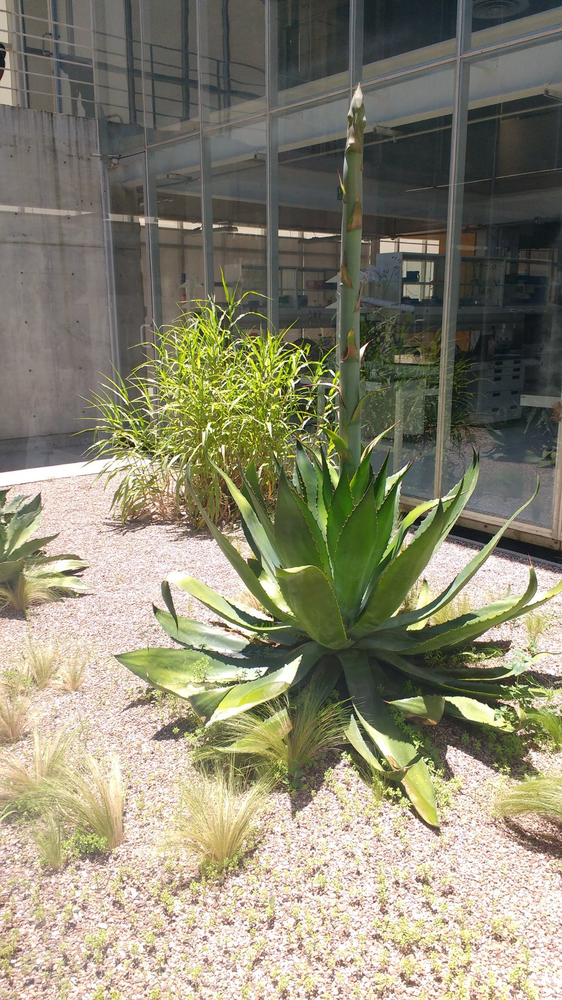
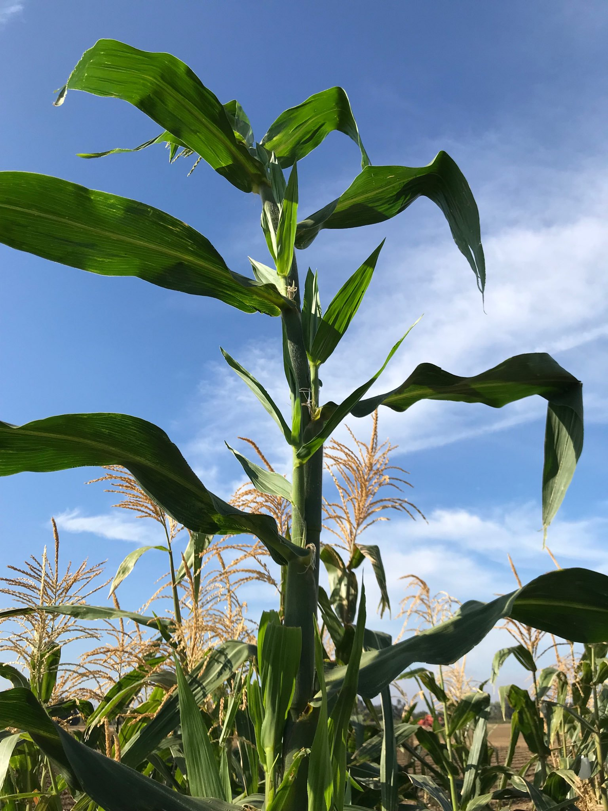
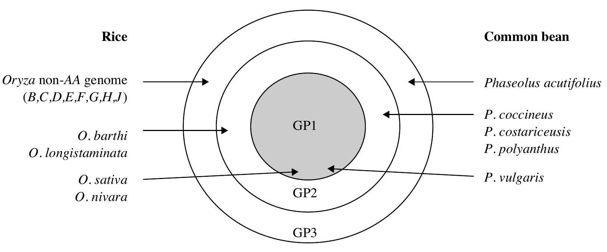

```{r,setup, include=FALSE}
library(knitr)
require(tidyverse)
set.seed(453)
# invalidate cache when the package version changes
knitr::opts_chunk$set(tidy = FALSE, echo = FALSE, 
                  message = FALSE, warning = FALSE,
                  out.width = "45%", cache = TRUE)
options(knitr.table.format = "latex")
options(knitr.kable.NA = "", digits = 2)
options(kableExtra.latex.load_packages = FALSE)

# to use a custom background manually tweak the rendered tex file and add before frame the desired background. like:

# \end{frame}
# % Now we install the new template for the following frames:
# {\usebackgroundtemplate{%
#   \includegraphics[width=\paperwidth,height=\paperheight]{crayons}} 
# \begin{frame}
# ...
# \end{frame}}
# % Now we install another template, effective from now on:
# \usebackgroundtemplate{...}
# 
# additionally, to have opacity in the bg
# 
# \usebackgroundtemplate{\tikz\node[opacity=0.1]{\includegraphics[width=\paperwidth]{kitten.jpg}};}
# 
# alternatively,
# 
# \setbeamertemplate{background}{...}
# 
# to get back to default slide background, use empty argument:
#
# \usebackgroundtemplate{}
#
# to be succinct in the declaring statement, predefine your image and then declare:
#
# \pgfdeclareimage[height=\paperheight,width=\paperwidth]{myimage}{cern-logo.jpg}
# \usebackgroundtemplate{\tikz\node[opacity=0.3] {\pgfuseimage{myimage}};}
```

# Domestication

## Domestication

<!-- - "A weed is a plant in the wrong place!" -->
<!-- - We define weeds as plants we do not want that compete for resources with those we do want. -->
<!-- - Clearly we have criteria about which plants we want and those that fail those criteria. -->
<!-- - In evolutionary terms, it is the cultivated plants that are "fitter" than the weeds, as they have characteristics which we want, and since **in the field** and the garden we have largely substituted ourselves for nature, and here it is us who control the evolutionary process. -->
<!-- - However, many commercially grown plants survive as volunteer weeds, or "escapes", in either the same, or different, regions to those in which they are most commonly grown commercially. -->

\begin{columns}[T,onlytextwidth]
\column{.6\linewidth}

  \begin{block}{Domestication}

"The gap between the wild and the cultivated is all about the difference between nature's requirements and ours." -- \cite{kingsbury2009hybrid}

"A plant population has been domesticated when it has been substantially altered from the wild state and certainly when it has been so altered to be unable to survive in the wild" -- N.W. Simmonds
  \end{block}

Domestication is the process by which genetic changes (shifts) in wild plants are brought about through a selection process imposed by humans.

\column{0.4\textwidth}

```{r weed-vs-crop, fig.cap="Perennial teosinte", out.height="92%", out.width="0.7\\textwidth, keepaspectratio", fig.align='center'}


# the term Teosinte (generally) to refer to mexicana and parviglumis subspecies under Zea mays species. While modern maize occurs under Zea mays subsp. mays.
```

\end{columns}


##

<!-- There are three reasons for the big consequences resulting from domestication. First, in a wheat field or sheep pasture, all of the plants and animals are edible to us, but in natural habitats only a few of the plant and animal species are edible, so domestication meant much more edible food per unit area and the capacity to feed many more people per unit area. Hence farmer population densities are typically between 10 and 1,000 times those of hunter-gatherers. Second, domestication meant that people who formerly had to be nomadic to follow seasonal variations in food supply could now settle down in permanent villages next to their fields or pastures, so we became able to accumulate heavy nonportable technology like printing presses and atomic bombs, and (even before that) to shorten our birth intervals and pump out new babies faster. Finally, domestication produced food surpluses that could be stored to feed non-food-producing specialists, such as kings and bureaucrats, metal-workers and potters, and professional soldiers and scribes. -->
<!-- More on: Biodiversity in Agriculture. This above paragraph, is infact, from a Chapter 2, which was contributed by Jared Diamond in the book. -->

- Because of the roles of humans (*Domesticators*), the process results in characteristics that are beneficial to humans but some that would be disadvantageous for plants in their natural habitats. Consequently:
  - plants that are adapted to supervised cultural conditions
  - posses characteristics that are preferred by producers and consumers.
- Both wild and domesticated populations are subject to evolution
- Forces of selection determine what will be domesticated and that which will continue in wild
	- The natural selection favours plant phenotypes which have the greatest chance of survival, reproduction, and distribution of progeny.
	- Human selection is the result of conscious decisions by a farmer or plant breeder to keep the progeny of a particular parent and discard others.

##

\bcolumns
\column{0.5\textwidth}

```{r biodiversity-in-agriculture, out.width="68%"}

```

\column{0.5\textwidth}

```{r guns-germs-steel, out.width="75%"}

```

\ecolumns

<!-- On the very preset of the (former) book poses and answers in brief the following questions: -->

<!-- - Why did agriculture originate where it did ? -->
<!-- - What are some of the local ecological or palaeo-ecological conditions, including climate change and human population growth, that would have favored or impeded the transition from hunting–gathering to agriculture? -->
<!-- - Are there specific characteristics in plants and animals that predispose them to domestication ? -->
<!-- - What is the pattern of domestication for crops and animals ? -->
<!-- - What is the timeline of the origins of agriculture ? How quickly did agriculture become a major alternative to hunting-gathering ? -->
<!-- - How did agricultural ecosystems develop ? -->
<!-- - How did agricultural ecosystems spread from the centers of origin ? -->
<!-- - How can biodiversity be maintained or enhanced in agroecosystems ? -->
<!-- - How does California benefit from agricultural biodiversity ? -->
<!-- - What can crop evolution studies tell us about the potential for future domestications ? -->

## Evolution

- The process by which new species are formed from preexisting species over a period of time.
- Previously, plant breeding and evolution were considered similar processes, considering that both involve creation of variation and selection among the variability.
  - Either by human or naturally
  - Mechanisms of change are similar for both (Mutation, selection, hybridization and polyploidization)
- Key difference is on the duration of process.

## Domestication syndrome (Changes in plant species under domestication)

```{r domestication-syndrome, tidy=FALSE}
domestication_syndrome <- readxl::read_xlsx("./data/02-domestication_plant_introduction_and_acclimatization.xlsx", sheet = "domestication_syndrome")
# DT::datatable(
#   domestication_syndrome,
#   fillContainer = FALSE, options = list(pageLength = 6)
# ) %>% 
#   DT::formatStyle(columns = colnames(.), fontSize = "50%")

domestication_syndrome %>% 
  knitr::kable(booktabs = TRUE 
               # caption = "Domestication syndrome in plants"
               ) %>% 
  kableExtra::kable_styling(font_size = 6, latex_options = "striped") %>% 
  kableExtra::column_spec(column = 1:2, width = c("18em", "42em"))
```

## How is it possible ?

```{r linkage-domestication-syndrome, fig.cap="Linkages among genes controlling the domestication syndrome in various crops. Source: \\cite{gepts2010crop}.", out.width="62%"}

```


## Wild versus domestication

\begin{columns}[T,onlytextwidth]
\column{0.4\textwidth}

```{r, fig.align='center', fig.cap="Teosinte maize hybrid", out.height="80%", out.width="0.7\\textwidth, keepaspectratio"}



# This is a peculiar example of hybridization showing a more vigorous hybrid produced from a cross between a domesticated and wild germplasm.
# The recent reporting of maize x teosinte hybrid plants in maize fields in Spain led some non-governmental organisations to claim that GM maize may hybridise with weedy teosinte relatives in Europe, leading to the development of invasive weeds that pose previously unconsidered risks to the environment.
```

\column{0.6\textwidth}

```{r domesticated, fig.cap="Domesticated dog", fig.show='hold', out.width="0.45\\textwidth, keepaspectratio"}

```


```{r wild, fig.cap="Wild dog", fig.show='hold', out.width="0.45\\textwidth, keepaspectratio"}

```

\end{columns}

##

```{r wild-vs-domesticated-tomato, fig.cap="Wild versus domesticated tomatoes. Diversity of cocona (\\textit{Solanum sessiliflorum}) fruit size and shape has been created by selection for novel fruit types by Yanesha and other indigenous peoples of the upper Amazon.", fig.show='hold', out.height="80%", out.width="0.7\\textwidth, keepaspectratio"}
# pdftools::pdf_convert("./../../references_plb/Biodiversity in Agriculture_ Domestication, Evolution, and Sustainability.pdf", format = "png", pages = 109, filenames = "./images/tomato_wild_domestic.png", dpi = 300)

# Source: Salick, 1992
knitr::include_graphics("./images/tomato_wild_domestic.png")
```

## 

- Wild cereal plants tend to have many small seeds at maturity and disperse their seed by shattering. These seeds also are likely to be attached to a strong awn to aid dispersal. 
<!-- - Modern corn stripped is completely  of its seed dispersal ability while teosinte grains could disperse when ripe. -->

- Similarly, wild potato species produce many small tubers, have their tubers develop at the end of very long stolons (so that daughter plants do not have to occupy ground too close to the parent), and many have tubers with high levels of toxin, which discourage animals from eating them.

- Breeders have developed cereal cultivars which have fewer, but larger seeds, that do not shatter their seeds at maturity and that have a non-persistent awn. 

##

- Similarly potato breeders have selected plants with fewer, but larger tubers, shorter stolons and with reduced levels of toxins in the tuber. 

- Human selection also has produced crops that are more uniform in the expression of many of their characteristics. For example, they have selected seeds that all mature at the same time, with uniform germination, and fruits with uniform fruit size and shape. 
- In more recent times plant breeders' selection has tended to result in shorter plants, greater harvest index, and increased ease of harvest (especially mechanized).

# Germplasm

##

\bcolumns
\column{0.45\textwidth}

- Refers to the genetic material that can be used to perpetuate a species or population.
- Provides the material used to initiate a breeding program.
- Sometimes only germplasm screening and evaluation is practiced for introduction of improved variety in a region

\column{0.55\textwidth}

```{r germplasm-mindmap, out.width="90%", fig.align='center'}
# this is a tikzpicture script rendered
knitr::include_graphics("./scripts/mindmap_germplasm.pdf")
```

\ecolumns

<!-- - Certain institutional sets-ups such as gene banks are charged with the responsibility of assembling, cataloguing, storing and managing large number of germplasm. This allows for quick retrieval. -->

## Gene pool

J.R. Harlan and J.M.J. de Wet proposed a categorization of gene pools of cultivated crops according to the feasibility of gene transfer or gene flow from those species to the crop species.

\bcolumns

\column{0.65\textwidth}

```{r gene-pools, fig.cap="Crop gene pools; A system proposed by Harlan", out.height="60%", out.width="0.95\\textwidth, keepaspectratio"}
# pdftools::pdf_convert("./../../references_plb/George Acquaah(auth.) - Principles of Plant Genetics and Breeding, Second Edition-Wiley-Blackwell (2012).pdf", format = "png", pages = 211, filenames = "./images/crop_gene_pools.png", dpi = 300)

```

\column{0.35\textwidth}

```{r embryo-resuce, fig.cap="The embryo rescue of grape seeds. Increasing diversity by introgression from wild relatives can be complicated by the existence of crossing barriers or poor hybrid fertility.", out.width="98%"}
knitr::include_graphics("./images/embryo_rescue.jpg")
```

\ecolumns

## Types of gene pool

- *Primary gene pool (GP1)* 
  - GP1 consists of biological species that can be intercrossed easily (interfertile) without any problems with fertility of the progeny. That is, there is no restriction to gene exchange between members of the group. This group may contain both cultivated and wild progenitors of the species.

- *Secondary gene pool (GP2)* 
  - Members of this gene pool include both cultivated and wild relatives of the crop species. They are more distantly related and have crossability problems. Nonetheless, crossing produces hybrids and derivatives that are sufficiently fertile to allow gene flow. GP2 species can cross with those in GP1, with some fertility of the F1, but more difficulty with success.

##

- *Tertiary gene pool (GP3)*
  - GP3 involves the outer limits of potential genetic resources. Gene transfer by hybridization between GP1 and GP3 is very problematic, resulting in lethality, sterility, and other abnormalities. To exploit germplasm from distant relatives, tools such as embryo rescue and bridge crossing may be used to nurture an embryo from a wide cross to a full plant and to obtain fertile plants.

# Domestication and origin of major crop species

## Center of Origin

```{r origin-of-crops, tidy=FALSE}
domestication_origin <- readxl::read_xlsx("./data/02-domestication_plant_introduction_and_acclimatization.xlsx", sheet = "center_origin", skip=2)

domestication_origin[1:10,] %>% 
  knitr::kable(booktabs = TRUE, caption = "Estimated time of domestication and centre of origin of major crop species; \\cite{brown2014plant}, Page 23", align = "l") %>% 
  kableExtra::collapse_rows(columns = 1) %>% 
  kableExtra::kable_styling(latex_options = "striped", font_size = 8) %>% 
  kableExtra::column_spec(column = 2:4, width = c("14em", "10em", "18em"))
```

##

```{r origin-of-crops2}
domestication_origin[11:20,] %>% 
  knitr::kable(booktabs = TRUE, caption = "Estimated time of domestication ...", align = "l") %>% 
  kableExtra::collapse_rows(columns = 1) %>% 
  kableExtra::kable_styling(latex_options = "striped", font_size = 8) %>% 
  kableExtra::column_spec(column = 2:4, width = c("14em", "10em", "18em"))
```

##

```{r origin-of-crops3}
domestication_origin[21:28,] %>% 
  knitr::kable(booktabs = TRUE, caption = "Estimated time of domestication ...", align = "l") %>% 
  kableExtra::collapse_rows(columns = 1) %>% 
  kableExtra::kable_styling(latex_options = "striped", font_size = 8) %>% 
  kableExtra::column_spec(column = 2:4, width = c("14em", "10em", "18em"))
```


## Megacentres of cutivated plants

```{r cultivated-megacentres-fig, fig.cap="Megacentres of cultivated plants (Zeven and Zhukovsky, 1975); \\cite{hayward2012plant}, Page 37", out.height="60%", out.width="0.7\\textwidth, keepaspectratio"}
# pdftools::pdf_convert("./../../references_plb/E. S?nchez-Monge (auth.), M. D. Hayward, N. O. Bosemark, I. Romagosa, M. Cerezo (eds.) - Plant Breeding_ Principles and prospects.pdf", format = "png", pages = 53, filenames = "./images/megacentres_cultivated.png", dpi = 300)
knitr::include_graphics("./images/megacentres_cultivated.png")
```


##

```{r cultivated-megacentres-tab, tidy=FALSE}
megacentres <- readxl::read_xlsx("./data/02-domestication_plant_introduction_and_acclimatization.xlsx", sheet = "diversity_region", skip=2)

megacentres[1:14,] %>% 
  knitr::kable(booktabs = TRUE, caption = "Cultivated plants and their regions of diversity. Based on Zeven and Zhukovsky (1975) and Zeven and de Wet (1982); \\cite{hayward2012plant}, Page 54, 55.", align = "l") %>% 
  kableExtra::kable_styling(latex_options = "striped", font_size = 8) %>% 
  kableExtra::column_spec(column = 1:3, width = c("2em", "14em", "35em"))
```

##

```{r cultivated-megacentres-tab2, tidy=FALSE}
megacentres[15:30,] %>% 
  knitr::kable(booktabs = TRUE, caption = "Cultivated plants and their regions of diversity ...", align = "l") %>% 
  kableExtra::kable_styling(latex_options = "striped", font_size = 8) %>% 
  kableExtra::column_spec(column = 1:3, width = c("2em", "12em", "40em"))
```

##

```{r cultivated-megacentres-tab3, tidy=FALSE}
megacentres[31:45,] %>% 
  knitr::kable(booktabs = TRUE, caption = "Cultivated plants and their regions of diversity ...", align = "l") %>% 
  kableExtra::kable_styling(latex_options = "striped", font_size = 8) %>% 
  kableExtra::column_spec(column = 1:3, width = c("2em", "14em", "35em"))
```


## Plant introduction

- The plant breeder may import new, unadapted genotypes from outside the production region, usually from another country (called plant introductions). These new materials may be evaluated and adapted to new production regions as new cultivars, or used as parents for crossing in breeding projects.

- Primary Introduction
  - When the introduced variety is well adapted to the new environment, it is released for commercial cultivating without any alteration in the original genotype; this constitutes primary introduction. It is less common, particularly in countries having well organized crop improvement programmes.

- Secondary introduction
  - The introduced variety may be subject to selection in order to isolate a superior variety. Alternatively, it may be hybridized with local varieties to transfer one or few characters from these varieties to the local ones. Such introduction constitutes secondary introduction. It is much common than primary introduction.

## Purpose of plant introduction

1. To obtain entirely new crop species
2. To serve as new varieties
3. For use in crop improvement programmes
4. To introgress variability to existing genetic materials
5. For scientific studies
6. To augment aesthetics
7. For germplasm collection and comparison

## Plant re-introduction

- Due to various natural and anthropogenic causes, in situ populations may become threatened to the extent that their capacity to produce seed and regenerate is severely affected. 
- In some cases, such populations may need to be supported by introducing additional diversity to enrich the habitats.
- Plant reintroduction\footnote[frame]{Terminology is used more often in context of conservation genetics. Refer to: Supporting in situ conservation of the genetic diversity of crop wild relatives using genomic technologies, Source: \url{https://www.ncbi.nlm.nih.gov/pmc/articles/PMC9303585/} detailed discussion.} is also a common practice that is particularly useful in supporting the conservation of rare, threatened and vulnerable taxa or populations.
<!-- The success of this management practice is however negatively affected by inadequate knowledge of the genetic diversity resident in the source population (Dalrymple et al., 2011; Godefroid et al., 2011). -->

- The diversity can be sourced from ex situ conservation or naturally occurring populations.

## Acclimatization

- Acclimatization is the reversible process by which an individual becomes adapted to a change in the environment, often involving temperature, moisture, food, often relating to seasonal climate changes. The process that leads to the adaptation of a variety, line or population to a new environment is known as acclimatization. Acclimatization is characterized by a faster multiplication of those genotypes -- adaptive fitness -- (present in the original population) that are better adapted to the new environment.

- Factors affecting extent of acclimatization:
  1. Mode of pollination
  2. The magnitude of genetic variability present in the original population
  3. The duration of life cycle of the crop
  4. Tendency to acquire and augment mutation
  5. Nature and intensity of environmental stresses

# Other steps in plant breeding

## Germplasm collection

\footnotesize

- These resources may take the form of seed collections stored in seed banks, trees growing in nurseries, animal breeding lines maintained in animal breeding programs or gene banks, etc.
- Three principles guide the collection, conservation and exchange/utilization of germplasm:
  - \footnotesize When an accession is gathered a sample is left in the country of origin for national use
  - Germplasm is made freely available to all bona fide workers
  - All long term collections are duplicated and maintained in another location.
- Range from collections of wild species to elite, domesticated breeding lines that have undergone extensive human selection.
- Important for
  - \footnotesize Maintenance of biological diversity and food security
  - At times of crisis; irish famine (potato line was result of only a handful of introductions) and *Helminthosporium* leaf blight in corn in US 1970s (Parental line of the popular hybrid maize was susceptible to disease.)
- Loss of genetic diversity has accelerated in recent decades, with many crops growing susceptible to diseases, pests and environmental stresses.
- Germplasm collections are backed up by their characterizations -- using technical guidelines and crop specific descriptors \footnote[frame]{\url{https://www.genebanks.org/resources/publications/key-access-and-utilization-descriptors-for-rice-genetic-resources/}}.

## Germplasm conservation

\begin{columns}[T, onlytextwidth]

\column{0.5\textwidth}
\footnotesize
\begin{itemize}
\item Before being placed in cold storage, the sample is often multiplied so as to retain sufficient seeds or vegetative materials for storage and to send to other institutions.
\item Germplasm of crops grown from true seed is stored in 3 main types of banks:
  \begin{itemize}
  \footnotesize
  \item Long term gene banks, aka. base collections, stored at -10 to -20 degree C for several decades or upto century.
  \item Medium term banks, 0 - 5 degree C for upto 20 years.
  \item Short term collections, under 5 degree C for a few years.
  \end{itemize}
\end{itemize}

\column{0.5\textwidth}

```{r cryo-tank-banana, fig.cap="Cryotanks for conservation of global banana germplasm.", out.width = "64%"}

```

\end{columns}

## Conservation: a case of rice

\footnotesize

- Traditional rice varieties and wild rice species are being lost through genetic erosion and habitat loss. Farmers often adopt new, modern rice varieties, which displace older varieties.
- Wild rice species are particularly threatened with extinction as their natural habitats are under threat or destroyed.
- The most common, efficient and cheap method of conservation of rice diversity is in seed banks at low temperature ($2^\circ C$ to $-20^\circ C$) and dry (moisture content of 6–7% fresh weight). Most cultivated rice accessions are conserved in seed banks.
- Field genebanks are needed for wild rice and related genera:
  - \footnotesize that produce recalcitrant seeds or no seeds. This is the case of _O. longistaminata_, _O. neocaledonica_, _O. granulata_, _O. meyeriana_ and related genera such as _Leersia_, which do not produce enough seeds for storage. _Porteresia coarctata_ has recalcitrant seeds.
  - that do not flower in genebank regeneration conditions. This is the case of O. schlechteri and related genera such as Potamophila and Zizaniopsis at IRRI.
  - that have special needs, where different species require different cultural practices. _O. granulata_ and _O. meyeriana_ for example, need partial shading and special soils, because they are originally from forest regions, whereas most of the other species need to be kept soaked because they are originally from swampy areas.

##

- More than 780,000 accessions of cultivated and wild rice are stored in genebanks in more than 40 countries. However, many of these accessions are duplicates, so this number does not represent numbers of distinct varieties.
- Major rice collections in CGIAR are maintained by the International Rice Research Institute (IRRI) and AfricaRice. CIAT maintains a working collection used for breeding rice for Latin American countries.
- Other large collections are conserved at CAAS in China, which holds the largest collection of wild rice and related genera, Russia and the USA.

## Germplasm utilization

# Ideas of NI Vavilov

##

- Nikolai I. Vavilov (1887-1942), the Russian botanist and plant breeder, demonstrated the existence of 'centres of origin' of cultivated plants (more correctly named today as 'centres of diversity'), in which can be found the \alert{highest level of genetic variability} of a species. This variability, which arises in nature by mutation spontaneous hybridization, introgression and changes in chromosome form and number, provides the means by which adaptation to heterogenous environments can occur.

- It allows the breeder to identify sources of variation for specific characteristics. The extension of this principle to related species was formulated by Vavilov in his **law of homologous series of variation**. This law allows the \alert{prediction of the appearance of a given type of mutation in a plant species when such a type has been found in another species phylogenetically related to the first}. As a result of his studies Vavilov defined plant breeding as **plant evolution directed by man**.

<!-- He recognized that in a breeding programme, by growing variable populations in conditions favouring the expression of the characters, selection may be facilitated. Also, by creating variability in a parallel way to nature the breeder exploits genetical methods. Plant breeding can thus also be defined as 'applied plant genetics'. -->

##

```{r law-homologous-series-variation, fig.align='center', out.width="45%", fig.cap="The cover of the famous NI Vavilov's text on Law of Homologous Series in Variation. \\cite{vavilov1922law}"}

```

