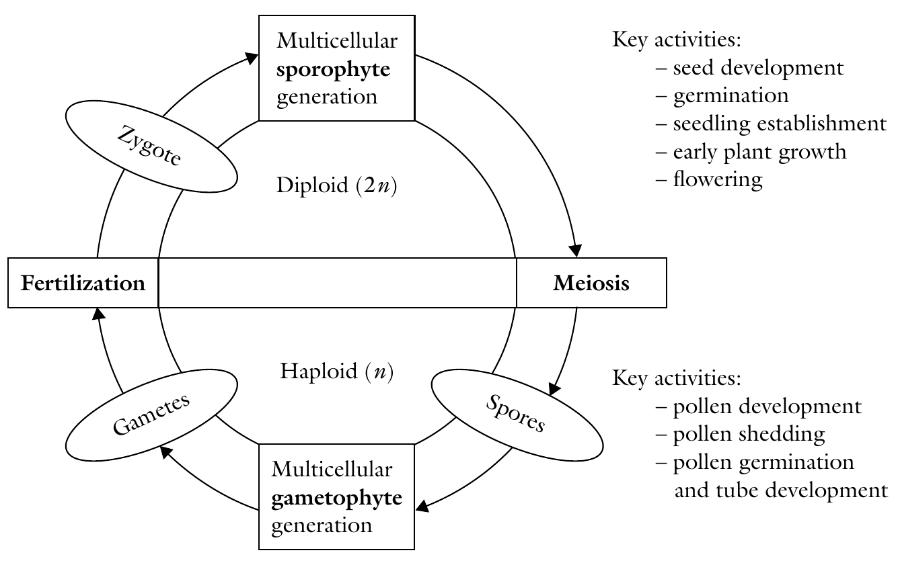
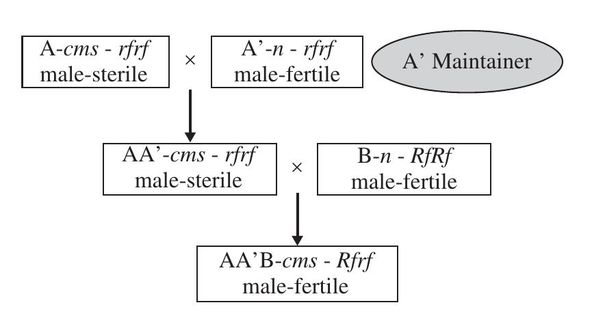

```{r,setup, include=FALSE}
library(knitr)
require(tidyverse)
set.seed(453)
# invalidate cache when the package version changes
knitr::opts_chunk$set(tidy = FALSE, echo = FALSE, 
                  message = FALSE, warning = FALSE,
                  out.width = "45%", cache = TRUE)
options(knitr.table.format = "latex")
options(knitr.kable.NA = "", digits = 2)
options(kableExtra.latex.load_packages = FALSE)
```

# Introduction

##

```{r maize, fig.cap="Inbred line of maize", fig.align='center', out.width="50%"}

```

## Sexual reproduction

- Involves fusion of (haploid) male and (haploid) female gamete.
- Gametes may be derived either from two different parents or from a single parent.
- Sexual reproduction is reliant on the process of meiosis. Involves
  - Megaspores within the ovule of the pistil
  - Microspores within the stamen
- Typical meiotic division of a female diploid species will result in formation of four haploid megaspores (*Megasporogenesis*).
- With analogy: *Microsporogenesis*

##

- Male gametophyte generation is a tiny pollen tube and three haploid nuclei (*microgametophyte*)
- Female gametophyte is a single multinucleated cell, also called the embryo sac (*megagametophyte*, aka embryo sac).
- Female gametophyte contains the egg cell and central cell that become fertilized and give rise to the embryo and endosperm of the seed, respectively. 
- It's development begins early in ovule development with the formation of a diploid megaspore mother cell that undergoes meiosis. One resulting haploid megaspore then develops into the female gametophyte.

##

\bcolumns
\column{0.5\textwidth}

```{r plant-fertilization, fig.cap="Fertilization in self pollinated plants.", fig.align='center', out.width="85%"}
# pdftools::pdf_convert("./references_plb/Rolf H. J. Schlegel - Encyclopedic Dictionary of Plant Breeding and Related Subjects-The Food Products Press (2003).pdf", pages = 563, format = "png", filenames = "./images/fertilization_in_self_pollinated_species.png", dpi = 300)
knitr::include_graphics("./images/fertilization_in_self_pollinated_species.png")
```

\column{0.5\textwidth}

<!-- Source: Fertilization-Mechanisms-in-Flowering-Plants_2016_Current-Biology -->
<!-- The text is available in the `literatures/` -->

```{r gametophyte-male, fig.cap="Haploid male gametophyte (pollen) of Arabidopsis comprising the vegetative cell (producing the growing pollen tube) and two non-motile sperm cells enclosed within the membrane of the vegetative tube cell.", out.width="64%", fig.align='center'}

```


```{r gametophyte-female, fig.cap="pollen tube approaching the Arabidopsis ovule. The tube grows along the funiculus, through the micropyle of the ovule and towards the haploid female gametophyte that comprises the egg cell, central cell and accessory cells (synergid and antipodal cells).", out.width="55%"}

```

\ecolumns

##

<!-- ```{r sporogenesis, fig.cap="Alternation of generation in Maize showing reproductive development and physiology.", out.width="38%", fig.align='center'} -->
<!--  -->

<!-- # https://www.ncbi.nlm.nih.gov/pmc/articles/PMC3268550/ has more info on female gametophyte -->
<!-- ``` -->

```{r alternation-generation, fig.cap="Alternation of generations", fig.align='center', out.width="60%"}
# pdftools::pdf_convert("./references_plb/Principles of Plant Genetics and Breeding.pdf", pages = 110, format = "png", filenames = "./images/alternation_of_generations.png", dpi = 300)

```


# Modes of reproduction

## Autogamy/Self-pollination

- Mechanisms that promote autogamy
  - Cleistogamy (flower fails to open)/Chasmogamy (opening of flower after pollination)
  - Proximity of anther
- Mechanisms that prevent autogamy
  - Self incompatibility, male sterility and dichogamy

<!-- - Refer to -->
<!--   - Chapter 2 on 'Reproductive barriers: Identification, uses and circumvention', Plant Breeding Reviews, Volume 11. -->
<!--   - Chapter 2 on 'Molecules involved in self-incompatibility in flowering plants'  -->

# Self incompatibility (lack of self-fruitfulness)

##

- A condition in which the pollen from a flower is not receptive on the stigma of the same flower, and hence incapable of setting seed.
- Both pollen and ovule development are normal and viable. 
- It is caused by a genetically controlled physiological hindrance to self-fertilization. 
- Self incompatibility is widespread in nature, occurring in families such as Poaceae, Cruciferae, Compositae, and Rosaceae.
- The incompatibility reaction is genetically conditioned by a locus designated *S*, with multiple alleles that can number over 100 in some species such as *Trifolium pretense*. 
- Unlike monoecy and dioecy, all plants produce seed in self-incompatible species.

## Systems of SI: Heteromorphic

- Caused by heterostyly
- Pin (long styles and short anthers) and thrum (long anthers and short styles; e.g., primula)
- Pin conditioned by genotype ss, and thrum by Ss.
- Cross ss x ss as well as Ss x Ss is incompatible
- But ss x Ss or SS x ss is compatible
- The condition is called distyly

## Systems of SI: Homomorphic

### Gametophytic incompatibility (originally called the oppositional factor system)

- The ability of the pollen to function is determined by its own genotype and not the plant that produces it.
- This form of SI is more widespread (e.g. red clover, white clover and yellow sweet clover)
- Controlled by a series of alleles at a single locus ( _S1_, _S2_, _S3_ ... _Sn_ )
- The alleles of the incompatibility gene(s) act individually in the style.
- Alleles exhibit no dominance
- Incompatible pollen is inhibited in the style.
- The pistil is diploid hence contains two incompatibility alleles (e.g., _S1_ _S3_, _S3_ _S4_). Reactions occur if identical alleles in both pollen and style are encountered. Only heterozygotes for _S_ alleles are produced in this system.

## 

### Sporophytic incompatibility

- The incompatibility characteristics of the pollen are determined by the plant (sporophyte) that produces it.
- It occurs in species such as broccoli, radish, and kale. 
- The sporophytic system differs from the gametophytic system in that the _S_ allele exhibits dominance. 
- Also, it may have individual action in both pollen and style, making this incompatibility system complex. 
- The dominance is determined by the pollen parent. 
- Incompatible pollen may be inhibited on the stigma surface. 
- For example, a plant with genotype _S1_ _S2_ where _S1_ is dominant to _S2_, will produce pollen that will function like _S1_. Furthermore, _S1_ pollen will be rejected by an _S1_ style but received by an _S2_ style. Hence, homozygotes of _S_ alleles are possible.

##

<!-- ```{r incompatibility-systems, fig.cap="Sporophytic and gametophytic SI systems; Types of self-incompatibility: (a) sporophytic and (b) gametophytic. Sporophytic incompatibility occurs in families such as Compositae and Cruciferae. It is associated with pollen grains with two generative nuclei, whereas gametophytic incompatibility is associated with pollen with one generative nucleus in the pollen tube as occurs in various kinds of clover.", out.width="45%", fig.align='center'} -->
<!-- # pdftools::pdf_convert("./references_plb/Principles of Plant Genetics and Breeding.pdf", pages = 115, format = "png", filenames = "./images/incompatibility_systems.png", dpi = 300) -->
<!--  -->
<!-- ``` -->

```{r si-comparison-reaction1}
incompatibility_systems <- read_csv("./data/incompatibility_systems.csv", comment = "#", 
                                    skip = 5)
incompatibility_systems[1:14,] %>% 
  rename_all(list(~str_replace_all(., "_", " "))) %>% 
  knitr::kable(booktabs = TRUE, caption = "Incompatibility reactions of different mating combinations in a mono- and digenic cross.") %>% 
  kableExtra::kable_styling(latex_options = "striped", font_size = 6) %>% 
  kableExtra::column_spec(column = 2:9, width = c("4em", "4em", "4em", "6em", 
                                                  "8em", "8em", "6em", "8em")) %>% 
  kableExtra::footnote(general = c("Suppose there are incompatibility conditioning genes S and Z", 
                                   "Two genes could have alleles S1, S2, S3, S4… and Z1, Z2, Z3, Z4,…", 
                                   "Under SSI system, dominance relation holds: S1>S2>S3 and Z1>Z2>Z3."), general_title = "Assumptions:")
```

##

```{r si-comparison-reaction2}
incompatibility_systems[15:28,] %>% 
  rename_all(list(~str_replace_all(., "_", " "))) %>% 
  knitr::kable(booktabs = TRUE, 
               caption = "Incompatibility reactions (...continued)") %>% 
  kableExtra::kable_styling(latex_options = "striped", font_size = 6) %>% 
  kableExtra::column_spec(column = 2:9, width = c("4em", "4em", "4em", "6em", 
                                                  "8em", "8em", "6em", "8em"))
```

##

### Important remarks

- In **GSI** system:
  - When only one gene is involved, if the pollen genotype is same as either of the alleles of pistill genotype (diploid), incompatibility occurs, irrespective of pollent parent genotype.
  - When two genes are involved, both genes of the pollen genotype (haploid) should have corresponding copies of same alleles of both genes in pistil genotype for incompatibility to occur.
  - In rice, multilocus GSI system takes effect. Both loci are unlinked and multi-allelic.
- In **SSI** system, reaction is complete. Either all combinations of gamete are compatible or they are all incompatible. Hence, this system leads to all or nothing.

## Expression of SI
  
1. The germination of the pollen may be decreased (e.g., in broccoli); Removing the stigma allows normal pollen germination.
2. Pollen germination is normal but pollen tube growth is inhibited in the style (e.g., tobacco). 
3. The incompatibility reaction occurs after fertilization (e.g., in _Gesteria_). This mechanism is rare.

## Implications of SI

- Presence of this system may be exploited to facilitate some breeding methods. 
- Self-incompatibility promotes heterozygosity. Consequently, selfing self-incompatible plants can create significant variability from which a breeder can select superior recombinants.
- Overcoming:
  - Removal of the stigma surface
  - Early pollination
  - Lowering the temperature
- Self-incompatibility may be used to breed for F1 hybrids, synthetics, triploids. First, however, homozygous lines must be developed.
- Sporophytic incompatibility is widely used in breeding of cabbage and other Brassica species. 
- The single cross hybrids are more uniforms and easier to produce. 
- The top cross is commonly used. A single self-incompatible parent is used as female and is open-pollinated by a desirable cultivar as pollen source.

##

```{r si-use-sc, fig.cap="Application of self-incompatibility in practical plant breeding (A)", out.width="50%", fig.align='center'}
# pdftools::pdf_convert("./references_plb/Principles of Plant Genetics and Breeding.pdf", pages = 118, format = "png", filenames = "./images/incompatibility_use.png", dpi = 300)
knitr::include_graphics("./images/incompatibility_use_SC.png")
```

##

```{r si-use-dc, fig.cap="Application of self-incompatibility in practical plant breeding (B)", out.width="50%", fig.align='center'}
# pdftools::pdf_convert("./references_plb/Principles of Plant Genetics and Breeding.pdf", pages = 118, format = "png", filenames = "./images/incompatibility_use.png", dpi = 300)

```

##

```{r si-use-tc, fig.cap="Application of self-incompatibility in practical plant breeding (C)", out.width="50%", fig.align='center'}
# pdftools::pdf_convert("./references_plb/Principles of Plant Genetics and Breeding.pdf", pages = 118, format = "png", filenames = "./images/incompatibility_use.png", dpi = 300)

```

# Male sterility

##

- Male sterility is a condition in plants whereby the anthers or pollen are non-functional. Male sterility also enforces cross-pollination.
  - as absence of or extreme scarcity of pollen, 
  - severe malformation or absence of flowers or stamens, or failure of pollen to dehisce. 
  - Similarly, it can be exploited as a tool to eliminate the need for emasculation for producing hybrid seed.
 
## Kinds of sterility based on the origin of the abnormality

1. True male sterility - This is due to unisexual flowers that lack male sex organs (dioecy and monoecy), or bisexual flowers with abnormal or non-functional microspores (leading to pollen abortion).
2. Functional male sterility - The anthers fail to release their contents even though the pollen is fertile.
3. Induced male sterility - Plant breeders may use chemicals to induce sterility.

## Genetic male sterility

- Genetic (nuclear, genic) male sterility is widespread in plants. The gene for sterility has been found in species including barley, cotton, soybean, tomato, potato, and lima bean. 
- It is believed that nearly all diploid and polyploidy plant species have at least one male sterility locus.
- May be manifested as pollen abortion (pistillody) or abnormal anther development.
- Genetic male sterility is often conditioned by a single recessive nuclear gene, _ms_, the dominant allele, _Ms_, conditioning normal anther and pollen development. 
- In alfalfa, however, two independently inherited genes have been reported
- The expression of the gene may vary with the environment. But to be useful, the system must be stable

## Maintainance of GMS system

- The breeder cannot produce and maintain a pure population of male sterile plants. 
- The genetically male sterile types ( _msms_) can be propagated by crossing them with a heterozygous pollen source ( _Msms_).
  - What is the result of cross ?
- Breeders will always harvest 50% male sterile plants by harvesting only the male sterile plants.
- How to identify sterile from non sterile ? 
  - Bright green hypocotyls in broccoli, leaf shape of potato and green stem in tomato

<!-- - This system, where conditional nuclear recessive male sterile rice female plants cross with any normal rice line resulting in the production of fertile hybrid seed, is considered as the 2 line system. -->
<!-- - This technique (aka 2G technology) is limited by the fact that nuclear male sterility requires strict temperatures both for female line propagation and F1 hybrid seed production. -->

<!-- (Refer to Youtube media on Development of Hybrid Seed Production Technology for Rice and Wheat by Xing Wang Deng.) -->

##

```{r gms-use, fig.cap="Genetic male sterility as used in practical breeding", out.width="50%", fig.align='center'}
# pdftools::pdf_convert("./references_plb/Principles of Plant Genetics and Breeding.pdf", pages = 118, format = "png", filenames = "./images/gms_use.png", dpi = 300)

```

## Cytoplasmic male sterility

<!-- (Refer to Chapter 2 on Molecular Biology of Cytoplasmic Male Sterility, Plant Breeding Reviews, Volume 10.) -->

- Sometimes, male sterility is controlled by the cytoplasm (mitochondrial gene) but may be influenced by nuclear genes. 
- A cytoplasm without sterility genes is described as normal (N) cytoplasm, while a cytoplasm that causes male sterility is called a sterile ( _s_) cytoplasm or said to have cytoplasmic male sterility (CMS).
- Transmitted through the egg only (maternal factor).
- Has been found in species including corn, sorghum, sugar beet, carrot, and flax. 
- The condition has been induced in species such as sorghum by transferring nuclear chromosomes into a foreign cytoplasm. 
- Has real advantages in breeding ornamental species because all the offspring is male sterile, hence allowing them to remain fruitless.

##

```{r cms-use, fig.cap="Cytoplasmic male sterility as applied in plant breeding (N, normal cytoplasm; s, sterile cytoplasm).", out.width="50%", fig.align='center'}
# pdftools::pdf_convert("./references_plb/Plant Breeding, 2nd Edition (2014).pdf", pages = 76, format = "png", filenames = "./images/cms_use.png", dpi = 300)

```

##

- Hybrid seed production using CMS requires three types of genotypes;   - male fertile lines (called *B* lines; maintained by selfing) with no cytoplasmic male sterility genes and which are homozygous for a dominant restorer gene (i.e. normal ( _n_) cytoplasm, _RfRf_);
  - cytoplasmic sterile female lines with male sterile cytoplasm but with no restorer genes (called *A* lines; maintained by crossing with isogeneic cytoplasmic male fertile line);
  - 'male-fertile' female lines (called *A'* lines or *A'* maintainer
lines; maintained by selfing) with normal cytoplasm and no restorer genes.

## Cytoplasmic-genetic male sterility

- Cytoplasmic male sterility may be modified by the presence of fertility-restoring genes in the nucleus. 
- CMS is rendered ineffective when the dominant allele for the fertility-restoring gene ( _Rf_) occurs, making the anthers able to produce normal pollen.
- CMS is transmitted only through the egg, but fertility can be restored by _Rf_ genes in the nucleus. 
- Three kinds of progeny are possible following a cross, depending on the genotype of the pollen source. 
- The resulting progenies assume that the fertility gene will be responsible for fertility restoration.

<!-- - This (also called the 1G technology) is a system wherein the cytoplasmic male sterile rice female plants cross with a genetically defined restorer line, resulting in the production of fertile hybrid F1 seeds. -->
<!--   - This CMS system requires strict requirement of the CMS-specific nuclear fertility restoring genes, severely limiting the rice germplasm utilization for paternal lines. -->

<!-- - A new 3G technology based hybrids are being tested in Rice and Wheat in China. The technique is based on introgression of at least 3 sets of genes to maintainer line -- Heterogyote combination of wild type sterility (MS, which gives fertile phenotypes) and mutant sterility (ms, this was first screened out in mutatant study) locus, Pollen abortion/ablation locus and Color imparting marker locus. All these genes are tightly linked and transformed into a suitable maintainer from single construct using transgenesis. The maintainer can be selfed to segregate into sterile female line and maintainer line. -->

<!-- (Refer to Youtube media on Development of Hybrid Seed Production Technology for Rice and Wheat by Xing Wang Deng.) -->

##

```{r cgms-systems, fig.cap="The three systems of cytoplasmic genetic male sterility. The three factors involved in CMS are the normal cytoplasm (N), the male sterile cytoplasm (S), and the fertility restorer (Rf, rf).", out.width="30%", fig.align='center'}
# pdftools::pdf_convert("./references_plb/Principles of Plant Genetics and Breeding.pdf", pages = 119, format = "png", filenames = "./images/cgms_systems.png", dpi = 300)

```

## Dichogamy (mechanism enforcing cross pollination)

- Dichogamy is the maturing of pistils and stamens of a flower at different times.
  - Protogyny (stigma is receptive before the anther is mature to release the pollen)
  - Protandry (pollen is released from the anther before the female is receptive).

# Asexual reproduction

##

- Production of offsprings that are genetically identical to the mother plant, and plants that are produced this way are called *clones*.
- Two methods of asexual reproduction
  - Reproduction through plant parts
  - Reproduction through apomixis

(Refer to Chapter 1 on 'Apomixis: Genetics and Breeding', Plant Breeding Reviews, Volume 18.)

## Reproduction through plant parts

- A *bulb* is a modified shoot consisting of a very much shortened stem enclosed by fleshy leaves (e.g. a tulip or an onion).
- A *corm* is a swollen stem base bearing buds in the axils of scale-like remains of leaves from the previous year's growth (e.g. gladiolus).
- A *cutting* is an artificially detached part of a plant used as a means of vegetative propagation.
- A *rhizome* is an underground stem with buds in the axils of reduced leaves (e.g. mint or couch grass).
- A *stolon* is a horizontally growing stem that roots at nodes (e.g. strawberry runners).
- A *tuber* is a swollen stem that grows beneath the soil surface bearing buds (e.g. potato).

## Reproduction by apomixis

- Asexual production of plant seeds can occur in obligate and facultative apomicts.
- In facultative apomicts most seeds are asexually produced, since sexual reproduction can occur.
- Apomixis arises by following mechanisms (based on which cells are responsible for producing an embryo)
  - Androgenesis (from the sperm nucleus of a pollen grain)
  - Apospory (from somatic ovary cells)
  - Diplospory (from 2n megaspore mother cell)
  - Parthenogenesis (Egg cell without fertilization)
- In many cases, pollination must occur (pseudogamy) if viable apomictic seeds are to be formed.

##

<!-- Contents from Page 14, Plant Breeding, Biometry and Biotechnology (2020). -->

\begin{center}
\tikzstyle{block}=[rectangle,draw,fill=blue!20,text width=2cm, text centered, rounded corners, minimum height=3em]
\tikzstyle{rect}=[rectangle, draw=red, fill=orange!50, minimum width=2cm, minimum height=1cm, text centered]
\tikzstyle{line}=[draw, -latex]

% node distance will position the anchored nodes in the 'vertical' and 'horizontal' distances, respectively
\begin{tikzpicture}[node distance=0.5cm and 0.5cm]

\node[rect] (init) {Apomixis};

\node[block, below left=of init] (androgenesis) {Androgenesis};
\node[block, below right=of init] (parthenogenesis) {Parthenogenesis};
\node[block, right=of parthenogenesis] (diplospory) {Diplospory};
\node[block, left=of androgenesis] (apospory) {Apospory};

\path[line] (init) -| (androgenesis);
\path[line] (init) -| (parthenogenesis);
\path[line] (init) -| (diplospory);
\path[line] (init) -| (apospory);

\end{tikzpicture}

\end{center}


# Reproductive options in plants

## 

\begin{block}{\footnotesize Hermaphrodity versus unisexuality}
\scriptsize
Hermaphrodites have both male and female sexual organs, and hence may be capable of self fertilization. On the other hand, unisexuals, having one kind of sexual organ, are compelled to cross-fertilize. Each mode of reproduction has genetic consequences. Hermaphrodity promotes a reduction in genetic variability, whereas unisexuality, through cross-fertilization, promotes genetic variability.
\end{block}

\begin{block}{\footnotesize Self-pollination versus cross-pollination}
\scriptsize
Hermaphrodites that are self-fertile may be self pollinated or cross-pollinated. In terms of pollen donation, a species may be autogamous (pollen comes from the same flower - selfing) or allogamous (pollen comes from a different flower). There are finer differences in these types. For example, there may be differences between the time of pollen shed and stigma receptivity.
\end{block}

\begin{block}{\footnotesize Self-fertilization versus cross-fertilization}
\scriptsize
Just because a flower is successfully pollinated does not necessarily mean fertilization would occur. The mechanism of self-incompatibility causes some species to reject pollen from their own flowers, thereby promoting outcrossing.
\end{block}

\begin{block}{\footnotesize Sexuality versus asexuality}
\scriptsize
Sexually reproducing species are capable of providing seed through sexual means. Asexuality manifests in one of two ways - vegetative reproduction (in which no seed is produced) or agamospermy (in which seed is produced).
\end{block}

# Manipulation of flowering and pollination (case of root/tuber crops)

```{r manipulation-flowering-pollination, out.width="60%", fig.align='center'}
# pdftools::pdf_convert("../literatures/Floral biology and pollination efficiency of Dioscorea.pdf", pages = 15, format = "png", filenames = "pollination_control_root_tuber.png", dpi = 240)

```


# Types of cultivars/varieties

##

- Cultivar types include pure-lines, hybrids, clones, open-pollinated populations, composite-crosses, synthetics and multilines. 
- It is difficult, if not impossible to develop a pure-line cultivar of a crop species like potato ( _Solanum tuberosum_ ) as it is mainly reproduced vegetatively, and has many deleterious (or lethal) recessive alleles. 
- Similarly, pea ( _Pisum sativum_ ) is almost an obligate self-pollinator and so it would be difficult to develop hybrid pea, if nothing else seed production is likely to be expensive.

## Pure-line cultivars

- Pure-line cultivars are homozygous, or near-- homozygous, lines.
- Can be produced most readily in naturally self-pollinating species.
- It is generally accepted that it is normally one in which the line is homozygous for the vast majority of its loci (usually 90% or more)
- Commonly developed by inbreeding the species through continuous selfing of hybrid generated from crossing for 6-7 generations to the point where line is considered to be "commercially true breeding"
- Alternatively, doubled haploid lines may to generated

##

```{r predominantly-self-pollinated, tidy=FALSE}
self_pollinated <- readxl::read_xlsx("./data/03-modes_of_reproduction_and_pollination_control.xlsx", sheet = "predominantly_self")

self_pollinated %>% 
  mutate_at("Scientific name", function(x){
    str_c("\\textit{", x, "}")
  }) %>% 
  knitr::kable(caption = "Commonly self pollinated crops", booktabs = TRUE, escape = FALSE) %>% 
  kableExtra::kable_styling(font_size = 6)
```

## Open pollinated cultivars

\bcolumns
\column{0.5\textwidth}

```{r openpollinated, fig.cap="Open pollinated", fig.show='hold', out.width="85%"}

```

\column{0.5\textwidth}

```{r open-pollinated-onion, fig.align='center', fig.cap="Open pollinated crops", out.width="90%"}


```

\ecolumns

##

\small
- Heterogenous populations comprised of different plants which are genetically non-identical.
- Also heterozygous
- Almost exclusively from cross pollinating species
- Stable for character of interest
- e.g.: Onions, rye, herbage grass, non-hybrid sweetcorn, sugar beet and oil palm 

\begin{figure}
  \begin{columns}[T,onlytextwidth]

  \column{.75\linewidth}
  \begin{center}
  \includegraphics[width=0.70\linewidth]{./images/open_pollination_corn.PNG}
  \end{center}
  
  \column{.25\linewidth}
  \caption{\newline Open pollinated plant of corn and its progeny. (A) Plant from an open-pollinated variety. (B) Ear from open-pollinated plant. Each kernel came from a separate fertilization. The kernels are related from the female side but may be quite unrelated on the male side, the pollen having come from many plants within the field. (C) Plants grown from seed of an open-pollinated variety of corn. The plants vary in height, size of ear, etc., but on the average retain the generla type of the parent variety.}
  \label{fig:open-pollination-corn}
  
  \end{columns}
\end{figure}


## Hybrid

- Hybrid cultivars have different leves of homogeneity but, importantly are highly heterozygous.
- Exploits the phenomenon of heterosis 
- Variants exist:
  - Single cross
  - Double cross
  - Three way cross
- Is one of the most complex of breeding methods
  - Inbred line development
  - Test cross comparison
  - Selection and hybridization

## Clonal cultivars

- Clonal cultivars are genetically uniform but tend to be highly heterozygous
- Uniformity of plant types is maintained through vegetative rather than sexual reproduction.
- Cultivars are vegetatively propagated by asexual reproduction (cloning) including 
  - cuttings, 
  - tubers, 
  - bulbs, 
  - rhizomes,
  - grafts 
- A cultivar can also be classified as a clone if it is propagated through obligate apomixis (e.g. buffelgrass)
- Genetic constitution of cloned selection remains 'fixed'
- e.g.: Potatoes, Bananas, Peaches, Apples, Cassava, Sugarcane, Strawberries, Blueberries and Chrysanthemums. 

# Xenia effect

##

\bcolumns
\column{0.6\textwidth}
\footnotesize
- Immediate effect of pollen on the developing kernel
- May be observed when two varieties differing in a single visible endosperm trait are crossed.
- When yellow corn pollen fertilizes an ovule of white corn, a light-yellow kernel develops; when white corn pollen fertilizes an ovule of yellow corn, a medium-yellow kernel develops.
- Phenomena results $\because$ the yellow color is found only in the vitreous starch of the endosperm (as may be observed by cutting a kernel of yellow corn lengthwise).
- Endosperm develops from the fusion of the second sperm with the diploid polar nuclei and has a triploid chromosome number.
- The yellow endosperm color is conditioned by a dominant gene ($Y$). The recessive alleles ($yy$) produce a white endosperm.
- Endosperm receives two genes for Y, or y, depending upon the character of the mother plant, to one gene for Y, or y, from the pollen. Possible combinations are given in Table \ref{tab:xenia-effect}.
- Endosperm characteristics such as starchy vs. sugary (dominant) endosperm, non-shrunken vs. shrunken endosperm, and nonwaxy vs. waxy endosperm also exhibit Xenia effects.

\column{0.4\textwidth}

```{r xenia-effect}
endosperm_properties <- tribble(
  ~"Endosperm color genes in polar nuclei", ~"Positive", ~"Endosperm color genes in the sperm", ~"Endosperm color genes and xenia effect in endosperm",
  "YY", "+", "Y", "YYY (deep yellow)",
  "YY", "+", "y", "YYy (medium yellow)",
  "yy", "+", "Y", "Yyy (light yellow)",
  "yy", "+", "y", "yyy (white)"
)

endosperm_properties %>% 
  knitr::kable(booktabs = TRUE, caption = "Endosperm color genes and Xenia effect in endosperm.", col.names = str_replace_all(colnames(.), "Positive", " ")) %>% 
  kableExtra::kable_styling(font_size = 5) %>% 
  kableExtra::column_spec(column = 1:4, width = c("6em", "2em", "7em", "8em"))
```

\ecolumns

<!-- - Xenia occurs when the trait difference is conditioned by a dominant gene present in the pollen. However, when dominance is incomplete, xenia would occur when either vareity is the pollen parent. -->

<!-- - Whereas xenia may result from simple dominance gene action, the effect is different in some instances. In the cross of flinty x floury endosperm, the F1 is flinty (FFf). However, the reciprocal cross of floury x flinty endosperm produces an F1 with floury endosperm (ffF), indicating the ineffectiveness of the dominant allele (F) to overcome the double recessive (rr) floury genes. Similarly, xenia in aleurone color depends on the combined action of five dominant genes (designated A1, A2, C, R, and Pr). -->

# Bibliography
