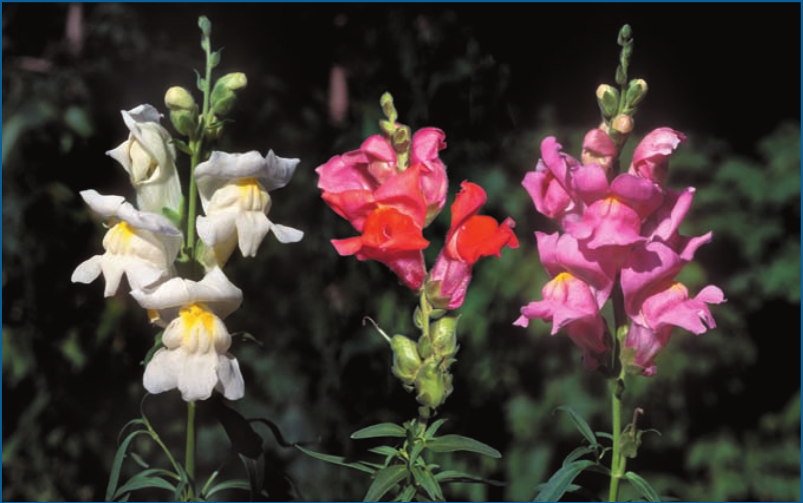
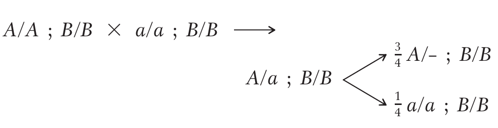
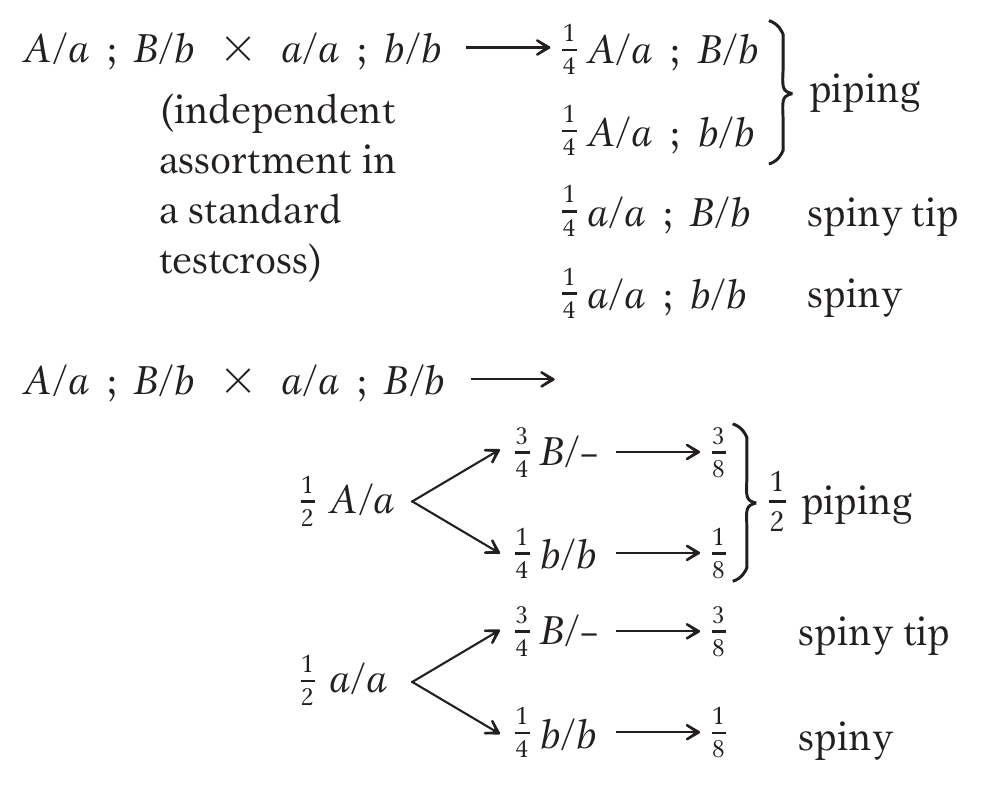

```{r setup, include=FALSE}
require(tidyverse)
options(htmltools.dir.version = FALSE)
options(knitr.kable.NA = "", digits = 3)
knitr::opts_chunk$set(tidy = FALSE, echo = FALSE)
```

class: inverse, center, middle

# Inheritance of traits

---

# Background

- The character may be simply inherited or complex inherited with effect of many genes at different loci, each contributing a small effect to phenotypic expression of the character
  1. Qualitative characters
  2. Quantitative characters
  
- Study of inheritance of most characters/phenotypes can be classified into:
  1. Easily distinguished into discrete classes 
    - barley plants may be 
      - black or white hulled 
      - two or six rowed 
      - rough or smooth awned 
      - rust resistanct or rust susceptible
      
  2. Cannot be easily classified into discrete classes
    - for grain yield $kg~ha^{-1}$
      - thousand grain weight (gram), 
      - plant height (cm) variation may be differing by small units
---

background-image: url(./images/Pea_lathyrus_odoratus_flower.jpg)
background-position: 50% 50%
background-size: 70%
class: inverse, middle, center

# Qualitative and quantitative inheritance

---

## Quantitative inheritance

- Most of the important variation displayed by nearly all plant traits affecting growth, development and reproduction, is quantitative.
- Also called: *Continuous*, *Polygenic variation*, *Multiple gene controlled traits*
- Demonstrate same basic Mendelian properties for a gene, and also the Hardy-Weinberg equilibrium.
- Quantitative characters are governed by several genes; each gene has a small effect, which is usually cumulative.
- The environments considerably affect these characters.
- Quantitative characters often show continuous variation with normal distribution

---

## Qualitative inheritance

- Mendel purposed the law of inheritance based on his studies with qualitative characters. 
- In the studies of qualitative inheritance, we study phenomena such as:
  1. Dominance, 
  2. Segregation  and independent assortment, 
  3. Gene action and interactions (Epistatis, Masking gene action, Duplicate gene action, Complementary gene action, Additive gene action, Inhibiting gene action, Modifying gene action and Pleiotropy).
  4. Penetrance and expressivity
  5. Linkage

---

```{r incomplete-dominance, fig.cap="Qualitative inheritance (incomplete dominance); In snapdragons, a heterozygote is pink, intermediate between the two homozygotes red and white. The pink heterozygote demonstrates incomplete dominance.", fig.align='center', out.height="400px", out.width="auto"}
# pdftools::pdf_convert("./../../references_plb/An Introduction to Genetic Analysis-W. H. Freeman (2015).pdf", pages = 245, format = "png", filenames = "./images/incomplete_dominance.png", dpi = 300)


```

---

## Difference between quantitative and qualitative traits

```{r tidy=FALSE}
difference_qualquant <- readxl::read_xlsx("./data/04-qualitative_and_quantitative_characters.xlsx", sheet = "qual_quant")

knitr::kable(
  difference_qualquant, 
  caption = "Difference between qualitative and quantitative traits",
  format = "html"
) %>% 
  kableExtra::kable_styling(font_size = 14, bootstrap_options = "striped")
```

---

- Nature of traits: Qualitative genetics is concerned with traits that have Mendelian inheritance and can be described according to kind and, as previously discussed, can be unambiguously categorized. Quantitative genetic traits are described in terms of the degree of expression of the trait, rather than the kind.

- Scale of variability: Qualitative genetic traits provide discrete (discontinuous) phenotypic variation, whereas quantitative genetic traits produce phenotypic variation that spans the full spectrum (continuous).

- Number of genes: In qualitative genetics, the effects of single genes are readily detectable, while in quantitative genetics single gene effects are not discernible. Rather, traits are under polygenic control (genes with small indistinguishable effects).

---

- Mating pattern: Qualitative genetics is concerned with individual matings and their progenies. Quantitative genetics is concerned with a population of individuals that may comprise of a diversity of mating kinds.

- Statistical analysis: Qualitative genetic analysis is quite straight forward; it is based on counts and ratios. On the other hand, quantitative analysis provides estimates of population parameters (attributes of the population from which the sample was obtained).

---
class: inverse, center, middle

# Penetrance and expressivity

---

## Penetrance

- The ability of a gene to express itself in the individuals carrying it in the appropriate genotype. 
- Generally, oligogenes express themselves in all individuals that carry them and their expression is fairly uniform.
- But some oligogenes fail to express themselves in some individuals carrying them and are said to have incomplete penetrance. 
- Gene expressing itself in every individuals that carries it is said to have complete penetrance.

---

- In the analysis of single-gene inheritance, there is a natural tendency to choose mutants that produce clear Mendelian ratios. In such cases, we can use the phenotype to distinguish mutant and wild-type genotypes with almost 100 percent certainty. In these cases, we say that the mutation is 100 percent penetrant into the phenotype. However, many mutations show incomplete penetrance: that is, not every individual with the genotype expresses the corresponding phenotype. Thus, penetrance is defined as the percentage of individuals with a given allele who exhibit the phenotype associated with that allele.

- Reasons for incomplete penetrance: 
  1. The influence of the environment
  2. The influence of other interacting genes
  3. The subtlety of the mutant phenotype

---

```{r penetrance, fig.cap="In this human pedigree of a dominant allele that is not fully penetrant, person Q does not display the phenotype but passed the dominant allele to at least two progeny. Because the allele is not fully penetrant, the other progeny (for example, R) may or may not have inherited the dominant allele.", fig.align='center', out.height="400px", out.width="auto"}
# pdftools::pdf_convert("./../../references_plb/An Introduction to Genetic Analysis-W. H. Freeman (2015).pdf", pages = 266, format = "png", filenames = "./images/incomplete_penetrance.png", dpi = 300)
knitr::include_graphics("./images/incomplete_penetrance.png")
```

---

## Expressivity

- The ability of a gene to express itself uniformly in all individuals that carry it in the appropriate genotype.
- A gene that expresses itself uniformly in all individuals has uniform expressivity while those that are unable to do so have variable expressivity. 
- Expressivity measures the degree to which a given allele is expressed at the phenotypic level; that is, expressivity measures the intensity of the phenotype. For example, "brown" animals (genotype b/b) from different stocks might show very different intensities of brown pigment from light to dark. As for penetrance, variable expressivity may be due to variation in the allelic constitution of the rest of the genome or to environmental factors.
- Expressivity is indicated as variable or uniform.

---

```{r expressivity, fig.cap="Assume that all the individuals shown have the same pigment allele (P) and possess the same potential to produce pigment. Effects from the rest of the genome and the environment may suppress or modify pigment production in any one individual. The color indicates the level of expression.", fig.align='center', out.height="400px", out.width="auto"}
# pdftools::pdf_convert("./../../references_plb/An Introduction to Genetic Analysis-W. H. Freeman (2015).pdf", pages = 266, format = "png", filenames = "./images/penetrance_expressivity.png", dpi = 300)
knitr::include_graphics("./images/penetrance_expressivity.png")
```

---

## Effect in selection

- Incomplete penetrance and variable expressivity confuse the relation between genotype and phenotype. - Consequently such genes pose difficulty in selection of desired types.

---
class: inverse, center, middle

# Threshold character

---

- Some genes require specific environment, e.g a particular temperature, for expression. 
- Traits governed by such genes are known as threshold characters.
- For example, a mutant gene in barley produces albino seedlings at temperatures below $8^\circ C$. But when the seedling-carrying gene is grown at $19^\circ C$ or above, they develop into normal green seedlings.
- Incomplete penetrance of some genes may be due to a threshold requirement. 

---
class: inverse, center, middle

# Multiple factor hypothesis

---

## Multiple factor hypothesis<sup>1</sup>

- Many genes with small cumulative effect for any one quantitative character account for bell-shaped normal curve appearance of common traits. The genetic factors responsible for this type of effects were termed as multiple factors.
- Now multiple factor has been replaced by polygene or multiple genes (purposed by Mather). 
- In 1908, Nilsson-Ehle presented experiment evidence to support this hypothesis by studying seed color in wheat and oats (demonstrated an actual segregation and assortment of genes with quantitative effect).
- Nilsson-Ehle crossed two varieties of wheat, one with deep red grain of genotype R1R1R2R2, and the other white grain of genotype r1r1r2r2.
- The distribution of resulting individuals from cross was explained on the basis of two pairs of genes segregating independently, which each dominant allele adding to the intensity of the red color.
- Two or more non allelic genes that affect in similar way of development of a quantitative character are called multiple genes or polygenes.

.footnote[
Refer to Chapter 14: Quantitative inheritance, Genetics, Monroe. M. Strickberger, Page 245
]
---

- According to Nilsson-ehle, there were three individual gene pairs involved in determination of grain color in wheat, i.e., Aa, Bb, Cc, with genes for red (ABC) dominant over genes for white (abc). Each of these three gene pairs segregated in predictable mendelian fashion, so that the products of heterozygotes for any one pair, i.e. Aa x Ax, produced offspring in the ratio 3 red (A\_):1 white (aa). When two gene-pair differences were segregating at the same time in Nilsson-Ehle's experiments, i.e., AaBb x AaBb, the results also followed mendelian principles, producing a ratio 15 red (A\_B\_, A\_bb, aaB\_): 1 white (aabb). Similarly a cross between heterozygotes for three gene paris produced a close fit to the predicted ratio 63 red: 1 white.

---

```{r wheat-experiment}
readxl::read_xlsx("./data/04-qualitative_and_quantitative_characters.xlsx", sheet = "wheat_experiment") %>% 
  knitr::kable(format = "html", caption = "Wheat seed color variation; An example case of multiple factor trait expression") %>% 
  kableExtra::kable_styling(bootstrap_options = "striped", font_size = 12)
```


---
class: inverse, center, middle

# Transgressive segregation

---

- Appearance of features that are unlike either parent.
- Quantitative character of progeny may fall outside the range of parents is called transgressive segregation. 
- Transgressive segregation is used extensively by breeders to obtain segregates following a cross that are superior to the parental strains for traits inherited in a quantitative manner. 

```{r transgressive-segregation, fig.align='center', out.height="300px", out.width="auto"}
knitr::include_graphics("./images/transgressive_segregation.jpg")
```

---

## Problem 1

The leaves of pineapples can be classified into three types: spiny (S), spiny tip (ST), and piping
(nonspiny; P). In crosses between pure strains followed by intercrosses of the F1, the following results appeared:

```{r pinapple-genetics, fig.align='center', out.height="200px", out.width="auto"}
# pdftools::pdf_convert("./../../references_plb/An Introduction to Genetic Analysis-W. H. Freeman (2015).pdf", pages = 270, format = "png", filenames = "./images/pineapple_genetics.png", dpi = 300)
knitr::include_graphics("./images/pineapple_genetics.png")
```

a. Assign gene symbols. Explain these results in regard to the genotypes produced and their ratios.

b. Using the model from part a, give the phenotypic ratios that you would expect if you crossed 
  
  1. the F1 progeny from piping x spiny with the spiny parental stock, and 
  2. the F1 progeny of piping x spiny with the F1 progeny of spiny x spiny tip.

---

## Solution 1

**a**. First, let's look at the F2 ratios. We have clear 3 : 1 ratios in crosses 1 and 2, indicating single-gene segregations. Cross 3, however, shows a ratio that is almost certainly a 12 : 3 : 1 ratio. How do we know this ratio? Well, there are simply not that many complex ratios in genetics, and trial and error brings us to the 12 : 3 : 1 quite quickly. In the 128 progeny total, the numbers of 96 : 24 : 8 are expected, but the actual numbers fit these expectations remarkably well.

One of the principles of this chapter is that modified Mendelian ratios reveal gene interactions. Cross 3 gives F2 numbers appropriate for a modified dihybrid Mendelian ratio, and so it looks as if we are dealing with a two-gene interaction. It seems the most promising place to start; we can return to crosses 1 and 2 and try to fit them in later.

Any dihybrid ratio is based on the phenotypic proportions 9 : 3 : 3 : 1. Our observed modification groups them as follows:

$$
\begin{aligned}
9A/\_;B/\_ &~& 9~piping \\
3A/\_;b/b &~& 3~piping \\
3a/a;B/\_ &~& 3~spiny~tip \\
1a/a;b/b &~& 1~spiny
\end{aligned}
$$
---

So, without worrying about the name of the type of gene interaction (we are not asked to supply this anyway), we can already define our three pineapple-leaf phenotypes in relation to the proposed allelic pairs A/a and B/b:

$$
\begin{aligned}
piping &=& A/\_ (B/b~irrelevant) \\
spiny tip &=& a/a; B/\_ \\
spiny &=& a/a; b/b
\end{aligned}
$$

What about the parents of cross 3? 

The spiny parent must be a/a ; b/b, and, because the B gene is needed to produce F2 spiny-tip leaves, the piping parent must be A/A ; B/B. (Note that we are told that all parents are pure, or homozygous.) The F1 must therefore be A/a ; B/b. Without further thought, we can write out cross 1 as follows:

---

```{r cross1-ab, fig.align='center', out.height="200px", out.width="auto"}
# pdftools::pdf_convert("./../../references_plb/An Introduction to Genetic Analysis-W. H. Freeman (2015).pdf", pages = 270, format = "png", filenames = "./images/cross_ab.png", dpi = 300)

```

```{r cross2-ab, fig.align='center', out.height="200px", out.width="auto"}
# pdftools::pdf_convert("./../../references_plb/An Introduction to Genetic Analysis-W. H. Freeman (2015).pdf", pages = 270, format = "png", filenames = "./images/cross_ab.png", dpi = 300)
knitr::include_graphics("./images/cross2_ab.png")
```

---

We know that the F2 of cross 2 shows single-gene segregation, and it seems certain now that the A/a allelic pair has a role. But the B allele is needed to produce the spiny-tip phenotype, and so all plants must be homozygous B/B:

```{r cross-multiple, fig.align='center', out.height="200px", out.width="auto"}
# pdftools::pdf_convert("./../../references_plb/An Introduction to Genetic Analysis-W. H. Freeman (2015).pdf", pages = 271, format = "png", filenames = "./images/cross_multiple.png", dpi = 300)

```

Notice that the two single-gene segregations in crosses 1 and 2 do not show that the genes are not interacting. What is shown is that the two-gene interaction is not revealed by these crosses - but only by cross 3, in which the F1 is heterozygous for both genes.

---

**b**. Now it is simply a matter of using Mendel's laws to predict cross outcomes:

```{r trait-genetics, fig.align='center', out.height="400px", out.width="auto"}
# pdftools::pdf_convert("./../../references_plb/An Introduction to Genetic Analysis-W. H. Freeman (2015).pdf", pages = 271, format = "png", filenames = "./images/trait_genetics.png", dpi = 300)

```


---

class: inverse, middle, center

# Gene action and interaction

---

## Gene action<sup>2</sup>

### Dominance

### Overdominance

### Additive

## Gene interaction<sup>3</sup>

.footnote[
- Refer to Lecture 10 (Heterosis and inbreeding depression) of Introductory Plant Breeding Course.
- Refer to Lecture 7 (Gene Action and Interaction) of Introductory Genetics course.
]

---
class: center, middle, inverse

# Measurement of continuous variation

---

## Number of genes contributing to a quantitative character

A formula has been purposed for estimating the number of genes n involved in the inheritance of a quantitative character.

$$n = \frac{(\bar{P_1} -\bar{P_2})^2}{8[\sigma_{F_2}^2-\sigma_{F_1}^2]}$$

Where, $\bar{P_1}$ and $\bar{P_2}$ are trait means of inbred parents $P_1$ and $P_2$, respectively. $\sigma_{F_2}^2$ and $\sigma_{F_1}^2$ are standard deviation of $F_2$ and $F_1$, respectively.

---

## Components of variation of a quantitative character

- Quantitative characters are more affected by environments. Thus phenotypic mean may be described according to a mathematical model to facilitate statistical analysis and interpretation:

$$V_{P} = V_{G} + V_{E} + V_{GE}$$

Where,

$V_P$ = Observed phenotypic variance

$V_G$ =  Genotypic variance

$V_E$ = Environmental variance

$V_{GE}$ = Variance due to interaction of Genotype and Environment

---

## Heritability

- To make economically meaningful progress in an organized programme of selective breeding, two conditions must be met;
  - There must be some observable phenotypic variation within the crop. This would normally be expected, even if it were due entirely to the effects of a variable environment.
  - At least some of this phenotypic variation must have a genetic basis.
- This leads to the concept of heritability ( $h^2$), which is the proportion of phenotypic variance that is genetic in origin.
- The values of $h^2$ can range from 0 to 1. If $h^2$ is close to zero, there will be little scope for advancement and there would be little point in trying to improve this character in a plant breeding program. 

---

- There are three main ways of estimating heritability:
  1. Carrying out particular genetic crosses and observing the performance of their progeny so that the resulting data can be partitioned into genetic and environmental components.
  2. Based on the direct measurement of the degree of resemblance between offspring and one, or both, of their parents. This is achieved by regression of the former onto the latter in the absence of selection.
  3. Measuring the response of a population to given levels of selection.

- Dominance model of quantitative inheritance dictates that total genetic variance will contain dominance genetic variance (denoted by $V_D$) and additive genetic variance (denoted by $V_A$). 
- Dominance genetic variance is variation caused by heterozygotes loci in the individuals in the population, whereas additive genetic variance is the variation existing between homozygous loci in the segregating population.

---

## Broad sense heritability

- The total genetic varinace divided by the total phenotypic variance is Broad-sense heritability ( $h_b^2$). 
- This estimation uses the total genetic variance in a additive-dominance model, while the total phenotypic variance is obtained by adding environmental variance to this genetic variance.

$$
h_b^2 = \frac{V_A + V_D}{V_A + V_D + V_E}
\tag{i}
$$

- Dominant genetic variance will be dependent upon the degree of heterozygosity in the population and will differ between fillial generations.

---

## Narrow sense heritability

- A more useful form of heritability for plant breeders, therefore, is *narrow-sense heritability* ( $h_n^2$), which is:

$$
h_n^2 = \frac{V_A}{V_A+V_D+V_E}
\tag{ii}
$$

---

## Variance partitioning of filial generation

- In the first filial generation ( $F_1$), after hybridization between two homozygous parents, there is not genetic variance between individuals of a progeny (they will be genetically alike) and all the variation observed between $F_1$ plants will be entirely environmental. 
- In the generation following ( $F_2$ and forth) there are both genetic and environmental components of phenotypic variance.
- The genetic variance of the $F_2$ generation is:

$$
\sigma_{\bar{F_2}}^2 = \frac{1}{2}V_A + \frac{1}{4}V_D + \sigma_E^2
$$

- Thus broad sense heritability of the $F_2$ generation is:

$$
\label{eqn:hbs-filial}
h_b^2 = \frac{\frac{1}{2}V_A + \frac{1}{4}V_D}{\frac{1}{2}V_A + \frac{1}{4}V_D + \sigma_E^2}
\tag{iii}
$$

- In simple terms, to estimate the $h_b^2$ of $F_2$ family (or any other segregating family), only following estimates are required:

1. Total phenotypic variance (Obtained from measurement on plants within $F_2$ families)
2. Environmental variance (Obtained from measurement on $F_1$ families)

???

1. Note that denominator has variation of simple $V_P = V_A + V_D + V_E$. This is because total phenotypic variation of $F_2$ has larger contribution of environmental and additive components than dominance component.

---

## Partitioning environmental variance

The other generation in which the phenotypic variance is also entirely attributable to environmental effects is the $F_1$. On the other hand, if the phenotypic variances of all these three generations were available, the environmental component of the phenotypic variance of the $F_2$ generation could be estimated as follows (in a simplified way):

$$\sigma_E = \frac{\sigma_{\bar{P_1}}^2 + 2\sigma_{\bar{F_1}}^2 + \sigma_{\bar{P_2}}^2}{4}$$

---

## Partitioning genetic variance

The ratio of additive genetic variance to total phenotypic variance is called the narrow-sense heritability.

$$
h_n^2 = \frac{\frac{1}{2}V_A}{\frac{1}{2}V_A + \frac{1}{4}V_D + V_E}
\tag{v}
$$

In order to estimate $h_n^2$, it is therefore necessary to partition the genetic variance into its two components ( $V_A$ and $V_D$). This is done by considering the phenotypic variance of the two backcross families ( $\sigma_{\bar{B_1}}^2$ and $\sigma_{\bar{B_2}}^2$ ).

Following known relation can be used for estimating genetic components of $F_2$ generation:

$$V_D = 4\left(V_{\bar{B_1}} + V_{\bar{B_2}} - V_{\bar{F_2}} - V_E \right)$$

$$V_A = 2V_{\bar{F_2}} - (V_{B_1} + V_{B_2})$$

???

1. Expressions for both $V_D$ and $V_A$ are derived from known relations:

$$V_{\bar{F_2}} = \frac{1}{2}A + \frac{1}{4}D + V_E$$ and

$$V_{B_1} + V_{B_2} = \frac{1}{2}A + \frac{1}{2}D + 2V_E$$


---

## Estimates of heritability

- Variance based approaches - ratio of variance estimates

$$h_{bs}^2 = \frac{V_G}{V_P} \\ h_{ns}^2 = \frac{V_A}{V_P}$$

- Mean based approaches: 
  
  - realized heritability: If divergence (R) has been estimated and the accumulated effects of selection (S) are known, an estimate for the trait heritability can be calculated. This is known as the realized heritability

$$
h^2 = \frac{R}{S}
$$
  
  - Six generation mean analysis method
		
---

## Parent offspring regression

- This method is based on how much does the resemblance parents and offspring exist. 
- If there is perfect resemblance between parents and offspring, then, $b = 1$ and there is perfect heritable genetic effect. 
- On contrary if there is no resemblance between parents and offspring $b = 0$, and there is no heritable effect but variation is only due to environment.

- Therefore, narrow sense heritability ( $h_{ns}$ )

$$b= h_{ns}^2 = \frac{V_A}{V_P}$$

- If only one parent is known (animal experiments or polycrosses)

$$\begin{eqnarray} b &=& \frac{1}{2}.\frac{V_A}{V_P} \\
h_{ns}^2 &=& 2b 
\end{eqnarray}$$

$b$ = slope of parent offspring regression line

---

```{r heritability-estimates}
readxl::read_xlsx("./data/04-qualitative_and_quantitative_characters.xlsx", "h2_estimates") %>% 
  knitr::kable(format = "html", caption = "Heritability estimates of some common plant architectural traits; Source: Acquaah, 2014") %>% 
    kableExtra::kable_styling(bootstrap_options = "striped")
```

---

## Variance component estimation summary

Variances from additive, dominant and environmental effects may be obtained as follows:

$V_{P1} = E; \quad V_{P2} = E; \quad V_{F1} = E; \quad \frac{V_{P1} + V_{P2} + 2V_{F1}}{4} \sim \frac{V_{P1} + V_{P2} + V_{F1}}{3} = E$

$V_{F2} = \frac{1}{2}A + \frac{1}{4}D + E$

$V_{B1} = \frac{1}{4}A + \frac{1}{4}D + E$

$V_{B2} = \frac{1}{4}A + \frac{1}{4}D + E$

$V_{B1} + V_{B2} = \frac{1}{2}A + \frac{1}{2}D + 2E$

---
class: inverse, middle, center

# Questions

---

## Problem

Consider a field experiment with an inbreeding species such as wheat or barley. Parent 1 included 20 plants, Parent 2 included 20 plants and $F_2$ family derived from selfing of $F_1$ generation, which was obtained by intercrossing the two parents (i.e. Parent 1 x Parent 2), consisted of 100 individuals. These 140 plants were completely randomized within the experiment, and at harvest the weight of seeds from each plant was recorded. The variances in seed weight of the two parents were $\sigma_{\bar{P_1}}^2 = 16.8~kg^2$ and $\sigma_{\bar{P_2}}^2 = 18.4~kg^2$. The phenotypic variance (which included both genetic and environmental variation) of the $F_2$ was $\sigma_{\bar{F_2}}^2 = 56.9~kg^2$. The total phenotypic varinace of the $F_2$ generation is represented by denominator term of $h_b^2$ is estimated to be $56.9 kg^2$.

But the problem is what is the value of environmental component of the phenotypic variance $\sigma_E^2$?

---

## Solution

It now follows that the $h_b^2$, from given inform is:

$$
h_b^2 = \frac{56.9-\sigma_E^2}{56.9}
$$

Since, both parents are homozygous inbreds, any variance displayed by either must be attributable exclusively to the environment. The best esimate of the $\sigma_E^2$ is therefore:

$$
\begin{aligned}
\sigma_E^2 &= \frac{\sigma_{\bar{P_1}}^2 + \sigma_{\bar{P_2}}^2}{2} \\
&= \frac{16.8 + 18.4}{2} = 17.6~kg^2
\end{aligned}
$$

---

And, therefore,

$$
h_b^2=\frac{56.9-17.6}{56.9} = 0.691
$$
Thus 69.1% of the phenotypic variance of the $F_2$ generation is estimated to be genetic in origin.

---

## Problem

1. Two pure lines of rice are crossed. In the $F_1$ the variance in spike length is 1.5. The F1 is selfed. In the $F_2$ the variance in spike length is 4.5. Estimate broad sense heritability of spike length in rice

2. The phenotypic variance of yield in maize 200 $kg^2$ per acre. The variance within an inbred line is 80. The regression of offspring phenotype on mid parent values is 0.32. Find additive variance, genetic variance, environmental variance, narrow sense heritability and broad sense heritability. 

---

3. Estimate heritability (Broad sense and narrow sense) from given information.

```{r heritability-estimation-filial-population}
he_filial_pop <- tidyr::tribble(~"Population", ~"Variance",
        "P1",	11,
        "P2",	10.32,
        "F1",	5.23,
        "F2",	90.35,
        "BC1",	47.35,
        "BC2",	54.29)

he_filial_pop %>% 
  knitr::kable(booktabs = T, format = "html") %>% 
  kableExtra::kable_styling()
```

Elaborate solution:

```{r heritability-estimates-filial-population2-1}
Vp <- function(Va, Vd, Ve){
  1/2*Va + 1/4*Vd + Ve
}

Ve <- (he_filial_pop[he_filial_pop$Population == "P1", 2, drop=T] +
         he_filial_pop[he_filial_pop$Population == "P2", 2, drop=T] +
         2*(he_filial_pop[he_filial_pop$Population == "F1", 2, drop=T]))/4

Vd <- 4*(he_filial_pop[he_filial_pop$Population == "BC1", 2, drop=T] + 
           he_filial_pop[he_filial_pop$Population == "BC2", 2, drop=T] -
           he_filial_pop[he_filial_pop$Population == "F2", 2, drop=T] - 
           Ve)

Va <- 2*(he_filial_pop[he_filial_pop$Population == "F2", 2, drop=T]) - 
  (he_filial_pop[he_filial_pop$Population == "BC1", 2, drop=T] + 
     he_filial_pop[he_filial_pop$Population == "BC2", 2, drop=T])

heritability_ns <- (1/2)*Va/Vp(Va, Vd, Ve)
heritability_bs <- ((1/4)*Vd + (1/2)*Va)/Vp(Va, Vd, Ve)
```

$h^2_{bs}$ = `r heritability_bs`

$h^2_{ns}$ = `r heritability_ns`

Simplified solution (refer to Acquaah, P 86.):

```{r heritability-estimates-filial-population2-2}
# # narrow sense and broad sense alternative estimation
# Vp <- he_filial_pop[he_filial_pop$Population == "F2", 2, drop=T]
# Ve <- (he_filial_pop[he_filial_pop$Population == "P1", 2, drop=T] +
#          he_filial_pop[he_filial_pop$Population == "P2", 2, drop=T] +
#          2*(he_filial_pop[he_filial_pop$Population == "F1", 2, drop=T]))/4
# Vg <- Vp-Ve
# 
# Vd <- 4*(he_filial_pop[he_filial_pop$Population == "BC1", 2, drop=T] + 
#            he_filial_pop[he_filial_pop$Population == "BC2", 2, drop=T] -
#            he_filial_pop[he_filial_pop$Population == "F2", 2, drop=T] - 
#            Ve)
# 
# Va <- Vg-Vd
# heritability_ns <- (1/2)*Va/Vp
# heritability_bs <- ((1/4)*Vd + (1/2)*Va)/Vp

# narrow sense and broad sense alternative estimation
Vp <- he_filial_pop[he_filial_pop$Population == "F2", 2, drop=T]
Ve <- (he_filial_pop[he_filial_pop$Population == "P1", 2, drop=T] +
         he_filial_pop[he_filial_pop$Population == "P2", 2, drop=T] +
         2*(he_filial_pop[he_filial_pop$Population == "F1", 2, drop=T]))/4
Vg <- Vp-Ve

Vd <- 4*(he_filial_pop[he_filial_pop$Population == "BC1", 2, drop=T] + 
           he_filial_pop[he_filial_pop$Population == "BC2", 2, drop=T] -
           he_filial_pop[he_filial_pop$Population == "F2", 2, drop=T] - 
           Ve)

Va <- Vg-Vd
heritability_ns <- Va/Vp # yet another variation could use 1/2 as factor!
heritability_bs <- Vg/Vp

```

$h^2_{bs}$ = `r heritability_bs`

$h^2_{ns}$ = `r heritability_ns`

???

1. To choose any one method suggest the simpler method to students.

---

3. Estimate heritability through parent offspring regression method from the following available data.

```{r question3}
po_regression <- readxl::read_xlsx("./data/04-qualitative_and_quantitative_characters.xlsx", "question3")

po_regression %>% 
  knitr::kable(format = "html") %>% 
  kableExtra::kable_styling(bootstrap_options = "striped")
```

---

## Solution

```{css, echo=F}
    /* Table width = 100% max-width */

    .remark-slide table{
        width: 100%;
    }

    /* Change the background color to white for shaded rows (even rows) */

    .remark-slide thead, .remark-slide tr:nth-child(2n) {
        background-color: white;
    }
```

First calculate Mean of X and Mean of Y;

```{r po-regression-colmeans}
po_regression %>% 
  magrittr::set_colnames(c("x", "y")) %>% 
  add_column(.before = 1, ` ` = NA) %>% 
  janitor::adorn_totals("row", name = "Total") %>% 
  bind_rows(tibble(" " = "Average", 
                   "x" = mean(po_regression$`Mid parent value (X)`), 
                   "y" = mean(po_regression$`Individual offspring (Y)`))) %>% 
  knitr::kable(booktabs = TRUE, format = "html", escape = FALSE) %>% 
  kableExtra::kable_styling()
# sqrt(sum(po_regression_devsq$deviance_x_squared)/(nrow(po_regression_devsq)-1))
sd_x <- sd(po_regression$`Mid parent value (X)`)
sd_y <- sd(po_regression$`Individual offspring (Y)`)
```

---

Add SD and Variance;


```{r po-regression-sdvar}
po_regression %>% 
  magrittr::set_colnames(c("x", "y")) %>% 
  add_column(.before = 1, ` ` = NA) %>% 
  janitor::adorn_totals("row") %>%
  bind_rows(tibble(" " = "Average", 
                   "x" = mean(po_regression$`Mid parent value (X)`), 
                   "y" = mean(po_regression$`Individual offspring (Y)`))) %>% 
  bind_rows(tibble(" " = "SD", 
                   "x" = sd(po_regression$`Mid parent value (X)`), 
                   "y" = sd(po_regression$`Individual offspring (Y)`))) %>% 
  bind_rows(tibble(" " = "Variance", 
                   "x" = sd(po_regression$`Mid parent value (X)`)^2, 
                   "y" = sd(po_regression$`Individual offspring (Y)`)^2)) %>% 
  knitr::kable(booktabs = TRUE, escape = FALSE) %>% 
  kableExtra::kable_styling(bootstrap_options = "striped")

```

SD (also denoted as $\sigma$) is given by:

$$
\sigma = {\sqrt \frac{\sum _{i=1}^{n}(x-\bar{x})^2}{n-1}}\text{ and, variance} = \sigma^2
$$

Where, $n$ = `r nrow(po_regression)`

---

Now add deviance and squared deviance as well as product of deviances of x and y;

```{r po-regression-solution-tab}
po_regression_devsq <- po_regression %>% 
  magrittr::set_colnames(c("x", "y")) %>%
  mutate(`deviance_x` = `x`-mean(x), 
         `deviance_y` = `y`-mean(y)) %>% 
  mutate(deviance_x_squared = deviance_x^2, 
         deviance_y_squared = deviance_y^2) %>% 
  mutate(devxy = (deviance_x * deviance_y))

po_regression_devsq %>%
      knitr::kable(format = "html", col.names = c("x", "y", "$x-\\bar{x}$", "$y-\\bar{y}$", "$(x-\\bar{x})^2$", "$(y-\\bar{y})^2$", "$x-\\bar{x}\\times y-\\bar{y}$"), booktabs = TRUE, escape = FALSE) %>% 
  kableExtra::kable_styling(bootstrap_options = "striped")

```

---

Then find sum of squared deviances of x and y and sum of product of deviances of x and y;

```{r po-regression-solution-summary}
po_regression_devsq_summary <- po_regression %>% 
  magrittr::set_colnames(c("x", "y")) %>%
  mutate(`deviance_x` = `x`-mean(x), 
         `deviance_y` = `y`-mean(y)) %>% 
  mutate(deviance_x_squared = deviance_x^2, 
         deviance_y_squared = deviance_y^2) %>% 
  mutate(devxy = (deviance_x * deviance_y)) %>% 
  add_column(.before = 1, NA) %>% 
  bind_rows(summarise_all(., list(~if(is.numeric(.)) sum(.) else "Total"))) %>% 
  bind_rows(summarise_all(., list(~if(is.numeric(.)) mean(.) else "Average")))

# po_regression_devsq_summary

po_regression_devsq_summary %>%
      knitr::kable(format = "html", col.names = c(" ", "x", "y", "$x-\\bar{x}$", "$y-\\bar{y}$", "$(x-\\bar{x})^2$", "$(y-\\bar{y})^2$", "$x-\\bar{x}\\times y-\\bar{y}$"), booktabs = TRUE, escape = FALSE) %>% 
  kableExtra::kable_styling(bootstrap_options = "striped")

```

---

Then calculate correlation coefficient;

$$r_{xy}={\frac {\sum _{i=1}^{n}(x_{i}-{\bar {x}})(y_{i}-{\bar {y}})}{{\sqrt {\sum _{i=1}^{n}(x_{i}-{\bar {x}})^{2}}}{\sqrt {\sum _{i=1}^{n}(y_{i}-{\bar {y}})^{2}}}}}$$

Mathematically, the correlation coefficient is unit free and always between -1 and 1. The sign of the correlation indicates the sign of the relationship and matches the sign of the slope of the regression line: positive (increasing) or negative (decreasing).

Since we have,

${\sum _{i=1}^{n}(x_{i}-{\bar {x}})(y_{i}-{\bar {y}})}$ = `r sum(po_regression_devsq$devxy)`

${\sum _{i=1}^{n}(x_{i}-{\bar {x}})^{2}}$ = `r sum(po_regression_devsq$deviance_x_squared)`

${\sum _{i=1}^{n}(y_{i}-{\bar {y}})^{2}}$ = `r sum(po_regression_devsq$deviance_y_squared)`

$r_{xy}={\frac {...}{...}}$ = `r cor.test(po_regression[,1,drop=T], po_regression[,2,drop=T])[[4]]`

---

Now, the coefficient of regression of $y$ on $x$ ( $b$) can be calculated from Pearson's correlation coefficient ( $r$) as:

$b_{yx} = r_{xy}\frac{\sigma_y}{\sigma_x}$ = `r (cor.test(po_regression[,1,drop=T], po_regression[,2,drop=T])[[4]])*sd(po_regression[,2,drop=T])/sd(po_regression[,1,drop=T])`

```{r}
# verify from,
# (lm(po_regression[,2,drop=T]~po_regression[,1,drop=T]) %>% coefficients())[[2]]
```

???

The sample correlation coefficient between $Y$ and $X$ is

$$r_{yx} = \frac { \operatorname{\hat Cov}(Y,X)}{\hat \sigma_y\hat \sigma_x}$$

while in a simple regression $Y = \beta_0 + \beta_1X+ u$, the OLS estimator for the slope coefficient is

$$\hat \beta_1 = \frac { \operatorname{\hat Cov}(Y,X)}{\hat \sigma_x^2}$$

Combining, we have the relation

$$\hat \beta_1 = \frac {\hat \sigma_y}{\hat \sigma_x}r$$

---

4. Suppose 2 inbred lines A and B are crossed to produce hybrid. The genotype of A is AAbbccDDEEFF and the genotype of B is aaBBCCddeeFF. A, B, C, D, E and F are the dominant genes. If dominant homozygote contributes 2 $ton~ha^{-1}$, recessive homozygote contributes 1 $ton~ha^{-1}$ and heterozygote contributes 2.5 $ton~ha^{-1}$, Find the grain yields of Parent A, Parent B and $F_1$ hybrid on the basis of dominance and over-dominance hypothesis.
