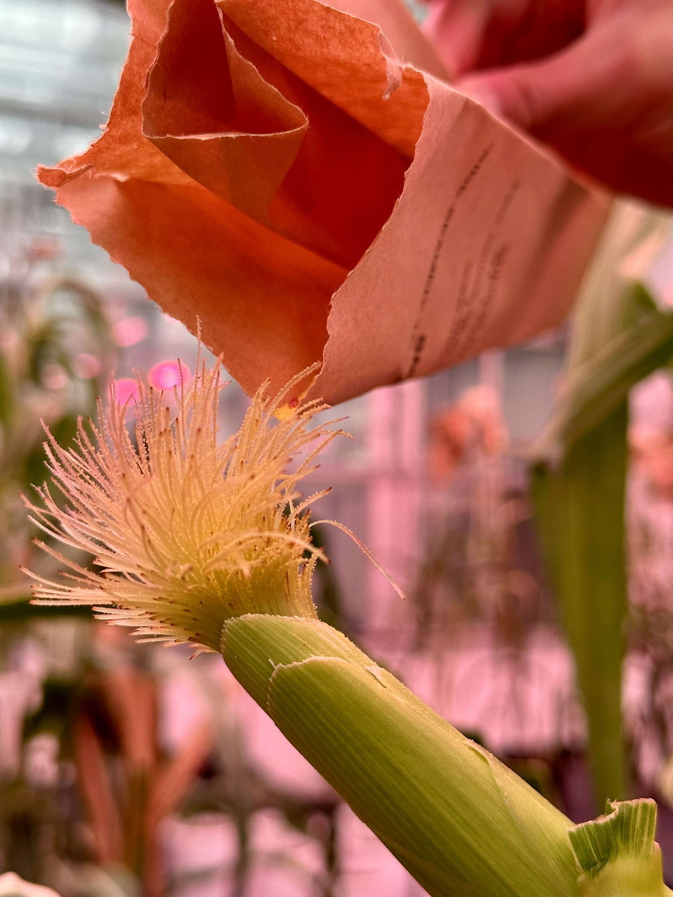
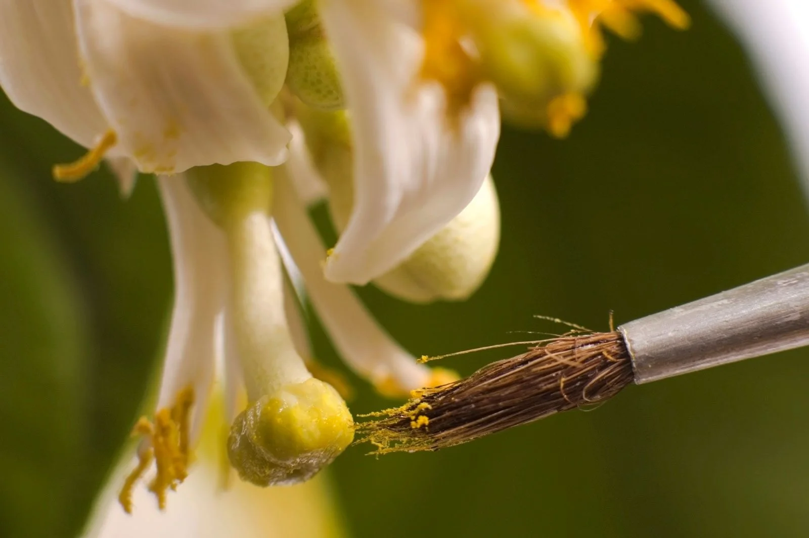
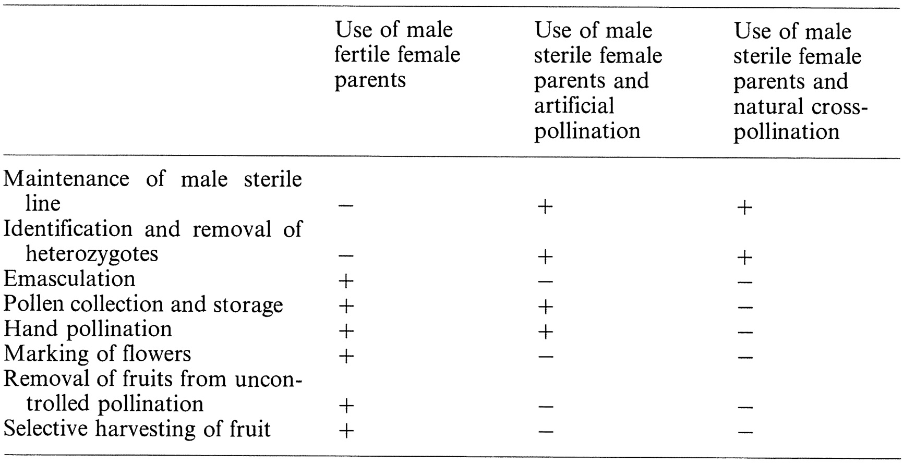

```{r,setup, include=FALSE}
library(knitr)
require(tidyverse)
set.seed(453)
# invalidate cache when the package version changes
options(scipen = 99)
knitr::opts_chunk$set(tidy = FALSE, echo = FALSE, 
                  message = FALSE, warning = FALSE,
                  out.width = "45%", cache = TRUE)
options(knitr.table.format = "latex")
options(knitr.kable.NA = "", digits = 2)
options(kableExtra.latex.load_packages = FALSE)
```

# Introduction

##

```{r maize, fig.cap="Pomato", fig.align='center', out.width="58%"}
knitr::include_graphics("./images/pomato_hybrid_graft.jpg")
```


# Hybridization

##

- *Hybrid* : Any sort of sexual or somatic combination of genetically more or less differentiated parental cells, individuals, or taxa; specifically, an individual plant from a cross between parents of differing genotypes; any heterozygote represents dissimilar alleles at a given locus; or a hybrid graft gene
- Hybrid breeding (syn *heterosis breeding*): Involves the transfer of genes from one source or genetic background to another, or combining genes from different sources that complement each other, with the hope that the new cultivar will combine the best of both parents.
- In flowering species, *sexual hybridization* is the mode.
  - Natural hybridization
  - Artifical hybridization

# Applications of crossing in plant breeding

##

\bcolumns
\column{0.5\textwidth}

\begin{center}
\begin{itemize}
\item Gene transfer
\item Recombination
\item Break undesirable linkages
\item For heterosis
\item For maintenance of breeding lines
\item For maintenance of diversity in a gene pool
\item For evaluation of parental lines
\item For genetic analysis
\end{itemize}
\end{center}

\column{0.5\textwidth}

```{r maize-pollination, fig.align='center', out.width="80%"}
# Credit: Twitter (vla_torres, LinaLpzc)

```

\ecolumns

# Artificial hybridization

## Basic conditions for successful hybridization

\bcolumns
\column{0.55\textwidth}
\small

- Parents should belong to same or closely related species
- Parents should together supply the critical genes needed to accomplish the breeding objective.
- One parent is usually designated female. Whereas some breeding methods may not require this designation, breeders usually select one parent to be female and the other a male (pollen source).
- The female parent usually needs some special preparation (Emasculation in complete flowers).
- While using male sterility (*ms*) system, maintainer lines need be accurately differentiated from sterile lines, using morphological or molecular markers linked to *ms* gene.
- Pollen is often physically or manually transferred.

\column{0.55\textwidth}

```{r hand-pollination, out.width="90%"}
# pollinating lemon tree, a normally bee pollinated crop (anther being brushed into stigma with the aid of a brush)

```

\ecolumns

## 

\bcolumns
\column{0.55\textwidth}

**Pollination control techniques**

\small

- Mechanical control
- Chemical control
  \begin{itemize}
  \footnotesize
  \item sex regulation in spinach, cucumber, pumpkin, zucchini can be chemically controlled
  \end{itemize}
- Genetic control
  \begin{itemize}
  \footnotesize
  \item Require sterile line, maintainer line and restorer line
  \item $>$ 55 recessive \textit{ms} genes (genic/nuclear male sterility) identified in tomato, > 12 in pepper and 6 in broccoli
  \item Both recessive and dominant male sterility genes reported in common and faba bean, cauliflower, cabbage and turnip
  \item \textit{ms} genes are identified in brussels sprouts, radish, beetroot, onion, carrot, etc. but not exploited
  \end{itemize}
- Environmental-genetic control
  \begin{itemize}
  \footnotesize
  \item When grown under restrictive environments, thermosensitive genic male sterility (TGMS) or photoperiod-sensitive genic male sterility (PGMS) lines serve as the female parents
  \end{itemize}

\column{0.45\textwidth}

**Promotion of cross pollination**

\small

- Ratio of pollen donor to seed parents
- Spacing and location of pollen donors in relation to seed parents (planting design/distance)
- Choice of pollen donor (extent of pollen shedding, attraction to vectors, flower morphology)
- Choice of male sterile parent (flower morphology, ovule and egg number per flower)
- Choice of appropriate season and regions
- Proper nicking of A and C lines
- Artificial pollination

\ecolumns

## Considerations of pollination

\bcolumns
\column{0.5\textwidth}
\small

- Selection of female parent and pollen flowers
- Pollen maturity
  - Synchronization of flowering
- Flower health and induction
  - Pollen quality (freshness)
- Timing of pollination (time of day)
- Collection and storage (temperature, light and humidity)
- Application of pollen (dusting, brushing, blowing)
- Tagging after pollination

\column{0.5\textwidth}

```{r comparision-pollination-control-methods, fig.cap="Stepwise comparison of procedures for pollination control in production of tomato hybrid seed.", out.width="99%"}
# 1977-Pollination Mechanisms, Reproduction and Plant Breeding

```

\ecolumns  

## Wide hybridization (interspecific hybridization)

<!-- Refer to Chapter 5 on 'Plant interspecific hybridization, outcomes and issues at the intersection of species', Plant Breeding Reviews, Volume 34. -->

<!-- Refer to "Distant Hybridization and Alien Gene Introgression" \cite{kumarDistantHybridizationAlien}. -->

<!-- Refer to "Monographs on Theoretical and Applied Genetics 16-Distant Hybridization" -->

\footnotesize

**Prezygotic barriers to interspecific hybridization** [@morgan2011plant]

- Spatial geographic isolation of parent populations
- Synchrony in flowering
- Direction of the cross (the parent from which the pollen and ovules originate)
- Specific parental genotypes
- Method of pollen dissemination and presence of pollen vectors
- Pollen-pistill and pollen-ovule interactions
- Pollen competition from maternal population
- Environmental conditions

**Post-zygotic barriers to interspecific hybridization**

- Mitotic compatibility of the two parental genomes. Ability of endosperm to support hybrid embryo development
- Direction of the cross (maternal effects on seed/fruit development)
- Number and viability of hybrid seeds

##

\footnotesize

**Establishment of interspecific hybrid plants**

- Seed dormancy
- Direction of the cross (maternal effects influencing seedling vigour)
- Growth vigor of hybrid plant
- Habitat conditions (natural, ruderal, cultivated)
- Competition from other plants
- Influence of pests, diseases, predators

**Propagation of interspecific hybrid plants**

- Ability to propagate vegetatively
- Persistence, dissemination and invasiveness of vegetative propagules
- Pollen and ovule fertility (meiotic stability and chromosome pairing)
- Ability to produce sexual progeny (selfed and backcrossed)
- Ability to survive over subsequent generations
- Seed number, viability and dormancy
- Habitat conditions, plant competition, pests, diseases, and predators

# Genetic issues in hybridization

## Immediate effect

- Expression of recessive lethal gene
- Hybrid necrosis
- Heterosis
- Transgressive segregation
- Genome-plastome incompatibility

## Subsequent effects

```{r wheat-experiment}
f2_var_genes <- readxl::read_xlsx("./data/07-hybridization_techniques_and_its_consequences.xlsx", sheet = "f2_var_and_genes") 
f2_var_genes %>% 
  mutate_at("Number of heterozygotes in the F2 ($2^n$)", 
            list(~round(2^`Number of heterozygous loci (n)`, 2))) %>% 
  mutate_at("Number of different genotypes in the F2 ($3^n$)", 
            list(~round(3^`Number of heterozygous loci (n)`, 2))) %>% 
  mutate_at("Minimum population size for chance to include each genotype ($4^n$)", 
            list(~round(4^`Number of heterozygous loci (n)`, 2))) %>% 
  knitr::kable(format = "latex", caption = "The variability in an F2 population as affected by the number of genes that are different between the two parents", booktabs = TRUE, escape = FALSE, digits = 20) %>% 
  kableExtra::kable_styling(latex_options = "striped", font_size = 8) %>% 
  kableExtra::column_spec(column = 1:4, width = c("8em", "8em", "8em", "12em"))
```

##

- Gene recombination in F2
- Factors that determine the number of gene recombinations that would be observed in an F2 population:
  - The number of gene loci for which the parents in a cross differ.
  - The number of alleles at each locus.
  - The linkage of the gene loci.

# Types of populations generated through hybridization

## Divergent and convergent crossing

\begin{columns}

\column{0.3\textwidth}
\begin{itemize}
\item Divergent crosses
  \begin{itemize}
  \footnotesize
  \item Single cross
  \item Three way cross
  \item Double cross
  \item Diallel cross
  \end{itemize}
\end{itemize}

\column{0.7\textwidth}

```{r crosses-types, fig.cap="The basic types of crosses used by plant breeders. Some are divergent (a) while others are convergent (b)", fig.align='center', out.width="80%"}
# pdftools::pdf_convert("./../../references_plb/Principles of Plant Genetics and Breeding.pdf", pages = 150, format = "png", filenames = "./images/crosses_types.png", dpi = 300)
knitr::include_graphics("./images/crosses_types.png")
```

\end{columns}

## Wide cross

## Bridge cross

```{r bridge-cross, fig.cap="An example of a bridge cross. To hybridize Italian ryegrass and tall fescue, the breeder may firstly make an intermediary cross with meadowgrass, followed chromosome doubling.", fig.align='center', out.width="38%"}
# pdftools::pdf_convert("./../../references_plb/Principles of Plant Genetics and Breeding.pdf", pages = 155, format = "png", filenames = "./images/bridge_cross.png", dpi = 300)
knitr::include_graphics("./images/bridge_cross.png")
```
