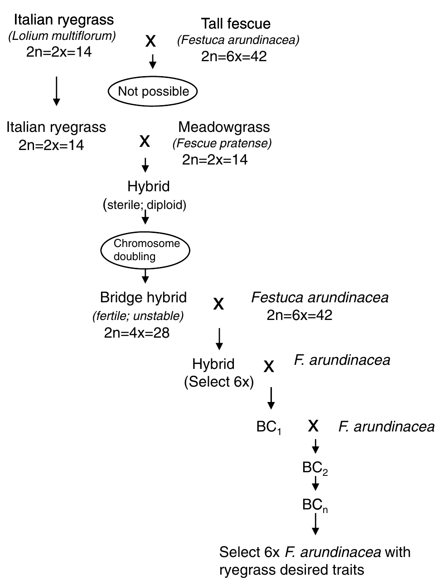

```{r,setup, include=FALSE}
library(knitr)
require(tidyverse)
set.seed(453)
# invalidate cache when the package version changes
knitr::opts_chunk$set(tidy = FALSE, echo = FALSE, 
                  message = FALSE, warning = FALSE,
                  out.width = "45%", cache = TRUE)
options(knitr.table.format = "latex")
options(knitr.kable.NA = "", digits = 2)
options(kableExtra.latex.load_packages = FALSE)
```

# Introduction

##

```{r maize, fig.cap="Quantitative characters", fig.align='center', out.height="400px", out.width="auto"}

```

---

class: inverse, center, middle

# Hybridization

---

- *Hybrid* : Any sort of sexual or somatic combination of genetically more or less differentiated parental cells, individuals, or taxa; specifically, an individual plant from a cross between parents of differing genotypes; any heterozygote represents dissimilar alleles at a given locus; or a hybrid graft gene

- Hybrid breeding (syn *heterosis breeding*): Involves the transfer of genes from one source or genetic background to another, or combining genes from different sources that complement each other, with the hope that the new cultivar will combine the best of both parents.

- In flowering species, *sexual hybridization* is the mode.
  - Natural hybridization
  - Artifical hybridization

---

# Applications of crossing in plant breeding

- Gene transfer
- Recombination
- Break undesirable
- For heterosis
- For maintenance of breeding
- For maintenance of diversity in a gene pool
- For evaluation of parental lines
- For genetic analysis

---

# Artificial hybridization

## Basic conditions for successful hybridization

- Parents should belong to same or closely related species
- Parents should together supply the critical genes needed to accomplish the breeding objective.
- One parent is usually designated female. Whereas some breeding methods may not require this designation, breeders usually select one parent to be female and the other a male (pollen source). 
- The female parent usually needs some special preparation (Emasculation in complete flowers)
- Pollen is often physically or manually transferred

## Pollination control techniques

- Mechanical control
- Chemical control
- Genetical control

---

## Flower and flowering issues in hybridization

- Flower health and induction
- Synchronization of flowering
- Selecting female parent and suitable flowers

## Considerations of pollination

- Successful pollination depends on pollen maturity, quality (freshness), and timing of pollination, among other factor.
- Considerations:
  - Collection and storage
  - Application of pollen
  - Tagging after pollination
  
## Wide hybridization (interspecific hybridization)

Refer to Chapter 5 on 'Plant interspecific hybridization, outcomes and issues at the intersection of species', Plant Breeding Reviews, Volume 34.

# Genetic issues in hybridization

## Immediate effect

- Expression of recessive lethal gene
- Hybrid necrosis
- Heterosis
- Transgressive segregation
- Genome-plastome incompatibility

---

## Subsequent effects

```{r wheat-experiment}
f2_var_genes <- readxl::read_xlsx("./07-hybridization_techniques_and_its_consequences.xlsx", sheet = "f2_var_and_genes") 
f2_var_genes %>% 
  mutate_at("Number of heterozygotes in the F2 (2^n)", 
            list(~2^`Number of heterozygous loci (n)`)) %>% 
  mutate_at("Number of different genotypes in the F2 (3^n)", 
            list(~3^`Number of heterozygous loci (n)`)) %>% 
  mutate_at("Minimum population size for chance to include each genotype (4^n)", 
            list(~4^`Number of heterozygous loci (n)`)) %>% 
  rename_all(list(~str_wrap(., width = 12))) %>% 
  knitr::kable(format = "html", caption = "The variability in an F2 population as affected by the number of genes that are different between the two parents") %>% 
  kableExtra::kable_styling(bootstrap_options = "striped", font_size = 12)
```

---

## Subsequent effects (...continued)

- Gene recombination in F2
- Factors that determine the number of gene recombinations that would be observed in an F2 population:
  - The number of gene loci for which the parents in a cross differ.
  - The number of alleles at each locus.
  - The linkage of the gene loci.
  
- ...

---

# Types of populations generated through hybridization

## Divergent crossing

- Single cross

- Three way cross

- Double cross

- Diallel cross

---

```{r crosses-types, fig.cap="The basic types of crosses used by plant breeders. Some are divergent (a) while others are convergent (b)", fig.align='center', out.height="500px", out.width="auto"}
# pdftools::pdf_convert("./../../references_plb/Principles of Plant Genetics and Breeding.pdf", pages = 150, format = "png", filenames = "./images/crosses_types.png", dpi = 300)

```

---

## Convergent cross

- Backcross

## Wide cross

---

## Bridge cross

```{r bridge-cross, fig.cap="An example of a bridge cross. To hybridize Italian ryegrass and tall fescue, the breeder may firstly make an intermediary cross with meadowgrass, followed chromosome doubling.", fig.align='center', out.height="450px", out.width="auto"}
# pdftools::pdf_convert("./../../references_plb/Principles of Plant Genetics and Breeding.pdf", pages = 155, format = "png", filenames = "./images/bridge_cross.png", dpi = 300)

```
