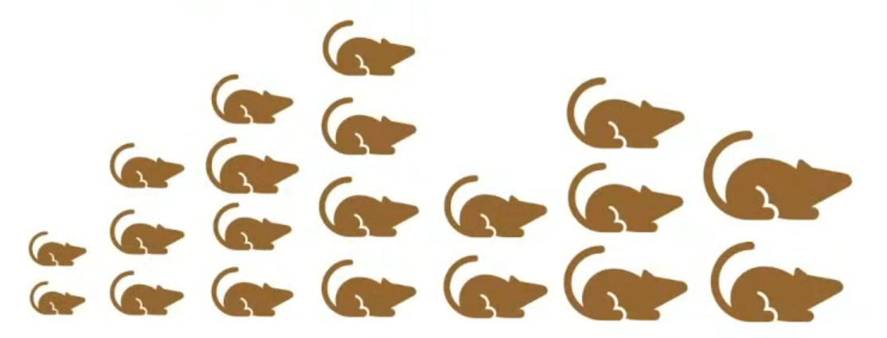
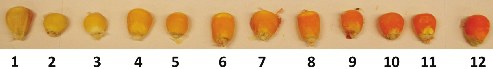
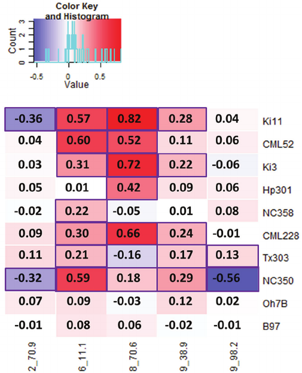
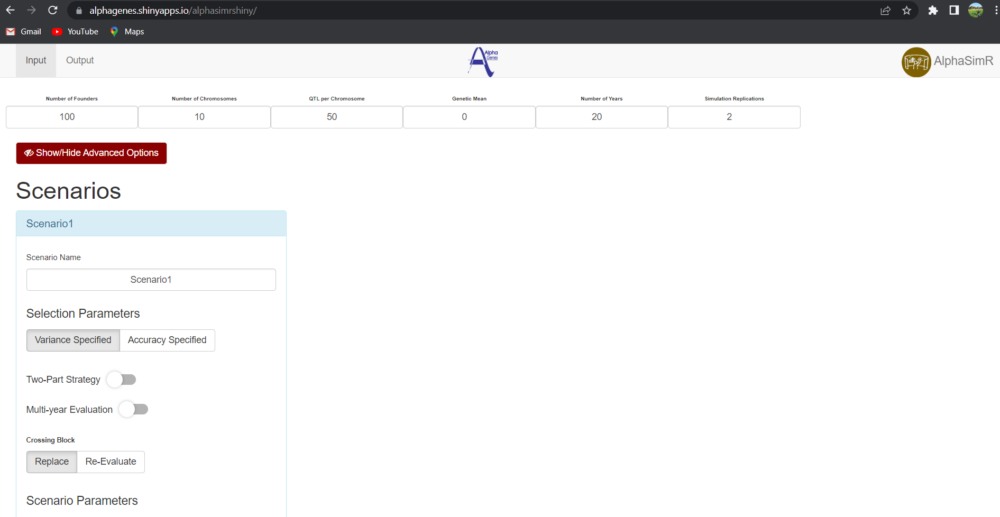
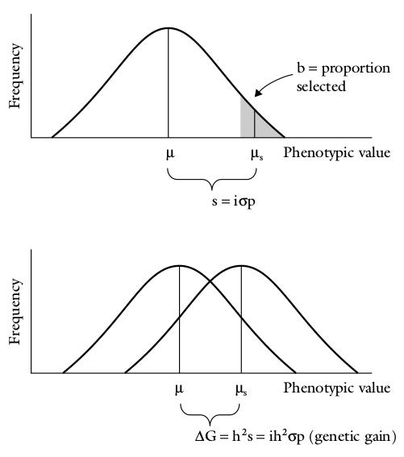
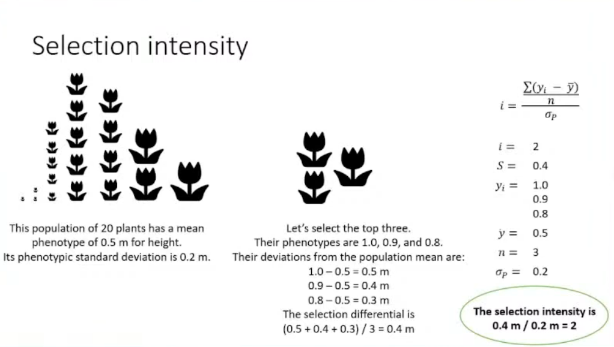
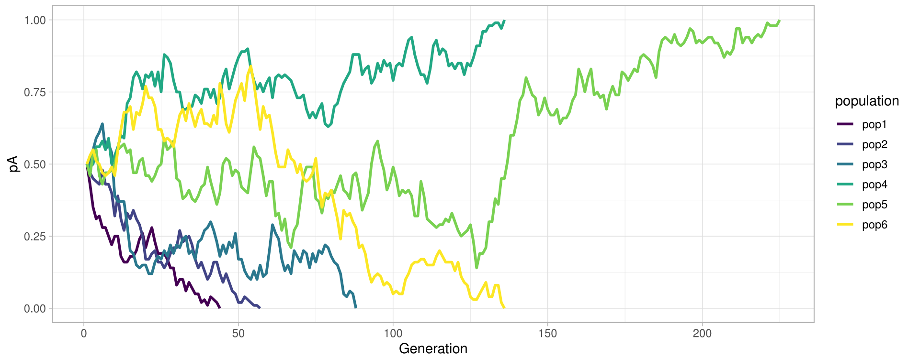
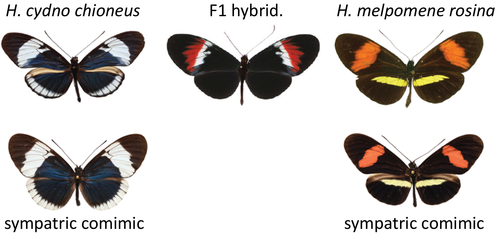

```{r,setup, include=FALSE}
library(knitr)
require(tidyverse)
set.seed(453)
# invalidate cache when the package version changes
knitr::opts_chunk$set(tidy = FALSE, echo = FALSE, 
                  message = FALSE, warning = FALSE,
                  out.width = "45%", cache = TRUE)
options(knitr.table.format = "latex")
options(knitr.kable.NA = "", digits = 2)
options(kableExtra.latex.load_packages = FALSE)
```

# Meaning of population

##

- A population is a group of sexually interbreeding individuals.
- The capacity to interbreed implies that every gene within the group is accessible to all members through the sexual process.
- A gene pool is the total number and variety of genes and alleles in a sexually reproducing population that are available for transmission to the next generation.
- The genetic structure of a population determines its capacity to be changed by selection (i.e., improved by plant breeding)
- The genetic constitution of a population is described by an array of gene frequencies. 
- The genetic properties of a population are influenced in the process of transmission of genes from one generation to the next by four major factors - *population size*, *differences in fertility and viability*, *migration and mutation*, and the *mating system*.
- Breeding of cross-pollinated species tends to focus on population improvement rather than individual plants.
- Rather than inheritance of traits, *genetics of population* is concerned with how the frequencies of alleles in a gene pool change over time.

# Breeder's equation and response to selection

##

<!-- ```{r} -->
<!-- require(AlphaSimR) -->
<!-- # vignette(package = "AlphaSimR", "intro") -->
<!-- # nInd = Number of individuals is 20 (10 male and 10 female, as these are systematically assigned with SP$setSexes) -->
<!-- # nChr = Number of chromosomes is 10 with each having 100 qtls -->
<!-- founderPop = quickHaplo(nInd=20, nChr=10, segSites=100) -->
<!-- SP = SimParam$new(founderPop) -->
<!-- SP$addTraitA(nQtlPerChr=100) -->
<!-- SP$setSexes("yes_sys") -->

<!-- pop = newPop(founderPop) -->

<!-- genMean = meanG(pop) -->

<!-- for(generation in 1:20){ -->
<!--   pop = selectCross(pop=pop, nFemale=16, nMale=4, use="gv", nCrosses=20) -->
<!--   genMean = c(genMean, meanG(pop)) -->
<!-- } -->
<!-- ``` -->

- Most phenotypes (occuring in natural environment) show **quantitative**, **continuous** variation and do not fall into discrete classes (understandably, it is not easy to see how quantitative traits could arise with mendelian principles).

```{r quantitative-variation-mice-size, fig.cap="Body length of mice is a quantitative trait. If we look at a population of mice we see the variation in the trait.", out.width="65%"}

```

##

\begin{columns}
\column{0.35\textwidth}
\begin{itemize}
\item Quantitative traits are controlled by many, many genes.
\item Alleles of each gene that control the trait have small effects (positive or negative) which add up to produce the trait value -- \alert{Infinitesimal model} of quantitative trait inheritance.
\item Each locus that affects the trait is called a quantitative trait locus.
\end{itemize}

\column{0.65\textwidth}

```{r maize-kernel-colors, out.width="80%"}

# Standardized color scale that included representative kernels from all 10 nested association mapping families in 2009 and 2010. The ordinal color scale ranges from 1 (lightest yellow) to 12 (darkest orange).
```

```{r heatmap-kernel-color-corn-qtl-chromosome, fig.cap="Rethinking the genetics of color. Heat map for kernel color quantitative trait loci (QTL) effects by chromosome and position in centimorgans (Chr, cM) and QTL donor. The diverse parents are ordered from highest to lowest kernel color best linear unbiased predictor. The diverse parents with darker orange kernel color tend to have stronger positive effect QTL relative to those with kernels that are yellow or light orange but also have QTL with a moderate-to-weak negative effect. All statistically significant effects at a false discovery rate of 5 percent are indicated by a purple rectangle border. Source: \\cite{chandler2013genetic}", out.width="50%"}


# How do you create a maize variety with a very bright kernel color ?
```

\end{columns}

## Breeding for quantitative traits

- There are too many genes to identify and stack them one by one, we need to consider them all at the same time.
- Concentration of favorable alleles and reduction of unfavorable ones in a population could be achieved by **recurrent selection**, all while continually picking the best varieties out of what is available.
- Recurrent selection is the engine which drives genetic gain.
  - repeatedly extracting superior varieties/cultivars from populations is nearly impossible without recurrent selection
    - the variance is not enough to overcome the unchanging mean
  - with recurrent selection, repeatedly obtaining superior varieties/cultivars are likely

##

```{r probability-of-success-in-recurrent-selection}
# simulating gain from recurrent selection
# https://www.youtube.com/watch?v=_QpHdKOXA6g
# A practical guide to genetic gain. Jessica Rutkoski (2019), Advances in Agronomy, Vol 157

simusel <- function(nsim = 10, ngen = 3, n = 100, h2 = 0.5, Vg = 1, nsel = 30) {
  r <- sqrt(h2)
  p <- nsel/n
  
  i <- dnorm(qnorm(p))/p
  Ve <- Vg/h2 - Vg
  stdG <- sqrt(Vg)
  stdE <- sqrt(Ve)
  succ_all <- c()
  for(j in 1:nsim){
    mn <- 0
    g <- rnorm(n, sd = stdG)
    e <- rnorm(n, sd = stdE)
    p <- g + e
    val0 <- g[which.max(p)]
    succ <- c()
    for(i in 1:c(ngen-1)){
      mn <- mn + c(stdG*i*r)
      g <- rnorm(n, mean = mn, sd = stdG)
      e <- rnorm(n, sd = stdE)
      p <- g + e
      val <- g[which.max(p)]
      suc <- val>val0
      if(suc){
        val0 <- val
      }
      succ <- append(succ, suc)
    }
    succ_all <- append(succ_all, !FALSE %in% succ)
  }
  prob_success <- sum(succ_all)/nsim
  return(prob_success)
}

number_of_cycles <- set_names(c(2, 3, 4, 5, 7, 10, 15, 25),
                              paste0("C", c(2, 3, 4, 5, 7, 10, 15, 25)))
heritability_values <- c(0.00001, 0.1, 0.2, 0.25, 0.4, 0.5, 0.65, 0.8, 0.95)


map_dfr(number_of_cycles, function(x){
  map_dbl(heritability_values, function(y){
    simusel(h2 = y, nsim = 200, ngen = x)
    })}) %>% 
  add_column(.before = 1, `$h^2$` = heritability_values) %>% 
  knitr::kable(booktabs = TRUE, caption = "Probability than an individual superior to all others can be identified every cycle of selection during population improvement. $h^2 = 0$ is equivalent to no population improvement. Source: \\cite{rutkoski2019practical}", escape = FALSE) %>% 
  kableExtra::kable_styling(font_size = 6)

```


<!-- # Simulating a breeding program -->

<!-- ## -->

<!-- ```{r, out.width="98%"} -->
<!--  -->
<!-- ``` -->

## Response to selection (R)

\small
- Selection entails discriminating among genetic variation to identify and choose a number of individuals to establish the next generation.
- This results in differential reproduction of genotypes, i.e. those that are selected have chance to increase their gene frequencies.
- Subsequently, the genotypic and phenotypic values of the targeted traits also improve.
- By selecting and advancing superior individuals (with high genetic potential) from a mixed population, the breeder aims to change population mean of the trait in a positive way in the next generation.
- \alert{Response to selection} is the difference between the mean phenotypic value of the offspring of the selected parents and the whole of the parental generation before selection. It is related to _heritability_ as shown in the following \alert{Breeder's equation}:

\bcolumns
\column{0.5\textwidth}

$$
R = \Delta G = h^2 S
$$
\column{0.5\textwidth}

- Where,
  \begin{itemize}
  \footnotesize
  \item $R$ is the response to selection
  \item $h^2$ is the heritability of trait ($h^2_{bs}$ or $h^2_{ns}$)
  \item $S$ is the selection differential
  \end{itemize}

\ecolumns

## Selection differenatial (S)

- \alert{Selection differential (S)} is the mean phenotypic value of the individuals selected as parents expressed as a deviation from the population mean (i.e., from the mean phenotypic value of all the individuals in the parental generation before selection). 

$$
S = X_s - X_o = i \sigma
$$

##

\footnotesize
- Genetic advance achieved through selection depends on three factors:
  \begin{enumerate}
  \footnotesize
  \item Total variation (phenotypic) in the population in which selection will be conducted.
  \item Heritability of the target trait.
  \item Selection pressure to be imposed by the plant breeder (i.e., the proportion of the population that is selected for the next generation).
  \end{enumerate}


$$
\Delta_G = \frac{ir\sigma_G}{L}
$$

- Genetic gain is the amount of change in mean genetic value of a population over time.
  \begin{itemize}
  \scriptsize
  \item due to selection over breeding (recurrent selection) cycles 
  \item always occurs within a population -- i.e., not the difference between variety and check
  \item sometimes called 'response to selection', denoted R
  \end{itemize}
- Expected genetic gain can be estimated from the breeder's equation, although realized genetic gain may differ and can be calculated from the observations
- Although it looks relatively simple, the breeder's equation applies to every species while breeding for quantitative traits.
- Particular features of the species -- like the age at which plants flower, or how quickly genotypes can be replicated -- can influence the optimal design of a breeding pipeline.

<!-- (Note that relationship between breeding cycle and population mean genetic values, do not follow a linear path. This is because various cycles of breeding have different probabilities of success of selecting the superior individual. Thus in early cycles of breeding change in improvement in population mean genetic value (genetic gain) is higher.) -->

##

\bcolumns
\column{0.5\textwidth}
- In principle, the prediction of response is valid for only one generation of selection.
- To predict the response in subsequent generations, heritabilities must be determined in each generation. Heritabilities are expected to change from one generation to the next because, if there is a response, it must be accompanied by change in gene frequencies on which heritability depends.
- Also, selection of parents tends to reduce phenotypic variance especially in early generations.

\column{0.5\textwidth}

```{r response-to-selection, fig.cap="Genetic gain or genetic advance from selection indicates the progress plant breeders make from one generation to another based on the selection decisions they make.", out.width="70%", fig.align='center'}

```

\ecolumns

## Selection intensity

\begin{columns}
\column{0.58\textwidth}
\begin{itemize}
\item Selection intensity ($i$) is the selection differential divided by the phenotypic standard deviation.
  \begin{itemize}
  \item The selection differential ($S$) is the phenotypic deviation of each selected individual from the population mean, divided by the number of selected individuals
  \item The phenotypic standard deviation is just the square root of the phenotypic variance
  \end{itemize}
\item Selection intensity is closely tied to the percentage of individuals selected, especially for normally distributed traits, but is not exactly the same.
  \begin{itemize}
  \item it captures the difference between the selected parents and the overall population
  \end{itemize}
\end{itemize}
\column{0.42\textwidth}

$$
i = \frac{\frac{\sum^n_{i = 1} (y_i - \bar{y})}{n}}{\sigma_p}
$$

$$
\small
S = \frac{\sum^n_{i = 1} (y_i - \bar{y})}{n}
$$


\begin{itemize}
\item Where,
  \begin{itemize}
    \footnotesize
    \item $i$: Selection intensity
    \item $S$: Selection differential
    \item $y_i$: Phenotypic value of the $\mathrm{i^{th}}$ selected individuals
    \item $\bar{y}$: Mean phenotypic value of all individuals in the population
    \item $n$: Number of selected individuals
    \item $\sigma_P$: Phenotypic standard deviation among all individuals in the population
    \end{itemize}
  \end{itemize}
  
\end{columns}

##

\footnotesize

For a quantitative trait in RMP, mean is 100 and variation is 240. The regression of the offspring on mid-parent value is 0.25. Truncation selection is practiced with a selection differential of 32. What is the expected mean in the next generation ?

$\longrightarrow$

\begin{itemize}
\footnotesize
\item Mean ($X_0$) = `r (X0 = 100)`
\item Variation ($\sigma^2$) = `r (sigma_sq = 240)`
\item Regression of offspring on mid-parent value ($b$) = `r (b = 0.25)`
\item Selection differential ($X_s - X_0$) = `r (S = 32)`
\end{itemize}

We know that the performance of a selected population after applying selection differential:

\begin{align}
\small
S &= \sqrt{\sigma^2} i = \sqrt{240} i \notag \\
i &= \frac{S}{\sqrt{240}} \notag
\end{align}

$\therefore$ $i$ = `r (S/sqrt(sigma_sq))`. And we know that $b = h^2_{ns}$, so:

$\rightarrow$ $R = \sigma i h^2$ = `r (R = sqrt(sigma_sq)*S/sqrt(sigma_sq)*b)`

Hence, the expected mean of next (progeny) generation ($P$) = $X_0 + \sigma i h^2$ = `r (X0 + R)`.

<!-- Selection will only be successful if there is sufficient phenotypic variation and if at least some of this variation is genetic in origin. Response to selection is related to heritability. -->

<!-- $$ -->
<!-- X_1 - X_{n-1} = R = i\sigma h^2 -->
<!-- $$ -->
<!-- Where, $X_1$ is the mean phenotype of progenies obtained from breeding of selected genotypes, $X_{n-1}$ is the mean phenotype of the base population, R is the advance as a result of one round of selection, $h^2$ is the heritability (narrow sense for sexually reproducing species, or broad sense for clonally or apomictic breeding crops), $\sigma$ is the phenotypic standard deviation of the whole population, and $i$ is the intensity of selection. -->

<!-- The intensity of selection is related to the proportion (or percentage) of the population that is selected (k), and takes the values: -->

<!-- ```{r} -->
<!-- knitr::kable(tibble::tribble( -->
<!--   ~"proportion selected($k$)", ~"$i$",  -->
<!--   0.01, 2.665,  -->
<!--   0.05, 2.063,  -->
<!--   0.10, 1.755,  -->
<!--   0.20, 1.400 -->
<!-- ) -->
<!--   , caption = "This is first of mtcars table", -->
<!--              booktabs = TRUE, format = "latex", escape = FALSE) %>% -->
<!--   kableExtra::kable_styling(latex_options = c("HOLD_position")) -->
<!-- ``` -->

<!-- In cases where the initial population is large (i.e. greater than 50 genotypes) and the proportion of genotypes selected is less than 20%, then the following equation can provide an estimate of $i$. -->

<!-- $$ -->
<!-- i = 0.77 + \left(0.96 \times log\left(\frac{1}{k}\right)\right) -->
<!-- $$ -->

<!-- It can be seen that there is not a linear relationship between higher selection rates (k) and greater response to the selection applied. Retaining 10% of the selected population results in an intensity of selection value of 1.755, while retaining only 1% (i.e. a 10 fold reduction in selections) results in an intensity of selection value fo only 1.52 times larger (i.e., $i = 2.665$). -->


<!-- ```{r} -->
<!--  -->
<!-- ``` -->

# Hardy-weinberg law 

##

- The genetic constitution of individuals in a population is reconstituted for each subsequent generation whereas the genes carried by the population have continuity from one generation to the next.
- Plant breeders often work with genetic phenomena in populations that exhibit no apparent Mendelian segregation, even though in actuality, they obey Mendelian laws. 
- Mendel worked with genes whose effects were categorical (kinds) and were readily classifiable (ratios) into kinds in the progeny of crosses. 
- Breeders, on the other hand, are usually concerned about differences in populations measured in degrees rather than kinds. 
- Population genetics uses mathematical models to attempt to describe population phenomena. It is, thus, necessary to make assumptions about the population and its environment.

## Calculating gene frequency

- Gene frequencies are simply the proportions of the different alleles of a gene in a population.
- To obtain these proportions we count the total number of organisms with various genotypes in the population and estimate the relative frequencies of the alleles involved.
- To understand the genetic structure of population, consider a large population in which random mating occurs, with no mutation or gene flow between this population and others, no selective advantage for any genotype, and normal meiosis.

- Consider also one locus, $A$, with two alleles, $A$ and $a$. The frequency of allele $A_1$, in the gene pool is $p$, while the frequency of allele $A_2$ is $q$. Also, $p + q = 1$ (or 100% of the gene pool). Assume a population of $N$ diploids in which two alleles ( $A$, $a$) occur at one locus.

- Assuming dominance at the locus, three genotypes – $AA$, $Aa$ and $aa$ – are possible in an $F_2$ segregating population. Assume the genotypic frequencies are $D$ (for $AA$), $H$ (for $Aa$) and $Q$ (for $aa$). Since the population is diploid, there will be $2N$ alleles in it. The genotype $AA$ has two $A$ alleles. Hence, the total number of $A$ alleles in the population is calculated as $2D + H$. The proportion or frequency of $A$ alleles (designated as $p$) in the population is obtained as follows.

$$
\begin{aligned}
\frac{2D + H}{2N} = D + \frac{1}{2}H = p
\end{aligned}
$$

The same can be done for allele $a$, and designated $q$. Further, $p + q = 1$ and hence $p = 1-q$.

## Numerical example

If $N = 80$, $D = 4$ and $H = 24$. (Here, D and H are rather used as count of individuals rather than frequencies)

Genotypic frequencies;

$$
\begin{aligned}
D = 4/80 \\
H = 24/80 \\
Q = 52/80
\end{aligned}
$$
Now,

$$
p = \frac{D + \frac{1}{2}H}{N} = \frac{4 + 12}{80} = \frac{16}{80} = 0.2
$$

Since $p + q = 1$, $q = 1-p$, and hence $q = 1-0.2 = 0.8$.


## HW Equilibrium

- Consider a random mating population (each male gamete has an equal chance of mating with any female gamete). 
- Random mating involving the previous locus (A/a) will yield the following genotypes: $AA$, $Aa$, and $aa$, with the corresponding frequencies of $p^2+2pq+q^2$, respectively. 
- The gene frequencies must add up to the unity. Consequently, $p^2+2pq+q^2 = 1$. This mathematical relationship is called Hardy-Weinberg equilibrium. 
- Hardy, from England, and Weinberg, from Germany, discovered that equilibrium between genes and genotypes is achieved in large populations. 
- They showed that the frequency of genotypes in a population depends on the frequency of genes in the preceding generation, not on the frequency of the genotypes.

##

Considering the previous example, the genotypic frequencies for the next generation following random mating can be calculated as follows:

$$
\begin{aligned}
AA &= p^2 &= 0.2^2 &= 0.04 \\
Aa &= 2pq &= 2 (0.2\times0.8) &= 0.32 \\
aa &= q^2 &= 0.8^2 &= 0.64
\end{aligned}
$$

- The Hardy-Weinberg equilibrium is hence summarized as:

$$
p^2AA + 2pqAa + q^2aa = 1
$$

##

- This means that in a population of 80 plants as before, about three plants will have a genotype of $AA$, 26 will be $Aa$, and 51, $aa$. Using the previous formula, the frequencies of the genes in the next generation may be calculated as:

$$
P = \frac{D + \frac{1}{2} H}{N} = \frac{3+13}{80} = 0.2
$$

And, $q = 1-p = 0.8$

- The allele frequencies have remained unchanged, while the genotypic frequencies have changed (for AA, Aa, and aa, respectively) from 4, 24, and 52, to 3, 26, and 51.
- However, in subsequent generations, both the genotype and gene frequencies will remain unchanged, provided that:
  - Random mating occurs in a very large diploid population;
  - Allele $A$ and allele $a$ are equally fit (one does not confer a superior trait than the other);
  - There is no differential migration of one allele into or out of the population;
  - The mutation rate of allele $A$ is equal to that of allele $a$.

# Changing gene and genotypic frequencies in HW population

##

```{r hw-expectation-in-frequencies, fig.pos="center", fig.cap="Attainment of HW-equilibrium in a diploid population shown across different values of starting allele frequencies (An example scenario with starting allele frequencies f(A) = 0.2 and f(a) = 0.8 is shown as marked.)", out.width="68%"}
theme_set(theme_light())

allele_population <- c(rep("A", 2), rep("a", 8))

population_size <- 100
genotypes <- map_dfr(seq_along(1:population_size), ~c(diploid_loci1 = sample(allele_population, 1),
                  diploid_loci2 = sample(allele_population, 1)))

allele_count <- genotypes %>% count(diploid_loci1, diploid_loci2)

# # this finds all columns filled with "A" in every observation
# allele_count %>% 
#   filter(across(everything(), ~ .x == "A"))
#   # filter(if_all(everything(), ~ .x == "A")) # this is similar to above

alleleA_count <- allele_count %>% 
  filter(if_any(everything(), ~ .x == "A")) %>% 
  summarise(sum_alleleA = sum(n)) %>% 
  pull(sum_alleleA)

alleleA_freq <- alleleA_count/(population_size*2)

# why is this meaningless and above not?
# allelea_count <- allele_count %>% 
#   filter(if_any(everything(), ~ .x == "a")) %>% 
#   summarise(sum_allelea = sum(n)) %>% 
#   pull(sum_allelea)
# allelea_freq <- allelea_count/(population_size*2)

homoAA_count <- allele_count %>% 
  filter(if_all(contains("diploid_loci"), ~.x == "A")) %>% 
  summarise(sum_homoAA = sum(n)) %>% 
  pull(sum_homoAA)

heterozygote <- cross_df(.l = list(diploid_loci1 = c("A", "a"), diploid_loci2 = c("A", "a"))) %>% 
  filter(!if_all(everything(), ~ .x == "A") & !if_all(everything(), ~ .x == "a"))

hetero_count <- allele_count %>% 
  right_join(heterozygote) %>% 
  summarise(sum_hetero = sum(n)) %>% 
  pull(sum_hetero)

homoAA_freq <- homoAA_count/population_size
hetero_freq <- hetero_count/population_size

# plotting p, p^2, 2p(1-p)

ggplot(data = tibble(p_allele = alleleA_freq)) +
  # xlim(0, 1) + # will allele frequency ever go beyond (0,1) ? NO
  geom_function(fun = function(p = p_allele){p^2}, color = "blue") +
  geom_function(fun = function(p = p_allele){2*p*(1-p)}, color = "black") +
  geom_function(fun = function(p = p_allele){(1-p)^2}, color = "red") +
  geom_point(x = alleleA_freq, y = alleleA_freq^2, size = rel(2), shape = 1) +
  geom_point(x = alleleA_freq, y = 2*alleleA_freq*(1-alleleA_freq), size = rel(2), shape = 3) +
  geom_point(x = alleleA_freq, y = (1-alleleA_freq)^2, size = rel(2), shape = 1) +
  geom_text(data = tibble(x = c(0.2, 0.5, 0.8), y = c(0.6),
                          text = c("aa", "Aa", "AA")), 
            aes(x = x, y = y, label = text, color = text)) +
  scale_color_manual(values = c("aa" = "red", "Aa" = "black", "AA" = "blue")) +
  labs(color = "Genotype",
       x = "Allele 'A' frequency (p)",
       y = "Genotype frequency") +
  scale_x_continuous(limits = c(0, 1)) + # this or xlim()
  guides(color = guide_legend(reverse = TRUE, label.theme = element_text(angle = -20)))
  
# construct 25 populations of genotypes by randomly constituting alleles from the allele pool
# (with theoretical "p" = 0.2 and sample "p" approximating theoretical "p")
# and check where they occur in the H-W spectrum

genotypes_populations <- map_dfr(set_names(1:25,1:25), ~map_dfr(seq_along(1:population_size),
                                                                    ~c(diploid_loci1 = sample(allele_population, 1),
                                                                       diploid_loci2 = sample(allele_population, 1))),
                                        .id = "population_constitution")


alleleA_count_populations <- genotypes_populations %>%
  group_by(population_constitution) %>% 
  count(diploid_loci1, diploid_loci2) %>% 
  filter(if_any(everything(), ~ .x == "A")) %>% 
  summarise(sum_alleleA = sum(n)) %>% 
  arrange(as.numeric(population_constitution)) %>% 
  pull(sum_alleleA)

alleleA_freq_populations <- alleleA_count_populations/population_size*2

```

The relationship between allele frequencies and genotype frequencies in a population in Hardy–Weinberg equilibrium for two alleles. The frequency of the heterozygotes cannot be more than 50%, and this maximum occurs when the allele frequencies are $p=q=0.5$. Further, when the frequency of an allele is low, the rare allele occurs predominantly in heterozygotes and there are very few homozygotes. (Adapted from Falconer, 1981.)

## Summary of HW principle

- Hence the stability of genotypic frequency after the first generation is said to be in equilibrium.
- This genotypic equilibrium, based on stable gene frequencies and random mating, is known as Hardy-Weinberg principle (or law)
- Hence, Genetic differences in a randomly breeding population will tend to remain constant unless acted upon by external forces.
- In other words, the variability does not change from one generation to another in a random mating population. 
- The maximum frequency of the heterozygote (H) cannot exceed 0.5. The Hardy-Weinberg law states that equilibrium is established at any locus after one generation of random mating. 

## Plant Breeding implications of HW principle

- From the standpoint of plant breeding, two states of variability are present – two homozygotes (AA, aa), called “free variability” that can be fixed by selection and the intermediate heterozygous (Aa), called “hidden or potential variability, that can generate new variability through segregation.
- In outcrossing species, the homozygotes can hybridize to generate more heterozygotic variability. Under random mating and no selection, the rate of crossing and segregation will be balanced to maintain the proportion of free and potential variability of 50%:50%.
- However, with two loci under consideration, equilibrium will be attained slowly over many generations.
- If genetic linkage is strong, the rate of attainment of equilibrium will be even much slower.

## Plant Breeding application of HW principle

- In disease resistance breeding, plant breeders cross an elite susceptible cultivar with one that has disease resistance. Consider a cross between two populations, susceptible x resistant. If the gene frequencies of an allele $A$ in the two populations are represented by $P_1$ and $P_2$, the gene frequency in the $F_1 = \frac{P_1 + P_2}{2} = p$. Assuming the frequency of the resistance gene (Note here that same allele is being considered) in the resistant cultivar is $P_1=0.7$ and that in the susceptible elite cultivar is $P_2=0.05$, the gene frequency in the progeny of the cross p would be obtained as follows: 
$p = \frac{P_1 + P_2}{2} = (0.7 + 0.05)/2 = 0.375$
- Consequently, the gene frequency for the resistant trait is reduced by about 50% (from 0.7 to 0.375).

# Forces changing gene frequencies

## Mutation

- Introduces a particular gene into a population
- A unique mutation (non-recurrent mutation) would have little impact on gene frequencies.
- Types: forward and reverse mutation (Based on the direction of mutation)
  - Wild type (A) $\rightarrow$ Mutant type (a)
  - Mutant type (a) $\rightarrow$ Wild type (A)
- Even if the rate of mutation of A to a is small, after a large number of generations, A will disappear.

## Selection and fitness

- One of the most important causes for the change in gene frequency lies in the ability of its carriers to produce surviving offspring.
- If individuals carrying gene A are more successful in reproduction, than those carrying a, the frequency of former tends to be greater than the latter.
- Wide variety of mechanisms responsible for reproductive success of a genotype is known collectively as *selection*.
- Artificial and Natural selection
- *Fitness* has a variety of applied meanings, but generally refer to ability and aptitude.
- In genetic sense, it is far more restricted to relative reproduction success.
- Whether a genotype appears superficially "weak" or "strong", "beautiful" or "ugly", may be of no matter, only when a genotype can produce more offspring than another in the same environment, is its fitness superior.

## Migration

- A population may receive alleles by migration from a nearby population that maintains an entirely different gene frequency.
- Two factors are important for recipient population in this case:
  - The difference in frequencies between the two populations and 
  - The proportions of migrant genes that are incorporated each generation

## Random genetic drift

\small
- When unopposed the previously discussed forces (Mutation, selection and migration) can lead of fixation of one allele and elimination of all others, or, when balanced, they can lead to equilibrium between two or more alleles.
- However, Random genetic drift is one of the most important non-directional forces that arises from variable sampling of the gene pool each generation and is known as random genetic drift.
- Genetic drift is caused by the fact that real populations are limited in size rather than infinite, so that gene-frequency changes occur because of sampling errors.
- Example: If only a few parents are chosen to begin a new generation, such a small sample of genes may deviate widely from the gene frequency of the previous generation.

```{r genetic-drift-simulation, fig.align='center', out.width="54%"}

```

## Mating systems

\bcolumns
\column{0.44\textwidth}

\small
- Equilibrium assumption is violated if the probability of mating depends on a phenotype encoded by a particular genotype at a locus.
  \begin{itemize}
  \footnotesize
  \item Individuals with similar phenotype mate -- assortative mating
  \item Individuals with dissimilar phenotypes mate -- negative or disassortative mating.
  \end{itemize}
- Positive assortative mating on the basis of phenotype can create an excess of homozygotes.
- Disassortative mating is common in many fungi, algae and protozoans, in which gametes of the same species can only fuse to form zygote if they differ in mating type.

\column{0.56\textwidth}

```{r assortative-mating, fig.cap="Wing pattern phenotypes of Helconius butterfly. These butterflies are famous for their mimicry, where poisonous pairs of distantly related species mimic each others' bright colour patterns and so share the benefits of being avoided by visual predators (Mullerian mimics). \\textit{H. melpomene rosina} and \\textit{H. cydno chioneus} are closely related species that co-occur in central Panama, but mimic different other co-occuring species. These differences in coloration pattern are due to a few large effect loci. The two species can hybridize and produce viable F1 hybrids. These F1 hybrids are heterozygote at color loci and their intermediate appearance mean that they're poor mimics and so are quickly eaten by predators. However, these heterozygote (F1) hybrids are very rare in nature $\\frac{1}{1000}$ as the parental species show strong positive assortative mating based on color pattern, based on genetic differences in mate preference.", out.width="72%"}

```

\ecolumns

# Bibliography

## References
