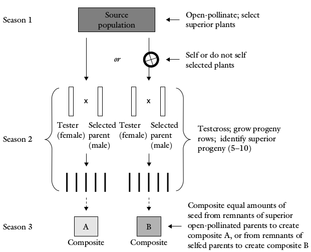

class: inverse, center, middle

```{r,setup, include=FALSE}
library(knitr)
require(tidyverse)
set.seed(453)
# invalidate cache when the package version changes
knitr::opts_chunk$set(tidy = FALSE, echo = FALSE, 
                  message = FALSE, warning = FALSE,
                  out.width = "45%", cache = TRUE)
options(knitr.table.format = "latex")
options(knitr.kable.NA = "", digits = 2)
options(kableExtra.latex.load_packages = FALSE)
```

# Introduction

---

- Plant species where normal mode of seed set is through a high degree of cross-pollination have characteristic reproductive features and population structure. 
- Each plant receives a blend of pollen from a large number of individuals each having different genotypes. 
- Such populations are characterized by a high degree of heterozygosity with tremendous free and potential genetic variation, which is maintained in a steady state by free gene flow among individuals within the populations. 

---

- Allogamous species (producing seed through cross pollination) or out breeder plants have characters which promote cross pollination which include dichogamy, monoecy, dioecy, heterostyly, heterogamy, self incompatibility and male sterility.
- Some important features of out breeders are:
  1. They have random mating. In such population, each genotype has equal chance of mating with all other genotypes
  2. Individuals are heterozygous and have advantage of heterozygosity
  3. Individuals have deleterious recessive gene which are concealed by masking effect of dominant genes.
  4. Out breeders are intolerant to inbreeding. They exhibit high degree of inbreeding depression on selfing.
  5. Cross pollination permits new gene combinations from different sources.
  6. In these species, variability is distributed over entire population.
  7. They have wide adaptability and more flexibility to environmental changes due to heterozygosity and heterogenety.
- In the development of hybrid varieties, the aim is to identify the most productive heterozygote from the population, which then is produced with the exclusion of other members of the population.

---

class: inverse, middle, center

# Breeding methods

---

- The classification of population improvement is: 
  - according to the unit of selection – either individual plants or family of plants. 
  - according to the populations undergoing selection as either intra-population or inter-population. 
  
- In **intra-population** improvement, the end product will be a population or synthetic cultivar, and it may end up elite pure lines for hybrid production. Or, it can also be used for developing mixed genotype cultivars (in self-pollinated crops). Commonly used methods are mass selection, ear-to-row selection and recurrent selection. This consists of both single plant (mass selection) and family based selection (recurrent selection).
- **Inter-population** improvement deals with the selection on the basis of the performance of a cross between two populations. The final product will be a hybrid cultivar with heterosis.

---

```{r cross-pollinated, out.width="80%", fig.align='center'}
knitr::include_graphics("./images/varietal_cross_pollinated.png")
```


---

## Mass selection

- It is the simplest, easiest and oldest method of selection where individual plants are selected based on phenotypic performance, and seeds are bulked.
- It is effective in maize improvement at the initial stages but its efficacy is poor for improvement of yield.
- The selection after pollination does not provide any control over the pollen parent as result of which effective selection is limited only to female parents. 
- The heritability estimates are reduced by half, since only female parents are used to harvest seed whereas the pollen source is not known after the cross pollination has taken place.
- Also, since this selection is solely based on phenotype, heritability of the trait plays a pivotal role in its effectiveness -- mostly effective for additive genes.

<!-- ## Expected genetic advance -->

<!-- \[ -->
<!-- \Delta G = \left[ \frac{\frac{1}{2}i \sigma^2_A}{\sigma^2_p} \right] = \left[ \frac{\frac{1}{2}i \sigma^2_A}{\sigma^2_A + \sigma^2_D + \sigma^2_{AE} + \sigma^2_{DE} + \sigma^2_e + \sigma^2_{me}} \right] -->
<!-- \] -->

<!-- $\sigma_p$ = Phenotypic standard deviation in the population -->
<!-- $\sigma^2_A$ = Additive variance -->
<!-- $\sigma^2_D$ = Dominance variance -->

<!-- Other factors are interaction variances. $\Delta G_m$ doubles with both sexes. This large denominator makes mass selection inefficient for low heritability traits. -->

---

## Recurrent selection

- In the simplest form, recurrent selection consists of selecting desired individuals within a population prior to mating followed by the intermating of selected individuals. Consequently, both female and male gametes have undergone selection, and genetic progress should be at least 100% faster than for mass selection.
- Recurrent selection scheme are variations of modification of progeny selection or ear to row method.

- Steps:
  - Visually selected individuals out of the base population undergo progeny testing
  - The parents are crossed in all possible combinations and individual families are created for evaluation, 
  - The families are evaluated and a new set of parents are selected, and 
  - The selected parents are inter-mated to produce the population for the next cycle of selection.
- The aforesaid cycle is repeated several times (3-5 times). The original cycle is labelled $C_0$ and is called the base population. The subsequent cycles are named as $C_1, C_2, C_3, ... C_n$

---

## Types of recurrent selection

- Simple recurrent selection: Similar to mass selection with 1-2 year per cycle. Does not involve a tester. Phenotypic scores are the basis for selection (aka., Phenotypic recurrent selection).
- Recurrent selection for general combining ability (Half sib progeny test procedure): When additive gene effects are more important.
- Recurrent selection for specific combining ability: When overdominance gene effects are more important.
- Reciprocal recurrent selection: When both gene effects are important. Two heterozygous population are involved, each serving as a tester for the other.

<!-- ## Expected genetic advance -->

<!-- $$\Delta G = \frac{CiV_A}{y \sigma_p}$$ -->

<!-- $\Delta G$ = Expected genetic advance -->
<!-- $C$ = Measure of parental control (C = 0.5 if selection is based on one parent and equals 1 when both parents are involved) -->
<!-- $i$ = Selection intensity -->
<!-- $V_A$ = Additive genetic variance among the units of selection -->
<!-- $y$ = Number of years per cycle -->
<!-- $\sigma_p$ = Phenotypic standard deviation among the units of selection -->

---

.pull-left[

- This method of selection is useful to improve one or more traits so that a new population that is superior to the original population is achieved.
- The source material may be random mating populations, synthetic cultivars and single-cross or double-cross plants.
- The improved population may be released as a new cultivar or used as a breding material (parent) in other breeding programmes.
- This selection ensures improvement of population without reduction in genetic variability.
- It is advisable to include as many parent as possible in the initial crossing to increase genetic diversity.
- The breeder can decide on the number of generations of inter-mating that is appropriate for a breeding programme.

]

.pull-right[
```{r simple-recurrent-selection, out.width="100%", fig.cap="Simple recurrent selection", fig.align='center'}
knitr::include_graphics("./images/simple_recurrent_selection.png")
```
]

---
class: inverse, center, middle

# Progeny testing

```{r progeny-testing, out.width="60%", fig.align='center'}
knitr::include_graphics("./images/selection_based_on_progeny_test.png")
```

---

## Half-sib selection with progeny testing

- Selections are made based on progeny test performance instead of phenotypic appearance of the parental plants. 
- Seed from selected half-sibs, which have been pollinated by random pollen from the population (meaning that only the female parent is known and selected, hence the term "half-sib") is grown in unreplicated progeny rows for the purpose of selection. 
- A part of the seed is planted to determine the yielding ability, or breeding value, for any character of each plant. 
- The seed from the most productive rows or remnant seed from the outstanding half-sibs is bulked to complete one cycle of selection.

---

```{r half-sib-selection, fig.cap="Generalized steps of half sib selection scheme", out.width="60%", fig.align='center'}

```


---

## Full-sib selection with progeny testing

- A number of full-sib families, each produced by making crosses between the two plants from the base population are evaluated in replicated trials. 
- A part of each full-sib family is saved for recombination. Based on evaluation the remnant seed of selected full-sib families is used to recombine the best families.

<!-- ## Estimate of genetic gain -->

<!-- $$ -->
<!-- \Delta_{FS} = \left[\frac{i \sigma^2_A}{2 \sigma_{FS}}\right] -->
<!-- $$ -->

<!-- Where $\sigma_{FS}$ is the phenotypic standard deviation of the full-sib families. -->

---

```{r full-sib-selection, fig.cap="Generalized steps of full sib family selection", out.width="60%", fig.align='center'}
knitr::include_graphics("./images/full_sib_selection.png")
```


---
class: inverse, middle, center

# Response to selection

---

- Selection entails discriminating among genetic variation to identify and choose a number of individuals to establish the next generation.
- This results in differential reproduction of genotypes, i.e. those that are selected have chance to increase their gene frequencies.
- Subsequently, the genotypic and phenotypic values of the targeted traits also improve.
- By selecting and advancing superior individuals (with high genetic potential) from a mixed population, the breeder aims to change population mean of the trait in a positive way in the next generation.

---

## Response to selection (R)

The difference between the mean phenotypic value of the offspring of the selected parents and the whole of the parental generation before selection. 

- Response to selection is related to heritability by the following equation (**Breeder's equation**):

$$
R = \Delta G = h^2 S
$$

## Selection differenatial (S)

The selection differential (S) is the mean phenotypic value of the individuals selected as parents expressed as a deviation from the population mean (i.e., from the mean phenotypic value of all the individuals in the parental generation before selection). 

$$
S = X_s - X_o = i \sigma
$$

---

- The genetic advance achieved through selection depends on three factors:

  1. The total variation (phenotypic) in the population in which selection will be conducted.
  2. Heritability of the target trait.
  3. Selection pressure to be imposed by the plant breeder (i.e., the proportion of the population that is selected for the next generation).
- For desirable gain from selection
  - Phenotypic variance should be large and clearly distinguishable
  - Heritability of the selected phenotype should be high
  - Selection pressure should be optimal.
- In principle, the prediction of response is valid for only one generation of selection. - To predict the response in subsequent generations, heritabilities must be determined in each generation. Heritabilities are expected to change from one generation to the next because, if there is a response, it must be accompanied by change in gene frequencies on which heritability depends.
- Also, selection of parents tends to reduce phenotypic variance especially in early generations.

---


```{r response-to-selection, fig.cap="Genetic gain or genetic advance from selection indicates the progress plant breeders make from one generation to another based on the selection decisions they make.", out.width="45%", fig.align='center'}
knitr::include_graphics("./images/response_to_selection.png")
```

```{r}
# pagedown::chrome_print("./09-selection_in_cross_pollinated_crops_html.Rmd")
```

