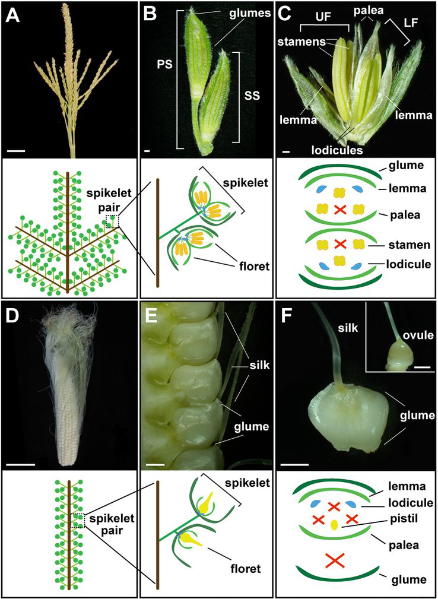

```{r,setup, include=FALSE}
library(knitr)
require(tidyverse)
set.seed(453)
# invalidate cache when the package version changes
knitr::opts_chunk$set(tidy = FALSE, echo = FALSE, 
                  message = FALSE, warning = FALSE,
                  out.width = "45%", cache = TRUE)
options(knitr.table.format = "latex")
options(knitr.kable.NA = "", digits = 2)
options(kableExtra.latex.load_packages = FALSE)

```

# The nature of cross pollinated crops

##

\bcolumns
\column{0.5\textwidth}
\footnotesize
- Plant species where normal mode of seed set is through a high degree of cross-pollination have characteristic reproductive features and population structure. 
- Each plant receives a blend of pollen from a large number of individuals each having different genotypes.
- Allogamous species (producing seed through cross pollination) or out breeders have characters which promote cross pollination which include dichogamy, monoecy, dioecy, heterostyly, heterogamy, self incompatibility and male sterility.
- Such populations are characterized by a \alert{high degree of heterozygosity} with tremendous \alert{free and potential genetic variation}, which is maintained in a steady state by free gene flow among individuals within the populations. 
- Breeding cross-pollinated species tends to focus on \alert{population improvement} rather than the improvement of individual plants. 

\column{0.5\textwidth}

```{r maize-floral-botany, fig.cap="Normal maize floral development. (A) Mature tassel, the male inflorescence. (B) Pair of tassel spikelets. (C) Dissected tassel spikelet, exposing two male florets. (D) Mature ear, the female inflorescence. (E) Mature ear spikelets. (F) Dissected ear spikelet, containing a single female floret. Inset is a mature ovule with glumes and other floral organs removed. (Source: \\cite{yang2022tissue})", out.width="50%"}

```

\ecolumns

##

- Some important features of out breeders are:
  1. They have random mating. In such population, each genotype has equal chance of mating with all other genotypes
  2. Individuals are heterozygous and have advantage of heterozygosity
  3. Individuals have deleterious recessive gene which are concealed by masking effect of dominant genes.
  4. Out breeders are intolerant to inbreeding. They exhibit high degree of inbreeding depression on selfing.
  5. Cross pollination permits new gene combinations from different sources.
  6. In these species, variability is distributed over entire population.
  7. They have wide adaptability and more flexibility to environmental changes due to heterozygosity and heterogeneity.
- In the development of hybrid varieties, the aim is to identify the most productive heterozygote from the population, which then is produced with the exclusion of other members of the population.

# Population improvement methods

## Classification

- In addition to methods such as mass selection that are applicable to both self-pollinated and cross-pollinated species, there are specific methods that are suited to population improvement. 
<!-- - Certain methods are more effective and readily applied for breeding certain species than others. -->

1. According to the unit of selection – either individual plants or family of plants.
2. According to the populations undergoing selection as either intra-population or inter-population. 

##

\bcolumns
\column{0.6\textwidth}
- In **intra-population** improvement, the end product will be a population or synthetic cultivar, and it may end up elite pure lines for hybrid production. Or, it can also be used for developing mixed genotype cultivars (in self-pollinated crops). Commonly used methods are mass selection, ear-to-row selection and recurrent selection. This consists of both single plant (mass selection) and family based selection (recurrent selection).
- **Inter-population** improvement deals with the selection on the basis of the performance of a cross between two populations. The final product will be a hybrid cultivar with heterosis.

\column{0.4\textwidth}

```{r cross-pollinated, out.width="96%", fig.align='center'}

```

\ecolumns

## Applications of recurrent selection

```{r}
recurrent_applications <- read_csv("./data/recurrent_selection_adapted_hallauer.csv", skip = 2)

recurrent_applications %>% 
  knitr::kable(booktabs = TRUE, caption = "Recurrent selection in soybean. Source: \\cite{lewers2010recurrent}.", longtable = TRUE) %>% 
  kableExtra::kable_styling(latex_options = "striped", font_size = 6) %>% 
  kableExtra::column_spec(column = 1:5, width = c("3em", "5em", "4em", "4em", "20em"))
```


## Mass selection

- It is the simplest, easiest and oldest method of selection where individual plants are selected based on phenotypic performance\footnote[frame]{\scriptsize The terms 'mass selection' and 'phenotypic recurrent selection' are sometimes used interchangeably; although clear distinction exists. The difference between genotypic and phenotypic recurrent selection is that genotypic recurrent selection is based on progeny performance (combining ability). Phenotypic recurrent selection is based on the phenotype of the individual, and does not include progeny testing.}, and seeds are bulked.
- It is effective in maize improvement at the initial stages but its efficacy is poor for improvement of yield.
- The selection after pollination does not provide any control over the pollen parent as result of which effective selection is limited only to female parents. 
- The heritability estimates are reduced by half, since only female parents are used to harvest seed whereas the pollen source is not known after the cross pollination has taken place.
- Also, since this selection is solely based on phenotype, heritability of the trait plays a pivotal role in its effectiveness -- mostly effective for additive genes.

## Expected genetic advance

\[
\Delta G = \left[ \frac{\frac{1}{2}i \sigma^2_A}{\sigma^2_p} \right] = \left[ \frac{\frac{1}{2}i \sigma^2_A}{\sigma^2_A + \sigma^2_D + \sigma^2_{AE} + \sigma^2_{DE} + \sigma^2_e + \sigma^2_{me}} \right]
\]

- Where,
  - $\sigma_p$ = Phenotypic standard deviation in the population
  - $\sigma^2_A$ = Additive variance
  - $\sigma^2_D$ = Dominance variance

Other factors are interaction variances. $\Delta G_m$ doubles with both sexes. This large denominator makes mass selection inefficient for low heritability traits.

## Recurrent selection

- A cyclical method of population improvement that was developed for the purpose of increasing a population's frequency of desirable alleles and allele combinations for one or more quantitatively inherited traits.
- A cycle consists of three steps: evaluation, selection and intermating/recombination.

<!-- - Populations and lines derived from recurrent selection are important direct or indirect sources of improved cultivars for many crops. -->

<!-- - Recurrent selection has been used to increase yield, alter seed or plant quality, increase pest resistance, and improve tolerance to the environment (Hallauer 1985). Recurrent selection also can be used to adapt exotic germplasm (Simmonds 1993) for the purpose of increasing crop genetic diversity and maintaining long-term genetic gain for important agronomic traits. -->

<!-- - If hundreds of hybrids are produced per cross-pollination, and cross-pollination can be accomplished by using wind or insects as vectors, or if manual cross-pollination of selected individual plants is routine, then more complex recurrent selection methods are applicable. Such is the case with maize (Zea mays), so it is not surprising that recurrent selection as a breeding method was developed by individuals working with maize (Hallauer 1992) -->

\small
- In the simplest form, recurrent selection consists of selecting desired individuals within a population prior to mating followed by the intermating of selected individuals. Consequently, both female and male gametes have undergone selection, and genetic progress should be at least 100% faster than for mass selection.
- Recurrent selection scheme are variations of modification of progeny selection or ear to row method.
- Steps:
  \begin{itemize}
  \footnotesize
  \item Visually selected individuals out of the base population undergo progeny testing
  \item The parents are crossed in all possible combinations and individual families are created for evaluation, 
  \item The families are evaluated and a new set of parents are selected, and 
  \item The selected parents are inter-mated to produce the population for the next cycle of selection.
  \end{itemize}
- The aforesaid cycle is repeated several times (3-5 times). The original cycle is labelled $C_0$ and is called the base population. The subsequent cycles are named as $C_1, C_2, C_3, ... C_n$

## Types of recurrent selection

- Simple recurrent selection: Similar to mass selection with 1-2 year per cycle. Does not involve a tester. Phenotypic scores are the basis for selection (aka., Phenotypic recurrent selection).
- Recurrent selection for general combining ability (Half sib progeny test procedure): When additive gene effects are more important.
- Recurrent selection for specific combining ability: When overdominance gene effects are more important.
- Reciprocal recurrent selection: When both gene effects are important. Two heterozygous population are involved, each serving as a tester for the other.

## Expected genetic advance

$$\Delta G = \frac{CiV_A}{y \sigma_p}$$

- Where,
  - $\Delta G$ = Expected genetic advance
  - $C$ = Measure of parental control (C = 0.5 if selection is based on one parent and equals 1 when both parents are involved)
  - $i$ = Selection intensity
  - $V_A$ = Additive genetic variance among the units of selection
  - $y$ = Number of years per cycle
  - $\sigma_p$ = Phenotypic standard deviation among the units of selection

## Simple recurrent selection

\bcolumns
\column{0.6\textwidth}
\small
- This method of selection is useful to improve one or more traits so that a new population that is superior to the original population is achieved.
- The source material may be random mating populations, synthetic cultivars and single-cross or double-cross plants.
- The improved population may be released as a new cultivar or used as a breding material (parent) in other breeding programmes.
- This selection ensures improvement of population without reduction in genetic variability.
- It is advisable to include as many parent as possible in the initial crossing to increase genetic diversity.
- The breeder can decide on the number of generations of inter-mating that is appropriate for a breeding programme.

\column{0.4\textwidth}

```{r simple-recurrent-selection, out.width="98%", fig.cap="Simple recurrent selection", fig.align='center'}

```

\ecolumns

## Expected variance after k stages of selection 

$$
\textbf{S}_{Q} = \Psi_n(y) = E(Y^2|\textbf{S}_{Q})- \left[E(Y|\textbf{S}_{Q})\right]^2
$$

# Progeny testing

##

<!-- Provide a analogy of milk yield in bulls. A bull may inseminate a large number of potential/fertile cows, thus producing a number of offsprings. Hence, based on the performance of female offsprings of the crosses, true breeding value/genetic usefulness of the bull in milk production can be determined. -->

<!-- Here too, an individual plant can be used to pollinate (as a male parent) a large number of female lines. Thus the performance of the progenies from large number of such crosses can be used to calculate the usefulness (GCA or SCA) of the given pollinator plant. -->

```{r progeny-testing, out.width="60%", fig.align='center'}
# remove this and include a high resolution image

```

## Half-sib selection with progeny testing

\bcolumns
\column{0.6\textwidth}
\small
- Selections are made based on progeny test performance instead of phenotypic appearance of the parental plants. 
- Seed from selected half-sibs, which have been pollinated by random pollen from the population (meaning that only the female parent is known and selected, hence the term "half-sib") is grown in unreplicated progeny rows for the purpose of selection. 
- A part of the seed is planted to determine the yielding ability, or breeding value, for any character of each plant. 
- The seed from the most productive rows or remnant seed from the outstanding half-sibs is bulked to complete one cycle of selection.

\column{0.4\textwidth}

```{r half-sib-selection, fig.cap="Generalized steps of half sib selection scheme", out.width="88%", fig.align='center'}
knitr::include_graphics("./images/half_sib_selection.png")
```

\ecolumns

## Full-sib selection with progeny testing

- A number of full-sib families, each produced by making crosses between the two plants from the base population are evaluated in replicated trials. 
- A part of each full-sib family is saved for recombination. Based on evaluation the remnant seed of selected full-sib families is used to recombine the best families.

## Estimate of genetic gain

\bcolumns
\column{0.4\textwidth}

$$
\Delta_{FS} = \left[\frac{i \sigma^2_A}{2 \sigma_{FS}}\right]
$$

Where $\sigma_{FS}$ is the phenotypic standard deviation of the full-sib families.

\column{0.6\textwidth}

```{r full-sib-selection, fig.cap="Generalized steps of full sib family selection", out.width="88%", fig.align='center'}

```

\ecolumns

# Bibliography

## References

- Recurrent selection in soybean, Plant Breeding Reviews, Volume 15
