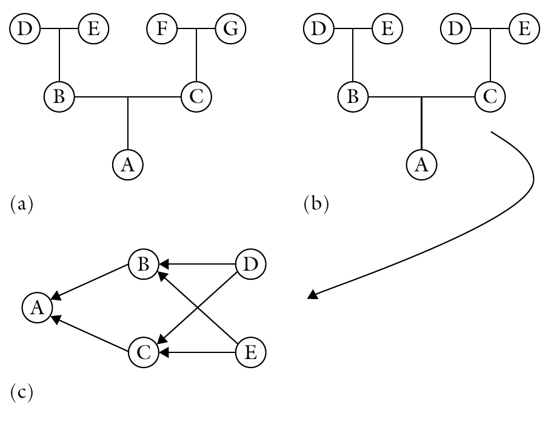
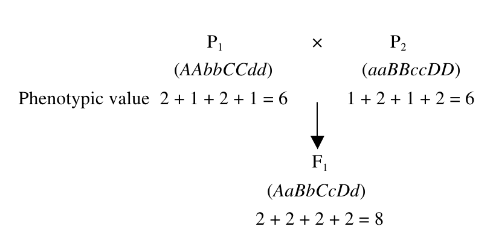
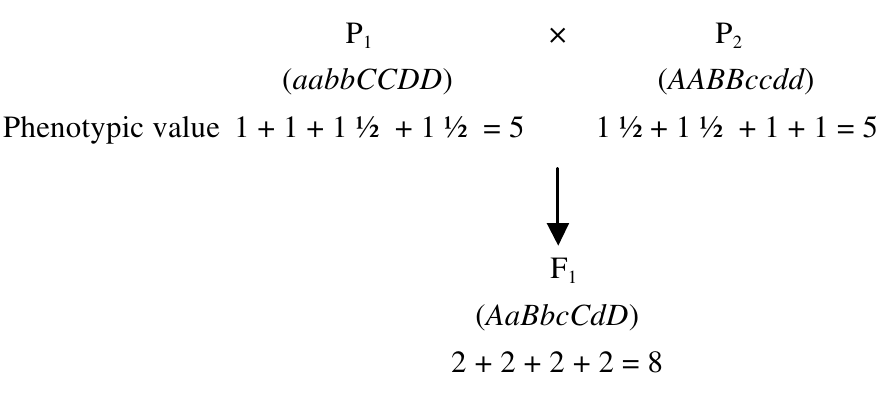
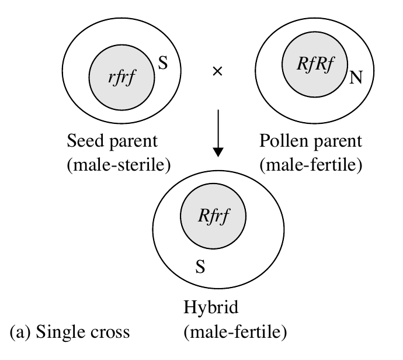
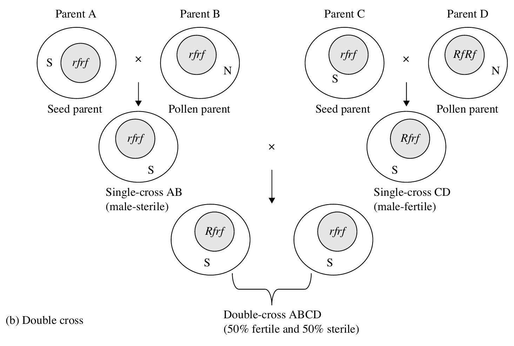

```{r,setup, include=FALSE}
library(knitr)
require(tidyverse)
set.seed(453)
# invalidate cache when the package version changes
knitr::opts_chunk$set(tidy = FALSE, echo = FALSE, 
                  message = FALSE, warning = FALSE,
                  out.width = "45%", cache = TRUE)
options(knitr.table.format = "latex")
options(knitr.kable.NA = "", digits = 2)
options(kableExtra.latex.load_packages = FALSE)
```


# Hybrid vigour (Heterosis)

##

- Hybrid vigor may be defined as the increase in size, vigor, fertility, and overall productivity of a hybrid plant over the mid-parent value (average performance of the two parents). 
- It is calculated as the difference between the crossbred and inbred means:

$$\text{Hybrid vigour} = \frac{F_1-\frac{(P_1+P_2)}{2}}{\frac{(P_1+P_2)}{2}}$$

- The estimate is usually calculated as a percentage.
- The synonymous term, heterosis, was coined by G.H. Shull.
- Advantageous hybrid vigor is observed more frequently when breeders cross parents that are genetically diverse; When two inbred lines of outbred species are crossed.
- The practical definition of heterosis is hybrid vigor that greatly exceeds the better or higher parent in a cross.
- Hybrid breeding in maize quadrupled yields of maize in US between 1930s and 1970s.

# Inbreeding depression

##

- Inbreeding depression is reduction in fitness as a direct result of inbreeding. 
- In theory, the heterosis observed on crossing is expected to be equal to the depression upon inbreeding, considering a large number of crosses between lines derived from a single base population. 
- In practice, plant breeders are interested in heterosis expressed by specific crosses between selected parents, or between populations that have no known common origin.
- Reduction in fitness is usually manifested as a reduction in vigor, fertility, and productivity. 
- The effect is more severe in the early generations (5-8). 
- Plants including onions, sunflower, cucurbits, and rye are more tolerant of inbreeding with minimal consequences of inbreeding depression. 
- Plants such as alfalfa and carrot are highly intolerant of inbreeding.

##

- Inbreeding is measured by the coefficient of inbreeding (F), which is the probability of identity of alleles by descent. The range of F is zero (no inbreeding; random mating) to one (prolonged selfing).
- An unfit (deleterious) recessive allele is fairly quickly reduced in frequency but declines slowly thereafter. 
- On the other hand, an unfit dominant allele is rapidly eliminated from the population, while an intermediate allele is reduced more rapidly than a recessive allele because the former is open to selection in the heterozygote.
- The consequence of these outcomes is that unfit dominant or intermediate alleles are rare in cross-breeding populations, while unfit recessive alleles persist because they are protected by their recessiveness.

##

- In Figure \ref{fig:inbreeding-coefficient} (a) there is no inbreeding because there is no common ancestral pathway to the individual, A (i.e., all parents are different).
- However, in Figure \ref{fig:inbreeding-coefficient} (b) inbreeding exists because B and C have common parents (D and E), that is, they are full sibs.
- To calculate the amount of inbreeding, the standard pedigree is converted to an arrow diagram, as shown in Figure \ref{fig:inbreeding-coefficient} (c). 
- Each individual contributes 1/2 of its genotype to its offspring. The *coefficient of relationship* (R) is calculated by summing up all the pathways between two individuals through a common ancestor as: $R_{BC} = \sum{\left(\frac{1}{2}\right)^s}$ , where s is the number of steps (arrows) from B to the common ancestor and back to C. For example, B and C probably inherited $(1/2)(1/2) = 1/4$ of their genes in common through ancestor D. Similarly, B and C probably inherited 1/4 of their genes in common through ancestor E. 
- The coefficient of relationship between B and C, as a result of common ancestry, is hence $R_{BC} = 1/4 + 1/4 = 1/2 = 50\%$

##

```{r inbreeding-coefficient, fig.cap="Pedigree diagrams can be drawn in the standard form (a, b) or converted to into an arrow diagram (c).", fig.align="center", out.width="60%"}
# pdftools::pdf_convert("./../../references_plb/Principles of Plant Genetics and Breeding.pdf", pages = 64, format = "png", filenames = "./images/arrow_diagram.png", dpi = 300)

```

# Genetic basis of heterosis

##

- To explain the genetic basis for why fitness lost on inbreeding tends to be restored upon crossing, two theories have been proposed.
  - Dominance theory: C.G. Davenport in 1908 and later by I.M. Lerner, 
  - Overdominance theory: Shull in 1908 and later by K. Mather and J.L. Jinks. 
  
- A third theory, the mechanism of epistasis (non-allelic gene interactions), has also been proposed.

## Dominance theory

\small
- Assumes that vigor in plants is conditioned by dominant alleles, recessive alleles being deleterious or neutral in effect. 
- \alert{A genotype with more dominant alleles will be more vigorous than one with few dominant alleles.}
- Consequently, crossing two parents with complementary dominant alleles will concentrate more favorable alleles in the hybrid than either parent. 
- Inbreeding depression occurs upon selfing because the deleterious recessive alleles that were protected in the heterozygous condition (\alert{heterozygous advantage}) become homozygous and are expressed.
- Assume that each dominant genotype contributes 2 units to the phenotype, while a recessive genotype contributes 1 unit. A cross between two inbred parents would result in:

```{r dominance-theory, fig.align="center", out.width="40%"}
# pdftools::pdf_convert("./../../references_plb/Principles of Plant Genetics and Breeding.pdf", pages = 368, format = "png", filenames = "./images/dominance_theory.png", dpi = 300)

```

## Overdominance theory

\small
- The phenomenon of the heterozygote being superior to the homozygote (i.e., heterozygosity _per se_ is assumed to be responsible for heterosis). 
- Theory assumes that the alleles of a gene (e.g., A, a) are contrasting but each has a different favorable effect in the plant. 
- A genotype with more heterozygous loci would be more vigorous than one with less heterozygotes.
- Consider a quantitative trait conditioned by four loci, and assume that recessive, heterozygote, and homozygote dominants contribute 1, 2, and 1.5 units to the phenotypic value, respectively:

```{r overdominance-theory, fig.align="center", out.width="50%"}
# pdftools::pdf_convert("./../../references_plb/Principles of Plant Genetics and Breeding.pdf", pages = 369, format = "png", filenames = "./images/overdominance_theory.png", dpi = 300)

```

# Biometrics of heterosis

### Better parent heterosis (Heterobeltiosis)

$$\large \text{Hybrid vigour} = \frac{F_1-\text{Better parent}}{\text{Better parent}}$$

### Mid parent heterosis

$$\large \text{Hybrid vigour} = \frac{F_1-\frac{(P_1+P_2)}{2}}{\frac{(P_1+P_2)}{2}}$$

### Commercial heterosis

$$\large \text{Hybrid vigour} = \frac{F_1-\text{Commercial hybrid}}{\text{Commercial hybrid}}$$

# Types of hybrids

##

- Commercial applications of hybrid breeding started with a cross of two inbred lines (a single cross - AxB) and later shifted to the more economic double cross, ([AxB]x[CxD]) and then back to a single cross. 
- Other parent combinations in hybrid development have been proposed, including the three-way cross ([AxB]xC) and modified versions of the single cross, in which closely related crosses showed that the single cross was superior in performance to the other two in terms of average yield. 
- However, it was noted also that the genotype x environment interaction (hybrid x environment) variability was more than twice that for the double crosses, while the mean variability for the three-way cross being intermediate.

##

- This indicated that the single crosses were more sensitive or responsive to environmental conditions than the other crosses. 
- Whereas high average yield is important to the producer, consistency in performance across years and locations (i.e., yield stability) is also important. 
- Double and three-way crosses have a more genetically divergent population for achieving buffering. 
- Today commercial hybrids are predominantly single cross, of best combining parental inbred lines.
- For outline of mating scheme, See Lecture 7 on "Hybridization techniques and its consequences". 

## Breeding of CMS hybrids

\bcolumns
\column{0.35\textwidth}
```{r cms-hybrids-single, fig.cap="Breeding of single cross hybrid using CMS system. N, normal cytoplasm; S, sterile cytoplasm. Parent A=A-line; parent B=B-line, and parent D=R-line.", fig.align="center", out.width="90%"}
# pdftools::pdf_convert("./../../references_plb/Principles of Plant Genetics and Breeding.pdf", pages = 372, format = "png", filenames = "./images/cms_hybrids.png", dpi = 300)

```

\column{0.65\textwidth}
```{r cms-hybrids-double, fig.cap="Breeding of double cross hybrid using CMS system.", fig.align="center", out.width="98%"}

```

\ecolumns