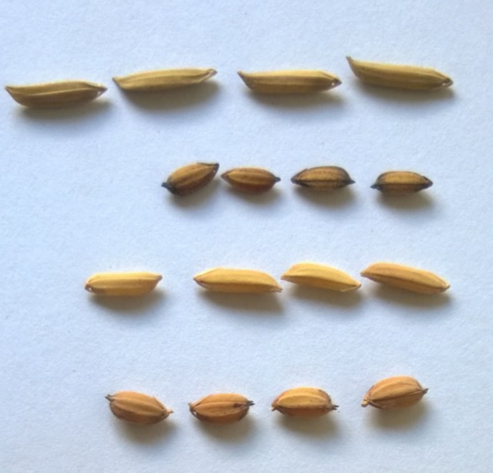
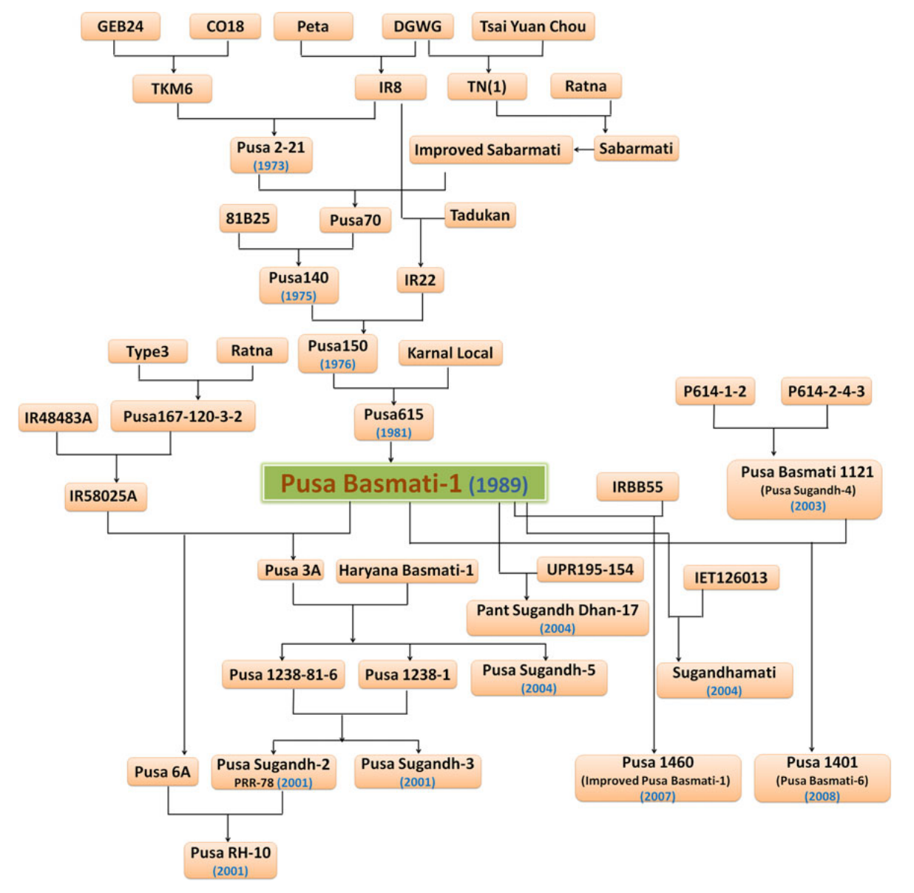
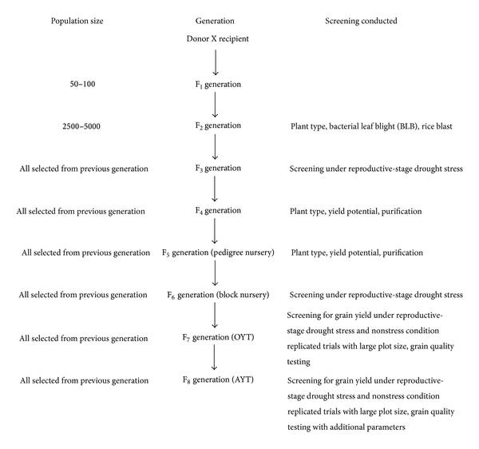
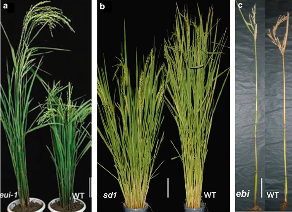
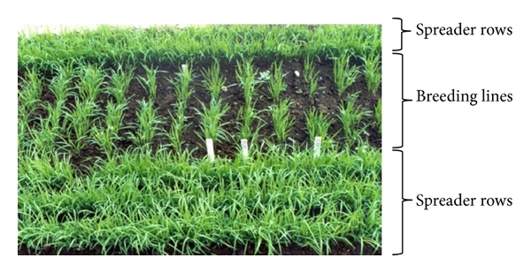

```{r,setup, include=FALSE}
library(knitr)
require(tidyverse)
set.seed(453)
# invalidate cache when the package version changes
knitr::opts_chunk$set(tidy = FALSE, echo = FALSE, 
                  message = FALSE, warning = FALSE,
                  out.width = "45%", cache = TRUE)
options(knitr.table.format = "latex")
options(knitr.kable.NA = "", digits = 2)
options(kableExtra.latex.load_packages = FALSE)
```

# Introduction

## Breeding methods for improvement of self-pollinated crops

<!-- - Lecture 14, Cornell University lecture series on Genetic Improvement of Crop Plants -- https://www.youtube.com/watch?v=p-jsjIpUFTE -->
<!-- - Phylogentic relationship between different rice subspecies and groups -- Molecular evaluation of genetic diversity and association studies in Rice (Oryza sativa L.) [@vanniarajan2012molecular] -->
<!-- - Genetic structure and diversity in Oryza sativa L. [@garris2005genetic] -->

- A species' breeding system has been commonly defined as a qualitative trait\footnote[frame]{https://www.nature.com/articles/ncomms13313}.
- Pedigree (most widely used)
- Bulk breeding
- Single seed descent (SSD)
- Anther culture
- Backcross breeding
- Other methods
  - Hybrid breeding
  - Transgenic
  - Mutation breeding
  - Pureline selection
  - Molecular breeding
  - Doubled haploids

## Desirable characteristics of a breeding program

- Systematic and clear selection criteria
- High-volume crossing (more so if you don't know the parents)
- Effective screening of materials
- Early identification of superior lines (progenies start to accumulate homozygosity very soon)
- Multi location testing and nursery sites

# Rice breeding

##

- Most important food crop with a total production of >650 million ton occupying ~11% of the world's total arable area.
- Supplies 2808 calories/person/day (21% of total calorie supply).
- Origin: South East Asia
- Distribution: Humid tropical and subtropical climate. 90% of the world rice production is consumed in SE Asia. China, India, Japan, Korea, Pakistan, Bangladesh, etc. major rice growing countries.
- Cultivated rice species:
  \begin{enumerate}
  \footnotesize
  \item Oryza sativa: Asian rice
  \item Oryza glaberrima: African rice
  \end{enumerate}

## Species in the genus Oryza (Vaughan, 2008)

```{r rice-section-complex-species, warning=FALSE, message=FALSE}
rice_diversity <- readr::read_csv("./data/rice-diversity-dvaughan.csv", na = "") 

rice_diversity[1:13,]%>% 
  knitr::kable(booktabs = TRUE) %>% 
  kableExtra::collapse_rows(columns = 1:2) %>% 
  kableExtra::kable_styling(font_size = 5) %>% 
  kableExtra::column_spec(column = 1:6, width = c("5em", "9em", "24em", "6em", "5em", "18em"))
```

##

```{r rice-section-complex-species2, warning=FALSE, message=FALSE}
rice_diversity[14:24,]%>% 
  knitr::kable(booktabs = TRUE) %>% 
  kableExtra::collapse_rows(columns = 1:2) %>% 
  kableExtra::kable_styling(font_size = 6) %>% 
  kableExtra::column_spec(column = 1:6, width = c("4em", "8em", "16em", "7em", "4em", "8em"))
```


## Origin of rice

1. Monophyletic origin
    - Both asian rice and african rice arose from a commmon parent ( _O. perennis_).
    - Most accepted theory because both Asian rice and african rice are similar except for glume pubescence, ligule size and color of pericarp which is red in color in African rice. _O. glaberrima_ is thought to have originated in the upper valley of Niger river in Africa.
2. Polyphyletic origin: According to this theory, the two forms of cultivated rice have evolved independently in their respective regions form several species.

- Rice varieties are primarily classified according to the length of the grain 
  - short (5.5 mm) (mostly Japonica types, responsive to heavy fertilization), 
  - medium (6.6 mm), and
  - long (7-8 mm) (mostly called Indica types, have taller, weaker stems that lodge under heavy fertilization). 

##

<!-- \footnote[frame]{\url{https://european-seed.com/wp-content/uploads/2020/03/KKASP-Webinar_Slides_.pdf}} -->

\bcolumns
\column{0.4\textwidth}

- The complete rice genome is about 430 Mbp with
  - 39,045 protein coding sequences
  - 35% is repetitive sequences
  - 48,000 Simple Sequence Repeats (SSRs)

\column{0.6\textwidth}

```{r rice-kernels-diversity1, out.width="50%"}
# pdftools::pdf_convert("~/Desktop/KKASP-Webinar_Slides_rice.pdf", pages = 7, format = "png", filenames = "rice_kernels_diversity.png", dpi = 300)

```

```{r rice-kernels-diversity2, out.width="50%"}
# pdftools::pdf_convert("~/Desktop/KKASP-Webinar_Slides_rice.pdf", pages = 7, format = "png", filenames = "rice_kernels_diversity.png", dpi = 300)
knitr::include_graphics("./images/rice_kernels_diversity2.png")
```

\ecolumns

##

```{r basmati-rice-pedigree, fig.cap="A pedigree diagram describing the development of Basmati rice through breeding.", fig.align='center', out.width="58%"}
# pdftools::pdf_convert("~/Downloads/Siddiq2012_Article_BasmatiRicesGeneticsBreedingAn.pdf", format = "png", pages = 6, filenames = "./images/rice_basmati_pedigree.png", dpi = 200)

```

<!-- ## USDA rice breeding program: Timeline of development of Saber rice -->

<!-- - Year 1: -->
<!--   - Make cross B8910 (Gulfmont/RU8703196//TeQing) in the greenhouse and produce 27 $F_1$ seed. -->
<!--   - Plant each F1 seed in separate containers in greenhouse. Harvest F2 seeds from each F1 plant separately. -->
<!--   - Plant the bulk of each F1 derived F2 population in a fall-planted nursery in Puerto Rico. Three of the F1 derived populations appear to be selfs and discarded. Strip bulk F3 seeds from F2 plants at harvest. -->

<!-- - Year 2:  -->
<!--   - Plant the bulk of the F1 derived F3 populations in winter planted nursery in Puerto Rico. Strip bulk F4 seed from F3 plants.  -->
<!--   - Plant the bulk of the F1 derived F4 populations in a summer nursery in Beaumont, TX. Strip bulk F5 seed from F4 plants. -->

<!-- - Year 3: -->
<!--   - Plant the bulk of the F5 population in the summer nursery.  -->
<!--   - Select panicles from a total of 215 plants for the B8910 project based upon field observations of plant height, days to heading, good tillering capacity, and good appearing grain dimensions. -->

<!-- - Year 4: -->
<!--   - Plant 215 F6 panicle rows in the summer nursery. Select 63 rows based upon field observations of plant height, days to heading, good tillering capacity, and good appearing grain dimensions. Harvest five panicles per row. -->

<!-- - Year 5: -->
<!--   - Plant five F7 panicle rows from each of 63 F6 derived families in the fall-planted nursery in Puerto Rico. Select 29 rows based upon field observations of plant height, maturity relative to check varieties, good tillering capacity, and good appearing grain dimensions. In each selected row harvest five panicles and bulk harvest the row. -->

<!-- - Year 6: -->
<!--   - F8 panicle rows are planted in the summer breeding nursery for each of the 29 families. Ten F9 panicles are selected from one of the five rows for each of the 29 families.  -->
<!--   - In addition, the bulk harvested F8 seed from Puerto Rico from each of the 29 families is planted in an unreplicated yield trial with some 600 other entries during the summer. In this trial, data is collected on height, heading, harvest maturity, yield, milling yield, and resistance to blast disease using inoculated disease screening nursery. Fourteen of the 29 yield plots from the B8910 project are selected to undergo further evaluation during the winter for grain cooking quality traits (i.e. amylose content and alkali spreading value) and grain chalkiness (Webb, 1985). Using these data, five lines are selected for testing in the following year. -->

<!-- - Year 7: -->
<!--   - The ten F9 panicle rows from each of the five families selected based upon the yield trial are planted in the summer breeding nursery. One row is selected from each of the five families and ten panicles are picked. -->
<!--   - Using the bulked yield plot seed from Year 6, one of the five families is entered into the Uniform Rice Regional Nursery (URRN) as entry RU9603178. The URRN is an extensive replicated yield trial that includes a total of 200 entries from four southern rice breeding programs and is planted in Texas, Arkansas, Louisiana, and Mississippi. This study has two sections: Advanced entries, which are replicated four times, and Preliminary entries, which are replicated twice. RU9603178 is entered into the Preliminary trial section based upon limited availability of seed. In addition to the standard yield, agronomic, milling, and cooking quality traits that are evaluated, several states screen all 200 entries in inoculated nurseries for resistance to blast and sheath blight diseases as well as the physiological disorder, straighthead. Two of the states evaluate all entries for ratoon crop yield and for reaction to nine individual races of blast using controlled greenhouse conditions. All of the entries from the Beaumont program that are in the URRN trial also undergo additional yield testing at 2–3 other Texas locations that are representative of the state’s rice growing area. The other four entries from the B8910 cross are planted only in these Texas replicated yield trials. -->
<!--   - Results from the URRN analyzed during the winter demonstrate that RU9603178 has very good main and ratoon crop yield, good resistance to all races of blast disease (including IB49 rating of 1 on a scale of 0 to 9), good tolerance to sheath blight (rating of 4 on a scale of 0 to 9) and straighthead, very clear, non-chalky grain, cooking quality of typical United States long grains, and excellent milling quality. It is advanced for testing in year following along with one of the other four entries (BPRE 18) that had been tested in the Texas state-wide trials. -->

<!-- - Year 8: -->
<!--   - Ten F9 derived F10 panicle rows of RU9603178 and of BPRE 18 are planted in the summer nursery and 20 panicles are selected from one row of the two entries. Bulked F10 seed from the Year 7 URRN yield trial in Beaumont of entry RU9603178 is used to plant in the Advanced section of the Year 7 URRN as entry 23.  -->
<!--   - The other B8910 project line (BPRE 18) is entered into the Advanced URRN as entry 32 using seed harvested from one of the Year 7 Texas replicated trials. The Advanced entries of the URRN are tested using four replications at the four state locations and the Texas entries of the URRN are also evaluated in the multilocation replicated trials within Texas. -->
<!--   - Results from these trials indicate that RU9603178 continues to demonstrate competitive yield potential, excellent milling quality, and has moderate tolerance (rating of 6) to the sheath blight pathogen. The other B8910 line, entry 32, does not perform as well as RU9603178 and is dropped from further testing. Moreover, RU9603178 demonstrates resistance to all races of the blast fungus. Based upon this spectrum of resistance and the pedigree of RU960178, this suggests that the line may possess a novel major resistance gene to P. grisea. Previous research had demonstrated success in developing genetic markers associated with major genes which control rice cooking quality (Ayres et al., 1997). This spawned further research to identify the novel resistance gene and develop closely linked DNA markers. -->
<!--   - During the fall of Year 8, twenty F11 panicles from the summer breeding nursery selection of RU9603178 are planted in the Puerto Rico nursery. 287 F12 panicles are harvested from the 20 panicle rows in Puerto Rico. -->

<!-- - Year 9: -->
<!--   - The 287 F12 panicles are planted in an isolation block during the summer at Beaumont (Headrow 1). Thirty rows are selected and 20 panicles per row are harvested. Twenty-two rows are removed that are earlier, later, or taller than the others and then the remaining rows are bulk harvested. In addition, detailed phenotypic data are collected from the Headrow 1 field as an objective description of cultivar, which is required for application to the state department of agriculture certified seed program. -->
<!--   - RU9603178 is evaluated in the Year 9 URRN and Texas state-wide trials using the bulked harvested F11 seed from the Year 8 yield trial. Results demonstrate that RU9603178 has main crop and ratoon crop yield competitive with other cultivars in its maturity group, some lodging susceptibility at two locations, excellent milling yield, and good tolerance to sheath blight disease (rating of 2). Its reaction to eight races of blast shows excellent resistance; however, it appears to be segregating for resistance to race IB49 (rating of 2 and 4). -->

<!-- - Year 10: -->
<!--   - In an effort to further clarify the level of resistance to the IB49 race of blast, F13 seed from the 265 bulk harvested Year 9 Headrow 1 is evaluated for reaction to race IB49 during the Year 10 spring greenhouse. Of some 300 seedlings that are screened, 37% are highly resistant (rating of 1–2), 61% are moderately resistant (rating of 3–4), and 2% are susceptible (rating of 5–6). This suggests that further selection in RU9601378 may allow for improvement in resistance to this pathotype. -->
<!--   - During the summer, RU9603178 is evaluated in the same manner as before in the Year 10 URRN and Texas state-wide trials using the bulked harvested F13 seed from the 265 rows in Headrow 1. Agronomic and milling quality results from this trial are consistent with the previous year. Its reaction to eight of the blast races shows excellent resistance; however, it is rated as susceptible (4) to IB49. Headrow 2 is planted in the summer using 596 F13 panicle rows derived from the 30 row selections from Year 9. The information collected for the objective description of the variety in the Year 9 headrow is verified in the Headrow 2 field. Each of the 596 rows is harvested separately for verification of reaction to blast race IB49 during the fall greenhouse. Over 99% of the families are rated as highly resistant (rating of 1–2) and the remaining families are rated as moderately resistant (rating of 3). This indicates that the 30 families that had been selected in the 1998 Headrow 1, and which constitute Headrow 2, are highly resistant to this pathotype. -->

<!-- - Year 11: -->
<!--   - Approximately 20 F14 families that had been rated as resistant (i.e., 1) and 20 families that had been rated as moderately resistant (i.e., 3) in the fall Year 10 greenhouse are re-evaluated in the spring Year 11 greenhouse with IB49. All plants in the 40 families are confirmed to be resistant or moderately resistant and no susceptible plants are identified. This verifies the resistant-moderate resistant rating to IB49 infection of Headrow 2 of RU9603178 and indicates that resistance is not due to escapes nor is there heterogeneity for susceptibility. However, as a precaution, families rated as 3 are eliminated and only families that families rated as 3 are provided to the foundation seed program. The objective description of the variety is provided to the state inspector to evaluate the foundation seed yield. -->
<!--   - Families that had a resistance rating of 2 to IB49 are bulked and used for further field testing during Year 11. The same battery of field trials, disease screenings, and quality tests are conducted as before. DNA markers are developed that are associated with the Pi-b blast resistance gene which is found in TeQing and explains the multirace resistance to blast that is observed in RU9603178 (Fjellstrom et al., 2004).  -->
<!--   - By the end of the Year 11 field season, RU9603178 has been evaluated at over 40 environments and it is decided to proceed with public release of the variety. The name "Saber" is selected in honor of the Texas A&M University Corps of Cadets. The complete set of data collected over the previous five field seasons is summarized to justify to the state seed board the release of Saber. In February 2001 (Year 12), the seed board accepts Saber into the state seed certification program; this allows the foundation seed that was produced in Year 11 to be sold as certified (F15 ) seed for the 2001 planting season. -->

# Rice breeding methods

## Rice ideotype

\bcolumns
\column{0.4\textwidth}

- This model plant, known as the rice "new plant type", had few tillers, but all of them bore a large panicle with more than 200 grains on top of thick, lodge-resistant stems. Leaves were thick and erect, with intense green color
- The Green Revolution technology, centered on high-yielding, disease and insect resistant rice varieties, has revolutionized rice production since the late 1960s.

\column{0.6\textwidth}

```{r rice-breeding-yield-drought, out.width="88%", fig.cap="Conventional breeding method of rice for yield and drought response improvement used in IRRI"}

```

\ecolumns

<!-- ```{r breeding-height, fig.cap="The different phenotypes of plant height mutants in rice. The figure shows three different patterns of internode elongation that are regulated by different types of genes. (a) Elongated uppermost internode mutant eui with a longer uppermost internode (left) and its wild type after heading (right; according to Zhu et al., 2006). Bar, 20.7cm. (b) Semi-dwarf mutant sd1 with short stem by decreasing length of each internode (left) and wild-type plants (right). Bar, 14.2cm. (c) Elongated basal internode mutant ebi with special longer basal internode (left) and its wild type (right). Bar, 14.5cm", out.width="80%"} -->
<!--  -->
<!-- ``` -->

## Rice breeding objectives

\bcolumns
\column{0.4\textwidth}

- Grain yield
- Grain quality
- Disease resistance
- Resistance to environmental stresses
- Leaf development/arrangement
- Plant architecture
- Tillering

\column{0.6\textwidth}

```{r rice-disease-breeding, out.width="90%"}

```

\ecolumns

```{r rice-breeding-objectives-stages}
tribble(
  ~Generation, ~`Plant type`, ~`Grain shape`, ~`Maturity`, ~`Height`, ~`Disease resistance`, ~`Yield`, ~`Milling quality`, ~`Cooking quality`,
  "F1", NA, NA, NA, NA, NA, NA, NA, NA,
  "F2", "X", "X", "X", NA, NA, NA, NA, NA,
  "F3", "X", "X", "X", NA, NA, NA, NA, NA,
  "F4", "X", "X", "X", NA, "X", NA, NA, NA,
  "F5", "X", "X", "X", "X", "X", "X", "X", "X",
  "F6", "X", "X", "X", "X", "X", "X", "X", "X",
  "F7", "X", "X", "X", "X", "X", "X", "X", "X"
) %>% 
  knitr::kable(booktabs = TRUE) %>% 
  kableExtra::kable_styling(font_size = 6) %>% 
  kableExtra::column_spec(column = 1:9, width = c(rep("5em", times = 9)))
```


## Mutation breeding

- Among cereals, rice presents highest cases of mutational experiments (barley ranks second). 
- In rice the main improved traits are early maturity, plant height, and disease resistance. 
- The major semidwarfing allele, $sd-1$, is still extensively used in modern rice cultivars. The phenotype of $sd-1$ is consistent with dwarfism that results from a deficiency in gibberellin (GA) plant growth hormones\footnote[frame]{https://www.ncbi.nlm.nih.gov/pmc/articles/PMC6857675/}.
- $sd-1$ was first identified in the Chinese variety Dee-geo-woo-gen (DGWG), and was crossed in the early 1960s with Peta (tall) to develop the semidwarf cultivar IR8, which produced record yields throughout Asia and formed the basis for the development of new high-yielding, semidwarf plant types.
- Most commonly mutated trait over all crops is "semi-dwarfness".

## Molecular breeding

- Knowledge of major genes with significant effect on important traits can improve classical breeding. 
- Specific primers can be made to detect the favorable alleles, making sure they are present in the elite lines.
- One of the genes of high interest to breeders is Ghd7, which simultaneously affects grain number per panicle, plant height,and heading date. This locus alone has a large influence on adaptation to long growing seasons, with high yield potential,or short growing seasons, with lower yield. 
- Studies have reported association of grain filling (and thus yield) with panicle number and spikelet number per panicle (qGA4 and qGA8 QTLs on Chromosome 4 and 8, respectively; the latter may have pleiotropic effect and has links to genes associated with grain weight)\footnote[frame]{https://www.tandfonline.com/doi/full/10.1080/1343943X.2019.1625272}.

# Hybrid rice development

## Types of crosses

- Single crossess
  - P1 x P2
- Backcrosses
  - F1 or F2 are crossed to one of the original parents
- Top cross (Three way cross)\footnote[frame]{\scriptsize Practical reason for employing more than two parents i.e. using three way or double cross is in order to obtain a larger amount of seed. For e.g., if P1 and P3 do not combine readily or yield only few amount of seed, a mediator line P2 can first be crossed with the P1 to fetch adequate amount of seeds, which can then be planted for hybridization with P3.}
  - F1 x P3
- Double cross
  - F1 x F1

##

\bcolumns
\column{0.45\textwidth}

```{r cms-hybrids-rice, fig.align='center', out.width="82%", fig.cap="Conventional hybrid breeding strategy relies on three breeding lines known as A line (the male sterile line), B line (responsible to maintain the genetic male sterility of the A line), and R line (used to restore the fertility of the A line and to produce the hybrid seed)"}
knitr::include_graphics("./images/cms_hybrids_single.png")
```

\column{0.55\textwidth}

- Hybrid rice was first released in China in 1974. Conventional hybrid development technique (Figure \ref{fig:cms-hybrids-rice}) was followed.
- Later a technolgy of two-lines using environmental genetic male sterility (EGMS) counting on photoperiod (PGMS) and temperature (TGMS) sensitivity to induce sterility was in practice.
- The ideal system for these and other self-pollinated crops would be the one-line method utilizing the apomixis system that allows preserving the right cultivar.

\small
- For extended discussion, refer to:
  \begin{enumerate}
  \footnotesize
  \item Heterosis and Hybrid Rice Breeding, \cite{virmani1994heterosis} 
  \item Two-line hybrid rice breeding manual, \cite{virmani2003two}
  \end{enumerate}

\ecolumns

## Requirements of hybrid rice breeding

- Identification and evaluation of male-sterile lines and their restorers; 
- Testcross phase to select heterotic combinations and to initiate conversion of maintainer lines into male-sterile lines; 
- Backcrosses to transfer the cytoplasmic male-sterility to elite maintainer lines;
- Trials to study the combining ability (general and specific) of the parental lines; and foundation seed production of all three lines.

- Production system relies on planting a few rows of the male line (R line) and rows of the female (A line) in such way that the maximum hybrid seed production per unit area occurs in the A line. 
- Various ratios of female to male line seed production have been used (e.g., the 6:2, 8:2, and/or the 10:2 ratios).
- Reported average hybrid seed production in rice lines is between 2.5 and 3.0 t per ha in china but much lower elsewhere.

- [Video: Yuan Longping, China's "Father of Hybrid Rice"| CCTV English](https://www.youtube.com/watch?v=zG7TH05Avvo)
- [Video: Pollination technique in Rice](https://www.youtube.com/watch?v=XlTy2J7DVYw)

# Bibliography

## References
