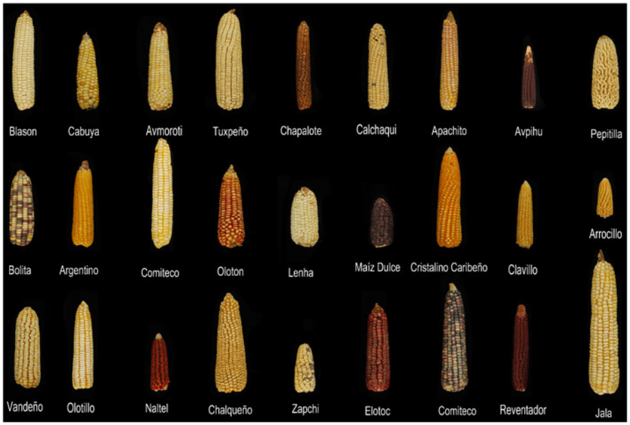
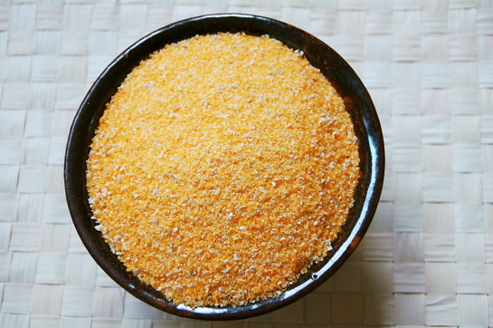
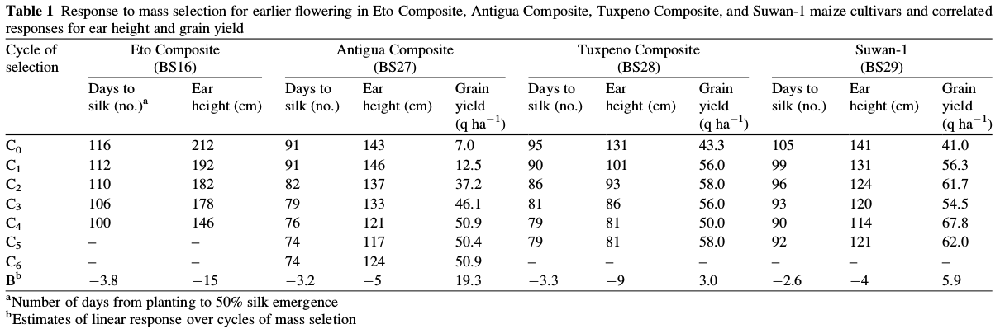
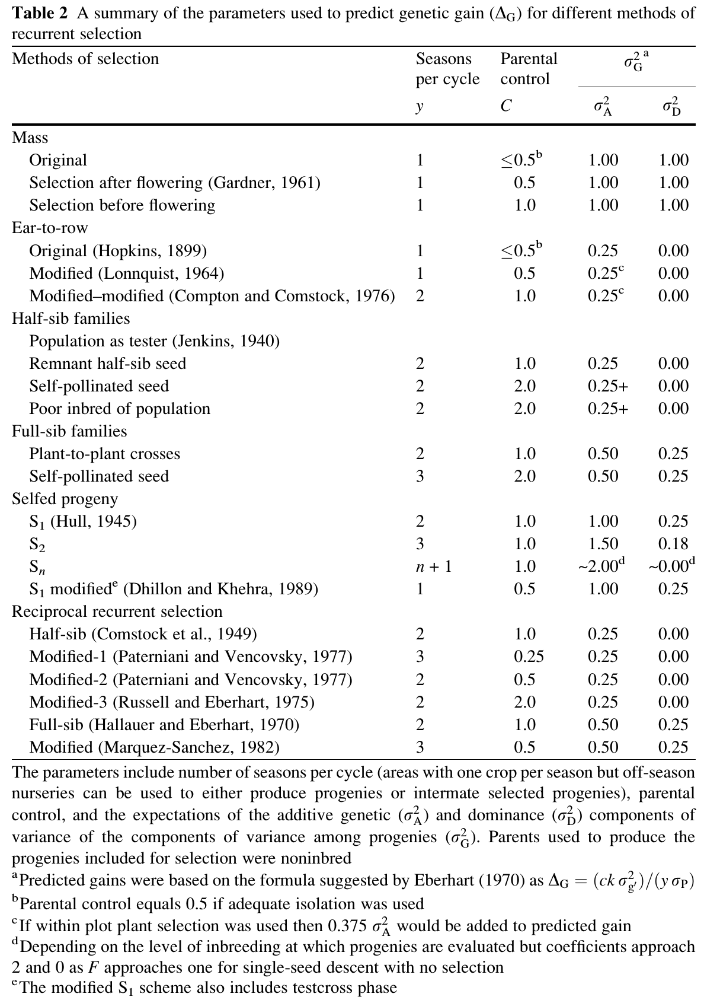
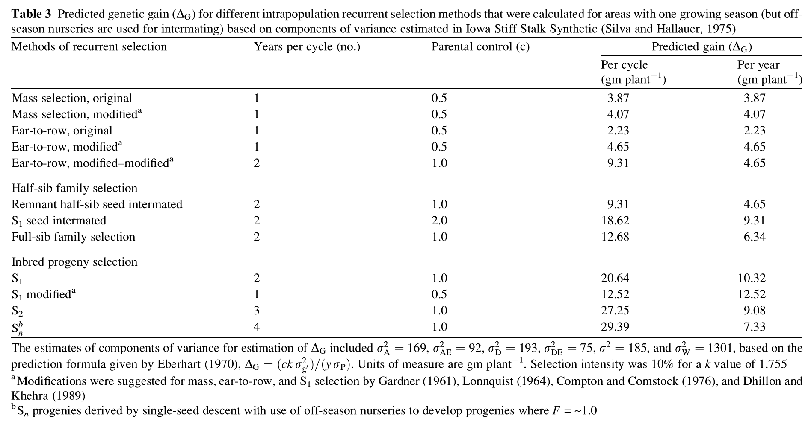
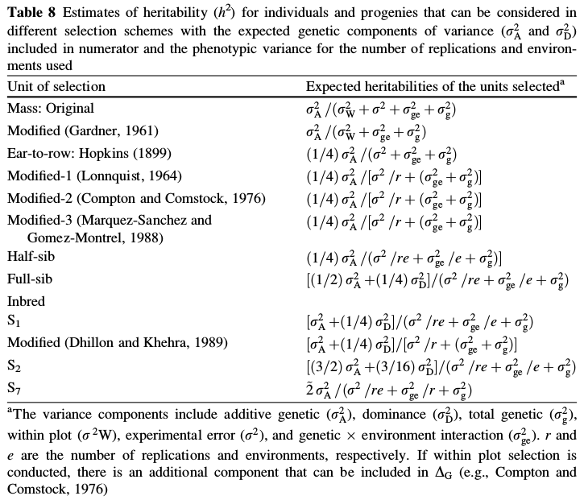

```{r,setup, include=FALSE}
library(knitr)
require(tidyverse)
set.seed(453)
# invalidate cache when the package version changes
knitr::opts_chunk$set(tidy = FALSE, echo = FALSE, 
                  message = FALSE, warning = FALSE,
                  out.width = "45%", cache = TRUE)
options(knitr.table.format = "latex")
options(knitr.kable.NA = "", digits = 2)
options(kableExtra.latex.load_packages = FALSE)
```


# Introduction

## Origin and distribution

\bcolumns
\column{0.5\textwidth}
\small

- Mays is a diploid (2n = 20) and a monocot of the family Poaceae (Graminae)
- The genus has four species: *Zea mays* (cultivated corn and teosinte), *Z. diploperennis* Iltis et. al. (diploperennial teosinte), *Z. luxurians*, and *Z. perennis* (perennial teosinte).
- *Zea mays* spp. *mays* originated from teosinte (*Z. mays* spp mexicana/*parviglumis*) in western hemisphere about 7000-10000 years ago.
- Maize landraces are widely found across continents.
- Cultivated in more > 100 million ha in more than 125 developing countries.
- Maize was only introduced in africa 500 years ago.

\column{0.5\textwidth}

```{r maize-landraces, out.width="92%"}

```

\ecolumns

## Landraces {.standout}

- Landraces are defined mostly by their ear characteristic.
- Ear type is usually maintained by farmers through selection but crops biology itself plays a major role in structuring maize populations.
- American landraces:
  - Tuxpeno (Native to Oaxaca chipas region):
    - Tuxpeno Sequia (Early maturing, drought tolerant)
    - Tuxpeno Crema (Resistant to foot rot disease, short, white kernel, strong stalk)
  - Olotill (Native to Central Depression of Chipas; Shows good performance on unfertile soil; Has two mutant variants of gene Y1 (=psy1), phytoene synthase):
    - Amarillo (Yellow)
    - Blanco (White)
  - Nal-tel (Native to Chiapas; Short growth cycle)
  - Palomero Toluqeno (Adapted to high elevations and low temperature, resistant to Sitophus zeamais)
  - Bolito (Native to Tehuacan region)
  - Pepitilla, Bolita, Azul, Tlacoya (Excellent tortilla quality)

##

- Indian landraces:
  - Sikkim primitive (Murali):
    - 5-9 ears on a single stalk (high prolificacy)
    - Popcorn type
    - Tassel long and drooping
    
- Perennial teosinte (*Z. diploperennis*) and Tripsacum dactyloides have relatively high resistance to striga weed. Striga resistant inbred: ZD05
- Creolization: Process of encouraging gene exchange in maize landraces by growing different varieties in adjacent areas, and continually selecting seed of those varieties for replanting.

## Maize cytology and genomics

- Monoploids (haploids) may arise spontaneously by pathogenesis (unfertilized egg develops into a plant).
- Occasionally, paternal haploids develop by androgenesis. The average frequency of this
event in corn is estimated at one per thousand kernels. These lines may be used to develop homozygous diploid inbred lines for hybrid production. They can also be used to convert inbred lines with male fertility to male sterile cytoplasm.
- Tetraploid corn was shown to have gigas effects.
- In 2012, genome of B73 (popular US Corn Belt inbred) and Palomero (Mexican popcorn landrace) was sequenced.
- In addition to the autosomes or normal or standard chromosomes (A-chromosomes), corn has supernumerary elements such as the B-chromosomes. 

##

<!-- - The role of the B-chromosomes in the cell varies from being practically a nuisance to having some definite function, depending on the organism. However, when the B-chromosomes number 10–15 or more, certain abnormalities may occur (e.g., reduced fertility, decreased vigor, aborted pollen, defective kernels). Seed is rarely produced with the B-chromosomes in excess of 25. They are suspected of influencing the frequency of crossing over, among other roles. -->
- Thousands of translocation events have been described in corn. They are used for locating genes on chromosomes.
- Maize gene for domestication (Tb1) mutant has 'Hopscotch' transposable element inserted into promoter region of the gene. More than 90% modern corn have this mutation.
- Mutation in Tga1 (Teosinte glume architecture1) is common.
- Presence of male sterility genes (ms1, ms2, ..., ms20).
- Presence of transposable genetic elements

## Corn Classification

\bcolumns
\column{0.45\textwidth}
\small

- Corn may be grouped into seven types on the basis of endosperm and glume characteristics as: 
  - Dent corn (Z. mays indentata)
  - Flint corn (Z. mays indurate)
  - Flour corn (Z. mays amylacea)
  - Pop corn (Z. mays everta)
  - Sweet corn (Z. mays saccharata)
  - Pod corn (Z. mays tunicata)
  - Waxy corn

\column{0.55\textwidth}

```{r out.width="80%", fig.align='center'}

```

\ecolumns

## Heterotic grouping of maize germplasm

- Heterosis is related to the level of heterozygosity. 
- **Identification and development of heterotic groups of elite inbreds** having different alleles at loci regulating productivity can contribute to hybrid performance. 
- **A heterotic group is germplasm that when crossed to germplasm from another heterotic group, tends to exhibit a higher degree of heterosis than when crossed to a member of its own group** (Lee, 1995). 
<!-- Heterotic patterns, which are composed of two reciprocal heterotic groups, were empirically established through testing and choice of lines to start breeding populations. Performance of lines in hybrids has been the main criteria of classification into heterotic groups: A x B hybrids were superior to A x A or B x B hybrids. Heterotic patterns for temperate maize are well established (e.g., Reid Yellow Dent x Lancaster Sure Crop in the United States and European flints x US dent in Europe). After establishment, heterotic patterns have been enhanced and optimized through selection and recombination. -->
- Multiple heterotic patterns have been developed as a result of intensive elite line recycling and specific emphasis across breeding programs.
- Testcross performance with representative testers has been used to group large number of inbreds to known heterotic groups. 
- Recently, DNA molecular markers have being effective for assigning inbreds to heterotic groups (Melchinger, 1999).
<!-- The enhancement of heterotic response is improved by subsequent cycles of inbred line development. Increasing degrees of heterosis are observed after several cycles of hybrid selection, due to increasing divergence of allele frequencies and selection of complementary alleles in the heterotic groups. -->

# Maize improvement (Response over cycles of selection)

##

\small
- Hallauer (1999b) summarized the results of **mass selection** for earlier flowering in four tropical cultivars to reduce to photoperiod effects for possible use as germplasm sources for US Corn Belt breeding programs\footnote[frame]{Note: Refer to \cite{carena2009cereals}, for details on overview of maize breeding}.
- Procedure: For each cycle of mass selection, 10,000–15,000 seeds were planted in an isolated field and the 250 earliest flowering plants were marked for selection. Selection was based on silk emergence with no selection for pollen shed. Response to selection was similar for each tropical cultivar (Table 1). Average linear response for earlier flowering was -3.3 days per cycle of selection. Correlated responses to selection for earlier flowering included reduced ear height and increased grain yield. Grain yields increased because of greater adaptation to temperate environments. Other correlated responses included reduced tassel size, reduced root and stalk lodging, reduced plant height, reduced infection by Ustilago maydis (DC.) Cda.
- Mass selection is a very cost effective method for adapting exotic sources to temperate environment, but the adapted exotic sources **require greater breeding efforts within breeding programs**. This is because mass selection does not include any intentional inbreeding to reduce the genetic load of deleterious recessive alleles and no testcrossing with adapted materials is involved to determine the combining ability of exotic materials with adapted materials.

##

```{r response-selection, out.width="80%", fig.align='center'}

```

<!-- ```{r} -->
<!-- # example in tuxpeno composite for days to silk, ear height (cm) and grain yield (qt per ha) -->
<!-- outer(sum(95, 90, 86, 81, 79, 79)/6, -3.3*(-3:3), FUN = "+") # decreasing -->
<!-- outer(sum(131, 101, 93, 86, 81, 81)/6, -9*(-3:3), FUN = "+") # decreasing -->
<!-- outer(sum(43.3, 56.0, 58.0, 56.0, 50.0, 58.0)/6, 3*(-3:3), FUN = "+") # increasing -->
<!-- ``` -->

##

\small
- Narro (1990) evaluated Compuesto Selection Precoz after **15 cycles** of **half-sib recurrent selection** for earliness. Compuesto Selection Precoz was formed by intermating 15 high yielding tropical germplasm. The goal of the selection program was to **develop an early flowering, high yield** cultivar for use in tropical areas. Selection was practiced at two locations in Mexico. After 15 cycles of selection for earliness, evaluations were conducted at 12 location (nine tropical and three temperate) to determine **responses (direct and indirect) to selection** for earlier flowering. Time from planting to flowering decreased 0.46 days per cycle (b = -10.46), which was less than that reported by Troyer and Brown (1972, 1976) and Hallauer (1999b). For the one temperate location (Ames, IA), direct response was -1.30 days per cycle, which aws similar to the data reported by Troyer and Brown (1972, 1976). Indirect response included reductions in grain yield, grain moisture, plant and ear heights and leaf area.
- Tropical cultivars grown in temperate environments are characterized as having tall stature, larger leaves, larger tassels, longer growing season because of photoperiodism, greater susceptibility to Ustilago maydis, lower grain yield, and consequently, a poor grain-to-stover ratio (<0.40). However, they have been successfully improved each cycle of selection when adapting to temperate environments. (See Table 1; reduced days to flowering of all tropical cultivars)

##

\small

- Hainzelin (1998) used a combination of mass selection and backcrossing of exotic materials to adapted germplasm to reduce the effects of photoperiod. Photoperiod effects can also be reduced by crossing to a very early source followed by selection for adaptation (Gerrish, 1983; Holley and Goodman, 1988b) or by crossing improved unadapted sources followed by selection or by identifying photoperiod insensitive exotic sources (Oyervides-Garcia et al., 1985).
- Photoperiodism (it is believed to be controlled by few major genes and have been reduced by selection for earlier flowering) limits making direct comparisons between tropical and adapted cultivars in temperate environments. Although, selection still continues today to meet standards (grain yield, root and stalk strength, pest tolerance, maturity) to be useful for breeding programs in temperate US Corn Belt. Hence, crosses of tropical cultivars with earlier maturity materials, backcrosses to adapted recurrent parents, and testcrosses of tropical cultivars to adapted testers often have been used to determine the relative potential of tropical cultivars in temperate area breeding programs.
- The lesser the amount of tropical germplasm included in the evaluation trials, the greater the opportunity that useful germplasm from the tropical cultivars may be eliminated. This, of course, would detract from the original goals of introducing tropical materials to increase genetic diversity and introduce useful alleles from the tropical materials in temperate area breeding goals.

##

\small

- The longest, continuous selection study in maize is the long-term selection experiment conducted at the University of Illinois in the open-pollinated cultivar Burr's White. The experiment was initiated in 1896 (Hopkins, 1899). Goal of the experiment was to determine if the chemical composition of the maize kernel could be altered by selection. Dudley and Lambert (2004) summarized 100 generations of selection for divergent protein and oil content; selection was effective in all instances. Dudley and Lambert (2004) presented a detailed history and analyses of the study that used a form of **ear-to-row** selection.
- Half-sib family selection usually implicates the use of a tester to develop the half-sib families. Both of the original suggestions of **recurrent selection** used **half-sib families**. Jenkins (1940) used the source population as tester (GCA) whereas Hull (1945) suggested use of either an inbred or a single-cross as tester (SCA). Hence, the primary difference between the proposals of Jenkins (1940) and Hull's (1945) is the tester’s genetic base. Half-sib family selection for GCA was initiated in BSSS with IA13, a double-cross hybrid, as the tester, designating the population as BS13 (Hallauer, 1992). Half-sib family selection was continued in BS13 until 1970, when changed to S 1 –S 2 progeny selection. The half-sib family phase of recurrent selection in BS13 was effective in identifying inbred lines B14, B37, B73, and B84, which have been widely used in hybrids and as germplasm in pedigree breeding to develop recycled inbred lines (Mikel and Dudley, 2006).

##

- For intrapopulation improvement for both additive and dominance genetic effects, it seems **full-sib** family selection should have received greater interest. Moll and Hanson (1984), CIMMYT (Vasal et al., 1982), and NDSU (Carena, 2005a) have reported use of full-sib family selection.
- The CIMMYT maize breeding program has made greater use of full-sib family recurrent selection than others. One example is the selection for grain yield, days-to-silk, and plant height for eight tropical cultivars (CIMMYT, 1984). After four to five cycles of full-sib selection, average responses per cycle of selection were 12.7 q per ha (5.9%) for grain yield, -0.6 days-to-silking (-2.6%), and -1.0 cm (-4.6%) for reduced plant height. CIMMYT has also used full-sib family selection for reduced ear height, grain quality, and pest resistance that included within family selection with among family selection.

##

```{r grain-recurrent-selection, out.width="40%", fig.align='center', fig.cap="Parameters used to predict genetic gain ($\\Delta G$) for different methods of recurrent selection."}
# pdftools::pdf_convert("/home/deependra/ddhakal/000readables/genetics_breeding/plant_breeding/2009_Handbook of Plant Breeding-Cereals.pdf", pages = 40, format = "png", filenames = "./gain_parameters_recurrent_selection.png", dpi = 250)

```

```{r gain-yield-recurrent, out.width="95%", fig.align='center'}
# pdftools::pdf_convert("/home/deependra/ddhakal/000readables/genetics_breeding/plant_breeding/2009_Handbook of Plant Breeding-Cereals.pdf", pages = 41, format = "png", filenames = "./gain_yield_recurrent_selection.png", dpi = 250)

```

##

```{r heritability, out.width="60%", fig.align='center'}

```


## Hybrid testing and screening

Hybrid testing in several environments representative of the target area is executed in several testing stages. A good example of testing stages within a commercial breeding program has been outlined by Smith et al. (1999):

- Stage 1. Testcross performance of experimental lines in few locations (e.g., five).
- Stage 2. Hybrid evaluation of selected lines in more hybrid combinations and locations (e.g., 20).
- Stage 3. Hybrid evaluation in about 50 locations on research plots in several hybrid combinations.
- Stage 4. Evaluation of best precommercial hybrids in about 75 research plot locations and about 200–500 on farm locations.
- Stage 5. Hybrid performance verification in about 75 research plot locations and 300–1500 on farm strip plot tests.

## Artificial pollination and hybridization

- Material requirement
- Preparation of female flower
- Pollination: [Video on Pollination Method of Corn](https://www.youtube.com/watch?v=ZjWk9AM30Qo) (University of Wisconsin-Madison)

## Common breeding objectives

\bcolumns
\column{0.5\textwidth}
- Grain yield
- Yield stability
- Agromorphological traits: 
  - Lodging resistance
  - Resistance to ear drooping
  - Husk covering
  - Dry down

\column{0.5\textwidth}
- Adaptation:
  - Early maturity
  - Drought resistance
  - Cold tolerance
- Disease resistance
  - Seed rot and seedling blight
  - Root, stalk and ear rot
  - Leaf blight or spots
  - Smut
- Insect resistance
- Production quality

\ecolumns

## Institutional initiatives in maize improvement

- Wellhausen Anderson Maize Genetic resources center of CIMMYT, El Baton, Mexico houses over 27,000 samples of maize seed which forms largest collection of landraces (24,191)\footnote[frame]{Note: For a in-depth treatment of topic of diversity in maize germplasm, refer to \cite{prasanna2012diversity}}.
- Projects working on broadening the genetic base of cultivated maize:
  - LAMP (Latin American Maize Program)
  - USGEM (The US Germplasm Enhancement of Maize project)

# Bibliography

## References

