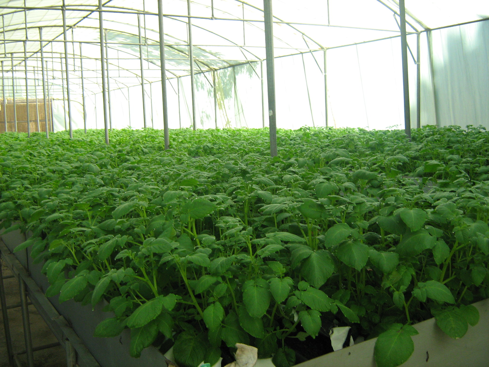
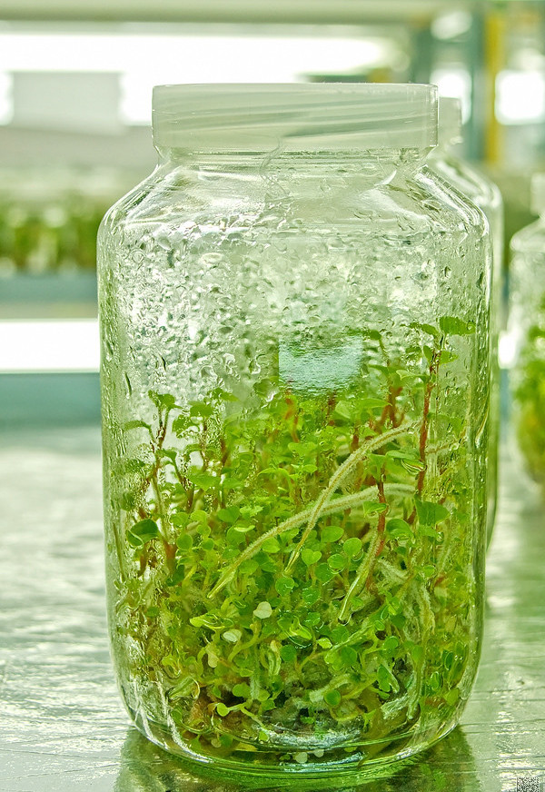
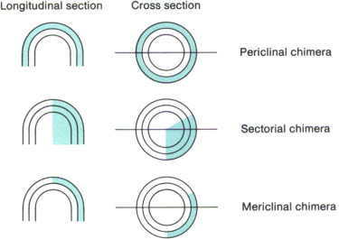
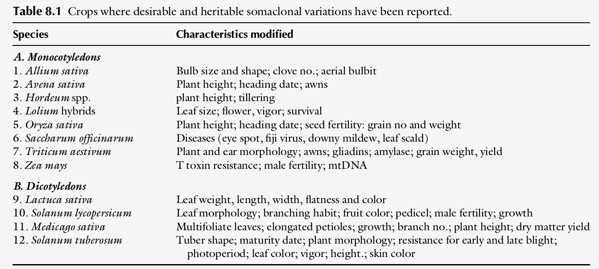

class: inverse, middle, center
background-image: \url('./images/micropropagation.png')
background-size: 60%, auto

```{r setup, include=FALSE}
options(htmltools.dir.version = FALSE)
options(knitr.kable.NA = "", digits = 3)
knitr::opts_chunk$set(tidy = FALSE, echo = FALSE)
require(tidyverse)

# pagedown::chrome_print("./14-breeding_methods_in_cross_pollinated_crops_html.html")
```

# Introduction

<style type="text/css">
.small-font {
    font-size: 40%;
}
.medium-font {
    font-size: 75%;
}
</style>

---

- Clones are identical copies of a genotype. Together, they are phenotypically homogeneous. However, individually, they are highly heterozygous. Asexually or clonally propagated plants produce genetically identical progeny.
- Types of clonally propagated species (for economic purposes):
  1. For a vegetative product
  2. For a fruit
  3. For floral products
- Types of clonally propagated species (for breeding purposes):
  1. Those with normal flowering and normal seed set
  2. Those with normal flowers but having poor seed set
  3. Those producing seeds apomictically
  4. Non-flowering species

---
class: center, middle

.pull-left[
```{r potato-mass-tissue-culture, out.width="99%", fig.align='center'}

```
]

.pull-right[
```{r micropropagation-jar, out.width="80%", fig.align='center'}

```

]

---

.pull-left[

## Types of clonal propagation

1. Natural clonal propagation
  - Sukering: Prunus, populus
  - Self-coppicing: Betula, Carpinus, Corylus, Quecus, Salix and Tilia
2. Artificial clonal propagation
  - Tuber, corms, bulbs, stolons
  - No/inferior flower: Leek, some potato cultivars
  - In-vitro propagation
  - Grafting, budding, cutting, layering
]
  
.pull-right[

## Importance of clonal propagation

- Quick production of quality breeding and planting stock
- Early flower induction
- Germplasm maintenance
- Maintenance of genetic uniformity
- Production of disease free plants
- Propagating problematic species
- Multiplication of sexually derived sterile hybrids
- Maintenance of genetic gain
]

---

## Breeding implications of clonal propagation

- Clonal species with viable seed and high pollen fertility can be improved by crosses.
- Unlike crossing in sexually reproducing species, which often requires additional steps to fix the genetic variability in a genotype for release as a cultivar (except for hybrid cultivars), clonal cultivars can be released immediately following a cross, provided a desirable genotype combination has been achieved.
- When improving species whose economic parts are vegetative products, it is not important for the product of crossing to be fertile.
- Because of the capacity to multiply from vegetative material (either through methods such as cuttings or micropropagation), the breeder only needs to obtain a single desirable plant to be used as stock.
- Heterosis, (hybrid vigor) if it occurs, is fixed in the hybrid product. That is, unlike hybrid cultivars in seed-producing species, there is no need to reconstitute the hybrid. Once bred, heterozygosity is maintained indefinitely. 

---

- It is more difficult to obtain large quantities of planting material from clones in a short time.
- Plant species that are vegetatively parthenocarpic (e.g., banana) cannot be improved by the method of crossing parents.
- Species such as mango and citrus produce polyembryonic seeds. This reproductive irregularity complicates breeding because clones of the parent are mixed with hybrid progeny. 
- Many clonal species are perennial outcrossers and intolerant of inbreeding. These are highly heterozygous.
- Unlike sexual crop breeding in which the genotype of the cultivar is determined at the end of the breeding process (because it changes with inbreeding), the genotype of a clone is fixed and determined at the outset.
- Both general combining ability (GCA) and specific combining ability (SCA), that is performance in crosses, can be fully exploited with appropriate breeding approaches.

---

.pull-left[

## Genetic issues in clonal breeding

- Genetic make-up
- Heterozygosity and heterosis
- Ploidy
- Chimerism:
  .medium-font[- Sectorial. This chimera is observed in a growing shoot as two different tissues located side-by-side. The effect of this modification is that the stem develops with two distinct tissues on each half. 
  - Periclinal. This type of chimera consists of two thin layers of different genetic makeup, one over the other
  - Mericlinal. When an outer layer of different genetic tissue does no completely extend over the layer below, the chimera is mericlinal.
  - Graft chimeras. Unlike the first three chimeras that have genetic origin, a graft chimera is a nonheritable mixture of tissues that may occur after grafting is made.]
]

.pull-right[
```{r chimerism-types, fig.width=4, out.width="75%", fig.align='center'}

```

]

<!-- Chimeras can arise spontaneously or can be induced by mitotic poisons or by grafting. Many cultivated plants once thought to be polyploid are now known to be chimeras. Those used in developmental anatomy are either spontaneously variegated or spontaneous or induced partial polyploids. Green plastids can mutate under direct or indirect nuclear control and produce colourless or pale plastids. Plastids divide and grow and are passed to each cell generation with the cytoplasm. They are not necessarily divided equally between sister cells so that a cell with both green and colourless plastids can give rise to tissues whose cells contain only green or only colourless plastids. Variegated chimeras arise in this way. Some tissues do not develop chlorophyll even if the cells inherit potentially green plastids and variegation may result from causes other than inheritance of different kinds of plastids. In nature variegated chimerical seedlings do not usually survive, but in cultivation they and chimeral branches are often preserved and propagated. -->

---
class: inverse, middle, center

# Breeding approaches used in clonal species

---

- Planned introduction
- Clonal selection
  - Purifying an infected cultivar
    - Screening for disease free material
    - Elimination of pathogen: Tissue culture, heat treatment, chemical treatment, use of apomictic seed
  - Cultivar development; possible if variability exists in the natural clonal population
    1. Assemble clonal population. Plant and expose to disease of interest. Select resistant clones with other superior traits and harvest individually.
    2. Grow progenies of selected clones and evaluate as in year 1. Select superior clones.
    3. Conduct preliminary yield trials. Select superior clones.
    4. Conduct advanced yield trials at multilocation for cultivar release.
- Crossing with clonal selection (if seeds could be produced)
  - Generally preceded by testing for combining ability to determine best combiners for use in cross.
- Mutation breeding
    
---

## Breeding in apomicts

Apomixis is the phenomenon of seed development without fertilization. Genetic control of apomixis has been demonstrated, implicating a few genes. Efforts using modern molecular genetic tools continue to be made to isolate those apomictic genes. Apomixis can be a two-edge sword - it can hinder breeding progress or it can be an effective breeding tool. To improve an apomict, there should be suitable materials, that is, sexual or partially sexual plants for use as female plants for crossing. Generally, an obligate apomict cannot be used as a female parent in a hybridization program. However, most apomictic plants produce adequate amounts of viable pollen to be usable as males in crossing. This leaves the identification of a suitable female the first critical step in an apomictic improvement program.

---

Once suitable parents have been selected, crossing can be conducted as for regular plants. A sexual female plant may be crossed with an apomictic male to produce F1 hybrids, some of which will be obligate and true breeding apomicts, while others will be asexual hybrids that will segregate in the F2 (Figure \ref{breeding-apomicts}). Because apomicts are generally heterozygous, selfing of sexual clones will yield variability in which the breeder can practice selection. The use of markers and precautions in emasculation will help in distinguishing hybrids from other heterozygous plants. It should be pointed out that the breeder should aim for identifying superior genotypes in the F1 where heterosis is maximum, rather than in later sexual generations. As previously indicated, facultative apomicts are more challenging to improve, partly because the breeder cannot control variation in their progenies (produce both sexual and apomictic plants). Furthermore, the stability of the reproductive process is influenced by environmental factors (especially photoperiod). Photoperiod has been observed to significantly affect the relative frequency of sexual versus apomictic embryo sacs in ovules of certain species.
---

class: middle

```{r breeding-apomicts, fig.align='center', out.width="65%"}
knitr::include_graphics("./images/breeding_apomicts.png")
```

---

## Somaclonal variation

- Clones should be exact replicas of the genotype from which its source tissue had been, however, clonal propagation, occurring under a tissue culture environment, produces materials that are not exact replicas of the original material used to initiate the culture. 
- Such variation, which results not from meiosis but from the culture of somatic tissue, is referred to as somaclonal variation, with the variants referred to as somaclones. 
- The variation transient (epigenetic) or heritable (genetic in origin).
- Somaclonal variants can be recovered in tissue culture with selection pressure (e.g., deliberate inclusion of a toxic agent in the culture medium) or without selection pressure (the basic cultural medium).
- Chromosomal changes, both polyploidy and aneuploidy, have been observed in potato, wheat, and ryegrass.
- Some research suggests mitotic crossovers to be involved whereas cytoplasmic factors (mitochondrial genes) have been implicated by others. Further, point mutation, transposable elements, DNA methylation and gene amplification are other postulated mechanisms for causing somaclonal variation.

---

```{r somaclonal-variations, fig.width=4, out.width="90%", fig.align='center'}

```

