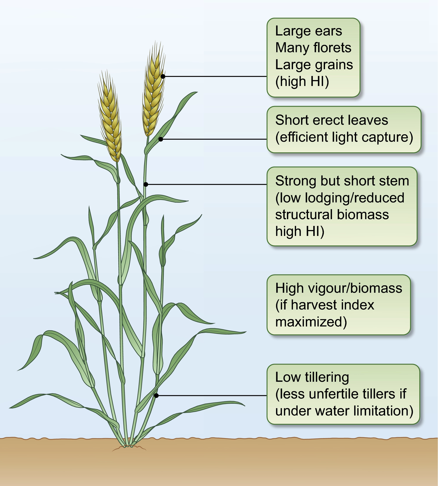
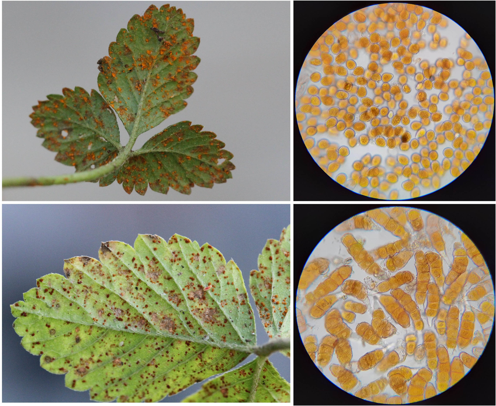
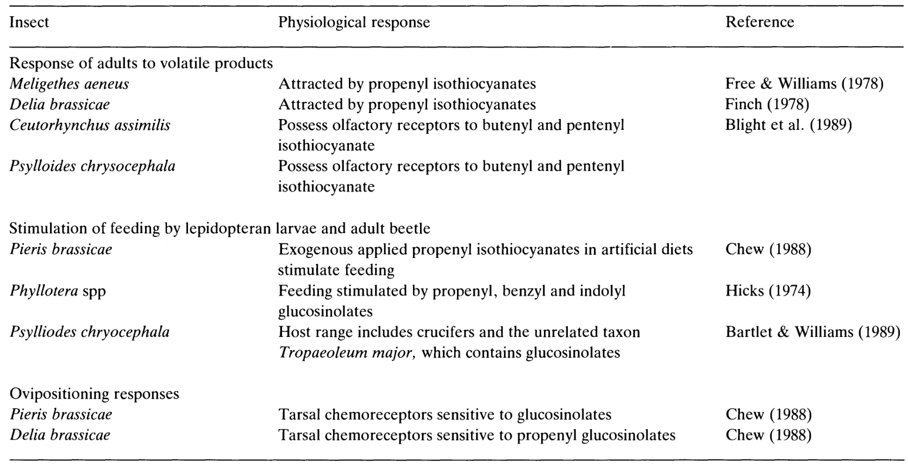
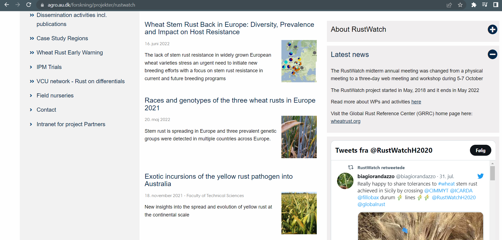

```{r,setup, include=FALSE}
library(knitr)
require(tidyverse)
set.seed(453)
# invalidate cache when the package version changes
knitr::opts_chunk$set(tidy = FALSE, echo = FALSE, 
                  message = FALSE, warning = FALSE,
                  out.width = "45%", cache = TRUE)
options(knitr.table.format = "latex")
options(knitr.kable.NA = "", digits = 2)
options(kableExtra.latex.load_packages = FALSE)
```

# Ideotype breeding

##

- Mutant genetic variability has been used as a basis for the development of new conceptual models for crop plants [@konzak1984induced]; Induced mutations in seed-propagated crops, Plant Breeding Reviews, Volume 2.
<!-- Adams (1973) formulated a concept of plant architecture for field beans and then sought induced mutants to complement the available genetic variation for constructing model prototypes (Adams 1982). -->
<!-- The success of this series of cultivars and especially the wide adaptability of ‘Seafarer’ led Adams (1973) to use the approach of factor analysis for developing a completely new ideotype concept of field bean plant architecture. This new ideotype involves the combination of traits considered necessary for maximizing the physiological efficiency and harvestability of field beans grown in monoculture in Michigan. -->
- Donald (1968, 1981) proposed uniculm genotype for wheat, emphasizing that a crop ideotype must be a weak competitor; Plant breeding Reviews, Volume 15.
  - Uniculm genotype has not been successful, it is generally accepted that use of the known principles of physiology to design an ideotype is a useful approach for plant breeding (Rasmusson 1987; Hamblin 1993; Hunt 1993).
- Actually, all breeders have an ideotype in mind. The most simple (and holistic) ideotype would be high yield with acceptable quality in the target environment.
  - An ideotype will maximally utilize an optimum production environment.
<!-- Thus the question is not whether an ideotype is necessary, but what kind of ideotype is required, and how specific it should be. -->
- The ideotype should not be restricted to morphological and phenological traits.

<!-- Note: The original literature by Donald (1968) is available in literatures directory. -->

## Maize ideotype

\bcolumns
\column{0.35\textwidth}

- Environment description
  - Adequate moisture
  - Favorable temperatures throughout the growing season
  - Adequate fertility
  - High plant densities
  - Narrow row spacings
  - Early planting dates

\column{0.65\textwidth}
\footnotesize

- Crop description
  - Stiff, vertically-oriented leaves above the ear (leaves below the ear should be horizontally oriented)
  - Maximum photosynthetic efficiency
  - Efficient conversion of photsynthate to grain
  - Short interval between pollen shed and silk emergence
  - Ear-shoot prolificacy
  - Small tassel size
  - Photoperiod insensitivity
  - Cold-tolerance in germinating seeds and young seedlings (for genotypes grown in areas where early-planting would require planting in cold, wet soils)
  - As long a grain-filling period as practically possible
  - Slow leaf senescence

\ecolumns

## Wheat ideotype

```{r wheat-ideotype, out.width="45%", fig.align='center', fig.cap="Wheat ideotype."}

```

# Breeding for disease and insect resistance

## Terminologies

\bcolumns
\column{0.65\textwidth}
\begin{description}
\footnotesize
\item[Disease] Physiological disturbance of a plant/part of a plant caused by a stress factor or a combination of stress factors resulting in symptoms.
\item[Host] An individual/species/group susceptible to a natural enemy and serves both as source of nutrition and as living substrate.
\item[Parasite] Organism that more or less permanently and sometimes of part of its life cycle lives in close connection with a living organism (host) and withdraws its nutrients completely or partially at the expense of that organism; i.e., an insect, mite, nematode, parasitic angiosperm\footnote[frame]{\scriptsize Recent classification of weeds based on ecology establishes them as competitors -- not parasites!} (broomrape, witchweed, dodder), or any categories of plant pathogen (fungi, bacteria, virus).
\item[Pathogen] Having the capacity to infect plants; exploits the plants as a source of nutrition.
\end{description}
\column{0.35\textwidth}

```{r strawberry-rust, fig.cap="Rust on mock strawberry (\\textit{Potentilla indica}) caused by \\textit{Phragmidium mexicanum} with urediniospores and teliospores.", out.width="96%"}

```

\ecolumns

##

\begin{description}
\small
\item[Infection] The use of a plant as nutrient source by a pathogen, usually resulting in reproduction of that enemy.
\item[Infestation] The use of a plant as nutrient source by natural enemy and lives on that plant.
\item[Sign] Visible parts of pathogen by which it can be recognized.
\item[Symptom] Deviation from normal growth and development of a plant by stress factor(s).
\item[Stress factor] Identifiable factor that potentially results in damage.
\item[Damage] Reduction in physical or economic yield of a crop due to stress factors.
\end{description}

## Classification of pathogens

\begin{description}
\small
\item[Biotrophs] Withdrawing nutrients from living host tissue (viruses, PM, rust fungi, loose smut).
\item[Necrotrophs] Withdrawing nutrients from tissue killed by natural enemy (\textit{Septoria} spp., \textit{Helminthosporium} spp.)
\item[Hemi-biotrophs] Withdrawing nutrients from living host tissue that soon after this will die (\textit{Phyophthora infestans}, Downy mildew fungus).
\item[Weakness pathogen] That only can infect weakened plant parts with reduced fitness.
\item[Vascular wilts] Pathogen that causes wilting of the host plant by blocking of the xylem and lives in and spreads through the vascular tissue (\textit{Fusarium} spp., \textit{Verticillium} spp.).
\end{description}

# Biotic Stresses in Agriculture

##

- Selection for yield _per se_ is generally prohibitive.
- Breeding success in the last century was due to selection for individuals with resistance or tolerance to stress.
- Major cause of yield reduction on farmer's fields in most crops
  - FAO estimates that about 25% of the crop losses are due to diseases and pests.
  - Upto 100% yield losses have been reported
  - 80% of potato fields were lost due to \textit{Phytophthora infestans} during 1845 in Ireland and England
  - 37-67% of yield reduction in Soybean due to Asian Rust has been suggested in Brazil during 2006-2011 (US $4 billion loss)
- Economic and environmental burden of fungicide/pesticide application could be offset by development and use of resistant cultivar.

<!-- (For a brief description of Irish famine, Coffee rust, Downy mildew of grapes and Bengal famine refer to comprehensive crap guide (pp. 350)) -->


# Breeding for Insect Resistance

## Chemical signaling pathways

\footnotesize

Example of involvement of glucosinolates in interactions with insect pests (also deterrs slugs). 

```{r glucosinolate-pathways-interaction, fig.align='center', out.width="66%", results='asis'}

cat("\\vspace{-0.4cm}")
```

- Besides interacting with insects,
  - isothiocyanates (a constituent in brassica) are toxic to _Peronospora parasitica_, _Mycosphaerella brassicae_ and _Alternaria_ spp.

# Breeding for Disease Resistance

##

\small
- To address ever evolving relationship between host-pathogen interaction, resistance breeding programmes systematically test wild relatives, landraces and other germplasm to identify new genetic sources of resistance to important pests and pathogens.
- Simple resistance (based on single gene) can be effective in short term, but successful long term resistance requires dealing with genetic complexity.
- Effective disease resistance depends on phenomena thay play out at level of genes, genotypes and populations.
- Gene and genomic loci conferring resistance can be assessed in terms of the strength of their effect, their race specificity and their potential contribution towards durability.
- At genotype level, performance of resistance is influenced by the number of resistance genes and their specific combination in host
  - indirect effects on valued traits also need to be taken into account
- At population level, effects on the durability of resistance and the spread of disease need to be considered

(\footnotesize Based on a Review article by @nelson2018navigating)

##

\small
- Plant breeders prefer broad-spectrum (race-nonspecific) resistance conferred by QRLs.
- Genes conferring multiple disease resistance (MDR) are much valued -- they tend also to be durable.
  \bitemize
  \footnotesize
  \item Causal genes for MDR are not clearly identified
  \item But, either genetic linkage or pleiotropy have roles in MDR
  \item Single pleiotropic gene or tightly linked genes can be moved between cultivars through traditional breeding
  \item example: \textit{LR34} (encodes an ATP-binding cassette transporter rather than an NLR and provides incomplete resistance; \alert{it can actually be considered to be a strong QRL}) in wheat condition such resistance
  \eitemize
- Combining multiple R-genes and/or QRLs into a single genome usually improves its resistance phenotype -- an approach called gene pyramiding.

<!-- ```{r diff-qrl-pyramid} -->
<!-- tribble( -->
<!--   ~"QRL", ~"Gene pyramid", -->
<!--   "QRL are generally additive in effect, although non-additive effects are also sometimes observed", "Pyramiding of R-genes can improve the spectrum of resistance; genes with complementary resistance spectra can be selected such that gene pyramids provide resistance to a broad set of pathogen races") %>%  -->
<!--   knitr::kable(booktabs = TRUE, caption = "Difference between gene pyramid and QRL") %>%  -->
<!--   kableExtra::kable_styling(position = "center", font_size = 6) %>%  -->
<!--   kableExtra::column_spec(column = 1:2, width = c("24em", "30em")) -->
<!-- ``` -->

## Epidemiology and forcasting

```{r rust-epidemiology-network, fig.cap="A early-warning system to improve preparedness and resilience to emerging rust diseases on wheat, based on Europe by monitoring rust populations -- identification, and investigation of virulence, agressiveness and adaptation to warmer temperatures.", out.width="95%"}

```

# Bibliography

## A listing of major works on breeding for disease and insects

- Refer to following texts references:
  - Chapter 18 on Host Plant Resistance Breeding, @priyadarshan2019plant
  - Chapter 17 on Genetically Modified Crops (@bradshaw2016genetically) and Chapter 18 on Climate Change and Resistance to Pests and Diseases (bradshaw2016climate).
  - Breeding for disease resistance in potato, Plant Breeding Reviews, Volume 19.
  - Breeding for resistance to maize foliar pathogens, Plant Breeding Reviews, Chapter 3, Volume 27.
