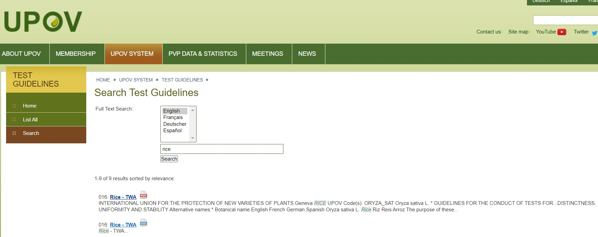
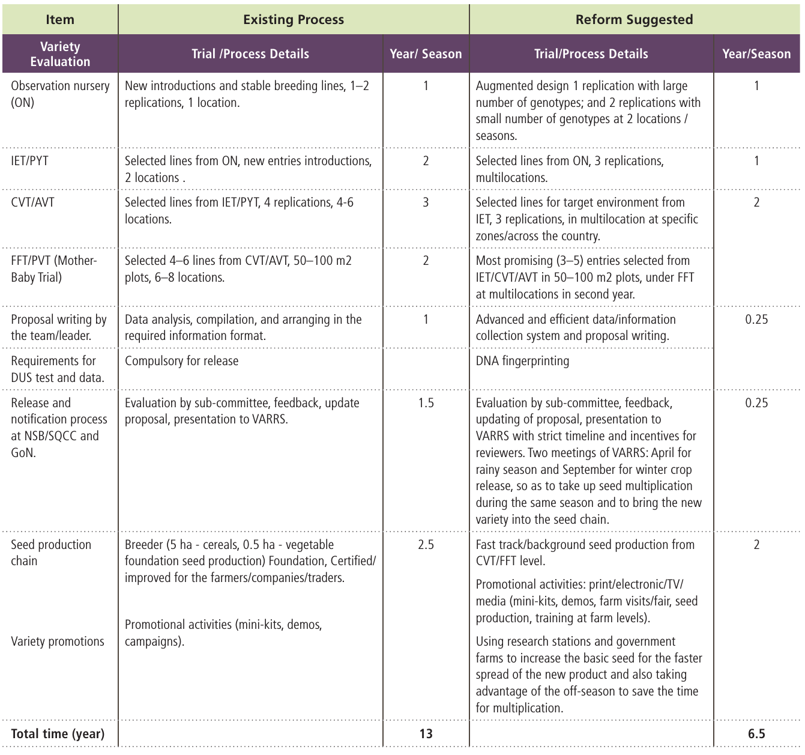
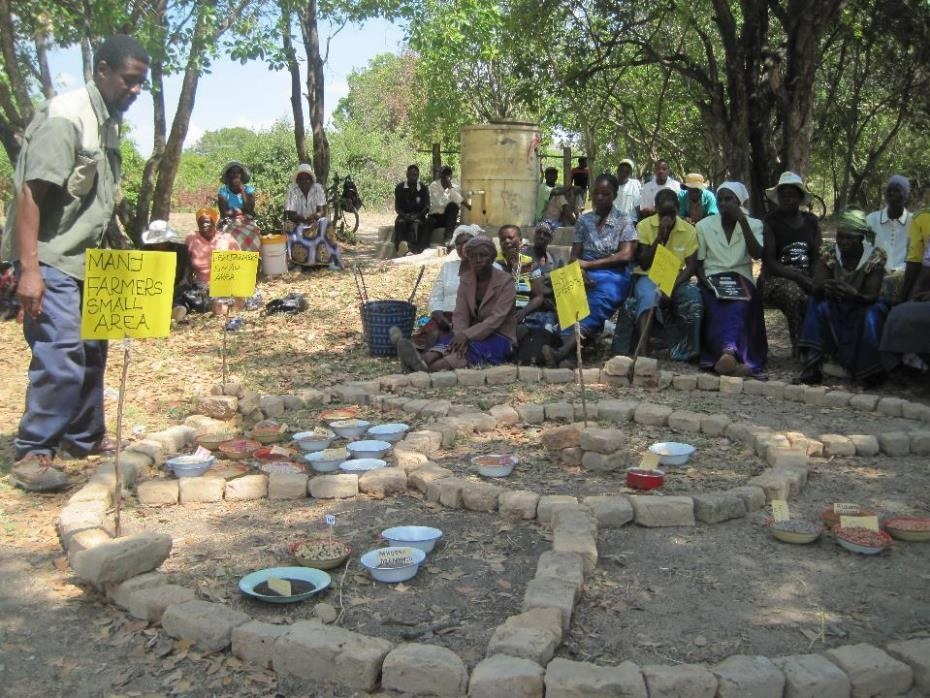
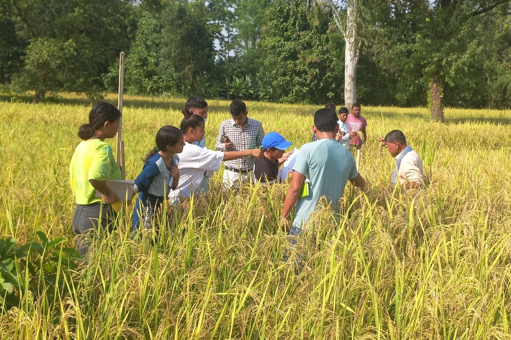
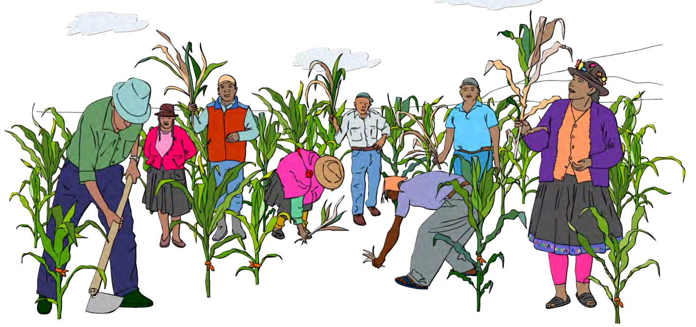
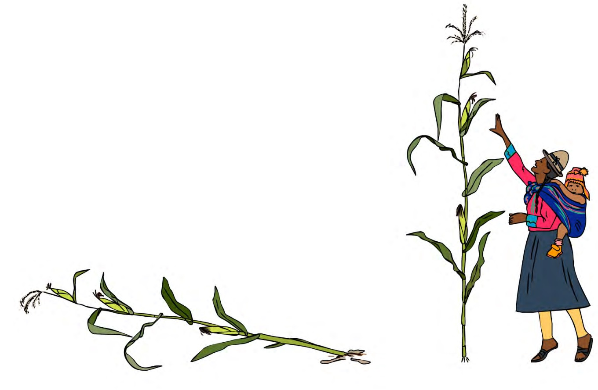
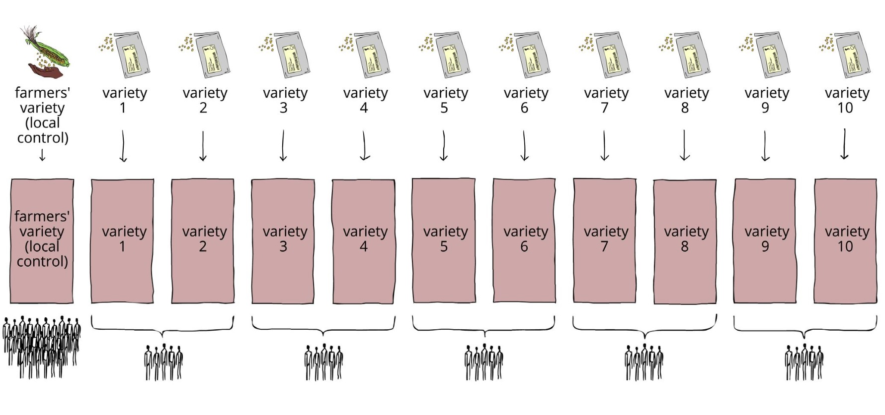

```{r,setup, include=FALSE}
library(knitr)
require(tidyverse)
set.seed(453)
# invalidate cache when the package version changes
knitr::opts_chunk$set(tidy = FALSE, echo = FALSE, 
                  message = FALSE, warning = FALSE,
                  out.width = "45%", cache = TRUE)
options(knitr.table.format = "latex")
options(knitr.kable.NA = "", digits = 2)
options(kableExtra.latex.load_packages = FALSE)
```

# Introduction

## Definition of variety (Seed act, 2045)

- 'Variety' means a plant grouping within a single botanical taxon of the lowest known rank, which can be defined by the expression of the characteristics resulting from a given genotype of that plant grouping, distinguished from any other plant grouping by expression of at least one of the said characteristics and considered as a unit with regard to its suitability for being propagated, which remains unchanged after such propagation.

## Formal characters defining variety: DUS test

\bcolumns
\column{0.55\textwidth}

- Laboratory of field based tests determine whether or not the rights are granted.
- To be granted PBR, new variety must be\footnote[frame]{Note: Document on DUS guidelines for rice is available in "literatures" directory.}:
  - novel -- new to the market, i.e., not available commercially usually before the date of application for DUS tests;
  - distinct -- have a unique identity;
  - uniform -- must be sufficiently uniform within the limits achievable of the species breeding system, e.g., self-pollinating or partially out-pollinating or obligate out-pollinating etc., from which the new variety was derived; and
  - stable -- capable of reproducing its uniqueness and uniformity over successive generations.

\column{0.45\textwidth}

```{r upov-test-guidelines, fig.cap="UPOV guidelines for DUS testing.", out.width="98%"}

```

\ecolumns

##

- Usually for 2 successive growing seasons.
- The UPOV guidelines specify which characters should be recorded, at what growth stage records should be taken, the states of expression of individual characters, and example varieties that illustrate specific states of expression.
- For SP cereals, once practical homozygosity is reached, variety enters into DUS tests and performance trials\footnote[frame]{Refer to offline file available in "literatures" directory for "TRIAL DESIGN AND TECHNIQUES USED IN THE EXAMINATION OF DISTINCTNESS, UNIFORMITY AND STABILITY".}.
  - What percent of applications should then meet uniformity criteria ?
  - Distinctness is measured by recording morphological characters on 1-9 scale. One being the weakest state of expression. For example anthocyanin color of the leaf margins in corn. Distinctness may show discrete expression too. Presence of hairs on rachilla of barley.
- A consistent difference of at least 1 scale point in morphological characters from the most similar variety is usually enough to confer distinctness.

## Varietal descriptors for cereals and grains

- Seasonal type; Spring, winter, summer
- Early growth characters; Prostrate, erect, hairs on lower leaf sheath, coleoptile anthocyanin.
- Leaf characteristics; Color, size, leaf attitude, auricles
- Ear emergence
- Plant height
- Glaucosity
- Anthocyanin pigmentation
- Morphology of ear
- Morphology of grain
- Others: shape of the lodicules, color of aleurone layer, color of grain, shape of germ area and embryo, physiological reaction to phenol immersion, etc.

# National and international organizations on plant improvement

## National (governmental) bodies

\bcolumns
\column{0.5\textwidth}

\footnotesize
\textbf{National Agricultural Research Council}

1. National Rice Research Program (NRRP): Hardinath, Dhanusa
2. National Wheat Research Program (NWRP): Bh airahawa, Rupendehi
3. National Maize Research Program (NMRP) Rampur, Chitwan
3. National Grain Legumes Research Program ( NGLRP) Rampur, Chitwan
4. National Oilseeds Research Program (NORP): Nawalpur, sarlahi
5. National Sugarcane Research Program (NSRP): Jitpur, Bara
6. National Jute Research Program (NJRP): Itahari, Sunsari
7. Cotton Development Program : Khajura, Nepaljung
8. Coordinated Maize Program (CMO): Khumaltar, Lalitpur.
9. Institute of Agriculture and Animal Science (IAAS): Rampur, Chitwan

<!-- **Objectives** -->

<!-- - To conduct high level studies and researches on various aspects of agriculture -->
<!-- - To identify the existing problems in agriculture and find out measures to solve -->
<!-- - To assist His Majesty's Government in the formulation of agricultural policies and strategies -->

<!-- **Functions and Responsibilities** -->

<!-- - Conduct high level research work on various fields of agriculture required in the line with the national agricultural policies, -->
<!-- - Prioritize studies and researches to be conducted, -->
<!-- - Provide research and consultancy services to its clients, -->
<!-- - Coordinate, monitor and evaluate the agriculture research activities in Nepal,  -->
<!-- - Document research activities -->

<!-- **Mandates** -->

<!-- - To conduct and/or let to conduct agricultural research, -->
<!-- - To determine priorities in studies and research related to agriculture, -->
<!-- - To provide consultant services and research support services to agricultural research, -->
<!-- - To coordinate, supervise, monitor, review and evaluate research activities related to agriculture in the country, -->
<!-- - To maintain/document up-to-date records of agricultural research, and -->
<!-- - To conduct and /or let to conduct other necessary activities related to agricultural research. -->

\column{0.5\textwidth}
\footnotesize

\textbf{Department of Agriculture Development}

1. Division of Horticulture, Kirtipur, Kathmandu
2. Division of vegetable, Khumaltar, Lalitpur
3. Horticulture Farm, Daman/Marpha/Solukhumbu/Sarlahi/Sindhuli/Dolkha/ Panchkhal/Godawari/Kirtipur/Trisuli/Mustang/Palpa/Jumla/Dailekh/Baitadi/Humla/Chitwan

\textbf{Department of Plant Resources}

1. National Herbarium and Plant laboratory, Godawari, Lalitpur - leading role in conservation of medicinal plants
2. Herbal conservatory, Hetauda/ Daman/ Tistung, Makwanpur

\ecolumns

## International organizations

1. IRRI ( International Rice Research Institute): Los Banos, Philippines
2. CIMMYT ( International Centre for Maize and Wheat Improvement): el Baton, Mexico
3. CIAT ( International Centre for Tropical Agriculture): Palmira, Colombia
4. IITA ( International Institute of Tropical Agriculture): Ibadan, Nigeria
5. WARDA ( West African Rice Development Association): Monrovia, Liberia
6. CIP ( International Centre for Potato): Lima, Peru
7. ICRISAT ( International Crops Research Institute for the Semi-Arid Tropics) : Hyderabad, India
8. IBPGR (International Board for Plant Genetic Resources) : Rome, Italy.
9. ICARDA (International Centre for Agricultural Research in Dry Areas): Aleppo, Syria
10. ICGEB (International Centre for Genetic Engineering and Biotechnology): Italy and India
11. AVRDC (Asian Vegetable Research and Development Centre): Taiwan

# Variety notification

##

\small

- Cultivars (varieties and landraces) to be included in the national list (i.e. released and registered genotypes) need to pass through some rules and regulations (SQCC 2014). Cultivars published in the Nepal Gazette are the National list of cultivars and referred as notified.
- Nepal seed board is delegated the authority to formulate and implement policies relating to the seeds and to give necessary advice to Government of Nepal on the matters pertaining to the seeds. Amongst other duties, the board is also assigned to approve, release and register the seeds of new variety as prescribed\footnote[frame]{Seed Act, 2045}.
- The board is comprised of 11 person members including Secretary of Ministry of Agriculture acting as chairperson.
- It tests the specialty, uniformity and permanency of the seeds of new variety and grant the right of ownership to the breeder as prescribed.
- GoN regulates and controls the quality standards for any type or variety of the seeds to, in consultation with the board, prescribe such type or variety as the notified, by publishing a notification in the Nepal Gazette. The prescription may be differently made for different regions.

## Variety registration

- Submission of application by the authorized institution/individual/company for release or registration in the prescribed format to NSB/SQCC;
- Review and evaluation of the proposal by the Technical Subcommittee;
- Provision of feedback on the proposal, and, if needed, defense by the applicant and/or updating the proposal;
- Review and evaluation of the updated proposal by members of the Variety Approval, Release and Registration Sub-committee (VARRS) and comments for improvement/clarification by the applicant, if required;
- Presentation of the proposal at the VARRS meeting and responses to the queries or defense of the proposal, if needed;
- Approval or rejection of the proposal by NSB on the basis of the recommendations of VARRS; and
- If the variety/hybrid has been approved for registration, its notification in the gazette by the MoAD

## Information required to be reported for variety release and registration

\bcolumns
\column{0.5\textwidth}

- Status
- Importance
- Names (Common,botanical,proposed, symbolic)
- Pedigree (Parents)
- Country of origin
- Source of material (Name of institution, farmer/farming community), experiment and the year in which it was first introduced, etc.
- Trial (Years, supervision by)

\column{0.5\textwidth}

- Details of where, when and which seasons were following trials conducted:
  - Varietal trial
  - Disease damage scoring
  - Insect damage scoring
  - Fertilizer trial
  - Agronomic trial
  - CVT
  - FFT/FAT
  - Others

\ecolumns

<!-- ## -->

<!-- - Performance data on phenology and growth for each year of experiment -->
<!--   - Days to maturity, plant height, branches/plant (tiller/hill), effective tillers/sqm, lodging, (cobs/pods/siliqua)/plant, (panicles/spikes)/(hill/sqm), filled pods/plant or effective panicles/sqm, grain yield, 1000 seed weight, straw yield, HI. -->
<!-- - Combined analysis of major agronomic traits (Yield, days to maturity, plant height) -->
<!-- - Summary of agronomic traits (Comparison with varieties with Checks) -->
<!-- - Soil test report and fertilizer application details -->
<!-- - Disease and insect score data -->
<!-- - Farmer field trial (major agronomical traits and yield), participatory trial data, information on stakeholders' preference -->
<!-- - On station v/s on farm data comparison -->
<!-- - Cost-benefit analysis -->
<!-- - DUS of the variety \footnote[frame]{http://sqcc.gov.np/images/category/Model_for_Varietal_DUS1.xlsx} -->
<!-- - Stability analysis -->
<!-- - Recommendation domain (Agroecology, soil moisture, growing season, cropping pattern, special package of practice (if any)) -->

<!-- ## Contrasting existing system and suggested reforms for variety release -->

<!-- ```{r existing-and-reforms, out.width='50%', caption = "Source: DOI: 10.13140/RG.2.2.13549.59361"} -->
<!-- # pdftools::pdf_convert("~/Downloads/FTSeed_2016_text_press.pdf", format = "png", pages = 20, filenames = "current_and_future_need_variety_release.png", dpi = 200) -->
<!--  -->
<!-- ``` -->

## Participatory variety selection

- It is an approach to provide choices of varieties to the farmers for increasing production in their diversity of socioeconomic and agro-ecological condition. 
- It is also a selection process of testing released or promising genotypes in farmer's field. 
- Includes research and extension methods to deploy genetic materials beginning with on-farm experiment.
- Importance of PVS:
  \begin{enumerate}
  \small
  \item Provide an opportunity to the farmers a large number of varietal choices on their own resources.
  \item Enhance farmer's access to crop varieties and increase in diversity.
  \item Increase production and ensure food security.
  \item Help to disseminate the adoption of pre and released varieties in larger areas.
  \item Allow to varietal selection in targeted areas at cost-effectiveness and also in less time.
  \item Help seed production at community based seed.
  \end{enumerate}

## Stages in a PVS

\bcolumns
\column{0.4\textwidth}

1. Situation analysis and identification of farmers' needs
2. Search for suitable varieties
3. On-farm experimentation by farmers (Mother-Baby trials, Farmers' field trials)
4. Farmers' evaluation of variety/ Field day/ Farm walk

\column{0.6\textwidth}

```{r pvs-diagnosis, fig.cap="Diagnostic stage of PVS.", out.width="80%"}

```

\ecolumns

##

\bcolumns
\column{0.5\textwidth}

```{r pvs-final-stages-ffd, out.width="96%", fig.cap="Farmers' field day. Technicians are noting the farmer's preferences.", out.width="80%"}

```

\column{0.5\textwidth}

```{r pvs-cross-pollinated, out.width="92%", fig.cap="Negative selection (rouging) is practiced in cross-pollinated crops since the beginning until the pollination starts."}

```


\ecolumns

## PVS concerns

\bcolumns
\column{0.5\textwidth}

```{r pvs-issues-farmers, fig.cap="Variety use issues of farmers.", out.width="95%"}

```

\column{0.5\textwidth}

```{r pvs-plot-design, out.width="40%", fig.cap="PVS plot design and layout.", out.width="96%"}

```

\ecolumns

# Bibliography

## See also

<!-- Case study: Nepal (Plant Breeding and Farmer's Participation, pp 630) -->

<!-- In the late 1990s, the non-governmental organization (NGO) Local Initiative for Biodiversity Research and Development, better known as LI-BIRD, based in Pokhara, Nepal, undertook a study in the low hill region of Nepal to document and analyse farmers' knowledge of upland rice (Ghaiya) varieties. A team of one plant breeder and four agricultural technicians carried out the study, with the involvement of men and women farmers of five villages where local Ghaiya diversity was predominant (Joshi, Rana and Subedi, 2001). The study was done and directed by the LI-BIRD team using techniques such as resource and social maps (through transect walks), participants observation, interviews, group discussion, and the collection of farmers' preferred varieties. -->

<!-- At the same time, the team initiated a so-called participatory landrace selection process, similar to a participatory variety selection (PVS) process. In this case, selection concerned landraces from the region collected and selected by the research team instead of modern varieties that are often used for PVS. The landraces were selected by the team on the basis of the results of the documentation study, i.e. to match farmers' interests in particular varieties or traits in varieties, such as drought tolerance, grain quality and yield potential on poor soils. These were the breeding variables about which farmers were most concerned. The research team designed the outline of the subsequent experiment, in which a number of farmers took part in testing the newly introduced varieties. -->

<!-- The LI-BIRD team decided how to distribute seeds, how many, and to how many farmers. Farmers themselves decided where to test the varieties received, how to grow them, and with which varieties to compare them. The team later documented and analysed these farmer decisions. During various stages of the cropping cycle, the research team documented farmer assessments of the new varieties, individually and collectively, using questionnaires, farm-walks and group discussions. The collective assessment served as a means to interact with all the farmers about their experiments. -->

<!-- The research team concluded that this process of participatory landrace selection was an effective means of broadening the range of suitable Ghaiya landraces available to farmers, at little risk to them and at a relatively low cost to the researchers. Farmers were able to evaluate new options under their own farm conditions, observe results at other farms, and to come to useful conclusions in a relatively short time (two years of experimentation). LI-BIRD also concluded that now that this methodology has proven effective, it should be easier to use it in the future, given that costs per unit would be lower. In particular, given that there is very little institutional support for Ghaiya rice, this would have great merits for (poor) farming communities. LI-BIRD and partners in Nepal continue to build on this experience, expanding it to other sites as well as to other crops. -->


## References
