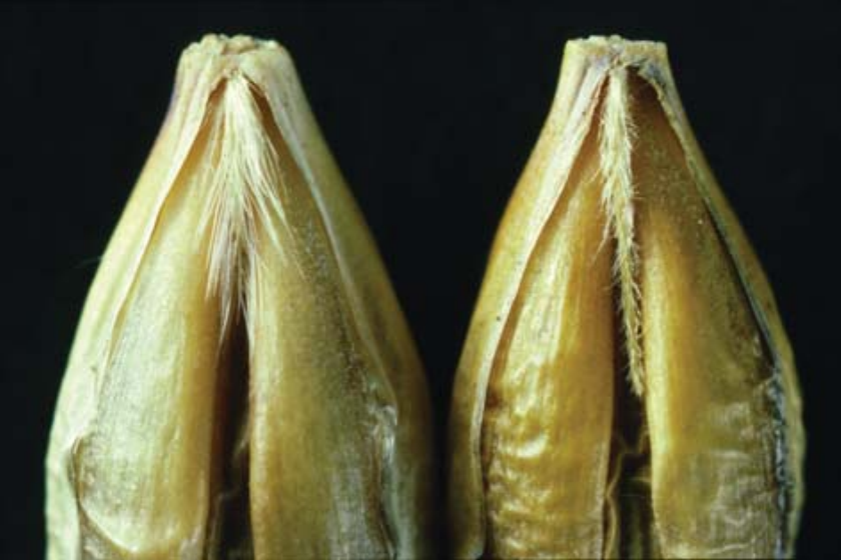
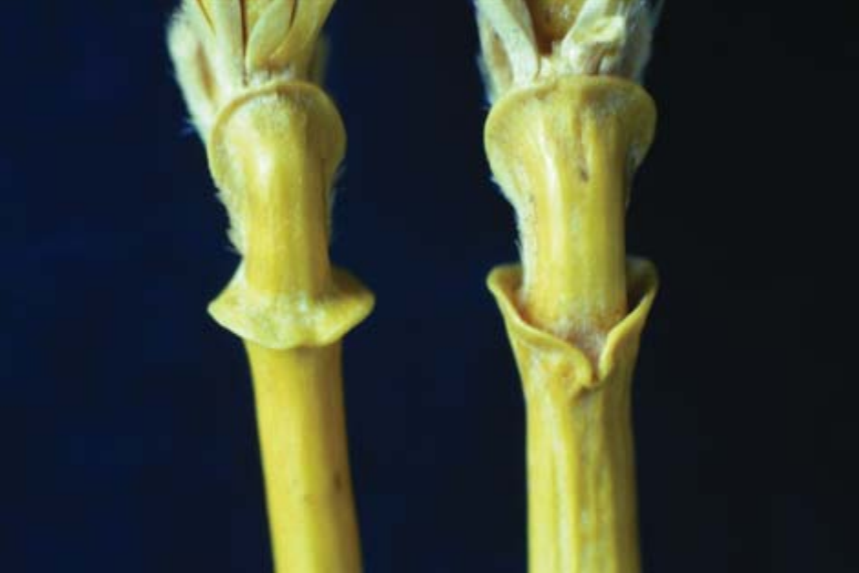
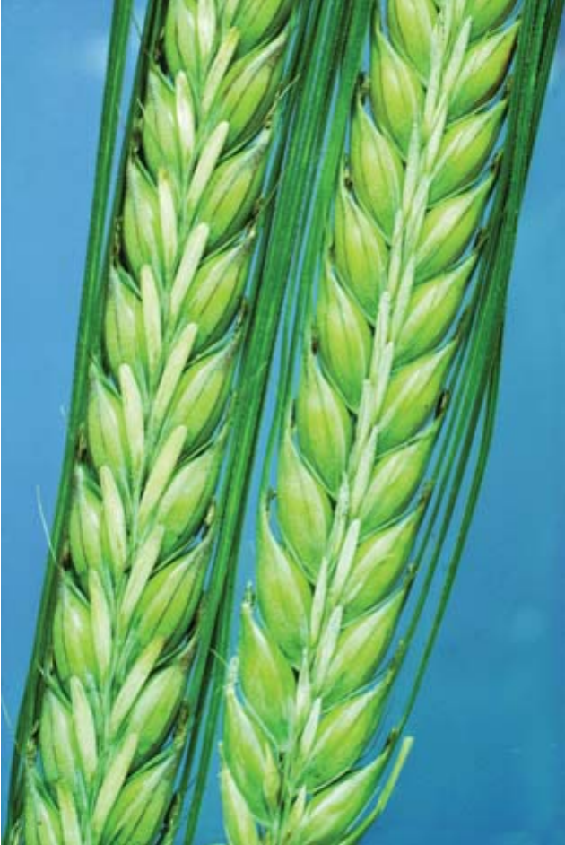
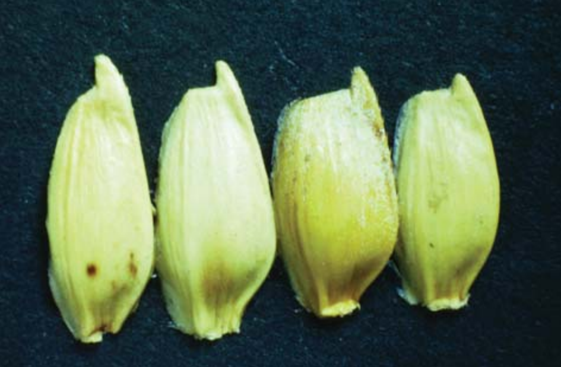

```{r,setup, include=FALSE}
library(knitr)
require(tidyverse)
set.seed(453)
# invalidate cache when the package version changes
knitr::opts_chunk$set(tidy = FALSE, echo = FALSE, 
                  message = FALSE, warning = FALSE,
                  out.width = "45%", cache = TRUE)
options(knitr.table.format = "latex")
options(knitr.kable.NA = "", digits = 2)
options(kableExtra.latex.load_packages = FALSE)
```

# Intellectual property rights

## Background

- Law and science meet here\footnote[frame]{What does it take to be a patent attorney or a legal counsel ? Refer to \cite{walker2014patent}.}.
- Foster sharing of economic incentives to making available traditional knowledge, to conserve it through use, and thereby enhance the livelihoods of farming and indigenous communities and reverse the decline of biodiversity, upon which, in return, long-term food security is based. [Rights to plant genetic resources and traditional knowledge, 2006]
- Since the adoption of convention on Biological Diversity (CBD) in 1992, the law of plant genetic resources (PGR) and the legal status of traditional knowledge (TK) has attracted increasing attention.
- Agreement on Trade related Aspects of Intellectual Property Rights (TRIPS Agreement) within the World Trade Organization (WTO) in 1995.
- International Treaty on Plant Genetic Resources for Food and Agriculture in (ITPGRFA) 2002.
- 2001 Doha Agenda of the WTO explicitly endorsed the issue of traditional knowledge as a subject for further work.
- World Intellectual Property Organization (WIPO)

## Traditional knowledge

- Interrelationship between level of biodiversity in a specific region with cultural distinctiveness of its inhabitants.
- Specific knowledge of communities living in close relationship to their environment: traditional knowledge. 
- This has been integrated in the Rio Process, and in the process to revise the International Undertaking on PGRFA, and it has recently been confirmed and enhanced by the outcome of the World Summit on Sustainable Development.
- The CBD speaks of 'traditional knowledge, innovations and practices of indigenous and local communities embodying traditional lifestyles relevant for the conservation and sustainable use of biological diversity' (Article 8(j)).

## Traditional knowledge

- TK has common features for both indigenous as well as farming communities:
  - Information is not an individual creation, but the achievement of a specific community.
  - It cumulates over many generations and evolve accordingly.
  - Managed by and exchanged through customs or customary laws.
  - Close interaction exists between TK and the surrounding ecosystem.
- According to the Four Directions Council, 'indigenous peoples possess their own locally-specific systems of jurisprudence with respect to the classification of different types of knowledge, proper procedures for acquiring and sharing knowledge, and the rights and responsibilities which attach to possessing knowledge'

## Farmer's right

<!-- If we now refer to a plant as a "medicinal plant", it is because of the identification of its medicinal properties by the farm women and men who domesticated it. -->

- Intellectual contribution of farmers to the diversity of crop varieties and animal breeds is emphasized in a great variety of documents: for instance, in the 'Farmers' Rights Charter', a document drafted by Indian Farmers' Unions. 
- It is stated that 'farmers are the original breeders and through their breeding science and technology have produced the rich diversity of crop varieties and animal breeds as a gift to the world'. 
- Guiding thoughts:
  - Farmers ought to have the right to 'participate fully in any benefits derived from the improved use of these genetic resources' and, of course, in the ITPGRFA (Preamble para. 7 and Article 9.1).
  - Farmers' innovations take place collectively and cumulatively, and that therefore farmers' rights, arising from their role as conservators and breeders, are community rights.

<!-- - In 1994, the M S Swaminathan Research Foundation (MSSRF) submitted to the Government of India a draft Act for plant variety protection, incorporating provisions for recognising the role of farm women and men in conservation, cultivation and breeding. -->
<!--   - farmers and breeders are allies in the struggle for sustainable food security, and that their rights must be mutually reinforcing and not antagonistic -- Act titled, "Protection of Plant Varieties and Farmers' Rights Act" was passed by both Houses of Parliament in 2001 -->
<!--   - "A person cultivating crops or conserving and preserving traditional crop varieties or wild species of crops and selecting them for their useful properties". -->

<!-- - Text entitled "Manual on Farmers' Rights" by "S. Bala Ravi" is available on the literatures directory. -->

## PBR and varietal description

- Based on the concept that new varieties can be accurately recognized and maintained as discrete and unique units.
- Most work of description occured during 1940s and 60s [Encyclopedia of grain science, page 459]. 
- During ensuing period, synonyms and homonyms, and varietal piracy were belaguering seed and variety use and regulation system.
- Application for PBR necessitates varietal description using plant or grain characteristics.
- Morphological description is important for:
  - The award of PBR and tests for distinctness, uniformity and stability (DUS);
  - The control of seed production by certification to ensure seed sold for agricultural production is true to the variety it is claimed to be; and
  - The control of variety purity at the point of final sale, e.g., from the farm to the food processor.
  
<!-- Homonym: A taxonomic designation rejected as invalid becasue the identical term has been used to designate another group of the same rank. -->
  
## Tests for DUS

- Laboratory or field based tests determine whether or not the rights are granted.
- To be granted PBR, new variety must be:
  - novel -- new to the market, i.e., not available commercially usually before the date of application for DUS tests;
  - distinct -- have a unique identity;
  - uniform -- must be sufficiently uniform within the limits achievable of the species breeding system, e.g., self-pollinating or partially out-pollinating or obligate out-pollinating etc., from which the new variety was derived; and
  - stable -- capable of reproducing its uniqueness and uniformity over successive generations.

<!-- - Usually for 2 successive growing seasons. -->
<!-- - The UPOV guidelines specify which characters should be recorded, at what growth stage records should be taken, the states of expression of individual characters, and example varieties that illustrate specific states of expression -->
<!-- - For SP cereals, once practical homozygosity is reached, variety enters into DUS tests and performance trials. -->
<!--   - What percent of applications should then meet uniformity criteria ? -->
<!--   - Distinctness is measured by recording morphological characters on 1-9 scale. One being the weakest state of expression. For example anthocyanin color of the leaf margins in corn. Distinctness may show discrete expression too. Presence of hairs on rachilla of barley. -->

## A typical breeding program with DUS testing


```{r uk-cereal-breeding}
tribble(~"Year", ~"Generation", ~"Activity", ~"Selection",
        1, "Initial cross", "Malting quality x disease resistance", "Choice of parents often based upon existing varieties that are commercially successful",
        2, "F1", NA, NA, 
        3, "F2", "2000 single plants", "Selection for disease resistance by deliberate infection",
        4, "F3 and F4", "100 lines from selected plants", "F4 grown in Australia/New Zealand to achieve two generations in one harvest year, micromating selection tests.",
        5, "F5", "8 lines from selected plants", "Replicated yield trials, malting tests, purification using morphology and protein electrophoresis.",
        6, "F6", "4 lines", "Further yield trials; Purification using morphology",
        7, "F7", "Plants from lines harvested and grown as plant or ear rows; harvested seed bulked", "Final breeders performance evaluation trials; purification by morphology/protein electrophoresis; seed bulked for official tests and trials",
        8, "F8", "First year of official tests and trials", "Purification based on morphology to prepare seed for commercial seed production",
        9, NA, "Second year of official tests and trials", "Preliminary certification for seed production; purification based on morphology",
        10, NA, "Award of PBR; listed for marketing", "Enters commercial seed production and official seed certification",
        11, NA, "Further commercial evaluations for marketing", "Limited seed available to farmers",
        12, NA, "Final commercial evaluations for marketing", "Seed widely available to meet demand from farmers for new improved variety") %>% 
  knitr::kable(booktabs = TRUE, caption = "A typical UK cereal breeding program.", align = "l") %>% 
  kableExtra::kable_styling(font_size = 6) %>% 
  kableExtra::column_spec(column = 1:4, width = c("2em", "5em", "20em", "34em"))
```

## Distinctness

- A consistent difference of at least 1 scale point in morphological characters from the most similar variety is usually enough to confer distinctness.

\bcolumns
\column{0.5\textwidth}

```{r barley-rachilla, fig.cap="Differences in barley rachilla hair type: left, long-haired; right, short-haired.", out.width="90%"}
# pdftools::pdf_convert("/home/deependra/Desktop/BSc_Ag_lectures/PLB422_introductory_biotechnology_biodiversity/presentation/13-intellectual_property_rights/Encyclopedia of Grain Science, Three-Volume Set (Vol 1-3)-Academic Press (2004).pdf", pages = 462, format = "png", filenames = "../../images/rachilla_barley.png", dpi = 300)


```

\column{0.5\textwidth}

```{r rachis-collar-barley, fig.cap="Differences in the 'collar' of the first rachis segment of barley ears: left, 'platform' collar; right, 'cup' collar.", out.width="90%"}
# pdftools::pdf_convert("/home/deependra/Desktop/BSc_Ag_lectures/PLB422_introductory_biotechnology_biodiversity/presentation/13-intellectual_property_rights/Encyclopedia of Grain Science, Three-Volume Set (Vol 1-3)-Academic Press (2004).pdf", pages = 464, format = "png", filenames = "../../images/rachis_barley_collar.png", dpi = 300)


```

\ecolumns

## Varietal descriptors for cereals and grains

- Seasonal type; Spring, winter, summer
- Early growth characters; Prostrate, erect, hairs on lower leaf sheath, coleoptile anthocyanin.
- Leaf characteristics; Color, size, leaf attitude, auricles
- Ear emergence
- Plant height
- Glaucosity
- Anthocyanin pigmentation
- Morphology of ear
- Morphology of grain
- Others: shape of the lodicules, color of aleurone layer, color of grain, shape of germ area and embryo, physiological reaction to phenol immersion, etc.

##

\bcolumns
\column{0.5\textwidth}

```{r spikelet-attitude, fig.cap="Differences in the attitude of the sterile spikelets of two-row barley: left, sterile spikelets divergent; right, sterile spikelets parallel.", out.width="70%"}


```

\column{0.5\textwidth}

```{r shape-lower-glumes, fig.cap="Contrasting shapes of the lower glume of wheat", out.width="95%"}


```

\ecolumns

# Institutions related to Intellectual Property Rights

## UPOV

\small
- International Union for the Protection of New Varieties of Plants (Union International pour la Protection des Obtentions Vegetales; UPOV) was established in 1961.
- It seeks to protect new varieties of plants both in the interest of agricultural development and of plant breeders. 
- UPOV sought from the outset to provide incentives to the private sector to engage in commercial plant breeding, by introducing so-called plant breeders' rights, aka. Plant Variety Rights.
- Agreed guidelines for the conduct of tests and standardization of variety descriptions based upon the morphology of the grain and plant.
- PBR is an IPR, often described as plant "patent"
- Breeders can claim royalties on seed sold.
- Once granted, PBR ecognizes the exclusive rights of individual plant breeders to produce or reproduce protected varieties, to condition them for the purpose of propagation, to offer them for sale, to commercialize them, including exporting and importing them, and to stock them with a view to production or commercialization (Article 14.1 UPOV).
- Like any patent right, PBR expires after 20 years.

## TRIPS and IPRs

- General Agreement on Tariffs and Trade (GATT) contains important provisions covering the protection of intellectual property in the agreement on Trade Related Aspects of Intellectual Property Rights (TRIPS). 
- For most member countries ratification of GATT means membership of UPOV and a PBR system based upon plant morphology. 
- Plant breeders will still use morphological characters to purify candidate varieties before submitting them for tests and trials, and seed traders will still use morphological characters to verify variety at the point of sale.
- However, the science of systematics is being revolutionized by molecular technologies.
- Concept of "Essentially derieved varieties"

# Intellectual property law

## Copyright

- Entails the protection of expressions of mental activity not only in the arts and sciences, but also in modern technology. 
- Scope is limited and it does not protect substance, ideas, procedures and methods (including mathematical concepts). 
- Does not require a high level of originality.
<!-- The same is true for neighbouring rights that address the rights of performing artists, film broadcasters and phonogram producers. -->
- Copyright and neighbouring rights protection is important for the protection of TK to the extent that it is expressed. Traditional music and performances are at the forefront. Moreover, it is important for electronic data collections on PGR and for programming specifically designed for this field. It covers books and publications on the subject. Otherwise, copyright is not suitable for addressing PGR and knowledge per se. It is rather by protecting the cultural background and its diversity that copyright indirectly makes a contribution to their valuation and reward.
<!-- - Copyright applies to original works of authorship as soon as they are fixed in any tangible medium of expression. The author of the work initially owns the copyright, although she may transfer her rights to others. If the work is created by an employee (a work made for hire), the author is deemed to be the employer. The copyright term lasts for the life of the author plus 70 years (or a fixed term of 95 years for works made for hire and some other categories of works). The copyright owner has the exclusive rights to make copies of the work, distribute copies to the public, adapt the work, display the work publicly, and perform the work publicly. -->

<!-- ## Case study -->

<!-- Pendragon, a leading mathematician, devised a mathematical formula that could be used to draw nonrepeating patterns. Pendragon published his formula in mathematics journals, along with several examples of patterns drawn using the formula. By plugging different numbers into the formula, one can draw any number of different nonrepeating patterns. Pendragon's invention (or perhaps discovery) of Pendragon tiling was a significant advance in mathematics. Mathematicians have long worked hard to find such nonrepeating patterns. Many people took up further study and use of Pendragon's ideas. Mathematics departments all over the world began to teach about Pendragon patterns, and mathematicians deepened their research in advancing the area. -->

<!-- Pendragon patterns next moved beyond the world of mathematics. An engineer at Keening Paper read about Pendragon patterns in an article in Science This Week. The engineer realized that nonrepeating patterns could have a very useful application in making paper products. When paper is sold on rolls, one hazard of putting patterns on the paper is that the paper may stick to the roll if matching patterns are placed one on top of each other. The use of nonrepeating patterns could reduce this production flaw. Some nonrepeating patterns would also reduce air spaces, reducing the size of the paper roll. Shortly thereafter, a design identical to a design in one of Pendragon's scholarly articles began to appear on rolls of paper towels made and sold by Keening. That particular design is just one of millions that could be made by using Pendragon's formula. Later on, other Keening products appeared with Pendragon patterns. These designs were not the same as those previously published by Pendragon. Rather, Keening apparently had used Pendragon's formula to draw additional designs, rather than simply copying designs from the work of Pendragon or others. -->

<!-- Almost two years after Keening started selling such products, Pendragon learned of this use of his work and consulted his lawyer. He asked her whether the law prevented the copying of the particular pattern that Keening had chosen and whether he had the right to prevent Keening from using his formula to draw other patterns and use them on their products. -->

<!-- Pendragon's scholarly articles and his diagrams of Pendragon tiling qualify for copyright protection. They qualify as original works of authorship because they originated with him and easily meet the minimal standard of creativity required. Pendragon did not register his copyright. But copyright does not depend on complying with formalities, such as registering the copyright, depositing copies with the Library of Congress, or using copyright notices on copies of the work. Such practices are permitted and offer practical advantages, but they are not necessary to create the copyright. Rather, an author owns the copyright in any original work of authorship as soon as she fixes it in some tangible form (writes down a poem, takes a photograph, records a song, makes a sculpture). -->

<!-- Keening Paper apparently did infringe the copyright in one of Pendragon's designs. It copied the design from his article and sold copies to the public, thereby infringing the rights to make copies and to distribute those copies to the public. Keening might contend that there was no proof that it actually copied the design. But there is sufficient evidence to support an inference of copying, as opposed to Keening having made the design independently: The design had been published, an identical design appeared on Keening's paper product after Keening took an interest in Pendragon patterns, and the odds that the designs would coincidentally be identical were very low. -->

<!-- But Pendragon cannot use the copyrights in his articles and designs to prevent Keening from using Pendragon's mathematical formula to make its own patterns. Even if Keening admits that it copied Pendragon's formula from his work and used it to draw the designs, Keening would not be liable for copyright infringement. Copyright only protects creative expression. It does not protect ideas, principles, theories, and the like. One can freely copy from copyrighted works, if one only copies unprotected material. So it is not copyright infringement to copy the facts from a history book or to copy the way a computer program works. -->

## Patent

- The provisions on patents for inventions of the TRIPS Agreement define, to a large extent, the legal conditions applicable to genetic resources and TK.
<!-- The provisions of the TRIPS Agreement considerably enhance the protection for breeding and genetic engineering, and have changed the legal relationship between genetic resources and TK on the one hand, and newly appropriated technological advances on the other. -->
- They are of considerable significance not only for the chemical and pharmaceutical industries, but also for all other sectors with active patent-oriented strategies.
<!-- In the field of biotechnology, the limitation of patentability to microorganisms reflects the minimal consensus in a worldwide controversial discussion, which will continue as the present state of the law neither satisfies the long-term needs of the industry nor of developing countries. -->
- The TRIPS Agreement establishes the principle of non-discrimination as to the fields of technology, the place of invention, and the country of production (Article 27.1), thus barring differential treatment of different fields of technology. Members are not allowed to apply different rules on patent protection depending on different fields of technology: no special rules for genetic engineering can be adopted. The minimum term of protection is 20 years (Article 33)
- An inventor of a product or process has the right to seek a patent on his invention from the U.S. Patent Office. The patent gives the inventor the right to exclude others from making, using, offering to sell, selling, or importing the invention during the term of the patent. The patent term begins when a patent is issued and endures until a date 20 years from the date that the inventor applied for the patent.

<!-- Pendragon did not apply for a patent on his formula, so he cannot exclude others from using it. Even if Pendragon had applied for a patent, his formula would probably fall outside the scope of patentable subject matter. The scope of patentable products and processes is very broad. But certainthings are not patentable, such as the laws of nature, physical phenomena, and abstract ideas. Pendragon's formula likely would fall into the category of nonpatentable abstract ideas. Pure mathematics and other abstractions are not patentable. Rather, to be patentable, an invention must produce a useful, concrete, and tangible result. Pendragon might argue that his formula does produce such a result because it can be used to draw interesting-looking patterns. But when the formula is not tied to any particular application but instead can be used to draw millions of patterns that could be used for any number of purposes, the formula would be deemed too abstract to be patentable. -->

<!-- Keening, however, did apply the formula to a useful, concrete, and tangible result. Although Keening did not invent the formula, an invention may consist of the application or improvement of someone else's work. Keening used the formula to make paper products that were less likely to stick to the roll. This invention might have qualified for a patent. Keening would have been subject to substantive standards for patentability. These require that the invention be new, useful, and nonobvious. Keening might well have met the requirement of nonobviousness, if paper engineers would not have been likely to make the leap that Keening's engineer did. Likewise, the invention was sufficiently useful, if it indeed would reduce the problem of paper sticking to the role. But Keening would not now meet the requirement that the invention be new. This requirement has two aspects. The invention was new when Keening first created it, in the sense that it was unprecedented. But it is no longer new in the other legal sense, which requires that Keening apply for a patent no later than one year after the invention is published or in public use. Because Keening has been selling the product for almost two years, the company has lost its right (if any) to patent it. -->

## Trademark

- Trademark law comprises several related doctrines that serve a common purpose: to allow buyers to reliably distinguish a source of goods or services.
- A symbol used by a person in commerce to indicate the source of her goods or services and to distinguish them from those sold or made by others. The trademark owner acquires trademark rights by making bona fide use of the mark in commerce.
- No time limit on the duration of the mark.
<!-- Rather, the owner retains ownership of the mark until she abandons use of it. -->
- Trademark registration offers a number of legal and practical advantages, but registration is not necessary to create a trademark right.
- Unauthorized use of a trademark in a manner that is likely to confuse consumers about the source of goods or services infringes the trademark. 
- Trademark law also provides causes of action beyond trademark infringement: false designation of origin; false advertising; dilution of famous trademarks; and impermissible registration, use, or trafficking in Internet domain names that are similar to the trademarks of others.

## Trademark

- Trademark protection is of key importance in identifying and individualizing products originating from PGR and/or based on TK. Seeds and varieties can be sold under trademarks, and TK can be protected indirectly by linking it to trade names and supplementary qualifications, using terms not in the public domain.
- The function of trademarks consists in identifying the origin of the product and allowing the consumer to distinguish different products. For the first time in international economic law, the TRIPS Agreement provides a globally uniform definition of trademarks (for goods and services), including protection of combinations of colours (but not requiring protection for sound marks) (Article 15). Protection of internationally well-known trademarks (i.e. without registration) applies not only to products but also to services. Trademarks cannot be used to bar parallel imports unless there is a risk of confusion for the consumer (Article 16.1). The term of protection is no less than 7 years, with indefinite possibility of renewal (Article 18). A possibility of cancellation of trademarks exists only after a minimal time period of non-use of 3 years (Article 19).

<!-- In this case, Keening did not use Pendragon's name or any other symbol that falsely indicated an affiliation with Pendragon. Keening did use one of Pendragon's designs and also used his formula. But neither were so closely associated with Pendragon as to confuse consumers about the source of the paper products or to imply Pendragon's endorsement. With respect to the formula, it is not protectable as a trademark in any event. Trademarks do not protect functional matter, and the formula plays a functional role in creating nonrepeating patterns. -->

## Trade secret

\footnotesize

- Protection of undisclosed information is of importance to TK to the extent that the circle of knowledgeable people is restricted. This may be of importance to healers and shamans in the use of genetic resources.
- A trade secret is information that has economic value from not being known to or readily ascertainable by those who could gain value from its use or disclosure and is the subject of reasonable security measures. Typical trade secrets are customer lists, manufacturing processes, computer programs, and blueprints for machines, where such information is kept secret using reasonable security measures.
- Protection of undisclosed information was introduced by the TRIPS Agreement and recognized as an intellectual property right (Article 2) going beyond mere protection against unfair competition. The notion of undisclosed information is defined. A secret is protected if it is not generally known or readily accessible to persons within circles that normally deal with the information. It must have commercial value and is subject to reasonable measures of precaution in order to keep the secret (Article 39). The TRIPS Agreement establishes the right to take action against infringement of trade secrets, including damages to be paid by enterprises which knew, or should have known, that the information given included trade secrets (Article 39.2, note 10; Article 45). It entails an obligation to protect test data concerning pharmaceuticals or agricultural chemical products that utilize new chemical entities in the course of an approval procedure against unfair commercial use (Article 39.3)

<!-- Pendragon's formula is not a trade secret. Rather than being kept from others through the use of security measures, the information was freely published. -->

<!-- Like Pendragon, Keening did not take any security measures and therefore cannot have trade secret rights in its application of Pendragon's formula to paper products. Keening could have tried to exploit the information as a trade secret. It could have used the formula to produce the nonrepeating patterns without disclosing that it was using the formula. For the information to qualify as a trade secret, it would have to be valuable because it was unknown to Keening's competitors and also not readily ascertainable. The information was valuable because it made the paper less likely to stick to the roll and reduced the roll size. So the question is whether Keening's competitors could have readily figured out that Keening was using Pendragon's formula. They may well have been able to do so. If the competitors could discern that Keening had nonrepeating patterns on its products, a little research might have led them to the widespread knowledge among mathematicians that Pendragon patterns would produce such nonrepeating patterns. -->

# Bibliography

## References
