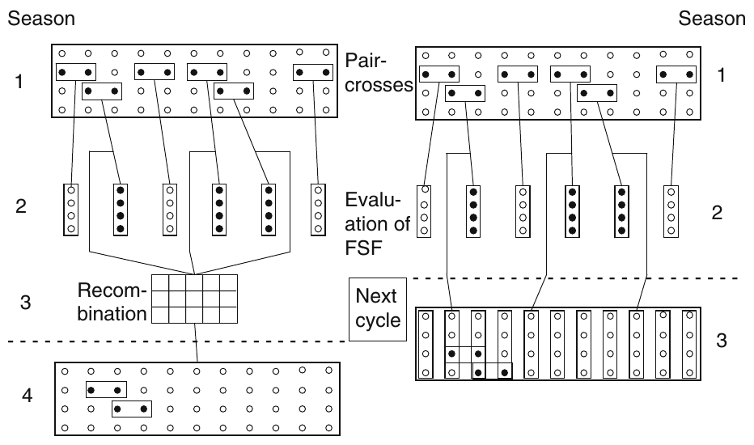

```{r setup, include=FALSE}
library(tint)
library(knitr)
require(tidyverse)
# invalidate cache when the package version changes
knitr::opts_chunk$set(tidy = FALSE, cache.extra = packageVersion('tint'))
options(knitr.kable.NA = "")
options(knitr.table.format = "latex")
options(htmltools.dir.version = FALSE,
        kableExtra.latex.load_packages = FALSE)
```

In a narrow-based population, or after several cycles of phenotypic selection, visual differentiation among individual plants becomes rather erratic and unreliable for traits with low heritability ($h^2 <0.20$). The purpose of progeny testing therefore is to estimate genetic variance by separating environmental from the phenotypic variance by means of replicated trials. To avoid genetic sampling effects, the number of plants per replicate should be chosen according to the type of family. For half-sib (HS) families 15–20 plants are adequate, whereas for full-sib (FS) families somewhat lower numbers might be used. Comparison among families is based on entry means across replicates. Plot trials to test the families are named progeny test (HSPT or FSPT) in the literature (Sleper and Poehlman 2006, Casler and Brummer 2008).

In spaced plant trials, selection is often practiced as among and within family (AWF) selection, selecting the "best" individuals of the "best" families (Nguyen and Sleper 1983, Vogel and Petersen 1993). Aastveit and Aastveit (1990) presented experimental data from a selection experiment with meadow fescue. They also calculated response to selection for several combinations of AWF selection. Casler and Brummer (2008) recently presented expected genetic gains of AWF selection for HS and FS families and concluded that AWF selection was superior over mass selection. However, these types of spaced plant trials do not allow for a separation between the genotypic and environmental variation within families, unless each member of each family is clonally replicated (Aastveit and Aastveit 1990).

## Half sib families

According to selection theory the covariance among non-inbred HSFs is 1/4 of the additive variance ($\sigma^2_A$) and equals the general combining ability (GCA). GCA is defined as the average performance of a genotype in a series of crosses, and is measured as the deviation of its progeny from the mean of those crosses. GCA values are especially useful in the prediction of synthetics and hybrids.

Half-sib families can be obtained in several ways. Allard (1960) described four mating systems to produce HS progenies: Open pollination (OP), polycross (PX), topcross (TX) and diallel matings. The latter is rarely used in practical breeding because only small numbers of parents can be investigated. OP progenies derive from individual "female" plants and an unknown pollen cloud selection), whereas in PX and TX progenies, a homogeneous, common pollen cloud is assumed.

The polycross test (PX) was developed independently in Denmark (grasses), the USA (alfalfa) and the Netherlands (rye) by Frandsen (1940), Tysdal et al. (1942) and Wellensiek (1947), respectively. The latter named his method mass test cross, while the term polycross was suggested by Tysdal et al. (1942). A prerequisite is the possibility for vegetative propagation (cloning) of a crop. The clonal propagules are interplanted in such a way that each of them is neighboured by clonal plants derived from different genotypes. To assure random mating a large number of entries with large numbers of replicates are needed. Non-random mating in a meadow fescue polycross with as many as 20 genotypes x 20 replicates was still detected by Myhre and Rognli (1990) by means of isozymes. The number of replicates is mostly above 10 to harvest enough seed for broadcast plot trials in several environments. Various PX designs have been suggested, mostly based on lattice or alpha designs, being well suited for small numbers of entries as in syn-0 nurseries (CE Wright 1962, Morgan 1988). For large numbers of entries, CE Wright (1965) developed field plans involving up to 50 clones. In practice, these plans have proven to be extremely valuable. Several variants of PX designs have been elaborated leading to reduced labor and costs. One is to plant replicated clonal rows instead of single plants. This reduces harvesting time and technical errors. Instead of clonal plants, individuals belonging to the same family can also be used for crops where vegetative propagation is difficult.

The topcross test (TX) was originally described to test large numbers of inbred line x variety crosses in maize (review by Hallauer and Miranda 1981). However, it also covers different forms of crosses between a number of candidates (clones, lines or families) and a common pollinator (tester). Surprisingly, in the forage breeding literature, an unrelated variety is still mentioned as the typical tester (Frandsen et al. 1978, Nguyen and Sleper 1983, Sleper and Poehlman 2006). However, the tester could also be a related population like the breeding population from the previous cycle or even the base population. In both cases there will be enough seed to drill the tester rows. In crops like perennial ryegrass, where vegetative propagation is simple and cheap, a mixture of clonal parts could be used as the tester as well. In all cases where the tester is related to the candidates, genetic interpretation is identical to HS progenies derived from polycrossing. The use of an unrelated tester is used in interpopulation improvement.

The choice of tester depends largely on the stage of the breeding programme and varies from a population or synthetic, a single-cross hybrid to an inbred line, i.e. from genetically broad to narrow based. There have been many discussions about whether a tester should be strong or weak. These expressions refer to the genetic make up, and a weak tester is one carrying many recessive, negative alleles at loci responsible for the traits of interest. With a weak tester, the good performance of a progeny reflects the number of positive alleles of the particular candidate genotype.

In alfalfa and clover breeding, insect-proof cages can be established to isolate PX or TX nurseries and insect pollinators placed inside to provide for pollination. With wind-pollinating species spatial isolation of the PX or TX nursery is an important feature. Synchronization of the time of flowering is of fundamental importance and the difference between the earliest and latest flowering genotype should not exceed 5 days. In a topcross, the tester will provide an excess of pollen, which will predominate the pollen cloud.

The number of candidates in the PX or TX determines the number of families and consequently plots to be evaluated. HSF testing is mostly performed in drilled plots, replicated over locations and years and selection is on HSF means. The invention of forage plot harvesters enabled breeders to drastically increase the number of plots to be harvested. Under the assumption of a selection pressure of 10\% and recombination targeted at 10–15 selection units, 100–150 genotypes have to be testcrossed and progeny tested. Depending on the species and the breeder’s preferences, recombination can be done either with remnant seed or with the parental plants, if these have been maintained vegetatively. Recombination with remnant seed will reduce parental control and gain from selection to one-half.

*Spaced Plants: Individual vs. Family Selection* Assuming a spaced plant nursery with 10,000 individuals as in mass selection, then 100 HSFs with 100 plants/family could be tested. Ten families with 10 individuals per family may have been selected for recombination to generate 100 new HSFs. This results in a selection intensity of 10\% (i = 1.755) for both among and within family selection, while in mass selection with 1\% a 10-fold higher selection pressure can be achieved. Assuming equal single plant heritability, mass selection will be superior to AWHSF selection. England (1977) compared several types of family selection and his model calculations lead him to conclude that single plant plots are superior to replicated tests; in other words, that mass selection was the best method. These findings are supported by Gallais (1990) for both HS and FS among and within family selection. In an experimental study with HS progenies from two perennial ryegrass populations, several combinations of selection pressure among and within families were compared and superiority of individual over family selection was observed (Charmet and Grand-Ravel 1991).

There are many published experiments demonstrating the success of spaced plant selection, whether mass or family selection. However, there are only a few experiments, where the response to selection was also evaluated under plot conditions. In perennial ryegrass, Ravel et al. (1995) concluded that individual plant selection failed to increase productivity under sward conditions, but produced some improvement in disease resistance and other individual plant-related traits. Similar results were found by Real et al. (2000) in diploid red clover.

To improve the generally poor relationship between individual plant and plot performance, Gallais (1977) and Wilkins (1991) suggested simultaneous evaluation under spaced plant as well as micro plot conditions.

## Full sib families

Full-sib families (FSF) derive from paircrosses also known as bi-parental matings (BIPs). Since the parents (individual plants or clones) are non-inbred, FSFs are segregating. Under spaced plant conditions selection among and within full-sibs (AWFS) may be carried out. Testing FSFs under plot conditions is named fullsib family progeny test (FSPT). In self-incompatible grasses paircrosses are made by bagging together tillers from neighbouring plants without emasculation. With detached tillers as mentioned above, great flexibility in adjusting time of pollen shed can be achieved. However, to obtain enough seeds for plot trials parental clones are interplanted in an isolation in seed islands in a field of rye. If a paircross does not yield enough seed, an FSF could be multiplied under isolation to yield an $FSF^2$, which is partly inbred but still represents the gametic array of the two parental genotypes. The inbreeding coefficient F varies among $FSF^2$ s, averaging to 0.25. Because $FSF^2$ are compared inter se, the inbreeding effect does not alter selection decisions. Recombination of the selected $FSF^2$ will result in a non-inbred population again.

The variance among FSF from non-inbred parents equals $\frac{1}{2}\sigma^2_A + \frac{1}{4}\sigma^2_D$, which corresponds with $2 \sigma^2_GCA + \sigma^2_SCA$. The small fraction of nonadditive genetic variance can be largely ignored in practical breeding programmes. Theoretically, FSPT should be twice as effective as HSPT. However, to produce FSFs twice as many parents as with HSFs are needed and the production is more expensive. Assuming a selection pressure of only 10\%, and a selected fraction of 25, 250 paircrosses have to be made. Recombination in FSF selection is based on selected plants or remnant seed of the selected families and could be done in two ways. As shown in Figure \ref{fig:full-sib-family-recombination} (left), recombination among selected FSFs takes place in 1 year, while the paircrosses are made in a successive year. However, this procedure costs time and furthermore, the parentage cannot be controlled, and thus there is a risk of mating-related individuals. An alternative is shown on the right hand side of Figure \ref{fig:full-sib-family-recombination}. Recombination and production of new paircrosses can be performed as a single step if mating between relatives is prevented by controlled pollination. Recombination can be improved by increasing the number of crosses among unrelated families. Parentage and inbreeding can be controlled by applying partial diallel mating schemes or a series of factorial crosses.

```{r full-sib-family-recombination, out.width="50%"}
# pdftools::pdf_convert("/home/deependra/Downloads/posselt2010.pdf", format = "png", pages = 18, filenames = "./images/full_sib_family_recombination.png", dpi = 200)

```

