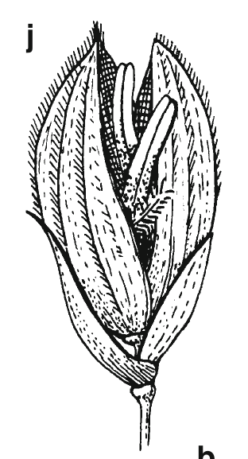
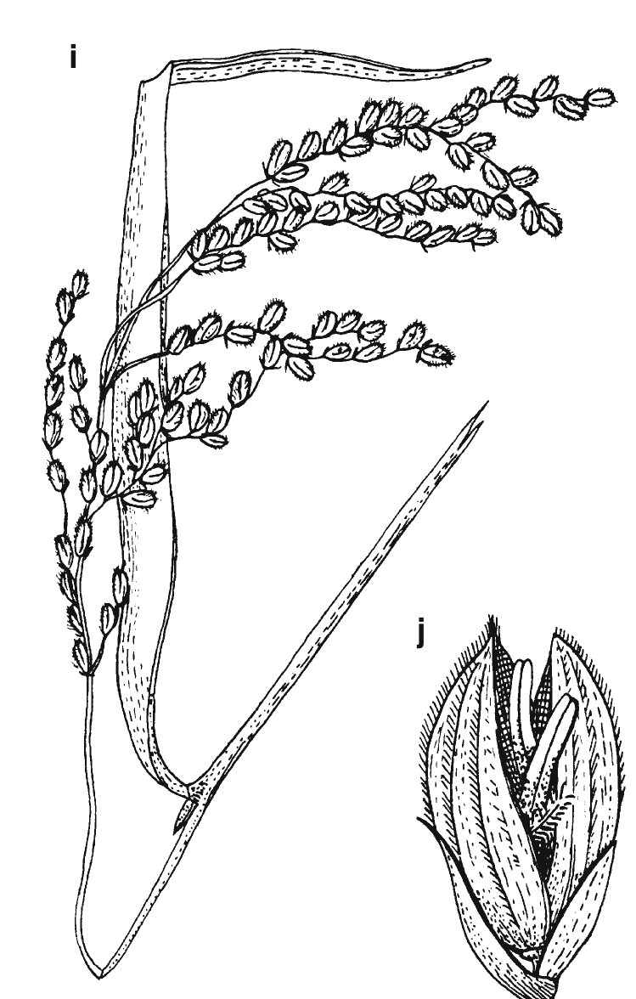
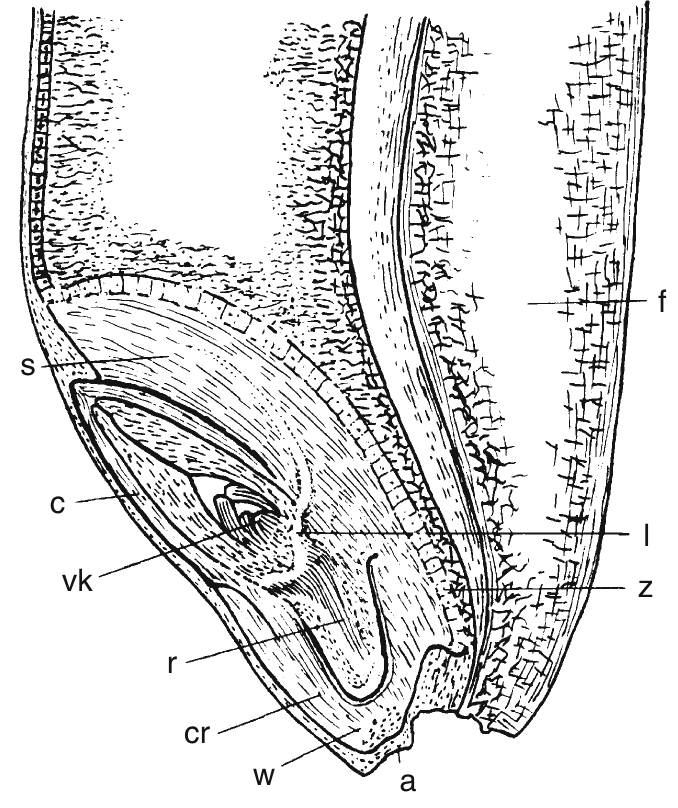
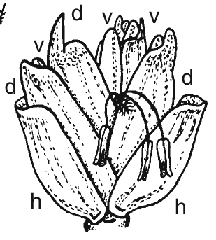
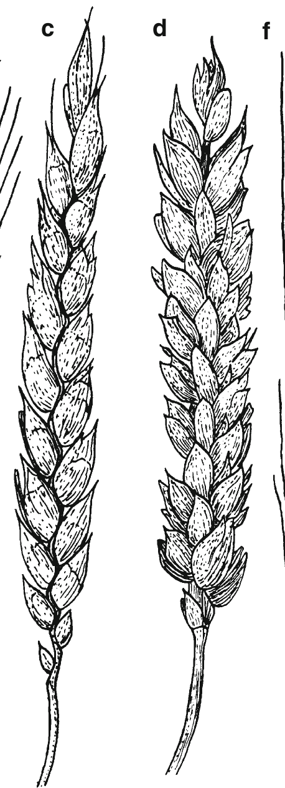

# Study of floral parts of field crops {#practical-1}

## Objectives

- To be familiar with different parts of flower and their functions
- To know the floral morphology and mode of pollination in crops

## Theory

Flowers are the reproductive organs of a plant which lead to the development of fruit and seed. ? How flowers are important part of evolutionary history in crops ?

The floral morphology is the study of forms and features of flowers. ? Add a brief history to this ?

The genetic constitution of a crop depends on the mode of pollination of the crop ?. Floral morphology dictates the mode of pollination in flowers. Therefore, it becomes an essential for a plant breeder to know the structural organization and basic nomenclature associated with commonly cultivated crops' flowers.

```{r floral-morphology-poales, fig.cap="Flower and fruit morphology of poales. Wheat, \\textit{Triticum aestivum} with (c) spelt and (d, e) wheat. (k) Wheat grain (caryopsis). (i, j) Rice, \\textit{Oryza sativa}. a point of emergence, c coleoptile, cr coleorhiza, d lemma, f fruit furrow, h glume, l vascular bundle, r radicle, s scutellum, v palea, vk shoot apex, w root cap, z cylindrical epithelium", fig.align='center', out.width="55%", fig.nrow = 2}
# pdftools::pdf_convert("/home/deependra/Desktop/BSc_Ag_lectures/literatures/Plant Science Straussberger.pdf", pages = 956, format = "png", filenames = "./images/floral_morphology_wheat.png", dpi = 300)



# 
# 
```

The type of habitat that a species inhabits in determines the reproductive biology of that adapted crop to a large extent. A range of vegetation types (based on habitat) are identified for order poales, including:
  - Woodland
  - Grassland
  - Heathland
  - Wetland
  - Desert
  - Polymorphous
  
Flower morphology in turn affects the choice of tools and techniques to be used for hybridization. Prominance of reproductive organs -- Stigma and anther -- which is largely conserved in a species (cleistogamous and ?), is among a number of factors determining the mode of reproduction and complexity of undertaking a manual crossing. More on hybridization techniques in Practical \@ref(practical-2).

## Materials required

- Flower,
- Scissor,
- Petri dish,
- Magnifying glass,
- Notebook, 
- Pencil

## Procedure

- A fresh sample of flowers are obtained of crops.
- Flowers are dissected in lab, their nature and morphology looked closely with the help of magnifying glass, and the observed impression is drawan in notebook.

### Following structures can be observed

1. Wheat/rice

- Bracteate type flower
- Inflorescence: Spike of spikelets or compound spikelets
- Mode of pollination: Self pollination
- Flowers of wheat and rice are complete and bisexual.
- ? refer to wheat valentine blog post

2. Pea

- Flowers are pedicilate, zygomorphic and hermaphrodite
- Sepals are gamosepalous, pentamerous
- Petals have axillary aestivation
- Androecium: Superior ovary (epigynous)
- Pollination: Self pollinated

3. Potato: 

- Bisexual, complete, regular flower, yellow colored and self pollinated
- ?

4. Maize

- In maize, male and female inflorescence are located on different parts, namely tassel and ear, respectively.
- ? details

- 95% of the times, pollination is cross and 5% of the time only self-pollination takes place.

## Conclusion

Hence, study of floral morphology done for some of the common crop species has inspired students about the importance of floral biology in overall reproductive habit of a crop and established that it's knowledge can aid in crop improvement activities, mainly through hybridization.
