```{r setup, include=FALSE}
options(htmltools.dir.version = FALSE)
options(knitr.kable.NA = "", digits = 3)
knitr::opts_chunk$set(tidy = FALSE, echo = FALSE)
# knitr::opts_knit$set(root.dir = normalizePath("."))
```

background-image: url("./images/Wheat_bread.jpg")
background-position: 50% 50%
background-size: 80%
class: middle, center

<!-- `r knitr::include_graphics('./images/Wheat_bread.jpg')` -->

## .yellow[.large[Introduction]]

---
class: center, middle

```{r x-men, fig.cap="Mutant seekers", fig.height=3, out.height="400px", out.width="auto"}
# fig.height=3

```


```{r, load-refs, echo=FALSE, cache=FALSE, warning=FALSE}
suppressPackageStartupMessages(library(RefManageR))
suppressPackageStartupMessages(require(magrittr))
BibOptions(check.entries = FALSE, 
           bib.style = "authoryear", 
           cite.style = 'authoryear', 
           style = "markdown",
           hyperlink = FALSE, 
           dashed = FALSE)

myBib <- ReadBib("../bibliographies.bib", check = FALSE)
```

---
class: center, middle

## `r icon::fa_people_carry(pull = "right")`

```{r borlaug, fig.cap="Dr. Borlaug working in a wheat crossing block", fig.height=3, out.height="450px", out.width="auto"}
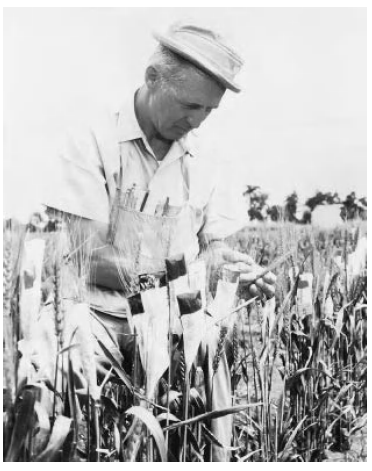
```

---
class: center, middle

.small[
.pull-left[

<blockquote>
The greatest service which can be rendered any country is to add a useful plant to its culture; especially a bread grain
.right[-- <cite>Thomas Jefferson</cite>]
</blockquote>

<!-- or -->

<!-- .blockquote[Quote] -->

<!-- or -->

<!-- > Quote quote -->

]

.pull-right[

<blockquote>
"For more than half a century, I have worked with the production of more and better wheat for feeding the hungry world, but wheat is merely a catalyst, a part of the picture. I am interested in the total development of human beings. Only by attacking the whole problem can we raise the standard of living for all people, in all communities, so that they will be able to live decent lives. This is something we want for all people on this planet".
.right[-- <cite>Norman E. Borlaug (March 25, 1914 - September 12, 2009)</cite>]
</blockquote>
]

]

---
class: center, middle

## `r icon::fa("check-circle", pull = "right")`

```{r modern-triticum-uk, fig.cap="Modern wheat genotype under test in cool temperate region (UK)", out.height="450px", out.width="auto"}
# fig.height=3, fig.width = 4
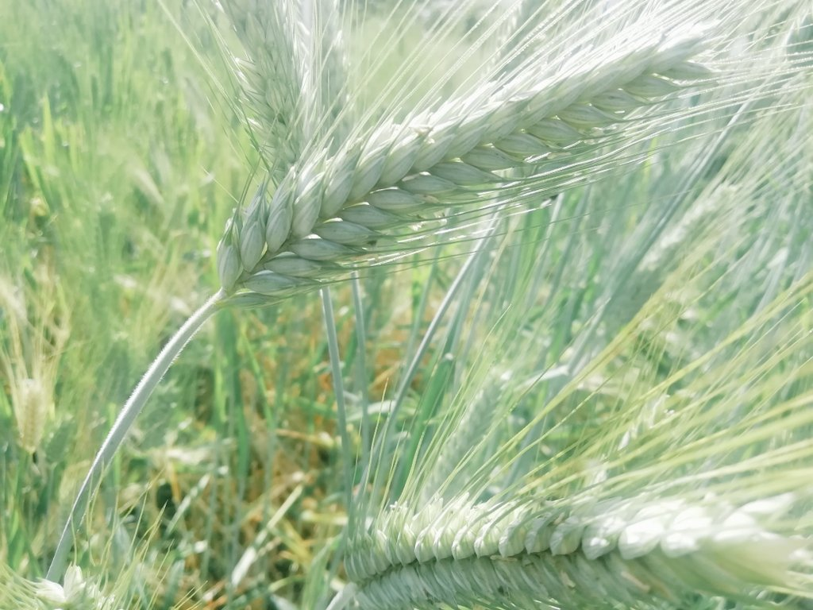
# 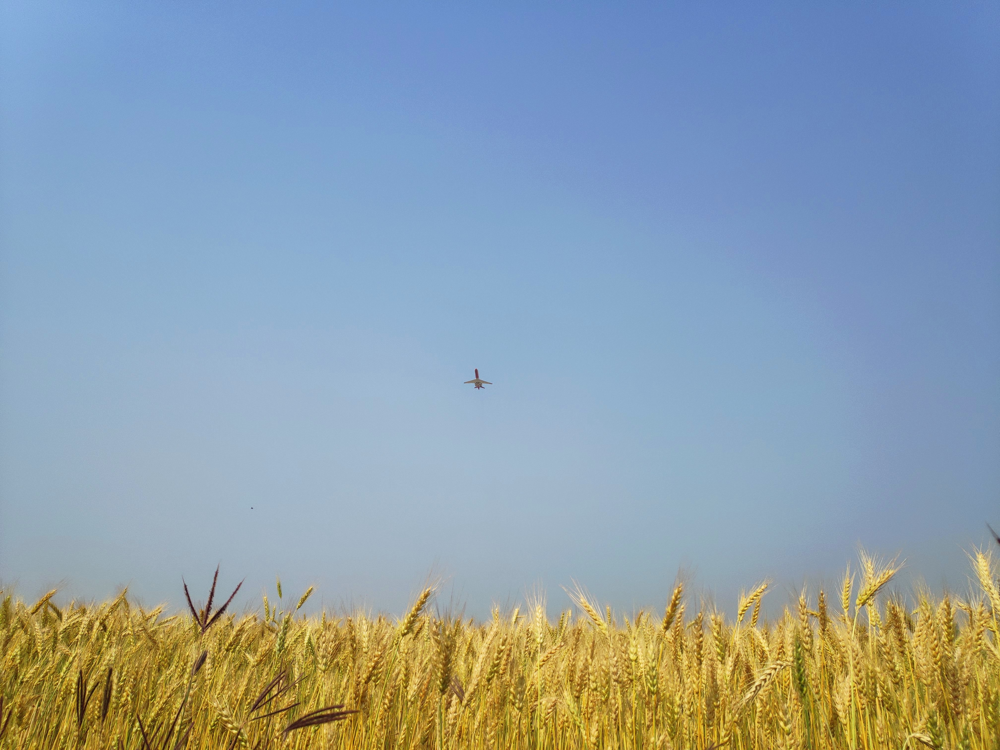
```

---

## Overview `r icon::fa("box", pull = "right")`

.content-box-blue[
- There are over a quarter of a million plant species of which approximately .content-box-yellow[5000 are cultivated]. But, only a 100 can be considered as important crops.
- Ancestors of most of the modern crops (Used either in food chain or in industrial chain solely) have different appearance and even forms than what is seen today.
]

--

.content-box-army[
- Plant breeding has a commercial history of 2/3 century at least.
- By 19th century's end, artificial crossing, bulk and pedigree methods and alternative progeny testing schems were already used
]

--

.content-box-yellow[
- After rediscovery of Mendel's law and developments in genetics plant breeding has evolved rapidly
- In the period deemed .content-box-purple[green revolution], genetic contribution to yield gains was of secondary importance (Why?)
]

---

.content-box-purple[
- Rising consciousness of environmental stewardship underlines greater role of plant breeding
	- Optimum environments
	- Marginal environments
	- Economic value of resources
- Extermely wide and cross cutting topic nowadays!
- Plant breeding has answered many fundamental genetic questions and posed new ones too.
]

---

## Concepts `r icon::fa("quote-right", pull = "right")`

.columns-2[
.content-box-gray[
- "Breeder's eye" viewpoint of Plant Breeding: 
  - Plant breeding is an applied science and an art 
  - Early plant breeders depended primarily on intuition, skill, and judgement in their work.
  - Plant breeding was practiced first when people learned to look for superior plants to harvest for seed; thus selection became the earliest method of plant breeding. However few people may have had conscious efforts in so-doing.
]
.content-box-green[
- Scientific viewpoint of Plant Breeding: 
  - "Breeding" is about a more active process of crossing different strains of plant for particular results.
  - Plant evolution directed by man (N.I. Vavilov)
  - Process of generating and utilizing variability
  - "Selection" is about picking the best from each generation

]
]

---

- As human knowledge about plants increased, people were able to select more intelligently. 

- With the discovery of sex in plants, hybridization was added to breeding techniques.

- Although hybridization was practiced before the time of Mendel, its significance in inheritance was not clearly understood. 

- Mendel's experiments provided a basis for understanding the mechanism of heredity and how it may be manipulated in the development of improved varieties. 

- A more precise explanation of the heredity mechanism has become possible in recent years with advances in biochemical genetics.

- Now, plant breeding is more about making precise crossess and accurate prediction

---

## Definition

.pull-left[
.blockquote[
### `r icon::fa_language()` Linguistic
**Plant breeding is the art and the science of changing and improving the heredity of plants**

- Breeding is about manipulating plant attributes, structure and composition, to make them more useful to humans.

- Plant breeding is essentially an election made by man of the best plants within a variable population as a potential cultivar. 

- In other words plant breeding is a 'selection' made possible by the existence of 'variability'.

]

]
.pull-right[

.blockquote[
### `r icon::fa_sign_language()` Mathematic

$$\Large \Delta{G}=\frac{Ih^2 \sigma}{I}$$

]

]

.footnote[
It is obvious that mathematical definition of plant breeding is more eloquent.
]

---

background-image: url("./images/Triticum_species.jpg")
background-position: 50% 50%
background-size: 90% 90%
class: center, middle

## .black[How do you define art?]

---

# History

- Broadly, two distinct stages in plant breeding could be characterized
	- Domestication of the first crops to the birth of Mendelian genetics
	- Acceptance of Medelian genetics to post-mendel era

- The work of Gregor Mendel and further advances in science that followed his discoveries established that plant traits are controlled by hereditary factors or genes that consist of DNA (deoxyribose nucleic acid, the hereditary material).

---

## Pre-mendel era

.scroll-box-20[

- Plant breeding started with sedentary agriculture and the domestication of the first agricultural plants, the cereals, which were chosen by early man. This led to the rapid elimination of undesirable characters such as seed shattering and dormancy. It seems natural that the need to collect fruits, seeds and roots for nutrition brought with it the knowledge to identify plants, aspects of their biology and their potential as food, poison or other uses. The need for pollination for fruit setting in dates was recognized some nine centuries before Christ, as can be deduced from the observation of an Asyrian bas-relief showing the pollination of female date palms with male pollen. Until the first decenium of this century plant breeding was in the hands of 'experts' who in many cases were unable to make progress due to a lack of knowledge of the fundamental plant processes such as the reproductive system. In spite of this, however, some important goals were reached before the rediscovery of Mendel's laws and the consecration of genetics as a science. Some examples are worth mentioning. In France, in the 17th century, several varieties of 'heading lettuce' were developed, some of which are still in cultivation.

- A family of French seed growers, the Vilmorins, established in 1727 the first company devoted to plant breeding and the production of new varieties. A member of the family, Louis de Vilmorin, was the first, some years later, to use the progeny test, evaluating a selection by the study of its descendants.

- The sexuality of plants was described by Caesalpinus in 1583 and in 1696 Camerarius published an essay entitled 'De sexo plantarum', but it was Kolreuter, a German botanist who was the first to exploit this knowledge in the production of the first artificial plant hybrids in Nicotiana. A well-known example of premendelian plant breeding is that of sugar beet. In 1747 Margraaf discovered that the roots of the forage beet contained about 6% of sucrose. By the beginning of the 19th century, Achard, by means of mass selection, increased this to 11 %. Application of the Vilmorin pedigree method had further increased this to 16% by 1810.

- The use of artificial crosses in premendelian breeding can be exemplified by the case of Fragaria x ananassa developed in the botanical garden of Paris by Duchesne, in the 17th century by crossing F. chiloense with F. virginiana. In England at about the same time new varieties of fruits, wheat and peas were being obtained by artificial hybridization.

]
---

## Post-mendel era

.scroll-box-20[

- After the rediscovery of the work of Mendel in 1900 it was some six years before Bateson, who coined the name 'genetics' for the new science, realized that this new discipline could give a scientific basis and new openings to plant breeding methods. Modem plant breeding is, as has already been stated, applied genetics, but its scientific basis is broader and uses, as conceptual and technical tools, cytology, systematics, physiology, pathology, entomology, chemistry and statistics and has also developed its own technology. There have been many advances in these various areas which have made a substantial contribution to plant breeding. These include the demonstration of the auto- and allopolyploid nature of many crop plants and their origin. This opened the way to the production of artificial polyploid forms and their direct or indirect exploitation. The discovery of the possibility of increasing the frequency of mutations by means of radiation or chemicals was hailed as a means of increasing the variability available to the breeder. There have been many other developments which have all contributed to the progress and success of plant breeding too numerous to exemplify in detail but include such areas as quantitative inheritance and genotype x environment interaction, resistance breeding, and the conservation and characterization of genetic resources. 

- Genetics has given to breeding a better knowledge of the processes involved in the mechanisms of variability and the necessary information for regulating and increasing such variability. More recent genetical advances than those outlined above have allowed breeders to design new methods as is well exemplified by the developments in such areas as RFLP mapping and marker-assisted selection, gene cloning and genetic transformation. These new enabling technologies, all adding to the overall science of plant breeding, are considered in some detail in this book. They hold out great promise for the future. The ceilings for yield that some authorities claim have been reached will be surpassed by the combined application of the classical and the new methods available to the breeder. Where yield as such is not the prime criterion of a breeding programme they will allow the production of more efficient cultivars which can maintain production without the requirement for expensive inputs. At the same time breeding can and will make a positive contribution to halting the decline in the agricultural environment.

]

---

## Domestication and evolution

.pull-left[
```{r secale-cereale, fig.cap="Image of ancestor of wheat <i>Secale cereale</i>", fig.width=4, out.width="75%"}
knitr::include_graphics("./images/rye_crop.jpg")
```

]

.pull-right[
```{r modern-wheat, fig.width=4, out.width="75%", fig.cap="Modern wheat <i>Triticum aestivum</i>"}
knitr::include_graphics("./images/wheat_borlaug-100.jpg")
```

]

---

.pull-left[
```{r rose-wild, fig.width=4, out.width="75%", fig.cap="rose ancestor (Wild rose)"}
knitr::include_graphics("./images/rose_prickly_or_common.jpg")
```

]

.pull-right[
```{r rose-modern, fig.width=4, out.width="75%", fig.cap="Rose modern"}
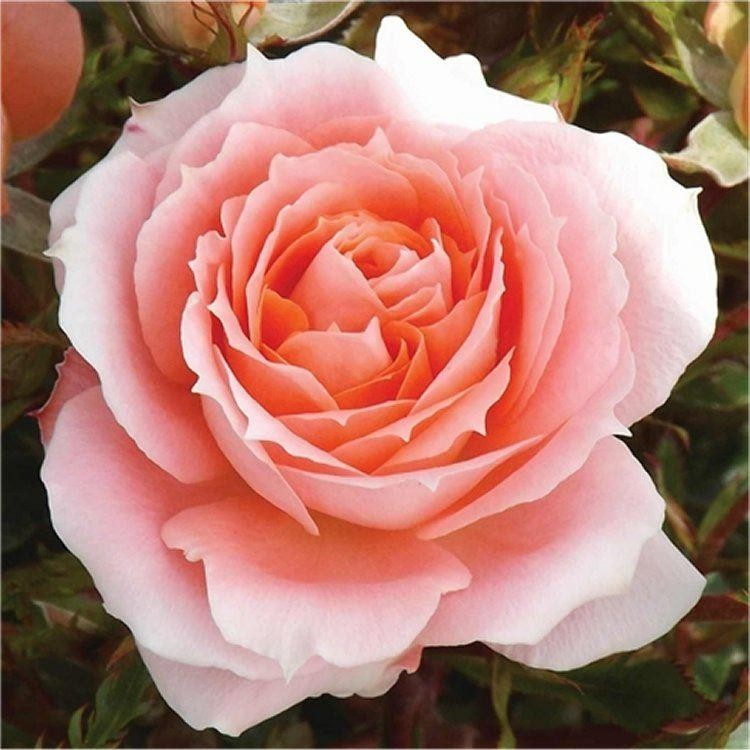
```

]

---


.pull-left[
.small[
```{r tomato-wild, fig.width=4, out.width="75%", fig.cap="Wild tomato (Lycopersicum cheesmanii); Unique and rare, wild, small cherry tomato from the rocky, lava flow areas of Ecuador's famed Galapagos Islands. These cherry shaped, yellowish-orange fruited tomatoes are flavorful and have lemon scented foliage. They enjoy heat and tolerate drought. Similar to cultivated tomatoes in flavor but with more disease and insect tolerance, as well as salt water tolerance. Plants typically vine, are very productive, and easy to grow."}
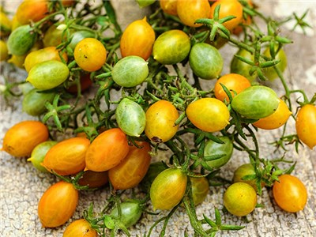
```
]
]

.pull-right[
```{r tomato-modern, fig.width=4, out.width="75%", fig.cap="Modern tomato (Lycopersicum esculentum)"}
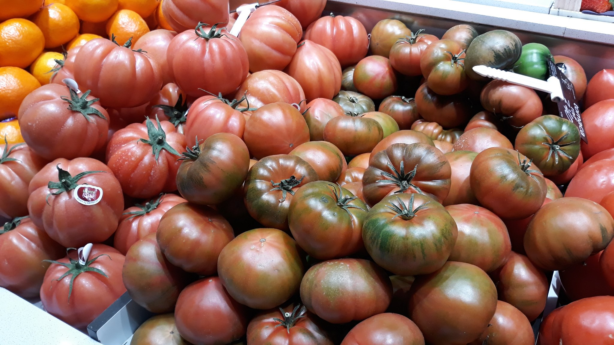
```

]

---

.pull-left[
```{r wild-brassica, fig.width=4, out.width="75%", fig.cap="Arabidopsis spp."}
knitr::include_graphics("./images/brassica_arabidopsis.jpg")
```

]

.pull-right[
```{r modern-brassica, fig.width=4, out.width="75%", fig.cap="Modern day cauliflower"}
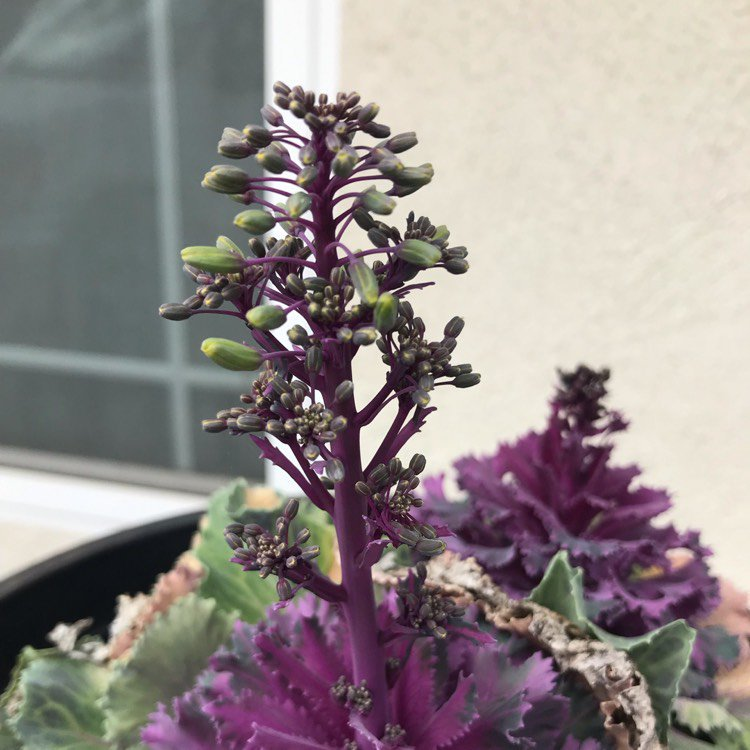
```

]

---


.pull-left[
```{r maize-ancestor-teosinte, fig.width=4, out.width="75%", fig.cap="Wild progenitor of modern day maize -- Teosinte"}
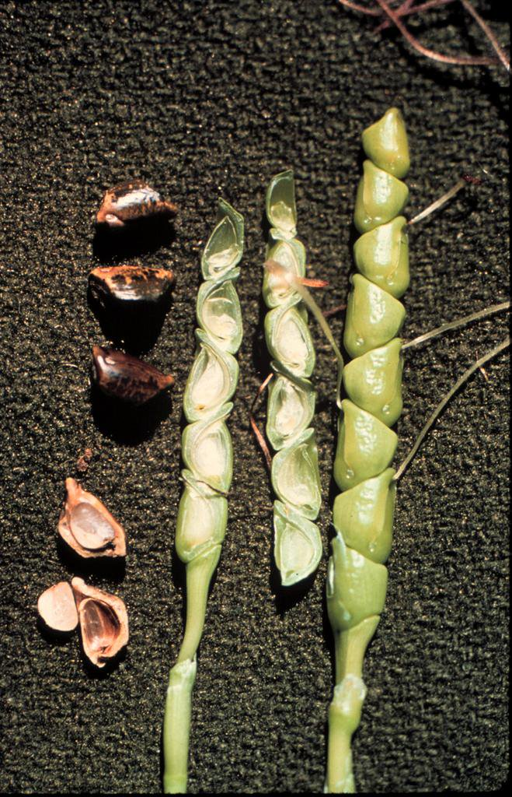
```

]

.pull-right[
```{r maize-modern, fig.width=4, out.width="75%", fig.cap="Modern day maize (Zea mays)"}
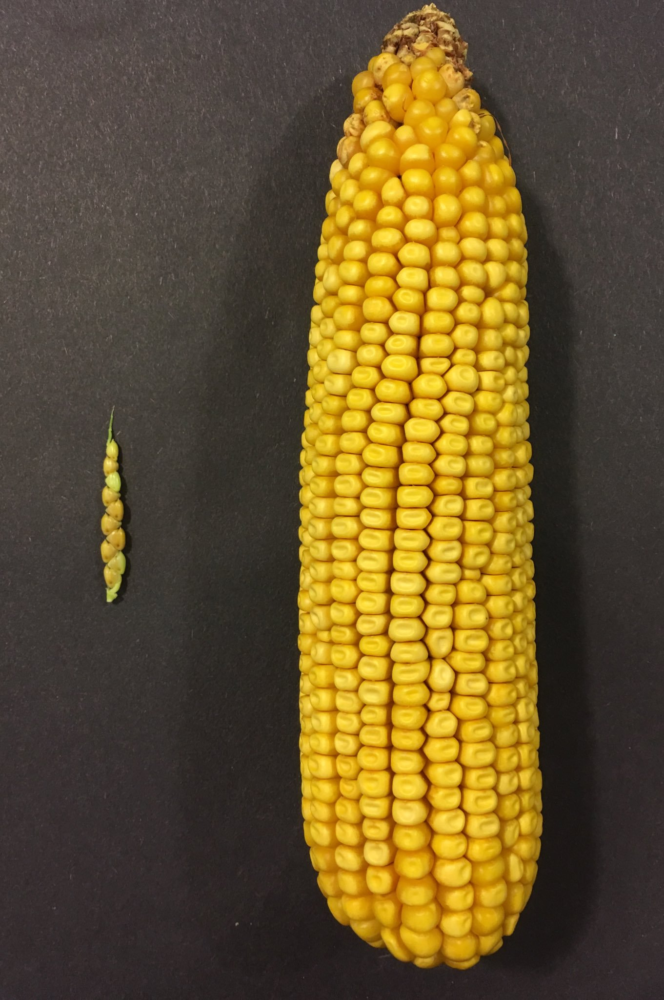
```

]

---

.blockquote["Charles Darwin's writing in the nineteenth century first formulated the idea of evolution, the idea that plants and animals are in constant competition, which results in the fittest or the best adapted surviving and passing on their genes to the next generation, those less well-adapted dying or failing to reproduce and so not passing on their genetic code. Life, then, is a constant winnowing and sifting of genetic material."

.right[--`r Citet(myBib,"kingsbury2009hybrid")`]

]

- Historically, good seed from high-yielding plants were stored in woven baskets and bartered for metal tools or cloth.

- Nowadays test tubes and computers have replaced the baskets, and huge research budgets have replaced the barter.

---

## Interesting historical facts

.pull-left[
.scroll-box-16[
.font80[
- Luther Burbank is the last great prescientific plant breeder.

- Burbank admired Darwin but not Mendel

- Remarkably strong start in plant breeding was made by Soviet Communists in twentieth century. But dissapointingly, intrigue and ideology ensured that Mendelian genetics was discarded.

- For detailed history refer to Principles of Plant Genetics and Breeding `r Citet(myBib,"acquaah2009principles")`, Chapter 2 (Page 22-39).
- For detailed history of Genetics refer to `r Citet(myBib,"griffiths2015introduction")`.

]]]

.pull-right[
.scroll-box-20[
.font80[
```{r history-data, tidy=FALSE}
# "History of genetics; Page 6, Chapter 1 (The Genetics Revolution), An introduction to Genetic Analysis, 11th edition, W.H. Freeman"

history_genetics <- readxl::read_xlsx("./data/01-introduction_to_plant_breeding.xlsx", 
                                      skip = 1)

DT::datatable(
  history_genetics,
  fillContainer = FALSE, options = list(pageLength = 6)
)

# history_genetics %>%
#   knitr::kable(booktabs = TRUE, caption = "A short history of plant breeding", format = "html") %>% 
#   kableExtra::kable_styling(full_width = TRUE)

```
]
]]

---

```{r plb-history-book, fig.height=4, out.width="30%", fig.cap="History of plant breeding Rolf H. J. Schlegel, 2018"}
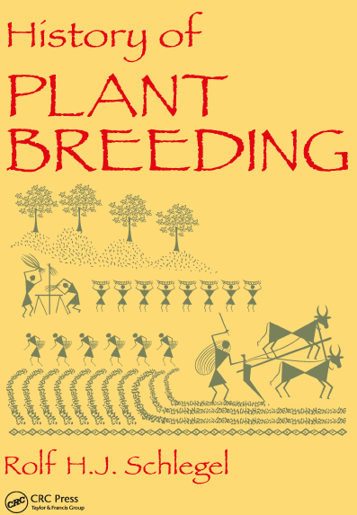
```

---

## Objectives `r icon::fa_object_group()`

.pull-left[

- Before initiating a breeding project, clear breeding objectives are defined based on factors such as producer needs, consumer preferences and needs, and environmental impact. Broadly .fn[1], objectives could be,
    - Feed the growing population
    - Maximize resource and energy use efficiency
    - Fasten return on investment
    - Introgress desired modification in crop species
]

.footnote[
[1] The goal of the field on entirety is the betterment of human lives.

]

--

```{r spinner}
icon::fa("spinner", size = 2, 
         animate = "spin")
```

.pull-right[

### Specifically

.scroll-box-14[.font80[.content-box-purple[

- Increasing the potential productivity of a plant by modifying its morphological characteristics such as: 
  - The number of kernels per ear in a cereal
  - The weight of individual seeds within the pod of a pulse, 

- Modifying physiological traits such as: 
  - harvest index, 
  - utilization of nutrients,
  - tolerance to stress. 

- Quality and nutritive value are now of increasing importance, particularly in association with improved efficiency of production.

- Modern agriculture is highly mechanized and for this reason some breeding programmes include objectives to make the crop more amenable to mechanical handling. 
  - Development of monogerm beets for mechanical sowing thus eliminating the need for thinning, or the introduction of 'jointless' tomatoes for mechanical harvesting. 
  - Use of some agrochemicals is often coupled with the need for specific crop characteristics e.g. herbicide resistance.
]

]]
]

---

## Activities

```{r plb-disciplines, fig.height=4, out.width="550px", fig.cap="Inter-desciplinary linkage of plant breeding"}
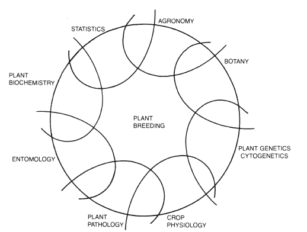
```

---

## Inter-disciplinary linkage of plant breeding `r Citet(myBib,"poehlman1987breeding")`

- .content-box-gray[Botany]: Plant breeders should be accomplished botanists in order to understand the taxonomy, anatomy, morphology, and reproduction of the plants with which they work.

- .content-box-purple[Genetics and Cytogenetics]: The plant breeder needs a thorough understanding of the mechanism of heredity in plants since modern plant-breeding methods are based on a knowledge of genetic principles and chromosome behavior. This knowledge is being extended to the molecular level with advances in biochemical genetics.

- .content-box-green[Plant Physiology]: Variety adaptation is determined by the response of plants to their environment, which includes the effects of heat, cold, drought, and soil nutrient response. The plant breeder strives to make inherent modifications of physiological processes that will enable the plant to function more efficiently.

---

- .content-box-purple[Plant Pathology]: Plant disease reduces crop yields. Host resistance is an important means of combating many plant diseases. Evaluation of the response ofthe plant genotype to infection by the pathogen is an essential part of breeding for host plant resistance.

- .content-box-yellow[Entomology]: Biological control of insect populations by breeding for insect resistance is an important way of reducing insect damage in crop plants.

- .content-box-green[Plant Biochemistry]: Inherent improvements in the nutritive value of a crop variety are given attention by the plant breeder. Suitability for industrial utilization often determines the market demand for a particular variety of a crop. This includes such characteristics as the milling and baking qualities of a wheat variety, the cooking and eating qualities of a rice variety, or the fiber qualities of a cotton variety. Biochemical genetics is contributing toward a better understanding of the structure and function of the gene.

---

- .content-box-purple[Statistics]: The plant breeder compares the performance of many genetically different strains. Sound field plot techniques and suitable methods for statistical analyses of data are necessary to obtain reliable results and to interpret the results correctly. The application of statistical procedures has provided for a better understanding of the inheritance of quantitative characteristics and for predicting the possible genetic advance that may be obtained with particular systems of mating.

- .content-box-gray[Agronomy]: In addition to all of these, the breeder offield crops should be a sound agronomist. Plant breeders should know crops and their production. They should understand what the farmer wants and needs in the way of new varieties. Only then will they be able to evaluate critically the breeding materials available to them, plan an efficient breeding program, and direct their breeding efforts toward the agronomically important objectives.

---

## Steps (Activities) in plant breeding:

- Setting objective/s

- Germplasm

- Creation of variation
  - Genetic variation can be created by domestication, germplasm collection, plant introduction, hybridization, polyploidy, somaclonal variation and genetic engineering

- Selection
  - Identification and isolation of plants having desirable combinations of characters and growing their progeny is called selection. Selection is necessarily based on phenotype. Various breeding methods have been designed to increase efficacy of selection. Selection finally yields an improved lines or population.

---

- Evaluation
  - Newly selected lines/population are tested for yield and other traits. Performance is compared with existing best varieties (checks). Evaluation is a step-wise process, ordinary conducted at several locations for three or more years.

- Multiplication
  - This step concerns the large scale production of source/certified seed after release and notification of varieties. Seed production is usually done by seed production organizations, in concert with seed certification agencies.

- Certification and cultivar release
  - Certified seed is ultimately sold to the farmers who use it for commercial crop production. This activity alone makes it possible to reap the economic benefits from above activities.
  
---

## Achievements

- Yield increase
	- Has been achieved through either directly targeting the yield *per se* or its components. Theoretically, any characterstic that enables plant to perform better in given biotic/abiotic stress condition can increase yield.

	- In US, yield of corn rose from about 2000 kg/ha in the 1940s to about 7000 kg/ha in the 1990s. 
	- In England, it took only 40 years for wheat yields to rise from 2 metric tons/ ha to 6 metric tons/ha. 
	- Between 1961 and 2000, FAO shows:
  	- Wheat yield increased by 681% in China, 301% in India, 299% in Europe, 235% in Africa, 209% in South America, and 175% in the USA. 
  	- Although, a half proportion of the entire gain in yield levels could be attributed to genetic improvement per se, others being due to agronomic practices.

---

- Enhanced value of food crops due to nutritional quality or compositional trait improvement or special purpose crops.
	
	- The shelf life of fruits (e.g., tomato) has been extended through the use of genetic engineering techniques to reduce the expression of compounds associated with fruit deterioration.

	- For example, cereals tend to be low in lysine and threonine, while legumes tend to be low in cysteine and methionine (both sulfur containing amino acids). Now biofortified series of cereal crops that have enhanced amino acids contents are available (QPM maize).
	
	- Zincol, ZincShakti and Mayil in Wheat are enriched for protein and Zinc mineral. Similarly, recently notified lentil varieties Khajura Masuro-4 (ILL-7723) and Black masuro are high Zinc and iron containing genotypes.

---

	- Rice, a major world food, lacks pro-vitamin A (the precursor of vitamin A). IRRI undertaking The Golden Rice project with Golden rice 2 (a variety with a 20-fold increase in pro-vitamin A) implementing the concept of developed by Syngenta's Jealott's Hill International Research Centre in Berkshire, UK.
	
	- Breeding for reduction of toxin and anti-nutritional constituents (Eg. Aflatoxin, [phytohaemagglutinin](https://en.wikipedia.org/wiki/Phytohaemagglutinin)). 
	
	- Breeding stripy petunias (Petunia x hybrida); Ornamental breeding

---

- Improvement of crop production systems and relieving pressures on environmental resources
	- GM resistant to pests that would otherwise require the use of pesticides.
	- Fertilizer responsive crops
	- Elimination of wild trait (E.g. Photoperiod responsiveness in Paddy, Shattering behavior of brassica oil seeds) 
	- Corn (the ultimate construction of nature and culture working hand in hand).

---

## Constraints

1. Plant breeding in political arena
  - .bold[The north-south gene drain]
  - .gray[Biopiracy]
  - .brand-red[The corporate food chain]
  - .brand-gray[Loss of crop biodiversity]
  - .brand-blue[Loss of soverignty]

2. Nature of genetics and breeding attacts highly focused people rather than "big picture" people

3. Subject to environmental vagaries
  - Field conditions are not always amicable to optimal plant growth and development. Since, undertaking a breeding program requires extended periods, various factors including weather, biotic and abiotic stresses might cause an experiment to fail.

---

## Opportunities

- Need to develop plants with traits that confer adaptive benefits in stress environments, in the face of climate change.

- Addressing world food and feed quality needs. An estimated 800 million people in the world, including 200 million children, suffer chronic under-nutrition, with its attendant health issues.

- Addressing food supply needs for a growing population. Latest report on world population, according to UN population division, places the status at  7,383,009,000 [UN population database, 2019](https://population.un.org/).

---

.center[
```{r world-production-major, fig.height=4, out.width="70%", fig.cap="Word production of major crops (1955-2011), Page 21"}
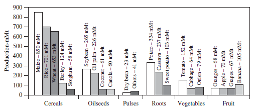
```
]

<!-- .small[Source: `r Citet(myBib,"brown2014plant")`] -->

---

- `r Citet(myBib,"brown2014plant")`, Page 26; Graph of total world crop production and total world crop production per capita (Since 1955 to 2011)
- It is plant breeders and their stories who explain the dramatic gap between the thin white roots of wild carrot and the plump orange ones on the supermarket shelf.
- Many people in the world still find feeding on a diverse diet of crops and meat or fish a rare luxury, and suffer malnutrition as a result. Plant breeding could potentially rescue from the situation is a powerful illustration of its importance.
- Then again, well encapsulated in chinese philosophy is an idea that once people have enough to live on and their survival is assured, they turn almost at once to the improvement of their surroundings and the creation of objects of beauty.
- Modern advances in genetic engineering bring the "designer plant" much closer, a prospect that fills some people with alarm. Or creation of entirely new horticultural species.
- With continued unraveling of the genetic code of life, the possibilities for plant breeding is becoming even greater.
- Industrial and other end-use requirements.

---
class: sydney-yellow

## Current state of science

<blockquote class="twitter-tweet"><p lang="en" dir="ltr">Potential Applications of Plant Biotechnology against SARS-CoV-2 <a href="https://t.co/6qvFYYoBtI">https://t.co/6qvFYYoBtI</a></p>&mdash; Mol. Plant Breeding (@MolecPlantBreed) <a href="https://twitter.com/MolecPlantBreed/status/1259696213961695232?ref_src=twsrc%5Etfw">May 11, 2020</a></blockquote>

---

## References

```{r, results = "asis", echo=FALSE}
PrintBibliography(myBib)
```

---
class: sydney-blue
background-size: 260px
background-position: 5% 95%
<!-- background-image: url(path/to/image) -->

# Thank you!

.pull-right[.pull-down[

<a href="mailto:ddhakal.rookie@gmail.com">
.white[`r icon::fa("paper-plane")` ddhakal.rookie@gmail.com]
</a>

<a href="http://rookie.rbind.io/">
.white[`r icon::fa("link")` rookie.rbind.io/]
</a>

<a href="http://twitter.com/dd_rookie">
.white[`r icon::fa("twitter")` @dd_rookie]
</a>

<a href="http://github.com/deependrad">
.white[`r icon::fa("github")` @deependrad]
</a>

<br><br><br>

]]

<!-- ```{r convert-to-pdf} -->
<!-- # install webshot and phantom_js -->
<!-- # install.packages("webshot") -->
<!-- # webshot::install_phantomjs() -->
<!-- library(webshot) -->
<!-- webshot(paste0("file://", normalizePath("01-introduction_to_plant_breeding_html.html")),  -->
<!--         "introduction.pdf", delay = 5) -->
<!-- ``` -->

