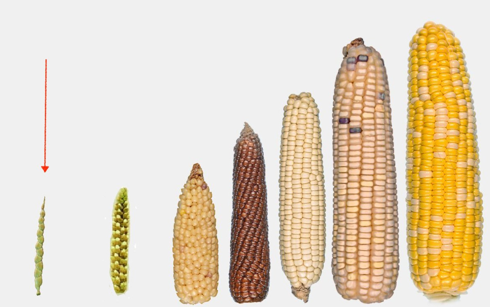
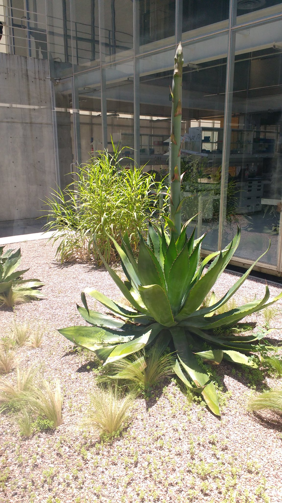
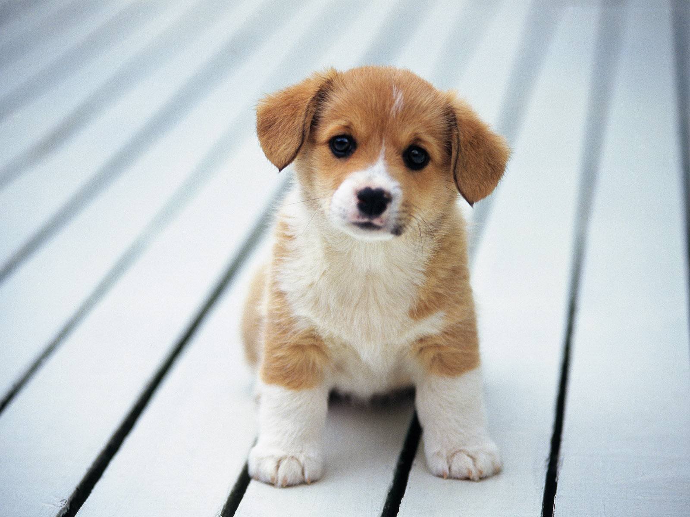
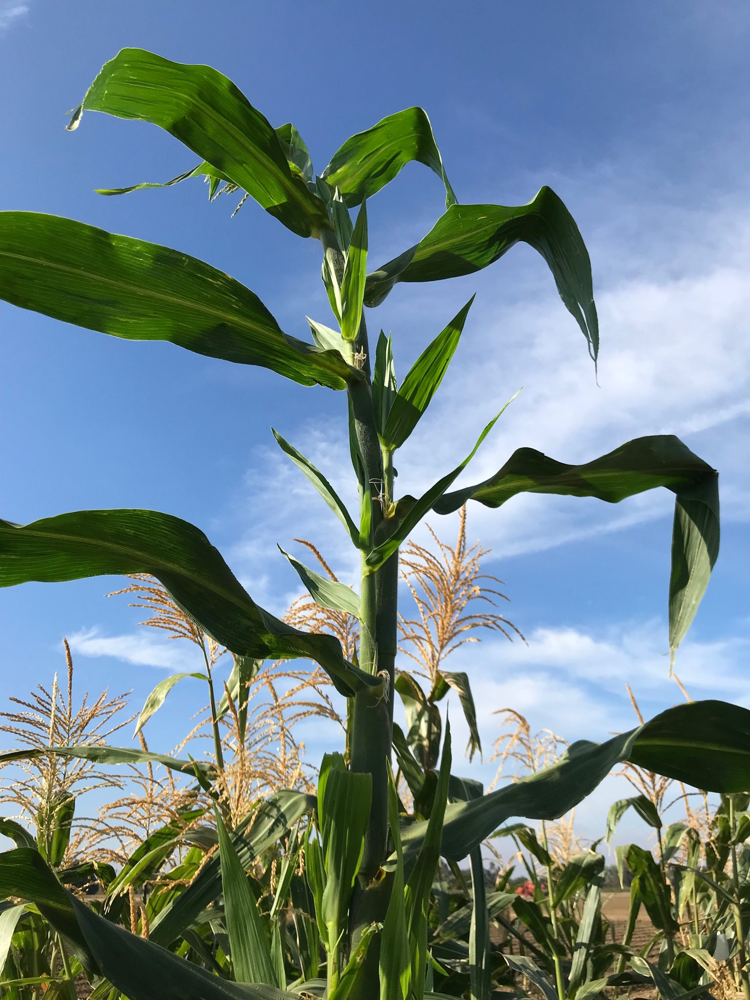
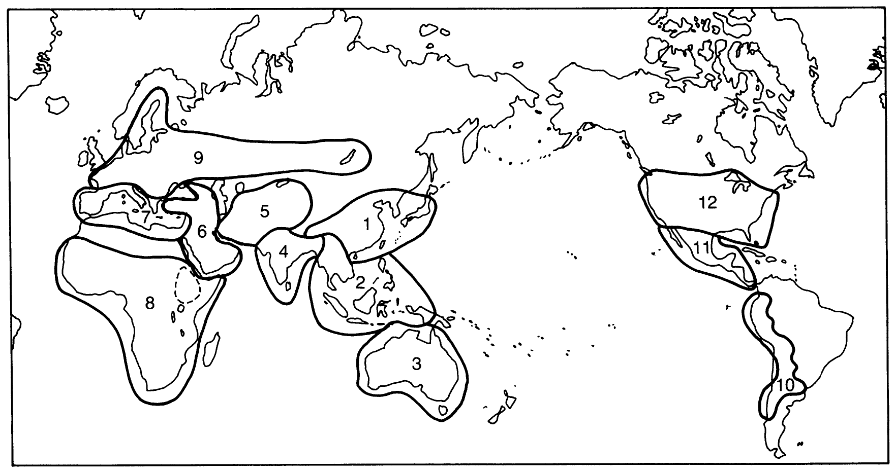

```{r setup, include=FALSE}
options(htmltools.dir.version = FALSE)
options(knitr.kable.NA = "", digits = 3)
knitr::opts_chunk$set(tidy = FALSE, echo = FALSE)
```

background-image: url('./images/maize_breeding.jpg')
background-size: 80% 80%
class: inverse, center, middle
# Domestication

<!-- ```{r maize-domestication, fig.cap="Evolutionary history of maize", fig.height=3, fig.align='center'} -->
<!--  -->
<!-- ``` -->

---
# What is a weed? 

- "A plant in the wrong place" 
- How accurate is the definition ?
- We define weeds as plants we do not want that compete for resources with those we do want. 
- Clearly we have criteria about which plants we want and those that fail those criteria. 
- In evolutionary terms, it is the cultivated plants that are "fitter" than the weeds, as they have characteristics which we want, and since in the fi eld and the garden we have largely substituted ourselves for nature, and here it is us who control the evolutionary process.
- However, many commercially grown plants survive as volunteer weeds, or "escapes", in either the same, or different, regions to those in which they are most commonly grown commercially.

.center[
"The gap between the wild and the cultivated is all about the difference between nature's requirements and ours." 

[@kingsbury2009hybrid]
]

---

```{r weed-vs-crop, fig.cap="Perennial teosinte", out.height="600px", fig.align='center', out.width="auto"}
# fig.height=3

```

---

# Domestication (Definition)
.center[
"a plant population has been domesticated when it has been substantially altered from the wild state and certainly when it has been so altered to be unable to survive in the wild"

N.W. Simmonds
]

- Domestication is the process by which genetic changes (shifts) in wild plants are brought about through a selection process imposed by humans. 

---

- Because of the roles of humans, the process results characteristics that are beneficial to humans but some that would be disadvantageous for plants in their natural habitats.
- Results are the plants that are adapted to supervised cultural conditions and which posses characteristics that are preferred by producers and consumers. 
- E.g. Modern corn stripped is completely  of its seed dispersal ability.
- *Domesticators*
- Both wild and domesticated populations are subject to evolution
- Forces of selection determine what will be domesticated and that which will continue in wild
	- The natural selection favours plant phenotypes which have the greatest chance of survival, reproduction, and distribution of progeny.
	- Human selection is the result of conscious decisions by a farmer or plant breeder to keep the progeny of a particular parent and discard others.

---

# Domestication syndrome (Changes in plant species under domestication)

.small[
```{r eval=require('DT'), tidy=FALSE}
domestication_syndrome <- readxl::read_xlsx("./data/02-domestication_plant_introduction_and_acclimatization.xlsx", 
                                            sheet = "domestication_syndrome")
DT::datatable(
  domestication_syndrome,
  fillContainer = FALSE, options = list(pageLength = 6)
) %>% 
  DT::formatStyle(columns = 1:2, fontSize = "65%")
```
]
---

class: center, bottom, inverse

# Wild versus domestication traits

---
.pull-left[
```{r domesticated, fig.cap="Domesticated dog", fig.show='hold', out.height="400px", out.width="auto"}

```
]

.pull-right[
```{r wild, fig.cap="Wild dog", fig.show='hold', out.width="auto", out.height="400px"}
knitr::include_graphics("./images/wild_dog_african.jpg")
```
]
---

```{r wild-vs-domesticated-tomato, fig.cap="Wild versus domesticated tomatoes", fig.show='hold'}
# pdftools::pdf_convert("./references_plb/Biodiversity in Agriculture_ Domestication, Evolution, and Sustainability.pdf", format = "png", pages = 109, filenames = "./images/tomato_wild_domestic.png", dpi = 300)

knitr::include_graphics("./images/tomato_wild_domestic.png")
```

---

# Wild verus domestication traits (context)

- Wild cereal plants tend to have many small seeds at maturity and disperse their seed by shattering. These seeds also are likely to be attached to a strong awn to aid dispersal. 

- Similarly, wild potato species produce many small tubers, have their tubers develop at the end of very long stolons (so that daughter plants do not have to occupy ground too close to the parent), and many have tubers with high levels of toxin, which discourage animals from eating them.

- Breeders have developed cereal cultivars which have fewer, but larger seeds, that do not shatter their seeds at maturity and that have a non-persistent awn. 

---

- Similarly potato breeders have selected plants with fewer, but larger tubers, shorter stolons and with reduced levels of toxins in the tuber. 

- Human selection also has produced crops that are more uniform in the expression of many of their characteristics. For example, they have selected seeds that all mature at the same time, with uniform germination, and fruits with uniform fruit size and shape. 

- In more recent times plant breeders' selection has tended to result in shorter plants, greater harvest index, and increased ease of harvest (especially mechanized).

---

# Evolution

- The process by which new species are formed from preexisting species over a period of time.

- Previously, plant breeding and evolution were considered similar processes, considering that both involve creation of variation and selection among the variability.
  - Either by human or naturally
  - Mechanisms of change are similar for both (Mutation, selection, hybridization and polyploidization)

- Key difference is on the duration of process.

---

```{r, fig.align='center', fig.cap="Teosinte maize hybrid", out.height="600px", out.width="auto"}


```

---

# Germplasm

- Germplasm refers to the genetic material that can be used to perpetuate a species or population

- Germplasm provides the material used to initiate a breeding program

- Sometimes only germplasm screening and evaluation is practiced for introduction of improved variety in a region

- Certain institutional sets-ups such as gene banks are charged with the responsibility of assembling, cataloguing, storing and managing large number of germplasm. This allows for quick retrieval.

---

# Gene pool

J.R. Harlan and J.M.J. de Wet proposed a categorization of gene pools of cultivated crops according to the feasibility of gene transfer or gene flow from those species to the crop species.

```{r gene-pools, fig.cap="Crop gene pools; A system proposed by Harlan", out.width="auto", out.width="600px"}
# pdftools::pdf_convert("./references_plb/George Acquaah(auth.) - Principles of Plant Genetics and Breeding, Second Edition-Wiley-Blackwell (2012).pdf", format = "png", pages = 211, filenames = "./images/crop_gene_pools.png", dpi = 300)
knitr::include_graphics("./images/crop_gene_pools.png")
```

---

# Types of gene pool

- *Primary gene pool (GP1)* 
  - GP1 consists of biological species that can be intercrossed easily (interfertile) without any problems with fertility of the progeny. That is, there is no restriction to gene exchange between members of the group. This group may contain both cultivated and wild progenitors of the species.

- *Secondary gene pool (GP2)* 
  - Members of this gene pool include both cultivated and wild relatives of the crop species. They are more distantly related and have crossability problems. Nonetheless, crossing produces hybrids and derivatives that are sufficiently fertile to allow gene flow. GP2 species can cross with those in GP1, with some fertility of the F1, but more difficulty with success.

---

- *Tertiary gene pool (GP3)*
  - GP3 involves the outer limits of potential genetic resources. Gene transfer by hybridization between GP1 and GP3 is very problematic, resulting in lethality, sterility, and other abnormalities. To exploit germplasm from distant relatives, tools such as embryo rescue and bridge crossing may be used to nurture an embryo from a wide cross to a full plant and to obtain fertile plants.

---

# Domestication and origin of major crop species

.small[
```{r eval=require('DT'), tidy=FALSE}
domestication_origin <- readxl::read_xlsx("./data/02-domestication_plant_introduction_and_acclimatization.xlsx", sheet = "center_origin", skip=2)

DT::datatable(
  domestication_origin,
  fillContainer = FALSE, caption = "Estimated time of domestication and centre of origin of major crop species; @brown2014plant, Page 23", 
  options = list(pageLength = 5, 
                 initComplete = JS("
                        function(settings, json) {
                          $(this.api().table().header()).css({
                          'font-size': '12px',
                          });
                        }
                    "))
) %>% 
  DT::formatStyle(columns = 1:4, fontSize = "65%")

```
]

---

# Megacentres of cutivated plants

```{r cultivated-megacentres, fig.cap="Megacentres of cultivated plants (Zeven and Zhukovsky, 1975); @hayward2012plant, Page 37", out.width="auto", out.height="400px"}
# pdftools::pdf_convert("./references_plb/E. S?nchez-Monge (auth.), M. D. Hayward, N. O. Bosemark, I. Romagosa, M. Cerezo (eds.) - Plant Breeding_ Principles and prospects.pdf", format = "png", pages = 53, filenames = "./images/megacentres_cultivated.png", dpi = 300)

```

---

# Megacentres of cultivated plants

.small[
```{r eval=require('DT'), tidy=FALSE}
megacentres <- readxl::read_xlsx("./data/02-domestication_plant_introduction_and_acclimatization.xlsx", sheet = "diversity_region", skip=2)

DT::datatable(
  megacentres,
  fillContainer = FALSE, caption = "Cultivated plants and their regions of diversity. Based on Zeven and Zhukovsky (1975) and Zeven
and de Wet (1982); @hayward2012plant, Page 54, 55.
", options = list(pageLength = 6)
) %>% 
  DT::formatStyle(columns = 1:3, fontSize = "65%")
```
]

---

# Plant introduction

- The plant breeder may import new, unadapted genotypes from outside the production region, usually from another country (called plant introductions). These new materials may be evaluated and adapted to new production regions as new cultivars, or used as parents for crossing in breeding projects.

- Primary Introduction
  - When the introduced variety is well adapted to the new environment, it is released for commercial cultivating without any alteration in the original genotype; this constitutes primary introduction. It is less common, particularly in countries having well organized crop improvement programmes.

- Secondary introduction
  - The introduced variety may be subject to selection in order to isolate a superior variety. Alternatively, it may be hybridized with local varieties to transfer one or few characters from these varieties to the local ones. Such introduction constitutes secondary introduction. It is much common than primary introduction.

---

# Purpose of plant introduction

1. To obtain entirely new crop species
2. To serve as new varieties
3. For use in crop improvement programmes
4. To introgress variability to existing genetic materials
5. For scientific studies
6. To augment aesthetics
7. For germplasm collection and comparison

---

# Acclimatization

- Acclimatization is the reversible process by which an individual becomes adapted to a change in the environment, often involving temperature, moisture, food, often relating to seasonal climate changes. The process that leads to the adaptation of a variety, line or population to a new environment is known as acclimatization. Acclimatization is characterized by a faster multiplication of those genotypes -- adaptive fitness -- (present in the original population) that are better adapted to the new environment.

- Factors affecting extent of acclimatization:
  1. Mode of pollination
  2. The magnitude of genetic variability present in the original population
  3. The duration of life cycle of the crop
  4. Tendency to acquire and augment mutation
  5. Nature and intensity of environmental stresses

---

# Other steps in plant breeding

## Collection

## Conservation

## Utilization

---

# The Vavilov Concept

- Nikolai I. Vavilov (1887-1942), the Russian botanist and plant breeder, demonstrated the existence of 'centres of origin' of cultivated plants (more correctly named today as 'centres of diversity'), in which can be found the highest level of genetic variability of a species. This variability, which arises in nature by mutation spontaneous hybridization, introgression and changes in chromosome form and number, provides the means by which adaptation to heterogenous environments can occur.

- It allows the breeder to identify sources of variation for specific characteristics. The extension of this principle to related species was formulated by Vavilov in his 'law of homologous series of variation'. This law allows the prediction of the appearance of a given type of mutation in a plant species when such a type has been found in another species phylogenetically related to the first. As a result of his studies Vavilov defined plant breeding as 'plant evolution directed by man'. He recognized that in a breeding programme, by growing variable populations in conditions favouring the expression of the characters, selection may be facilitated. Also, by creating variability in a parallel way to nature the breeder exploits genetical methods. Plant breeding can thus also be defined as 'applied plant genetics'.
