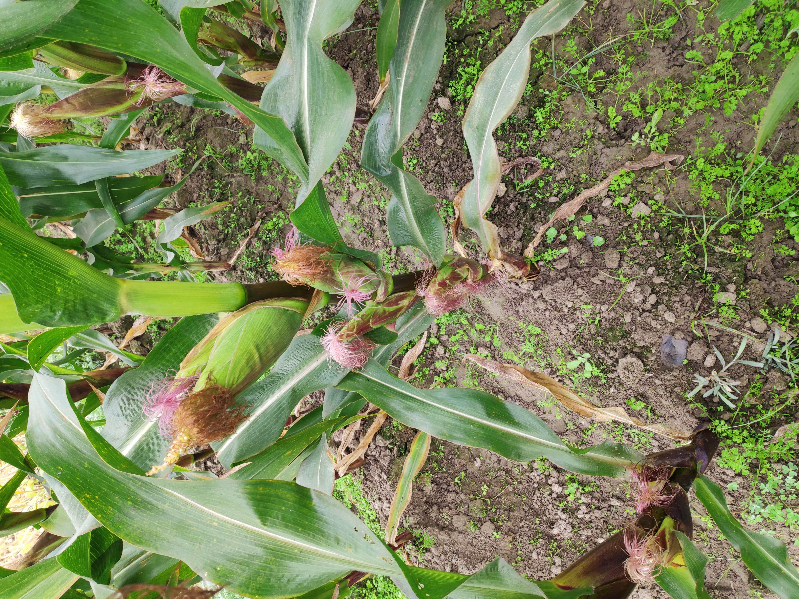
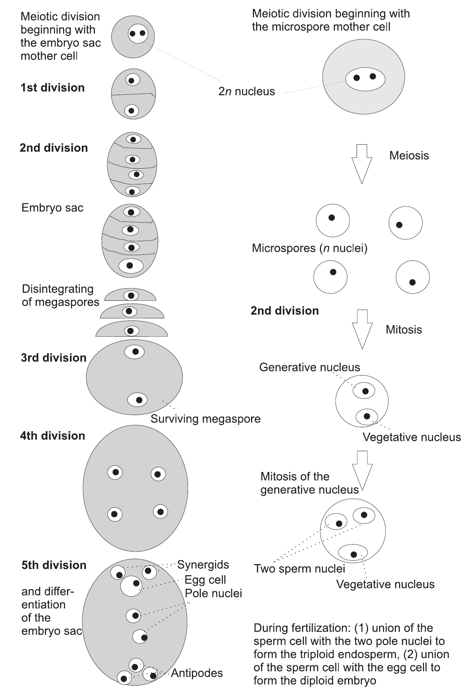
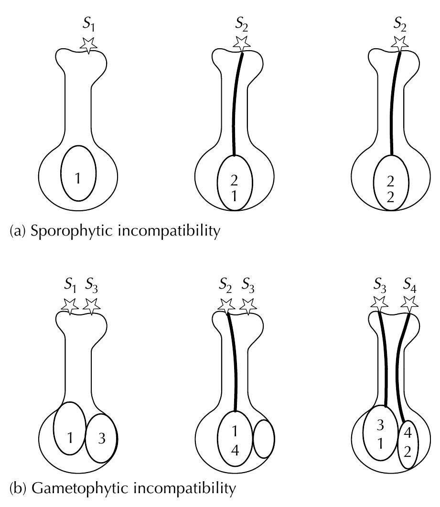
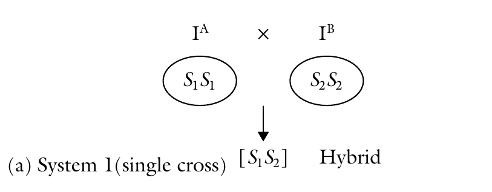
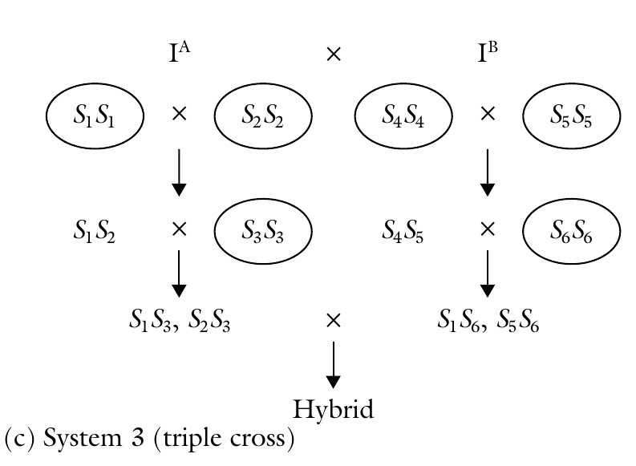
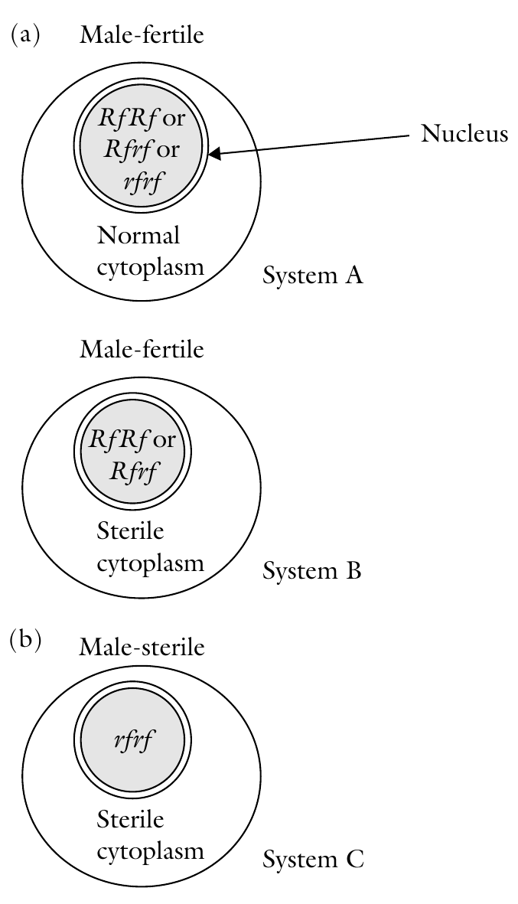
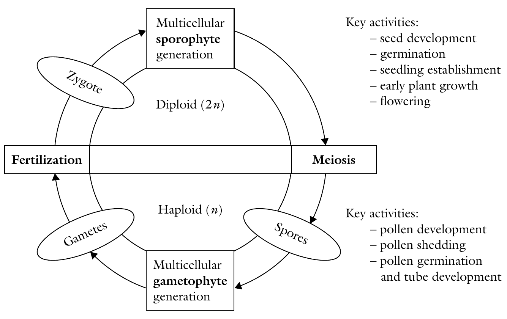
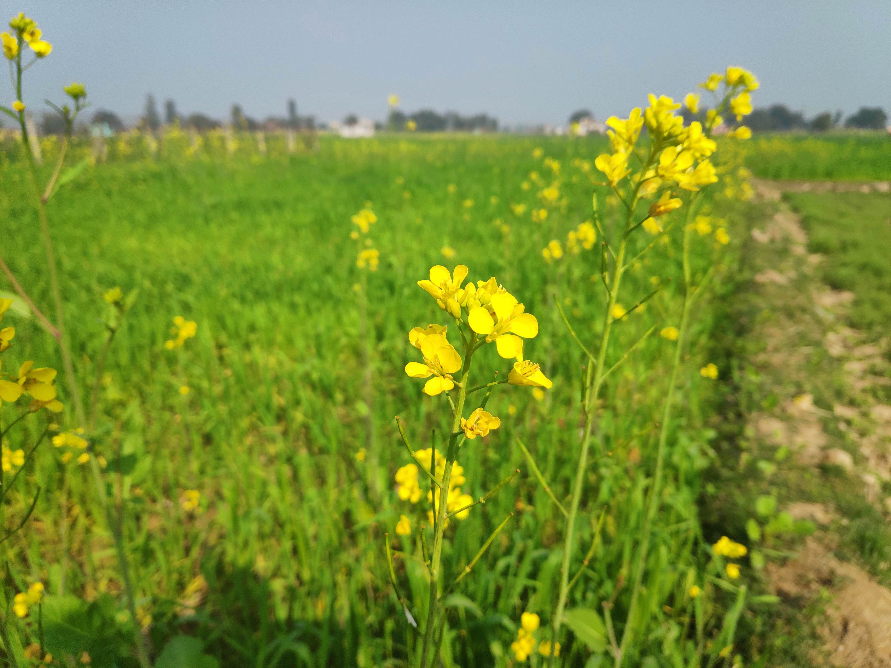

```{r setup, include=FALSE}
options(htmltools.dir.version = FALSE)
options(knitr.kable.NA = "", digits = 3)
knitr::opts_chunk$set(tidy = FALSE, echo = FALSE)
```

```{r maize, fig.cap="Inbred line of maize", fig.align='center', out.height="400px", out.width="auto"}

```

---
class: inverse, center, middle

# Modes of reproduction

---
# Sexual reproduction

- Involves fusion of male and female gametes 
- Gametes may be derived either from two different parents or from a single parent.
- Sexual reproduction is reliant on the process of meiosis. Involves
  - Megaspores within the ovule of the pistil
  - Microspores within the stamen
- Typical meiotic division of a female diploid species will result in formation of four haploid megaspores (*Megasporogenesis*).
- With analogy: *Microsporogenesis*
- Hence fertilization involves fusion of haploid male gamete with haploid female gamete
- Male gametophyte generation is a tiny pollen tube and three haploid nuclei (*microgametophyte*)
- Female gametophyte is a single multinucleated cell, also called the embryo sac (*megagametophyte*, aka embryo sac).

---

```{r plant-fertilization, fig.cap="Fertilization in plants", out.height="600px", fig.align='center', out.width="auto"}
# pdftools::pdf_convert("./../../references_plb/Rolf H. J. Schlegel - Encyclopedic Dictionary of Plant Breeding and Related Subjects-The Food Products Press (2003).pdf", pages = 563, format = "png", filenames = "./images/fertilization_in_self_pollinated_species.png", dpi = 300)
knitr::include_graphics("./images/fertilization_in_self_pollinated_species.png")
```

---

```{r sporogenesis, fig.cap="Embryo sac and pollen formation", out.height="600px", out.width="auto", fig.align='center'}
# pdftools::pdf_convert("./../../references_plb/Rolf H. J. Schlegel - Encyclopedic Dictionary of Plant Breeding and Related Subjects-The Food Products Press (2003).pdf", pages = 554, format = "png", filenames = "./images/sporogenesis.png", dpi = 300)

```

---

# Autogamy/Self-pollination

- Mechanisms that promote autogamy
  - Cleistogamy (flower fails to open)/Chasmogamy (opening of flower after pollination)
  - Proximity of anther

- Mechanisms that prevent autogamy
  - Self incompatibility, male sterility and dichogamy

---

# Self incompatibility (lack of self-fruitfulness)

- A condition in which the pollen from a flower is not receptive on the stigma of the same flower, and hence incapable of setting seed. 
- Both pollen and ovule development are normal and viable. 
- It is caused by a genetically controlled physiological hindrance to self-fertilization. 
- Self incompatibility is widespread in nature, occurring in families such as Poaceae, Cruciferae, Compositae, and Rosaceae.
- The incompatibility reaction is genetically conditioned by a locus designated *S*, with multiple alleles that can number over 100 in some species such as *Trifolium pretense*. 
- Unlike monoecy and dioecy, all plants produce seed in self-incompatible species.

---
class: inverse, center, middle

# Systems of SI

---

# Heteromorphic
- Caused by heterostyly
- Pin (long styles and short anthers) and thrum (long anthers and short styles; e.g., primula)
- Pin conditioned by genotype ss, and thrum by Ss.
- Cross ss x ss as well as Ss x Ss is incompatible
- But ss x Ss or SS x ss is compatible
- The condition is called distyly
  
---

# Homomorphic

## Gametophytic incompatibility (originally called the oppositional factor system)

- The ability of the pollen to function is determined by its own genotype and not the plant that produces it.
- This form of SI is more widespread (e.g. red clover, white clover and yellow sweet clover)
- Controlled by a series of alleles at a single locus ( _S1_, _S2_, _S3_ ... _Sn_ )
- The alleles of the incompatibility gene(s) act individually in the style.
- Alleles exhibit no dominance
- Incompatible pollen is inhibited in the style.
- The pistil is diploid hence contains two incompatibility alleles (e.g., _S1_ _S3_, _S3_ _S4_). Reactions occur if identical alleles in both pollen and style are encountered. Only heterozygotes for _S_ alleles are produced in this system.

---

```{r incompatibility-systems, fig.cap="Sporophytic and gametophytic SI systems; Types of self-incompatibility: (a) sporophytic and (b) gametophytic. Sporophytic incompatibility occurs in families such as Compositae and Cruciferae. It is associated with pollen grains with two generative nuclei, whereas gametophytic incompatibility is associated with pollen with one generative nucleus in the pollen tube as occurs in various kinds of clover.", out.height="400px", out.width="auto", fig.align='center'}
# pdftools::pdf_convert("./../../references_plb/Principles of Plant Genetics and Breeding.pdf", pages = 115, format = "png", filenames = "./images/incompatibility_systems.png", dpi = 300)

```

---

## Sporophytic incompatibility 

- The incompatibility characteristics of the pollen are determined by the plant (sporophyte) that produces it.
- It occurs in species such as broccoli, radish, and kale. 
- The sporophytic system differs from the gametophytic system in that the _S_ allele exhibits dominance. 
- Also, it may have individual action in both pollen and style, making this incompatibility system complex. 
- The dominance is determined by the pollen parent. 
- Incompatible pollen may be inhibited on the stigma surface. 
- For example, a plant with genotype _S1_ _S2_ where _S1_ is dominant to _S2_, will produce pollen that will function like _S1_. Furthermore, _S1_ pollen will be rejected by an _S1_ style but received by an _S2_ style. Hence, homozygotes of _S_ alleles are possible

---

# Expression of SI
  
1. The germination of the pollen may be decreased (e.g., in broccoli); Removing the stigma allows normal pollen germination.

2. Pollen germination is normal but pollen tube growth is inhibited in the style (e.g., tobacco). 

3. The incompatibility reaction occurs after fertilization (e.g., in _Gesteria_). This mechanism is rare.

---

# Implications of SI

- Presence of this system may be exploited to facilitate some breeding methods. 
- Self-incompatibility promotes heterozygosity. Consequently, selfing self-incompatible plants can create significant variability from which a breeder can select superior recombinants.
- Overcoming:
  - Removal of the stigma surface
  - Early pollination
  - Lowering the temperature
- Self-incompatibility may be used to breed for F1 hybrids, synthetics, triploids. First, however, homozygous lines must be developed.
- Sporophytic incompatibility is widely used in breeding of cabbage and other Brassica species. 
- The single cross hybrids are more uniforms and easier to produce. 
- The top cross is commonly used. A single self-incompatible parent is used as female and is open-pollinated by a desirable cultivar as pollen source.

---

```{r si-use-sc, fig.cap="Application of self-incompatibility in practical plant breeding (A)", out.height="300px", out.width="auto", fig.align='center'}
# pdftools::pdf_convert("./../../references_plb/Principles of Plant Genetics and Breeding.pdf", pages = 118, format = "png", filenames = "./images/incompatibility_use.png", dpi = 300)

```

---

```{r si-use-dc, fig.cap="Application of self-incompatibility in practical plant breeding (B)", out.height="300px", out.width="auto", fig.align='center'}
# pdftools::pdf_convert("./../../references_plb/Principles of Plant Genetics and Breeding.pdf", pages = 118, format = "png", filenames = "./images/incompatibility_use.png", dpi = 300)
knitr::include_graphics("./images/incompatibility_use_DC.png")
```

---

```{r si-use-tc, fig.cap="Application of self-incompatibility in practical plant breeding (C)", out.height="300px", out.width="auto", fig.align='center'}
# pdftools::pdf_convert("./../../references_plb/Principles of Plant Genetics and Breeding.pdf", pages = 118, format = "png", filenames = "./images/incompatibility_use.png", dpi = 300)

```

---

# Male sterility

- Male sterility is a condition in plants whereby the anthers or pollen are non-functional. Male sterility also enforces cross-pollination.
  - as absence of or extreme scarcity of pollen, 
  - severe malformation or absence of flowers or stamens, or failure of pollen to dehisce. 
  - Similarly, it can be exploited as a tool to eliminate the need for emasculation for producing hybrid seed. 
  
---
  
# Kinds of sterility based on the origin of the abnormality

1. True male sterility - This is due to unisexual flowers that lack male sex organs (dioecy and monoecy), or bisexual flowers with abnormal or non-functional microspores (leading to pollen abortion).

2. Functional male sterility - The anthers fail to release their contents even though the pollen is fertile.

3. Induced male sterility - Plant breeders may use chemicals to induce sterility.

---
class: inverse, center, middle

# True male sterility systems

---

# Genetic male sterility

- Genetic (nuclear, genic) male sterility is widespread in plants. The gene for sterility has been found in species including barley, cotton, soybean, tomato, potato, and lima bean. 
- It is believed that nearly all diploid and polyploidy plant species have at least one male sterility locus.
- May be manifested as pollen abortion (pistillody) or abnormal anther development.
- Genetic male sterility is often conditioned by a single recessive nuclear gene, _ms_, the dominant allele, _Ms_, conditioning normal anther and pollen development. 
- In alfalfa, however, two independently inherited genes have been reported
- The expression of the gene may vary with the environment. But to be useful, the system must be stable

---

## Maintainance of GMS system

- The breeder cannot produce and maintain a pure population of male sterile plants. 
- The genetically male sterile types ( _msms_) can be propagated by crossing them with a heterozygous pollen source ( _Msms_).
  - What is the result of cross ?
- Breeders will always harvest 50% male sterile plants by harvesting only the male sterile plants.
- How to identify sterile from non sterile ? 
  - Bright green hypocotyls in broccoli, leaf shape of potato and green stem in tomato

---

```{r gms-use, fig.cap="Genetic male sterility as used in practical breeding", out.height="400px", out.width="auto", fig.align='center'}
# pdftools::pdf_convert("./../../references_plb/Principles of Plant Genetics and Breeding.pdf", pages = 118, format = "png", filenames = "./images/gms_use.png", dpi = 300)
knitr::include_graphics("./images/gms_use.png")
```

---

# Cytoplasmic male sterility

- Sometimes, male sterility is controlled by the cytoplasm (mitochondrial gene) but may be influenced by nuclear genes. 
- A cytoplasm without sterility genes is described as normal (N) cytoplasm, while a cytoplasm that causes male sterility is called a sterile ( _s_) cytoplasm or said to have cytoplasmic male sterility (CMS).
- Transmitted through the egg only (maternal factor).
- Has been found in species including corn, sorghum, sugar beet, carrot, and flax. 
- The condition has been induced in species such as sorghum by transferring nuclear chromosomes into a foreign cytoplasm. 
- Has real advantages in breeding ornamental species because all the offspring is male sterile, hence allowing them to remain fruitless.

---

# Cytoplasmic male sterility (...continued)

```{r cms-use, fig.cap="Cytoplasmic male sterility as applied in plant breeding (N, normal cytoplasm; s, sterile cytoplasm).", out.height="250px", out.width="auto", fig.align='center'}
# pdftools::pdf_convert("./../../references_plb/Plant Breeding, 2nd Edition (2014).pdf", pages = 76, format = "png", filenames = "./images/cms_use.png", dpi = 300)
knitr::include_graphics("./images/cms_use.png")
```

---

# Cytoplasmic male sterility (...continued)

- Hybrid seed production using CMS requires three types of genotypes;   - male fertile lines (called *B* lines; maintained by selfing) with no cytoplasmic male sterility genes and which are homozygous for a dominant restorer gene (i.e. normal ( _n_) cytoplasm, _RfRf_);
  - cytoplasmic sterile female lines with male sterile cytoplasm but with no restorer genes (called *A* lines; maintained by crossing with isogeneic cytoplasmic male fertile line);
  - 'male-fertile' female lines (called *A'* lines or *A'* maintainer
lines; maintained by selfing) with normal cytoplasm and no restorer genes.

---

# Cytoplasmic-genetic male sterility

- Cytoplasmic male sterility may be modified by the presence of fertility-restoring genes in the nucleus. 
- CMS is rendered ineffective when the dominant allele for the fertility-restoring gene ( _Rf_) occurs, making the anthers able to produce normal pollen.
- CMS is transmitted only through the egg, but fertility can be restored by _Rf_ genes in the nucleus. 
- Three kinds of progeny are possible following a cross, depending on the genotype of the pollen source. 
- The resulting progenies assume that the fertility gene will be responsible for fertility restoration.

---

```{r cgms-systems, fig.cap="The three systems of cytoplasmic genetic male sterility. The three factors involved in CMS are the normal cytoplasm (N), the male sterile cytoplasm (S), and the fertility restorer (Rf, rf).", out.height="450px", out.width="auto", fig.align='center'}
# pdftools::pdf_convert("./../../references_plb/Principles of Plant Genetics and Breeding.pdf", pages = 119, format = "png", filenames = "./images/cgms_systems.png", dpi = 300)

```

---

# Dichogamy (mechanism enforcing cross pollination)

- Dichogamy is the maturing of pistils and stamens of a flower at different times.
  - Protogyny (stigma is receptive before the anther is mature to release the pollen)
  - Protandry (pollen is released from the anther before the female is receptive).

---

# Asexual reproduction
- Production of offsprings that are genetically identical to the mother plant, and plants that are produced this way are called *clones*.
- Two methods of asexual reproduction
  - Reproduction through plant parts
  - Reproduction through apomixis

---

# Reproduction through plant parts

- A *bulb* is a modified shoot consisting of a very much shortened stem enclosed by fleshy leaves (e.g. a tulip or an onion).

- A *corm* is a swollen stem base bearing buds in the axils of scale-like remains of leaves from the previous year's growth (e.g. gladiolus).

- A *cutting* is an artificially detached part of a plant used as a means of vegetative propagation.

- A *rhizome* is an underground stem with buds in the axils of reduced leaves (e.g. mint or couch grass).

- A *stolon* is a horizontally growing stem that roots at nodes (e.g. strawberry runners).

- A *tuber* is a swollen stem that grows beneath the soil surface bearing buds (e.g. potato).
---

# Reproduction by apomixis

- Asexual production of plant seeds can occur in obligate and facultative apomicts.

- In facultative apomicts most seeds are asexually produced, since sexual reproduction can occur.

- Apomixis arises by following mechanisms (based on which cells are responsible for producing an embryo)
  - Androgenesis (from the sperm nucleus of a pollen grain)
  - Apospory (from somatic ovary cells)
  - Diplospory (from 2n megaspore mother cell)
  - Parthenogenesis (Egg cell without fertilization)

- In many cases, pollination must occur (pseudogamy) if viable apomictic seeds are to be formed.
---

class: center, bottom, inverse

# Reproductive options in plants

---

## Hermaphrodity versus unisexuality

- Hermaphrodites have both male and female sexual organs, and hence may be capable of self fertilization. On the other hand, unisexuals, having one kind of sexual organ, are compelled to cross-fertilize. Each mode of reproduction has genetic consequences. Hermaphrodity promotes a reduction in genetic variability, whereas unisexuality, through cross-fertilization, promotes genetic variability.

---

## Self-pollination versus cross-pollination

- Hermaphrodites that are self-fertile may be self pollinated or cross-pollinated. In terms of pollen donation, a species may be autogamous (pollen comes from the same flower - selfing) or allogamous (pollen comes from a different flower). There are finer differences in these types. For example, there may be differences between the time of pollen shed and stigma receptivity.

## Self-fertilization versus cross-fertilization

- Just because a flower is successfully pollinated does not necessarily mean fertilization would occur. The mechanism of self-incompatibility causes some species to reject pollen from their own flowers, thereby promoting outcrossing.

---

## Sexuality versus asexuality 

- Sexually reproducing species are capable of providing seed through sexual means. Asexuality manifests in one of two ways - vegetative reproduction (in which no seed is produced) or agamospermy (in which seed is produced).

---

# Alternation of generation in flowering plants

```{r alternation-generation, fig.cap="Alternation of generations", out.height="400px", fig.align='center', out.width="auto"}
# pdftools::pdf_convert("./../../references_plb/Principles of Plant Genetics and Breeding.pdf", pages = 110, format = "png", filenames = "./images/alternation_of_generations.png", dpi = 300)

```

---
.pull-left[
```{r hybrid, fig.cap="Hybrid", fig.show='hold', out.height="400px", out.width="auto"}
knitr::include_graphics("./images/Teosinte_maize_hybrid_cross.jpg")
```
]

.pull-right[
```{r openpollinated, fig.cap="Open pollinated", fig.show='hold', out.width="auto", out.height="400px"}

```
]
---

# Types of cultivar

- Cultivar types include pure-lines, hybrids, clones, open-pollinated populations, composite-crosses, synthetics and multilines. 
- It is difficult, if not impossible to develop a pure-line cultivar of a crop species like potato ( _Solanum tuberosum_ ) as it is mainly reproduced vegetatively, and has many deleterious (or lethal) recessive alleles. 
- Similarly, pea ( _Pisum sativum_ ) is almost an obligate self-pollinator and so it would be difficult to develop hybrid pea, if nothing else seed production is likely to be expensive.

---

# Pure-line cultivars

- Pure-line cultivars are homozygous, or near-- homozygous, lines.
- Can be produced most readily in naturally self-pollinating species.
- It is generally accepted that it is normally one in which the line is homozygous for the vast majority of its loci (usually 90% or more)
- Commonly developed by inbreeding the species through continuous selfing of hybrid generated from crossing for 6-7 generations to the point where line is considered to be "commercially true breeding"
- Alternatively, doubled haploid lines may to generated

---

```{r eval=require('DT'), tidy=FALSE}
self_pollinated <- readxl::read_xlsx("./03-modes_of_reproduction_and_pollination_control.xlsx", sheet = "predominantly_self")
DT::datatable(
  self_pollinated, caption = "Commonly self pollinated crops",
  fillContainer = FALSE, options = list(pageLength = 6)
) %>% 
  DT::formatStyle(columns = colnames(.), fontSize = "20%")
```

---

# Open pollinated cultivars

- Heterogenous populations comprised of different plants which are genetically non-identical.
- Also heterozygous
- Almost exclusively from cross pollinating species
- Stable for character of interest
- E.g.: Onions, rye, herbage grass, non-hybrid sweetcorn, sugar beet and oil palm 

---

```{r, fig.align='center', fig.cap="Open pollinated crops", out.height="500px"}

knitr::include_graphics("./images/open_pollinated_onion.jpg")
```

---

# Hybrid

- Hybrid cultivars have different leves of homogeneity but, importantly are highly heterozygous.

- Exploits the phenomenon of heterosis 

- Variants exist:
  - Single cross
  - Double cross
  - Three way cross

- Is one of the most complex of breeding methods
  - Inbred line development
  - Test cross comparison
  - Selection and hybridization

---

# Clonal cultivars

- Clonal cultivars are genetically uniform but tend to be highly heterozygous
- Uniformity of plant types is maintained through vegetative rather than sexual reproduction.
- Cultivars are vegetatively propagated by asexual reproduction (cloning) including 
  - cuttings, 
  - tubers, 
  - bulbs, 
  - rhizomes,
  - grafts 
- A cultivar can also be classified as a clone if it is propagated through obligate apomixis (e.g. buffelgrass)
- Genetic constitution of cloned selection remains 'fixed'
- e.g.: Potatoes, Bananas, Peaches, Apples, Cassava, Sugarcane, Strawberries, Blueberries and Chrysanthemums. 
