```{r setup, include=FALSE}
options(htmltools.dir.version = FALSE)
options(knitr.kable.NA = "", digits = 3)
knitr::opts_chunk$set(tidy = FALSE, echo = FALSE)
require(tidyverse)
```

.pull-left[
```{r tomato, fig.cap="Self pollinating crop (Tomato)", fig.align='center', out.height="300px", out.width="auto"}
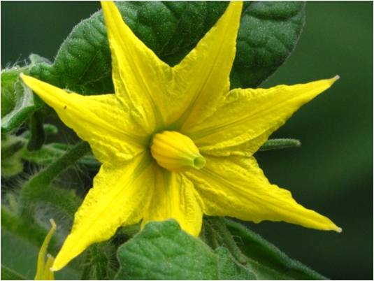
```
]

.pull-right[
```{r pea, fig.cap="Self pollinating crop (Pea)", fig.align='center', out.height="300px", out.width="auto"}
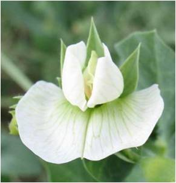
```
]
---
class: inverse, center, middle

# Breeding self pollinated crops

---

# Mass selection

- Mass selection (originally described by Danish biologist W. Johansen, 1903) is an example of selection from a biologically variable population in which differences are genetic in origin. 
- Often described as the oldest method of breeding self-pollinated plant species.
- Provided that there is sufficient genetic variation, this method of selection is applicable to both self- and cross-pollinated species.
- Common method of seed saving of best appearing plants is comparable to mass selection.
- Major objective: Population improvement by increasing gene frequencies of desirable genes.
---

# Mass selection (...continued)

```{r mass-selection, fig.cap="Mass selection in self pollinated crops", fig.align="center", out.width="auto", out.height="450px"}
# pdftools::pdf_convert("./../../references_plb/Principles of Plant Genetics and Breeding.pdf", pages = 315, format = "png", filenames = "./images/mass_selection.png", dpi = 300)

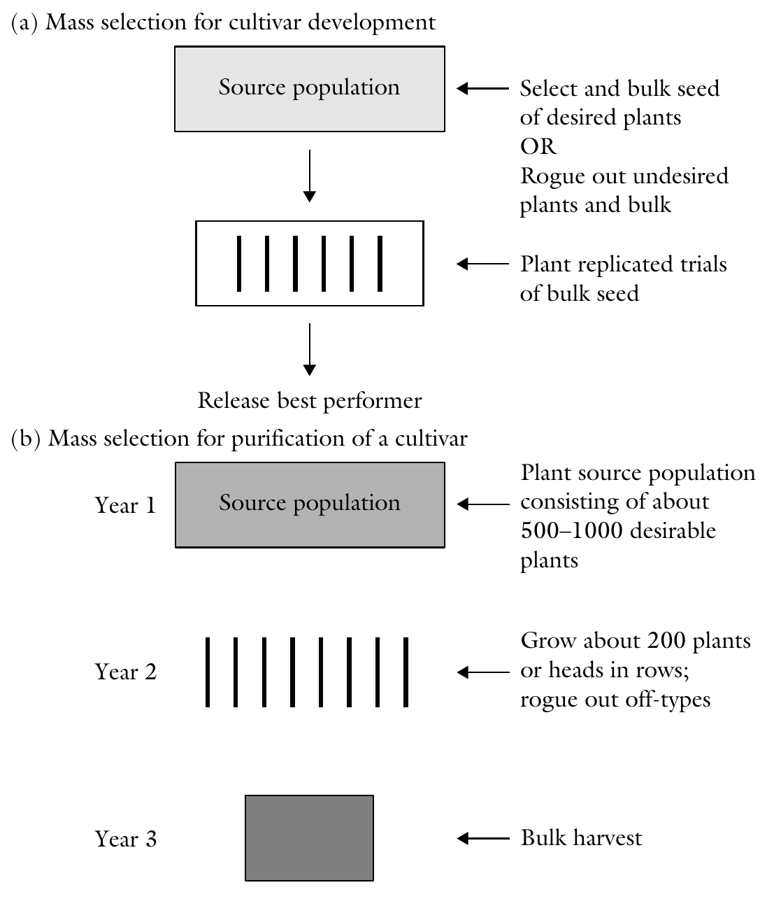
```

---

# Mass selection (...continued)

- General procedure in mass selection is to rogue out off-types or plants with undesirable traits (*Negative mass selection*). 
- The specific strategies for retaining representative individuals for the population vary according to species, traits of interest, or creativity of the breeder. 
- Rouging out and bulking appears to be the basic strategy of mass selection, some breeders may rather select and advance a large number of plants that are desirable and uniform for the trait(s) of interest (*positive mass selection*).
- Where applicable, single pods from each plant may be picked and bulked for planting. For cereal species, the heads may be picked and
bulked.

---

# Mass selection (...continued)

- The breeder plants the heterogeneous population in the field, looks for off-types to remove and discard. 
- A mechanical device (e.g., using a sieve to determine which size of grain would be advanced) may be used, or selection may be purely on visual basis according to the breeder's visual evaluation.
- Further, selection may be based on targeted traits (*direct selection*) or indirectly by selecting a trait correlated with the trait to be improved.
  - Year 1: If the objective is to purify an established cultivar, seed of selected plants may be progeny rowed to confirm the purity of the selected plants prior to bulking. This would make a cycle of mass selection have a two-year duration instead of one year. The original cultivar needs to be planted alongside for comparison.
  - Year 2: Evaluate composite seed in replicated trial, using original cultivar as check. This test may be conducted at different locations and over several years. The seed is bulk-harvested.
---

# Mass selection (...continued)

- Contamination from outcrossing may produce heterozygotes in the population. Mass selection is most effective if the expression of the trait of interest is conditioned by additive gene action.

- With Masss selection, 
  - In self-pollinated populations, the persistence of inbreeding will alter population gene frequencies by reducing heterozygosity from one generation to the next. 
  - In cross-pollinated populations, gene frequencies are expected to remain unchanged unless the selection ofplants was biased enough to change the frequency of alleles that control the trait of interest.
  
- Mass selection is based on plant phenotype. Consequently, it is most effective if the trait of interest has high heritability.

- Selection is effective when environment is uniform. For example, When selecting for disease resistance, the method is more effective if the pathogen is uniformly present throughout the field without "hot spots".

- Correlated response to selection for secondary traits.

---

# Mass selection (...continued)

## Advantages

- It is rapid, simple, and straightforward. Large populations can be handled and one generation per cycle can be used.
- It is inexpensive to conduct.
- The cultivar is phenotypically fairly uniform even though it is a mixture of pure lines.

## Disadvantages

- To be most effective, the traits of interest should have high heritability.
- Because selection is based on phenotypic values, optimal selection is achieved if it is conducted in a uniform environment.
- Phenotypic uniformity is less than in cultivars produced by pure line selection.
- With dominance, heterozygotes are indistinguishable from homozygous dominant genotypes. Without progeny testing, the selected heterozygotes will segregate in the next generation.

---

# Pure line selection

- A pure line suggests that a cultivar has identical alleles at all loci.

- The theory of the pure line was developed in 1903 by the Danish botanist Johannsen.

```{r johannsen-bean, fig.cap="The development of the pure line theory by Johannsen", fig.align="center", out.width="auto", out.height="400px"}
# pdftools::pdf_convert("./../../references_plb/Principles of Plant Genetics and Breeding.pdf", pages = 317, format = "png", filenames = "./images/johannsen_bean.png", dpi = 300)
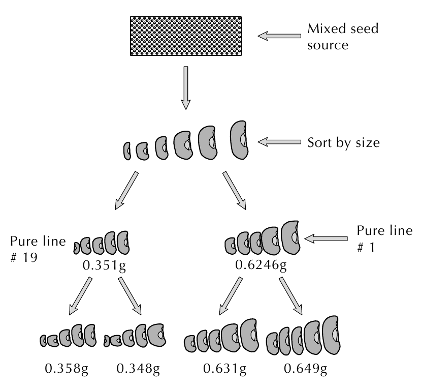
```

---

# Pure line selection (...continued)

- Johannsen demonstrated that a mixed population of self-pollinated species could be sorted out into genetically pure lines.

- These lines were subsequently non-responsive to selection within each of them . 

- Selection is a passive process, since it eliminates variation but does not create it.

## Pureline theory

- Lines that are genetically different may be successfully isolated from within a population of mixed genetic types.

- Any variation that occurs within a pure line is not heritable but due to environmental factors only. Consequently, as Johansen's bean study showed, further selection within the line is not effective.

---

# Pure line selection (...continued)

- Lines are used;
  - as cultivars or as parents in hybrid production (inbred lines).
  - in the development of genetic stock (containing specific genes such as disease resistance, nutritional quality) and synthetic and multiline cultivars.
- Line cultivars have a very narrow genetic base and tend to be uniform in traits of interest (e.g., height, maturity).

---

## Application

- Cultivars for mechanized production that must meet a certain specification for uniform operation by farm machines (e.g., uniform maturity, uniform height for uniform location of economic part).
- Cultivars developed for a discriminating market that puts a premium on eye-appeal (e.g., uniform shape, size).
- Cultivars for the processing market (e.g., with demand for certain canning qualities, texture).
- Advancing "sports" that appear in a population (e.g., a mutant flower for ornamental use).
- Improving newly domesticated crops that have some variability.
- The pure-line selection method is also an integral part of other breeding method,s such as the pedigree selection and bulk population selection.

---

## Overview

- The pure-line selection in breeding entails repeated cycles of selfing following the initial selection from a mixture of homozygous lines. 
- Natural populations of self-pollinated species consist of mixtures of homozygous lines with transient heterozygosity originating from mutations and outcrossing.
- Steps:
  - Year 1: The first step is to obtain a variable base population (e.g., introductions, segregating populations from crosses, land race) and space plant it in the first year, select, and harvest desirable individuals.
  - Year 2: Grow progeny rows of selected plants. Rogue out any variants. Harvest selected progenies individually. These are experimental strains.
  - Year 3-6: Conduct preliminary yield trials of the experimental strains including appropriate check cultivars.
  - Year 7-10: Conduct advanced yield trials at multilocations. Release highest yielding line as new cultivar.

---

```{r pureline-selection, fig.cap="Generalized steps in breeding by pure-line selection", fig.align="center", out.width="auto", out.height="550px"}
# pdftools::pdf_convert("./../../references_plb/Principles of Plant Genetics and Breeding.pdf", pages = 318, format = "png", filenames = "./images/pureline_selection.png", dpi = 300)
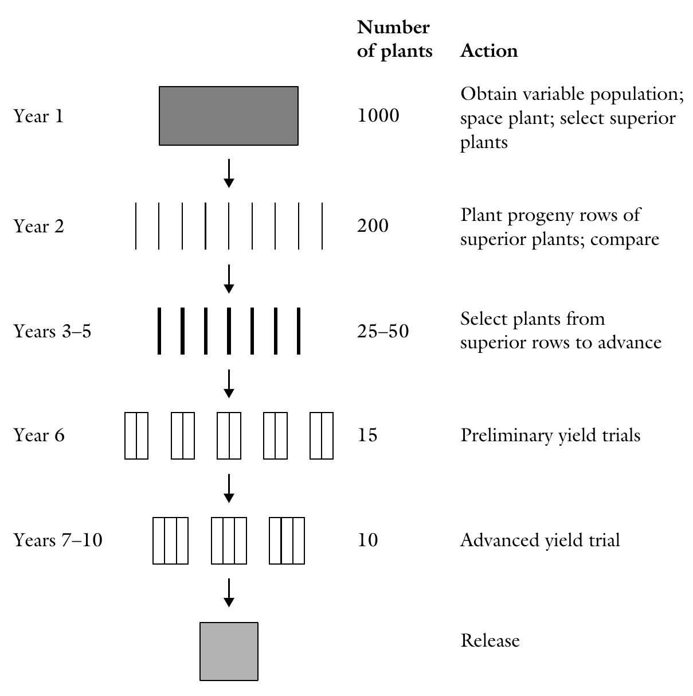
```

---

# Genetic issues (...Pureline selection)

- Pure-line breeding produces cultivars with a narrow genetic base and, hence, that are less likely to produce stable yields over a wider range of environments. Such cultivars are more prone to being wiped out by pathogenic outbreaks.
- Pure-line cultivars depend primarily on phenotypic plasticity for production response and stability across environments.

## Advantages
- It is a rapid breeding method.
- The method is inexpensive to conduct. The base population can be a landrace. The population size selected is variable and can be small or large, depending on the objective.
- The cultivar developed by this method has great "eye appeal" (because of the high uniformity of, e.g., harvesting time, height, etc.).

---

## Disadvantages
- The purity of the cultivar may be altered through admixture, natural crossing with other cultivars, and mutations. Such off-type plants should be rogued out to maintain cultivar purity.
- The cultivar has a narrow genetic base and, hence, is susceptible to devastation from adverse environmental factors because of uniform response.
- A new genotype is not created. Rather, improvement is limited to the isolation of the most desirable or best genotype from a mixed population.
- The method promotes genetic erosion because most superior pure lines are identified and multiplied to the exclusion of other genetic variants.
- Progeny rows takes up more resources (time, space, funds).

---
class: inverse, middle, center

# Pedigree selection

---

```{r pedigree-selection, fig.cap="Generalized steps in breeding by pedigree selection", fig.align="center", out.width="auto", out.height="550px"}
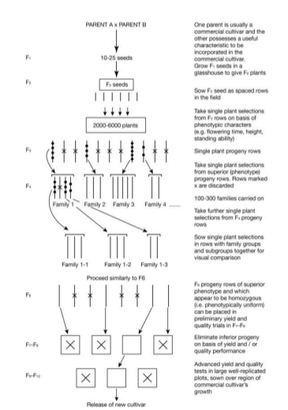
# # pdftools::pdf_convert("./../../references_plb/Principles of Plant Genetics and Breeding.pdf", pages = 327, format = "png", filenames = "./images/pedigree_selection.png", dpi = 300)
# 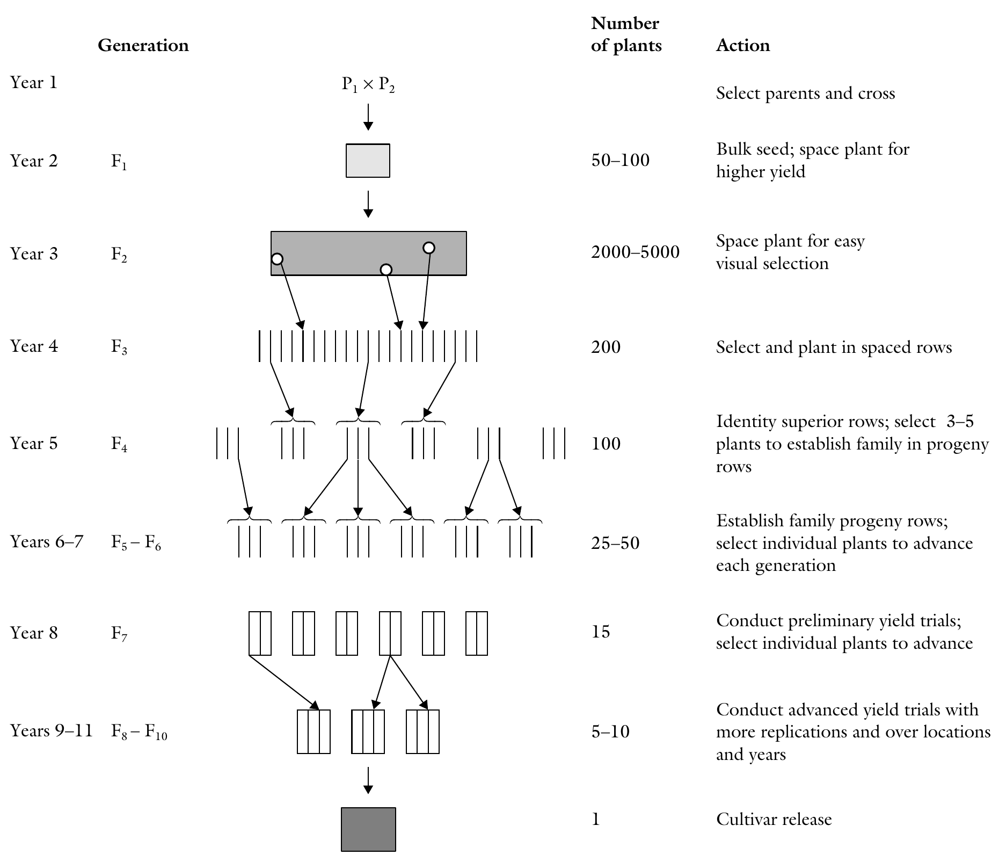

```

---

class: inverse, middle, center

# Bulk population

---

```{r bulk-selection, fig.cap="Generalized steps in breeding by bulk selection", fig.align="center", out.width="auto", out.height="550px"}
# pdftools::pdf_convert("./../../references_plb/Principles of Plant Genetics and Breeding.pdf", pages = 330, format = "png", filenames = "./images/bulk_selection.png", dpi = 300)
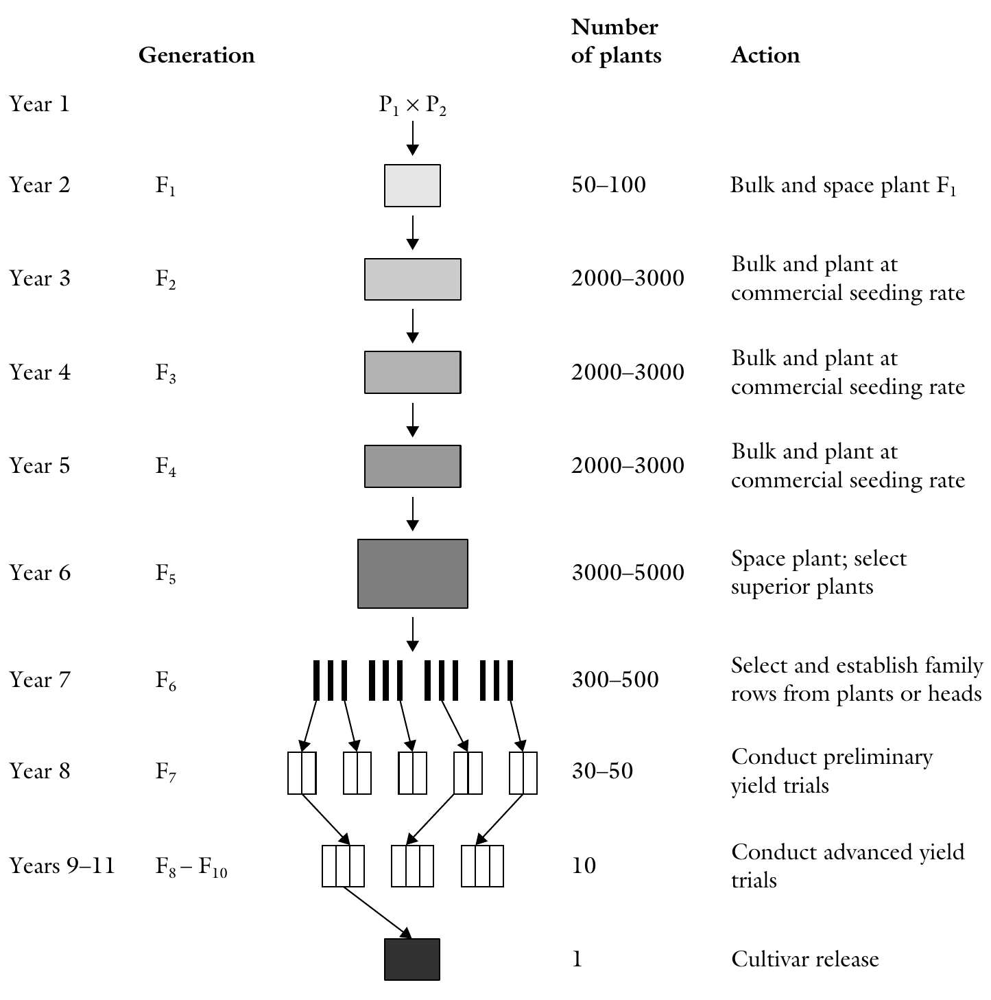
```

---

# Single seed descent

- The method of single seed descent was born out of a need to speed up the breeding program by rapidly inbreeding a population prior to beginning individual plant selection and evaluation, while reducing a loss of genotypes during the segregating generations.
- The concept was first proposed by C.H. Goulden in 1941 when he attained the F6 generation in two years by reducing the number of generations grown from a plant to one or two, while conducting multiple plantings per year, using the greenhouse and the off season.
- However, it was C.A. Brim who, in 1966, provided a formal description of the procedure of single seed descent, calling it a modified pedigree method.
- A large F1 population is generated to ensure adequate recombination among parental chromosomes.
- The method allows the breeder to advance the maximum number of F2 plants through the F5 generation. 
- This is achieved by advancing *one* randomly selected seed per plant through the early segregating stages. 
- The focus on the early stages of the procedure is on attaining homozygosity as rapidly as possible, without selection.
- Then, each plant is used to establish a family to help breeders in selection and to increase seed for subsequent yield trails.
- Discriminating among plants starts after attainment of homozygosity.

---

## Steps

- Year 1. Crossing is used to create the base population. Cross selected parents to generate adequate number of F1 for the production of a large F2 population.
- Year 2. About 50-100 F1 plants are grown in a greenhouse ground bench or in pots. They may also be grown in the field. Harvest identical F1 crosses and bulk.
- Year 3. About, 2000-3000 F2 plants are grown. At maturity, a single seed per plant is harvested and bulked for planting F3. Subsequently, F2 is spaced enough to allow each plant to produce only a few seeds.
- Year 4-6. Single pods per plant are harvested to plant the F4. The F5 is space-planted in the field, harvesting seed from only superior plants to grow progeny rows in the F6 generation.
- Year 7. Superior rows are harvested to grow preliminary yield trails in the F7
- Year 8 and later. Yield trials are conducted in the F8 to F10 generations. The most superior line is increased in the F11 and F12 as a new cultivar.

---

## Comments

- If the sample is too small, superior genetic combinations may be lost because only one seed from each plant is used.

- It may be advantageous to use progeny rows prior to yield testing to produce sufficient seed as well as to help in selecting superior families.

- The breeder may choose to impose some artificial selection pressure by excluding undesirable plants from contributing to the subsequent generations (in the early generations). This is effective for qualitative traits.

- Record keeping is minimal and so are other activities such as harvesting, especially in early generations.

---

# Backcross breeding 

- This application in plants was first proposed by H.V. Harlan and M.N. Pope in 1922. 
- The rationale of backcross breeding is to replace a specific undesirable gene with a desirable alternative, while preserving all other qualities (adaptation, productivity, etc.) of an adapted cultivar (or breeding line). 
- Instead of inbreeding the F1 as normally done, it is repeatedly crossed with the desirable parent to retrieve (by "modified inbreeding") the desirable genotype. 
- The adapted and highly desirable parent is called the *recurrent parent* in the crossing program, while the source of the desirable gene missing in the adapted parent is called the *donor parent*.
- Even though the chief role of the donor parent is to supply the missing gene, it should not be significantly deficient in other desirable traits. An inferior recurrent parent will still be inferior after the gene transfer.

---
class: inverse, middle, center

## Comparison of backcross breeding types

```{r backcross-transfer-comparison, fig.cap="Backcross breeding methods", fig.align='center', out.width="auto", out.height="550px"}
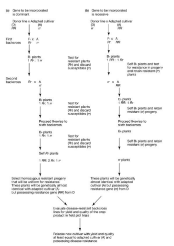
```


## Dominant gene transfer

---

```{r dominant-backcross-transfer, fig.cap="Generalized steps in breeding a dominant trait by the backcross method.", fig.align="center", out.width="auto", out.height="550px"}
# pdftools::pdf_convert("./../../references_plb/Principles of Plant Genetics and Breeding.pdf", pages = 335, format = "png", filenames = "./images/backcross_dominant.png", dpi = 300)
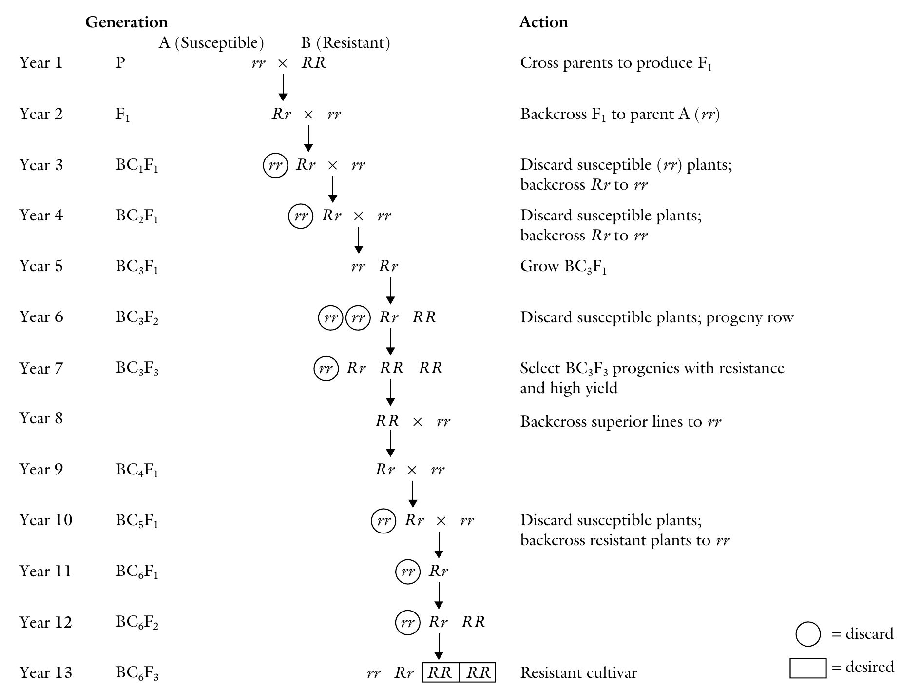
```

---
class: inverse, middle, center

## Recessive gene transfer

---

```{r recessive-backcross-transfer, fig.cap="Generalized steps in breeding a recessive trait by the backcross method.", fig.align="center", out.width="auto", out.height="550px"}
# pdftools::pdf_convert("./../../references_plb/Principles of Plant Genetics and Breeding.pdf", pages = 337, format = "png", filenames = "./images/backcross_recessive.png", dpi = 300)
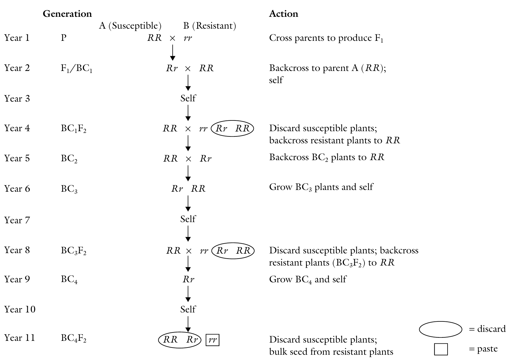
```

---

## Genetic issues

- In theory, the BC3 genotype will be 93.75% **identical to the recurrent parent**. The mathematical relationship for the recovery of the recurrent parent is presented by W. Allard is:

$$
1-\left(\frac{1}{2}\right)^{m+1}
$$

where $m$ is the number of generations of selfing or backcrosses. 

- Same relation also gives the proportion of homozygous individuals (includes both homozygous dominant and recessive individuals) in any generations of recurrent selfing. For example, for $3^{th}$ BC generation,

$$
\begin{aligned}
1-\left(\frac{1}{2}\right)^{m+1} &=& 1-\left(\frac{1}{2}\right)^{3+1} \\
~ &=& 1-\left(\frac{1}{16}\right) \\
~ &=& 0.9375
\end{aligned}
$$

---

- In another way, the proportion of the donor genes is reduced by 50% following each generation of backcrossing. This is obtained by the relationship $\left(\frac{1}{2}\right)^{m+1}$, where m is the number of crosses and backcross to the parent. For example, in the BC4, the value is $\left(\frac{1}{2}\right)^{5} = 3.125\%$. 

???

- The proportion of completely homozygotes plants for any number, n, of genes in a particular backcross generation is:

$$\left[\frac{\left(2^{m-1}\right)}{2^m}\right]^{n}$$

Where $n$ is the number of genes.

As an instance, with two gene difference between between recurrent parent (AABB) and donor parent (aabb), the BC1 (m = 1; n = 2) shall have four genptypes viz. AABB; AABb; AaBB and AaBb in equal proportion. As expected, on an average 75\% alleles of recurrent parent, at both loci individually as well as jointly, are recovered in BC1 but only 25% plants are completely homozygous for both the genes (AABB) of the recurrent parent. The 25% plants each have 3 alleles (2A, 1B and 1A and 2B) of recurrent parent while remaining 25% have only 2 alleles (AB) in common with the recurrent parent. The above formula gives the number of individuals homozygous for genes of recurrent parent because all the complete homozygotes in backcross resemble only to the recurrent parent.

---

- Because of cytoplasmic inheritance, it is sometimes critical which of the two parents is used as female.
- Linkage drag, backcrossing is more effective in breaking linkages over selfing, especially where heritability is low for the undesirable trait.
- For a given number of genes, certain number of individuals is needed for a chance to recover the desired genes in a BC program.
- When the trait is governed by a dominant gene, it is easy to identify plants carrying the desired gene. 
- When the desired trait is conditioned by a recessive gene, an additional step is needed after each backcross to produce an F2 generation in order to identify the recessive trait.

---

## Genetic advance in BC breeding depends on

- Heritability of the trait
- Sustainable intensity of trait expression
- Availability of selection aids
- Number of backcrosses of marker

---

## Congruency backcross

- It is a modification of the standard backcross procedure whereby multiple backcrosses, alternating between the two parents in the cross (instead of restricted to the recurrent parent), are used. 
- The technique has been used to overcome the interspecific hybridization barrier of hybrid sterility, genotypic incompatibility, and embryo abortion that occurs in simple interspecific crosses.

---

## Some inquiries about backcross breeding method (dominant gene)

1. Why selection is not done on generations prior to $BC_3$ ?
- Because recurrent parents genotype will not have been adequately fixed or introgressed and selection may not effectively discriminate useful (high yield, adapted) genotypes.

2. Why selection for lines in BC breeding not be delayed after $BC_3$ or further?
- Because adequate material will have been achieved and progressing to lower generations without selecting  will add to the cost of maintaining large amount of germplasm.

3. Why selection should be preceded by progeny testing ?
- In Self pollinated species, population structure promotes highly homozygous individuals. So without progeny testing, selecting for heterozygous individuals will not reflect true population structure. Selection is best carried out in homozygous individuals.

---

4. Why not backcross in $5^{th}$ year (again) ?
- Because progeny testing should be done here to enable selection as early as possible.

5. Why "RR x rr" cross of $8^{th}$ year is called backcross ?
- Normally heterozygote when crossed with either parent is called backcross. In $8^{th}$ generation, "RR" is crossed to the recurrent parent. Note, however, that "RR" is not fully homozygous for all other loci.
