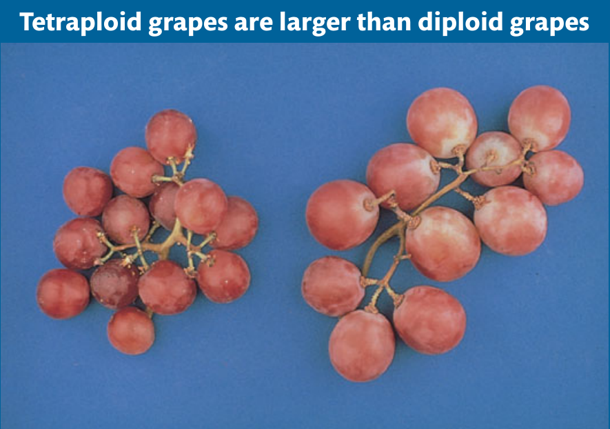
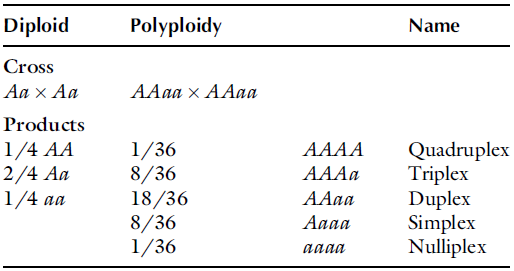
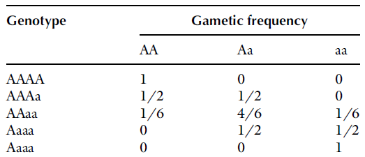
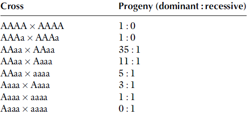
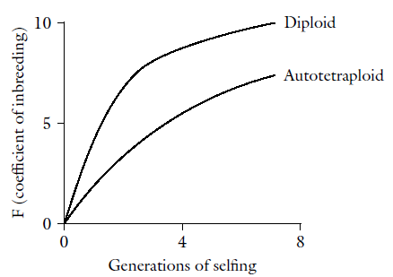
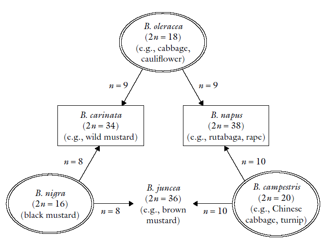
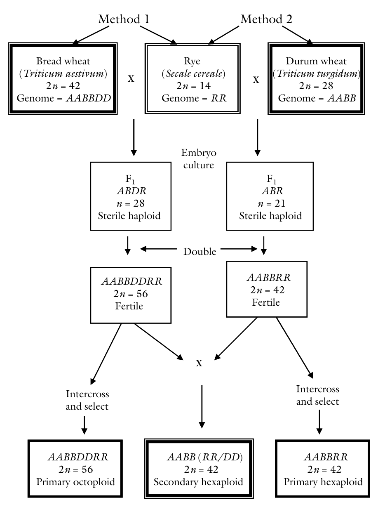
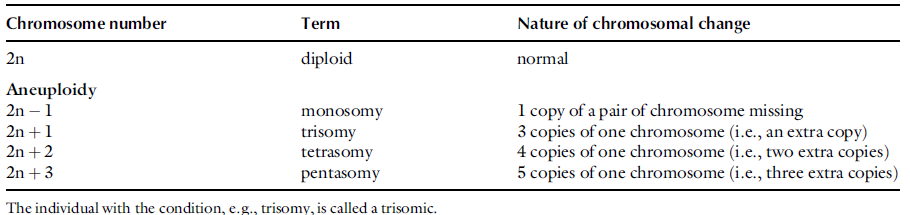

```{r setup, include=FALSE}
options(htmltools.dir.version = FALSE)
options(knitr.kable.NA = "", digits = 3)
knitr::opts_chunk$set(tidy = FALSE, echo = FALSE)
require(tidyverse)
```

# Introduction

- Ploidy refers to the number of copies of the entire chromosome set in a cell of an individual.
- The complete chromosome set is characteristic of, or basic to, a species.
- A set of chromosomes (the genome) is designated by “x”. Furthermore, the basic set is called the monoploid set. 
- The haploid number (n) is the number of chromosomes that occurs in gametes.
- A diploid species such as corn, has n=10 and 2n=20. 
- Also a diploid species has 2n=2x in its somatic cells and n=x in its gametes. 
- A species with a higher ploidy, for example autotetraploid (four basic sets of chromosomes) has somatic cells with 2n=4x and gametes with n=2x. 
  - For corn: 2n=2x=20, 
  - For wheat (a hexaploid with 42 chromosomes and a basic set of 7): 2n=6x=42
- Sometimes species that have more than two genomes comprise sets from different origins.
- To distinguish the source, each genome is designated by a different letter. 
- For example, wheat has chromosome sets from three different origins and, hence, has a genetic designation (genomic formula) of AABBDD.

---

```{r ploidy-grape, fig.cap="Polyploids in grape", out.height="400px", out.width="auto"}

```

---

# Introduction (...continued)

- To denote the number of haploids derived from individuals of different ploidy levels for a single genome, a prefix is added to the term “haploid”’ to denote the number of sets (x) of the basic genome present. 
- For example a monohaploid (n=1x) is derived from a diploid, while a dihaploid (n=2x) is from a tetraploid, and so on.
- In some species of higher plants, a pattern of ploidy emerges whereby the gametic (haploid) and somatic (diploid) chromosome numbers increase in an arithmetic progression. The set of species displaying this pattern constitute a polyploid series.

---

```{r wheat-ploidy, fig.cap="Polyploidization in common wheat", out.height="400px", out.width="auto"}
knitr::include_graphics("../images/wheat_ploidy.png")
```

---

# Introduction (...continued)

- In euploidy, the individuals contain multiples of the complete set of chromosomes that is characteristic of the species (the basic number, x). 
- In aneuploidy, individuals contain incomplete sets of chromosomes that may be equivalent to the euploid number plus or minus one or more specific chromosomes
- The state of having multiples of the basic set in the somatic cell in excess of the diploid number is called polyploidy, and the individuals with such cells, polyploids.
- Polyploids are euploids.
- When euploids comprise multiples of the genome (i.e., duplicates of the genome from the same species) they are called autoploids and the condition autoploidy (or autopolyploidy).

---

# Introduction (...continued)

- When a combination of genomes from different species are involved, the term alloploid or allopolyploid. 
- Alternatively, the term amphiploid or amphidiploid is also used to describe polyploids with different genomes. 
- It should be pointed out that autoploidy and alloploidy are extreme forms of polyploidy. Intermediates occur between them on a continuum of genomic relationships. C.L. Stebbins called the intermediates segmental alloploids. - Polyploids are named such that the prefix to the standard suffix (ploid) refers to the basic chromosome set. 
- For example “triploid” refers to a cell with three genomes (3x) while “hexaploid” refers to a cell with six genomes (6x).

---

```{r ploidy-description, fig.cap="Ploidy description", out.height="400px", out.width="auto"}
knitr::include_graphics("../images/ploidy_description.png")
```

---

# Effects of polyploidy in plants

- An Autoploid would resemble the original parent whereas an Alloploid would tend to exhibit a phenotype that is intermediate between its parental species.

---

## Autoploidy
- Increases cell size, especially in meristematic tissues. 
- Causes leaves to be thicker, broader, and shorter. 
- Other plant organs may increase in size compared to their corresponding parts in diploids, an effect called gigas features. 
- The plants tend to be determinate in growth. 
- Growth rate of polyploids is less than that of diploids. 
- In grasses, autoploidy tends to reduce branching or tillering
- Similarly, the vitamin C content of vegetables and fruits has been known to increase following chromosome doubling.
- Autoploids, generally, have fertility problems and have poor pollen production.

---

# Genetics of autoploids

- The ploidy level may also be defined as the number of different alleles that an individual can possess for a single locus on a chromosome.
- A diploid can have two alleles per locus, whereas an autotetraploid can have four different alleles. 
- The genetics of autoploids is complicated by multi-allelism and multivalent association of chromosomes during meiosis. Consider the segregation of alleles of a single locus (A, a).
- In a diploid species, there would be three possible genotypes AA, Aa, and aa. However, in an autotetraploid there would be five genotypes ranging from multiplex/nulliplex (aaaa) to quadriplex (AAAA). 
- The proportion of dominant (A) to recessive (a) genes is different in two of the five genotypes (AAAA and Aaaa) in autotetraploids from what obtains in diploids.

---

```{r ploidy-genetics, fig.cap="Genetics of polyploidy", out.height="400px", out.width="auto"}

```

---

- The number of phenotypes observed depends on dominance relationship of A and a. If allele A is completely dominant to allele a, there would be only two phenotypes. If dominance is incomplete or the effect of allele A is cumulative, there could be up to five phenotypes.
- Upon selfing, a dominant phenotype in a diploid (AA, Aa) would produce a progeny that is all dominant, or segregate in 3 : 1 ratio. Selfing each of the five categories would produce much different outcomes in autotetraploids, assuming random chromosome segregation.

---

```{r gamete-frequency-ploids, fig.cap="Autotetraploid assortment of gamete", out.height = "400px", out.width="auto"}

```

---

```{r dominance-phenotypes, fig.cap="Dominant and recessive phenotypes of an autotetraploid cross", out.height = "400px", out.width="auto"}

```

---

```{r inbreeding-effects, fig.cap = "Effects of inbreeding in autoploids", out.height="400px", out.width="auto"}

```

---

# Induction of ploidy

- Plant breeders were initially attracted to induce polyploidy primarily because of the gigas effects, which increased cell size (but also reduced fertility). 
- The primary technique for inducing autoploids is the use of colchicine (C22H25O6), an alkaloid from the autumn crocus (Colchicum autumnale).
- This chemical compound works by disrupting the spindle mechanism in mitosis, thereby preventing the migration of duplicate chromosomes to opposite poles at anaphase.

---

# Induction of polyploidy

- Triploid hybrids are produced by crossing diploids with tetraploids. 
- Breeders use three kinds of genotypes. 
  - Diploid is male sterile (female, cms) 
  - Tetraploid is the pollinator. 
  - The third component is a male sterility maintainer (a diploid, N). 
- The tetraploid is derived from a diploid by colchicines treatment of the seed (soak in 0.2% for 15 hours at 30 C). Seedless watermelon (3x=33) is also produced by crossing diploid (2n=2x=22) with tetraploid (2n=4x=44).

---

# Induction of polyploidy (...continued)

- D.R. Dewey summarized the properties of a species suited for induction of polyploidy as: 
- The species has low chromosome number. 
- The economic part of the plant is the vegetative material (e.g., forage grasses). 
- The plant is cross-pollinated (allogamous). 
- The plant is perennial in habit. 
- The plant has the ability to reproduce vegetatively.

---

# Consequences of autoploidy

- Tetraploid rye (2n=4x=28) has about 2% more protein and superior baking qualities than diploid cultures.
- However, it also has about 20% higher incidence of sterility per spike, resulting in lower grain yield than diploids. 
- Autotriploids of commercial importance include sugar beet (2n=2x=18; 3x=27, 2n=4x=36).
- Triploidy is associated with the genetic consequences of sterility because of the odd chromosome number that results in irregular meiosis. 
- The sterility favors species that are grown for vegetative commercial parts (e.g., grasses) and ornamentals and fruits (seedless).

---

```{r natural-alloploids, fig.cap="Natural alloploidization of Brassica", out.height="400px", out.width="auto"}

```

---

```{r production-allopolyploids, fig.cap = "Production of allopolyploids", out.height="400px", out.width="auto"}

```

---

```{r aneuploids-nomenclature, fig.cap="Nomenclature of aneuploids", out.height="400px", out.width="auto"}

```

---

# Applications of aneuploidy in plant breeding

- Chromosome addition
- Chromosome deletion
- Chromosome substitution
- Chromosome supplementation

## General importance

- Enhancing heterozygosity
- Overcoming interploid blocks
- Development of sterile cultivars
- Enhancing pest resistance
- Restoring fertility
- Producing large fruits
- Increasing vigor

---

# Doubled haploids production

The production of superior lines for hybrid formation requires a long period to reach homozygosity, which is typically reached after seven to nine generations of selfing, corresponding to between 7 and 9 years of work for the breeder. This timeline refers to annual species; the expected time to produce homozygous lines is even greater for perennial species.

A method to accelerate the production of homozygous lines is through haploid production followed by chromosome duplication, in a process termed haplodiploidization. Using this method, populations of lines in perfect homozygosity (with all their loci in homozygosis) can be produced in just one generation, starting with the F1 population (Figure \ref{fig:doubled-haploids}). This timeline corresponds to a significant gain in breeding time, greatly facilitating the production of new cultivars. Between seven and nine generations of selfing are required to reach homozygosity using the conventional method; however, with haplodiploidization, lines with 100% homozygosity are obtained after the F1 generation, providing savings in time and costs. According to @germana2011gametic, the biotechnological method to produce haploids and double haploids through gametic embryogenesis has been recognized as an auxiliary tool in plant breeding. Haploids are sporophytic plants with a gametophytic chromosome number, whereas double haploids are haploid plants that have undergone spontaneous or induced chromosome duplication.

There are several methods for producing haploid plants, and anther culture is the most efficient and fastest of these methods. Haploid plants containing half the number of chromosomes characteristic of the species are of interest to genetics and breeding. The plant material is free from the issues of dominance and recessiveness because it contains only one allele at each locus and enables the rapid production of homozygous plants by duplicating the number of chromosomes in a single step, replacing several generations of selfing that are required in the process usually used for producing lines. 

Homozygosity in haploid seedlings is achieved immediately after the duplication of the chromosome number, which can be spontaneous or induced by chemical agents, including colchicine; each chromosome will have an exact copy, and colchicine recovers the diploid condition and restores fertility.

Haploid plants can be produced both in vivo and in vitro. Haploid embryos can be produced spontaneously in vivo by delayed pollination, pollination using irradiated or abortive pollen, heat shock treatment of pollen, distant hybridization, and other methods. Haploid plants are produced by in vitro culture through the development of unfertilized egg cells, eliminating one of the genomes by culturing young embryos in hybrids resulting from crosses between genetically very distant specimens and most commonly by culturing anthers and/or pollen grains.

Upon producing haploid plants from an anther culture, the next step is to reestablish the diploid condition, which is now in homozygosis. The methods used for the duplication of chromosomes in haploids are varied; however, treatment with colchicine or endomitosis is generally used.

Colchicine inhibits spindle fiber formation, is generally used in aqueous solution or dissolved in alcohol or glycerin, and can be applied as a lanolin or agar paste. The optimum concentration of colchicine varies with the species but usually ranges from 0.1 to 0.5%. However, a number of limitations are associated with the use of colchicine, including mutagenicity, loss of vigor in certain species, and the appearance of plants with various ploidy levels. Endomitosis is the duplication of chromosomes without the duplication of the cell nucleus. This process is common in haploid calli and can be used for producing homozygous diploid plants.

@rodrigues2011colchicine demonstrated a lower survival rate in explants following exposure to 5.0 mM colchicine for 24 and 48 hours. In the study, two diploid banana plants (1304-04 [Malaccensis ? Madang ( _Musa acuminata_ spp. _banksii_)] and 8694-15 [0337-02 (Calcutta ? Galeo) ? SH32-63]) were investigated to establish the effect of different concentrations and different exposure times of colchicine and amiprophos-methyl (APM) on chromosome duplication.

The cultured cells repeatedly demonstrated cytological instability with a tendency towards increases in the ploidy level. The identification of haploid plants is partly possible using marker genes related to color or morphological traits, preferably traits that manifest in the seeds or "seedlings." However, a clear assessment of the ploidy level is only possible through chromosome counts.

# Production of haploids

1. Anther culture
1. Ovule culture

## Anther culture

- Flower buds are picked from healthy plants. 
- After surface sterilization, the anthers are excised from the buds and cultured unto an appropriate tissue culture medium. The pollen grains at this stage would be in the uninucleate microspore stage.
- Callus formation starts within 2–6 weeks, depending on the species, genotype, and physiological state of the parent source.

---

## Anther culture (...continued)

- High nitrogen content of the donor plant and exposure to low temperature at meiosis reduces albinos and enhances the chance of green plant regeneration.
- Pre-treatment (e.g., storing buds at 4–10 C for 2–10 days) is needed in some species. This and other shock treatments promote embryogenic development. 
- The culture medium is sometimes supplemented with plant extracts (e.g., coconut water, potato extract). 
- To be useful for plant breeding, the haploid pollen plants are diplodized (by articifial doubling with 0.2% colchicines, or through somatic callus culture).