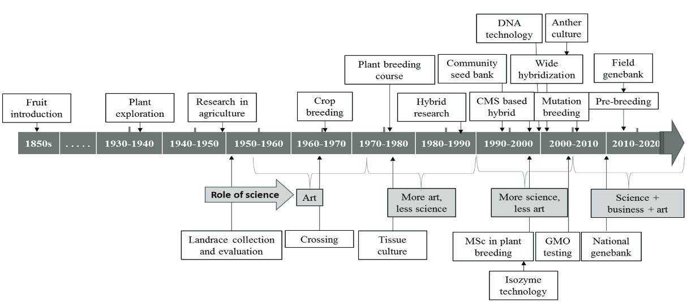
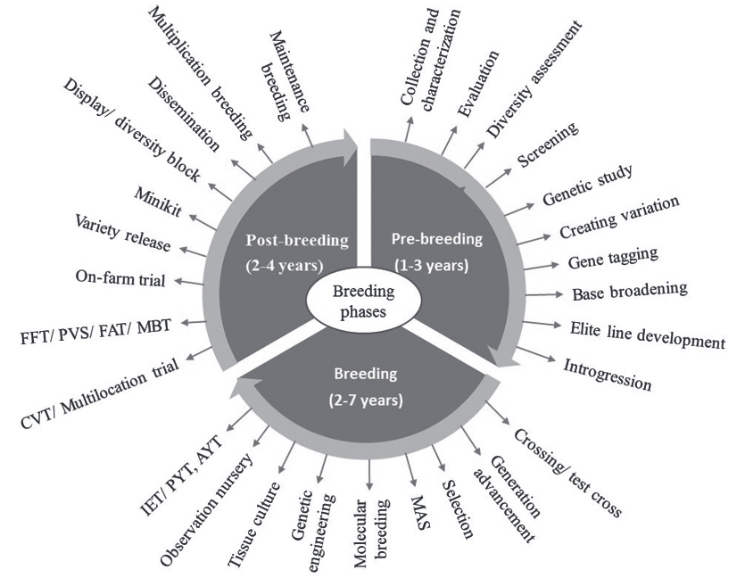
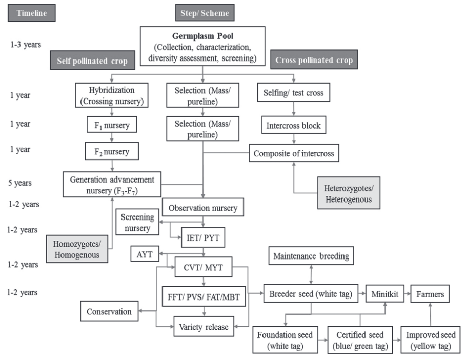
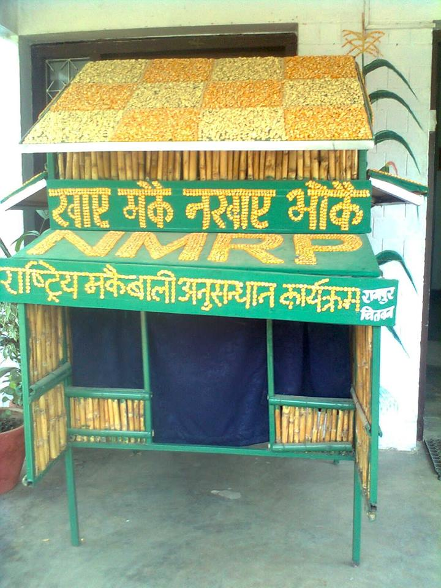

class: inverse, middle, center
background-image: \url('./images/Wheat_mayil.jpg')
background-size: 80%, auto


```{r setup, include=FALSE}
options(htmltools.dir.version = FALSE)
options(knitr.kable.NA = "", digits = 3)
knitr::opts_chunk$set(tidy = FALSE, echo = FALSE)
require(tidyverse)

# pagedown::chrome_print("./18-crop_improvement_in_nepal_html.html") # chrome does not print maybe because external image is included from live url.
# to overcome this manually print from the chromium
```

# History

---

- During 1990-2014, production of potato, sugarcane, wheat, maize and rice increased by 319.4%, 235.5%, 122.3%, 90.1% and 48.9%, respectively.
- Agricultural research and breeding works intiated since 1950 and 1951 respectively.
- Systematic research in major cereals started from 1972 (Commodity programs were launched for Rice, wheat, maize, sugarcane, potato)
- Rice breeding began with the introduction of indica type semi-dwarf Taiwanese varieties in Terai and intermediate types for Kathmandu valley.
- Simple mass selection was practiced for recommending CH-45 rice variety in 1959 and Lerma-52 in 1960.
- In early days (upto 1985), major breeding objective was to increase yield of main stable crops i.e. rice, wheat and maize. Later, it extended to other crops.
- In mid period (1985-2005), priority was given to developing biotic stresses, mainly disease resistant variety, followed by yield. Rice blast and wheat rust were the main diseases in the country from very beginning to current period of breeding history. 
- Later between 2005 and 2015, abiotic stresses mainly drought and quality aspects got priority in the breeding programs. 
- Majority breeding programs focused on screening the introduced germplasm, and genetics of specific traits in the local germplasm were not studied.

---

```{r}

```

---

## Insitutional efforts in Plant Breeding

- More than 100 organizations are involved in breeding activities in Nepal:
  - NARC, NAST (1982), Li-BIRD (1995), CEAPRED (1991), SEAN (1989)
- CIMMYT has been working since 1970 and IRRI started collaboration in Nepal since 1985.
- Universities:
  - IAAS, TU (1972); Department of Plant Breeding and Genetics (2010)
  - HICAST, PU (2000)
  - AFU (2010)
- Agriculture Botany Division started the preliminary plant breeding works mainly on rice, wheat and maize since 1966. Extensive plant breeding started after the establishment of five commodities (rice, wheat, maize, potato and sugarcane) research programs in 1972. IAAS, Rampur started degree course on plant breeding since 1998.

---

## Germplasm of Nepal

.pull-left[
- About 30,000 landraces of 250 cultivated crops.
- Indigenous crops and their landraces have significant contribution to overall food secure being of rural Nepal, globally recognized landraces include "Bhate Phaper" of tartary buckwheat, "Jumli Marshi" and "Anadi" of rice and "Akabare" of chili pepper. 
- Only about 20% of notified germplasm in Nepal have origin in the country itself.
- Pedigree analysis reveals that 13 landraces originated in 8 different countries were used to develop Khumal-4 rice variety.
- A total of 47 ancestors (landraces) originated in 12 different countries were used to develop 20 mid and high hill rice cultivars and a total of 35 ancestors originated in 11 different countries were used to develop 28 rice cultivars for terai region by 2016.
]

.pull-right[
```{r}
knitr::include_graphics("https://rookie.rbind.io/img/rice_landraces/anadi_kailali.jpg")
```

]

---

```{r}
landraces <- tribble(~"crop", ~"genotype", ~"uniqueness", 
        "Buckwheat", "Bhate pahper", "Loose husk", 
        "Buckwheat", "Kagpani phaper", "Highest rutin content", 
        "Cauliflower", "Garve cauli", "Very large head, perinniality gene, vegetatively propagated", 
        "Chilly" ,"Akabare khursani", "Medicinal value, very spicy and does cause inflammatory of stomach", 
        "Chilly", "Jire khursani", "All year round fruiting", 
        "Finger millet", "Dailekh local", "Higher yielder and adapted to low fertility soils", 
        "Maize", "Pani makkia", "Tolerant to water logged conditions", 
        "Rice", "Amaghuaj", "Multiple spikelets per node", 
        "Rice", "Anadi dhan", "Sticky rice", 
        "Rice", "Bhati", "Deep water rice", 
        "Rice", "Ekle rice", "Zn deficiency tolerant", 
        "Rice", "Gamadi dhan", "Matured panicle remained within flag leaf", 
        "Rice", "Jumli marshi", "Cold tolerant rice", 
        "Rice", "Mansara", "Adopted to very marginalized land", 
        "Rice", "Pakhe masino, Lahure sahila, Goi sahila, Makar Kandhu", "Huide (boro) rice", 
        "Rice", "Samundaphinj", "Swampy land rice", 
        "Sarsoon", "Gorlikharka", "Highest oil content", 
        "Wheat", "Dabdabe local", "For low fertility and moisture deficient land")

landraces %>% 
  filter(crop %in% c("Buckwheat", "Cauliflower", "Chilly", "Finger millet", "Sarsoon", "Wheat")) %>% 
  knitr::kable(booktabs = TRUE, caption = "Some landraces of cultivated crop unique to Nepal")

```

---

```{r}
landraces %>% 
  filter(crop %in% "Rice") %>% 
  knitr::kable(booktabs = TRUE, caption = "Some landraces of cultivated crop unique to Nepal (...continued)")
```

---

```{r breeding-phases, fig.width=4, out.width="70%", fig.align='center'}

```

---

```{r breeding-programs-crop-specific1, message=FALSE, warning=FALSE}
breeding_programs_nepal <- readr::read_csv("./data/breeding_programs_nepal.csv") %>% 
  fill(Crop, .direction = "down") %>% 
  select(-SN) %>% 
  group_by(Crop) %>% 
  arrange(`Year released`)

breeding_programs_nepal %>% 
  filter(Crop %in% (breeding_programs_nepal %>% count(Crop) %>% .[[1]])[1:10]) %>% 
  knitr::kable(booktabs = TRUE)
```

---

```{r breeding-programs-crop-specific2}
breeding_programs_nepal %>% 
  filter(Crop %in% (breeding_programs_nepal %>% count(Crop) %>% .[[1]])[11:16]) %>% 
  knitr::kable(booktabs = TRUE)
```

---

```{r breeding-programs-crop-specific3}
breeding_programs_nepal %>% 
  filter(Crop %in% (breeding_programs_nepal %>% count(Crop) %>% .[[1]])[17:21]) %>% 
  knitr::kable(booktabs = TRUE)
```

---

```{r breeding-program-nepal, out.width="70%", fig.align='center', fig.cap="A typical workflow of variety development in Nepal"}

```

---

## Plans and policies

.pull-left[
- No specific policies as such for plant breeding and genetics
- Relevant policies, acts, and regulations are:
  - Plant protection regulations, 1975
  - Seed act, 1988 (Amendment 2008)
  - Seed regulations, 1997
  - National seed policy, 1999
  - National agriculture policy, 2004
  - Biotechnology policy, 2006
  - Plant protection act, 2007
  - Agrobiodiversity policy, 2007 (Amendment 2014)
  - National biosafety framework, 2007
  - National seed vision, 2013-25
  - National biodiversity strategy and action plan, 2014-20
  - Agriculture developmenet strategy, 2015-35
  - NARC vision, 2011-30
]

.pull-right[
```{r makkai-theme, out.width="75%", fig.align='center'}

```
]

---

## International convention and treatise

- Access to genetic diversity—usually in the form of seed or clonal material—is crucial to any plant breeding program as well as for farmers to ensure their food security and livelihood.

- Convention on Biological Diversity (CBD): Fosters access and benefit-sharing (ABS); Promotes the conservation of biodiversity and equity between the North and the South at the same time.
- International treaty on International Plant Genetic Resources for Food and Agriculture (ITPGRFA)

---

## Some terminologies and meaning in relation to breeding program

1. Crossing nursery: Growing of male and female parental lines in glasshouse or field for hybridization.

2. Generation advanced nursery (GAN): Heterozygous generation after $F_1$ and grown in field either for developing homozygotes or making selective crossing among themselves.

3. Observation nursery (ON): Un-replicated trial of newly developed or received genotypes in on-station for observing the expression of economic traits in particular environment

4. Initial evaluation trial (IET): On-station replicated yield trial of newly developed genotypes including check in one location for testing their overall performance. Also known as preliminary yield trial (PYT).

---

5. Advanced yield trial (AYT): On-station replicated yield trial of newly developed genotypes including check in one location for further verification of IET over the years on their general performance.

6. Coordinated varietal trial (CVT): Replicated yield performance trial where varieties and checks are evaluated on more than one location for testing their adaptability and stability. It is also called multi-location yield trial (MYT).

7. Farmer's field trial (FFT): On-farm evaluation trial of newly developed pipeline varieties in farmer's management practices and in target environment for getting response from farmers on them, generally farmer is considered as single replicate. Also known as farmer acceptance test (FAT).

8. Minikit: A small seed kit of modern cultivars distributed free by the formal research system to promote the newly released varieties under farmers' management conditions.

---

9. Participatory varietal selection (PVS): Selection of fixed lines (released or pre-released or advance lines or landraces) by farmers in collaboration with breeders in their target environments using their own selection criteria.

10. Mother baby trial (MBT): A baby trial is a one-on-one comparison under farmers' management. In mother trial all new varieties tested in baby trials are grown together as a single replicate. The varieties comprising the baby trials come from the mother trial. Each mother trial is composed of 6-10 varieties. 

11. On-farm trial: Trial in farmer's field either managed and controlled by farmer or researcher. Generally particular technology or variety is tested in comparison with local one in farmer's management practices. 

12. On-station trial: Trial managed by researchers on-station where most of the agricultural practices are controlled and suitable environment for particular varieties are created. 

---

13. Diversity kit: Also called seed kit, which includes more than one variety either released, pipelines or landraces in a pack to distribute to the farmers. This is particularly targeted to increase diversity along with making farmers access to new varieties

14. Diversity block: A number of plots either in on-station or on-farm with many types of cultivars (varieties and landraces) and pipelines, grown for displaying the available diversity along with preliminary observation on their yield performance.

15. Display block: A number of plots on-station with all released varieties, pipelines, elite lines, rare and unique landraces maintained providing the visitors an opportunity to see potential of different varieties at a single location.

16. Informal research and development (IRD): Distribution of many small packets of seed of released and pipelines varieties without fertilizer or pesticides, the only additional input being a description of varietal characteristics on an enclosed leaflet. This approach emphasized increased varietal adoption rather than data collection for research and was particularly suitable for increasing the flow of new genetic materials to areas lacking an effective formal seed supply system.

17. Demonstration plot: Growing newly released varieties including local landrace in farmer's field or in area accessible to many farmers with the objective of showing potential of new varieties to the farmers at their own location
