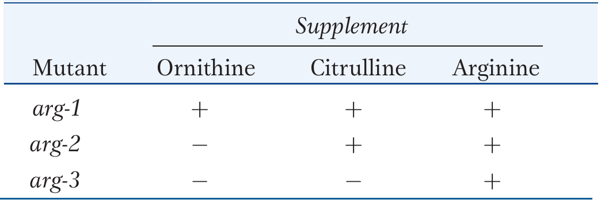
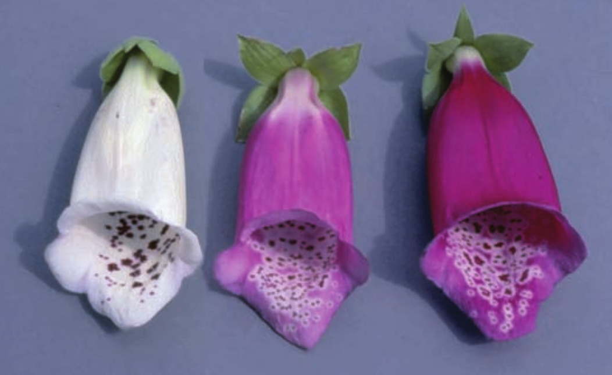

```{r setup, include=FALSE}
library(knitr)
require(tidyverse)
set.seed(453)
# invalidate cache when the package version changes
knitr::opts_chunk$set(tidy = FALSE, echo = FALSE, 
                  message = FALSE, warning = FALSE,
                  out.width = "45%", cache = TRUE, 
                  dev.args=list(bg=grey(0.9), pointsize=11))
options(knitr.table.format = "latex")
options(knitr.kable.NA = "", digits = 2)
options(kableExtra.latex.load_packages = FALSE)
# Beamer cheatsheet can be found at:
# http://www.cpt.univ-mrs.fr/~masson/latex/Beamer-appearance-cheat-sheet.pdf
# All beamer themes and colorthemes can be assessed at:
# https://hartwork.org/beamer-theme-matrix/

# A complete book on biolgy view this link
# https://github.com/philschatz/biology-book/blob/master/SUMMARY.md
```

# Gene

## Different meanings of gene ! 

\bcolumns
\column{0.6\textwidth}

```{r different-meanings-of-gene, fig.align='center', out.width="48%"}

```

\column{0.4\textwidth}

- Population genetics
- Quantitative genetics
- Transmission genetics
- Molecular genetics

\ecolumns

## Genetic analysis begins with mutants

- Genetic approach to understanding any biological property is through gene discovery
- One simple and useful analytical approaches to gene discovery is detection of single-gene inheritance pattern.
- Variants in biological system represent "tweaks" in the biological machine.
- Common form of any property of an organism is called **wild type**
- Heritable variants different from wild types are called  **mutants**
- Alternative forms of the property are called **phenotypes**
- **Polymorphism**: coexistence of two or more reasonably common phenotypes of a biological property

<!-- ## Gene discovery to property analysis -->

<!-- - Assemble mutants affecting the biological property of interest. -->
<!-- - Cross the mutants to wild type to see if their decendands show ratios of wild to mutant that are characteristic of single-gene inheritance. -->
<!-- - Deduce the functions of the gene at the molecular level. -->
<!-- - Deduce how the gene interacts with other genes to produce the property in question. -->

## Approaches to gene identification

\bcolumns
\column{0.5\textwidth}

- This type of approach to gene discovery is sometimes called **forward genetics**, a strategy to understanding biological function starting with random single-gene mutants and ending with their DNA sequence and biochemical function.
- **Reverse genetics** starts with genomic analysis at the DNA level to identify a set of genes as candidates for encoding the biological property of interest\footnote[frame]{For a book chapter dedicated to Reverse genetics approaches, refer to \cite{gilchrist2013gene}.}.

\column{0.5\textwidth}

```{r forward-genetics, fig.cap="Flowchart of forward genetics approach in gene identification. For an entire chapter dedicated to the approach, refer to \\cite{ji2013gene}", out.width="80%"}
# Diagnostics in Plant Breeding, 2015 (Contains two chapters, each on forward and reverse genetics approaches)

```

\ecolumns


# Nature of genetic code

## Physical nature

- Are genes composed of protein, nucleic acid, or some other substance? 
- In 1944, Oswald Avery, Colin MacLeod, and Maclyn McCarty offered the first compelling experimental evidence that genes are made of deoxyribonucleic acid (DNA). 
- They showed that DNA extracted from a virulent strain of bacteria carried the necessary genetic information to transform a nonvirulent strain into a virulent one.

## How can DNA molecules store information ?

- In the 1950s, there was something of a race among several groups of geneticists and chemists to answer this question. In 1953, James Watson and Francis Crick working at Cambridge University in England won that race. 
- They determined that the molecular structure of DNA was in the form of a double helix -- two strands of DNA wound side-by-side in a spiral. Their structure of the double helix is like a twisted ladder (Figure \ref{fig:twisted-ladder}).
- The sides of the ladder are made of sugar and phosphate groups. The rungs of the ladder are made of four bases: adenine (A), thymine (T), guanine (G), and cytosine (C). 

##

- The bases face the center, and each base is hydrogen bonded to the base facing it in the opposite strand. 
- Nucleotide base pairing is highly specific. The bonding specificity is based on the complementary shapes and charges of the bases. 
- The sequence of A, T, G, and C represents the coded information carried by the DNA molecule.

```{r twisted-ladder, fig.cap="Twisted ladder structure of DNA", out.width="38%", fig.align='center'}
# pdftools::pdf_convert("~/Desktop/BSc_Ag_lectures/literatures/textbooks/Introduction to Genetic Analysis/Griffiths - An Introduction to Genetic Analysis 11th Edition c2015.pdf", pages = 34, filenames = "./../images/twisted_ladder_dna.png", dpi = 300)


```

## How are genes regulated? 

- Cells need mechanisms to turn genes on or off in specific cell and tissue types and at specific times during development. 
- In 1961, Francois Jacob and Jacques Monod made a conceptual breakthrough on this question. 
- Working the genes necessary to metabolize the sugar lactose in the bacterium _Escherichia coli_, they demonstrated that genes have regulatory elements that regulate gene expression -- that is, whether a gene is turned on or off. 
- The regulatory elements are specific DNA sequences to which a regulatory protein binds and acts as either an activator or repressor of the expression of the gene.

## How is the information stored in DNA decoded to synthesize protein ?

- While the discovery of the double-helical structure of DNA was a watershed for biology, many details were still unknown. 
- Precisely how information was encoded into DNA and how it was decoded to form the enzymes that Tatum and Beadle had shown to be the workhorses of gene action remained unknown. 
- Over the years 1961 through 1967, teams of molecular geneticists and chemists working in several countries answered these questions when they "cracked the genetic code."

##

- What this means is that they deduced how a string of DNA nucleotides, each with one of four different bases (A, T, C, or G), encodes the set of 20 different amino acids that are the building blocks of proteins. 
- They also discovered that there is a messenger molecule made of ribonucleic acid (RNA) that carries information in the DNA in the nucleus to the cytoplasm where proteins are synthesized. 
- By 1967, the basic flowchart for information transmission -- central dogma of biology -- in cells was known.

## Central dogma of biology

\bcolumns
\column{0.6\textwidth}

- The flow of genetic information in cells from DNA to mRNA to protein is described by the Central Dogma. 
- The decoding of one molecule to another is performed by specific proteins and RNAs.
- Because the information stored in DNA is so central to cellular function, it makes sense that the cell would make mRNA copies of this information for protein synthesis, while keeping the DNA itself intact and protected. 

\column{0.4\textwidth}

```{r central-dogma, fig.cap="The central dogma of biology", out.width="60%"}


```

\ecolumns

<!-- - The copying of DNA to RNA is relatively straightforward, with one nucleotide being added to the mRNA strand for every nucleotide read in the DNA strand. -->
<!-- - The translation to protein is characterized by a universal routine of three mRNA nucleotides corresponding to one amino acid in the polypeptide sequence.  -->
<!-- - However, the translation to protein is still systematic and colinear. In terms of RNA and protein, three "units" of RNA (nucleotides) specify one "unit" of protein (amino acid) in a consecutive fashion, such that nucleotides 1 to 3 correspond to amino acid 1, nucleotides 4 to 6 correspond to amino acid 2, and so on. -->

## Terminologies

```{r gene-terms1}
gene_terms <- read_csv("../data/definitions_of_terms_genetic_code.csv")

gene_terms[1:8, ] %>%
  knitr::kable(caption = "Some terms applicable in the context of genetic code",
               booktabs = TRUE, digits = 2, escape = FALSE, align = "l") %>%
  kableExtra::kable_styling(latex_options = "striped", font_size = 6) %>%
  kableExtra::column_spec(1, bold = TRUE) %>%
  kableExtra::column_spec(column = 1:2, width = c("8em", "38em"))

```

##

```{r gene-terms2}
gene_terms[9:nrow(gene_terms), ] %>%
  knitr::kable(caption = "Some terms applicable in the context of genetic code (...continued)",
               booktabs = TRUE, digits = 2, escape = FALSE, align = "l") %>%
  kableExtra::kable_styling(latex_options = "striped", font_size = 6) %>%
  kableExtra::column_spec(1, bold = TRUE) %>%
  kableExtra::column_spec(column = 1:2, width = c("8em", "40em"))

```

## Genetic code: The search

When should the academic month of an year start ?

<!-- AUGust -->

##

- Evidence first presented on its nature in 1961 by Francis Crick and Sydney Brenner used the chemical mutagen proflavin to insert (+) or delete (-) one, two, or three nucleotides into the gene of a virus.
  - When one or two nucleotides were inserted/deleted, protein synthesis was completely abolished. When three nucleotides were inserted/deleted, the protein was synthesized and functional.
  - The insertion/deletion of one or two nucleotides completely changed the triplet reading frame, thereby altering the message for every subsequent amino acid. 
  - Insertion/deletion of three nucleotides caused an extra amino acid to be inserted during translation, the integrity of the rest of the protein was maintained.

## Nature: Code triplet

- Given the different numbers of "letters" in the mRNA and protein "alphabets," scientists theorized that combinations of nucleotides corresponded to single amino acids. 
- These nucleotide triplets are called codons\footnote[frame]{Codons: Three consecutive nucleotides in mRNA that specify the insertion of an amino acid or the release of a polypeptide chain during translation}.
- Nucleotide doublets would not be sufficient to specify every amino acid because there are only 16 possible two-nucleotide combinations.

\begin{align}
\begin{split}
4^2 &= 16 \nonumber \\
4^3 &= 64
\end{split}
\end{align}

- If there were 200 commonly occurring amino acids instead of 20. Given what you know about the genetic code, what would be the shortest possible codon length? Explain.
<!-- - Source the script probability_tree.R to illustrate  -->

## Nature: Degeneracy

- Scientists theorized that amino acids were encoded by nucleotide triplets and that the genetic code was degenerate\footnote[frame]{(of the genetic code) describes that a given amino acid can be encoded by more than one nucleotide triplet}.
- Scientists solved the genetic code by translating synthetic mRNAs in vitro and sequencing the proteins they specified
- In addition to instructing the addition of a specific amino acid to a polypeptide chain, three of the 64 codons terminate protein synthesis and release the polypeptide from the translation machinery. These triplets are called nonsense codons\footnote[frame]{one of the three mRNA codons that specifies termination of translation}, or stop codons. 
- AUG codon has a special function. 
  - Specifies the amino acid methionine, 
  - Serves as the start codon to initiate translation. The reading frame for translation is set near the 5' end of the mRNA.

## Nature: Universality

- The genetic code is universal. With a few exceptions, virtually all species use the same genetic code for protein synthesis.
- Conservation of codons means that a purified mRNA encoding the globin protein in horses could be transferred to a tulip cell, and the tulip would synthesize horse globin. 
- That there is only one genetic code is powerful evidence that all of life on Earth shares a common origin, especially considering that there are about $10^{84}$ possible combinations of 20 amino acids and 64 triplet codons.

##

```{r universality, fig.cap="The genetic code is universal for all life forms", out.width="45%"}

knitr::include_graphics("./../images/nucleotide_codons.jpg")
```

## Property: Overlapping/non-overlapping genetic code

```{r overlap-n-non, fig.cap="Overlapping versus non overlapping genetic codes", out.width="40%"}
# pdftools::pdf_convert("~/Desktop/BSc_Ag_lectures/literatures/textbooks/Introduction to Genetic Analysis/Griffiths - An Introduction to Genetic Analysis 11th Edition c2015.pdf", pages = 351, filenames = "./../images/overlap_non_overlap.png", dpi = 300)


```

- An overlapping and a nonoverlapping genetic code would translate differently into an amino acidc sequence. 
- In an overlapping code, single nucleotides occupy positions in multiple codons. 
- In a nonoverlapping code, a protein is translated by reading nucleotides sequentially in sets of three.

## Property

- With comma/commaless
- Non-ambiguous

<!-- Commaless: the arrangement of triplet codons on m-RNA is one after another without a gap. -->
<!-- Non-ambiguous: One codon specifies exactly one form of amino acid. -->

## Translational consequences of a mutation

```{r frameshift-mutation, out.width="45%", fig.cap="Frameshift mutation"}

```

- Degeneracy is believed to be a cellular mechanism to reduce the negative impact of random mutations. 
- Codons that specify the same amino acid typically only differ by one nucleotide. 
- Amino acids with chemically similar side chains are encoded by similar codons. 
- So what does single nucleotide mutation do ?

## Molecular phenotype

- The primary phenotype of a gene is the protein it produces.
- Two variants of a gene -- wild and mutant, produce functionally different proteins to be called alleles.
- Human disease phenylketonuria (PKU) provides a hint to the topic.

## Molecular biology of PKU

- Due to defective allele of a gene that encodes for liver enzyme phenylalanine hydroxylase (PAH).

$$
\begin{aligned}
\textrm{phenylalanine} \xrightarrow{\text{phenylalanine hydroxylase}} \textrm{tyrosine}
\end{aligned}
$$

- A mutation in the gene encoding this enzyme may alter the amino acid sequence in the vicinity of the enzyme's active site. In this case, the enzyme cannot bind phenylalanine or convert it into tyrosine. 
- Phenylalanine builds up and is instead converted into phenylpyruvic acid, this interferes with the development of the nervous system.

## 

- Mutations occur at different sites along the gene. Functional mutations are essentially those occurring in the protein-encoding regions, or the exons. They represent a range of DNA changes, but most are small changes affecting only one nucleotide pair among the thousands that constitute the gene.
- By changing one or more amino acids, (non-synonymous) mutations inactivate some essential part of the protein encoded by the gene. The effect of the mutation on the function of the gene depends on where within the gene the mutation occurs. 

## 

- An important functional region of the gene is that encoding an enzyme's active site. In addition, a minority of mutations are found to be in introns, and these mutations often prevent the normal processing of the primary RNA transcript.
- Many of the mutant alleles are of a type generally called null alleles: the proteins encoded by them completely lack PAH function. Other mutant alleles reduce the level of enzyme function; they are sometimes called leaky mutations, because some wild-type function seems to "leak" into the mutant phenotype.

# One gene one polypeptide hypothesis

## Functionality of genes

- Genes don't always encode protein
- Some genes encode RNAs that have special functions, however all genes are transcribed to make RNA.
- RNAs that do not end up being mRNAs are functional RNAs (ribosomal RNAs, small cytoplasmic RNAs).

## Study in _Neurospora_ fungus

- Genes act by controlling cellular chemistry.
- Beadle and Tatum received a Nobel Prize for their study on the haploid fungus _Neurospora_.
- They used forward genetic approach by first inducing mutations and then tested cultures grown from ascospores for interesting mutant phenotypes.
- Specifially auxotrophic mutants were the subject; Auxotrophic mutants cannot synthesize all its cellular components from the inorganic nutrients and a carbon source in the medium.
- Thus mutant is defective for some normal synthesyzing step.

##

- It was first confirmed that each mutation that generated a nutrient requirement was inherited as a single-gene mutation because each gave a 1:1 ratio when crossed with a wild type. Letting _aux_ represent auxotrophic mutation and wild type as "+",

$$
\begin{aligned}
+ &\times aux \\
 &\downarrow\\
\textrm{progeny}: \frac{1}{2} + &\textrm{and} \frac{1}{2}aux
\end{aligned}
$$

- The second step was to classify the specific nutritional requirement of each auxotroph.
- Some grew only if proline was supplied, others methionine, others pyridoxine, others arginine. Focus was set on arginine types.
- Three separate genes different loci were identified on separate chromosomes.
- It was discovered that auxotrophs for each of the three loci differed in their response to the structurally related compounds ornithine and citrulline.

##

- _arg-1_ mutants grew when supplied with any one of the chemicals ornithine, citrulline, or arginine.
- _arg-2_ mutants grew when either citrulline or arginine was supplied.
- _arg-3_ mutants grew only when arginine was supplied.
- Enzymes were already known to interconvert such related compounds.
- B \& P proposed a biochemical pathway for such conversion in the fungus:

$$
\begin{aligned}
\textrm{precursor} \xrightarrow{\text{enzyme X}} \textrm{ornithine} \xrightarrow{\text{enzyme Y}} \textrm{citrulline} \xrightarrow{\text{enzyme Z}} \textrm{arginine}
\end{aligned}
$$

```{r mutants-supplements, fig.cap="Growth of \\textit{arg} Mutants in response to supplements.", out.width="40%"}
# pdftools::pdf_convert("~/Desktop/BSc_Ag_lectures/literatures/textbooks/Introduction to Genetic Analysis/Griffiths - An Introduction to Genetic Analysis 11th Edition c2015.pdf", pages = 251, filenames = "./../images/mutant_growth_supplements.png", dpi = 300)


```

##

- The model:
  - _arg-1_ mutants have a defective enzyme X, and so they are unable to convert the precursor into ornithine as the first step in producing arginine. However they have normal enzymes Y and Z, and so the arg-1 mutants are able to produce arginine if supplied with either ornithine or citrulline.
  - _arg-2_ mutants lack enzyme Y, and the _arg-3_ mutants lack enzyme Z.
  - A mutation at a particular gene is assumed to interfere with the production of a single enzyme. 
  - The defective enzyme creates a block in biosynthetic pathway. The block can be prevented by supplying to the cells any compound that normally comes after the block in the pathway.

$$
 \text{Precursor} \xrightarrow 
 {
 \begin{subarray}{c}
 arg-1^+ \\
 \downarrow \\
 \text{Enzyme X}
 \end{subarray}
 } 
 \text{Ornithine} \xrightarrow
  {
 \begin{subarray}{c}
  arg-2^+ \\
 \downarrow \\
 \text{Enzyme Y}
 \end{subarray}
 }
 \text{Citrulline} \xrightarrow
  {
 \begin{subarray}{c}
  arg-3^+ \\
 \downarrow \\
 \text{Enzyme Z}
 \end{subarray}
 }
 \text{Arginine}
$$

##

- This model was initially known as the _one-gene-one-enzyme hypothesis_.
- Genes somehow were responsible for the function of enzymes, and each gene appar-
ently controlled one specific enzyme in a series of interconnected steps in a bio-
chemical pathway
- All **Proteins** are infact encoded by gene hence the phrase one-gene-one-polypeptide hypothesis.
- Hence Beadle and Tatum's hypothesis became the great unifying theory that brought together areas of genetics and biochemistry together.

# Enzymatic explanation of genetic ratios

## 

- An enzyme is a product of gene/s.
  - A tertiary or quarternary form of polypeptide derived from amino-acid units.
- Enzyme controls/catalyzes biochemical reaction and the reaction produces biochemical product which is responsible to final phenotype expression.
- So, phenotypic ratio is determined by the enzyme.

## The 9:3:3:1 ratio; No interaction

- In inheritance of skin coloration in corn snakes, the phenotype is produced by two separate pigments. The snake's natural color is a repeating black and orange camouflage pattern, as shown in Figure \ref{fig:gene-no-interaction1} (a).
- The phenotype is produced by two separate pigments, both of which are under genetic control.
- One gene determines orange pigment ($o^+$ and $o$) and another gene determines black pigment ($b^+$ and $b$).
- Two genes are unlinked.
- Natural pattern is produced by the genotype $o^+/\_;\ b+/\_$.
- What genotypes leads to completely black pigmentation?

##

```{r gene-no-interaction1, out.width="42%", fig.align='center', fig.cap="Phenotypes of snake skin pigmentation"}
# pdftools::pdf_convert("~/Desktop/BSc_Ag_lectures/literatures/textbooks/Introduction to Genetic Analysis/Griffiths - An Introduction to Genetic Analysis 11th Edition c2015.pdf", pages = 258, filenames = "./../images/gene_no_interaction.png", dpi = 300)


```

##

- If homozygous orange and a homozygous black snake are crossed, the $F_1$ is wild type (camouflaged), demonstrating complementation.

```{r gene-no-interaction2, out.width="40%", fig.align='center'}
# pdftools::pdf_convert("~/Desktop/BSc_Ag_lectures/literatures/textbooks/Introduction to Genetic Analysis/Griffiths - An Introduction to Genetic Analysis 11th Edition c2015.pdf", pages = 258, filenames = "./../images/gene_no_interaction2.png", dpi = 300)


```

## The 9:7 ratio: gene complementation (genes acting on same pathway)

\bcolumns
\column{0.6\textwidth}

- The $F_2$ ratio from the harbell dihybrid cross shows both blue and white plants in ratio of 9:7. How can such results be explained ? 
- The 9:7 ratio is a modification of the dihybrid 9:3:3:1 ratio with the 3:3:1 combined to make 7.

\column{0.4\textwidth}

```{r, fig.align='center', out.width="80%"}

# snoop dogg is the special kind of dogg that can have a smoke
# a dog is unremarkable
# a smoke is unremarkable
# when combined, a smoking snoop dogg is an world famous artist that accomplishes feats -- like producing a special phenotype 


```

\ecolumns

## 

\begin{columns}[T,onlytextwidth]
  \footnotesize
  \column{0.5\textwidth}
  
```{r gene-complementation, out.width="68%", fig.align='center'}
# pdftools::pdf_convert("~/Desktop/BSc_Ag_lectures/literatures/textbooks/Introduction to Genetic Analysis/Griffiths - An Introduction to Genetic Analysis 11th Edition c2015.pdf", pages = 256, filenames = "./../images/gene_complementation.png", dpi = 300)

knitr::include_graphics("./../images/gene_complementation.png")
```

  \column{0.5\textwidth}

```{r gene-in-same-pathway, out.width="80%", fig.align='center'}
# pdftools::pdf_convert("~/Desktop/BSc_Ag_lectures/literatures/textbooks/Introduction to Genetic Analysis/Griffiths - An Introduction to Genetic Analysis 11th Edition c2015.pdf", pages = 258, filenames = "./../images/gene_same_pathway.png", dpi = 300)


```
  
\end{columns}

## 

- Only way in which a 9:7 ratio is possible is if the double mutant has the same phenotypes as the two single mutants. 
- Hence, the modified ratio constitutes a way of identifying the double mutant’s phenotype. 
- Furthermore, the identical phenotypes of the single and double mutants suggest that each mutant allele controls a different step in the same pathway. 
- The results show that a plant will have white petals if it is homozygous for the recessive mutant allele of either gene or both genes. 
- To have the blue phenotype, a plant must have at least one copy of the dominant allele of both genes because both are needed to complete the sequential steps in the pathway.
- No matter which is absent, the same pathway fails, producing the same phenotype. The enzymatic pathways allowing for complementation is through regulatory gene products (Shown in \ref{fig:functional-regulatory-gene}).
- Thus, three of the genotypic classes will produce the same phenotype, and so, overall, only two phenotypes result.

## The 9:3:4 ratio: recessive epistasis

- One important type of functional interaction between different genes occurs when an allele of genotype at one locus "masks" or inhibits the expression of a allele or genotype at a different locus, such an interaction is called epistasis.
- Epistasis means stand upon.
- Double mutants show the phenotype of one mutation but not the other.
- Overriding mutation is epistatic, whereas the overridden one is hypostatic.
- Also results from the genes in same pathway.
- In a simple model, if epistatic mutation is carried by a gene that if farther upstream than the one being overridden, the mutant phenotype of the upstream gene takes precedence, no matter what is taking place later in the pathway.

<!-- - Epistasis should not be confused with dominance. Epistasis is the interaction between different genes located in different loci.  -->
<!-- - Dominance is the intraallelic interaction between different alleles of the same gene. -->

##

$$
\begin{aligned}
& & w/w; m^+/m^+ (\text{white}) & \times w^+/w^+; m/m (\text{magenta}) &\\
& \mathrm{F_1} & & w^+/w; m^+/m (\text{blue}) & \\
& & & \downarrow & \\
& & w^+/w; m^+/m &\times w^+/w; m^+/m & \\
& & & \downarrow & \\
& \mathrm{F_2} & & 9w^+/\_; m^+/\_ (\text{blue}) \hspace{1cm} & 9 \\
& & & 3 w^+/\_; m/m (\text{magenta}) \hspace{1cm} & 3 \\
& & & \left\{
\begin{array}{ll}
3 w/w; m^+/\_ (\text{white}) \hspace{1cm} \\
1 w/w; m/m (\text{white})
\end{array}
\right\} & 4
\end{aligned}
$$

##

```{r recessive-epistasis, out.width="30%", fig.align='center', fig.cap="A model for recessive epistasis"}
# pdftools::pdf_convert("~/Desktop/BSc_Ag_lectures/literatures/textbooks/Introduction to Genetic Analysis/Griffiths - An Introduction to Genetic Analysis 11th Edition c2015.pdf", pages = 260, filenames = "./../images/recessive_epistasis.png", dpi = 300)


```

##

\begin{block}{}
Epistasis is inferred when a mutant allele of one gene masks the expression of a mutant allele of another gene and expresses its own phenotype instead.
\end{block}

- This interaction is called recessive epistasis because a recessive phenotype (white) overrides the other phenotype.
- At the cellular level, we can account for the recessive epistasis in _Collinsia_ by the following type of pathway.

$$
\begin{aligned}
\textrm{colorless} \xrightarrow{\text{gene}~w^+} \textrm{magenta} \xrightarrow{\text{gene}~m^+} \textrm{blue}
\end{aligned}
$$

- Notice that the epistatic mutation occurs in a step in the pathway leading to blue pigment; this step is upstream of the step that is blocked by the masked mutation.

## The 12:3:1 ratio: dominant epistasis

- In foxgloves ( _Digitalis purpurea_), two genes interact in the pathway that determines petal coloration. 
- The two genes are unlinked.
- One gene affects the intensity of red pigment in the petal,
  - _d_ results in the light red color seen in natural populations 
  - _D_ is a mutant allele that produces dark red color.
- Other gene determines in which cells the pigment is synthesized, 
  - _w_ allows synthesis of the pigment throughout the petals as in the wild type, 
  - _W_ is a mutant allele that confines pigment synthesis to the small throat spots. 
- Selfing of dihybrid shows:

##

$$
\begin{aligned}
& \left\{
\begin{array}{ll}
9D/\_; W/\_ (\textrm{white with spots}) \hspace{1cm} \\
3 d/d; W/\_ (\textrm{white with spots}) \hspace{1cm}
\end{array}
\right\} & 12 \\
& 3 D/\_; w/w (\textrm{dark with red}) \hspace{1cm} & 3 \\
& 1 d/d; w/w (\textrm{light red}) & 1
\end{aligned}
$$


##

```{r dominant-epistasis, out.width="40%", fig.align='center', fig.cap="Dominant epistasis due to white mutation"}
# pdftools::pdf_convert("~/Desktop/BSc_Ag_lectures/literatures/textbooks/Introduction to Genetic Analysis/Griffiths - An Introduction to Genetic Analysis 11th Edition c2015.pdf", pages = 262, filenames = "./../images/dominant_epistasis.png", dpi = 300)


```

## Regulators

```{r functional-regulatory-gene, out.width="48%", fig.align='center', fig.cap="\\textbf{Molecular mechanisms of genes acting on same pathway.} Interaction between a regulatory protein and its target"}
# pdftools::pdf_convert("~/Desktop/BSc_Ag_lectures/literatures/textbooks/Introduction to Genetic Analysis/Griffiths - An Introduction to Genetic Analysis 11th Edition c2015.pdf", pages = 259, filenames = "./../images/genes_in_same_pathway_biochemical.png", dpi = 300)


```

## Suppressors

- A suppressor is a mutant allele of a gene that reverses the effect of a mutation of another gene, resulting in a wild-type or near-wild-type phenotype.
- Suppression implies that the target gene and the suppressor gene normally interact at some functional level in their wild-type states.
- Assume that an allele $a^+$ produces the normal phenotype, whereas a recessive mutant allele a results in abnormality.
- Screening for supressors involves:
  - Assemble mutants in some process of interest, 
  - Expose these mutants to mutation causing agents such as high energy radiation, and screen the decendents for wild types.
  - Most wild types arising in this way are merely reverasals of the original mutation event and are called revertants. However, some will be "pseudorevertants", double mutants in which one of the mutations in a supressror.
  
##

- revertants and suppressed states can be distinguished by appropriate crossing. For example, in yeast, two results would be distinguished as,

$$
\begin{aligned}
&& \textrm{true revertants }a^+ &\times \textrm{standard wild-type }a^+ & \\
&&& \downarrow & \\
& \textrm{Progeny} && \textrm{all } a^+ & \\
&& \textrm{supressed mutant } a.s &\times \textrm{standard wild-type } a^+.s^+ & \\
& \textrm{Progeny} && a^+. s^+ & \textrm{wild type} & \\
& && a^+. s & \textrm{wild type} & \\
& && a. s^+ & \textrm{original mutant} & \\
& && a. s & \textrm{wild type (supressed)} & \\
\end{aligned}
$$

- The appearance of the original mutant phenotype identifies the parent as a suppressed mutant.

##

```{r gene-suppression, out.width="40%", fig.align='center', fig.cap="\\textbf{Molecular mechanism for suppression.} A first mutation alters the binding site of one protein so that it can no longer bind to a partner. A suppressor mutation in the partner alters the binding site so that both proteins are able to bind once again."}
# pdftools::pdf_convert("~/Desktop/BSc_Ag_lectures/literatures/textbooks/Introduction to Genetic Analysis/Griffiths - An Introduction to Genetic Analysis 11th Edition c2015.pdf", pages = 264, filenames = "./../images/molecular_basis_suppression.png", dpi = 300)


```

## Modifiers

- Modifier mutation at a second locus changes the degree of expression of the mutated gene at the first locus. Regulatory genes are an example.
- Regulatory proteins bind to the sequence of the DNA upstream of the start site for transcription. These proteins regulate the level of transcription. 
- As opposed to null mutation of a regulatory gene (in complementation), which completely (almost) prevented transcription, some regulatory mutations chnage the level of transcription of the target gene so that either more (upregulation) or less protein (downregulation) is produced.
- A popular downregulating regulatory mutation is that in gene "B" affecting gene A in a fungus such as yeast.
- We cross a leaky mutation _a_ with the regulatory mutation b;

$$
\textrm{leaky mutant } a.b^+ \times \textrm{inefficient regulator } a^+.b
$$

##

```{r gene-modifieres}
modifier <- tribble(~"Progeny", ~"Phenotype", 
        "$a^+. b^+$", "wild type",
        "$a^+.b$", "defective(low trascription)",
        "$a.b^+$", "defective (defective protein A)",
        "a.b", "extremely defective (low transcription of defective protein)")

modifier %>% 
  knitr::kable(caption = "Progency characterization", booktabs = TRUE, escape = FALSE) %>% 
  kableExtra::kable_styling(bootstrap_options = "striped",font_size = 8)
```

- Hence the action of modifiers is seen in the appearance of two grades of mutant phenotypes _within_ the $a$ progeny.

<!-- ```{r gene-modification-ratios, out.width="35%", fig.align='center', fig.cap="Some modified $F_2$ ratios"} -->
<!-- # pdftools::pdf_convert("~/Desktop/BSc_Ag_lectures/literatures/textbooks/Introduction to Genetic Analysis/Griffiths - An Introduction to Genetic Analysis 11th Edition c2015.pdf", pages = 265, filenames = "./../images/gene_modification_ratios.png", dpi = 300) -->

<!--  -->
<!-- ``` -->

# Fine structure of gene

##

\bcolumns
\column{0.5\textwidth}

- There are two concepts of gene.
  - Older theory aka bead theory
  - Recent theory aka molecular theory

\column{0.5\textwidth}

```{r old-new, fig.align='center', out.width="70%"}

```

\ecolumns

## Bead theory

- A gene is a unit of inheritance. 
- Its existence is in the form of an allele. 
- Each of the alleles affects a single phenotypic character. All alleles map to one chromosome locus.
- A gene gives a mutant phenotype when they are in pairs.
- Genes produce mendelian phenotypic ratio when intercrossed.
- Old concept speaks of indivisible nature of gene (even upon occurance of crossing over).
- Crossing over occurs between genes, but crossing over does not occur in the same gene. Thus, a gene is fundamental unit of change or mutation.

##

- A gene changes from one allelic form to another. There are no smaller units inside the gene that can change. 
- A gene is basic unit of function. Parts of a gene if they exist, cannot function. 
- In the same way as the beads are arranged in an unfastened necklace, genes are arranged linearly in a chromosome. So chromosome is a linear array of genes according to the bead theory.
- There is no complementation between the allele pair of a gene. 
- The old theory of the gene says that there is only one site of mutation in a gene. In other words: one gene ~ one site of mutation.

## Molecular theory

- Genes and cistrons are synonymous. 
- A cistron or a gene is a fundamental unit to produce a kind of a polypeptide. 
- But the gene is most commonly used. 

## Complementation test

- Determines whether two mutations belong to the same gene.
- Quicker approach when linkage mapping is time consuming.
- The decision whether members of a multiple allelic series are located in a single gene or in two or more separately but closely-linked genes is based on complementation test.
- When the trans-heterozygotes for two mutant alleles (affecting the same trait) have the mutant phenotype, they are placed in the same gene. But if they have the wild type phenotype, the mutant alleles are considered to be located in two different genes.

##

- In a diploid, the complementation test is performed by intercrossing two individuals that are homozygous for different recessive mutations.
- Next step is to observe whether the progeny have the wild-type phenotype.
  - If the progeny are wild type, two recessive mutations must be in _different_ genes because the respective wild-type alleles provide wild-type function. In this case, the two mutations are said to have _complemented_.
  - Suppose *a1* and *a2* are mutant alleles of two genes.
  - Heterozygotes can be represented as follows, depending on whether genes are on the same or different chromosomes.

```{r gene-location, out.width="35%", fig.align='center'}
# pdftools::pdf_convert("~/Desktop/BSc_Ag_lectures/literatures/textbooks/Introduction to Genetic Analysis/Griffiths - An Introduction to Genetic Analysis 11th Edition c2015.pdf", pages = 253, filenames = "./../images/gene_location_chromosomes.png", dpi = 300)

knitr::include_graphics("./../images/gene_location_chromosomes.png")
```

## 

- However, if the progeny are not wild type, then the recessive mutant must be alleles of the same gene. Because both alleles of the gene are mutants, there is no wild-type allele to help distinguish between two different mutant alleles of a gene whose wild-type allele is $a^+$ .
- These alleles could have different mutant sites within the same gene, but they would both be non functional.
- The heterozygote $a^\prime/a^{\prime \prime}$ would be

```{r gene-location-no-complementation, out.width="35%", fig.align='center'}
# pdftools::pdf_convert("~/Desktop/BSc_Ag_lectures/literatures/textbooks/Introduction to Genetic Analysis/Griffiths - An Introduction to Genetic Analysis 11th Edition c2015.pdf", pages = 254, filenames = "./../images/gene_location_chromosomes_nc.png", dpi = 300)

knitr::include_graphics("./../images/gene_location_chromosomes_nc.png")
```

- At operational level, complementation is defined as the production of a wild type phenotype when two haploid genomes bearing different recessive mutations are united in the same cell.

##

- Let us take an example on harebell plants (genus _Campanula_). The wild-type flower color of this plant is blue. Let’s assume that, from a mutant hunt, we have obtained three white-petaled mutants and that they are available as homozygous pure-breeding strains. 
- They all look the same, and so we do not know whether they are genetically identical. 
- We will call the mutant strains $\$$, $\pounds$, and $\yen$ to avoid any symbolism using letters, which might imply dominance. When crossed with wild type, each mutant gives the same results in the $F_1$ and $F_2$ as follows:

```{r gene-complementation-ratios, out.width="35%", fig.align='center'}
# pdftools::pdf_convert("~/Desktop/BSc_Ag_lectures/literatures/textbooks/Introduction to Genetic Analysis/Griffiths - An Introduction to Genetic Analysis 11th Edition c2015.pdf", pages = 254, filenames = "./../images/gene_complementation_ratios1.png", dpi = 300)

knitr::include_graphics("./../images/gene_complementation_ratios1.png")
```

##

- In each case, results show that the mutant condition is determined by the recessive allele of a single gene.
- However, are they three alleles of one gene, of two genes, or of three genes?
- Because the mutants are recessive, the question can be answered by the complementation test, which asks if the mutants complement one another.
- Let us intercross the mutants and assume folloing results are obtained:

```{r gene-complementation-ratios2, out.width="35%", fig.align='center'}
# pdftools::pdf_convert("~/Desktop/BSc_Ag_lectures/literatures/textbooks/Introduction to Genetic Analysis/Griffiths - An Introduction to Genetic Analysis 11th Edition c2015.pdf", pages = 254, filenames = "./../images/gene_complementation_ratios2.png", dpi = 300)

knitr::include_graphics("./../images/gene_complementation_ratios2.png")
```

- From this set of results, we can conclude that mutants $\$$ and $\pounds$ must be caused by alleles of one gene (say, $w1$) because they do not complement, but $\yen$ must be caused by a mutant allele of another gene ($w2$) because $\yen$ complements both $\$$ and $\pounds$.

## Benzer's experiment on rII locus of T4 with _E. coli_

- Because astronomically large numbers of phages can be used in phage-recombination analyses, very rare crossover events can be detected. 
- In the 1950s, Seymour Benzer made use of such rare crossover events to map the mutant sites within the rII gene of phage T4, a gene that controls lysis.
- For different rII mutant alleles arising spontaneously, the mutant site is usually at different positions within the gene.
- Therefore, when two different rII mutants are crossed, a few rare crossovers may take place between the mutant sites, producing wild-type recombinants, as shown here:

```{r phage-recombinants, out.width="35%", fig.align='center'}
# pdftools::pdf_convert("~/Desktop/BSc_Ag_lectures/literatures/textbooks/Introduction to Genetic Analysis/Griffiths - An Introduction to Genetic Analysis 11th Edition c2015.pdf", pages = 221, filenames = "./../images/phage_recombinants.png", dpi = 300)


```

##

As distance between two mutant sites increases, such a crossover event is more likely. Thus, the frequency of $rII^+$ recombinants is a measure of that distance within the gene. (The reciprocal product is a double mutant and indistinguishable from the parentals.)

Benzer used a clever approach to detect the very rare $rII^+$ recombinants. He made use of the fact that rII mutants will not infect a strain of E. coli called K. Therefore, he made the $rII$ × $rII$ cross on another strain and then plated the phage lysate on a lawn of strain K. Only $rII$ + recombinants will form plaques on this lawn. This way of finding a rare genetic event (in this case, a recombinant) is a selective system: only the desired rare event can produce a certain visible outcome.

##

- The T4 has A and B cistrons. 
- According to Benzer, a gene is a functional unit to produce a particular polypeptide. 
- Benzer isolated 3000 mutants of rII locus of T4 phage based on frequency of crossing over. 
- Benzer developed a map of the mutant sites of rII locus of T4 phage. The mutation sites were found spread along the entire length of the cistron A and B. 
- He concluded that crossing over occurs inside the gene or cistron. The gene is divisible. 
- There are many sites of recombination in a gene. There are many sites of change or mutation in a gene. 
- A unit of mutation in a gene is a muton. The muton is a single nucleotide pair
- Benzer termed sites that are more mutable than other sites as hot spots. 
- The number of mutational sites was determined to be approximately one-fifth (1/5) of the number of nucleotide pairs. 
- In other words, the smallest mutable site was five nucleotide pair or less.

##

- From the experiment following conclusions could be drawn:
  - A gene is a distinct chromosomal region responsible for a single cellular function. It consists of a linear array of potentially mutable sites between which recombination can occur.
  - A gene is subdivisible into several units called nucleotide pairs (recombination is possible within a gene among these nucleotide pairs).

# Bibliography

## See also

- For a discourse on types of gene interaction, refer to lecture notes on 'Introductory genetics', $3^{rd}$ semester, BScAg.

## References
