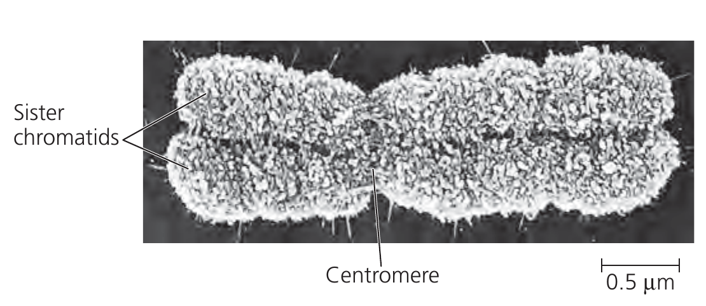
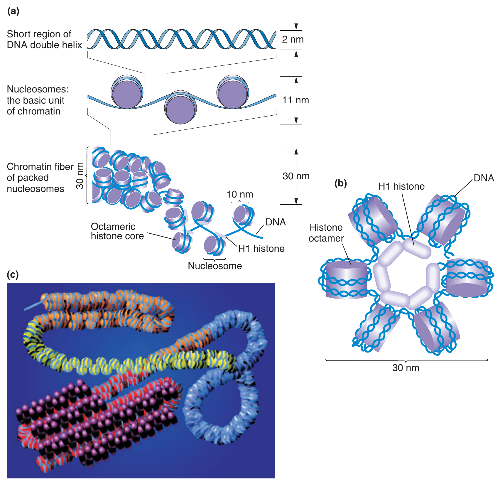

```{r setup, include=FALSE}
library(knitr)
require(tidyverse)
set.seed(453)
# invalidate cache when the package version changes
knitr::opts_chunk$set(tidy = FALSE, echo = FALSE, 
                  message = FALSE, warning = FALSE,
                  out.width = "45%", cache = TRUE, 
                  dev.args=list(bg=grey(0.9), pointsize=11))
options(knitr.table.format = "latex")
options(knitr.kable.NA = "", digits = 2)
options(kableExtra.latex.load_packages = FALSE)
theme_set(theme_bw())
```

# Eukaryotic chromosome

##

- One notable difference between eukaryotic and prokaryotic DNA is that eukaryotic DNA is packaged into nucleosomes, forming **chromatin** leading to an ultimate assemblage structure called, chromosome whereas bacterial DNA lacks nucleosomes. 
- In eukaryotes, chromatin structure is dynamic and is an essential ingredient in gene regulation.
- The chromosome complement in a cell nucleus in the members of a species is called their **karyotype** (records all the cytologically identifiable chromosome features (size, form, number)).

##

- The number of identical chromosome sets in a cell nucleus determines the level of ploidy, _n_. 
- Cell nuclei with only one set of chromosomes are haploid ( _1n_; Greek _haplos_, simple) somatic (tissue) cells are predominantly diploid ( _2n_) in ferns and seed plants. 
- Gametic chromosome number = 1/2 x Somatic chromosome number
- Two copies of a chromosome are ordinarily identical in morphology, gene content and gene order; they are called **homologous chromosomes**.
- The **C value** refers to the total amount of DNA in the haploid genome, given in picograms. 
- The C value of the bacterium Escherichia coli is 0.004, that of tobacco is 1.6, that of maize is 7.5, and that of some lily species can be over 30.

##

- The following chromosome features are particularly important: (Figure \ref{fig:chromosome-structure}) length, position of the centromere, presence or absence of a nucleolar organizing region (NOR), and heterochromatic sections.
- Each metaphase chromosome appears to be longitudinally divided into two identical parts each of which is known as **chromatid**, a single is reffered to as sister chromatid.
- The centromere (primary constriction; Greek kentron, middle point and meros, part) is the narrowest point on the chromosome, where the chromosome bends during chromosome movements in cell division and where the microtubules of the nuclear spindle attach.
- The part of a chromatid on either side of the centromere is referred to as an arm of the chromatid, characterized by **centromere index**. (An uncondensed, unduplicated chromosome has a single centromere and two arms.)
- Based on the relative position of centromere on chromosomes, they can be: Metacentric, Submetacentric, Acrocentric, Telocentric

##

- Centromeric region of chromosome contains satellite DNA.
- Telomeric region of chromosome is highly stable and has DNA loops.
- The chromosome region lying between secondary constriction and the nearest telomere is known as satellite. Therefore chromosomes having secondary constrictions are called satellite chromosomes.
- Nucleolus is always associated with the secondary constrictions of sat-chromosomes, thus these constrictions are sometimes also called NOR.
- In some species e.g., maize, amphibia etc, chromosomes during first prophase of meiosis (pachytene), show small bead-like structures called chromomeres.
- Homologous chromosomes always show identical pattern of chromomere distribution.

##

```{r chromosome-structure, fig.cap="Chromosomes occur as compact entities during nuclear division (e.g., in metaphase and anaphase of mitosis). This entity is what was originally named 'chromosome.' (a) A satellite chromosome with the two telomeres, the centromere with the two kinetochores (insertion points of the microtubules on the spindle apparatus), heterochromatic bands (additional regions on the telomeres and in the region of the centromere), and the characteristic (for satellite chromosomes) nucleolar organizing region (NOR) and a heterochromatic satellite. The chromosome is split longitudinally into two chromatids that later become daughter chromosomes. (b) Anaphase chromosomes of barley (Hordeum vulgare) with a diploid chromosome number 2n = 28, two satellite chromosomes per complement. The four NORs and four satellites of the two complements of daughter chromosomes can be seen clearly (x1,880). (c) Chromosome complement of \\textit{Anemone blanda} (2n = 16); heterochromatic bands (except at the centromere) picked out with color (x600)", out.width="22%"}
# pdftools::pdf_convert("../../literatures/Plant Science Straussberger.pdf", 
#                       pages = 76,
#                       dpi = 300, format = "png",
#                       filenames = "../images/chromosome_structure.png")

knitr::include_graphics("../images/chromosome_structure.png")
```


## Chromosome numbers

```{r chromosome-number-import, eval = TRUE}
chr_no <- read_csv("./../data/chromosome_numbers.csv")

chr_no <- chr_no %>% 
  mutate(Species = paste0("$\\textit{", Species, "}$")) %>% 
  group_split(Organism)
```

```{r chromosome-number1, eval = TRUE}
chr_no[[1]] %>% 
  select(-Organism) %>% 
  mutate(rowgrp = rep(1:2, each = nrow(.)/2)) %>% 
  group_split(rowgrp) %>% 
  map(.f = ~ .x %>% select(-rowgrp)) %>% 
  bind_cols() %>% 
  knitr::kable(caption = "Chromosome numbers found different species of organisms (animals)", 
               booktabs = TRUE, escape = FALSE, 
               col.names = rep(c("Common name", "Species", "Diploid number"), times = 2)) %>%
  kableExtra::kable_styling(font_size = 6, 
                            position = "center", latex_options = "striped") %>% 
  kableExtra::column_spec(1:6, width = rep(c("8em", "12em", "8em"), 2))
```

##

\begin{columns}[T,onlytextwidth]
  
  \column{0.4\textwidth}

```{r chromosome-number2, eval = TRUE}
chr_no[[2]] %>% 
  select(-Organism) %>% 
  knitr::kable(caption = "Chromosome numbers found different species of organisms (Other organisms; haploid chromosome number)", 
               col.names = c("Common name", "Species", "Haploid number"),
               booktabs = TRUE, escape = FALSE) %>%
  kableExtra::kable_styling(font_size = 6, position = "center", latex_options = "striped") %>% 
  kableExtra::column_spec(1:3, width = c("4em", "8em", "4em"))
```

  \column{0.6\textwidth}

```{r chromosome-number3, eval = TRUE}
chr_no[[3]] %>% 
  select(-Organism) %>% 
  mutate(rowgrp = rep(1:2, each = nrow(.)/2)) %>% 
  group_split(rowgrp) %>% 
  map(.f = ~ .x %>% select(-rowgrp)) %>% 
  bind_cols() %>% 
  knitr::kable(caption = "Chromosome numbers found different species of organisms (Plants)", 
               booktabs = TRUE, escape = FALSE, 
               col.names = rep(c("Common name", "Species", "Diploid number"), times = 2)) %>%
  kableExtra::kable_styling(font_size = 5, position = "center", latex_options = "striped") %>% 
  kableExtra::column_spec(1:6, width = rep(c("4em", "8em", "4em"), 2))
```

\end{columns}

## Distribution of chromosomes during eukaryotic cell division

- When a cell is not dividing, and even as it replicates its DNA in preparation for cell division, each chromosome is in the form of a long, thin chromatin fiber. 
- After DNA replication, however, the chromosomes condense as a part of cell division: Each chromatin fiber becomes densely coiled and folded, making the chromosomes much shorter and so thick that we can see them with a light microscope. 
- Each duplicated chromosome has two sister chromatids, which are joined copies of the original chromosome (Figure \ref{fig:duplicated-chromosome}). 
- The two chromatids, each containing an identical DNA molecule, are initially attached all along their lengths by protein complexes called cohesins.

##

- Each sister chromatid has a centromere, a region containing specific DNA sequences where the chromatid is attached most closely to its sister chromatid. This attachment is mediated by protein bound to the centromeric DNA sequences and gives the condensed, duplicated chromosome a narrow "waist".
- Later in the cell division process, the two sister chromatids of each duplicated chromosomes separate and move into two new nuclei, one forming at each end of the cell. Once they separate they are considered individual chromosomes.

##

```{r duplicated-chromosome, fig.align='center', out.width="80%", fig.cap="Sister chromatids held together along their length by 'cohesin' proteins."}
# pdftools::pdf_convert("/media/deependra/e4da4ac5-3b38-4b89-9402-397eb940e4d3/Addition/Generalized Study/Reece Campbell Biology 9th txtbk.pdf",
#                       pages = 277,
#                       dpi = 300, format = "png",
#                       filenames = "../images/duplicated_chromosomes_hd.png")


```

# Chromatin

##

\small

- Most of the nuclear DNA is complexed with histones. 
- Histones are characteristic to eukaryotes (except dinoflagellates)
- The mass ratio of histone to DNA is about 1:1. 
- Histones only occur together with DNA in living cells. 
- They are synthesized synchronously with the DNA in the replication phase of the cell cycle (S phase) in the cytoplasm and are immediately transferred to the cell nucleus. 
- The strongly acidic DNA acts as a polyanion and attracts the histone molecule, which is basic as a result of its many lysine and arginine residues (pI about 12) and acts as a polycation. 
- The H1–H4 (Given in Table \ref{fig:histone-types}) series is ordered according to the decreasing proportion of lysine and the increasing proportion of arginine. The histones, especially H3 and H4, have altered little during phylogenesis.

## Heterochromatin and euchromatin

- Based on stainability of chromatin chromosomes can be Heterochromatin and Euchromatin.
- This is due to variation in density of chromatin.
- Euchromatin takes up little stain during interphase, stains only lightly during prophase, but is deeply stained during metaphase.
- Heterochromatin takes up deep stain during interphase and prophase, while during metaphase it is stained lightly.
- In general heterochromatin is found in the centromeric and telomeric regions.
- Almost all of the genes of eukaryotes in a chromosomes are found in euchromatin region.

##

- Moreover, when euchromatic genes are artificially transposed to a heterochromatic environment, they tend to function abnormally, and, in some cases, they do not to function at all. 
- This impaired ability to function can create a mixture of normal and mutant characteristics in the same individual, a condition referred to as **position-effect variegation**.
- This term is used because the variability in the phenotype is caused by changing the position of the euchromatic gene, specifically by relocating it to the heterochromatin. 
- Many examples of position-effect variegation have been discovered in Drosophila, usually in association with inversion or translocations that move a euchromatic gene into the heterochromatin.

##

```{r structure-of-chromatin, out.width="45%", fig.align='center', fig.cap="\\textbf{Structure of chromatin} \\newline (a) The nucleosome in decondensed and condensed chromatin. (b) End view of the coiled chain of nucleosomes. (c) Chromatin structure varies along the length of a chromosome. The least-condensed chromatin (euchromatin) is shown in yellow, regions of intermediate condensation are in orange and blue, and heterochromatin coated with special proteins (purple) is in red."}
# pdftools::pdf_convert("../../literatures/textbooks/Introduction to Genetic Analysis/Anthony_J.F._Griffiths,_Susan_R._Wessler,_Sean_B.pdf",
#                       pages = 453,
#                       dpi = 300, format = "png",
#                       filenames = "../images/structure_of_chromatin.png")


```

## Histones and basic chromosome structure

- Proteins having molecular weight ranging 10000-30000.
- Completely deviod of tryptophan.
- Highly heterogeneous
- H1 is lysine rich, H2A and H2B are slightly lysine rich annd H3 and H4 are arginine rich.
- H2A, H2B, H3 and H4 are involved in the structural organization of chromatin fibers, while fraction H1 holds together the folded chromatin fibers.
- 30 nm diameter chromatin fibers are the basic units of chromosome structure. Such organisation of chromatin fibers in chromosomes is best explained by the **folded-fiber model** of chromosome structure.

## Folded fiber model

- Each chromatid contains a single enourmously long chromatin fiber, which folds in various ways to yield the metaphase chromosome structure.
- DNA of chromatin fiber replicates during interphase producing two sister chromatin fibers, except for centromeric region which undergoes replication during later stages of cell division.
- During cell division, two sister chromatin fibers undergo extensive folding separately in an irregular but identifiable manner to give rise to sister chromatids of a chromosome.
- Folding of chromatin fibers drastically reduces their length and at the same time markedly increases their thickness and stainability (that of euchromatin).
- This folded structure normally undergoes supercoiling, which further reduces the length and increases chrnomosome thickness.

##

\begin{columns}[T,onlytextwidth]
  
  \column{0.5\textwidth}
  
```{r histone-types, fig.cap="Overview of five basic types of histone", out.width="65%"}
# pdftools::pdf_convert("../../literatures/Plant Science Straussberger.pdf", 
#                       pages = 73,
#                       dpi = 300, format = "png",
#                       filenames = "../images/histone_types.png")

knitr::include_graphics("../images/histone_types.png")
```

  \column{0.5\textwidth}

```{r nucleosome-structure, fig.cap="\\textbf{Nucleosomes}. (a) Beaded pattern: three histone octamers (dotted) surrounded by left-handed DNA double helices bonded by DNA linkers; horizontal stripes attack sites of Micrococcus nuclease. (b) Supranucleosomal structures, mediated by H1 (black); on the right nucleofilaments, on the left chromatin fibrils (H1 not is illustrated here)", out.width="80%"}
# pdftools::pdf_convert("../../literatures/Plant Science Straussberger.pdf", pages = 73,
#                       dpi = 300, format = "png",
#                       filenames = "../images/nucleosome_structure.png")


```

\end{columns}

## Packing of DNA into chromatin fiber: Nucleosome solenoid model

\small

- The basic unit of chromatin is the nucleosome, a complete unit of which contains ~150 bp of DNA wrapped 1.7 times around a core of histone proteins, and H1 histone.
- The nucleosome core contains 8 histones, two subunits of each of the four histones: histones 2A, 2B, 3, and 4 (called H2A, H2B, H3, and H4) organized as two dimers of H2A and H2B and a tetramer of H3 and H4.
- Linker histone, H1, surrounds the nucleosome core which can compact the nucleosomes into higher-order structures that further condense the DNA
- The four histones H2A–H4, which have similar molecular sizes and shapes, automatically form (even without DNA) flat-ellipsoid quaternary structures.
- In these particles, with diameters of up to 10 nm and thicknesses of 5 nm, two molecules of every histone type are involved -- *histone octamers*, made up of core histones. 
- The edge of the histone octamer is flatly encircled by a 145-bp-long sequence of DNA, marking the location of the particularly basic N-termini of the histone molecule (Shown in Figure \ref{fig:nucleosome-structure}). 
- The approximately 60-bp intermediate **linker** represents the preferred attack site for endonucleases. Thus, cleavage events attack uniform nucleohistone complexes of the same particle mass, the nucleosomes.

##

\small

- This changes when H1 is added. This molecularly heavier histone (also less conserved in evolutionary terms) is not involved in the construction of the histone octamers or nucleosomes but preferentially binds, using nonspecific sequences, to linker DNA and densely binds nucleosomes to histone octamers already occupied by DNA. This gives H1 its other name of linker histone. 
- It causes the chromatin to condense; increasing amount of H1 makes the molecule even more compact. 
- Initially, nucleofilaments (elementary or fundamental fibrils) form with diameters of 10 nm; further condensation results in superstructures, e.g., solenoids (helix structures with six nucleosomes per turn; from greek _solen_ tube) regular zigzag structures, or supranucleosomal granula (nucleomeres). 
- Finally, the chromatin fibril is formed, a 35-nm-thick filamentous structure. The DNA double helix packed into the chromatin fibril would be more than 20 times as long were it to be in its uncondensed form.

<!-- ## -->

<!-- \small -->

<!-- Even higher grades of chromatin condensation occur, particularly during nuclear division. Various nonhistone proteins then form a filamentous chromosome skeleton from which the chromatin fibrils protrude as lateral loops in all directions. This is how chromonemes (visible even with a light microscope), with diameters of 0.2 mm, are formed. The most extreme chromatin compaction is achieved by even more twisting of the metaphase chromosomes during mitosis and more so during meiosis. -->


# Genetic control mechanism in eukaryotes

## When should the academic month of an year start ?

\centering \Huge \textbf{AUG}ust

\normalsize

(For an introductory overview of regulation of gene expression in both prokaryotes and eukaryotes, refer to lecture slides on Gene Expression, of Introductory Genetics in 1st Semester course.)

##

- Many features in single-celled and multicellular eukaryotes, are not found in bacteria and their viruses.
- Geneticists and molecular biologists have discovered the functions of introns, RNA splicing, distant and multiple cis-acting regulatory elements, chromatin, alternative splicing, and, more recently, miRNAs. 
- Still, central to the genetic control of development is the control of differential gene expression.
- Expressed proteins determines much of the cell's architecture, its enzymatic activities, its interactions with its environment, and many other physiological properties.
- At a given time cell expressess only a fraction of the RNAs and proteins encoded in its genome. At different times, however, the profile of expression differs.

## Eukaryotic gene regulation takes place at two levels

- Transcriptional gene regulation
- Post-transcriptional gene regulation

## Transcriptional gene regulation

- If the final product is a protein, regulation could be achieved by controlling the transcription of DNA into RNA or the translation of RNA into protein.
- The basic mechanism at work is that molecular signals from outside or inside the cell lead to the binding of regulatory proteins to specific DNA sites outside of protein-encoding regions, and the binding of these proteins modulates the rate of transcription. 
- These proteins may directly or indirectly assist RNA polymerase in binding to its transcription initiation site -- the **promoter** -- or they may **repress** transcription by preventing the binding of RNA polymerase.

##

- In general, the ground state of a bacterial gene is "on."
- Unless there are repressor regulatory proteins nearby, RNA polymerase can directly bind to the DNA.
- Activator regulatory proteins increase the binding of RNA polymerase.
- However, the ground state of eukaryotic gene is "off."
- The transcriptional machinery (including RNA polymerase II and associated general transcription factors) cannot bind to the promoter in the absence of other regulatory proteins.
- Thus two main **features** of eukaryotic gene regulation system are:
  1. Ensure at any one time most genes in the genome is turned off
  2. Generate thousands of patterns of gene expression (diversity)

##

```{r transcriptional-regulation, fig.cap="In bacteria, RNA polymerase can usually begin transcription unless a repressor protein blocks it. In eukaryotes, however, the packaging of DNA with nucleosomes prevents transcription unless other regulatory proteins are present. These regulatory proteins expose promoter sequences by altering nucleosome density or position. They may also recruit RNA polymerase II more directly through binding.", out.width="65%"}
# pdftools::pdf_convert("../../literatures/textbooks/Introduction to Genetic Analysis/Griffiths - An Introduction to Genetic Analysis 11th Edition c2015.pdf",
#                       pages = 460,
#                       dpi = 300, format = "png",
#                       filenames = "../images/transcriptional_regulation.png")


```

## Differences in transcriptional regulation of eukaryotes and prokaryotes

- In bacteria, all genes are transcribed into RNA by the same RNA polymerase,
whereas three RNA polymerases function in eukaryotes.
- RNA transcripts are extensively processed during transcription in eukaryotes; the $5^\prime$ and $3^\prime$ ends are modified and introns are spliced out.
- RNA polymerase II is much larger and more complex than its bacterial counterpart. One reason it is more complex is that RNA polymerase II must synthesize RNA and coordinate the special processing events unique to eukaryotes.

## Eukaryotic transcription feature (2): Diversity of gene expression pattern

- Includes trans acting regulatory _proteins_ and cis-acting regulatory DNA _sequences_.
- Two types of regulatory proteins based on the DNA regulatory sequences they bind:
  1. Large RNA polymerase II complex and general transcription factors; bind to promoter and act with cis-acting regulatory DNA sequences called **promoter-proximal elements**.
  2. Other transcription factors; bind to cis-acting regulatory sequences called enhancers (these may be located a considerable distance from gene promoters).
- Much strategy hinges on how specific transcription factors control the access of general transcription factors and RNA polymerase II.

##

```{r promoter-pomoter-proximal-elements, fig.cap="", out.width="65%"}
# pdftools::pdf_convert("../../literatures/textbooks/Introduction to Genetic Analysis/Griffiths - An Introduction to Genetic Analysis 11th Edition c2015.pdf",
#                       pages = 461,
#                       dpi = 300, format = "png",
#                       filenames = "../images/promoter_promoter_proximal_elements.png")


```

##

- Most studied gene regulatory system in eukaryote is that of Galactose metabolizing system (in _Saccharomyces cerevisiae_).
- Gal4 gene is the a characteristic of most transcriptional activators in eukaryotes (like Lac operon system of prokaryotes).
- Similar to Gal4, many eukaryotic transcriptional regulatory proteins are modular proteins, having separable domains for DNA binding, activation or repression, and interaction with other proteins.
- The activity of eukaryotic tanscriptional regulatory protein is often controlled by interactions with other proteins. 
- Eukaryotic transcriptional activators often work by recruiting parts of the transcriptional machinery (**mediator complex**; broadly called **co-activator**) to gene promoters.
- The ability of Gal4, as well as other eukaryotic regulators, to function in a variety of eukaryotes indicates that eukaryotes generally have the transcriptional regulatory machinery and mechanisms in common.

##

```{r inducer-proteins, fig.cap="\\textbf{Transcriptional activator proteins may be activated by an inducer} \\newline Gal4 activity is regulated by the Gal80 protein. (Top) in the absence of galactose, the Gal4 protein is inactive, even though it can bind to sites upstream of the GAL1 target gene. Gal4 activity is suppressed by the binding of the Gal80 protein. (Bottom) in the presence of galactose and the Gal3 protein, Gal80 undergoes a conformational change and is released, allowing the Gal4 activation domain to activate target gene transcription.", out.width="40%"}
# pdftools::pdf_convert("../../literatures/textbooks/Introduction to Genetic Analysis/Griffiths - An Introduction to Genetic Analysis 11th Edition c2015.pdf",
#                       pages = 466,
#                       dpi = 300, format = "png",
#                       filenames = "../images/transcriptional_activator_proteins_inducer.png")

knitr::include_graphics("../images/transcriptional_activator_proteins_inducer.png")
```

## Eukaryotic transcription feature (1): Dynamic chromatin 

- A second mechanism for influencing gene transcription in eukaryotes modifies the local chromatin structure around gene regulatory sequences.
- The modification of chromatin structure is a distinctive feature of many eukaryotic processes including gene regulation.
- There are three major mechanisms to alter chromatin structure:
  1. moving nucleosomes along the DNA, also called chromatin remodeling.
  2. histone modification in the nucleosome core
  3. replacing the common histones in a nucleosome with histone variants.
- Chromatin remodeling changes nucleosome density or position and is an integral part of eukaryotic gene regulation.

##

```{r chromatin-remodeling, fig.cap="The histone octamer slides in response to chromatin-remodeling activity (such as that of the SWI–SNF complex), in this case exposing the DNA marked in red.", out.width="30%"}
# pdftools::pdf_convert("../../literatures/textbooks/Introduction to Genetic Analysis/Griffiths - An Introduction to Genetic Analysis 11th Edition c2015.pdf",
#                       pages = 470,
#                       dpi = 300, format = "png",
#                       filenames = "../images/chromatin_remodeling.png")


```

# Bibliography

## References
