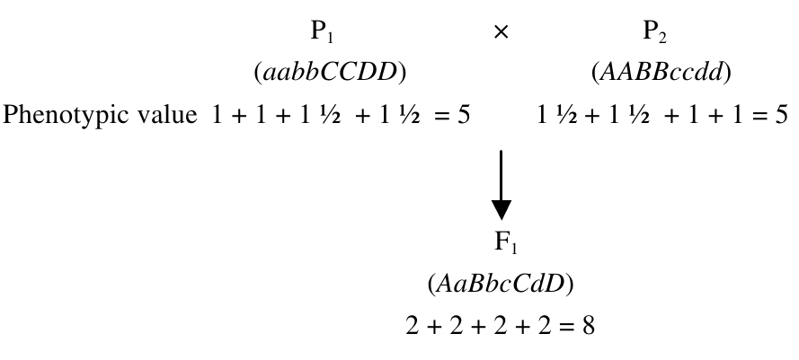

```{r setup, include=FALSE}
library(knitr)
require(tidyverse)
set.seed(453)
# invalidate cache when the package version changes
knitr::opts_chunk$set(tidy = FALSE, echo = FALSE, 
                  message = FALSE, warning = FALSE,
                  out.width = "45%", cache = TRUE, 
                  dev.args=list(bg=grey(0.9), pointsize=11))
options(knitr.table.format = "latex")
options(knitr.kable.NA = "", digits = 2)
options(kableExtra.latex.load_packages = FALSE)
theme_set(theme_bw())
```

# Heterosis and Inbreeding depression

## Inbreeding depression

\footnotesize

- Inbreeding depression is reduction in fitness as a direct result of inbreeding. 
- In theory, the heterosis observed on crossing is expected to be equal to the depression upon inbreeding, considering a large number of crosses between lines derived from a single base population. 
- In practice, plant breeders are interested in heterosis expressed by specific crosses between selected parents, or between populations that have no known common origin.
- Reduction in fitness is usually manifested as a reduction in vigor, fertility, and productivity. 
- The effect is more severe in the early generations (5-8). 
- Plants including onions, sunflower, cucurbits, and rye are more tolerant of inbreeding with minimal consequences of inbreeding depression. 
- Plants such as alfalfa and carrot are highly intolerant of inbreeding.
- A phenotypic measure of inbreeding depression is obtained through generational mean analysis. It is calculated as:

$$
\text{Inbreeding depression (ID)} = \frac{F_1 - F_2}{F_1} \times 100\%
$$

##

- Inbreeding is measured by the **Coefficient of Inbreeding** (**F**), which is the probability of identity of alleles by descent. The range of F is zero (no inbreeding; random mating) to one (prolonged selfing).
- An unfit (deleterious) recessive allele is fairly quickly reduced in frequency but declines slowly thereafter. 
- On the other hand, an unfit dominant allele is rapidly eliminated from the population, while an intermediate allele is reduced more rapidly than a recessive allele because the former is open to selection in the heterozygote.
- The consequence of these outcomes is that unfit dominant or intermediate alleles are rare in cross-breeding populations, while unfit recessive alleles persist because they are protected by their recessiveness.

##

\begin{columns}
\column{0.75\textwidth}
\begin{itemize}
\footnotesize
\item The alleles transmitted with each mating are labelled, $w, x, y~\text{and}~z$. We use "$\sim$" to symbolize IBD. We are interested to calculate the probability that $w$ and $x$ are IBD.
  \begin{itemize}
  \scriptsize
  \item The probability that "C" transmits the copy inherited from A to I, $P(x \sim y)$ = $\frac{1}{2}$
  \item The probability that "B" transmits the copy inherited from A to I, $P(w \sim z)$ = $\frac{1}{2}$
\end{itemize}
\item The probability that $z$ and $y$ are IBD can be through two ways:
  \begin{itemize}
  \scriptsize
  \item First way is when $z$ and $y$ are both the same copy (both pink or blue). This happens $\frac{1}{2}$ of the time since 1/4 of the time they are both blue and 1/4 both pink.
  \item Second way is when $z$ and $y$ are different copies (one pink and the other blue) but individual A was inbred. The probability that A's two copies are IBD is the inbreeding coefficient of A -- $F_A$. The probability that $z$ and $y$ are different copies that are IBD is $\frac{1}{2}\times F_A$.Thus,
  \end{itemize}
\end{itemize}

$$
\small
P(z \sim y) = \frac{1}{2} + \frac{1}{2}F_A
$$
\column{0.25\textwidth}

```{r inbreeding-coefficient-in-half-sibs, fig.cap="\\textbf{Inbreeding for half sibs.} B and C are half sibs who have the same mother, A, but different fathers; B and C have a daughter, I. Notice there is a closed loop from I through B and A and back to I through C. Since I's two copies of the gene trace back to the same copy in her grandmother, her two copies are identical by descent (IBD).", out.width="65%"}

```

\end{columns}

##

- Since, $P(x \sim y), P(w \sim z),~\text{and},~P(z \sim y)$ are independent probabilities, product rule can be used to obtain combined probability.

$$
\begin{aligned}
F_I &= P(x \sim y)\times P(w \sim z) \times P(z \sim y) \\
&= \frac{1}{2} \times \frac{1}{2} \times \left( \frac{1}{2} + \frac{1}{2}F_A \right) \\
&= \left( \frac{1}{2} \right)^3 (1 + F_A)
\end{aligned}
$$

- If $F_A$ for individual A is supposed to be 0, then $F_I = \frac{1}{8}$.
- $\therefore$ Offspring of half-sib mating will be homozygous for alleles that are IBD for at least 1/8 (depending upon $F_A$) of their genes.

##

- In Figure \ref{fig:inbreeding-coefficient} (a) there is no inbreeding because there is no common ancestral pathway to the individual, A (i.e., all parents are different).
- However, in Figure \ref{fig:inbreeding-coefficient} (b) inbreeding exists because B and C have common parents (D and E), that is, they are full sibs.
- To calculate the amount of inbreeding, the standard pedigree is converted to an arrow diagram, as shown in \ref{fig:inbreeding-coefficient} (c). 
- Each individual contributes 1/2 of its genotype to its offspring. The *coefficient of relationship* (R) is calculated by summing up all the pathways between two individuals through a common ancestor as: $R_{BC} = \sum{\left(\frac{1}{2}\right)^s}$ , where s is the number of steps (arrows) from B to the common ancestor and back to C. For example, B and C probably inherited $(1/2)(1/2) = 1/4$ of their genes in common through ancestor D. Similarly, B and C probably inherited 1/4 of their genes in common through ancestor E. 
- The coefficient of relationship between B and C, as a result of common ancestry, is hence $R_{BC} = 1/4 + 1/4 = 1/2 = 50\%$

##

```{r inbreeding-coefficient, fig.cap="Pedigree diagrams can be drawn in the standard form (a, b) or converted to into an arrow diagram (c).", fig.align="center", out.width="45%"}
# pdftools::pdf_convert("./../../references_plb/Principles of Plant Genetics and Breeding.pdf", pages = 64, format = "png", filenames = "./images/arrow_diagram.png", dpi = 300)
knitr::include_graphics("../images/arrow_diagram.png")
```

## Heterosis (Hybrid vigor)

- Hybrid vigor may be defined as the increase in size, vigor, fertility, and overall productivity of a hybrid plant over the mid-parent value (average performance of the two parents). 
- It is calculated as the difference between the crossbred and inbred means:

$$\text{Hybrid vigour} = \frac{F_1-\frac{(P_1+P_2)}{2}}{\frac{(P_1+P_2)}{2}}$$

- The estimate is usually calculated as a percentage.
- The synonymous term, heterosis, was coined by G.H. Shull.
- Advantageous hybrid vigor is observed more frequently when breeders cross parents that are genetically diverse; When two inbred lines of outbred species are crossed.
- The practical definition of heterosis is hybrid vigor that greatly exceeds the better or higher parent in a cross.
- Hybrid breeding in maize quadrupled yields of maize in US between 1930s and 1970s.

## Genetic basis of heterosis

- To explain the genetic basis for why fitness lost on inbreeding tends to be restored upon crossing, two theories have been proposed.
  - Dominance theory: C.G. Davenport in 1908 and later by I.M. Lerner, 
  - Overdominance theory: Shull in 1908 and later by K. Mather and J.L. Jinks. 
- A third theory, the mechanism of epistasis (non-allelic gene interactions), has also been proposed.

## Dominance theory

\footnotesize

- The dominance theory assumes that vigor in plants is conditioned by dominant alleles, recessive alleles being deleterious or neutral in effect.
- It follows: a genotype with more dominant alleles will be more vigorous than one with few dominant alleles.
- Consequently, crossing two parents with complementary dominant alleles will concentrate more favorable alleles in the hybrid than either parent.
- In practice, if too many deleterious alleles are present, it makes it difficult to inbreed to recover sufficient loci with homozygous dominant alleles.
- Inbreeding depression occurs upon selfing because the deleterious recessive alleles that are protected in the heterozygous condition (heterozygous advantage) become homozygous and are expressed.
- Assume that each dominant genotype contributes 2 units to the phenotype, while a recessive genotype contributes 1 unit. A cross between two inbred parents could produce the following outcome:

```{r dominance-theory, fig.align="center", out.width="35%"}
# pdftools::pdf_convert("./../../references_plb/Principles of Plant Genetics and Breeding.pdf", pages = 368, format = "png", filenames = "./images/dominance_theory.png", dpi = 300)

```

## Overdominance theory

\footnotesize

- The phenomenon of the heterozygote being superior to the homozygote is called overdominance (i.e., heterozygosity _per se_ is assumed to be responsible for heterosis).
- Theory assumes that the alleles of a gene (e.g., A, a) are contrasting but each has a different favorable effect in the plant.
- A genotype with more heterozygous loci would be more vigorous than one with less heterozygotes.
- Consider a quantitative trait conditioned by four loci, and assume that recessive, heterozygote, and homozygote dominants contribute 1, 2, and 1.5 units to the phenotypic value, respectively:

```{r overdominance-theory, fig.align="center", out.width="35%"}
# pdftools::pdf_convert("./../../references_plb/Principles of Plant Genetics and Breeding.pdf", pages = 369, format = "png", filenames = "./images/overdominance_theory.png", dpi = 300)

```

## Biometrics of heterosis

1. Better parent heterosis (Heterobeltiosis)
$$Hybrid~vigour = \frac{F_1-Better~parent}{Better~parent}$$
2. Mid parent heterosis
$$Hybrid~vigour = \frac{F_1-\frac{(P_1+P_2)}{2}}{\frac{(P_1+P_2)}{2}}$$
3. Commercial heterosis
$$Hybrid~vigour = \frac{F_1-Commercial~Hybrid}{Commercial~Hybrid}$$

## Types of hybrids

- Commercial applications of hybrid breeding started with a cross of two inbred lines (a single cross - AxB) and later shifted to the more economic double cross, ([AxB]x[CxD]) and then back to a single cross. 
- Other parent combinations in hybrid development have been proposed, including the three-way cross ([AxB]xC) and modified versions of the single cross, in which closely related crosses showed that the single cross was superior in performance to the other two in terms of average yield. 
- However, it was noted also that the genotype x environment interaction (hybrid x environment) variability was more than twice that for the double crosses, while the mean variability for the three-way cross being intermediate.

##

- This indicated that the single crosses were more sensitive or responsive to environmental conditions than the other crosses. 
- Whereas high average yield is important to the producer, consistency in performance across years and locations (i.e., yield stability) is also important. 
- Double and three-way crosses have a more genetically divergent population for achieving buffering. 
- Today commercial hybrids are predominantly single cross, of best combining parental inbred lines.
- For outline of mating scheme, See Lecture 7 on "Hybridization techniques and its consequences" (Course: Introductory plant breeding, $4^{th}$ semester, BScAg). 

## Numerical problem

In blackgram, grain yield of parents ($P_1$ and $P_2$) their $F_1$ and $F_2$ progenies are given below:

```{r}
tribble(
  ~"Parent 1", ~"Parent 2", ~"F1 hybrid", ~"F2 progeny",
  18.94, 22.69, 29.38, 15.18
) %>% 
  kable(booktabs = TRUE) %>% 
  kableExtra::kable_styling(font_size = 6, position = "center")
```

Calculate average heterosis, heterobeltiosis and inbreeding depression.

## Solution

\begin{equation}
\begin{aligned}
\text{Mid parent heterosis} &= \frac{F_1 - MP}{MP} \times 100\% \\
\text{Here, Value of } F_1 &= 29.38 \\
\text{Mean of parents (MP)} &= \frac{18.9+22.69}{2} = 20.81 \\
\text{Mid parent heterosis } &= \frac{29.38-20.81}{20.81} \times 100\% = 41.12\% \\
\text{Heterobeltiosis} &= \frac{F_1-BP}{BP} \times 100\% = \frac{29.38-22.69}{22.69} \times 100\% = 29.48\% \\
\text{Inbreeding depression} &= \frac{F_1-F_2}{F_1} \times 100\% = \frac{29.38-15.18}{15.18} \times 100\%= 48.33\%
\end{aligned}
\nonumber
\end{equation}

# Inheritance of traits

## Background

- The character may be simply inherited or complex inherited with effect of many genes at different loci, each contributing a small effect to phenotypic expression of the character
  1. Qualitative characters
  2. Quantitative characters
  
- Study of inheritance of most characters/phenotypes can be classified into:
  1. Easily distinguished into discrete classes 
    - barley plants may be 
      - black or white hulled 
      - two or six rowed 
      - rough or smooth awned 
      - rust resistanct or rust susceptible

##
      
  2. Cannot be easily classified into discrete classes
    - for grain yield $kg~ha^{-1}$
      - thousand grain weight (gram), 
      - plant height (cm) variation may be differing by small units

## Quantitative inheritance

- Most of the important variation displayed by nearly all plant traits affecting growth, development and reproduction, is quantitative.
- Also called: *Continuous*, *Polygenic variation*, *Multiple gene controlled traits*
- Demonstrate same basic Mendelian properties for a gene, and also the Hardy-Weinberg equilibrium.
- Quantitative characters are governed by several genes; each gene has a small effect, which is usually cumulative.
- The environments considerably affect these characters.
- Quantitative characters often show continuous variation with normal distribution

## Qualitative inheritance

- Mendel purposed the law of inheritance based on his studies with qualitative characters. 
- In the studies of qualitative inheritance, we study phenomena such as:
  1. Dominance, 
  2. Segregation  and independent assortment, 
  3. Gene action and interactions (Epistatis, Masking gene action, Duplicate gene action, Complementary gene action, Additive gene action, Inhibiting gene action, Modifying gene action and Pleiotropy).
  4. Penetrance and expressivity
  5. Linkage

## Difference

```{r quality-quantity-difference}
difference_qualquant <- readxl::read_xlsx("./../data/qualitative_and_quantitative_characters.xlsx", 
                                          sheet = "qual_quant")

knitr::kable(difference_qualquant, 
             caption = "Difference between qualitative and quantitative traits", 
             booktabs = TRUE) %>% 
  kableExtra::kable_styling(position = "center", font_size = 6) %>% 
  kableExtra::column_spec(1:3, width = "12em")
```

# Johanssen's pureline theory

## Pureline theory

- Johannsen demonstrated that a mixed population of self-pollinated species could be sorted out into genetically pure lines.
- These lines were subsequently non-responsive to selection within each of them.
- Lines that are genetically different may be successfully isolated from within a population of mixed genetic types.
- Any variation that occurs within a pure line is not heritable but due to environmental factors only. Consequently, as Johansen's bean study showed, further selection within the line is not effective.

##

```{r johannsens-purelines, fig.cap="Johannsen's observation of Phaseolus bean shed light on Pureline theory", fig.align="center", out.width="45%"}
# pdftools::pdf_convert("../../literatures/plant_breeding/Principles of Plant Genetics and Breeding.pdf", pages = 317, 
#                       format = "png", 
#                       filenames = "../images/johannsens_purlines.png", dpi = 300)

```

##

- Lines are used
  - as cultivars or as parents in hybrid production (inbred lines).
  - in the development of genetic stock (containing specific genes such as disease resistance, nutritional quality) and synthetic and multiline cultivars.
- Line cultivars have a very narrow genetic base and tend to be uniform in traits of interest (e.g., height, maturity).

## Application

- Cultivars for mechanized production that must meet a certain specification for uniform operation by farm machines (e.g., uniform maturity, uniform height for uniform location of economic part).
- Cultivars developed for a discriminating market that puts a premium on eye-appeal (e.g., uniform shape, size).
- Cultivars for the processing market (e.g., with demand for certain canning qualities, texture).
- Advancing "sports" that appear in a population (e.g., a mutant flower for ornamental use).
- Improving newly domesticated crops that have some variability.
- The pure-line selection method is also an integral part of other breeding method,s such as the pedigree selection and bulk population selection.

## Overview

- The pure-line selection in breeding entails repeated cycles of selfing following the initial selection from a mixture of homozygous lines. 
- Natural populations of self-pollinated species consist of mixtures of homozygous lines with transient heterozygosity originating from mutations and outcrossing.
- Steps:
  - Year 1: The first step is to obtain a variable base population (e.g., introductions, segregating populations from crosses, land race) and space plant it in the first year, select, and harvest desirable individuals.
  - Year 2: Grow progeny rows of selected plants. Rogue out any variants. Harvest selected progenies individually. These are experimental strains.
  - Year 3-6: Conduct preliminary yield trials of the experimental strains including appropriate check cultivars.
  - Year 7-10: Conduct advanced yield trials at multilocations. Release highest yielding line as new cultivar.

##

```{r pureline-selection, fig.cap="Generalized steps in breeding by pure-line selection", fig.align="center", out.width="45%"}
# pdftools::pdf_convert("./../../references_plb/Principles of Plant Genetics and Breeding.pdf", pages = 318, format = "png", filenames = "./images/pureline_selection.png", dpi = 300)

```

## Genetic issues

- Pure-line breeding produces cultivars with a narrow genetic base and, hence, that are less likely to produce stable yields over a wider range of environments. Such cultivars are more prone to being wiped out by pathogenic outbreaks.
- Pure-line cultivars depend primarily on phenotypic plasticity for production response and stability across environments.

## Advantages

- It is a rapid breeding method.
- The method is inexpensive to conduct. The base population can be a landrace. The population size selected is variable and can be small or large, depending on the objective.
- The cultivar developed by this method has great "eye appeal" (because of the high uniformity of, e.g., harvesting time, height, etc.).

## Disadvantages
- The purity of the cultivar may be altered through admixture, natural crossing with other cultivars, and mutations. Such off-type plants should be rogued out to maintain cultivar purity.
- The cultivar has a narrow genetic base and, hence, is susceptible to devastation from adverse environmental factors because of uniform response.
- A new genotype is not created. Rather, improvement is limited to the isolation of the most desirable or best genotype from a mixed population.
- The method promotes genetic erosion because most superior pure lines are identified and multiplied to the exclusion of other genetic variants.
- Progeny rows takes up more resources (time, space, funds).

# Polygenes in discontinuous traits

## 

- Polygenes are genes with effects that are too small to be individually distinguished. They are sometimes called **minor genes**
- Most of the important variation displayed by nearly all plant traits affecting growth, development and reproduction, is quantitative (continuous or polygenic variation; controlled by many genes).
- Polygenes demonstrate the same properties in terms of dominance, epistasis, and linkage as classical Mendelian genes.

##

- In many cases discontinuous or stepwise distinction between phenotypes inevitably accompany measurements for a praticular characteristic.
- For example, the number of vertebrae in some species of chordates may differ between individuals, but the difference is generally classified on the basis of whole numbers of vertebrae, or, as in resistance to disease, the character is expressed in an "all or none" fashion.
- Such characters may nevertheless be influenced by numerous polygenes.

##

- Polygenes and their expression of discontinuous characters comes about through the establishment of "thresholds." Expression of particular phenotypes of polygenic genotypes occur only when the genotypes have values above this threshold.
- Thus, although there is superficial discontinuous phenotypic distribution, there underlies a continuous polygenic distribution.
- Wright first demonstrated the **relationship between two scales** in crosses between strains of guinea pigs, that differed from each other in the **number of toes on the hind leg**.

##

- One strain (number 2) had the normal three toes on hind leg, and the other (D) was polydactylous, with four toes.
- Their $F_1$ offspring were 3 toed, as expected.
- In $F_2$, however, ratio of $\text{Three toed: Four toed } \simeq 3:1$ (188:45 individuals).
- It seems as if these crosses were segregating for only a single gene difference in the $F_2$. This was further corroborated by the testcross results.
- In the testcross however, one gene hypothesis was evidently disproved with the observation that three-toed parental type was not heterozygous.
- On the contrary, wright found that backcrossing these three-toed "heterozygotes" to the four-toed stock resulted in 77 percent four-toed to 23 percent three-toed offspring.

##

- With support of other evidence, wright proposed that polydactyly is affected by four pair of polygens (8 alleles). 
- Individuals which had about five or more polydactylous alleles out of eight had exceeded the "threshold" and appeared as four toed.
- Initial four toed stock was therefore entirely of this type.
- Since parental three-toed stock had its polygenic distribution centered far below the threshold, $F_1$ hybrids were mostly three toed.

##

\renewcommand{\arraystretch}{2}

```{r gamete-three-combination}
# gamete types
gamete_types <- expand.grid(c("A", "a"), 
                            c("B", "b"), 
                            c("C", "c"), 
                            c("D", "d")) %>% 
  unite(col = "gamete_types", sep = "") %>% 
  pull("gamete_types")

# random mating of gametes
combination_genotypes <- crossing(gamete_types1 = gamete_types, gamete_types) %>% 
  # group_by(gamete_types)
  unite(col = "genotype", remove = FALSE, sep = "") %>% 
  spread(key = gamete_types1, value = genotype)

genotype_orderer <- function(x){
  map_chr(x, function(y){
    str_extract_all(y, "") %>% 
      unlist() %>% 
      str_sort(decreasing = FALSE) %>% 
      paste0(collapse = "")
  })
}

combination_genotypes <- combination_genotypes %>% 
  mutate_all(list(~genotype_orderer(.)))

# # number of unique genotypes
# ca <- c("AA", "Aa", "aa")
# cb <- c("BB", "Bb", "bb")
# cc <- c("CC", "Cc", "cc")
# unique_genotypes <- expand.grid(ca, cb, cc) %>% 
#   unite(col = "all_gametes", sep = "") %>% 
#   pull(all_gametes) %>% 
#   unique()

# manually specify colors
two_colors <- c("#802acc", "#a8a035")

fanta <- function(x)(stringi::stri_extract_all_regex(x, ".") %>%
                       map(unlist) %>%
                       map_int(~str_detect(.x, "[a-z]") %>%
                                 sum()))
combination_genotypes %>%
  rename("Gamete types" = gamete_types) %>% 
  mutate_at(2:17, list(~case_when(
    fanta(.) < 5 ~ kableExtra::cell_spec(., "latex", background = two_colors[1]),
    fanta(.) > 5 | fanta(.) == 5 ~ kableExtra::cell_spec(., "latex", background = two_colors[2]),
    TRUE ~ .
  ))) %>%
  kable(booktabs = TRUE, format = "latex", escape = FALSE, linesep = "") %>%
  kableExtra::kable_styling(latex_options = "scale_down", font_size = 6)

```

\renewcommand{\arraystretch}{1}

# Heritability [@brown2014plantbreeding]

## Meaning

- To make economically meaningful progress in an organized programme of selective breeding, two conditions must be met;
  - There must be some observable phenotypic variation within the crop. This would normally be expected, even if it were due entirely to the effects of a variable environment.
  - At least some of this phenotypic variation must have a genetic basis.
- This leads to the concept of heritability ($h^2$), which is the proportion of phenotypic variance that is genetic in origin.
- The values of $h^2$ can range from 0 to 1. If $h^2$ is close to zero, there will be little scope for advancement and there would be little point in trying to improve this character in a plant breeding program. 
- There are three main ways of estimating heritability:
  1. Carrying out particular genetic crosses and observing the performance of their progeny so that the resulting data can be partitioned into genetic and environmental components.
  2. Based on the direct measurement of the degree of resemblance between offspring and one, or both, of their parents. This is achieved by regression of the former onto the latter in the absence of selection.
  3. Measuring the response of a population to given levels of selection.

## Genetics of heritability

- Dominance model of quantitative inheritance dictates that total genetic variance will contain dominance genetic variance (denoted by $V_D$) and additive genetic variance (denoted by $V_A$). 
- Dominance genetic variance is variation caused by heterozygotes loci in the individuals in the population, whereas additive genetic variance is the variation existing between homozygous loci in the segregating population.

## Broad sense heritability

- The total genetic varinace divided by the total phenotypic variance is Broad-sense heritability ($h_b^2$). 
- This estimation uses the total genetic variance in a additive-dominance model, while the total phenotypic variance is obtained by adding environmental variance to this genetic variance.

$$
h_b^2 = \frac{V_A + V_D}{V_A + V_D + V_E}
\tag{i}
$$

- Dominant genetic variance will be dependent upon the degree of heterozygosity in the population and will differ between fillial generations.

## Narrow sense heritability

- A more useful form of heritability for plant breeders, therefore, is *narrow-sense heritability* ($h_n^2$), which is:

$$
h_n^2 = \frac{V_A}{V_A+V_D+V_E}
\tag{ii}
$$

## Dominance and additive effects

- Reason for why lack of resemblance between parents and their offspring should be attributable to dominance but not additive components
  - Dominance effects are a feature of particular genotypes; but genotypes are 'made' and 'unmade' between generations as a result of genetic segregation during the production of gametes. 
  - Thus, the mean dominance effect in the offspring of a particular cross can be different from that of the parents, even when there is no selection. 
- However, additive genetic variance is constant between filial generations, and so narrow-sense heritability of recombinant inbred lines can be estimated from early-generation segregating families.

## Variance partitioning of filial generation

- In the first filial generation ($F_1$), after hybridization between two homozygous parents, there is not genetic variance between individuals of a progeny (they will be genetically alike) and all the variation observed between $F_1$ plants will be entirely environmental. 
- In the generation following ($F_2$ and forth) there are both genetic and environmental components of phenotypic variance.
- The genetic variance of the $F_2$ generation is:

$$
\sigma_{\bar{F_2}}^2 = \frac{1}{2}V_A + \frac{1}{4}V_D + \sigma_E^2
$$

- Thus broad sense heritability of the $F_2$ generation is:

$$
h_b^2 = \frac{\frac{1}{2}V_A + \frac{1}{4}V_D}{\frac{1}{2}V_A + \frac{1}{4}V_D + \sigma_E^2}
\tag{iii}
$$

##

In simple terms, to estimate the $h_b^2$ of $F_2$ family (or any other segregating family), only following estimates are required:

1. Total phenotypic variance (Obtained from measurement on plants within $F_2$ families)
2. Environmental variance (Obtained from measurement on $F_1$ families)

## Problem

Consider a field experiment with an inbreeding species such as wheat or barley. Parent 1 included 20 plants, Parent 2 included 20 plants and $F_2$ family derived from selfing of $F_1$ generation, which was obtained by intercrossing the two parents (i.e. Parent 1 x Parent 2), consisted of 100 individuals. These 140 plants were completely randomized within the experiment, and at harvest the weight of seeds from each plant was recorded. The variances in seed weight of the two parents were $\sigma_{\bar{P_1}}^2 = 16.8~kg^2$ and $\sigma_{\bar{P_2}}^2 = 18.4~kg^2$. The phenotypic variance (which included both genetic and environmental variation) of the $F_2$ was $\sigma_{\bar{F_2}}^2 = 56.9~kg^2$. The total phenotypic varinace of the $F_2$ generation is represented by denominator term of $h_b^2$ is estimated to be $56.9 kg^2$.

But the problem is what is the value of environmental component of the phenotypic variance $\sigma_E^2$?

## Solution

It now follows that the $h_b^2$, from given inform is:

$$
h_b^2 = \frac{56.9-\sigma_E^2}{56.9}
$$

Since, both parents are homozygous inbreds, any variance displayed by either must be attributable exclusively to the environment. The best esimate of the $\sigma_E^2$ is therefore:

$$
\begin{aligned}
\sigma_E^2 &= \frac{\sigma_{\bar{P_1}}^2 + \sigma_{\bar{P_2}}^2}{2} \\
&= \frac{16.8 + 18.4}{2} = 17.6~kg^2
\end{aligned}
$$

##

And, therefore,

$$
h_b^2=\frac{56.9-17.6}{56.9} = 0.691
$$
Thus 69.1% of the phenotypic variance of the $F_2$ generation is estimated to be genetic in origin.

## Partitioning environmental variance

The other generation in which the phenotypic variance is also entirely attributable to environmental effects is the $F_1$. On the other hand, if the phenotypic variances of all these three generations were available, the environmental component of the phenotypic variance of the $F_2$ generation could be estimated as follows (in a simplified way):

$$
\sigma_E = \frac{\sigma_{\bar{P_1}}^2 + 2\sigma_{\bar{F_1}}^2 + \sigma_{\bar{P_2}}^2}{4}
\tag{iv}
$$

## Partitioning genetic variance

The ratio of additive genetic variance to total phenotypic variance is called the narrow-sense heritability.

$$
h_n^2 = \frac{\frac{1}{2}V_A}{\frac{1}{2}V_A + \frac{1}{4}V_D + \sigma_E^2}
\tag{v}
$$

In order to estimate $h_n^2$, it is therefore necessary to partition the genetic variance into its two components ($V_A$ and $V_D$). This is done by considering the phenotypic variance of the two backcross families ($\sigma_{\bar{B_1}}^2$ and $\sigma_{\bar{B_2}}^2$).

##

The expected variances of $\sigma_{\bar{B_1}}^2$ and $\sigma_{\bar{B_2}}^2$ are:

$$
\begin{aligned}
\sigma_{\bar{B_1}}^2 = \frac{1}{4}V_A + \frac{1}{4}V_D - \frac{1}{2}\left[\sum(a)\times\sum(d)\right] + \sigma_E^2 \\
\sigma_{\bar{B_2}}^2 = \frac{1}{4}V_A + \frac{1}{4}V_D + \frac{1}{2}\left[\sum(a)\times\sum(d)\right] + \sigma_E^2
\end{aligned}
$$
Note the sign before expression $\frac{1}{2}\left[\sum(a)\times\sum(d)\right]$. Adding together the equations,

$$
\sigma_{\bar{B_1}}^2 + \sigma_{\bar{B_2}}^2 = \frac{1}{2}V_A + \frac{1}{2}V_D + 2\sigma_E^2
\tag{vi}
$$

##

From the relationship we addressed earlier of $\sigma_{\bar{F_2}}^2$ in terms of variance components, provided that numerical values for $\sigma_{\bar{B_1}}^2$ and $\sigma_{\bar{B_2}}^2$ can be estimated, we have sufficient information to calculate both $V_A$ and $V_D$, and hence the $h_n^2$.

$$
\begin{aligned}
\sigma_{\bar{B_1}}^2 + \sigma_{\bar{B_2}}^2 - \sigma_{\bar{F_2}}^2 &= \frac{1}{2}V_A + \frac{1}{2}V_D + 2\sigma_E^2 - \left(\frac{1}{2}V_A + \frac{1}{4}V_D + \sigma_E^2\right) \\
&= \frac{1}{4}V_D + \sigma_E^2
\end{aligned}
$$

Therefore,

$$
V_D = 4\left(\sigma_{\bar{B_1}}^2 + \sigma_{\bar{B_2}}^2 - \sigma_{\bar{F_2}}^2 - \sigma_E^2 \right)
\tag{vii}
$$

## Problem

A properly designed glasshouse experiment was carried out using the garden pea. Progeny from the $F_1$, $F_2$ and both backcross families ($B_1$ and $B_2$) were arranged as single plants in a completely randomized block design, and plant height recorded after flowering. The following variances were calculated from the recorded data:

$$
\begin{aligned}
\sigma_{\bar{B_1}}^2 &= 285~cm^2; & \sigma_{\bar{B_2}}^2 &= 251~cm^2; \\
\sigma_{\bar{F_2}}^2 &= 358 cm^2; & \sigma_E^2 &= 155 cm^2
\end{aligned}
$$

Calculate $h_b^2$ and $h_n^2$.

## Solution

- Variance based approaches - ratio of variance estimates: 

$$
\begin{aligned}
h_{bs}^2 &= \frac{V_G}{V_P} \\ 
h_{ns}^2 &= \frac{V_A}{V_P}
\end{aligned}
$$

- Mean based approaches: 
  - realized heritability: $h^2 = \frac{R}{S}$
  - Six generation mean analysis method

## Parent offspring regression

- This method is based on how much does the resemblance parents and offspring exist. 
- If there is perfect resemblance between parents and offspring, then, $b = 1$ and there is perfect heritable genetic effect. 
- On contrary if there is no resemblance between parents and offspring $b = 0$, and there is no heritable effect but variation is only due to environment.

- Therefore, narrow sense heritability ( $h_{ns}$ )

$$b= h_{ns}^2 = \frac{V_A}{V_P}$$

##

- If only one parent is known (animal experiments or polycrosses)

$$
\begin{aligned} 
b &= \frac{1}{2}.\frac{V_A}{V_P} \\ 
h_{ns}^2 &= 2b 
\end{aligned}
$$

$b$ = slope of parent offspring regression line

# Numerical problems

##

1. Two pure lines of rice are crossed. In the $F_1$ the variance in spike length is 1.5. The F1 is selfed. In the $F_2$ the variance in spike length is 4.5. Estimate broad sense heritability of spike length in rice

2. The phenotypic variance of yield in maize 200 $kg^2$ per acre. The variance within an inbred line is 80. The regression of offspring phenotype on mid parent values is 0.32. Find additive variance, genetic variance, environmental variance, narrow sense heritability and broad sense heritability. 

## 

3. Estimate heritability through parent offspring regression method from the following available data.

```{r question3}
question_3 <- readxl::read_xlsx("../data/qualitative_and_quantitative_characters.xlsx", "question3") 

question_3 %>% 
  knitr::kable(booktabs = TRUE) %>% 
  kableExtra::kable_styling(font_size = 6)
```

##

4. Suppose 2 inbred lines A and B are crossed to produce hybrid. The genotype of A is AAbbccDDEEFF and the genotype of B is aaBBCCddeeFF. A, B, C, D, E and F are the dominant genes. If dominant homozygote contributes 2 $ton~ha^{-1}$, recessive homozygote contributes 1 $ton~ha^{-1}$ and heterozygote contributes 2.5 $ton~ha^{-1}$, Find the grain yields of Parent A, Parent B and $F_1$ hybrid on the basis of dominance and over-dominance hypothesis.

## Solution

**Question 3**

```{r}
question_3_mod <- lm(`Individual offspring (Y)`~`Mid parent value (X)`, data = question_3) %>% 
  broom::tidy() 

question_3_mod %>% 
  kable(booktabs = TRUE)

question_3 %>% 
  ggplot(aes(x = `Mid parent value (X)`, y = `Individual offspring (Y)`)) +
  geom_point() +
  geom_smooth(method = "lm", se = FALSE) +
  scale_x_continuous(limits = c(0, 25)) +
  scale_y_continuous(limits = c(0, 28))
```


# Bibliography

## References
